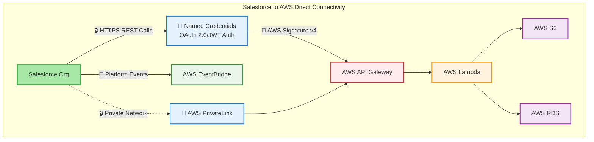
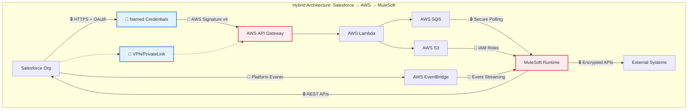
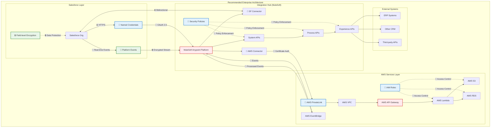

# Salesforce Integration Architectures with Security

## 1. Salesforce to AWS Direct Connectivity

## 2. Salesforce to MuleSoft Direct Connectivity

```mermaid
graph TB
    subgraph SF_MS["Salesforce to MuleSoft Direct Connectivity"]
        SF2[Salesforce Org]
        NC2["🔐 Named Credentials<br/>OAuth 2.0 Auth"]
        MS1[MuleSoft Anypoint Platform]
        SFC["🔗 Salesforce Connector"]
        API1[System APIs]
        API2[Process APIs]
        API3[Experience APIs]
        DB1[External Database]
        
        SF2 -->|"🔒 HTTPS"| NC2
        NC2 -->|"🔐 OAuth 2.0/JWT"| MS1
        MS1 --> SFC
        SFC --> API1
        API1 --> API2
        API2 --> API3
        API3 --> DB1
        SF2 <-->|"🔔 Platform Events"| MS1
    end
    
    %% Enhanced color coding by service layer and type
    classDef salesforce fill:#a7e8a7,stroke:#4caf50,stroke-width:3px
    classDef security fill:#ffebee,stroke:#d32f2f,stroke-width:2px
    classDef auth fill:#e3f2fd,stroke:#1976d2,stroke-width:2px
    classDef integration fill:#fff3e0,stroke:#ff9800,stroke-width:2px
    classDef connector fill:#e1f5fe,stroke:#0288d1,stroke-width:2px
    classDef api_system fill:#fce4ec,stroke:#ad1457,stroke-width:2px
    classDef api_process fill:#f1f8e9,stroke:#689f38,stroke-width:2px
    classDef api_experience fill:#fff8e1,stroke:#fbc02d,stroke-width:2px
    classDef external fill:#f5f5f5,stroke:#616161,stroke-width:2px
    
    class SF2 salesforce
    class NC2 auth
    class MS1 integration
    class SFC connector
    class API1 api_system
    class API2 api_process
    class API3 api_experience
    class DB1 external
```

## 3. Hybrid Architecture: Salesforce → AWS → MuleSoft

## 4. Recommended Enterprise Architecture

## Color Coding & Security Legend

### Service Layer Color Classification

| Color | Service Type | Description |
|-------|-------------|-------------|
| 🟢 Green | Salesforce | Core Salesforce platform services |
| 🔵 Blue | Authentication | Security and authentication components |
| 🔴 Red | API Gateway | Entry points and security enforcement |
| 🟠 Orange | Compute/Integration | Processing and integration services |
| 🟣 Purple | Storage | Data storage and persistence layers |
| 🟢 Light Green | Events | Event streaming and messaging |
| 🔷 Light Blue | Connectors | Integration connectors and adapters |
| 🟤 Pink/Red Variants | API Layers | System, Process, and Experience APIs |
| ⚪ Gray | External | Third-party and external systems |

### Security Considerations Legend

| Symbol | Security Type | Description |
|--------|--------------|-------------|
| 🔐 | Authentication | Named Credentials, OAuth 2.0/JWT, Certificate Auth |
| 🔒 | Encryption | HTTPS, TLS/SSL, Field-level encryption |
| 🔔 | Event Security | Platform Events, Event streaming |
| 🔗 | Connectors | Secure API connections |

## Architecture Summary

### **Salesforce to AWS Direct**
- Direct REST API calls with Named Credentials
- AWS PrivateLink for enhanced security
- Platform Events for real-time streaming

### **Salesforce to MuleSoft Direct**
- Native Salesforce connector with OAuth 2.0
- Bidirectional API integration
- Platform Events for event-driven patterns

### **Hybrid Architecture**
- Multi-hop integration through AWS and MuleSoft
- Event-driven with SQS and EventBridge
- VPN/PrivateLink security perimeter

### **Recommended Enterprise Architecture**
- **MuleSoft as central integration hub**
- **AWS PrivateLink** for secure AWS connectivity
- **Platform Events** for real-time integration
- **Layered security** with multiple enforcement points

## Key Benefits

- ✅ **Scalability**: Cloud-native architecture
- ✅ **Security**: Multiple layers of protection
- ✅ **Maintainability**: Clear separation of concerns
- ✅ **Real-time**: Event-driven capabilities
- ✅ **Enterprise-ready**: Comprehensive monitoring and governance