# Salesforce Integration Architectures with Security

## 1. Salesforce to AWS Direct Connectivity

```mermaid
graph TB
    subgraph SF_AWS["Salesforce to AWS Direct Connectivity"]
        SF1[Salesforce Org]
        NC1["🔐 Named Credentials<br/>OAuth 2.0/JWT Auth"]
        AG1[AWS API Gateway]
        L1[AWS Lambda]
        S3_1[AWS S3]
        RDS1[AWS RDS]
        EB1[AWS EventBridge]
        PL1["🔐 AWS PrivateLink"]
        
        SF1 -->|"🔒 HTTPS REST Calls"| NC1
        NC1 -->|"🔐 AWS Signature v4"| AG1
        AG1 --> L1
        L1 --> S3_1
        L1 --> RDS1
        SF1 -->|"🔔 Platform Events"| EB1
        SF1 -.->|"🔒 Private Network"| PL1
        PL1 --> AG1
    end
    
    %% Enhanced color coding by service layer and type
    classDef salesforce fill:#a7e8a7,stroke:#4caf50,stroke-width:3px
    classDef security fill:#ffebee,stroke:#d32f2f,stroke-width:2px
    classDef auth fill:#e3f2fd,stroke:#1976d2,stroke-width:2px
    classDef compute fill:#fff3e0,stroke:#ff9800,stroke-width:2px
    classDef storage fill:#f3e5f5,stroke:#9c27b0,stroke-width:2px
    classDef events fill:#e8f5e8,stroke:#388e3c,stroke-width:2px
    
    class SF1 salesforce
    class NC1,PL1 auth
    class AG1 security
    class L1 compute
    class S3_1,RDS1 storage
    class EB1 events
```

## 2. Salesforce to MuleSoft Direct Connectivity

```mermaid
graph TB
    subgraph SF_MS["Salesforce to MuleSoft Direct Connectivity"]
        SF2[Salesforce Org]
        NC2["🔐 Named Credentials<br/>OAuth 2.0 Auth"]
        MS1[MuleSoft Anypoint Platform]
        SFC["🔗 Salesforce Connector"]
        API1[System APIs]
        API2[Process APIs]
        API3[Experience APIs]
        DB1[External Database]
        
        SF2 -->|"🔒 HTTPS"| NC2
        NC2 -->|"🔐 OAuth 2.0/JWT"| MS1
        MS1 --> SFC
        SFC --> API1
        API1 --> API2
        API2 --> API3
        API3 --> DB1
        SF2 <-->|"🔔 Platform Events"| MS1
    end
    
    %% Enhanced color coding by service layer and type
    classDef salesforce fill:#a7e8a7,stroke:#4caf50,stroke-width:3px
    classDef security fill:#ffebee,stroke:#d32f2f,stroke-width:2px
    classDef auth fill:#e3f2fd,stroke:#1976d2,stroke-width:2px
    classDef integration fill:#fff3e0,stroke:#ff9800,stroke-width:2px
    classDef connector fill:#e1f5fe,stroke:#0288d1,stroke-width:2px
    classDef api_system fill:#fce4ec,stroke:#ad1457,stroke-width:2px
    classDef api_process fill:#f1f8e9,stroke:#689f38,stroke-width:2px
    classDef api_experience fill:#fff8e1,stroke:#fbc02d,stroke-width:2px
    classDef external fill:#f5f5f5,stroke:#616161,stroke-width:2px
    
    class SF2 salesforce
    class NC2 auth
    class MS1 integration
    class SFC connector
    class API1 api_system
    class API2 api_process
    class API3 api_experience
    class DB1 external
```

## 3. Hybrid Architecture: Salesforce → AWS → MuleSoft

## 4. Recommended Enterprise Architecture

```mermaid
graph TB
    subgraph REC["Recommended Enterprise Architecture"]
        subgraph SF_LAYER["Salesforce Layer"]
            SF4[Salesforce Org]
            PE["🔔 Platform Events"]
            NC4["🔐 Named Credentials"]
            FLE["🔒 Field-level Encryption"]
        end
        
        subgraph MS_LAYER["Integration Hub (MuleSoft)"]
            MS3[MuleSoft Anypoint Platform]
            SFC2["🔗 SF Connector"]
            AWSC["🔗 AWS Connector"]
            SAPI[System APIs]
            PAPI[Process APIs]
            EAPI[Experience APIs]
            SEC["🔐 Security Policies"]
        end
        
        subgraph AWS_LAYER["AWS Services Layer"]
            PL2["🔐 AWS PrivateLink"]
            VPC2[AWS VPC]
            AG3[AWS API Gateway]
            L3[AWS Lambda]
            S3_3[AWS S3]
            RDS2[AWS RDS]
            EB3[AWS EventBridge]
            IAM["🔐 IAM Roles"]
        end
        
        subgraph EXT_LAYER["External Systems"]
            ERP[ERP Systems]
            CRM[Other CRM]
            API4[Third-party APIs]
        end
        
        SF4 -->|"🔔 Real-time Events"| PE
        PE -->|"🔒 Encrypted Stream"| MS3
        SF4 -->|"🔒 HTTPS"| NC4
        NC4 -->|"🔐 OAuth 2.0"| MS3
        
        MS3 --> SFC2
        MS3 --> AWSC
        SFC2 <-->|"🔒 Bidirectional"| SF4
        
        AWSC -->|"🔐 Certificate Auth"| PL2
        PL2 --> VPC2
        VPC2 --> AG3
        AG3 --> L3
        L3 --> S3_3
        L3 --> RDS2
        
        MS3 --> SAPI
        SAPI --> PAPI
        PAPI --> EAPI
        EAPI --> ERP
        EAPI --> CRM
        EAPI --> API4
        
        EB3 -->|"🔔 Events"| MS3
        MS3 -->|"🔔 Processed Events"| EB3
        
        SEC -.->|"🔐 Policy Enforcement"| SAPI
        SEC -.->|"🔐 Policy Enforcement"| PAPI
        SEC -.->|"🔐 Policy Enforcement"| EAPI
        IAM -.->|"🔐 Access Control"| L3
        IAM -.->|"🔐 Access Control"| S3_3
        IAM -.->|"🔐 Access Control"| RDS2
        FLE -.->|"🔒 Data Protection"| SF4
    end
    
    classDef security fill:#ffebee,stroke:#d32f2f,stroke-width:2px
    classDef encryption fill:#e8f5e8,stroke:#388e3c,stroke-width:2px
    classDef auth fill:#e3f2fd,stroke:#1976d2,stroke-width:2px
    
    class NC4,PL2,IAM,SEC auth
    class FLE,PE encryption
    class AG3,MS3 security
```

## Security Considerations Legend

| Symbol | Security Type | Description |
|--------|--------------|-------------|
| 🔐 | Authentication | Named Credentials, OAuth 2.0/JWT, Certificate Auth |
| 🔒 | Encryption | HTTPS, TLS/SSL, Field-level encryption |
| 🔔 | Event Security | Platform Events, Event streaming |
| 🔗 | Connectors | Secure API connections |

## Architecture Summary

### **Salesforce to AWS Direct**
- Direct REST API calls with Named Credentials
- AWS PrivateLink for enhanced security
- Platform Events for real-time streaming

### **Salesforce to MuleSoft Direct**
- Native Salesforce connector with OAuth 2.0
- Bidirectional API integration
- Platform Events for event-driven patterns

### **Hybrid Architecture**
- Multi-hop integration through AWS and MuleSoft
- Event-driven with SQS and EventBridge
- VPN/PrivateLink security perimeter

### **Recommended Enterprise Architecture**
- **MuleSoft as central integration hub**
- **AWS PrivateLink** for secure AWS connectivity
- **Platform Events** for real-time integration
- **Layered security** with multiple enforcement points

## Key Benefits

- ✅ **Scalability**: Cloud-native architecture
- ✅ **Security**: Multiple layers of protection
- ✅ **Maintainability**: Clear separation of concerns
- ✅ **Real-time**: Event-driven capabilities
- ✅ **Enterprise-ready**: Comprehensive monitoring and governance