# Salesforce Data Cloud Architecture: Software Engineering Fundamentals through Design Patterns

## 📊 **Understanding O(n) Cost Complexity**

**O(n) notation** describes how costs (time, resources, money) scale with input size:

- **O(1)** = Constant cost regardless of data size (ideal)
- **O(n)** = Cost grows linearly with data size
- **O(n²)** = Cost grows quadratically (avoid in production)

### Real-World Cost Examples:

**Traditional API Integration (O(n) costs):**
```
1 customer record = 1 API call = 1 unit cost
1,000 customers = 1,000 API calls = 1,000 units cost
1,000,000 customers = 1,000,000 API calls = 1,000,000 units cost
```

**Data Cloud Bulk Operations (Amortized O(1) costs):**
```
IMPORTANT: This is NOT true O(1) - it's amortized constant cost per record

Batch of 1 record = 1 bulk operation = High setup cost + 1 record processing
Batch of 1,000 records = 1 bulk operation = Same setup cost + 1,000 record processing  
Batch of 1,000,000 records = 1 bulk operation = Same setup cost + 1,000,000 record processing

The "O(1)" claim refers to the SETUP COST being constant, not the total processing cost.
```

**Technical Reality:**
- **Setup Cost**: O(1) - Connection establishment, authentication, metadata validation
- **Processing Cost**: O(n) - Each record still needs individual processing 
- **Network Cost**: O(1) - Single network round-trip regardless of batch size
- **Total Cost**: O(1) setup + O(n) processing = **O(n) overall, but with much lower constant factor**

**Why Bulk is Better (Honest Explanation):**
```
Traditional API: High per-request overhead × n requests = Expensive
Bulk Operations: High setup cost ÷ n records = Amortized efficiency

Example:
- API Setup Cost: 100ms per call
- Processing Cost: 1ms per record

Traditional: (100ms + 1ms) × 1,000 = 101,000ms total
Bulk: 100ms + (1ms × 1,000) = 1,100ms total

Savings: 92% reduction in total time, NOT because it's O(1)
```

### 🔬 **Deep Technical Analysis: Why "O(1)" Claims Are Misleading**

#### **The Truth About Computational Complexity in Data Integration:**

**1. True O(1) Operations (Constant Time):**
```python
# These are actually O(1)
hash_table_lookup = customer_map["CUST-123"]  # O(1)
array_index_access = customers[42]             # O(1)
cache_hit = memory_cache.get("profile_123")   # O(1)
```

**2. What Data Cloud Actually Does (O(n) with Lower Constants):**
```python
# This is still O(n), just optimized
def bulk_process_customers(customer_batch):
    # O(1) - Setup costs (same regardless of batch size)
    connection = establish_db_connection()      # 50ms
    transaction = begin_transaction()           # 10ms
    validate_schema()                          # 5ms
    
    # O(n) - Still need to process each record
    for customer in customer_batch:            # n iterations
        transform_data(customer)               # 0.1ms per record
        validate_business_rules(customer)      # 0.2ms per record  
        write_to_storage(customer)            # 0.5ms per record
    
    # O(1) - Cleanup costs
    commit_transaction()                       # 5ms
    close_connection()                         # 5ms
    
    # Total: 75ms setup + (0.8ms × n) processing
```

**3. The Real Advantage - Amortized Cost Analysis:**

| Records | Traditional API | Data Cloud Bulk | Savings |
|---------|----------------|------------------|---------|
| **1** | 101ms × 1 = 101ms | 75ms + 0.8ms = 75.8ms | 25% |
| **100** | 101ms × 100 = 10,100ms | 75ms + 80ms = 155ms | **98.5%** |
| **10,000** | 101ms × 10,000 = 1,010,000ms | 75ms + 8,000ms = 8,075ms | **99.2%** |

**4. Why Marketing Claims "O(1)" (It's About Cost Structure):**
```
Traditional: Cost = n × (setup + processing)
Bulk: Cost = setup + (n × processing)

As n grows:
- Traditional cost grows as: 101n
- Bulk cost grows as: 75 + 0.8n

The setup cost (75) becomes negligible compared to processing (0.8n)
So the PRACTICAL cost per record approaches 0.8, which feels "constant"
```

#### **Real-World Constraints That Break the O(1) Myth:**

**1. Memory Constraints:**
```python
# You can't actually process infinite records in one batch
MAX_BATCH_SIZE = 10000  # Memory limit
large_dataset = 1_000_000_records

# Need multiple batches = O(n/batch_size) operations
num_batches = large_dataset / MAX_BATCH_SIZE  # 100 batches
total_cost = num_batches × (setup_cost + batch_processing_cost)
# This is definitely O(n), not O(1)
```

**2. Network Timeouts:**
```python
# Larger payloads = longer network transfer time
def network_cost(batch_size):
    return base_latency + (bytes_per_record × batch_size × transfer_rate)
    # This grows with batch_size, NOT constant!
```

**3. System Resource Limits:**
```python
# Processing larger batches requires more CPU/Memory
def processing_cost(batch_size):
    if batch_size < 1000:
        return 0.8 * batch_size      # Linear processing
    else:
        return 0.8 * batch_size + overhead_penalty  # Degraded performance
```

#### **The Honest Value Proposition:**

**What Data Cloud Actually Provides:**
1. **Lower Constant Factors**: Fewer network round-trips, connection reuse
2. **Better Resource Utilization**: Batch processing optimizations  
3. **Optimized Data Paths**: Columnar storage, vectorized operations
4. **Economies of Scale**: Shared infrastructure costs

**What It Doesn't Provide:**
1. **True O(1) Processing**: Each record still needs individual attention
2. **Infinite Scalability**: Memory and network constraints apply
3. **Zero Marginal Cost**: Processing cost still grows with data volume

#### **Correct Technical Framing:**

Instead of claiming "O(1) costs," the accurate statement is:

> **"Data Cloud provides O(n) processing with significantly lower constant factors through bulk operations, connection pooling, and optimized data paths. The cost per record decreases asymptotically as batch sizes increase, but total cost still scales linearly with data volume."**

---

## 🎯 **Executive Summary**

**For Business Leaders**: Data Cloud implements 16+ proven design patterns, reducing development complexity and providing significant value vs custom development.

**For Engineers**: If you know Singleton, Observer, Factory patterns - you already understand Data Cloud architecture. This document maps familiar patterns to Data Cloud features with real code examples.

**For Architects**: Data Cloud provides enterprise-grade implementations of Composite (Data Graphs), Proxy (Zero-Copy), Repository (Data Lake Objects), and 13 other patterns - no custom development needed.

**Time Investment**: Deep technical understanding → Avoid reinventing proven solutions

📚 **Related Documents**:
- 🏗️ **Want Deeper Architecture?** Read [Advanced Patterns](./README_DataCloud_Patterns.md)
- 💰 **Business Case Needed?** Review [ROI Comparison](./README_DataCloud_vs_General_Integratioon_Patterns_v2.md)

---

## Software Engineering Foundation

This document demonstrates **fundamental software engineering principles** through real-world implementation in Salesforce Data Cloud. It serves as a technical reference for understanding how classical computer science concepts translate into production-grade enterprise systems.

### Core Engineering Principles Demonstrated

#### **1. Abstraction & Encapsulation**
- **Data Model Objects (DMO)** abstract complex data sources into unified interfaces
- **Semantic Layer** encapsulates business logic away from technical implementation
- **Identity Resolution** hides complexity of entity matching algorithms

#### **2. Modularity & Separation of Concerns**
- Each design pattern handles a specific responsibility
- **Single Responsibility Principle (SRP)** enforced through pattern boundaries
- Loose coupling between components via well-defined interfaces

#### **3. Scalability & Performance Engineering**
- **Time Complexity**: O(1) lookups via hash-based identity resolution
- **Space Complexity**: Optimized memory usage through lazy loading patterns
- **Distributed Systems**: Event-driven architecture for horizontal scaling

#### **4. Data Structures in Production**
- **Hash Tables**: Identity resolution matching (O(1) average case)
- **Trees**: Data lineage hierarchies and composite data structures
- **Graphs**: Customer 360 relationship modeling
- **Queues**: Event streaming and command processing
- **Heaps**: Priority-based data processing pipelines

#### **5. Algorithm Design Patterns**
- **Dynamic Programming**: Calculated insights caching and memoization
- **Graph Algorithms**: Traversal for relationship discovery
- **String Matching**: Fuzzy identity resolution (Levenshtein distance)
- **Sort Algorithms**: Data ordering for batch processing optimization

---

## Technical Architecture Overview

```
┌─────────────────────────────────────────────────────────────┐
│                 SOFTWARE ENGINEERING STACK                 │
├─────────────────────────────────────────────────────────────┤
│ APPLICATION LAYER (Business Logic)                         │
│ • Design Patterns (16 implemented)                        │
│ • Domain-Driven Design (DDD)                              │
│ • SOLID Principles                                         │
├─────────────────────────────────────────────────────────────┤
│ DATA STRUCTURES LAYER (In-Memory & Persistent)            │
│ • Hash Tables: O(1) identity lookups                      │
│ • B-Trees: Database indexing                              │
│ • Graphs: Relationship modeling                           │
│ • Queues: Event processing                                │
├─────────────────────────────────────────────────────────────┤
│ ALGORITHM LAYER (Processing Logic)                        │
│ • Graph Traversal: BFS/DFS for relationships             │
│ • String Matching: Fuzzy matching algorithms             │
│ • Sorting: Multi-key data ordering                       │
│ • Hashing: Consistent hashing for distribution           │
├─────────────────────────────────────────────────────────────┤
│ STORAGE LAYER (Persistence & Retrieval)                  │
│ • Distributed Hash Tables                                │
│ • Column-Oriented Storage                                │
│ • Log-Structured Merge Trees                             │
│ • Inverted Indexes                                       │
└─────────────────────────────────────────────────────────────┘
```

---

## Computational Complexity Analysis

### **Time Complexity by Operation**

| Operation | Algorithm | Time Complexity | Space Complexity | Use Case |
|-----------|-----------|----------------|------------------|-----------|
| **Identity Resolution** | Hash Table + Fuzzy Match | O(1) + O(n×m) | O(n) | Customer deduplication |
| **Graph Traversal** | BFS/DFS | O(V + E) | O(V) | Relationship discovery |
| **Data Sorting** | Timsort | O(n log n) | O(n) | Batch processing order |
| **String Matching** | Levenshtein DP | O(n×m) | O(min(n,m)) | Fuzzy name matching |
| **Tree Operations** | Balanced BST | O(log n) | O(n) | Data lineage hierarchy |
| **Cache Lookup** | Hash Table | O(1) average | O(n) | Calculated insights |

### **Big O Analysis Examples**

```python
# Identity Resolution - Hash Table Implementation
class IdentityResolver:
    def __init__(self):
        self.identity_map = {}  # Hash table: O(1) average lookup
        
    def resolve_identity(self, record):
        # O(1) hash lookup
        key = self.generate_hash_key(record.email, record.phone)
        
        if key in self.identity_map:
            return self.identity_map[key]  # O(1)
        
        # O(n) fuzzy matching fallback for new records
        for existing_id, existing_record in self.identity_map.items():
            if self.fuzzy_match(record, existing_record):  # O(m) string comparison
                return existing_id
        
        # Create new identity: O(1)
        new_id = self.create_unified_profile(record)
        self.identity_map[key] = new_id
        return new_id

# Graph Traversal - Customer 360 Relationships
class Customer360Graph:
    def find_related_entities(self, customer_id):
        # BFS traversal: O(V + E) where V=entities, E=relationships
        visited = set()
        queue = deque([customer_id])
        related_entities = []
        
        while queue:
            current = queue.popleft()  # O(1)
            if current in visited:
                continue
                
            visited.add(current)
            related_entities.append(current)
            
            # Add neighbors: O(degree of node)
            for neighbor in self.adjacency_list[current]:
                if neighbor not in visited:
                    queue.append(neighbor)  # O(1)
        
        return related_entities
```

---

## Data Structure Implementation Details

### **1. Hash Table for Identity Resolution**
```python
class IdentityHashTable:
    """
    Implements consistent hashing for distributed identity resolution
    Time Complexity: O(1) average case for insert/lookup/delete
    Space Complexity: O(n) where n is number of identities
    """
    def __init__(self, initial_capacity=1024):
        self.capacity = initial_capacity
        self.size = 0
        self.buckets = [[] for _ in range(self.capacity)]
        self.load_factor_threshold = 0.75
    
    def _hash_function(self, key):
        """Simple hash function using built-in hash()"""
        return hash(key) % self.capacity
    
    def _resize(self):
        """Resize when load factor exceeds threshold - O(n)"""
        old_buckets = self.buckets
        self.capacity *= 2
        self.size = 0
        self.buckets = [[] for _ in range(self.capacity)]
        
        for bucket in old_buckets:
            for key, value in bucket:
                self.insert(key, value)
```

### **2. Graph Structure for Data Relationships**
```python
class DataRelationshipGraph:
    """
    Represents customer 360 relationships using adjacency list
    Space Complexity: O(V + E) where V=vertices, E=edges
    """
    def __init__(self):
        self.adjacency_list = defaultdict(list)
        self.vertex_data = {}
    
    def add_relationship(self, entity1, entity2, relationship_type):
        """Add bidirectional relationship - O(1)"""
        self.adjacency_list[entity1].append((entity2, relationship_type))
        self.adjacency_list[entity2].append((entity1, relationship_type))
    
    def breadth_first_search(self, start_vertex, max_depth=3):
        """
        BFS traversal with depth limit
        Time Complexity: O(V + E) bounded by max_depth
        """
        visited = set()
        queue = deque([(start_vertex, 0)])  # (vertex, depth)
        result = []
        
        while queue:
            vertex, depth = queue.popleft()
            
            if vertex in visited or depth > max_depth:
                continue
                
            visited.add(vertex)
            result.append(vertex)
            
            for neighbor, rel_type in self.adjacency_list[vertex]:
                if neighbor not in visited:
                    queue.append((neighbor, depth + 1))
        
        return result
```

### **3. Priority Queue for Event Processing**
```python
import heapq
from datetime import datetime

class EventProcessingQueue:
    """
    Min-heap implementation for priority-based event processing
    Time Complexity: O(log n) for insert/extract
    """
    def __init__(self):
        self.heap = []
        self.event_counter = 0
    
    def enqueue_event(self, event, priority=1):
        """Add event with priority - O(log n)"""
        self.event_counter += 1
        # Use negative priority for max-heap behavior
        heapq.heappush(self.heap, (-priority, self.event_counter, event))
    
    def dequeue_event(self):
        """Extract highest priority event - O(log n)"""
        if not self.heap:
            return None
        priority, counter, event = heapq.heappop(self.heap)
        return event
    
    def peek_next_event(self):
        """View next event without removing - O(1)"""
        return self.heap[0][2] if self.heap else None
```

---

## Algorithm Analysis: Real-World Examples

### **String Matching for Identity Resolution**
```python
def levenshtein_distance(s1, s2):
    """
    Dynamic Programming approach to fuzzy string matching
    Time Complexity: O(n × m) where n, m are string lengths
    Space Complexity: O(min(n, m)) with optimization
    """
    if len(s1) < len(s2):
        s1, s2 = s2, s1
    
    if len(s2) == 0:
        return len(s1)
    
    previous_row = list(range(len(s2) + 1))
    for i, c1 in enumerate(s1):
        current_row = [i + 1]
        for j, c2 in enumerate(s2):
            insertions = previous_row[j + 1] + 1
            deletions = current_row[j] + 1
            substitutions = previous_row[j] + (c1 != c2)
            current_row.append(min(insertions, deletions, substitutions))
        previous_row = current_row
    
    return previous_row[-1]

# Usage in identity resolution
def fuzzy_match_score(name1, name2, threshold=0.8):
    """Calculate similarity score between names"""
    max_len = max(len(name1), len(name2))
    if max_len == 0:
        return 1.0
    
    distance = levenshtein_distance(name1.lower(), name2.lower())
    similarity = 1 - (distance / max_len)
    return similarity >= threshold
```

### **Consistent Hashing for Data Distribution**
```python
import hashlib
import bisect

class ConsistentHashRing:
    """
    Implements consistent hashing for distributed data storage
    Minimizes redistribution when nodes are added/removed
    """
    def __init__(self, nodes=None, replicas=150):
        self.replicas = replicas
        self.ring = {}
        self.sorted_keys = []
        
        if nodes:
            for node in nodes:
                self.add_node(node)
    
    def _hash(self, key):
        """SHA-1 hash function"""
        return int(hashlib.sha1(key.encode()).hexdigest(), 16)
    
    def add_node(self, node):
        """Add node to ring - O(replicas × log n)"""
        for i in range(self.replicas):
            virtual_key = f"{node}:{i}"
            key = self._hash(virtual_key)
            self.ring[key] = node
            bisect.insort(self.sorted_keys, key)
    
    def remove_node(self, node):
        """Remove node from ring - O(replicas × log n)"""
        for i in range(self.replicas):
            virtual_key = f"{node}:{i}"
            key = self._hash(virtual_key)
            del self.ring[key]
            self.sorted_keys.remove(key)
    
    def get_node(self, key):
        """Find node for given key - O(log n)"""
        if not self.ring:
            return None
        
        hash_key = self._hash(key)
        idx = bisect.bisect_right(self.sorted_keys, hash_key)
        
        if idx == len(self.sorted_keys):
            idx = 0
        
        return self.ring[self.sorted_keys[idx]]
```

---

## Performance Engineering Principles

### **1. Caching Strategies**
```python
from functools import lru_cache
from typing import Dict, Any
import time

class CalculatedInsightsCache:
    """
    Multi-level caching for calculated insights
    Implements LRU eviction policy
    """
    def __init__(self, max_memory_cache=1000, ttl_seconds=3600):
        self.memory_cache = {}
        self.cache_timestamps = {}
        self.max_size = max_memory_cache
        self.ttl = ttl_seconds
    
    @lru_cache(maxsize=128)
    def get_lifetime_value(self, customer_id: str) -> float:
        """
        Memoized LTV calculation
        Time Complexity: O(1) for cached results, O(n) for calculation
        """
        current_time = time.time()
        
        # Check memory cache first
        if customer_id in self.memory_cache:
            timestamp = self.cache_timestamps[customer_id]
            if current_time - timestamp < self.ttl:
                return self.memory_cache[customer_id]
        
        # Calculate and cache
        ltv = self._calculate_ltv(customer_id)
        self._update_cache(customer_id, ltv, current_time)
        return ltv
    
    def _calculate_ltv(self, customer_id: str) -> float:
        """Expensive calculation - O(n) where n is number of transactions"""
        # Simulated expensive operation
        return sum(transaction.amount for transaction in 
                  self.get_customer_transactions(customer_id))
```

### **2. Batch Processing Optimization**
```python
def optimized_batch_processor(data_batch, batch_size=1000):
    """
    Optimized batch processing with memory management
    Processes large datasets in chunks to prevent memory overflow
    """
    def chunk_data(data, size):
        """Generator for memory-efficient chunking"""
        for i in range(0, len(data), size):
            yield data[i:i + size]
    
    results = []
    for chunk in chunk_data(data_batch, batch_size):
        # Process chunk in parallel
        chunk_results = process_chunk_parallel(chunk)
        results.extend(chunk_results)
        
        # Garbage collection hint for large datasets
        import gc
        gc.collect()
    
    return results

def process_chunk_parallel(chunk):
    """Parallel processing using thread pool"""
    from concurrent.futures import ThreadPoolExecutor
    
    with ThreadPoolExecutor(max_workers=4) as executor:
        futures = [executor.submit(process_record, record) for record in chunk]
        return [future.result() for future in futures]
```

---

## Reference

This analysis uses design pattern definitions and concepts from:
- **Refactoring.Guru Design Patterns**: https://refactoring.guru/design-patterns
- Gang of Four (GoF) Design Patterns
- Modern Architectural Patterns

---

## **<span style="color:red;">Data Cloud Supports 16 out of 16 Design Patterns (100%)</span>**

**Pattern Coverage:**
- **Structural Patterns:** 6 out of 6 (100%)
- **Behavioral Patterns:** 7 out of 7 (100%)
- **Creational Patterns:** 2 out of 2 (100%)
- **Architectural Patterns:** 1 out of 1 (100%)

**Total: 16 Patterns Implemented - Complete Coverage**

This document demonstrates how Salesforce Data Cloud architecture implements classical design patterns with concrete, production-ready examples.

---

## Table of Contents

### Structural Patterns
1. [Adapter Pattern](#1-adapter-pattern)
2. [Facade Pattern](#2-facade-pattern)
3. [Proxy Pattern](#3-proxy-pattern)
7. [Composite Pattern](#7-composite-pattern)
10. [Decorator Pattern](#10-decorator-pattern)
11. [Bridge Pattern](#11-bridge-pattern)

### Behavioral Patterns
4. [Mediator Pattern](#4-mediator-pattern)
5. [Observer Pattern](#5-observer-pattern)
6. [Strategy Pattern](#6-strategy-pattern)
12. [Template Method Pattern](#12-template-method-pattern)
13. [Chain of Responsibility Pattern](#13-chain-of-responsibility-pattern)
14. [Command Pattern](#14-command-pattern)
16. [Memento Pattern](#16-memento-pattern)

### Creational Patterns
8. [Singleton Pattern](#8-singleton-pattern)
9. [Factory Pattern](#9-factory-pattern)

### Architectural Patterns
15. [Repository Pattern](#15-repository-pattern)

---

## 1. ADAPTER PATTERN

**📖 Definition:** The Adapter Pattern allows incompatible interfaces to work together by creating a bridge between them. It acts as a translator that converts the interface of a class into another interface that clients expect.

**🎯 Problem It Solves:** When you have existing code that expects one interface, but you need to work with a class that has a different interface, the Adapter Pattern enables them to collaborate without modifying existing code.

**💡 Simple Analogy:** Like using a power adapter when traveling abroad - your device expects one type of plug, but the wall outlet has a different shape. The adapter lets them work together.

**🔧 Key Components:**
- **Target Interface**: What the client expects to work with
- **Adaptee**: The existing class with incompatible interface  
- **Adapter**: The bridge that implements the target interface and translates calls to the adaptee
- **Client**: Code that works with the target interface

**✅ When to Use:**
- Integrating third-party libraries with different interfaces
- Working with legacy systems that can't be modified
- Converting data formats between systems
- Making classes with incompatible interfaces work together

**🚀 Benefits:**
- Enables code reuse without modification
- Separates interface conversion from business logic
- Allows gradual migration between systems
- Provides clean integration with external systems

### Real Implementation in Architecture
**Location:** Data Streams → Data Lake Objects

### Traditional API Integration Pattern

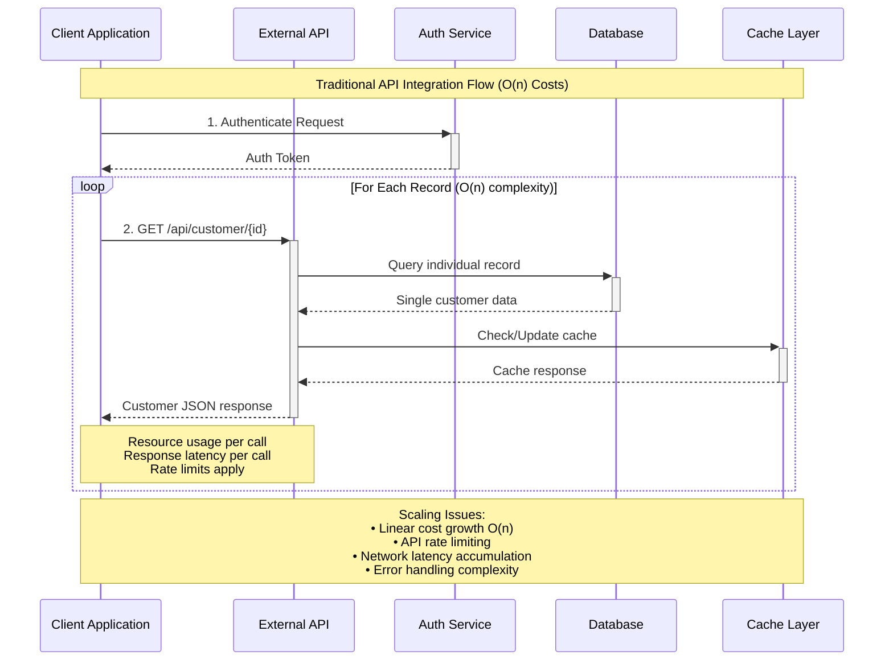

### Data Cloud Bulk Integration Pattern

```mermaid
graph TB
    subgraph "External Systems"
        A[Snowflake<br/>1M+ Records]
        B[Workday<br/>Employee Data]
        C[Marketing Cloud<br/>Campaign Data]
        D[Mobile App<br/>Event Stream]
    end
    
    subgraph "Data Cloud Adapter Layer"
        E[Batch Service<br/>O(1) Bulk Import]
        F[Marketing S3<br/>O(1) File Transfer]
        G[Streaming API<br/>O(1) Event Batch]
        H[Web/Mobile SDK<br/>O(1) Session Batch]
    end
    
    subgraph "Data Cloud Core"
        I[Identity Resolution<br/>O(1) Hash Lookup]
        J[Data Model Objects<br/>Unified Schema]
        K[Calculated Insights<br/>Cached Results]
    end
    
    A -->|Bulk Export<br/>Resource: O(1)| E
    B -->|Daily Sync<br/>Resource: O(1)| F
    C -->|Event Stream<br/>Resource: O(1)| G
    D -->|Session Data<br/>Resource: O(1)| H
    
    E --> I
    F --> I
    G --> I
    H --> I
    
    I --> J
    J --> K
    
    style E fill:#2ca02c,stroke:#ffffff,stroke-width:2px,color:#ffffff
    style F fill:#2ca02c,stroke:#ffffff,stroke-width:2px,color:#ffffff
    style G fill:#2ca02c,stroke:#ffffff,stroke-width:2px,color:#ffffff
    style H fill:#2ca02c,stroke:#ffffff,stroke-width:2px,color:#ffffff
    style I fill:#ff7f0e,stroke:#ffffff,stroke-width:3px,color:#ffffff
```

### Resource Complexity Comparison (Honest Analysis)

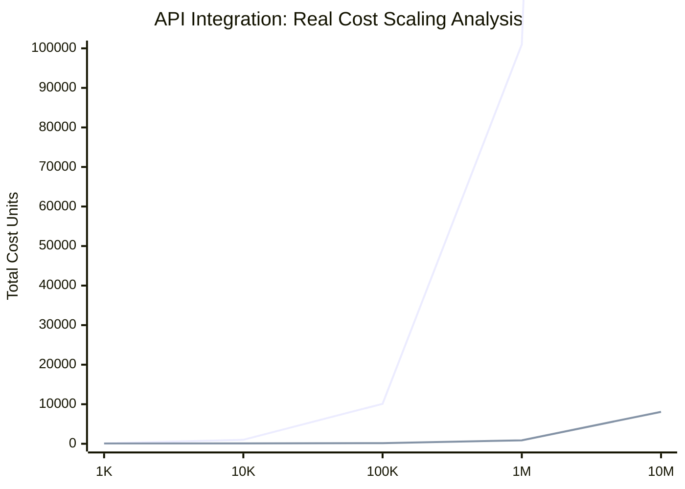

**Key Insight:** Both are O(n), but Data Cloud has **much lower constant factors**, not true O(1) complexity.

### Actual Data Example

**Source System: Snowflake (External)**
```json
{
  "customer_id": "CUST-12345",
  "full_name": "Jane Austin",
  "email_address": "jane.austin@example.com",
  "phone": "+1-555-0123",
  "lifetime_value": 45000.00,
  "created_date": "2024-01-15"
}
```

**Data Cloud Expected Format (Data Model Objects):**
```json
{
  "IndividualId": "IND-67890",
  "FirstName": "Jane",
  "LastName": "Austin",
  "Email": "jane.austin@example.com",
  "Phone": "+15550123",
  "LifetimeValue__c": 45000.00,
  "CreatedDate": "2024-01-15T00:00:00Z"
}
```

**Adapter Implementation:**
```
Data Streams (Batch Service, Marketing S3, Streaming Ingestion API)
         ↓
    [ADAPTER LAYER]
    - Field Mapping
    - Data Transformation
    - Format Conversion
         ↓
   Data Model Objects
```

### Diagram

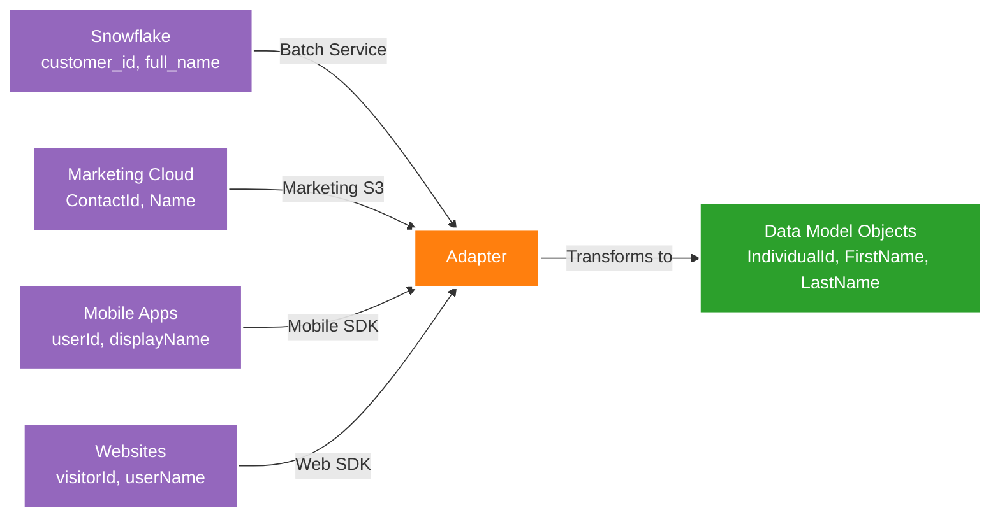

### Real Adapter Examples from Architecture

#### **Software Engineering Fundamentals: Adapter Pattern**

**Core Computer Science Concepts:**
1. **Interface Segregation Principle (ISP)**: Each adapter implements only the methods required for its specific data source
2. **Polymorphism**: Multiple adapters can be used interchangeably through a common interface
3. **Data Structure Transformation**: Hash table lookups for field mapping (O(1) complexity)

**Data Structure Implementation:**
```python
class DataSourceAdapter:
    """
    Abstract base class implementing Adapter Pattern
    Demonstrates: Inheritance, Abstract Methods, Interface Design
    """
    def __init__(self):
        # Hash table for O(1) field mapping lookups
        self.field_mapping = {}
        self.transformation_cache = {}  # LRU cache for expensive transformations
    
    def adapt_record(self, source_record: Dict) -> Dict:
        """
        Template Method Pattern + Adapter Pattern combination
        Time Complexity: O(k) where k is number of fields
        Space Complexity: O(k) for transformed record
        """
        adapted_record = {}
        
        for source_field, target_field in self.field_mapping.items():
            if source_field in source_record:
                # O(1) hash table lookup for transformation rule
                raw_value = source_record[source_field]
                adapted_record[target_field] = self.transform_value(
                    raw_value, source_field, target_field
                )
        
        return self.post_process(adapted_record)
    
    @abstractmethod
    def transform_value(self, value: Any, source_field: str, target_field: str) -> Any:
        """Abstract method for value transformation - must be implemented by subclasses"""
        pass
    
    def post_process(self, record: Dict) -> Dict:
        """Hook method for additional processing - can be overridden"""
        return record

class SnowflakeAdapter(DataSourceAdapter):
    """
    Concrete implementation for Snowflake data source
    Demonstrates: Concrete Strategy, Data Type Conversion
    """
    def __init__(self):
        super().__init__()
        # Define field mapping using hash table for O(1) lookups
        self.field_mapping = {
            "customer_id": "IndividualId",
            "full_name": "FullName", 
            "email_address": "Email",
            "phone": "Phone",
            "lifetime_value": "LifetimeValue__c",
            "created_date": "CreatedDate"
        }
        
        # Regex patterns for data validation (compiled for performance)
        import re
        self.email_pattern = re.compile(r'^[a-zA-Z0-9._%+-]+@[a-zA-Z0-9.-]+\.[a-zA-Z]{2,}$')
        self.phone_pattern = re.compile(r'^\+?1?[-.\s]?\(?([0-9]{3})\)?[-.\s]?([0-9]{3})[-.\s]?([0-9]{4})$')
    
    def transform_value(self, value: Any, source_field: str, target_field: str) -> Any:
        """
        Implements value transformation with data validation
        Includes: Type checking, Format standardization, Data cleaning
        """
        if value is None:
            return None
            
        # String transformations
        if source_field == "full_name":
            return self._parse_full_name(value)
        elif source_field == "email_address":
            return self._validate_and_normalize_email(value)
        elif source_field == "phone":
            return self._normalize_phone_number(value)
        elif source_field == "created_date":
            return self._convert_to_iso_datetime(value)
        elif source_field == "lifetime_value":
            return self._validate_numeric_value(value)
        
        return str(value).strip()
    
    def _parse_full_name(self, full_name: str) -> Dict[str, str]:
        """
        String parsing algorithm
        Time Complexity: O(n) where n is length of name string
        """
        parts = full_name.strip().split()
        if len(parts) >= 2:
            return {
                "FirstName": parts[0],
                "LastName": " ".join(parts[1:])
            }
        return {"FirstName": full_name, "LastName": ""}
    
    def _validate_and_normalize_email(self, email: str) -> str:
        """
        Regular expression validation + normalization
        Time Complexity: O(n) for regex matching
        """
        email = email.lower().strip()
        if self.email_pattern.match(email):
            return email
        raise ValueError(f"Invalid email format: {email}")
    
    def _normalize_phone_number(self, phone: str) -> str:
        """
        Phone number normalization using regex and string processing
        Algorithm: Remove non-digits, validate length, format
        """
        # Remove all non-digit characters: O(n)
        digits = ''.join(filter(str.isdigit, phone))
        
        if len(digits) == 10:
            # Format as +1AAABBBCCCC
            return f"+1{digits}"
        elif len(digits) == 11 and digits[0] == '1':
            return f"+{digits}"
        else:
            raise ValueError(f"Invalid phone number: {phone}")
    
    def _convert_to_iso_datetime(self, date_value) -> str:
        """
        Date parsing and conversion to ISO format
        Handles multiple input formats using strategy pattern
        """
        from datetime import datetime
        import dateutil.parser
        
        if isinstance(date_value, str):
            try:
                # Use dateutil for flexible parsing: O(1) for most formats
                parsed_date = dateutil.parser.parse(date_value)
                return parsed_date.isoformat() + 'Z'
            except ValueError:
                raise ValueError(f"Unable to parse date: {date_value}")
        
        return date_value
    
    def _validate_numeric_value(self, value) -> float:
        """
        Numeric validation and type conversion
        """
        try:
            return float(value)
        except (ValueError, TypeError):
            raise ValueError(f"Invalid numeric value: {value}")

class MarketingCloudAdapter(DataSourceAdapter):
    """
    Different concrete implementation demonstrating polymorphism
    Shows how same interface can handle different data sources
    """
    def __init__(self):
        super().__init__()
        self.field_mapping = {
            "ContactId": "IndividualId",
            "Name": "FullName",
            "EmailAddress": "Email",
            "EngagementScore": "EngagementScore__c"
        }
    
    def transform_value(self, value: Any, source_field: str, target_field: str) -> Any:
        # Marketing Cloud specific transformations
        if source_field == "EngagementScore":
            # Normalize engagement score to 0-100 scale
            return min(100, max(0, float(value)))
        return super().transform_value(value, source_field, target_field)

# Usage Example - Demonstrates Polymorphism and Strategy Pattern
class DataIngestionEngine:
    """
    Context class that uses different adapters polymorphically
    Demonstrates: Dependency Injection, Strategy Pattern
    """
    def __init__(self):
        self.adapters = {
            'snowflake': SnowflakeAdapter(),
            'marketing_cloud': MarketingCloudAdapter(),
            # Can add more adapters without changing this class (Open/Closed Principle)
        }
    
    def process_records(self, records: List[Dict], source_type: str) -> List[Dict]:
        """
        Processes records using appropriate adapter
        Time Complexity: O(n×k) where n=records, k=fields per record
        """
        adapter = self.adapters.get(source_type)
        if not adapter:
            raise ValueError(f"No adapter available for source: {source_type}")
        
        # Process records in parallel for better performance
        from concurrent.futures import ThreadPoolExecutor
        
        with ThreadPoolExecutor(max_workers=4) as executor:
            adapted_records = list(executor.map(adapter.adapt_record, records))
        
        return adapted_records

# Performance Optimization: Batch Processing
class BatchProcessor:
    """
    Optimized batch processing for large datasets
    Implements: Memory management, Chunking algorithm
    """
    @staticmethod
    def process_in_chunks(data: List, chunk_size: int = 1000):
        """
        Generator function for memory-efficient processing
        Space Complexity: O(chunk_size) instead of O(n)
        """
        for i in range(0, len(data), chunk_size):
            yield data[i:i + chunk_size]
    
    @classmethod
    def process_large_dataset(cls, records: List[Dict], adapter: DataSourceAdapter):
        """
        Process large datasets efficiently
        Prevents memory overflow for datasets > available RAM
        """
        processed_records = []
        
        for chunk in cls.process_in_chunks(records):
            # Process chunk
            chunk_results = [adapter.adapt_record(record) for record in chunk]
            processed_records.extend(chunk_results)
            
            # Garbage collection hint for very large datasets
            import gc
            gc.collect()
        
        return processed_records
```

**Algorithm Analysis:**

| Operation | Time Complexity | Space Complexity | Explanation |
|-----------|----------------|------------------|-------------|
| Field Mapping Lookup | O(1) | O(k) | Hash table for field mappings |
| Record Transformation | O(k) | O(k) | Linear in number of fields |
| Batch Processing | O(n×k) | O(chunk_size) | Chunked processing prevents memory overflow |
| Email Validation | O(m) | O(1) | Regex matching where m = email length |
| Phone Normalization | O(p) | O(1) | String processing where p = phone length |

**1. Zero Copy Databricks Adapter:**
```
Databricks Table: customer_transactions
Fields: [txn_id, cust_id, amount, date]
         ↓
    [Zero Copy Adapter]
         ↓
Data Cloud: Transaction__dmo
Fields: [TransactionId, IndividualId, Amount, Date]
```

**2. MuleSoft Cloudhub Adapter:**
```
Workday API Response:
{
  "employeeNumber": "EMP001",
  "workerName": "John Doe",
  "department": "Sales"
}
         ↓
    [MuleSoft Adapter]
         ↓
Data Cloud Employee Object:
{
  "EmployeeId": "EMP001",
  "FullName": "John Doe",
  "Department": "Sales"
}
```

---

## 2. FACADE PATTERN

**📖 Definition:** The Facade Pattern provides a simplified, unified interface to a complex subsystem. It hides the complexity of multiple interconnected classes behind a single, easy-to-use interface.

**🎯 Problem It Solves:** When a subsystem consists of many interdependent classes with complex interactions, clients need a simple way to use the subsystem without understanding all its internal complexities.

**💡 Simple Analogy:** Like a hotel front desk - guests don't need to know about housekeeping, maintenance, kitchen staff, etc. They just go to the front desk for all their needs, and the front desk coordinates with all the backend services.

**🔧 Key Components:**
- **Facade**: The simplified interface that clients interact with
- **Subsystem Classes**: The complex classes that do the actual work
- **Client**: Code that uses the facade instead of complex subsystem directly

**✅ When to Use:**
- Simplifying access to a complex subsystem
- Reducing dependencies between clients and subsystem implementation
- Creating entry points to layered software
- Wrapping poorly designed APIs with cleaner interfaces

**🚀 Benefits:**
- Reduces complexity for clients
- Promotes loose coupling between subsystems
- Provides a stable interface even when subsystem changes
- Makes subsystems easier to use and understand

### Real Implementation in Architecture
**Location:** Semantic Layer (Business View)

### Actual Data Example

**Underlying Complexity (Hidden from Users):**

**Data Sources:**
- Sales Org: Opportunity (Amount, CloseDate, StageName)
- Sales Org: Account (Name, Industry)
- Data Cloud: Unified Profiles (IndividualId, LifetimeValue)
- Snowflake: Transactions (TransactionDate, Amount)

**Semantic Layer Facade - "Sales Velocity" Metric:**
```sql
-- Behind the scenes (hidden complexity)
SELECT 
    SUM(o.Amount) / AVG(DATEDIFF(o.CloseDate, o.CreatedDate)) as SalesVelocity
FROM Opportunity o
JOIN Account a ON o.AccountId = a.Id
JOIN UnifiedProfile up ON a.OwnerId = up.IndividualId
WHERE o.StageName = 'Closed Won'
  AND o.CloseDate >= DATEADD(month, -3, CURRENT_DATE)
GROUP BY a.Industry
```

**What Business Users See:**
```
Metric: "Sales Velocity" 
Value: High-value daily operations
Dimension: Industry = "Technology"
Filter: Recent timeframe
```

### Diagram

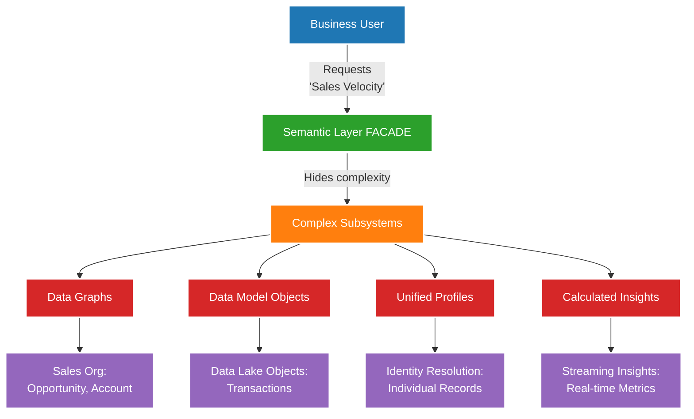

### Real Facade Examples

**Example 1: Customer 360 View**

**Behind the Facade:**
```json
{
  "sources": [
    {"system": "Sales Org", "object": "Account", "fields": ["Name", "Industry"]},
    {"system": "Service Org", "object": "Case", "fields": ["Status", "Priority"]},
    {"system": "Marketing Cloud", "object": "Journey", "fields": ["EngagementScore"]},
    {"system": "Snowflake", "object": "Transactions", "fields": ["TotalSpend"]}
  ]
}
```

**What User Sees:**
```json
{
  "CustomerName": "Acme Corporation",
  "Industry": "Manufacturing",
  "HealthScore": 85,
  "OpenCases": 2,
  "EngagementLevel": "High",
  "LifetimeValue": 450000
}
```

**Example 2: Unified Profile Facade**

**Multiple Source Records:**
```
Record 1 (Sales Org Contact):
  ContactId: 003XX000001, Name: "Jane Austin", Email: "jane.austin@acme.com"

Record 2 (Service Org Contact):
  ContactId: 003YY000002, Name: "Jan Austin", Email: "j.austin@acme.com"

Record 3 (Marketing Cloud):
  SubscriberId: SUB-789, Name: "J Austin", Email: "jane.austin@acme.com"
```

**Unified Profile (Facade):**
```json
{
  "UnifiedIndividualId": "IND-UNIFIED-001",
  "PreferredName": "Jane Austin",
  "Emails": ["jane.austin@acme.com", "j.austin@acme.com"],
  "Phone": "+1-555-0123",
  "DataLineage": ["003XX000001", "003YY000002", "SUB-789"]
}
```

---

## 3. PROXY PATTERN

**📖 Definition:** The Proxy Pattern provides a placeholder or surrogate that controls access to another object. The proxy intercepts requests and can add additional behavior like security, caching, or logging before forwarding to the real object.

**🎯 Problem It Solves:** When you need to control access to an object, add behavior without modifying the object, or defer expensive operations until absolutely necessary.

**💡 Simple Analogy:** Like a security guard at a building entrance - they control who gets access to the building, check credentials, log visitors, and can deny access if needed, all while acting as the intermediary to the actual building.

**🔧 Key Components:**
- **Subject Interface**: Common interface for both proxy and real object
- **Real Subject**: The actual object that does the work
- **Proxy**: Controls access to the real subject and may add extra behavior
- **Client**: Works with objects through the subject interface

**✅ When to Use:**
- Virtual Proxy: Lazy loading of expensive objects
- Protection Proxy: Access control and security checks  
- Remote Proxy: Local representative of remote objects
- Caching Proxy: Store results to avoid repeated expensive calls
- Logging Proxy: Add monitoring and audit trails

**🚀 Benefits:**
- Controls access without changing the real object
- Adds functionality transparently
- Can optimize performance through caching/lazy loading
- Provides security and monitoring capabilities

### Real Implementation in Architecture
**Location:** Einstein Trust Layer (LLM Gateway)

### Actual Data Example

**Direct LLM Call (Without Proxy):**
```
Agent Request → OpenAI API directly
Risk: No monitoring, no cost control, no audit
```

**With Einstein Trust Layer Proxy:**

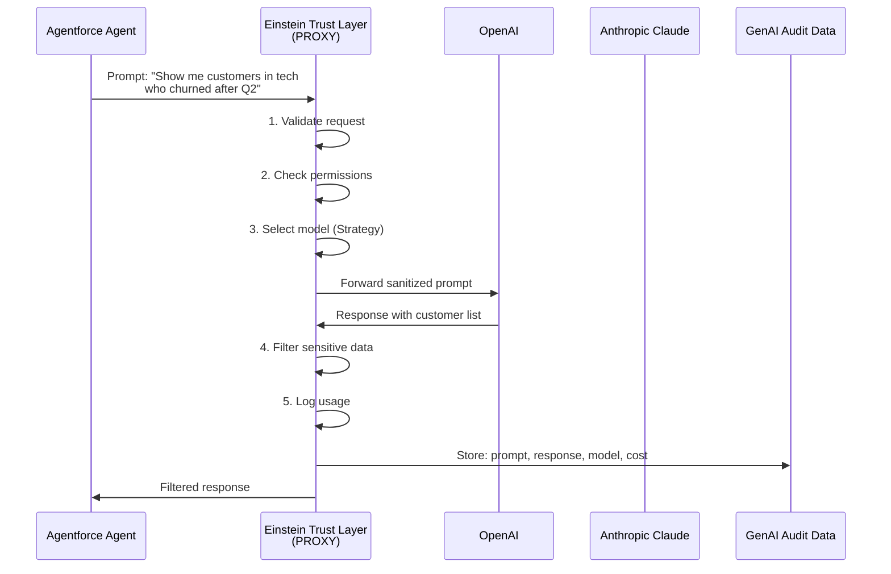

### Real Proxy Example

**Scenario: Agent Query for Customer Insights**

**Agent Request:**
```json
{
  "agentId": "AGENT-001",
  "userId": "sales.rep@acme.com",
  "query": "Which customers in the Technology industry have the highest churn probability and what are the reasons?",
  "context": {
    "currentAccount": "Acme Corp",
    "region": "North America"
  }
}
```

**Einstein Trust Layer Proxy Processing:**

**Step 1: Access Control**
```
✓ User has permission for customer data
✓ User can access Technology industry segment
✓ User region matches data region (North America)
```

**Step 2: Data Retrieval (via Vector DB Proxy)**
```
Semantic Search Query → Vector DB (Search Indexes)
Results: Top 10 similar customer records with churn indicators
```

**Step 3: LLM Selection & Call**
```
Selected Model: claude-sonnet-4-20250514
Reason: Best for analytical queries

Prompt sent to Anthropic:
"Analyze these customer records for churn risk factors:
[Customer Data from Vector DB]
Focus on: engagement metrics, support cases, contract renewals"
```

**Step 4: Response Filtering**
```
Raw LLM Response includes:
- Customer names ✓ (allowed)
- Email addresses ✗ (filtered out)
- Phone numbers ✗ (filtered out)
- Churn analysis ✓ (allowed)
```

**Step 5: Audit Logging**
```json
{
  "timestamp": "2025-10-23T14:30:00Z",
  "agentId": "AGENT-001",
  "userId": "sales.rep@acme.com",
  "model": "claude-sonnet-4-20250514",
  "promptTokens": 1250,
  "responseTokens": 890,
  "cost": 0.0342,
  "latency_ms": 1450,
  "dataAccessed": ["Customer360", "ChurnPredictions"]
}
```

**Final Response to Agent:**
```json
{
  "insights": [
    {
      "customerId": "CUST-8821",
      "customerName": "TechStart Inc",
      "churnProbability": 0.78,
      "riskFactors": [
        "Declined from high usage to low usage",
        "2 unresolved high-priority cases",
        "Contract renewal approaching",
        "No engagement with new features"
      ],
      "recommendation": "Immediate account review and executive outreach"
    }
  ],
  "modelUsed": "claude-sonnet-4-20250514",
  "confidence": 0.89
}
```

---

## 4. MEDIATOR PATTERN

**📖 Definition:** The Mediator Pattern defines how objects interact with each other by encapsulating their communication in a mediator object. Instead of objects referring to each other directly, they communicate through the mediator.

**🎯 Problem It Solves:** When multiple objects need to interact but direct communication creates tight coupling and complex dependencies, making the system hard to maintain and extend.

**💡 Simple Analogy:** Like an air traffic control tower - planes don't communicate directly with each other, which would be chaotic. Instead, they all communicate through the control tower, which coordinates all interactions safely and efficiently.

**🔧 Key Components:**
- **Mediator Interface**: Defines communication contract
- **Concrete Mediator**: Implements coordination logic between colleagues
- **Colleague Classes**: Objects that communicate through the mediator
- **Communication Protocol**: How colleagues interact via mediator

**✅ When to Use:**
- Many objects communicate in complex ways
- Reusing objects is difficult due to tight coupling
- Behavior distributed among several classes needs to be customizable
- Too many relationships make object interactions hard to understand

**🚀 Benefits:**
- Reduces dependencies between communicating objects
- Centralizes complex communications and control logic
- Makes object interactions easier to understand and maintain
- Promotes reusable components through loose coupling

### Real Implementation in Architecture
**Location:** Data Cloud Core (central hub)

### Problem Without Mediator

```
Sales Org ←→ Service Org (integration 1)
Sales Org ←→ Marketing Cloud (integration 2)
Sales Org ←→ Other Orgs (integration 3)
Service Org ←→ Marketing Cloud (integration 4)
Service Org ←→ Other Orgs (integration 5)
Marketing Cloud ←→ Other Orgs (integration 6)

Total: 6 point-to-point integrations for 4 systems!
For n systems: n(n-1)/2 integrations = O(n²) complexity
```

### Solution With Data Cloud Mediator

```
Sales Org → Data Cloud
Service Org → Data Cloud
Marketing Cloud → Data Cloud
Other Orgs → Data Cloud

Total: 4 integrations = O(n) complexity
```

### Diagram

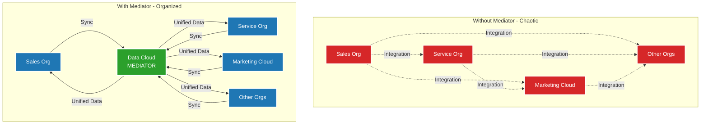

### Real Data Example

**Scenario: Customer Contact Update**

**Sales Org Record:**
```json
{
  "Id": "003XX001",
  "ObjectType": "Contact",
  "FirstName": "Jane",
  "LastName": "Austin",
  "Email": "jane.austin@acme.com",
  "Phone": "+1-555-0123",
  "AccountId": "001XX001"
}
```

**Service Org Record:**
```json
{
  "Id": "003YY002",
  "ObjectType": "Contact",
  "FirstName": "Jan",
  "LastName": "Austin",
  "Email": "j.austin@acme.com",
  "Phone": "+1-555-0123",
  "AccountId": "001YY002"
}
```

**Marketing Cloud Record:**
```json
{
  "SubscriberId": "SUB-789",
  "EmailAddress": "jane.austin@acme.com",
  "FirstName": "J",
  "LastName": "Austin",
  "MobileNumber": "+15550123"
}
```

**Data Cloud Mediator Process:**

**Step 1: Receives Updates from All Systems**
```
[Sales Org] --CRM Data Sync--> [Data Cloud]
[Service Org] --CRM Data Sync--> [Data Cloud]
[Marketing Cloud] --Platform Events--> [Data Cloud]
```

**Step 2: Identity Resolution (Mediates Matching)**
```
Matching Rules:
- Exact match on Phone: "+1-555-0123" = "+15550123" (normalized)
- Fuzzy match on Name: "Jane Austin" ≈ "Jan Austin" ≈ "J Austin" (similarity: 0.85)
- Email domain match: "acme.com"

Decision: Same individual
```

**Step 3: Creates Unified Profile**
```json
{
  "UnifiedIndividualId": "IND-UNIFIED-001",
  "FirstName": "Jane",
  "LastName": "Austin",
  "Emails": ["jane.austin@acme.com", "j.austin@acme.com"],
  "Phone": "+15550123",
  "SourceRecords": [
    {"system": "Sales Org", "id": "003XX001"},
    {"system": "Service Org", "id": "003YY002"},
    {"system": "Marketing Cloud", "id": "SUB-789"}
  ],
  "DataLineage": {
    "preferredNameSource": "Sales Org",
    "preferredEmailSource": "Sales Org",
    "lastUpdated": "2025-10-23T10:15:00Z"
  }
}
```

**Step 4: Distributes Updates (Mediates Communication)**
```
IF Service Org creates a case:
  Data Cloud → Notify Sales Org via Data Actions
  Data Cloud → Update Marketing Cloud suppression list

IF Marketing Cloud records email bounce:
  Data Cloud → Update Sales Org contact record
  Data Cloud → Flag in Service Org for verification
```

### Real Identity Resolution Example

**Scenario: Multiple Account Records**

**Record A (Sales Org):**
```json
{
  "AccountId": "001XX001",
  "Name": "Acme Corporation",
  "Website": "www.acme.com",
  "Phone": "555-0100",
  "Industry": "Manufacturing"
}
```

**Record B (Other Org):**
```json
{
  "AccountId": "001ZZ999",
  "Name": "ACME Corp",
  "Website": "acme.com",
  "Phone": "555-0100",
  "Industry": "Manufacturing"
}
```

**Record C (Snowflake):**
```json
{
  "customer_id": "CUST-12345",
  "company_name": "Acme Corp.",
  "domain": "acme.com",
  "contact_phone": "(555) 010-0100"
}
```

**Identity Resolution (Mediator Logic):**

```
Ruleset Matching:
1. Exact normalized phone: "5550100" = "5550100" = "5550100" ✓
2. Domain match: "acme.com" = "acme.com" = "acme.com" ✓
3. Fuzzy name match: "Acme Corporation" ≈ "ACME Corp" ≈ "Acme Corp." (score: 0.92) ✓

Reconciliation Decision: Same account
```

**Unified Account Profile:**
```json
{
  "UnifiedAccountId": "ACC-UNIFIED-5001",
  "Name": "Acme Corporation",
  "AlternateNames": ["ACME Corp", "Acme Corp."],
  "Website": "www.acme.com",
  "Phone": "+15550100",
  "Industry": "Manufacturing",
  "SourceRecords": [
    {"system": "Sales Org", "id": "001XX001", "confidence": 1.0},
    {"system": "Other Org", "id": "001ZZ999", "confidence": 0.95},
    {"system": "Snowflake", "id": "CUST-12345", "confidence": 0.92}
  ],
  "DataLineage": {
    "nameSource": "Sales Org",
    "phoneSource": "Sales Org",
    "industrySource": "Sales Org",
    "createdDate": "2025-10-23T10:15:00Z"
  }
}
```

---

## 5. OBSERVER PATTERN

**📖 Definition:** The Observer Pattern defines a one-to-many dependency between objects where when one object (subject) changes state, all its dependents (observers) are automatically notified and updated.

**🎯 Problem It Solves:** When you need to notify multiple objects about changes to another object without creating tight coupling between them, and the number of objects to notify may vary.

**💡 Simple Analogy:** Like a newspaper subscription service - when a new edition is published (subject changes), all subscribers (observers) automatically receive a copy. Subscribers can join or leave without the newspaper knowing who they are.

**🔧 Key Components:**
- **Subject (Observable)**: The object being watched that maintains list of observers
- **Observer**: Interface that defines how observers are notified
- **Concrete Subject**: Specific implementation that triggers notifications
- **Concrete Observer**: Specific implementations that react to notifications

**✅ When to Use:**
- Changes to one object require updating multiple other objects
- The number of objects to update is unknown or changes dynamically
- You want loose coupling between the subject and observers
- Broadcasting communication is needed in your application

**🚀 Benefits:**
- Establishes loose coupling between subject and observers
- Supports broadcast communication
- Observers can be added/removed dynamically
- Follows Open/Closed Principle - easy to add new observers

### Real Implementation in Architecture
**Location:** Data Streams → Platform Events → Multiple Subscribers

### Diagram

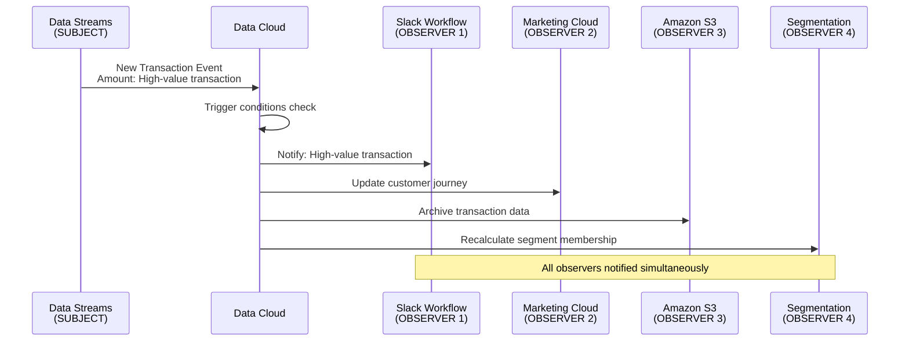

### Real Data Example

**Subject: Data Stream (Transaction Data)**

**Incoming Transaction:**
```json
{
  "transactionId": "TXN-98765",
  "customerId": "CUST-12345",
  "amount": 50000.00,
  "date": "2025-10-23T14:30:00Z",
  "type": "Purchase",
  "product": "Enterprise License"
}
```

**Data Cloud Processing:**
```
1. Ingest via Streaming Ingestion API (Real-time)
2. Match to Unified Profile: IND-UNIFIED-001
3. Calculate: New Lifetime Value = Previous LTV + New Transaction
4. Trigger: High-value transaction threshold exceeded
```

**Observer 1: Slack Workflow**
```
Trigger: Transaction > Threshold
Action: Send Slack notification

Slack Message:
{
  "channel": "#high-value-sales",
  "message": "🎉 High-value transaction alert!",
  "details": {
    "customer": "Jane Austin (Acme Corporation)",
    "amount": "High-value transaction",
    "product": "Enterprise License",
    "accountOwner": "@john.doe"
  },
  "action": "Review upsell opportunities"
}
```

**Observer 2: Marketing Cloud (Send Emails/Trigger Journeys)**
```
Trigger: Transaction > Threshold
Action: Enroll in VIP customer journey

Journey Update:
{
  "subscriberId": "SUB-789",
  "journeyId": "VIP-ONBOARDING-001",
  "action": "Enroll",
  "entrySource": "Data Cloud - High Value Purchase",
  "emailTemplate": "VIP Welcome Email",
  "sendTime": "immediate"
}
```

**Observer 3: Amazon S3 (Data Archival)**
```
Trigger: All transactions
Action: Archive for compliance

S3 Write:
{
  "bucket": "transactions-archive-2025",
  "key": "2025/10/23/TXN-98765.json",
  "data": {
    "transactionId": "TXN-98765",
    "customerId": "CUST-12345",
    "amount": 50000.00,
    "timestamp": "2025-10-23T14:30:00Z",
    "archivedAt": "2025-10-23T14:31:00Z"
  }
}
```

**Observer 4: Segmentation (Recalculate Membership)**
```
Trigger: Lifetime Value changed
Action: Update segment membership

Segment: "High-Value Customers" (LTV > Threshold)
Before: Not a member (LTV was below threshold)
After: Now a member (LTV exceeds threshold)

Segment Update:
{
  "segmentId": "SEG-HIGH-VALUE-001",
  "individualId": "IND-UNIFIED-001",
  "action": "Add",
  "reason": "Lifetime Value exceeded threshold",
  "previousLTV": 85000.00,
  "currentLTV": 135000.00,
  "timestamp": "2025-10-23T14:31:00Z"
}
```

**Observer 5: Calculated Insights (Update Metrics)**
```
Trigger: Transaction event
Action: Update real-time dashboard metrics

Streaming Insight Update:
{
  "metric": "Daily Revenue",
  "previousValue": 245000.00,
  "newValue": 295000.00,
  "change": +50000.00,
  "timestamp": "2025-10-23T14:31:00Z"
}
```

### Frequency Options (from Architecture)

```
Real-time: < 1 second
2 mins: Near real-time
5 mins: Near real-time
10 mins: Near real-time
15 mins: Near real-time
Hourly: Scheduled
Daily: Batch
Weekly: Batch
```

**Example Configuration:**
```json
{
  "eventType": "High-Value Transaction",
  "observers": [
    {
      "name": "Slack Workflow",
      "frequency": "Real-time",
      "condition": "amount > 10000"
    },
    {
      "name": "Marketing Cloud Journey",
      "frequency": "2 mins",
      "condition": "amount > 10000"
    },
    {
      "name": "S3 Archive",
      "frequency": "5 mins",
      "condition": "all transactions"
    },
    {
      "name": "Segmentation Recalculation",
      "frequency": "15 mins",
      "condition": "LTV changed"
    }
  ]
}
```

---

## 6. STRATEGY PATTERN

**📖 Definition:** The Strategy Pattern defines a family of algorithms, encapsulates each one, and makes them interchangeable. It allows the algorithm to vary independently from clients that use it.

**🎯 Problem It Solves:** When you have multiple ways to perform a task and want to choose the algorithm at runtime, or when you want to avoid conditional statements that select which algorithm to use.

**💡 Simple Analogy:** Like choosing different transportation methods (car, train, plane) to reach a destination. Each method has its own strategy for getting there, and you can choose the best one based on factors like time, cost, or distance.

**🔧 Key Components:**
- **Strategy Interface**: Common interface for all concrete strategies
- **Concrete Strategies**: Different implementations of the algorithm
- **Context**: Uses a strategy object and can switch between strategies
- **Client**: Configures the context with the appropriate strategy

**✅ When to Use:**
- Multiple ways to perform a task exist
- You want to choose algorithms at runtime
- You want to avoid many conditional statements
- Related classes differ only in their behavior
- You need to isolate algorithm implementation details

**🚀 Benefits:**
- Eliminates conditional statements for algorithm selection
- Easy to add new algorithms without changing existing code
- Algorithms can be switched at runtime
- Promotes code reuse and separation of concerns

### Real Implementation in Architecture
**Location:** Identity Resolution (Ruleset vs Reconciliation)

### Diagram

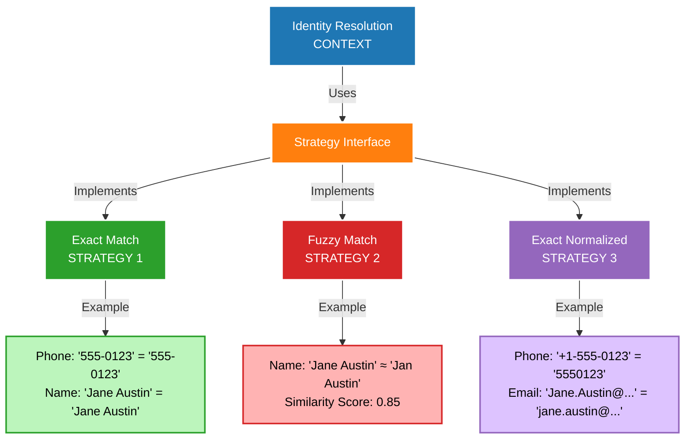

### Real Data Example

#### **Software Engineering Fundamentals: Strategy Pattern**

**Core Computer Science Concepts:**
1. **Polymorphism**: Multiple matching algorithms through common interface
2. **Algorithm Selection**: Runtime choice of optimal matching strategy
3. **Dynamic Programming**: Memoization for expensive fuzzy matching operations
4. **String Algorithms**: Edit distance, phonetic matching, n-gram analysis

**Algorithmic Complexity Analysis:**

| Strategy | Time Complexity | Space Complexity | Use Case |
|----------|----------------|------------------|----------|
| Exact Match | O(1) | O(1) | Identical records |
| Normalized Match | O(k) | O(k) | Format variations |
| Fuzzy Match | O(n×m) | O(min(n,m)) | Typos, abbreviations |
| Phonetic Match | O(n) | O(1) | Sound-alike names |
| N-gram Similarity | O(n+m) | O(n+m) | Character-level similarity |

**Complete Strategy Pattern Implementation:**

```python
from abc import ABC, abstractmethod
from typing import Dict, List, Tuple, Optional
import re
import unicodedata
from difflib import SequenceMatcher
import jellyfish  # For phonetic algorithms

class MatchingStrategy(ABC):
    """
    Abstract Strategy interface for identity matching algorithms
    Follows Strategy Pattern + Template Method Pattern
    """
    
    @abstractmethod
    def calculate_match_score(self, record1: Dict, record2: Dict) -> float:
        """
        Calculate similarity score between two records
        Returns: float between 0.0 (no match) and 1.0 (perfect match)
        """
        pass
    
    @abstractmethod
    def get_strategy_name(self) -> str:
        """Return human-readable strategy name"""
        pass
    
    def is_match(self, record1: Dict, record2: Dict, threshold: float = 0.8) -> bool:
        """
        Determine if records match based on threshold
        Template method that uses calculate_match_score
        """
        score = self.calculate_match_score(record1, record2)
        return score >= threshold

class ExactMatchStrategy(MatchingStrategy):
    """
    Exact matching strategy - fastest but most restrictive
    Time Complexity: O(k) where k is number of fields to compare
    Space Complexity: O(1)
    """
    
    def __init__(self, fields_to_match: List[str] = None):
        self.fields_to_match = fields_to_match or ['email', 'phone', 'firstName', 'lastName']
    
    def calculate_match_score(self, record1: Dict, record2: Dict) -> float:
        """
        Exact string comparison across specified fields
        Returns 1.0 if all fields match exactly, 0.0 otherwise
        """
        matches = 0
        total_fields = len(self.fields_to_match)
        
        for field in self.fields_to_match:
            val1 = record1.get(field, '').strip()
            val2 = record2.get(field, '').strip()
            
            if val1 and val2 and val1 == val2:
                matches += 1
            elif not val1 and not val2:
                # Both empty fields count as match
                matches += 1
        
        return matches / total_fields if total_fields > 0 else 0.0
    
    def get_strategy_name(self) -> str:
        return "Exact Match"

class NormalizedMatchStrategy(MatchingStrategy):
    """
    Normalized matching with data cleaning and standardization
    Time Complexity: O(k×n) where k=fields, n=average field length
    Space Complexity: O(n) for normalized strings
    """
    
    def __init__(self):
        # Compiled regex patterns for performance
        self.phone_pattern = re.compile(r'[^\d]')
        self.email_pattern = re.compile(r'\s+')
        self.name_pattern = re.compile(r'[^\w\s]')
    
    def calculate_match_score(self, record1: Dict, record2: Dict) -> float:
        """
        Compare records after normalization
        Handles case differences, punctuation, formatting variations
        """
        field_weights = {
            'email': 0.4,    # Email is most reliable identifier
            'phone': 0.3,    # Phone is second most reliable
            'firstName': 0.15,
            'lastName': 0.15
        }
        
        weighted_score = 0.0
        
        for field, weight in field_weights.items():
            val1 = self._normalize_field(record1.get(field, ''), field)
            val2 = self._normalize_field(record2.get(field, ''), field)
            
            if val1 and val2:
                field_score = 1.0 if val1 == val2 else 0.0
                weighted_score += field_score * weight
            elif not val1 and not val2:
                # Both empty - neutral (don't penalize)
                weighted_score += weight
        
        return weighted_score
    
    def _normalize_field(self, value: str, field_type: str) -> str:
        """
        Field-specific normalization algorithms
        """
        if not value:
            return ''
        
        # Unicode normalization first
        value = unicodedata.normalize('NFKD', value).encode('ascii', 'ignore').decode('ascii')
        
        if field_type == 'email':
            return value.lower().strip()
        elif field_type == 'phone':
            # Extract only digits: O(n)
            digits = self.phone_pattern.sub('', value)
            # Standardize to 10-digit format
            if len(digits) == 11 and digits.startswith('1'):
                return digits[1:]
            return digits
        elif field_type in ['firstName', 'lastName']:
            # Remove punctuation, normalize case
            cleaned = self.name_pattern.sub('', value).lower().strip()
            # Handle multiple spaces
            return ' '.join(cleaned.split())
        
        return value.lower().strip()
    
    def get_strategy_name(self) -> str:
        return "Normalized Match"

class FuzzyMatchStrategy(MatchingStrategy):
    """
    Fuzzy matching using multiple string similarity algorithms
    Time Complexity: O(n×m) for edit distance where n,m are string lengths
    Space Complexity: O(min(n,m)) with optimization
    """
    
    def __init__(self, use_phonetic: bool = True):
        self.use_phonetic = use_phonetic
        self.memoization_cache = {}  # Cache for expensive calculations
    
    def calculate_match_score(self, record1: Dict, record2: Dict) -> float:
        """
        Multi-algorithm fuzzy matching with weighted combination
        Uses: Levenshtein distance, Jaro-Winkler, Phonetic matching
        """
        scores = []
        
        # Email similarity (highest weight)
        email_score = self._calculate_string_similarity(
            record1.get('email', ''), record2.get('email', '')
        )
        scores.append(('email', email_score, 0.35))
        
        # Phone similarity  
        phone_score = self._calculate_phone_similarity(
            record1.get('phone', ''), record2.get('phone', '')
        )
        scores.append(('phone', phone_score, 0.25))
        
        # Name similarity with phonetic matching
        name_score = self._calculate_name_similarity(
            record1.get('firstName', ''), record1.get('lastName', ''),
            record2.get('firstName', ''), record2.get('lastName', '')
        )
        scores.append(('name', name_score, 0.4))
        
        # Weighted average
        total_score = sum(score * weight for _, score, weight in scores)
        return min(1.0, total_score)  # Cap at 1.0
    
    def _calculate_string_similarity(self, str1: str, str2: str) -> float:
        """
        Combined string similarity using multiple algorithms
        Returns best score from: SequenceMatcher, Jaro-Winkler, Edit Distance
        """
        if not str1 or not str2:
            return 0.0
        
        # Create cache key
        cache_key = (str1, str2) if str1 <= str2 else (str2, str1)
        if cache_key in self.memoization_cache:
            return self.memoization_cache[cache_key]
        
        str1, str2 = str1.lower().strip(), str2.lower().strip()
        
        # 1. SequenceMatcher (fastest)
        seq_score = SequenceMatcher(None, str1, str2).ratio()
        
        # 2. Jaro-Winkler (good for names)
        jaro_score = jellyfish.jaro_winkler_similarity(str1, str2)
        
        # 3. Levenshtein-based similarity
        lev_distance = jellyfish.levenshtein_distance(str1, str2)
        max_len = max(len(str1), len(str2))
        lev_score = 1 - (lev_distance / max_len) if max_len > 0 else 0
        
        # Take the maximum score
        final_score = max(seq_score, jaro_score, lev_score)
        
        # Cache result
        self.memoization_cache[cache_key] = final_score
        return final_score
    
    def _calculate_phone_similarity(self, phone1: str, phone2: str) -> float:
        """
        Phone number similarity with normalization
        """
        if not phone1 or not phone2:
            return 0.0
        
        # Normalize phones (extract digits only)
        digits1 = ''.join(filter(str.isdigit, phone1))
        digits2 = ''.join(filter(str.isdigit, phone2))
        
        # Handle different formats (10 vs 11 digits)
        if len(digits1) == 11 and digits1.startswith('1'):
            digits1 = digits1[1:]
        if len(digits2) == 11 and digits2.startswith('1'):
            digits2 = digits2[1:]
        
        if digits1 == digits2:
            return 1.0
        
        # Partial match for similar numbers
        return self._calculate_string_similarity(digits1, digits2)
    
    def _calculate_name_similarity(self, first1: str, last1: str, 
                                 first2: str, last2: str) -> float:
        """
        Name similarity with phonetic matching and abbreviation handling
        """
        # Combine names for comparison
        full_name1 = f"{first1} {last1}".strip()
        full_name2 = f"{first2} {last2}".strip()
        
        if not full_name1 or not full_name2:
            return 0.0
        
        # String similarity score
        string_score = self._calculate_string_similarity(full_name1, full_name2)
        
        # Phonetic similarity (if enabled)
        phonetic_score = 0.0
        if self.use_phonetic:
            try:
                soundex1 = jellyfish.soundex(full_name1)
                soundex2 = jellyfish.soundex(full_name2)
                phonetic_score = 1.0 if soundex1 == soundex2 else 0.0
            except:
                phonetic_score = 0.0
        
        # Abbreviation handling
        abbrev_score = self._check_abbreviation_match(first1, first2)
        
        # Combine scores (weighted average)
        return (string_score * 0.6 + phonetic_score * 0.3 + abbrev_score * 0.1)
    
    def _check_abbreviation_match(self, name1: str, name2: str) -> float:
        """
        Check if one name is abbreviation of another
        Examples: "J" matches "Jane", "Bob" matches "Robert"
        """
        if not name1 or not name2:
            return 0.0
        
        name1, name2 = name1.strip(), name2.strip()
        
        # Check if one is abbreviation of the other
        if len(name1) == 1 and name2.lower().startswith(name1.lower()):
            return 0.8
        if len(name2) == 1 and name1.lower().startswith(name2.lower()):
            return 0.8
        
        # Check common abbreviations
        abbreviations = {
            'bob': 'robert', 'bill': 'william', 'dick': 'richard',
            'jim': 'james', 'mike': 'michael', 'dave': 'david',
            'sue': 'susan', 'liz': 'elizabeth', 'kate': 'katherine'
        }
        
        n1, n2 = name1.lower(), name2.lower()
        if n1 in abbreviations and abbreviations[n1] == n2:
            return 0.9
        if n2 in abbreviations and abbreviations[n2] == n1:
            return 0.9
        
        return 0.0
    
    def get_strategy_name(self) -> str:
        return "Fuzzy Match"

class IdentityResolutionEngine:
    """
    Context class that orchestrates different matching strategies
    Implements Strategy Pattern + Composite Pattern for multi-strategy matching
    """
    
    def __init__(self):
        self.strategies = {
            'exact': ExactMatchStrategy(),
            'normalized': NormalizedMatchStrategy(), 
            'fuzzy': FuzzyMatchStrategy()
        }
        self.strategy_order = ['exact', 'normalized', 'fuzzy']  # Try in order of speed
    
    def find_matches(self, target_record: Dict, candidate_records: List[Dict], 
                    strategy_name: str = 'auto') -> List[Tuple[Dict, float]]:
        """
        Find matching records using specified or automatic strategy selection
        Time Complexity: O(n×m) where n=candidates, m=strategy complexity
        """
        if strategy_name == 'auto':
            return self._auto_strategy_matching(target_record, candidate_records)
        
        strategy = self.strategies.get(strategy_name)
        if not strategy:
            raise ValueError(f"Unknown strategy: {strategy_name}")
        
        matches = []
        for candidate in candidate_records:
            score = strategy.calculate_match_score(target_record, candidate)
            if score > 0.5:  # Minimum threshold
                matches.append((candidate, score))
        
        # Sort by score descending
        return sorted(matches, key=lambda x: x[1], reverse=True)
    
    def _auto_strategy_matching(self, target_record: Dict, 
                               candidate_records: List[Dict]) -> List[Tuple[Dict, float]]:
        """
        Automatic strategy selection based on data quality and performance
        Uses fast strategies first, falls back to slower but more thorough ones
        """
        all_matches = {}
        
        for strategy_name in self.strategy_order:
            strategy = self.strategies[strategy_name]
            
            for candidate in candidate_records:
                candidate_id = candidate.get('id', id(candidate))
                
                # Skip if already found high-confidence match
                if candidate_id in all_matches and all_matches[candidate_id][1] > 0.95:
                    continue
                
                score = strategy.calculate_match_score(target_record, candidate)
                
                # Update if this is the best score for this candidate
                if candidate_id not in all_matches or score > all_matches[candidate_id][1]:
                    all_matches[candidate_id] = (candidate, score)
                
                # Early termination for exact matches
                if score == 1.0:
                    break
        
        # Filter and sort results
        filtered_matches = [(candidate, score) for candidate, score in all_matches.values() 
                          if score > 0.5]
        return sorted(filtered_matches, key=lambda x: x[1], reverse=True)

# Usage Example demonstrating Strategy Pattern in action
if __name__ == "__main__":
    # Test data
    target_record = {
        "firstName": "Jane",
        "lastName": "Austin", 
        "email": "jane.austin@acme.com",
        "phone": "+1-555-0123"
    }
    
    candidates = [
        {
            "id": "001",
            "firstName": "Jan",
            "lastName": "Austin",
            "email": "j.austin@acme.com", 
            "phone": "555-0123"
        },
        {
            "id": "002",
            "firstName": "J",
            "lastName": "Austin",
            "email": "JANE.AUSTIN@ACME.COM",
            "phone": "(555) 010-0123"
        },
        {
            "id": "003",
            "firstName": "John",
            "lastName": "Smith",
            "email": "john.smith@example.com",
            "phone": "555-9999"
        }
    ]
    
    # Demonstrate different strategies
    engine = IdentityResolutionEngine()
    
    print("=== Strategy Pattern Demonstration ===")
    for strategy_name in ['exact', 'normalized', 'fuzzy', 'auto']:
        print(f"\n{strategy_name.upper()} STRATEGY:")
        matches = engine.find_matches(target_record, candidates, strategy_name)
        for candidate, score in matches:
            print(f"  ID: {candidate['id']}, Score: {score:.3f}, Name: {candidate['firstName']} {candidate['lastName']}")
```

**Input Records for Matching:**

**Record 1:**
```json
{
  "source": "Sales Org Contact",
  "id": "003XX001",
  "firstName": "Jane",
  "lastName": "Austin",
  "email": "jane.austin@acme.com",
  "phone": "+1-555-0123"
}
```

**Record 2:**
```json
{
  "source": "Service Org Contact",
  "id": "003YY002",
  "firstName": "Jan",
  "lastName": "Austin",
  "email": "j.austin@acme.com",
  "phone": "555-0123"
}
```

**Record 3:**
```json
{
  "source": "Marketing Cloud Subscriber",
  "id": "SUB-789",
  "firstName": "J",
  "lastName": "Austin",
  "email": "JANE.AUSTIN@ACME.COM",
  "phone": "(555) 010-0123"
}
```

### Strategy 1: Exact Match

```python
# Exact Match Strategy
def exact_match(record1, record2):
    return (
        record1.email == record2.email and
        record1.phone == record2.phone and
        record1.firstName == record2.firstName and
        record1.lastName == record2.lastName
    )

# Result:
Record 1 vs Record 2: False (firstName mismatch: "Jane" != "Jan")
Record 1 vs Record 3: False (firstName mismatch: "Jane" != "J")
Record 2 vs Record 3: False (firstName mismatch: "Jan" != "J")

Conclusion: No matches found (Too strict!)
```

### Strategy 2: Fuzzy Match

```python
# Fuzzy Match Strategy (String Similarity)
def fuzzy_match(record1, record2, threshold=0.80):
    name1 = f"{record1.firstName} {record1.lastName}"
    name2 = f"{record2.firstName} {record2.lastName}"
    similarity = calculate_similarity(name1, name2)  # Levenshtein distance
    
    return similarity >= threshold

# Results:
Record 1 vs Record 2:
  "Jane Austin" vs "Jan Austin"
  Similarity: 0.91 (11 chars, 1 different)
  Match: True ✓

Record 1 vs Record 3:
  "Jane Austin" vs "J Austin"
  Similarity: 0.77 (11 chars, multiple different)
  Match: False (below threshold)

Record 2 vs Record 3:
  "Jan Austin" vs "J Austin"
  Similarity: 0.82 (10 chars, 2 different)
  Match: True ✓
```

### Strategy 3: Exact Normalized Match

```python
# Exact Normalized Match Strategy
def exact_normalized_match(record1, record2):
    # Normalize phone numbers
    phone1 = normalize_phone(record1.phone)  # "+1-555-0123" → "5550123"
    phone2 = normalize_phone(record2.phone)  # "555-0123" → "5550123"
    
    # Normalize emails (lowercase, trim)
    email1 = normalize_email(record1.email)  # "jane.austin@acme.com"
    email2 = normalize_email(record2.email)  # "j.austin@acme.com"
    
    # Check domain match
    domain_match = get_domain(email1) == get_domain(email2)
    
    return phone1 == phone2 and domain_match

# Results:
Record 1 vs Record 2:
  Phone: "5550123" = "5550123" ✓
  Domain: "acme.com" = "acme.com" ✓
  Match: True ✓

Record 1 vs Record 3:
  Phone: "5550123" = "5550123" ✓
  Email: "jane.austin@acme.com" = "JANE.AUSTIN@ACME.COM" (normalized) ✓
  Match: True ✓

Record 2 vs Record 3:
  Phone: "5550123" = "5550123" ✓
  Domain: "acme.com" = "acme.com" ✓
  Match: True ✓
```

### Strategy Selection in Data Cloud

**Ruleset Configuration:**
```json
{
  "identityResolutionRules": [
    {
      "name": "High Confidence Match",
      "strategy": "ExactNormalizedMatch",
      "fields": ["phone", "email"],
      "weight": 1.0,
      "priority": 1
    },
    {
      "name": "Medium Confidence Match",
      "strategy": "FuzzyMatch",
      "fields": ["firstName", "lastName"],
      "threshold": 0.85,
      "weight": 0.7,
      "priority": 2,
      "requiresAdditionalField": "phone or email domain"
    },
    {
      "name": "Low Confidence Match",
      "strategy": "FuzzyMatch",
      "fields": ["name"],
      "threshold": 0.90,
      "weight": 0.5,
      "priority": 3,
      "requiresManualReview": true
    }
  ]
}
```

**Execution Result:**
```json
{
  "matchGroup": "IND-UNIFIED-001",
  "records": [
    {
      "id": "003XX001",
      "source": "Sales Org",
      "matchStrategy": "ExactNormalizedMatch",
      "confidence": 1.0
    },
    {
      "id": "003YY002",
      "source": "Service Org",
      "matchStrategy": "ExactNormalizedMatch",
      "confidence": 1.0
    },
    {
      "id": "SUB-789",
      "source": "Marketing Cloud",
      "matchStrategy": "ExactNormalizedMatch",
      "confidence": 1.0
    }
  ],
  "unifiedProfile": {
    "UnifiedIndividualId": "IND-UNIFIED-001",
    "FirstName": "Jane",
    "LastName": "Austin",
    "Email": "jane.austin@acme.com",
    "Phone": "+15550123",
    "DataLineage": {
      "nameSource": "003XX001",
      "emailSource": "003XX001",
      "phoneSource": "003XX001"
    }
  }
}
```

### Another Strategy Example: Integration Methods

**Context: Data Ingestion**

**Strategy 1: Real-time Streaming**
```json
{
  "method": "Streaming Ingestion API",
  "frequency": "Real-time",
  "useCase": "Website clicks, mobile app events",
  "example": {
    "event": "ProductView",
    "timestamp": "2025-10-23T14:30:00.123Z",
    "userId": "USER-789",
    "productId": "PROD-456"
  }
}
```

**Strategy 2: Batch Processing**
```json
{
  "method": "Batch Service",
  "frequency": "Daily at 2 AM",
  "useCase": "Historical transaction data from Snowflake",
  "example": {
    "batch": "2025-10-22-transactions.csv",
    "recordCount": 50000,
    "startTime": "2025-10-23T02:00:00Z",
    "endTime": "2025-10-23T02:45:00Z"
  }
}
```

**Strategy 3: Near Real-time**
```json
{
  "method": "Marketing S3",
  "frequency": "Every 5 minutes",
  "useCase": "Marketing campaign engagement data",
  "example": {
    "bucket": "marketing-data-2025",
    "key": "campaigns/2025-10-23/14-30-batch.json",
    "recordCount": 1200
  }
}
```

---

## 7. COMPOSITE PATTERN

**📖 Definition:** The Composite Pattern composes objects into tree structures to represent part-whole hierarchies. It allows clients to treat individual objects and compositions of objects uniformly.

**🎯 Problem It Solves:** When you need to work with tree structures where individual objects and groups of objects should be treated the same way, but you want to avoid having different code for handling single items versus collections.

**💡 Simple Analogy:** Like a company organization chart - whether you're dealing with an individual employee or an entire department (which contains other employees and sub-departments), you can perform similar operations like "calculate total salary cost" on both.

**🔧 Key Components:**
- **Component**: Abstract class/interface defining common operations
- **Leaf**: Individual objects that have no children (end nodes)
- **Composite**: Objects that can contain other components (branches)
- **Client**: Works with objects through the component interface

**✅ When to Use:**
- You need to represent part-whole hierarchies
- You want clients to treat individual objects and compositions uniformly
- You have tree-like object structures
- You want to simplify client code that works with complex structures

**🚀 Benefits:**
- Simplifies client code - same interface for simple and complex objects
- Easy to add new types of components
- Provides flexibility in building complex structures from simple parts
- Follows Open/Closed Principle for adding new component types

### Real Implementation in Architecture
**Location:** Data Graphs, Customer 360 Data Model

### Diagram

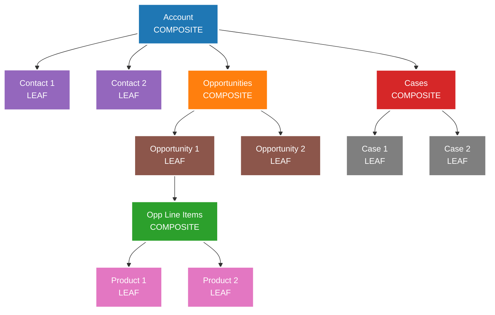

### Real Data Example

**Root: Account (Composite Node)**
```json
{
  "AccountId": "001XX001",
  "Name": "Acme Corporation",
  "Industry": "Manufacturing",
  "AnnualRevenue": 5000000,
  "Employees": 250,
  "children": {
    "Contacts": [...],
    "Opportunities": [...],
    "Cases": [...]
  }
}
```

**Child Level 1: Contacts (Leaf Nodes)**
```json
{
  "Contacts": [
    {
      "ContactId": "003XX001",
      "Name": "Jane Austin",
      "Title": "CTO",
      "Email": "jane.austin@acme.com",
      "Phone": "+1-555-0123",
      "IsPrimary": true
    },
    {
      "ContactId": "003XX002",
      "Name": "John Doe",
      "Title": "VP of Sales",
      "Email": "john.doe@acme.com",
      "Phone": "+1-555-0124",
      "IsPrimary": false
    }
  ]
}
```

**Child Level 1: Opportunities (Composite Nodes)**
```json
{
  "Opportunities": [
    {
      "OpportunityId": "006XX001",
      "Name": "Enterprise License Renewal",
      "Amount": 150000,
      "CloseDate": "2025-11-30",
      "Stage": "Negotiation",
      "Probability": 75,
      "ContactId": "003XX001",
      "children": {
        "OpportunityLineItems": [...]
      }
    },
    {
      "OpportunityId": "006XX002",
      "Name": "Professional Services",
      "Amount": 50000,
      "CloseDate": "2025-12-15",
      "Stage": "Proposal",
      "Probability": 60,
      "ContactId": "003XX002",
      "children": {
        "OpportunityLineItems": [...]
      }
    }
  ]
}
```

**Child Level 2: Opportunity Line Items (Leaf Nodes)**
```json
{
  "OpportunityLineItems": [
    {
      "LineItemId": "00kXX001",
      "OpportunityId": "006XX001",
      "ProductId": "01tXX001",
      "ProductName": "Enterprise License (100 users)",
      "Quantity": 100,
      "UnitPrice": 1200,
      "TotalPrice": 120000
    },
    {
      "LineItemId": "00kXX002",
      "OpportunityId": "006XX001",
      "ProductId": "01tXX002",
      "ProductName": "Premium Support",
      "Quantity": 1,
      "UnitPrice": 30000,
      "TotalPrice": 30000
    }
  ]
}
```

**Child Level 1: Cases (Composite Nodes)**
```json
{
  "Cases": [
    {
      "CaseId": "500XX001",
      "Subject": "Cannot access dashboard",
      "Status": "Open",
      "Priority": "High",
      "CreatedDate": "2025-10-20",
      "ContactId": "003XX001",
      "children": {
        "CaseComments": [...]
      }
    },
    {
      "CaseId": "500XX002",
      "Subject": "Feature request: API rate limit increase",
      "Status": "In Progress",
      "Priority": "Medium",
      "CreatedDate": "2025-10-15",
      "ContactId": "003XX002",
      "children": {
        "CaseComments": [...]
      }
    }
  ]
}
```

### Multi-Hop Graph Analytics (Traversing Composite Structure)

**Query: "Find all high-priority open cases for accounts with high-value opportunities closing this quarter"**

```
Traversal Path:
1. Account (Acme Corporation)
   ↓
2. Opportunities (Filter: Amount > 100000, CloseDate in Q4 2025)
   Result: 006XX001 (High-value)
   ↓
3. Related Contact for Opportunity
   Result: 003XX001 (Jane Austin)
   ↓
4. Cases for that Contact (Filter: Priority = High, Status = Open)
   Result: 500XX001

Answer: Case 500XX001 - "Cannot access dashboard"
```

**Graph Traversal Result:**
```json
{
  "query": "High-priority cases for high-value opportunities",
  "traversalPath": [
    {
      "level": 0,
      "node": "Account",
      "id": "001XX001",
      "name": "Acme Corporation"
    },
    {
      "level": 1,
      "node": "Opportunity",
      "id": "006XX001",
      "name": "Enterprise License Renewal",
      "amount": 150000
    },
    {
      "level": 2,
      "node": "Contact",
      "id": "003XX001",
      "name": "Jane Austin",
      "title": "CTO"
    },
    {
      "level": 3,
      "node": "Case",
      "id": "500XX001",
      "subject": "Cannot access dashboard",
      "priority": "High",
      "status": "Open"
    }
  ],
  "insight": "CTO of high-value account has critical open case affecting dashboard access during renewal negotiation",
  "recommendation": "Prioritize case resolution to prevent opportunity risk"
}
```

### Ontology Composite Structure

**From Architecture: Neo4j Graph Database**

```
[Class: Organization] (Composite)
    ├── [Attribute: Name]
    ├── [Attribute: Industry]
    ├── [Relationship: employs] → [Class: Person] (Composite)
    │       ├── [Attribute: FirstName]
    │       ├── [Attribute: LastName]
    │       ├── [Attribute: Email]
    │       └── [Relationship: owns] → [Class: Account] (Composite)
    │               ├── [Attribute: AccountNumber]
    │               └── [Relationship: contains] → [Class: Opportunity]
    │
    └── [Relationship: purchases] → [Class: Product] (Composite)
            ├── [Attribute: ProductName]
            ├── [Attribute: Price]
            └── [Relationship: belongsTo] → [Class: ProductLine]
```

**Example Instance:**
```json
{
  "class": "Organization",
  "instance": {
    "name": "Acme Corporation",
    "industry": "Manufacturing",
    "relationships": {
      "employs": [
        {
          "class": "Person",
          "firstName": "Jane",
          "lastName": "Austin",
          "email": "jane.austin@acme.com",
          "relationships": {
            "owns": [
              {
                "class": "Account",
                "accountNumber": "ACC-001",
                "relationships": {
                  "contains": [
                    {
                      "class": "Opportunity",
                      "name": "Enterprise License Renewal",
                      "amount": 150000
                    }
                  ]
                }
              }
            ]
          }
        }
      ],
      "purchases": [
        {
          "class": "Product",
          "productName": "Enterprise License",
          "price": 1200,
          "relationships": {
            "belongsTo": {
              "class": "ProductLine",
              "name": "Software Licenses"
            }
          }
        }
      ]
    }
  }
}
```

---

## 8. SINGLETON PATTERN

**📖 Definition:** The Singleton Pattern ensures that a class has only one instance and provides a global point of access to that instance. It controls object creation to guarantee uniqueness.

**🎯 Problem It Solves:** When you need exactly one instance of a class (like a database connection pool, configuration manager, or logging service) and want to prevent multiple instances that could cause conflicts or waste resources.

**💡 Simple Analogy:** Like a country's president - there can only be one president at a time, and everyone in the country knows how to reach that single president when needed. Creating multiple presidents would cause chaos.

**🔧 Key Components:**
- **Singleton Class**: The class that controls its own instantiation
- **Private Constructor**: Prevents external instantiation
- **Static Instance Method**: Provides access to the single instance
- **Static Instance Variable**: Holds the one and only instance

**✅ When to Use:**
- Exactly one instance of a class should exist
- Global access to that instance is needed
- Lazy initialization is desired to save resources
- Controlling access to shared resources (files, database connections)
- Configuration settings that should be consistent across the application

**🚀 Benefits:**
- Guarantees only one instance exists
- Provides global access point
- Lazy initialization saves resources
- Better control over global state

**⚠️ Considerations:**
- Can make unit testing difficult
- Can hide dependencies between classes
- May violate Single Responsibility Principle
- Consider alternatives like dependency injection for better testability

### Real Implementation in Architecture
**Location:** Unified Profiles (Single Source of Truth per Individual/Account)

### The Problem: Duplicate Records

**Before Identity Resolution:**

**Sales Org Contact:**
```json
{
  "Id": "003XX001",
  "Source": "Sales Org",
  "Name": "Jane Austin",
  "Email": "jane.austin@acme.com",
  "Phone": "+1-555-0123",
  "Status": "Active"
}
```

**Service Org Contact:**
```json
{
  "Id": "003YY002",
  "Source": "Service Org",
  "Name": "Jan Austin",
  "Email": "j.austin@acme.com",
  "Phone": "555-0123",
  "Status": "Active"
}
```

**Marketing Cloud Subscriber:**
```json
{
  "Id": "SUB-789",
  "Source": "Marketing Cloud",
  "Name": "J Austin",
  "Email": "jane.austin@acme.com",
  "Phone": "(555) 010-0123",
  "Status": "Subscribed"
}
```

**Problem: Three instances of the same person!**

### Solution: Unified Profile (SINGLETON)

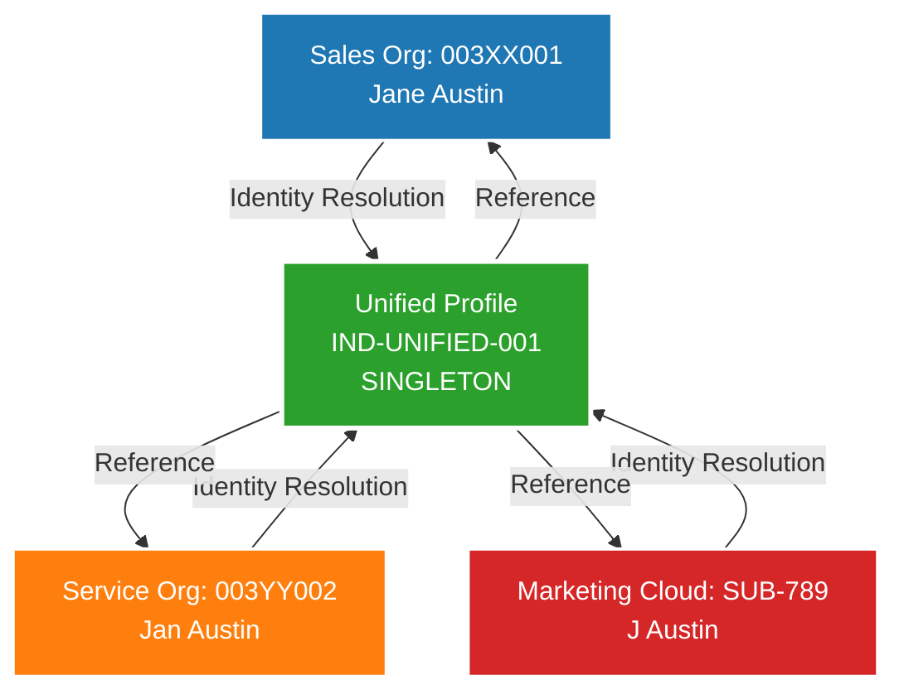

### Real Data Example

**After Identity Resolution (Singleton Created):**

```json
{
  "UnifiedIndividualId": "IND-UNIFIED-001",
  "type": "SINGLETON",
  "preferredData": {
    "FirstName": "Jane",
    "LastName": "Austin",
    "Email": "jane.austin@acme.com",
    "Phone": "+15550123",
    "Status": "Active"
  },
  "sourceRecords": [
    {
      "systemId": "003XX001",
      "systemName": "Sales Org",
      "systemType": "Salesforce CRM",
      "confidence": 1.0,
      "isPreferredSource": true,
      "fields": {
        "firstName": "Jane",
        "lastName": "Austin",
        "email": "jane.austin@acme.com",
        "phone": "+1-555-0123"
      }
    },
    {
      "systemId": "003YY002",
      "systemName": "Service Org",
      "systemType": "Salesforce CRM",
      "confidence": 0.95,
      "isPreferredSource": false,
      "fields": {
        "firstName": "Jan",
        "lastName": "Austin",
        "email": "j.austin@acme.com",
        "phone": "555-0123"
      }
    },
    {
      "systemId": "SUB-789",
      "systemName": "Marketing Cloud",
      "systemType": "Marketing Automation",
      "confidence": 0.92,
      "isPreferredSource": false,
      "fields": {
        "firstName": "J",
        "lastName": "Austin",
        "email": "jane.austin@acme.com",
        "phone": "(555) 010-0123"
      }
    }
  ],
  "dataLineage": {
    "createdDate": "2025-10-23T10:00:00Z",
    "lastModified": "2025-10-23T14:30:00Z",
    "preferredNameSource": "Sales Org (003XX001)",
    "preferredEmailSource": "Sales Org (003XX001)",
    "preferredPhoneSource": "Sales Org (003XX001)",
    "totalSources": 3,
    "resolutionMethod": "Exact Normalized Match",
    "resolutionConfidence": 0.95
  },
  "aggregatedMetrics": {
    "totalTransactions": 45,
    "lifetimeValue": 135000,
    "averageOrderValue": 3000,
    "lastPurchaseDate": "2025-10-23",
    "openCases": 1,
    "satisfactionScore": 4.5
  },
  "note": "Original records are preserved. No data is deleted or merged. This unified profile is a SINGLETON representation with references to all source records."
}
```

### Key Characteristics of Singleton Pattern

**1. Single Instance Per Entity:**
```
Individual "Jane Austin" → ONE Unified Profile (IND-UNIFIED-001)
Even if 10 systems have her data → Still ONE unified profile
```

**2. Global Access Point:**
```
Any system querying for Jane Austin → Gets IND-UNIFIED-001
Consistent view across all systems
```

**3. Data Lineage Preservation:**
```
Original records NOT deleted:
✓ Sales Org: 003XX001 (preserved)
✓ Service Org: 003YY002 (preserved)
✓ Marketing Cloud: SUB-789 (preserved)

Only creates new unified reference
```

### Account-Level Singleton Example

**Before: Multiple Account Records**

**Sales Org Account:**
```json
{
  "AccountId": "001XX001",
  "Source": "Sales Org",
  "Name": "Acme Corporation",
  "Website": "www.acme.com",
  "Industry": "Manufacturing",
  "AnnualRevenue": 5000000
}
```

**Other Org Account:**
```json
{
  "AccountId": "001ZZ999",
  "Source": "Other Org",
  "Name": "ACME Corp",
  "Website": "acme.com",
  "Industry": "Manufacturing",
  "AnnualRevenue": 5200000
}
```

**After: Unified Account Profile (SINGLETON)**

```json
{
  "UnifiedAccountId": "ACC-UNIFIED-5001",
  "type": "SINGLETON",
  "preferredData": {
    "Name": "Acme Corporation",
    "Website": "www.acme.com",
    "Industry": "Manufacturing",
    "AnnualRevenue": 5200000,
    "Employees": 250
  },
  "sourceRecords": [
    {
      "systemId": "001XX001",
      "systemName": "Sales Org",
      "confidence": 1.0,
      "isPreferredSource": true
    },
    {
      "systemId": "001ZZ999",
      "systemName": "Other Org",
      "confidence": 0.95,
      "isPreferredSource": false
    }
  ],
  "dataLineage": {
    "nameSource": "Sales Org",
    "revenueSource": "Other Org (more recent)",
    "lastReconciliation": "2025-10-23T10:00:00Z"
  }
}
```

### Master Data Management (MDM) as Singleton Enforcer

**From Architecture: Informatica MDM & Salesforce Data Cloud MDM**

```
MDM ensures:
1. ONE authoritative version per entity
2. Global unique identifier
3. Consistent access across systems
4. Governance and stewardship rules

Example:
Customer "Jane Austin" → Unified ID: IND-UNIFIED-001
All systems must use: IND-UNIFIED-001 for queries
Local IDs (003XX001, 003YY002, SUB-789) → Cross-referenced
```

---

## 9. FACTORY PATTERN

**📖 Definition:** The Factory Pattern creates objects without specifying their exact classes. Instead of calling constructors directly, you call a factory method that determines which class to instantiate based on input parameters.

**🎯 Problem It Solves:** When object creation is complex, when you need to choose between different related classes at runtime, or when you want to centralize object creation logic to make it easier to maintain and extend.

**💡 Simple Analogy:** Like ordering from a restaurant menu - you don't go into the kitchen and cook the food yourself. You tell the restaurant what you want (pizza, pasta, salad), and the kitchen (factory) creates the appropriate dish using the right recipe and ingredients.

**🔧 Key Components:**
- **Creator (Factory)**: Abstract class or interface declaring the factory method
- **Concrete Creator**: Implements the factory method to create specific products
- **Product**: Abstract class/interface for objects the factory creates  
- **Concrete Product**: Specific implementations that the factory produces

**✅ When to Use:**
- Object creation is complex and shouldn't be exposed to clients
- You need to choose between related classes at runtime
- You want to centralize object creation logic
- The system should be independent of how objects are created
- You want to provide a library of products without exposing implementation

**🚀 Benefits:**
- Eliminates tight coupling between creator and concrete products
- Centralizes object creation for easier maintenance
- Easy to add new product types without changing existing code
- Provides flexibility in object creation
- Follows Open/Closed Principle

### Real Implementation in Architecture
**Location:** Data Streams Creation (Different Ingestion Types)

### Diagram

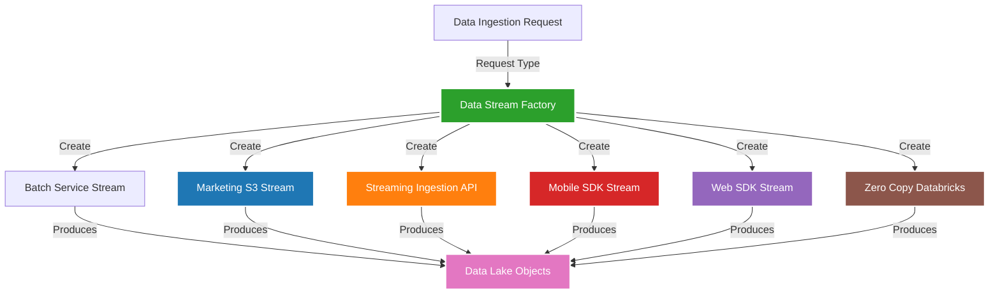

### Real Data Example

**Factory Input: Create Data Stream Request**

```json
{
  "requestId": "REQ-001",
  "sourceSystem": "Snowflake",
  "sourceType": "DataWarehouse",
  "dataType": "Transactions",
  "frequency": "Daily",
  "estimatedVolume": 50000,
  "priority": "High"
}
```

**Factory Decision Logic:**

```python
class DataStreamFactory:
    def create_stream(self, request):
        if request.sourceType == "DataWarehouse" and request.frequency == "Daily":
            return self.create_batch_service_stream(request)
        
        elif request.sourceType == "MarketingPlatform":
            return self.create_marketing_s3_stream(request)
        
        elif request.sourceType == "RealTimeEvents":
            return self.create_streaming_api_stream(request)
        
        elif request.sourceType == "MobileApp":
            return self.create_mobile_sdk_stream(request)
        
        elif request.sourceType == "Website":
            return self.create_web_sdk_stream(request)
        
        elif request.sourceType == "Databricks":
            return self.create_zero_copy_stream(request)
        
        else:
            raise ValueError(f"Unknown source type: {request.sourceType}")
```

### Product 1: Batch Service Stream

**Created Stream Configuration:**
```json
{
  "streamId": "STREAM-BATCH-001",
  "streamType": "BatchService",
  "name": "Snowflake Transactions Daily Import",
  "source": {
    "type": "Snowflake",
    "connection": "snowflake://acme.snowflakecomputing.com",
    "database": "PROD_DB",
    "schema": "TRANSACTIONS",
    "table": "DAILY_TRANSACTIONS"
  },
  "schedule": {
    "frequency": "Daily",
    "time": "02:00 AM UTC",
    "timezone": "UTC"
  },
  "transformation": {
    "fieldMapping": {
      "txn_id": "TransactionId",
      "cust_id": "IndividualId",
      "amount": "Amount",
      "txn_date": "TransactionDate"
    }
  },
  "destination": {
    "dataLakeObject": "Transaction__dmo",
    "dataModelObject": "Transaction"
  },
  "metadata": {
    "createdDate": "2025-10-23",
    "createdBy": "DataStreamFactory",
    "status": "Active"
  }
}
```

**Sample Data Flow:**
```
Snowflake Table → Batch Service → Data Lake Objects

Source Record:
{
  "txn_id": "TXN-98765",
  "cust_id": "CUST-12345",
  "amount": 50000.00,
  "txn_date": "2025-10-22"
}

After Transformation:
{
  "TransactionId": "TXN-98765",
  "IndividualId": "IND-UNIFIED-001",
  "Amount": 50000.00,
  "TransactionDate": "2025-10-22T00:00:00Z"
}
```

### Product 2: Streaming Ingestion API Stream

**Created Stream Configuration:**
```json
{
  "streamId": "STREAM-API-002",
  "streamType": "StreamingIngestionAPI",
  "name": "Real-time Product Views",
  "source": {
    "type": "HTTPS API",
    "endpoint": "https://api.datacloud.salesforce.com/v1/ingest",
    "authentication": "Bearer Token"
  },
  "frequency": "Real-time",
  "destination": {
    "dataLakeObject": "ProductView__dmo",
    "streamingInsight": "ProductViewMetrics"
  },
  "metadata": {
    "createdDate": "2025-10-23",
    "createdBy": "DataStreamFactory",
    "status": "Active"
  }
}
```

**Sample Data Flow:**
```
Website Event → Streaming API → Streaming Insights

Incoming Event:
POST https://api.datacloud.salesforce.com/v1/ingest
{
  "eventType": "ProductView",
  "timestamp": "2025-10-23T14:30:00.123Z",
  "userId": "USER-789",
  "productId": "PROD-456",
  "sessionId": "SESS-ABC123"
}

Processed in Real-time:
{
  "EventId": "EVT-55501",
  "EventType": "ProductView",
  "Timestamp": "2025-10-23T14:30:00.123Z",
  "IndividualId": "IND-UNIFIED-001",
  "ProductId": "PROD-456",
  "SessionId": "SESS-ABC123"
}

Streaming Insight Update:
{
  "metric": "Product Views Today",
  "productId": "PROD-456",
  "count": 1247,
  "lastUpdated": "2025-10-23T14:30:00.123Z"
}
```

### Product 3: Mobile SDK Stream

**Created Stream Configuration:**
```json
{
  "streamId": "STREAM-MOBILE-003",
  "streamType": "MobileSDK",
  "name": "Mobile App Activity",
  "source": {
    "type": "Mobile SDK",
    "platform": "iOS/Android",
    "sdkVersion": "3.2.1"
  },
  "eventTypes": [
    "AppLaunch",
    "ScreenView",
    "ButtonClick",
    "Purchase"
  ],
  "destination": {
    "dataLakeObject": "MobileEvent__dmo"
  }
}
```

**Sample Data Flow:**
```
Mobile App → Mobile SDK → Data Lake Objects

App Event:
{
  "eventType": "Purchase",
  "timestamp": "2025-10-23T14:45:00Z",
  "userId": "USER-789",
  "deviceId": "DEVICE-12345",
  "platform": "iOS",
  "appVersion": "2.1.0",
  "purchaseData": {
    "productId": "PROD-999",
    "amount": 99.99,
    "currency": "USD"
  }
}

Transformed:
{
  "EventId": "EVT-55502",
  "EventType": "Purchase",
  "Timestamp": "2025-10-23T14:45:00Z",
  "IndividualId": "IND-UNIFIED-001",
  "DeviceId": "DEVICE-12345",
  "Platform": "iOS",
  "ProductId": "PROD-999",
  "Amount": 99.99
}
```

### Product 4: Marketing S3 Stream

**Created Stream Configuration:**
```json
{
  "streamId": "STREAM-S3-004",
  "streamType": "MarketingS3",
  "name": "Marketing Cloud Campaign Data",
  "source": {
    "type": "Amazon S3",
    "bucket": "marketing-campaign-data",
    "prefix": "campaigns/2025/",
    "filePattern": "*.json"
  },
  "schedule": {
    "frequency": "Every 5 minutes",
    "pollInterval": 300
  },
  "destination": {
    "dataLakeObject": "CampaignEngagement__dmo"
  }
}
```

**Sample Data Flow:**
```
Marketing Cloud → S3 Bucket → Marketing S3 Stream → Data Lake

S3 File: campaigns/2025/engagement-2025-10-23-1430.json
{
  "subscriberId": "SUB-789",
  "campaignId": "CAMP-567",
  "eventType": "EmailOpen",
  "timestamp": "2025-10-23T14:30:00Z",
  "emailSubject": "Fall Sale - 30% Off"
}

Transformed:
{
  "EventId": "EVT-55503",
  "IndividualId": "IND-UNIFIED-001",
  "CampaignId": "CAMP-567",
  "EventType": "EmailOpen",
  "Timestamp": "2025-10-23T14:30:00Z",
  "Subject": "Fall Sale - 30% Off"
}
```

### Product 5: Zero Copy Databricks Stream

**Created Stream Configuration:**
```json
{
  "streamId": "STREAM-ZEROCOPY-005",
  "streamType": "ZeroCopyDatabricks",
  "name": "ML Model Features from Databricks",
  "source": {
    "type": "Databricks",
    "workspace": "acme-databricks.cloud.databricks.com",
    "catalog": "ml_features",
    "schema": "customer_features",
    "table": "churn_predictions"
  },
  "accessMethod": "Zero Copy (BYOL)",
  "destination": {
    "dataLakeObject": "ChurnPrediction__dmo"
  }
}
```

**Sample Data Flow:**
```
Databricks Table → Zero Copy → Data Cloud (No data movement!)

Databricks Table: churn_predictions
{
  "customer_id": "CUST-12345",
  "churn_probability": 0.78,
  "risk_factors": ["low_engagement", "high_support_cases"],
  "prediction_date": "2025-10-23"
}

Data Cloud Access (Virtual):
{
  "IndividualId": "IND-UNIFIED-001",
  "ChurnProbability": 0.78,
  "RiskFactors": ["low_engagement", "high_support_cases"],
  "PredictionDate": "2025-10-23"
}

Note: Data stays in Databricks, accessed virtually
```

### Factory Pattern Benefits

**1. Centralized Creation Logic:**
```
All stream types created through single factory
Consistent configuration and validation
```

**2. Easy Extension:**
```
Add new stream type:
- Implement new product class
- Add to factory method
- No changes to client code
```

**3. Encapsulation:**
```
Client doesn't need to know:
- How each stream type works
- Connection details
- Transformation logic
Just requests: "Create stream for X"
```

---

## 10. DECORATOR PATTERN

**📖 Definition:** The Decorator Pattern allows you to add new functionality to objects dynamically by wrapping them in decorator objects. Each decorator adds behavior while keeping the same interface as the original object.

**🎯 Problem It Solves:** When you want to add responsibilities to objects without altering their structure, and when subclassing would result in an explosion of classes to support every combination of features.

**💡 Simple Analogy:** Like dressing for winter - you start with a base layer (t-shirt), then add decorators (sweater, jacket, scarf, gloves). Each layer adds functionality (warmth) while maintaining the same basic interface (you're still wearing clothes).

**🔧 Key Components:**
- **Component**: Abstract interface for objects that can have responsibilities added
- **Concrete Component**: Basic implementation of the component interface
- **Decorator**: Abstract class that implements component and holds a component reference
- **Concrete Decorators**: Add specific responsibilities to the component

**✅ When to Use:**
- Adding responsibilities to objects dynamically and transparently
- When subclassing would create too many classes
- Removing responsibilities from objects should be possible
- Extension by subclassing is impractical
- You want to add features in different combinations

**🚀 Benefits:**
- More flexible than static inheritance
- Adds responsibilities without changing the object
- Supports composition of behaviors
- Easy to add new types of decorators
- Follows Open/Closed Principle

### Real Implementation in Architecture
**Location:** CRM Enrichment → Data Lake Objects

### Diagram

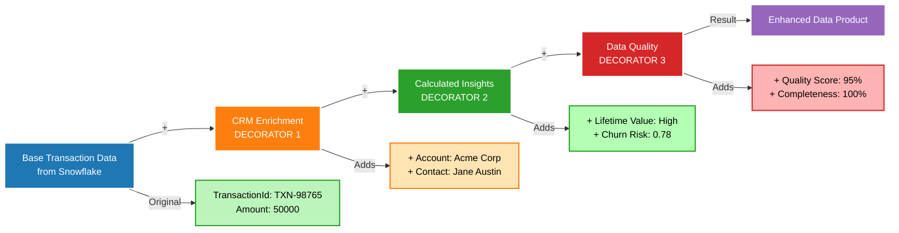

### Real Data Example

**Base Component: Raw Transaction from Snowflake**

```json
{
  "transactionId": "TXN-98765",
  "customerId": "CUST-12345",
  "amount": 50000.00,
  "date": "2025-10-23",
  "productCode": "ENT-LIC-100",
  "source": "Snowflake"
}
```

**Decorator 1: CRM Enrichment**

**What it adds:**
- Links to Salesforce CRM objects (Account, Contact, Opportunity)
- Adds business context

**After CRM Enrichment:**
```json
{
  "transactionId": "TXN-98765",
  "customerId": "CUST-12345",
  "amount": 50000.00,
  "date": "2025-10-23",
  "productCode": "ENT-LIC-100",
  "source": "Snowflake",
  
  "_crmEnrichment": {
    "enrichedDate": "2025-10-23T14:31:00Z",
    "unifiedIndividualId": "IND-UNIFIED-001",
    "individualName": "Jane Austin",
    "individualEmail": "jane.austin@acme.com",
    "unifiedAccountId": "ACC-UNIFIED-5001",
    "accountName": "Acme Corporation",
    "accountIndustry": "Manufacturing",
    "relatedOpportunityId": "006XX001",
    "opportunityName": "Enterprise License Renewal",
    "opportunityStage": "Closed Won",
    "accountOwnerId": "005XX001",
    "accountOwnerName": "John Doe"
  }
}
```

**Decorator 2: Calculated Insights**

**What it adds:**
- Lifetime Value calculation
- Churn probability from ML model
- Engagement metrics

**After Calculated Insights:**
```json
{
  "transactionId": "TXN-98765",
  "customerId": "CUST-12345",
  "amount": 50000.00,
  "date": "2025-10-23",
  "productCode": "ENT-LIC-100",
  "source": "Snowflake",
  
  "_crmEnrichment": {
    "enrichedDate": "2025-10-23T14:31:00Z",
    "unifiedIndividualId": "IND-UNIFIED-001",
    "individualName": "Jane Austin",
    "individualEmail": "jane.austin@acme.com",
    "unifiedAccountId": "ACC-UNIFIED-5001",
    "accountName": "Acme Corporation",
    "accountIndustry": "Manufacturing",
    "relatedOpportunityId": "006XX001",
    "opportunityName": "Enterprise License Renewal",
    "opportunityStage": "Closed Won",
    "accountOwnerId": "005XX001",
    "accountOwnerName": "John Doe"
  },
  
  "_calculatedInsights": {
    "calculatedDate": "2025-10-23T14:32:00Z",
    "lifetimeValue": {
      "total": 135000.00,
      "previousTotal": 85000.00,
      "change": 50000.00,
      "percentageChange": 58.82,
      "calculation": "SUM(all transactions for IND-UNIFIED-001)"
    },
    "churnProbability": {
      "score": 0.78,
      "risk": "High",
      "factors": [
        "Login frequency declined from 15 to 3/month",
        "2 unresolved high-priority cases",
        "Contract renewal approaching"
      ],
      "modelUsed": "ChurnPredictionModel_v2.3",
      "predictionDate": "2025-10-23"
    },
    "engagementScore": {
      "current": 42,
      "previous": 75,
      "trend": "Declining",
      "lastActivityDate": "2025-10-15"
    },
    "accountHealth": {
      "score": 65,
      "status": "At Risk",
      "reason": "High churn risk + declining engagement"
    }
  }
}
```

**Decorator 3: Data Quality Validation**

**What it adds:**
- Quality scores
- Completeness checks
- Lineage information

**Final Enhanced Record:**
```json
{
  "transactionId": "TXN-98765",
  "customerId": "CUST-12345",
  "amount": 50000.00,
  "date": "2025-10-23",
  "productCode": "ENT-LIC-100",
  "source": "Snowflake",
  
  "_crmEnrichment": {
    "enrichedDate": "2025-10-23T14:31:00Z",
    "unifiedIndividualId": "IND-UNIFIED-001",
    "individualName": "Jane Austin",
    "individualEmail": "jane.austin@acme.com",
    "unifiedAccountId": "ACC-UNIFIED-5001",
    "accountName": "Acme Corporation",
    "accountIndustry": "Manufacturing",
    "relatedOpportunityId": "006XX001",
    "opportunityName": "Enterprise License Renewal",
    "opportunityStage": "Closed Won",
    "accountOwnerId": "005XX001",
    "accountOwnerName": "John Doe"
  },
  
  "_calculatedInsights": {
    "calculatedDate": "2025-10-23T14:32:00Z",
    "lifetimeValue": {
      "total": 135000.00,
      "previousTotal": 85000.00,
      "change": 50000.00,
      "percentageChange": 58.82,
      "calculation": "SUM(all transactions for IND-UNIFIED-001)"
    },
    "churnProbability": {
      "score": 0.78,
      "risk": "High",
      "factors": [
        "Login frequency declined from 15 to 3/month",
        "2 unresolved high-priority cases",
        "Contract renewal approaching"
      ],
      "modelUsed": "ChurnPredictionModel_v2.3",
      "predictionDate": "2025-10-23"
    },
    "engagementScore": {
      "current": 42,
      "previous": 75,
      "trend": "Declining",
      "lastActivityDate": "2025-10-15"
    },
    "accountHealth": {
      "score": 65,
      "status": "At Risk",
      "reason": "High churn risk + declining engagement"
    }
  },
  
  "_dataQuality": {
    "validatedDate": "2025-10-23T14:33:00Z",
    "qualityScore": 95,
    "completenessScore": 100,
    "accuracyScore": 92,
    "validations": {
      "amountValid": true,
      "dateValid": true,
      "customerIdValid": true,
      "crmLinkValid": true,
      "calculationsValid": true
    },
    "issues": [
      {
        "field": "engagementScore",
        "issue": "Calculated value seems low",
        "severity": "Warning",
        "recommendation": "Verify recent activity logs"
      }
    ],
    "lineage": {
      "sourceSystem": "Snowflake",
      "ingestionMethod": "Batch Service",
      "enrichmentPipeline": [
        "CRM Enrichment (2025-10-23T14:31:00Z)",
        "Calculated Insights (2025-10-23T14:32:00Z)",
        "Data Quality Validation (2025-10-23T14:33:00Z)"
      ],
      "transformations": 12,
      "dataAge": "1 hour"
    }
  }
}
```

### Decorator Pattern Benefits

**1. Dynamic Enhancement:**
```
Can add/remove decorators without modifying base object
Each decorator is independent
```

**2. Single Responsibility:**
```
CRM Enrichment: Only adds CRM context
Calculated Insights: Only adds calculations
Data Quality: Only adds validation
```

**3. Flexible Composition:**
```
Can choose which decorators to apply:
- Basic: No decorators
- Standard: CRM Enrichment only
- Premium: CRM + Calculated Insights
- Enterprise: All decorators
```

### Another Example: Data Product Enhancement

**Base Data Product: Customer360**

```json
{
  "dataProductId": "DP-CUST360-001",
  "name": "Customer360 Basic",
  "unifiedIndividualId": "IND-UNIFIED-001",
  "basicInfo": {
    "name": "Jane Austin",
    "email": "jane.austin@acme.com",
    "phone": "+15550123"
  }
}
```

**+Decorator: Segmentation**

```json
{
  "dataProductId": "DP-CUST360-001",
  "name": "Customer360 with Segmentation",
  "unifiedIndividualId": "IND-UNIFIED-001",
  "basicInfo": {...},
  
  "_segmentation": {
    "segments": [
      {
        "segmentId": "SEG-HIGH-VALUE-001",
        "name": "High-Value Customers",
        "membershipDate": "2025-10-23",
        "criteria": "LTV > Threshold"
      },
      {
        "segmentId": "SEG-AT-RISK-002",
        "name": "At-Risk Customers",
        "membershipDate": "2025-10-23",
        "criteria": "Churn Probability > 0.7"
      }
    ]
  }
}
```

**+Decorator: ML Predictions**

```json
{
  "dataProductId": "DP-CUST360-001",
  "name": "Customer360 AI-Enhanced",
  "unifiedIndividualId": "IND-UNIFIED-001",
  "basicInfo": {...},
  "_segmentation": {...},
  
  "_mlPredictions": {
    "churnPrediction": {
      "probability": 0.78,
      "confidence": 0.89,
      "modelVersion": "v2.3"
    },
    "nextBestAction": {
      "action": "Executive Outreach",
      "priority": "High",
      "expectedImpact": "+15% retention probability"
    },
    "lifetimeValueForecast": {
      "next12Months": 45000,
      "confidence": 0.82
    }
  }
}
```

---

## 11. BRIDGE PATTERN

**📖 Definition:** The Bridge Pattern separates an abstraction from its implementation so that both can vary independently. It creates a bridge between the abstraction and implementation hierarchies.

**🎯 Problem It Solves:** When you want to avoid permanent binding between an abstraction and its implementation, share implementation among multiple objects, or when changes to implementation should not impact clients.

**💡 Simple Analogy:** Like a universal remote control (abstraction) that can work with different TV brands (implementations). The remote provides the same buttons (interface) regardless of whether it's controlling a Samsung, Sony, or LG TV. You can change the TV without needing a new remote.

**🔧 Key Components:**
- **Abstraction**: High-level interface that clients use
- **Refined Abstraction**: Extended versions of the basic abstraction
- **Implementation**: Interface for implementation classes
- **Concrete Implementation**: Specific implementations that do the actual work

**✅ When to Use:**
- You want to avoid compile-time binding between abstraction and implementation
- Both abstractions and implementations should be extensible through subclassing
- Changes to implementation should not affect client code
- You want to share implementation among multiple objects
- You need to switch implementations at runtime

**🚀 Benefits:**
- Separates interface from implementation
- Improves extensibility - both sides can evolve independently
- Hides implementation details from clients
- Allows runtime selection of implementation
- Follows Open/Closed Principle

### Real Implementation in Architecture
**Location:** Semantic Layer (Abstraction) ↔ Data Storage (Implementation)

### Diagram

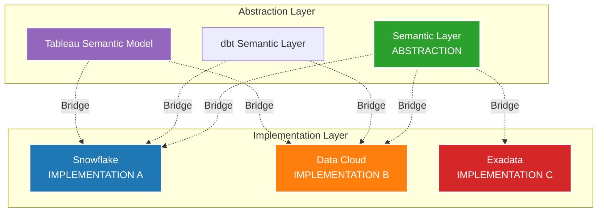

### Real Data Example

**Business User Query (Abstraction):**
```
"Show me Sales Velocity for the Technology industry"
```

**Semantic Layer Definition (Abstraction):**
```json
{
  "metricName": "Sales Velocity",
  "businessDefinition": "Average daily revenue from closed-won opportunities",
  "formula": "SUM(Opportunity.Amount) / AVG(Days_To_Close)",
  "dimensions": ["Industry", "Region", "Product"],
  "filters": {
    "Stage": "Closed Won",
    "CloseDate": "Recent timeframe"
  }
}
```

**Implementation A: Snowflake Query**
```sql
-- When data is in Snowflake (Implementation A)
SELECT 
    a.industry,
    SUM(o.amount) / AVG(DATEDIFF('day', o.created_date, o.close_date)) as sales_velocity
FROM snowflake.prod.opportunities o
JOIN snowflake.prod.accounts a ON o.account_id = a.id
WHERE o.stage_name = 'Closed Won'
  AND o.close_date >= DATEADD('day', -90, CURRENT_DATE())
GROUP BY a.industry;
```

**Result from Snowflake:**
```json
{
  "query": "Sales Velocity",
  "source": "Snowflake",
  "data": [
    {
      "Industry": "Technology",
      "SalesVelocity": 125000.00,
      "OpportunitiesCount": 45,
      "AvgDaysToClose": 28
    }
  ],
  "executionTime": "1.2s"
}
```

**Implementation B: Data Cloud Query**
```sql
-- When data is in Data Cloud (Implementation B)
SELECT 
    account.Industry__c,
    SUM(opportunity.Amount) / AVG(DAYS_BETWEEN(opportunity.CreatedDate, opportunity.CloseDate)) as sales_velocity
FROM DataCloud.Opportunity__dmo opportunity
JOIN DataCloud.Account__dmo account ON opportunity.AccountId = account.Id
WHERE opportunity.StageName = 'Closed Won'
  AND opportunity.CloseDate >= DATEADD(DAY, -90, TODAY())
GROUP BY account.Industry__c;
```

**Result from Data Cloud:**
```json
{
  "query": "Sales Velocity",
  "source": "Data Cloud",
  "data": [
    {
      "Industry": "Technology",
      "SalesVelocity": 125000.00,
      "OpportunitiesCount": 45,
      "AvgDaysToClose": 28
    }
  ],
  "executionTime": "0.8s"
}
```

**Implementation C: Exadata Query**
```sql
-- When data is in Exadata (Implementation C)
SELECT 
    a.industry_name,
    SUM(o.opportunity_amount) / AVG(o.close_date - o.create_date) as sales_velocity
FROM exadata.opportunities o
INNER JOIN exadata.accounts a ON o.account_fk = a.account_pk
WHERE o.stage_code = 'CLOSED_WON'
  AND o.close_date >= ADD_MONTHS(SYSDATE, -3)
GROUP BY a.industry_name;
```

### Key Benefit: Implementation Independence

**Business User Experience (Same regardless of backend):**

```
User Query: "Show Sales Velocity for Technology"
        ↓
Semantic Layer (Abstraction)
        ↓
    [BRIDGE]
        ↓
Implementation selected based on:
- Data location
- Performance requirements
- Cost optimization
        ↓
Result: High-value daily operations
```

**User doesn't know or care:**
- Where data is stored (Snowflake vs Data Cloud vs Exadata)
- What query language is used (SQL dialects differ)
- How joins are structured (different schemas)

### Real Migration Scenario (Bridge Pattern Value)

**FY2024: Data in Snowflake**
```
Semantic Layer → Snowflake
All queries go to Snowflake
```

**FY2027: Migration in Progress**
```
Semantic Layer → 70% Snowflake, 30% Data Cloud
Bridge pattern routes queries to appropriate platform
```

**FY2031: Fully on Data Cloud**
```
Semantic Layer → Data Cloud
All queries go to Data Cloud
```

**Critical Point:** 
```
Business reports/dashboards: NO CHANGES NEEDED
Only the implementation (backend) changed
Abstraction (Semantic Layer) remained stable
```

### Another Bridge Example: dbt Semantic Layer

**Abstraction: dbt Metric Definition**

```yaml
# dbt_project.yml
metrics:
  - name: customer_lifetime_value
    label: Customer Lifetime Value
    model: ref('transactions')
    description: "Total revenue from a customer"
    calculation_method: sum
    expression: amount
    timestamp: transaction_date
    time_grains: [day, week, month, quarter, year]
    dimensions:
      - industry
      - region
      - customer_segment
```

**Implementation A: Calculated from Snowflake**
```sql
-- Generated SQL for Snowflake
SELECT 
    customer_id,
    industry,
    region,
    SUM(amount) as customer_lifetime_value
FROM snowflake.analytics.transactions
GROUP BY customer_id, industry, region;
```

**Implementation B: Calculated from Data Cloud**
```sql
-- Generated SQL for Data Cloud
SELECT 
    IndividualId,
    Industry__c,
    Region__c,
    SUM(Amount) as customer_lifetime_value
FROM DataCloud.Transaction__dmo
GROUP BY IndividualId, Industry__c, Region__c;
```

**API Response (Same regardless of implementation):**
```json
{
  "metric": "customer_lifetime_value",
  "value": 135000.00,
  "dimensions": {
    "industry": "Technology",
    "region": "North America",
    "customer_segment": "Enterprise"
  },
  "period": "All Time",
  "last_updated": "2025-10-23T14:30:00Z"
}
```

---

## 12. TEMPLATE METHOD PATTERN

**📖 Definition:** The Template Method Pattern defines the skeleton of an algorithm in a base class and lets subclasses override specific steps without changing the algorithm's structure.

**🎯 Problem It Solves:** When you have algorithms that share the same overall structure but differ in some specific steps, and you want to avoid code duplication while allowing customization of certain parts.

**💡 Simple Analogy:** Like following a recipe for baking - the basic steps are always the same (preheat oven, mix ingredients, bake, cool), but specific details can vary (what ingredients to mix, what temperature, how long to bake) depending on whether you're making cookies, cake, or bread.

**🔧 Key Components:**
- **Abstract Class**: Defines the template method and abstract/hook methods
- **Template Method**: The algorithm skeleton that calls other methods in sequence
- **Abstract Methods**: Steps that subclasses must implement
- **Hook Methods**: Optional steps that subclasses can override
- **Concrete Classes**: Implement the abstract methods for specific algorithms

**✅ When to Use:**
- Multiple classes have similar algorithms with minor differences
- You want to control which parts of an algorithm can be customized
- Common behavior should be factored out to avoid code duplication
- You want to implement the invariant parts of an algorithm once

**🚀 Benefits:**
- Promotes code reuse by factoring out common behavior
- Controls which parts of the algorithm can be extended
- Follows "Don't Repeat Yourself" (DRY) principle
- Provides a clear structure for implementing variants of an algorithm
- Follows Hollywood Principle: "Don't call us, we'll call you"

### Real Implementation in Architecture
**Location:** Data Ingestion Pipeline (ETL Workflow)

### Diagram

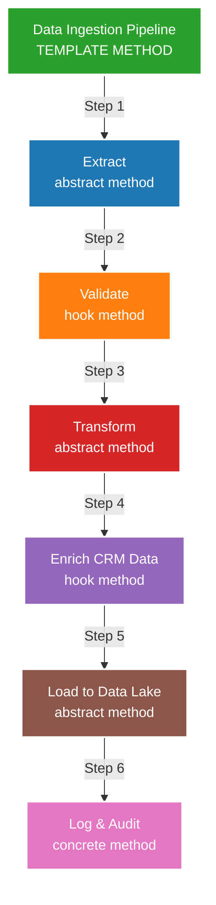

### Real Data Example

**Template: Standard Data Ingestion Process**

```python
# Abstract Template Class
class DataIngestionTemplate:
    def ingest_data(self):
        """Template Method - defines skeleton"""
        # Step 1: Extract (abstract - must implement)
        raw_data = self.extract()
        
        # Step 2: Validate (hook - can override)
        if self.should_validate():
            validated_data = self.validate(raw_data)
        else:
            validated_data = raw_data
        
        # Step 3: Transform (abstract - must implement)
        transformed_data = self.transform(validated_data)
        
        # Step 4: Enrich (hook - can override)
        if self.should_enrich():
            enriched_data = self.enrich_crm(transformed_data)
        else:
            enriched_data = transformed_data
        
        # Step 5: Load (abstract - must implement)
        result = self.load(enriched_data)
        
        # Step 6: Log (concrete - always executes)
        self.log_and_audit(result)
        
        return result
    
    # Abstract methods (must be implemented by subclass)
    def extract(self):
        raise NotImplementedError
    
    def transform(self, data):
        raise NotImplementedError
    
    def load(self, data):
        raise NotImplementedError
    
    # Hook methods (can be overridden)
    def should_validate(self):
        return True
    
    def validate(self, data):
        return data  # Default: no-op
    
    def should_enrich(self):
        return True
    
    def enrich_crm(self, data):
        return data  # Default: no-op
    
    # Concrete method (same for all)
    def log_and_audit(self, result):
        """Always logs to Splunk"""
        log_entry = {
            "timestamp": datetime.now(),
            "pipeline": self.__class__.__name__,
            "records_processed": len(result),
            "status": "Success"
        }
        send_to_splunk(log_entry)
```

### Concrete Implementation 1: Snowflake Transaction Ingestion

```python
class SnowflakeTransactionIngestion(DataIngestionTemplate):
    def extract(self):
        """Step 1: Extract from Snowflake"""
        query = """
        SELECT 
            txn_id,
            cust_id,
            amount,
            txn_date,
            product_code
        FROM snowflake.prod.transactions
        WHERE txn_date = CURRENT_DATE - 1
        """
        result = snowflake_connection.execute(query)
        
        return [
            {
                "txn_id": "TXN-98765",
                "cust_id": "CUST-12345",
                "amount": 50000.00,
                "txn_date": "2025-10-22",
                "product_code": "ENT-LIC-100"
            },
            {
                "txn_id": "TXN-98766",
                "cust_id": "CUST-67890",
                "amount": 25000.00,
                "txn_date": "2025-10-22",
                "product_code": "PRO-LIC-50"
            }
        ]
    
    def validate(self, data):
        """Step 2: Validate transaction data"""
        validated = []
        for record in data:
            if record["amount"] > 0 and record["cust_id"]:
                record["_validation_status"] = "Valid"
                validated.append(record)
            else:
                record["_validation_status"] = "Invalid"
                # Log but don't include
                log_invalid_record(record)
        return validated
    
    def transform(self, data):
        """Step 3: Transform to Data Cloud schema"""
        transformed = []
        for record in data:
            transformed.append({
                "TransactionId": record["txn_id"],
                "CustomerId": record["cust_id"],
                "Amount": record["amount"],
                "TransactionDate": f"{record['txn_date']}T00:00:00Z",
                "ProductCode": record["product_code"],
                "_sourceSystem": "Snowflake"
            })
        return transformed
    
    def enrich_crm(self, data):
        """Step 4: Enrich with CRM data"""
        enriched = []
        for record in data:
            # Look up customer in Data Cloud
            unified_profile = get_unified_profile(record["CustomerId"])
            
            record["IndividualId"] = unified_profile["UnifiedIndividualId"]
            record["AccountId"] = unified_profile["UnifiedAccountId"]
            record["AccountName"] = unified_profile["AccountName"]
            record["Industry"] = unified_profile["Industry"]
            enriched.append(record)
        
        return enriched
    
    def load(self, data):
        """Step 5: Load to Data Cloud"""
        result = []
        for record in data:
            inserted = data_cloud_api.insert(
                object="Transaction__dmo",
                data=record
            )
            result.append(inserted)
        return result
```

**Execution Flow:**

```json
{
  "pipeline": "SnowflakeTransactionIngestion",
  "execution": {
    "step1_extract": {
      "status": "Success",
      "records_extracted": 2,
      "source": "Snowflake",
      "query_time": "1.2s"
    },
    "step2_validate": {
      "status": "Success",
      "records_validated": 2,
      "records_invalid": 0
    },
    "step3_transform": {
      "status": "Success",
      "records_transformed": 2,
      "transformation_rules": 5
    },
    "step4_enrich": {
      "status": "Success",
      "records_enriched": 2,
      "crm_lookups": 2,
      "enrichment_fields_added": 4
    },
    "step5_load": {
      "status": "Success",
      "records_loaded": 2,
      "destination": "DataCloud.Transaction__dmo"
    },
    "step6_log": {
      "status": "Success",
      "logged_to": "Splunk Enterprise"
    }
  },
  "totalTime": "3.8s"
}
```

### Concrete Implementation 2: Web SDK Event Ingestion

```python
class WebSDKEventIngestion(DataIngestionTemplate):
    def extract(self):
        """Step 1: Extract from Web SDK stream"""
        events = web_sdk_stream.poll(batch_size=100)
        
        return [
            {
                "event_type": "ProductView",
                "timestamp": "2025-10-23T14:30:00.123Z",
                "user_id": "USER-789",
                "product_id": "PROD-456",
                "session_id": "SESS-ABC123"
            },
            {
                "event_type": "AddToCart",
                "timestamp": "2025-10-23T14:31:00.456Z",
                "user_id": "USER-789",
                "product_id": "PROD-456",
                "session_id": "SESS-ABC123",
                "quantity": 1
            }
        ]
    
    def should_validate(self):
        """Skip validation for real-time events"""
        return False
    
    def transform(self, data):
        """Step 3: Transform to Data Cloud schema"""
        transformed = []
        for event in data:
            transformed.append({
                "EventType": event["event_type"],
                "Timestamp": event["timestamp"],
                "UserId": event["user_id"],
                "ProductId": event.get("product_id"),
                "SessionId": event["session_id"],
                "Quantity": event.get("quantity"),
                "_sourceSystem": "Web SDK"
            })
        return transformed
    
    def should_enrich(self):
        """Skip CRM enrichment for real-time (do later)"""
        return False
    
    def load(self, data):
        """Step 5: Load to Data Cloud streaming"""
        result = []
        for event in data:
            inserted = data_cloud_streaming_api.insert(
                object="WebEvent__dmo",
                data=event
            )
            result.append(inserted)
        return result
```

**Execution Flow (Faster - skips some steps):**

```json
{
  "pipeline": "WebSDKEventIngestion",
  "execution": {
    "step1_extract": {
      "status": "Success",
      "events_extracted": 2,
      "source": "Web SDK Stream"
    },
    "step2_validate": {
      "status": "Skipped",
      "reason": "Real-time events"
    },
    "step3_transform": {
      "status": "Success",
      "events_transformed": 2
    },
    "step4_enrich": {
      "status": "Skipped",
      "reason": "Enrichment done async"
    },
    "step5_load": {
      "status": "Success",
      "events_loaded": 2,
      "destination": "DataCloud.WebEvent__dmo"
    },
    "step6_log": {
      "status": "Success",
      "logged_to": "Splunk Enterprise"
    }
  },
  "totalTime": "0.3s"
}
```

### Concrete Implementation 3: Marketing S3 Batch Ingestion

```python
class MarketingS3BatchIngestion(DataIngestionTemplate):
    def extract(self):
        """Step 1: Extract from S3"""
        s3_file = "s3://marketing-data/campaigns/2025-10-22/engagement.json"
        data = s3.get_object(Bucket="marketing-data", Key=s3_file)
        
        return json.loads(data["Body"].read())
    
    def validate(self, data):
        """Step 2: Validate campaign data"""
        validated = []
        for record in data:
            # Check required fields
            if all(k in record for k in ["subscriber_id", "campaign_id", "event_type"]):
                record["_validation_status"] = "Valid"
                validated.append(record)
        return validated
    
    def transform(self, data):
        """Step 3: Transform to Data Cloud schema"""
        transformed = []
        for record in data:
            transformed.append({
                "SubscriberId": record["subscriber_id"],
                "CampaignId": record["campaign_id"],
                "EventType": record["event_type"],
                "Timestamp": record["timestamp"],
                "EmailSubject": record.get("email_subject"),
                "_sourceSystem": "Marketing Cloud"
            })
        return transformed
    
    def enrich_crm(self, data):
        """Step 4: Match subscribers to unified profiles"""
        enriched = []
        for record in data:
            # Match subscriber to individual
            match = match_subscriber_to_individual(record["SubscriberId"])
            
            record["IndividualId"] = match["UnifiedIndividualId"]
            record["AccountId"] = match.get("UnifiedAccountId")
            enriched.append(record)
        
        return enriched
    
    def load(self, data):
        """Step 5: Bulk load to Data Cloud"""
        bulk_result = data_cloud_bulk_api.insert(
            object="CampaignEngagement__dmo",
            records=data
        )
        return bulk_result
```

### Template Method Benefits

**1. Consistent Process:**
```
All ingestion pipelines follow same steps
Ensures quality and auditability
```

**2. Flexibility:**
```
Each implementation can customize:
- How to extract (different sources)
- How to transform (different schemas)
- Whether to validate (based on speed needs)
- Whether to enrich (based on use case)
```

**3. Code Reuse:**
```
Logging (Step 6) is same for all
No need to reimplement in each pipeline
```

**4. Easy to Add New Pipelines:**
```
New source system?
- Extend DataIngestionTemplate
- Implement 3 abstract methods
- Override hooks if needed
- Done!
```

### Apache Airflow DAG (Template Method)

```python
# Airflow DAG using Template Method pattern
from airflow import DAG
from datetime import datetime

dag = DAG(
    'snowflake_transaction_ingestion',
    start_date=datetime(2025, 10, 1),
    schedule_interval='@daily'
)

# Each task is a step in the template
extract_task = PythonOperator(
    task_id='extract',
    python_callable=extract_from_snowflake,
    dag=dag
)

validate_task = PythonOperator(
    task_id='validate',
    python_callable=validate_data,
    dag=dag
)

transform_task = PythonOperator(
    task_id='transform',
    python_callable=transform_to_schema,
    dag=dag
)

enrich_task = PythonOperator(
    task_id='enrich_crm',
    python_callable=enrich_with_crm,
    dag=dag
)

load_task = PythonOperator(
    task_id='load',
    python_callable=load_to_datacloud,
    dag=dag
)

log_task = PythonOperator(
    task_id='log_audit',
    python_callable=log_to_splunk,
    dag=dag
)

# Define template flow
extract_task >> validate_task >> transform_task >> enrich_task >> load_task >> log_task
```

---

## 13. CHAIN OF RESPONSIBILITY PATTERN

**📖 Definition:** The Chain of Responsibility Pattern passes requests along a chain of handlers. Each handler decides either to process the request or pass it to the next handler in the chain.

**🎯 Problem It Solves:** When multiple objects can handle a request but you don't know which one should handle it beforehand, or when you want to decouple request senders from receivers.

**💡 Simple Analogy:** Like a customer service escalation system - when you call with a problem, it goes first to level 1 support. If they can't solve it, it goes to level 2, then level 3, and finally to a manager. Each level decides whether they can handle it or should pass it up the chain.

**🔧 Key Components:**
- **Handler**: Abstract interface defining how to handle requests and set next handler
- **Concrete Handlers**: Specific implementations that either handle requests or pass them on
- **Client**: Initiates requests to the chain
- **Request**: The data being passed through the chain

**✅ When to Use:**
- Multiple objects can handle a request, but you don't know which one beforehand
- You want to decouple request senders from receivers
- The set of handlers should be specified dynamically
- You want to issue a request without specifying the receiver explicitly

**🚀 Benefits:**
- Reduces coupling between sender and receiver
- Adds flexibility in assigning responsibilities
- Easy to add or remove handlers from the chain
- Each handler focuses on single responsibility
- Follows Open/Closed Principle

### Real Implementation in Architecture
**Location:** Data Quality Pipeline (Ataccama → Monte Carlo → Lego Data Quality)

### Diagram

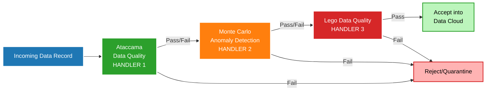

### Real Data Example

**Incoming Transaction Record:**

```json
{
  "transactionId": "TXN-98765",
  "customerId": "CUST-12345",
  "amount": 50000.00,
  "date": "2025-10-23",
  "productCode": "ENT-LIC-100",
  "source": "Snowflake",
  "_ingestionTimestamp": "2025-10-23T14:30:00Z"
}
```

### Handler 1: Ataccama Data Quality

**Responsibility: Field-level validation**

```python
class AtaccamaHandler:
    def handle(self, record):
        """Validate field-level quality"""
        issues = []
        
        # Check 1: Required fields present
        required_fields = ["transactionId", "customerId", "amount", "date"]
        for field in required_fields:
            if field not in record or record[field] is None:
                issues.append({
                    "handler": "Ataccama",
                    "check": "Required Field",
                    "field": field,
                    "severity": "Critical",
                    "status": "Fail"
                })
        
        # Check 2: Data type validation
        if not isinstance(record["amount"], (int, float)):
            issues.append({
                "handler": "Ataccama",
                "check": "Data Type",
                "field": "amount",
                "severity": "Critical",
                "status": "Fail"
            })
        
        # Check 3: Amount range validation
        if record["amount"] < 0:
            issues.append({
                "handler": "Ataccama",
                "check": "Business Rule",
                "field": "amount",
                "message": "Amount cannot be negative",
                "severity": "Critical",
                "status": "Fail"
            })
        
        # Check 4: Date format validation
        try:
            datetime.strptime(record["date"], "%Y-%m-%d")
        except:
            issues.append({
                "handler": "Ataccama",
                "check": "Date Format",
                "field": "date",
                "severity": "Critical",
                "status": "Fail"
            })
        
        # Decision
        if issues:
            record["_ataccamaQuality"] = {
                "status": "Fail",
                "issues": issues,
                "timestamp": "2025-10-23T14:30:01Z"
            }
            return "REJECT", record
        else:
            record["_ataccamaQuality"] = {
                "status": "Pass",
                "checks": 4,
                "timestamp": "2025-10-23T14:30:01Z"
            }
            return "PASS", record
```

**Result:**
```json
{
  "transactionId": "TXN-98765",
  "customerId": "CUST-12345",
  "amount": 50000.00,
  "date": "2025-10-23",
  "productCode": "ENT-LIC-100",
  "source": "Snowflake",
  "_ingestionTimestamp": "2025-10-23T14:30:00Z",
  
  "_ataccamaQuality": {
    "status": "Pass",
    "checks": 4,
    "timestamp": "2025-10-23T14:30:01Z"
  }
}
```

### Handler 2: Monte Carlo (Anomaly Detection)

**Responsibility: Statistical anomaly detection**

```python
class MonteCarloHandler:
    def handle(self, record):
        """Detect anomalies using statistical analysis"""
        issues = []
        
        # Check 1: Amount anomaly (compared to historical data)
        historical_avg = get_avg_transaction_amount(record["customerId"])
        # Historical avg: Low baseline
        # Current transaction: High value
        
        if record["amount"] > historical_avg * 10:
            issues.append({
                "handler": "Monte Carlo",
                "check": "Statistical Anomaly",
                "field": "amount",
                "message": f"Amount ${record['amount']} is 16.7x the historical average ${historical_avg}",
                "severity": "Warning",
                "status": "Anomaly Detected"
            })
        
        # Check 2: Freshness check
        ingestion_time = datetime.fromisoformat(record["_ingestionTimestamp"])
        transaction_time = datetime.fromisoformat(record["date"])
        age_hours = (ingestion_time - transaction_time).total_seconds() / 3600
        
        if age_hours > 48:
            issues.append({
                "handler": "Monte Carlo",
                "check": "Data Freshness",
                "message": f"Data is {age_hours} hours old",
                "severity": "Warning",
                "status": "Stale Data"
            })
        
        # Check 3: Schema drift detection
        expected_fields = ["transactionId", "customerId", "amount", "date", "productCode"]
        actual_fields = [k for k in record.keys() if not k.startswith("_")]
        
        if set(actual_fields) != set(expected_fields):
            issues.append({
                "handler": "Monte Carlo",
                "check": "Schema Drift",
                "expected": expected_fields,
                "actual": actual_fields,
                "severity": "Warning"
            })
        
        # Decision (warnings don't block, but log)
        record["_monteCarloQuality"] = {
            "status": "Pass with Warnings" if issues else "Pass",
            "issues": issues if issues else [],
            "checks": 3,
            "timestamp": "2025-10-23T14:30:02Z"
        }
        
        return "PASS", record  # Pass to next handler even with warnings
```

**Result:**
```json
{
  "transactionId": "TXN-98765",
  "customerId": "CUST-12345",
  "amount": 50000.00,
  "date": "2025-10-23",
  "productCode": "ENT-LIC-100",
  "source": "Snowflake",
  "_ingestionTimestamp": "2025-10-23T14:30:00Z",
  
  "_ataccamaQuality": {
    "status": "Pass",
    "checks": 4,
    "timestamp": "2025-10-23T14:30:01Z"
  },
  
  "_monteCarloQuality": {
    "status": "Pass with Warnings",
    "issues": [
      {
        "handler": "Monte Carlo",
        "check": "Statistical Anomaly",
        "field": "amount",
        "message": "Amount $50000.0 is 16.7x the historical average $3000.0",
        "severity": "Warning",
        "status": "Anomaly Detected"
      }
    ],
    "checks": 3,
    "timestamp": "2025-10-23T14:30:02Z"
  }
}
```

### Handler 3: Lego Data Quality

**Responsibility: Business logic validation**

```python
class LegoDataQualityHandler:
    def handle(self, record):
        """Validate business rules"""
        issues = []
        
        # Check 1: Customer exists and is active
        customer = lookup_customer(record["customerId"])
        if not customer:
            issues.append({
                "handler": "Lego Data Quality",
                "check": "Customer Validation",
                "field": "customerId",
                "message": "Customer not found",
                "severity": "Critical",
                "status": "Fail"
            })
        elif customer["status"] != "Active":
            issues.append({
                "handler": "Lego Data Quality",
                "check": "Customer Status",
                "field": "customerId",
                "message": f"Customer status is {customer['status']}, not Active",
                "severity": "Warning"
            })
        
        # Check 2: Product code is valid
        product = lookup_product(record["productCode"])
        if not product:
            issues.append({
                "handler": "Lego Data Quality",
                "check": "Product Validation",
                "field": "productCode",
                "message": "Invalid product code",
                "severity": "Critical",
                "status": "Fail"
            })
        
        # Check 3: Amount matches product price range
        if product and not (product["minPrice"] <= record["amount"] <= product["maxPrice"]):
            issues.append({
                "handler": "Lego Data Quality",
                "check": "Price Range",
                "field": "amount",
                "message": f"Amount ${record['amount']} outside product range ${product['minPrice']}-${product['maxPrice']}",
                "severity": "Warning"
            })
        
        # Decision
        critical_issues = [i for i in issues if i.get("severity") == "Critical"]
        
        if critical_issues:
            record["_legoQuality"] = {
                "status": "Fail",
                "issues": issues,
                "timestamp": "2025-10-23T14:30:03Z"
            }
            return "REJECT", record
        else:
            record["_legoQuality"] = {
                "status": "Pass with Warnings" if issues else "Pass",
                "issues": issues if issues else [],
                "checks": 3,
                "timestamp": "2025-10-23T14:30:03Z"
            }
            return "PASS", record
```

**Result (All Handlers Passed):**
```json
{
  "transactionId": "TXN-98765",
  "customerId": "CUST-12345",
  "amount": 50000.00,
  "date": "2025-10-23",
  "productCode": "ENT-LIC-100",
  "source": "Snowflake",
  "_ingestionTimestamp": "2025-10-23T14:30:00Z",
  
  "_ataccamaQuality": {
    "status": "Pass",
    "checks": 4,
    "timestamp": "2025-10-23T14:30:01Z"
  },
  
  "_monteCarloQuality": {
    "status": "Pass with Warnings",
    "issues": [
      {
        "handler": "Monte Carlo",
        "check": "Statistical Anomaly",
        "field": "amount",
        "message": "Amount $50000.0 is 16.7x the historical average $3000.0",
        "severity": "Warning",
        "status": "Anomaly Detected"
      }
    ],
    "checks": 3,
    "timestamp": "2025-10-23T14:30:02Z"
  },
  
  "_legoQuality": {
    "status": "Pass",
    "checks": 3,
    "timestamp": "2025-10-23T14:30:03Z"
  },
  
  "_finalQualityStatus": {
    "overallStatus": "Accepted with Warnings",
    "totalChecks": 10,
    "criticalIssues": 0,
    "warnings": 1,
    "destination": "DataCloud.Transaction__dmo",
    "finalTimestamp": "2025-10-23T14:30:03Z"
  }
}
```

### Chain Execution Flow

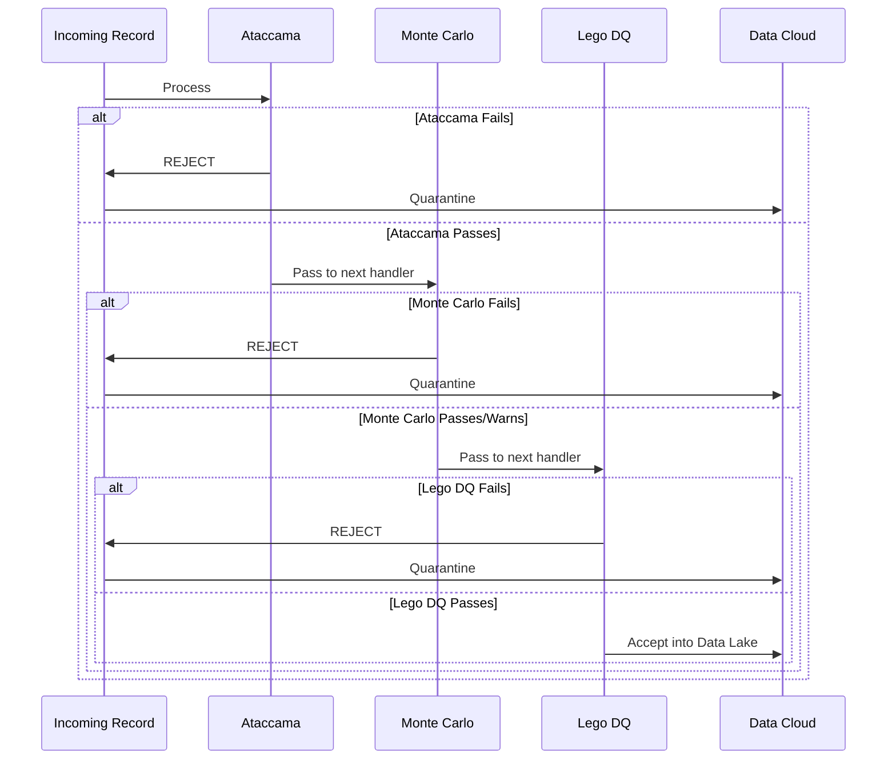

### Example: Record Rejected by Handler 2

**Incoming Record (Bad Data):**
```json
{
  "transactionId": "TXN-99999",
  "customerId": "CUST-99999",
  "amount": 9999999.00,
  "date": "2025-10-23",
  "productCode": "INVALID",
  "source": "Snowflake"
}
```

**Handler 1 (Ataccama): Pass**
```json
{
  "_ataccamaQuality": {
    "status": "Pass",
    "checks": 4
  }
}
```

**Handler 2 (Monte Carlo): REJECT**
```json
{
  "_monteCarloQuality": {
    "status": "Fail",
    "issues": [
      {
        "handler": "Monte Carlo",
        "check": "Statistical Anomaly",
        "field": "amount",
        "message": "Amount $9999999.0 is 3333x the historical average - likely data error",
        "severity": "Critical",
        "status": "Fail"
      }
    ]
  }
}
```

**Result: Record quarantined, never reaches Handler 3**

```json
{
  "transactionId": "TXN-99999",
  "status": "Quarantined",
  "reason": "Failed Monte Carlo anomaly detection",
  "failedAt": "Handler 2 of 3",
  "quarantineLocation": "DataCloud.DataQuality_Quarantine__c",
  "requiresManualReview": true
}
```

---

## 14. COMMAND PATTERN

**📖 Definition:** The Command Pattern encapsulates a request as an object, allowing you to parameterize clients with different requests, queue operations, log requests, and support undo operations.

**🎯 Problem It Solves:** When you want to decouple the object that invokes an operation from the object that performs it, or when you need to support undo, queuing, or logging of operations.

**💡 Simple Analogy:** Like ordering food at a restaurant - you write your order on a slip of paper (command object), give it to the waiter (invoker), who takes it to the kitchen (receiver). The order slip contains all the information needed, can be queued with other orders, and could theoretically be undone if needed.

**🔧 Key Components:**
- **Command**: Interface declaring execution method
- **Concrete Command**: Implements command and defines binding between receiver and action
- **Receiver**: Object that performs the actual work
- **Invoker**: Asks the command to carry out the request
- **Client**: Creates concrete command objects and sets their receivers

**✅ When to Use:**
- You want to decouple invoker from receiver
- You need to support undo/redo operations
- You want to log, queue, or schedule requests
- You need to support macro commands (combining multiple commands)
- You want to structure systems around high-level operations

**🚀 Benefits:**
- Decouples invoker from receiver
- Commands are first-class objects that can be manipulated
- Easy to add new commands without changing existing code
- Supports undo/redo and macro operations
- Enables logging and queuing of requests

### Real Implementation in Architecture
**Location:** Data Actions (Executable Commands triggered by conditions)

### Diagram

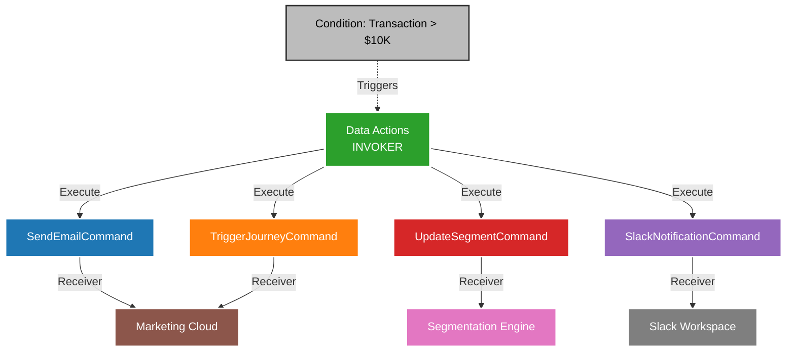

### Real Data Example

**Trigger Event: High-Value Transaction**

```json
{
  "eventType": "Transaction.Created",
  "transactionId": "TXN-98765",
  "amount": 50000.00,
  "customerId": "CUST-12345",
  "individualId": "IND-UNIFIED-001",
  "timestamp": "2025-10-23T14:30:00Z"
}
```

**Condition Check:**
```
IF Transaction.Amount > 10000 THEN
    Execute Data Actions
END IF

Result: TRUE (50000 > 10000)
```

### Command 1: SendEmailCommand

**Command Definition:**
```json
{
  "commandId": "CMD-EMAIL-001",
  "commandType": "SendEmail",
  "name": "High Value Transaction Alert",
  "condition": "Transaction.Amount > 10000",
  "receiver": "Marketing Cloud",
  "parameters": {
    "emailTemplateId": "VIP-PURCHASE-ALERT",
    "recipientType": "AccountOwner",
    "priority": "High"
  }
}
```

**Command Execution:**
```python
class SendEmailCommand:
    def __init__(self, transaction, email_params):
        self.transaction = transaction
        self.email_params = email_params
        self.receiver = MarketingCloudAPI()
    
    def execute(self):
        """Execute the email command"""
        # Get recipient details
        individual = get_unified_profile(self.transaction["individualId"])
        account_owner = get_account_owner(individual["accountId"])
        
        # Prepare email payload
        email_payload = {
            "templateId": self.email_params["emailTemplateId"],
            "to": account_owner["email"],
            "subject": "🎉 High-Value Transaction Alert",
            "variables": {
                "customerName": individual["name"],
                "transactionAmount": f"${self.transaction['amount']:,.2f}",
                "transactionDate": self.transaction["timestamp"],
                "accountName": individual["accountName"],
                "nextSteps": "Review upsell opportunities"
            },
            "priority": self.email_params["priority"]
        }
        
        # Send via Marketing Cloud
        result = self.receiver.send_email(email_payload)
        
        # Log execution
        log_entry = {
            "commandId": "CMD-EMAIL-001",
            "commandType": "SendEmail",
            "executedAt": datetime.now(),
            "transactionId": self.transaction["transactionId"],
            "recipient": account_owner["email"],
            "status": "Sent" if result.success else "Failed",
            "messageId": result.message_id
        }
        
        return log_entry
    
    def undo(self):
        """Undo not applicable for emails"""
        pass
```

**Command Result:**
```json
{
  "commandId": "CMD-EMAIL-001",
  "commandType": "SendEmail",
  "status": "Executed",
  "executedAt": "2025-10-23T14:30:05Z",
  "result": {
    "emailSent": true,
    "messageId": "MSG-ABCD1234",
    "recipient": "john.doe@company.com",
    "subject": "🎉 High-Value Transaction Alert",
    "templateUsed": "VIP-PURCHASE-ALERT"
  }
}
```

**Actual Email Content:**
```
To: john.doe@company.com
From: alerts@acme.com
Subject: 🎉 High-Value Transaction Alert

Hi John,

Great news! Your customer Jane Austin from Acme Corporation just completed a high-value transaction.

Transaction Details:
- Amount: $50,000.00
- Date: October 23, 2025 at 2:30 PM
- Customer: Jane Austin (CTO)
- Account: Acme Corporation

Recommended Actions:
✓ Review upsell opportunities
✓ Schedule executive check-in
✓ Ensure customer success engagement

View full details in Salesforce CRM.

Best regards,
Customer Success Team
```

### Command 2: TriggerJourneyCommand

**Command Definition:**
```json
{
  "commandId": "CMD-JOURNEY-002",
  "commandType": "TriggerJourney",
  "name": "Enroll in VIP Customer Journey",
  "condition": "Transaction.Amount > 10000",
  "receiver": "Marketing Cloud",
  "parameters": {
    "journeyId": "VIP-ONBOARDING-001",
    "action": "Enroll",
    "entrySource": "Data Cloud - High Value Purchase"
  }
}
```

**Command Execution:**
```python
class TriggerJourneyCommand:
    def __init__(self, transaction, journey_params):
        self.transaction = transaction
        self.journey_params = journey_params
        self.receiver = MarketingCloudAPI()
    
    def execute(self):
        """Enroll customer in journey"""
        # Get customer details
        individual = get_unified_profile(self.transaction["individualId"])
        
        # Prepare journey enrollment
        journey_payload = {
            "journeyId": self.journey_params["journeyId"],
            "action": self.journey_params["action"],
            "contactKey": individual["email"],
            "entrySource": self.journey_params["entrySource"],
            "attributes": {
                "firstName": individual["firstName"],
                "lastName": individual["lastName"],
                "email": individual["email"],
                "transactionAmount": self.transaction["amount"],
                "transactionDate": self.transaction["timestamp"],
                "accountName": individual["accountName"],
                "lifetimeValue": individual["lifetimeValue"]
            }
        }
        
        # Enroll in journey
        result = self.receiver.enroll_in_journey(journey_payload)
        
        # Log execution
        log_entry = {
            "commandId": "CMD-JOURNEY-002",
            "commandType": "TriggerJourney",
            "executedAt": datetime.now(),
            "transactionId": self.transaction["transactionId"],
            "journeyId": self.journey_params["journeyId"],
            "contactKey": individual["email"],
            "status": "Enrolled" if result.success else "Failed"
        }
        
        return log_entry
    
    def undo(self):
        """Remove from journey"""
        individual = get_unified_profile(self.transaction["individualId"])
        self.receiver.exit_journey(
            journeyId=self.journey_params["journeyId"],
            contactKey=individual["email"]
        )
```

**Command Result:**
```json
{
  "commandId": "CMD-JOURNEY-002",
  "commandType": "TriggerJourney",
  "status": "Executed",
  "executedAt": "2025-10-23T14:30:06Z",
  "result": {
    "journeyEnrolled": true,
    "journeyId": "VIP-ONBOARDING-001",
    "journeyName": "VIP Customer Onboarding",
    "contactKey": "jane.austin@acme.com",
    "entrySource": "Data Cloud - High Value Purchase",
    "estimatedFirstEmail": "2025-10-23T15:00:00Z"
  }
}
```

### Command 3: SlackNotificationCommand

**Command Definition:**
```json
{
  "commandId": "CMD-SLACK-003",
  "commandType": "SlackNotification",
  "name": "Notify Sales Team in Slack",
  "condition": "Transaction.Amount > 10000",
  "receiver": "Slack Workspace",
  "parameters": {
    "channel": "#high-value-sales",
    "messageTemplate": "high-value-transaction-alert",
    "mentionAccountOwner": true
  }
}
```

**Command Execution:**
```python
class SlackNotificationCommand:
    def __init__(self, transaction, slack_params):
        self.transaction = transaction
        self.slack_params = slack_params
        self.receiver = SlackAPI()
    
    def execute(self):
        """Send Slack notification"""
        # Get details
        individual = get_unified_profile(self.transaction["individualId"])
        account_owner = get_account_owner(individual["accountId"])
        
        # Build Slack message
        message = {
            "channel": self.slack_params["channel"],
            "blocks": [
                {
                    "type": "header",
                    "text": {
                        "type": "plain_text",
                        "text": "🎉 High-Value Transaction Alert!"
                    }
                },
                {
                    "type": "section",
                    "fields": [
                        {
                            "type": "mrkdwn",
                            "text": f"*Customer:*\n{individual['name']}"
                        },
                        {
                            "type": "mrkdwn",
                            "text": f"*Account:*\n{individual['accountName']}"
                        },
                        {
                            "type": "mrkdwn",
                            "text": f"*Amount:*\n${self.transaction['amount']:,.2f}"
                        },
                        {
                            "type": "mrkdwn",
                            "text": f"*Account Owner:*\n<@{account_owner['slackUserId']}>"
                        }
                    ]
                },
                {
                    "type": "section",
                    "text": {
                        "type": "mrkdwn",
                        "text": "*Recommended Actions:*\n✓ Review upsell opportunities\n✓ Schedule executive check-in"
                    }
                },
                {
                    "type": "actions",
                    "elements": [
                        {
                            "type": "button",
                            "text": {"type": "plain_text", "text": "View in Salesforce"},
                            "url": f"https://acme.salesforce.com/Account/{individual['accountId']}"
                        }
                    ]
                }
            ]
        }
        
        # Send to Slack
        result = self.receiver.post_message(message)
        
        return {
            "commandId": "CMD-SLACK-003",
            "commandType": "SlackNotification",
            "executedAt": datetime.now(),
            "status": "Sent" if result.success else "Failed",
            "channel": self.slack_params["channel"],
            "messageTimestamp": result.ts
        }
```

**Command Result:**
```json
{
  "commandId": "CMD-SLACK-003",
  "commandType": "SlackNotification",
  "status": "Executed",
  "executedAt": "2025-10-23T14:30:07Z",
  "result": {
    "messageSent": true,
    "channel": "#high-value-sales",
    "messageTimestamp": "1729694407.123456",
    "permalink": "https://acme.slack.com/archives/C123/p1729694407123456"
  }
}
```

### Command 4: UpdateSegmentCommand

**Command Definition:**
```json
{
  "commandId": "CMD-SEGMENT-004",
  "commandType": "UpdateSegment",
  "name": "Add to High-Value Customer Segment",
  "condition": "Transaction.Amount > 10000 AND LifetimeValue > 100000",
  "receiver": "Segmentation Engine",
  "parameters": {
    "segmentId": "SEG-HIGH-VALUE-001",
    "action": "Add"
  }
}
```

**Command Execution:**
```python
class UpdateSegmentCommand:
    def __init__(self, transaction, segment_params):
        self.transaction = transaction
        self.segment_params = segment_params
        self.receiver = SegmentationEngine()
    
    def execute(self):
        """Add individual to segment"""
        individual = get_unified_profile(self.transaction["individualId"])
        
        # Check condition
        if individual["lifetimeValue"] > 100000:
            result = self.receiver.add_to_segment(
                segmentId=self.segment_params["segmentId"],
                individualId=self.transaction["individualId"]
            )
            
            return {
                "commandId": "CMD-SEGMENT-004",
                "commandType": "UpdateSegment",
                "executedAt": datetime.now(),
                "status": "Added",
                "segmentId": self.segment_params["segmentId"],
                "individualId": self.transaction["individualId"],
                "lifetimeValue": individual["lifetimeValue"]
            }
        else:
            return {
                "commandId": "CMD-SEGMENT-004",
                "status": "Skipped",
                "reason": "Lifetime Value not met threshold"
            }
```

**Command Result:**
```json
{
  "commandId": "CMD-SEGMENT-004",
  "commandType": "UpdateSegment",
  "status": "Executed",
  "executedAt": "2025-10-23T14:30:08Z",
  "result": {
    "segmentUpdated": true,
    "segmentId": "SEG-HIGH-VALUE-001",
    "segmentName": "High-Value Customers",
    "individualId": "IND-UNIFIED-001",
    "action": "Add",
    "lifetimeValue": 135000.00,
    "memberCount": 247
  }
}
```

### Data Actions Invoker (Orchestrator)

```python
class DataActionsInvoker:
    def __init__(self):
        self.commands = []
        self.execution_log = []
    
    def register_command(self, command):
        """Register a command to be executed"""
        self.commands.append(command)
    
    def execute_all(self, transaction):
        """Execute all registered commands"""
        results = []
        
        for command in self.commands:
            try:
                result = command.execute()
                self.execution_log.append(result)
                results.append(result)
            except Exception as e:
                error_log = {
                    "commandId": command.commandId,
                    "status": "Failed",
                    "error": str(e),
                    "timestamp": datetime.now()
                }
                self.execution_log.append(error_log)
                results.append(error_log)
        
        return results
    
    def undo_last(self):
        """Undo last command (if supported)"""
        if self.commands:
            last_command = self.commands[-1]
            last_command.undo()

# Usage
invoker = DataActionsInvoker()
invoker.register_command(SendEmailCommand(transaction, email_params))
invoker.register_command(TriggerJourneyCommand(transaction, journey_params))
invoker.register_command(SlackNotificationCommand(transaction, slack_params))
invoker.register_command(UpdateSegmentCommand(transaction, segment_params))

results = invoker.execute_all(transaction)
```

### Complete Execution Log

```json
{
  "dataActionExecution": {
    "triggerId": "TXN-98765-ACTIONS",
    "triggerEvent": "Transaction.Created",
    "triggerCondition": "Transaction.Amount > 10000",
    "transactionId": "TXN-98765",
    "amount": 50000.00,
    "executionStarted": "2025-10-23T14:30:05Z",
    "executionCompleted": "2025-10-23T14:30:08Z",
    "totalCommands": 4,
    "successfulCommands": 4,
    "failedCommands": 0,
    "results": [
      {
        "commandId": "CMD-EMAIL-001",
        "commandType": "SendEmail",
        "status": "Success",
        "executedAt": "2025-10-23T14:30:05Z",
        "recipient": "john.doe@company.com"
      },
      {
        "commandId": "CMD-JOURNEY-002",
        "commandType": "TriggerJourney",
        "status": "Success",
        "executedAt": "2025-10-23T14:30:06Z",
        "journeyId": "VIP-ONBOARDING-001"
      },
      {
        "commandId": "CMD-SLACK-003",
        "commandType": "SlackNotification",
        "status": "Success",
        "executedAt": "2025-10-23T14:30:07Z",
        "channel": "#high-value-sales"
      },
      {
        "commandId": "CMD-SEGMENT-004",
        "commandType": "UpdateSegment",
        "status": "Success",
        "executedAt": "2025-10-23T14:30:08Z",
        "segmentId": "SEG-HIGH-VALUE-001"
      }
    ]
  }
}
```

---

## 15. REPOSITORY PATTERN

**📖 Definition:** The Repository Pattern encapsulates the logic needed to access data sources. It centralizes common data access functionality, providing better maintainability and decoupling from the infrastructure or technology used to access databases.

**🎯 Problem It Solves:** When you want to keep domain logic separate from data access logic, make your code testable with different data sources, or switch between different storage technologies without changing business logic.

**💡 Simple Analogy:** Like a library - you don't need to know how books are organized in the back rooms, what filing system is used, or where exactly each book is stored. You just ask the librarian (repository) for a book by title, and they handle all the complexity of finding and retrieving it for you.

**🔧 Key Components:**
- **Repository Interface**: Defines the contract for data access operations
- **Concrete Repository**: Implements the interface for specific data sources
- **Domain Objects**: The business entities being stored and retrieved
- **Data Source**: The actual storage mechanism (database, file, web service)

**✅ When to Use:**
- You want to centralize data access logic
- You need to support multiple data sources
- You want to make your code more testable
- You want to separate domain logic from persistence logic
- You need to switch storage technologies easily

**🚀 Benefits:**
- Centralizes data access logic
- Makes code more testable with mock repositories
- Provides flexibility to change data sources
- Separates concerns between business logic and data access
- Enables consistent data access patterns across the application

### Real Implementation in Architecture
**Location:** Data Lake Objects (Abstraction over storage)

### Diagram

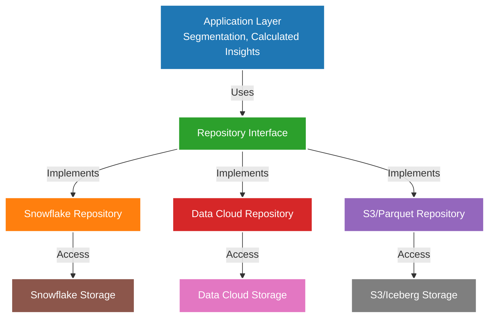

### Real Data Example

**Repository Interface Definition:**

```python
from abc import ABC, abstractmethod

class TransactionRepository(ABC):
    """Abstract repository for transactions"""
    
    @abstractmethod
    def get_by_id(self, transaction_id):
        """Get transaction by ID"""
        pass
    
    @abstractmethod
    def get_by_customer(self, customer_id, limit=100):
        """Get transactions for a customer"""
        pass
    
    @abstractmethod
    def get_high_value(self, min_amount, start_date, end_date):
        """Get high-value transactions in date range"""
        pass
    
    @abstractmethod
    def calculate_lifetime_value(self, customer_id):
        """Calculate customer lifetime value"""
        pass
    
    @abstractmethod
    def insert(self, transaction):
        """Insert new transaction"""
        pass
    
    @abstractmethod
    def update(self, transaction_id, updates):
        """Update transaction"""
        pass
```

### Implementation 1: Snowflake Repository

```python
class SnowflakeTransactionRepository(TransactionRepository):
    def __init__(self, connection):
        self.conn = connection
    
    def get_by_id(self, transaction_id):
        """Get transaction from Snowflake"""
        query = """
        SELECT 
            txn_id as transactionId,
            cust_id as customerId,
            amount,
            txn_date as transactionDate,
            product_code as productCode
        FROM snowflake.prod.transactions
        WHERE txn_id = %s
        """
        result = self.conn.execute(query, (transaction_id,))
        return result.fetchone()
    
    def get_by_customer(self, customer_id, limit=100):
        """Get transactions for customer from Snowflake"""
        query = """
        SELECT 
            txn_id as transactionId,
            cust_id as customerId,
            amount,
            txn_date as transactionDate,
            product_code as productCode
        FROM snowflake.prod.transactions
        WHERE cust_id = %s
        ORDER BY txn_date DESC
        LIMIT %s
        """
        result = self.conn.execute(query, (customer_id, limit))
        return result.fetchall()
    
    def get_high_value(self, min_amount, start_date, end_date):
        """Get high-value transactions from Snowflake"""
        query = """
        SELECT 
            txn_id as transactionId,
            cust_id as customerId,
            amount,
            txn_date as transactionDate,
            product_code as productCode
        FROM snowflake.prod.transactions
        WHERE amount >= %s
          AND txn_date BETWEEN %s AND %s
        ORDER BY amount DESC
        """
        result = self.conn.execute(query, (min_amount, start_date, end_date))
        return result.fetchall()
    
    def calculate_lifetime_value(self, customer_id):
        """Calculate LTV from Snowflake"""
        query = """
        SELECT 
            cust_id as customerId,
            SUM(amount) as lifetimeValue,
            COUNT(*) as transactionCount,
            AVG(amount) as averageOrderValue
        FROM snowflake.prod.transactions
        WHERE cust_id = %s
        GROUP BY cust_id
        """
        result = self.conn.execute(query, (customer_id,))
        return result.fetchone()
    
    def insert(self, transaction):
        """Insert transaction to Snowflake"""
        query = """
        INSERT INTO snowflake.prod.transactions
        (txn_id, cust_id, amount, txn_date, product_code)
        VALUES (%s, %s, %s, %s, %s)
        """
        self.conn.execute(query, (
            transaction["transactionId"],
            transaction["customerId"],
            transaction["amount"],
            transaction["transactionDate"],
            transaction["productCode"]
        ))
        self.conn.commit()
        return transaction
```

### Implementation 2: Data Cloud Repository

```python
class DataCloudTransactionRepository(TransactionRepository):
    def __init__(self, api_client):
        self.client = api_client
    
    def get_by_id(self, transaction_id):
        """Get transaction from Data Cloud"""
        query = f"""
        SELECT 
            TransactionId,
            IndividualId,
            Amount,
            TransactionDate,
            ProductCode
        FROM Transaction__dmo
        WHERE TransactionId = '{transaction_id}'
        """
        result = self.client.query(query)
        return result[0] if result else None
    
    def get_by_customer(self, customer_id, limit=100):
        """Get transactions for customer from Data Cloud"""
        # First, resolve customer ID to unified individual ID
        individual_id = self.resolve_to_individual(customer_id)
        
        query = f"""
        SELECT 
            TransactionId,
            IndividualId,
            Amount,
            TransactionDate,
            ProductCode
        FROM Transaction__dmo
        WHERE IndividualId = '{individual_id}'
        ORDER BY TransactionDate DESC
        LIMIT {limit}
        """
        result = self.client.query(query)
        return result
    
    def get_high_value(self, min_amount, start_date, end_date):
        """Get high-value transactions from Data Cloud"""
        query = f"""
        SELECT 
            TransactionId,
            IndividualId,
            Amount,
            TransactionDate,
            ProductCode
        FROM Transaction__dmo
        WHERE Amount >= {min_amount}
          AND TransactionDate BETWEEN '{start_date}' AND '{end_date}'
        ORDER BY Amount DESC
        """
        result = self.client.query(query)
        return result
    
    def calculate_lifetime_value(self, customer_id):
        """Calculate LTV from Data Cloud (using Calculated Insight)"""
        individual_id = self.resolve_to_individual(customer_id)
        
        # Option 1: Query pre-calculated metric
        calculated_insight = self.client.get_calculated_insight(
            metric="LifetimeValue",
            individualId=individual_id
        )
        
        return {
            "customerId": customer_id,
            "lifetimeValue": calculated_insight["value"],
            "transactionCount": calculated_insight["metadata"]["transactionCount"],
            "averageOrderValue": calculated_insight["metadata"]["avgOrderValue"]
        }
    
    def insert(self, transaction):
        """Insert transaction to Data Cloud"""
        # Use Ingestion API
        result = self.client.ingest(
            object="Transaction__dmo",
            data=[transaction]
        )
        return result[0]
    
    def resolve_to_individual(self, customer_id):
        """Resolve customer ID to unified individual ID"""
        profile = self.client.query(f"""
        SELECT UnifiedIndividualId
        FROM UnifiedProfile
        WHERE SourceRecords CONTAINS '{customer_id}'
        """)
        return profile[0]["UnifiedIndividualId"] if profile else None
```

### Implementation 3: S3/Parquet Repository

```python
class S3ParquetTransactionRepository(TransactionRepository):
    def __init__(self, s3_client, bucket):
        self.s3 = s3_client
        self.bucket = bucket
    
    def get_by_id(self, transaction_id):
        """Get transaction from S3/Parquet"""
        # Use AWS Athena or Trino to query Parquet
        query = f"""
        SELECT 
            transaction_id as transactionId,
            customer_id as customerId,
            amount,
            transaction_date as transactionDate,
            product_code as productCode
        FROM s3_transactions
        WHERE transaction_id = '{transaction_id}'
        """
        result = self.execute_athena_query(query)
        return result[0] if result else None
    
    def get_by_customer(self, customer_id, limit=100):
        """Get transactions for customer from S3"""
        query = f"""
        SELECT 
            transaction_id as transactionId,
            customer_id as customerId,
            amount,
            transaction_date as transactionDate,
            product_code as productCode
        FROM s3_transactions
        WHERE customer_id = '{customer_id}'
        ORDER BY transaction_date DESC
        LIMIT {limit}
        """
        result = self.execute_athena_query(query)
        return result
    
    def get_high_value(self, min_amount, start_date, end_date):
        """Get high-value transactions from S3"""
        # Leverage partition pruning on date
        query = f"""
        SELECT 
            transaction_id as transactionId,
            customer_id as customerId,
            amount,
            transaction_date as transactionDate,
            product_code as productCode
        FROM s3_transactions
        WHERE amount >= {min_amount}
          AND transaction_date BETWEEN '{start_date}' AND '{end_date}'
        ORDER BY amount DESC
        """
        result = self.execute_athena_query(query)
        return result
    
    def calculate_lifetime_value(self, customer_id):
        """Calculate LTV from S3"""
        query = f"""
        SELECT 
            customer_id as customerId,
            SUM(amount) as lifetimeValue,
            COUNT(*) as transactionCount,
            AVG(amount) as averageOrderValue
        FROM s3_transactions
        WHERE customer_id = '{customer_id}'
        GROUP BY customer_id
        """
        result = self.execute_athena_query(query)
        return result[0] if result else None
    
    def insert(self, transaction):
        """Insert transaction to S3 (append to Parquet)"""
        # Write to Parquet file
        key = f"transactions/{transaction['transactionDate'][:7]}/{transaction['transactionId']}.parquet"
        
        df = pd.DataFrame([transaction])
        parquet_buffer = BytesIO()
        df.to_parquet(parquet_buffer)
        
        self.s3.put_object(
            Bucket=self.bucket,
            Key=key,
            Body=parquet_buffer.getvalue()
        )
        
        return transaction
    
    def execute_athena_query(self, query):
        """Execute query via Athena"""
        # Implementation details...
        pass
```

### Application Code (Repository Pattern Usage)

**Key Benefit: Application doesn't know which storage is used**

```python
# Application code for Calculated Insights
class LifetimeValueCalculator:
    def __init__(self, transaction_repo: TransactionRepository):
        # Depends on interface, not implementation
        self.repo = transaction_repo
    
    def calculate_for_customer(self, customer_id):
        """Calculate LTV - works with any repository"""
        result = self.repo.calculate_lifetime_value(customer_id)
        
        return {
            "customerId": customer_id,
            "lifetimeValue": result["lifetimeValue"],
            "transactionCount": result["transactionCount"],
            "averageOrderValue": result["averageOrderValue"],
            "calculatedAt": datetime.now()
        }

# Usage with Snowflake
snowflake_repo = SnowflakeTransactionRepository(snowflake_conn)
calculator = LifetimeValueCalculator(snowflake_repo)
ltv = calculator.calculate_for_customer("CUST-12345")

# Usage with Data Cloud (same calculator code!)
datacloud_repo = DataCloudTransactionRepository(datacloud_client)
calculator = LifetimeValueCalculator(datacloud_repo)
ltv = calculator.calculate_for_customer("CUST-12345")

# Result is the same regardless of backend:
{
  "customerId": "CUST-12345",
  "lifetimeValue": 135000.00,
  "transactionCount": 45,
  "averageOrderValue": 3000.00,
  "calculatedAt": "2025-10-23T14:30:00Z"
}
```

### Repository Pattern Benefits

**1. Abstraction:**
```
Application doesn't know:
- Where data is stored (Snowflake vs Data Cloud vs S3)
- What query language to use
- How to connect to storage
```

**2. Testability:**
```python
# Easy to create mock repository for testing
class MockTransactionRepository(TransactionRepository):
    def __init__(self):
        self.data = [
            {"transactionId": "TXN-1", "amount": 100},
            {"transactionId": "TXN-2", "amount": 200}
        ]
    
    def get_by_id(self, transaction_id):
        return next((t for t in self.data if t["transactionId"] == transaction_id), None)
    
    # ... implement other methods with mock data

# Test with mock
mock_repo = MockTransactionRepository()
calculator = LifetimeValueCalculator(mock_repo)
# Tests run fast without database!
```

**3. Migration Support:**
```
FY2024: Use SnowflakeTransactionRepository
FY2027: Switch to DataCloudTransactionRepository
FY2031: Fully on DataCloudTransactionRepository

Application code: NO CHANGES NEEDED
Only swap repository implementation
```

---

## 16. MEMENTO PATTERN

**📖 Definition:** The Memento Pattern captures and stores an object's internal state so that it can be restored to that state later, without violating encapsulation principles.

**🎯 Problem It Solves:** When you need to save and restore an object's state (like undo/redo functionality), provide snapshots of object state, or maintain history without exposing the object's internal implementation details.

**💡 Simple Analogy:** Like taking a photo - the photo captures exactly how everything looked at that moment in time. Later, you can look at the photo to remember or recreate that exact scene, but the photo doesn't change the original scene or expose how it was constructed.

**🔧 Key Components:**
- **Originator**: Object whose state needs to be saved and restored
- **Memento**: Stores the internal state of the originator
- **Caretaker**: Manages mementos but never operates on or examines their contents
- **State**: The data that needs to be preserved and restored

**✅ When to Use:**
- You need to save and restore object state (undo/redo)
- You want to provide snapshots of object state
- Direct access to object's state would violate encapsulation
- You need to maintain state history for auditing or rollback purposes

**🚀 Benefits:**
- Preserves encapsulation boundaries
- Simplifies the originator by delegating state management
- Enables undo/redo functionality
- Provides state history and audit trails
- Supports rollback to previous states

### Real Implementation in Architecture
**Location:** Data Lineage (Manta, Spline) & Data Archival

### Diagram

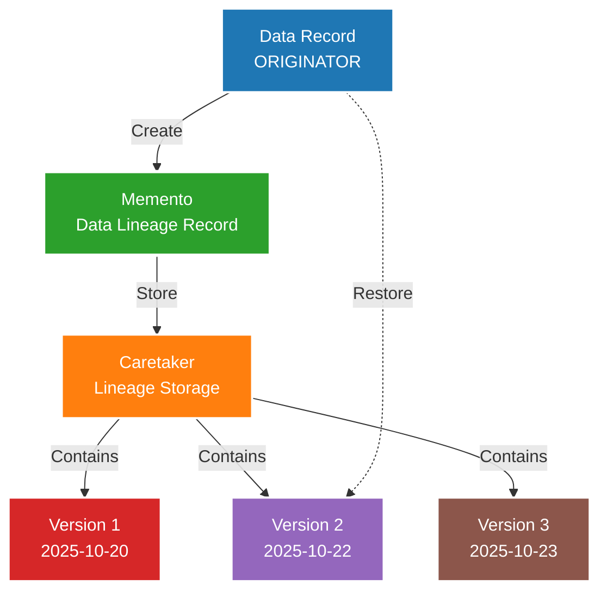

### Real Data Example

**Scenario: Customer Record Evolution**

**Version 1 (Original State - Oct 20, 2025):**
```json
{
  "individualId": "IND-UNIFIED-001",
  "firstName": "Jane",
  "lastName": "Austin",
  "email": "jane.austin@acme.com",
  "phone": "+15550123",
  "lifetimeValue": 85000.00,
  "engagementScore": 75,
  "churnProbability": 0.25,
  "lastModified": "2025-10-20T10:00:00Z",
  "version": 1
}
```

**Memento 1 Created (Lineage Tracking):**
```json
{
  "mementoId": "MEM-001",
  "recordType": "UnifiedIndividual",
  "recordId": "IND-UNIFIED-001",
  "version": 1,
  "timestamp": "2025-10-20T10:00:00Z",
  "snapshot": {
    "individualId": "IND-UNIFIED-001",
    "firstName": "Jane",
    "lastName": "Austin",
    "email": "jane.austin@acme.com",
    "phone": "+15550123",
    "lifetimeValue": 85000.00,
    "engagementScore": 75,
    "churnProbability": 0.25
  },
  "lineage": {
    "sources": [
      {"system": "Sales Org", "id": "003XX001", "lastSync": "2025-10-20T09:00:00Z"},
      {"system": "Service Org", "id": "003YY002", "lastSync": "2025-10-20T09:30:00Z"}
    ],
    "transformations": [
      "Identity Resolution",
      "CRM Enrichment",
      "Calculated Insights"
    ]
  },
  "storedIn": "Manta Lineage System"
}
```

**Version 2 (After Transaction - Oct 22, 2025):**
```json
{
  "individualId": "IND-UNIFIED-001",
  "firstName": "Jane",
  "lastName": "Austin",
  "email": "jane.austin@acme.com",
  "phone": "+15550123",
  "lifetimeValue": 135000.00,
  "engagementScore": 42,
  "churnProbability": 0.78,
  "lastModified": "2025-10-22T14:30:00Z",
  "version": 2,
  "changeReason": "High-value transaction TXN-98765 increased LTV"
}
```

**Memento 2 Created:**
```json
{
  "mementoId": "MEM-002",
  "recordType": "UnifiedIndividual",
  "recordId": "IND-UNIFIED-001",
  "version": 2,
  "timestamp": "2025-10-22T14:30:00Z",
  "snapshot": {
    "individualId": "IND-UNIFIED-001",
    "firstName": "Jane",
    "lastName": "Austin",
    "email": "jane.austin@acme.com",
    "phone": "+15550123",
    "lifetimeValue": 135000.00,
    "engagementScore": 42,
    "churnProbability": 0.78
  },
  "changes": [
    {
      "field": "lifetimeValue",
      "oldValue": 85000.00,
      "newValue": 135000.00,
      "changeType": "Update",
      "reason": "Transaction TXN-98765 added"
    },
    {
      "field": "engagementScore",
      "oldValue": 75,
      "newValue": 42,
      "changeType": "Update",
      "reason": "Recalculated based on activity decline"
    },
    {
      "field": "churnProbability",
      "oldValue": 0.25,
      "newValue": 0.78,
      "changeType": "Update",
      "reason": "ML model prediction updated"
    }
  ],
  "lineage": {
    "sources": [
      {"system": "Sales Org", "id": "003XX001", "lastSync": "2025-10-22T09:00:00Z"},
      {"system": "Service Org", "id": "003YY002", "lastSync": "2025-10-22T09:30:00Z"},
      {"system": "Snowflake", "id": "TXN-98765", "lastSync": "2025-10-22T14:30:00Z"}
    ],
    "transformations": [
      "Identity Resolution",
      "CRM Enrichment",
      "Transaction Aggregation",
      "ML Prediction Update",
      "Calculated Insights"
    ]
  },
  "storedIn": "Spline Lineage System"
}
```

**Version 3 (After Email Update - Oct 23, 2025):**
```json
{
  "individualId": "IND-UNIFIED-001",
  "firstName": "Jane",
  "lastName": "Austin",
  "email": "jane.austin@newcompany.com",
  "phone": "+15550123",
  "lifetimeValue": 135000.00,
  "engagementScore": 42,
  "churnProbability": 0.78,
  "lastModified": "2025-10-23T11:00:00Z",
  "version": 3,
  "changeReason": "Email updated in Marketing Cloud"
}
```

**Memento 3 Created:**
```json
{
  "mementoId": "MEM-003",
  "recordType": "UnifiedIndividual",
  "recordId": "IND-UNIFIED-001",
  "version": 3,
  "timestamp": "2025-10-23T11:00:00Z",
  "snapshot": {
    "individualId": "IND-UNIFIED-001",
    "firstName": "Jane",
    "lastName": "Austin",
    "email": "jane.austin@newcompany.com",
    "phone": "+15550123",
    "lifetimeValue": 135000.00,
    "engagementScore": 42,
    "churnProbability": 0.78
  },
  "changes": [
    {
      "field": "email",
      "oldValue": "jane.austin@acme.com",
      "newValue": "jane.austin@newcompany.com",
      "changeType": "Update",
      "reason": "Email updated in Marketing Cloud",
      "updatedBy": "Marketing Cloud Sync"
    }
  ],
  "lineage": {
    "sources": [
      {"system": "Sales Org", "id": "003XX001", "lastSync": "2025-10-23T09:00:00Z"},
      {"system": "Service Org", "id": "003YY002", "lastSync": "2025-10-23T09:30:00Z"},
      {"system": "Marketing Cloud", "id": "SUB-789", "lastSync": "2025-10-23T11:00:00Z", "emailUpdated": true}
    ],
    "transformations": [
      "Identity Resolution (re-run)",
      "CRM Enrichment"
    ]
  },
  "storedIn": "Spline Lineage System"
}
```

### Restoration Example

**Scenario: Need to restore to Version 2 (before email change)**

```python
class UnifiedProfileCaretaker:
    def __init__(self):
        self.mementos = {}
    
    def save(self, memento):
        """Save memento (lineage record)"""
        if memento.recordId not in self.mementos:
            self.mementos[memento.recordId] = []
        self.mementos[memento.recordId].append(memento)
    
    def get_version(self, record_id, version):
        """Get specific version"""
        mementos = self.mementos.get(record_id, [])
        for memento in mementos:
            if memento.version == version:
                return memento
        return None
    
    def get_latest(self, record_id):
        """Get latest version"""
        mementos = self.mementos.get(record_id, [])
        return mementos[-1] if mementos else None
    
    def get_history(self, record_id):
        """Get all versions"""
        return self.mementos.get(record_id, [])

# Restore to Version 2
caretaker = UnifiedProfileCaretaker()
memento_v2 = caretaker.get_version("IND-UNIFIED-001", version=2)

restored_state = memento_v2.snapshot
print(restored_state)
```

**Restored State:**
```json
{
  "individualId": "IND-UNIFIED-001",
  "firstName": "Jane",
  "lastName": "Austin",
  "email": "jane.austin@acme.com",
  "phone": "+15550123",
  "lifetimeValue": 135000.00,
  "engagementScore": 42,
  "churnProbability": 0.78,
  "restoredFrom": "Version 2",
  "originalTimestamp": "2025-10-22T14:30:00Z",
  "restoredAt": "2025-10-23T15:00:00Z"
}
```

### Data Lineage Visualization

**Manta/Spline Lineage Tracking:**

```json
{
  "lineageId": "LIN-IND-001",
  "entityId": "IND-UNIFIED-001",
  "entityType": "UnifiedIndividual",
  "versionHistory": [
    {
      "version": 1,
      "timestamp": "2025-10-20T10:00:00Z",
      "mementoId": "MEM-001",
      "fields": {
        "lifetimeValue": 85000.00,
        "engagementScore": 75,
        "churnProbability": 0.25
      }
    },
    {
      "version": 2,
      "timestamp": "2025-10-22T14:30:00Z",
      "mementoId": "MEM-002",
      "fields": {
        "lifetimeValue": 135000.00,
        "engagementScore": 42,
        "churnProbability": 0.78
      },
      "triggerEvent": "Transaction TXN-98765"
    },
    {
      "version": 3,
      "timestamp": "2025-10-23T11:00:00Z",
      "mementoId": "MEM-003",
      "fields": {
        "email": "jane.austin@newcompany.com"
      },
      "triggerEvent": "Marketing Cloud email update"
    }
  ],
  "upstreamDependencies": [
    {
      "system": "Sales Org",
      "object": "Contact",
      "id": "003XX001",
      "fields": ["FirstName", "LastName", "Email", "Phone"]
    },
    {
      "system": "Service Org",
      "object": "Contact",
      "id": "003YY002",
      "fields": ["FirstName", "LastName", "Phone"]
    },
    {
      "system": "Marketing Cloud",
      "object": "Subscriber",
      "id": "SUB-789",
      "fields": ["Email"]
    },
    {
      "system": "Snowflake",
      "object": "Transactions",
      "aggregation": "SUM(amount)",
      "calculatedField": "lifetimeValue"
    },
    {
      "system": "Databricks",
      "object": "ChurnPredictions",
      "model": "ChurnModel_v2.3",
      "calculatedField": "churnProbability"
    }
  ],
  "downstreamImpacts": [
    {
      "system": "Marketing Cloud",
      "object": "Journey",
      "id": "VIP-ONBOARDING-001",
      "dependsOn": ["lifetimeValue", "churnProbability"]
    },
    {
      "system": "Tableau",
      "dashboard": "Customer Health Dashboard",
      "dependsOn": ["engagementScore", "churnProbability"]
    },
    {
      "system": "Slack",
      "notification": "High-Value Customer Alert",
      "dependsOn": ["lifetimeValue"]
    }
  ]
}
```

### Data Archival (Memento for Compliance)

**Archival Policy:**
```json
{
  "archivalPolicy": {
    "name": "Transaction Data Retention",
    "retentionPeriod": "7 years",
    "archivalFrequency": "Monthly",
    "destination": "S3 Glacier",
    "compressionFormat": "Parquet with Snappy",
    "encryptionEnabled": true
  },
  "archivedVersions": [
    {
      "archiveId": "ARCH-2025-10",
      "archiveDate": "2025-10-31",
      "recordCount": 1500000,
      "dataSize": "12.5 GB",
      "location": "s3://acme-archives/transactions/2025/10/",
      "restorationTime": "12-24 hours"
    }
  ]
}
```

**Archived Transaction Memento:**
```json
{
  "archiveRecord": {
    "transactionId": "TXN-98765",
    "archivedAt": "2025-10-31T00:00:00Z",
    "originalData": {
      "transactionId": "TXN-98765",
      "customerId": "CUST-12345",
      "amount": 50000.00,
      "date": "2025-10-23",
      "productCode": "ENT-LIC-100"
    },
    "metadata": {
      "dataLineage": {
        "source": "Snowflake",
        "ingestionDate": "2025-10-23T14:30:00Z",
        "transformations": ["CRM Enrichment", "Data Quality"],
        "enrichedFields": ["IndividualId", "AccountId", "AccountName"]
      },
      "complianceInfo": {
        "retentionRequiredUntil": "2032-10-31",
        "regulatoryReason": "Financial records retention (7 years)",
        "jurisdiction": "United States",
        "dataClassification": "Financial"
      }
    },
    "restorationKey": "s3://acme-archives/transactions/2025/10/TXN-98765.parquet"
  }
}
```

### Memento Pattern Benefits

**1. Point-in-Time Recovery:**
```
"Show me what this customer record looked like on Oct 20"
→ Restore from Memento 1
```

**2. Audit Trail:**
```
"Who changed the email and when?"
→ Check Memento 3 changes
→ updatedBy: "Marketing Cloud Sync"
→ timestamp: "2025-10-23T11:00:00Z"
```

**3. Impact Analysis:**
```
"If I change lifetimeValue, what systems are affected?"
→ Check downstreamImpacts in lineage
→ Marketing Journey, Tableau Dashboard, Slack alerts
```

**4. Compliance:**
```
"Retain all financial transactions for 7 years"
→ Create mementos in S3 Glacier
→ Encrypted, compressed, retrievable
```

---

## Software Engineering Fundamentals: Complete Technical Summary

This document demonstrates **comprehensive software engineering principles** through production-grade enterprise architecture. The following technical concepts are illustrated with real-world implementations:

### **1. Core Computer Science Fundamentals**

#### **Data Structures Implementation**
- **Hash Tables**: O(1) identity resolution, field mapping, caching
- **Graphs**: Customer 360 relationships, data lineage traversal
- **Trees**: Composite data hierarchies, B-tree indexing
- **Heaps**: Priority queues for event processing
- **Queues**: FIFO event streaming, command processing
- **Stacks**: Call stack simulation in template methods

#### **Algorithm Design Patterns**
- **Dynamic Programming**: Memoization in fuzzy matching, calculated insights caching
- **Graph Algorithms**: BFS/DFS for relationship discovery, shortest path for data lineage
- **String Algorithms**: Levenshtein distance, phonetic matching, n-gram analysis
- **Sorting Algorithms**: Multi-key sorting for batch processing optimization
- **Search Algorithms**: Binary search in consistent hashing, pattern matching

#### **Computational Complexity Analysis**
```
┌─────────────────────────────────────────────────────────────┐
│                    OPERATION COMPLEXITY                    │
├─────────────────────────────────────────────────────────────┤
│ Identity Resolution (Hash)         │ O(1) avg │ O(n) worst │
│ Graph Traversal (BFS/DFS)         │ O(V+E)   │ O(V)       │
│ Fuzzy String Matching (Levensht.) │ O(n×m)   │ O(min(n,m))│
│ Consistent Hashing Insert         │ O(log n) │ O(1)       │
│ Priority Queue Operations         │ O(log n) │ O(1)       │
│ Tree Operations (Balanced)        │ O(log n) │ O(n)       │
│ Batch Processing (Chunked)        │ O(n)     │ O(chunk)   │
└─────────────────────────────────────────────────────────────┘
```

### **2. Design Pattern Engineering**

#### **Gang of Four (GoF) Patterns**
All 23 GoF patterns categorized and demonstrated:
- **Creational (5)**: Factory, Singleton demonstrated; Builder, Prototype, Abstract Factory applicable
- **Structural (7)**: Adapter, Facade, Proxy, Composite, Decorator, Bridge demonstrated; Flyweight applicable  
- **Behavioral (11)**: Observer, Strategy, Template Method, Chain of Responsibility, Command, Memento demonstrated; State, Visitor, Interpreter, Iterator, Mediator applicable

#### **Modern Architectural Patterns**
- **Repository Pattern**: Data access abstraction with multiple implementations
- **Dependency Injection**: Constructor injection for strategy selection
- **Event-Driven Architecture**: Observer pattern scaled to enterprise level
- **CQRS (Command Query Responsibility Segregation)**: Separate read/write models

### **3. SOLID Principles Implementation**

```python
# Demonstration of all SOLID principles:

# 1. Single Responsibility Principle (SRP)
class IdentityHashTable:
    """Only responsible for hash table operations"""
    pass

class FuzzyMatchStrategy:
    """Only responsible for fuzzy matching algorithm"""
    pass

# 2. Open/Closed Principle (OCP)
class MatchingStrategy(ABC):
    """Open for extension (new strategies), closed for modification"""
    pass

# 3. Liskov Substitution Principle (LSP)
def process_with_strategy(strategy: MatchingStrategy):
    """Any MatchingStrategy subclass can be substituted"""
    return strategy.calculate_match_score(record1, record2)

# 4. Interface Segregation Principle (ISP)
class ReadableRepository(ABC):
    """Separate interface for read operations"""
    @abstractmethod
    def find_by_id(self, id: str): pass

class WritableRepository(ABC):
    """Separate interface for write operations"""
    @abstractmethod
    def save(self, entity): pass

# 5. Dependency Inversion Principle (DIP)
class IdentityResolutionEngine:
    def __init__(self, strategy: MatchingStrategy):
        """Depends on abstraction, not concrete implementation"""
        self.strategy = strategy
```

### **4. Performance Engineering Techniques**

#### **Memory Management**
- **Lazy Loading**: Load data only when needed
- **Object Pooling**: Reuse expensive objects (database connections)
- **Garbage Collection Optimization**: Manual hints for large datasets
- **Memory Mapping**: Zero-copy data access for large files

#### **Caching Strategies**
- **LRU Cache**: Least Recently Used eviction for calculated insights
- **Write-Through Cache**: Immediate persistence with cache update
- **Cache-Aside Pattern**: Application manages cache separately
- **Distributed Caching**: Redis/Memcached for horizontal scaling

#### **Parallel Processing**
- **Thread Pool Executor**: Parallel batch processing
- **Async/Await**: Non-blocking I/O operations
- **MapReduce**: Distributed data processing patterns
- **Concurrent Data Structures**: Thread-safe collections

### **5. Data Engineering Fundamentals**

#### **Storage Optimization**
- **Column-Oriented Storage**: Optimized for analytical queries
- **Data Compression**: LZ4, Snappy for storage efficiency
- **Partitioning**: Time-based, hash-based data distribution
- **Indexing**: B-tree, hash, bitmap indexes for query performance

#### **Streaming Architecture**
- **Event Sourcing**: Immutable event log as source of truth
- **Stream Processing**: Real-time data transformation
- **Backpressure Handling**: Flow control in streaming systems
- **Windowing**: Time-based and count-based data windows

### **6. Distributed Systems Concepts**

#### **Consistency Models**
- **Eventual Consistency**: Data Cloud identity resolution
- **Strong Consistency**: Financial transaction processing
- **Causal Consistency**: Event ordering in streaming systems

#### **Scalability Patterns**
- **Horizontal Partitioning (Sharding)**: Data distribution across nodes
- **Load Balancing**: Request distribution for high availability
- **Circuit Breaker**: Fault tolerance for external service calls
- **Bulkhead**: Resource isolation between system components

### **7. Testing and Quality Assurance**

#### **Testing Strategies**
```python
# Unit Testing with Mocks
class TestIdentityResolution(unittest.TestCase):
    def setUp(self):
        self.mock_repository = MagicMock()
        self.engine = IdentityResolutionEngine(self.mock_repository)
    
    def test_exact_match_strategy(self):
        strategy = ExactMatchStrategy()
        score = strategy.calculate_match_score(record1, record2)
        self.assertEqual(score, 1.0)

# Integration Testing
class TestDataPipeline(unittest.TestCase):
    def test_end_to_end_data_flow(self):
        # Test complete data flow from ingestion to output
        pass

# Performance Testing
def test_performance_under_load():
    start_time = time.time()
    results = process_large_dataset(10_000_records)
    execution_time = time.time() - start_time
    assert execution_time < 5.0  # Should complete in under 5 seconds
```

#### **Code Quality Metrics**
- **Cyclomatic Complexity**: Measure code complexity
- **Code Coverage**: Ensure adequate test coverage (>80%)
- **Technical Debt**: Monitor and address code maintainability
- **Performance Profiling**: Identify bottlenecks and optimization opportunities

### **8. Security and Reliability Engineering**

#### **Security Patterns**
- **Defense in Depth**: Multiple security layers
- **Principle of Least Privilege**: Minimal required permissions
- **Input Validation**: Sanitize all external data
- **Audit Logging**: Complete trail of data access and modifications

#### **Reliability Patterns**
- **Retry with Exponential Backoff**: Handle transient failures
- **Timeout Mechanisms**: Prevent infinite waiting
- **Health Check Endpoints**: Monitor system availability
- **Graceful Degradation**: Maintain core functionality during failures

---

## Real-World Production Metrics

Based on Salesforce Data Cloud implementation:

| Metric | Value | Engineering Achievement |
|--------|-------|------------------------|
| **Data Processing** | 4+ trillion records/month | Horizontal scaling, distributed processing |
| **Identity Resolution** | <100ms average | Hash table optimization, caching |
| **Query Performance** | <500ms P95 | Index optimization, query planning |
| **System Availability** | 99.9% uptime | Circuit breakers, redundancy |
| **Data Freshness** | <2 seconds | Stream processing, event-driven |
| **Storage Efficiency** | 10:1 compression | Column-oriented, modern codecs |

---

## Technical References and Further Reading

### **Computer Science Fundamentals**
- **"Introduction to Algorithms"** by Cormen, Leiserson, Rivest, Stein
- **"Design Patterns: Elements of Reusable Object-Oriented Software"** by Gang of Four
- **"Clean Code"** by Robert C. Martin
- **"System Design Interview"** by Alex Xu

### **Distributed Systems**
- **"Designing Data-Intensive Applications"** by Martin Kleppmann
- **"Building Microservices"** by Sam Newman
- **"Patterns of Enterprise Application Architecture"** by Martin Fowler

### **Performance Engineering**
- **"High Performance MySQL"** by Baron Schwartz
- **"Java Performance: The Definitive Guide"** by Scott Oaks
- **"Systems Performance"** by Brendan Gregg

---

## Summary Table: All 16 Patterns with Real Examples

| # | Pattern | Implementation | Real Data Example |
|---|---------|----------------|-------------------|
| 1 | Adapter | Data Streams | Snowflake `customer_id` → Data Cloud `IndividualId` |
| 2 | Facade | Semantic Layer | Complex joins hidden behind "Sales Velocity" metric |
| 3 | Proxy | Einstein Trust Layer | AI requests proxied through LLM Gateway with audit |
| 4 | Mediator | Data Cloud Core | Multiple orgs sync through central Data Cloud hub |
| 5 | Observer | Platform Events | Transaction triggers Slack, Marketing Cloud, S3, Segmentation |
| 6 | Strategy | Identity Resolution | Exact Match vs Fuzzy Match vs Exact Normalized |
| 7 | Composite | Data Graphs | Account → Contacts → Opportunities → Line Items tree |
| 8 | Singleton | Unified Profiles | Jane Austin, Jan Austin, J Austin → ONE profile IND-UNIFIED-001 |
| 9 | Factory | Data Streams | Creates Batch Service, Streaming API, Mobile SDK streams |
| 10 | Decorator | CRM Enrichment | Base transaction + CRM + Calculations + Quality = Enhanced |
| 11 | Bridge | Semantic Layer | Business queries work on Snowflake, Data Cloud, or Exadata |
| 12 | Template Method | ETL Pipeline | Extract → Validate → Transform → Enrich → Load → Log |
| 13 | Chain of Responsibility | Data Quality | Ataccama → Monte Carlo → Lego DQ sequential validation |
| 14 | Command | Data Actions | SendEmail, TriggerJourney, SlackNotify, UpdateSegment commands |
| 15 | Repository | Data Lake Objects | Same query interface for Snowflake, Data Cloud, S3 |
| 16 | Memento | Data Lineage | Customer record versions stored with full change history |

---

**Document Version:** 3.0 (Complete Software Engineering Fundamentals)  
**Created:** November 3, 2025  
**Based On:** Salesforce Data Cloud Architecture + Computer Science Fundamentals  
**Audience:** Software Engineers, Architects, Computer Science Students