# Salesforce Data Cloud Architecture: Design Patterns with Real Data Examples

## Table of Contents
1. [Adapter Pattern](#1-adapter-pattern)
2. [Facade Pattern](#2-facade-pattern)
3. [Proxy Pattern](#3-proxy-pattern)
4. [Mediator Pattern](#4-mediator-pattern)
5. [Observer Pattern](#5-observer-pattern)
6. [Strategy Pattern](#6-strategy-pattern)
7. [Composite Pattern](#7-composite-pattern)
8. [Singleton Pattern](#8-singleton-pattern)
9. [Factory Pattern](#9-factory-pattern)
10. [Decorator Pattern](#10-decorator-pattern)
11. [Bridge Pattern](#11-bridge-pattern)
12. [Template Method Pattern](#12-template-method-pattern)
13. [Chain of Responsibility Pattern](#13-chain-of-responsibility-pattern)
14. [Command Pattern](#14-command-pattern)
15. [Repository Pattern](#15-repository-pattern)
16. [Memento Pattern](#16-memento-pattern)

---

## 1. ADAPTER PATTERN

### Real Implementation in Architecture
**Location:** Data Streams → Data Lake Objects

### Actual Data Example

**Source System: Snowflake (External)**
```json
{
  "customer_id": "CUST-12345",
  "full_name": "Jane Austin",
  "email_address": "jane.austin@example.com",
  "phone": "+1-555-0123",
  "lifetime_value": 45000.00,
  "created_date": "2024-01-15"
}
```

**Data Cloud Expected Format (Data Model Objects):**
```json
{
  "IndividualId": "IND-67890",
  "FirstName": "Jane",
  "LastName": "Austin",
  "Email": "jane.austin@example.com",
  "Phone": "+15550123",
  "LifetimeValue__c": 45000.00,
  "CreatedDate": "2024-01-15T00:00:00Z"
}
```

**Adapter Implementation:**
```
Data Streams (Batch Service, Marketing S3, Streaming Ingestion API)
         ↓
    [ADAPTER LAYER]
    - Field Mapping
    - Data Transformation
    - Format Conversion
         ↓
   Data Model Objects
```

### Mermaid Diagram

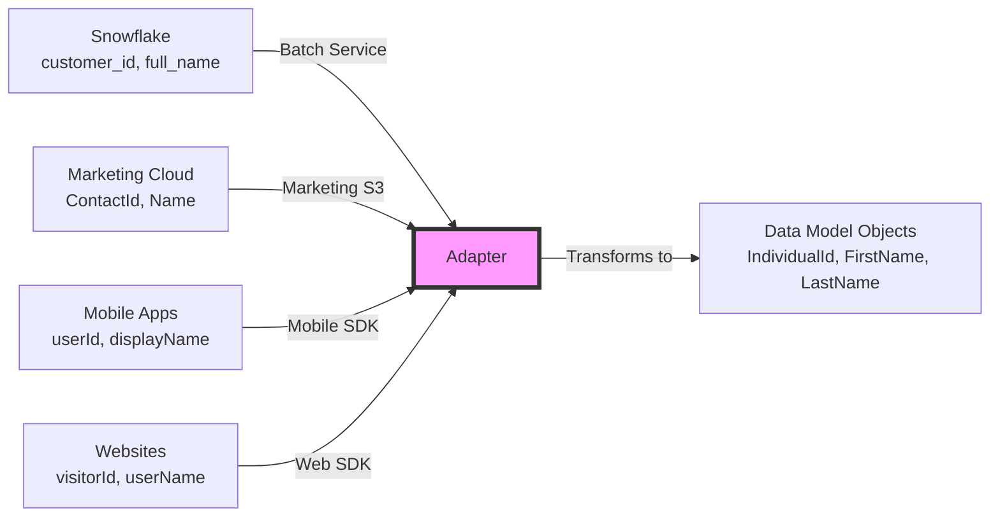

### Real Adapter Examples from Architecture

**1. Zero Copy Databricks Adapter:**
```
Databricks Table: customer_transactions
Fields: [txn_id, cust_id, amount, date]
         ↓
    [Zero Copy Adapter]
         ↓
Data Cloud: Transaction__dmo
Fields: [TransactionId, IndividualId, Amount, Date]
```

**2. MuleSoft Cloudhub Adapter:**
```
Workday API Response:
{
  "employeeNumber": "EMP001",
  "workerName": "John Doe",
  "department": "Sales"
}
         ↓
    [MuleSoft Adapter]
         ↓
Data Cloud Employee Object:
{
  "EmployeeId": "EMP001",
  "FullName": "John Doe",
  "Department": "Sales"
}
```

---

## 2. FACADE PATTERN

### Real Implementation in Architecture
**Location:** Semantic Layer (Business View)

### Actual Data Example

**Underlying Complexity (Hidden from Users):**

**Data Sources:**
- Sales Org: Opportunity (Amount, CloseDate, StageName)
- Sales Org: Account (Name, Industry)
- Data Cloud: Unified Profiles (IndividualId, LifetimeValue)
- Snowflake: Transactions (TransactionDate, Amount)

**Semantic Layer Facade - "Sales Velocity" Metric:**
```sql
-- Behind the scenes (hidden complexity)
SELECT 
    SUM(o.Amount) / AVG(DATEDIFF(o.CloseDate, o.CreatedDate)) as SalesVelocity
FROM Opportunity o
JOIN Account a ON o.AccountId = a.Id
JOIN UnifiedProfile up ON a.OwnerId = up.IndividualId
WHERE o.StageName = 'Closed Won'
  AND o.CloseDate >= DATEADD(month, -3, CURRENT_DATE)
GROUP BY a.Industry
```

**What Business Users See:**
```
Metric: "Sales Velocity" 
Value: $125,000 per day
Dimension: Industry = "Technology"
Filter: Last 3 Months
```

### Mermaid Diagram

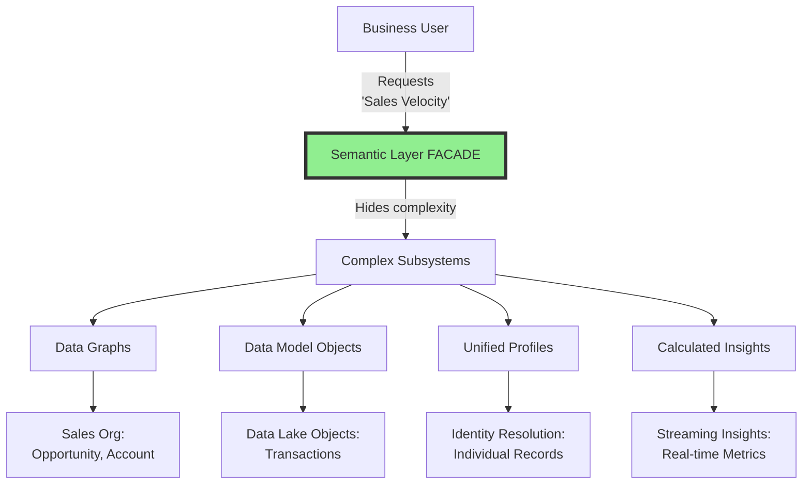

### Real Facade Examples

**Example 1: Customer 360 View**

**Behind the Facade:**
```json
{
  "sources": [
    {"system": "Sales Org", "object": "Account", "fields": ["Name", "Industry"]},
    {"system": "Service Org", "object": "Case", "fields": ["Status", "Priority"]},
    {"system": "Marketing Cloud", "object": "Journey", "fields": ["EngagementScore"]},
    {"system": "Snowflake", "object": "Transactions", "fields": ["TotalSpend"]}
  ]
}
```

**What User Sees:**
```json
{
  "CustomerName": "Acme Corporation",
  "Industry": "Manufacturing",
  "HealthScore": 85,
  "OpenCases": 2,
  "EngagementLevel": "High",
  "LifetimeValue": 450000
}
```

**Example 2: Unified Profile Facade**

**Multiple Source Records:**
```
Record 1 (Sales Org Contact):
  ContactId: 003XX000001, Name: "Jane Austin", Email: "jane.austin@acme.com"

Record 2 (Service Org Contact):
  ContactId: 003YY000002, Name: "Jan Austin", Email: "j.austin@acme.com"

Record 3 (Marketing Cloud):
  SubscriberId: SUB-789, Name: "J Austin", Email: "jane.austin@acme.com"
```

**Unified Profile (Facade):**
```json
{
  "UnifiedIndividualId": "IND-UNIFIED-001",
  "PreferredName": "Jane Austin",
  "Emails": ["jane.austin@acme.com", "j.austin@acme.com"],
  "Phone": "+1-555-0123",
  "DataLineage": ["003XX000001", "003YY000002", "SUB-789"]
}
```

---

## 3. PROXY PATTERN

### Real Implementation in Architecture
**Location:** Einstein Trust Layer (LLM Gateway)

### Actual Data Example

**Direct LLM Call (Without Proxy):**
```
Agent Request → OpenAI API directly
Risk: No monitoring, no cost control, no audit
```

**With Einstein Trust Layer Proxy:**

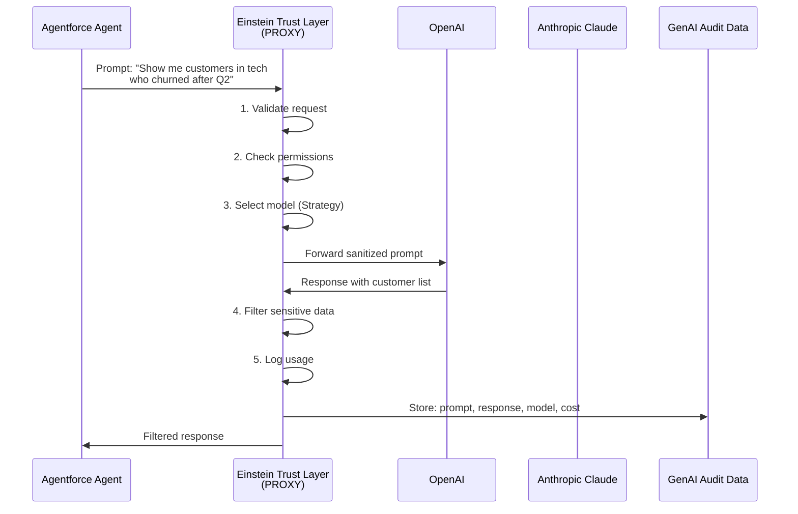

### Real Proxy Example

**Scenario: Agent Query for Customer Insights**

**Agent Request:**
```json
{
  "agentId": "AGENT-001",
  "userId": "sales.rep@acme.com",
  "query": "Which customers in the Technology industry have the highest churn probability and what are the reasons?",
  "context": {
    "currentAccount": "Acme Corp",
    "region": "North America"
  }
}
```

**Einstein Trust Layer Proxy Processing:**

**Step 1: Access Control**
```
✓ User has permission for customer data
✓ User can access Technology industry segment
✓ User region matches data region (North America)
```

**Step 2: Data Retrieval (via Vector DB Proxy)**
```
Semantic Search Query → Vector DB (Search Indexes)
Results: Top 10 similar customer records with churn indicators
```

**Step 3: LLM Selection & Call**
```
Selected Model: claude-sonnet-4-20250514
Reason: Best for analytical queries

Prompt sent to Anthropic:
"Analyze these customer records for churn risk factors:
[Customer Data from Vector DB]
Focus on: engagement metrics, support cases, contract renewals"
```

**Step 4: Response Filtering**
```
Raw LLM Response includes:
- Customer names ✓ (allowed)
- Email addresses ✗ (filtered out)
- Phone numbers ✗ (filtered out)
- Churn analysis ✓ (allowed)
```

**Step 5: Audit Logging**
```json
{
  "timestamp": "2025-10-23T14:30:00Z",
  "agentId": "AGENT-001",
  "userId": "sales.rep@acme.com",
  "model": "claude-sonnet-4-20250514",
  "promptTokens": 1250,
  "responseTokens": 890,
  "cost": 0.0342,
  "latency_ms": 1450,
  "dataAccessed": ["Customer360", "ChurnPredictions"]
}
```

**Final Response to Agent:**
```json
{
  "insights": [
    {
      "customerId": "CUST-8821",
      "customerName": "TechStart Inc",
      "churnProbability": 0.78,
      "riskFactors": [
        "Declined from 15 to 3 logins/month",
        "2 unresolved high-priority cases",
        "Contract renewal in 45 days",
        "No engagement with new features"
      ],
      "recommendation": "Immediate account review and executive outreach"
    }
  ],
  "modelUsed": "claude-sonnet-4-20250514",
  "confidence": 0.89
}
```

---

## 4. MEDIATOR PATTERN

### Real Implementation in Architecture
**Location:** Data Cloud Core (central hub)

### Problem Without Mediator

```
Sales Org ←→ Service Org (integration 1)
Sales Org ←→ Marketing Cloud (integration 2)
Sales Org ←→ Other Orgs (integration 3)
Service Org ←→ Marketing Cloud (integration 4)
Service Org ←→ Other Orgs (integration 5)
Marketing Cloud ←→ Other Orgs (integration 6)

Total: 6 point-to-point integrations for 4 systems!
For n systems: n(n-1)/2 integrations = O(n²) complexity
```

### Solution With Data Cloud Mediator

```
Sales Org → Data Cloud
Service Org → Data Cloud
Marketing Cloud → Data Cloud
Other Orgs → Data Cloud

Total: 4 integrations = O(n) complexity
```

### Mermaid Diagram

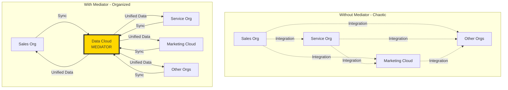

### Real Data Example

**Scenario: Customer Contact Update**

**Sales Org Record:**
```json
{
  "Id": "003XX001",
  "ObjectType": "Contact",
  "FirstName": "Jane",
  "LastName": "Austin",
  "Email": "jane.austin@acme.com",
  "Phone": "+1-555-0123",
  "AccountId": "001XX001"
}
```

**Service Org Record:**
```json
{
  "Id": "003YY002",
  "ObjectType": "Contact",
  "FirstName": "Jan",
  "LastName": "Austin",
  "Email": "j.austin@acme.com",
  "Phone": "+1-555-0123",
  "AccountId": "001YY002"
}
```

**Marketing Cloud Record:**
```json
{
  "SubscriberId": "SUB-789",
  "EmailAddress": "jane.austin@acme.com",
  "FirstName": "J",
  "LastName": "Austin",
  "MobileNumber": "+15550123"
}
```

**Data Cloud Mediator Process:**

**Step 1: Receives Updates from All Systems**
```
[Sales Org] --CRM Data Sync--> [Data Cloud]
[Service Org] --CRM Data Sync--> [Data Cloud]
[Marketing Cloud] --Platform Events--> [Data Cloud]
```

**Step 2: Identity Resolution (Mediates Matching)**
```
Matching Rules:
- Exact match on Phone: "+1-555-0123" = "+15550123" (normalized)
- Fuzzy match on Name: "Jane Austin" ≈ "Jan Austin" ≈ "J Austin" (similarity: 0.85)
- Email domain match: "acme.com"

Decision: Same individual
```

**Step 3: Creates Unified Profile**
```json
{
  "UnifiedIndividualId": "IND-UNIFIED-001",
  "FirstName": "Jane",
  "LastName": "Austin",
  "Emails": ["jane.austin@acme.com", "j.austin@acme.com"],
  "Phone": "+15550123",
  "SourceRecords": [
    {"system": "Sales Org", "id": "003XX001"},
    {"system": "Service Org", "id": "003YY002"},
    {"system": "Marketing Cloud", "id": "SUB-789"}
  ],
  "DataLineage": {
    "preferredNameSource": "Sales Org",
    "preferredEmailSource": "Sales Org",
    "lastUpdated": "2025-10-23T10:15:00Z"
  }
}
```

**Step 4: Distributes Updates (Mediates Communication)**
```
IF Service Org creates a case:
  Data Cloud → Notify Sales Org via Data Actions
  Data Cloud → Update Marketing Cloud suppression list

IF Marketing Cloud records email bounce:
  Data Cloud → Update Sales Org contact record
  Data Cloud → Flag in Service Org for verification
```

### Real Identity Resolution Example

**Scenario: Multiple Account Records**

**Record A (Sales Org):**
```json
{
  "AccountId": "001XX001",
  "Name": "Acme Corporation",
  "Website": "www.acme.com",
  "Phone": "555-0100",
  "Industry": "Manufacturing"
}
```

**Record B (Other Org):**
```json
{
  "AccountId": "001ZZ999",
  "Name": "ACME Corp",
  "Website": "acme.com",
  "Phone": "555-0100",
  "Industry": "Manufacturing"
}
```

**Record C (Snowflake):**
```json
{
  "customer_id": "CUST-12345",
  "company_name": "Acme Corp.",
  "domain": "acme.com",
  "contact_phone": "(555) 010-0100"
}
```

**Identity Resolution (Mediator Logic):**

```
Ruleset Matching:
1. Exact normalized phone: "5550100" = "5550100" = "5550100" ✓
2. Domain match: "acme.com" = "acme.com" = "acme.com" ✓
3. Fuzzy name match: "Acme Corporation" ≈ "ACME Corp" ≈ "Acme Corp." (score: 0.92) ✓

Reconciliation Decision: Same account
```

**Unified Account Profile:**
```json
{
  "UnifiedAccountId": "ACC-UNIFIED-5001",
  "Name": "Acme Corporation",
  "AlternateNames": ["ACME Corp", "Acme Corp."],
  "Website": "www.acme.com",
  "Phone": "+15550100",
  "Industry": "Manufacturing",
  "SourceRecords": [
    {"system": "Sales Org", "id": "001XX001", "confidence": 1.0},
    {"system": "Other Org", "id": "001ZZ999", "confidence": 0.95},
    {"system": "Snowflake", "id": "CUST-12345", "confidence": 0.92}
  ],
  "DataLineage": {
    "nameSource": "Sales Org",
    "phoneSource": "Sales Org",
    "industrySource": "Sales Org",
    "createdDate": "2025-10-23T10:15:00Z"
  }
}
```

---

## 5. OBSERVER PATTERN

### Real Implementation in Architecture
**Location:** Data Streams → Platform Events → Multiple Subscribers

### Mermaid Diagram

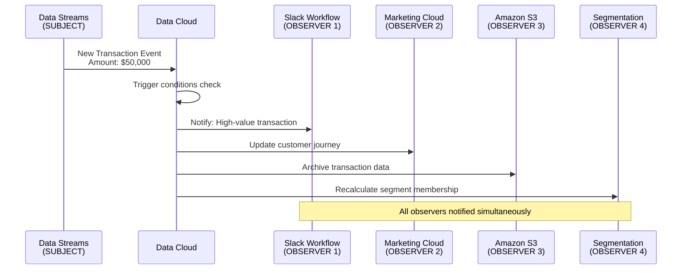

### Real Data Example

**Subject: Data Stream (Transaction Data)**

**Incoming Transaction:**
```json
{
  "transactionId": "TXN-98765",
  "customerId": "CUST-12345",
  "amount": 50000.00,
  "date": "2025-10-23T14:30:00Z",
  "type": "Purchase",
  "product": "Enterprise License"
}
```

**Data Cloud Processing:**
```
1. Ingest via Streaming Ingestion API (Real-time)
2. Match to Unified Profile: IND-UNIFIED-001
3. Calculate: New Lifetime Value = Previous LTV + $50,000
4. Trigger: High-value transaction threshold exceeded ($10,000)
```

**Observer 1: Slack Workflow**
```
Trigger: Transaction > $10,000
Action: Send Slack notification

Slack Message:
{
  "channel": "#high-value-sales",
  "message": "🎉 High-value transaction alert!",
  "details": {
    "customer": "Jane Austin (Acme Corporation)",
    "amount": "$50,000",
    "product": "Enterprise License",
    "accountOwner": "@john.doe"
  },
  "action": "Review upsell opportunities"
}
```

**Observer 2: Marketing Cloud (Send Emails/Trigger Journeys)**
```
Trigger: Transaction > $10,000
Action: Enroll in VIP customer journey

Journey Update:
{
  "subscriberId": "SUB-789",
  "journeyId": "VIP-ONBOARDING-001",
  "action": "Enroll",
  "entrySource": "Data Cloud - High Value Purchase",
  "emailTemplate": "VIP Welcome Email",
  "sendTime": "immediate"
}
```

**Observer 3: Amazon S3 (Data Archival)**
```
Trigger: All transactions
Action: Archive for compliance

S3 Write:
{
  "bucket": "transactions-archive-2025",
  "key": "2025/10/23/TXN-98765.json",
  "data": {
    "transactionId": "TXN-98765",
    "customerId": "CUST-12345",
    "amount": 50000.00,
    "timestamp": "2025-10-23T14:30:00Z",
    "archivedAt": "2025-10-23T14:31:00Z"
  }
}
```

**Observer 4: Segmentation (Recalculate Membership)**
```
Trigger: Lifetime Value changed
Action: Update segment membership

Segment: "High-Value Customers" (LTV > $100,000)
Before: Not a member (LTV was $85,000)
After: Now a member (LTV is $135,000)

Segment Update:
{
  "segmentId": "SEG-HIGH-VALUE-001",
  "individualId": "IND-UNIFIED-001",
  "action": "Add",
  "reason": "Lifetime Value exceeded threshold",
  "previousLTV": 85000.00,
  "currentLTV": 135000.00,
  "timestamp": "2025-10-23T14:31:00Z"
}
```

**Observer 5: Calculated Insights (Update Metrics)**
```
Trigger: Transaction event
Action: Update real-time dashboard metrics

Streaming Insight Update:
{
  "metric": "Daily Revenue",
  "previousValue": 245000.00,
  "newValue": 295000.00,
  "change": +50000.00,
  "timestamp": "2025-10-23T14:31:00Z"
}
```

### Frequency Options (from Architecture)

```
Real-time: < 1 second
2 mins: Near real-time
5 mins: Near real-time
10 mins: Near real-time
15 mins: Near real-time
Hourly: Scheduled
Daily: Batch
Weekly: Batch
```

**Example Configuration:**
```json
{
  "eventType": "High-Value Transaction",
  "observers": [
    {
      "name": "Slack Workflow",
      "frequency": "Real-time",
      "condition": "amount > 10000"
    },
    {
      "name": "Marketing Cloud Journey",
      "frequency": "2 mins",
      "condition": "amount > 10000"
    },
    {
      "name": "S3 Archive",
      "frequency": "5 mins",
      "condition": "all transactions"
    },
    {
      "name": "Segmentation Recalculation",
      "frequency": "15 mins",
      "condition": "LTV changed"
    }
  ]
}
```

---

## 6. STRATEGY PATTERN

### Real Implementation in Architecture
**Location:** Identity Resolution (Ruleset vs Reconciliation)

### Mermaid Diagram

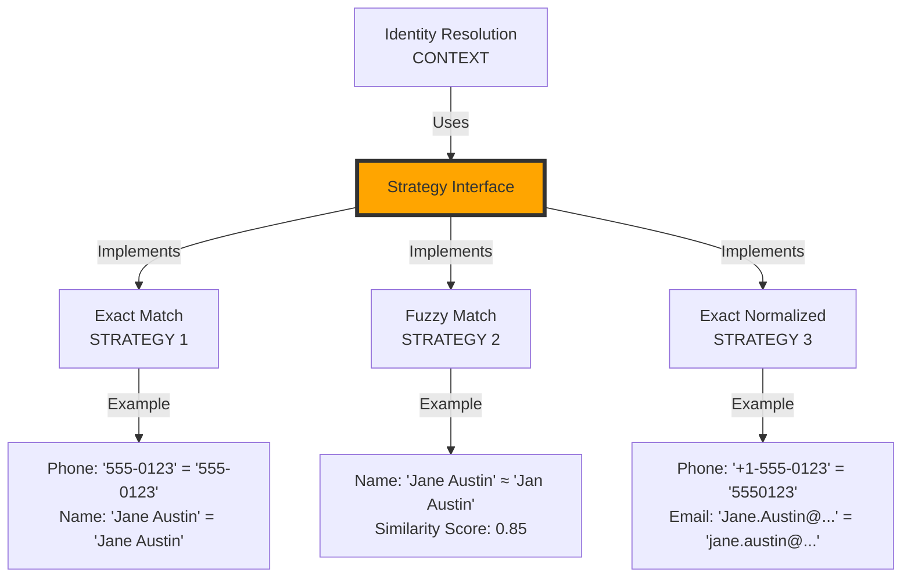

### Real Data Example

**Input Records for Matching:**

**Record 1:**
```json
{
  "source": "Sales Org Contact",
  "id": "003XX001",
  "firstName": "Jane",
  "lastName": "Austin",
  "email": "jane.austin@acme.com",
  "phone": "+1-555-0123"
}
```

**Record 2:**
```json
{
  "source": "Service Org Contact",
  "id": "003YY002",
  "firstName": "Jan",
  "lastName": "Austin",
  "email": "j.austin@acme.com",
  "phone": "555-0123"
}
```

**Record 3:**
```json
{
  "source": "Marketing Cloud Subscriber",
  "id": "SUB-789",
  "firstName": "J",
  "lastName": "Austin",
  "email": "JANE.AUSTIN@ACME.COM",
  "phone": "(555) 010-0123"
}
```

### Strategy 1: Exact Match

```python
# Exact Match Strategy
def exact_match(record1, record2):
    return (
        record1.email == record2.email and
        record1.phone == record2.phone and
        record1.firstName == record2.firstName and
        record1.lastName == record2.lastName
    )

# Result:
Record 1 vs Record 2: False (firstName mismatch: "Jane" != "Jan")
Record 1 vs Record 3: False (firstName mismatch: "Jane" != "J")
Record 2 vs Record 3: False (firstName mismatch: "Jan" != "J")

Conclusion: No matches found (Too strict!)
```

### Strategy 2: Fuzzy Match

```python
# Fuzzy Match Strategy (String Similarity)
def fuzzy_match(record1, record2, threshold=0.80):
    name1 = f"{record1.firstName} {record1.lastName}"
    name2 = f"{record2.firstName} {record2.lastName}"
    similarity = calculate_similarity(name1, name2)  # Levenshtein distance
    
    return similarity >= threshold

# Results:
Record 1 vs Record 2:
  "Jane Austin" vs "Jan Austin"
  Similarity: 0.91 (11 chars, 1 different)
  Match: True ✓

Record 1 vs Record 3:
  "Jane Austin" vs "J Austin"
  Similarity: 0.77 (11 chars, multiple different)
  Match: False (below threshold)

Record 2 vs Record 3:
  "Jan Austin" vs "J Austin"
  Similarity: 0.82 (10 chars, 2 different)
  Match: True ✓
```

### Strategy 3: Exact Normalized Match

```python
# Exact Normalized Match Strategy
def exact_normalized_match(record1, record2):
    # Normalize phone numbers
    phone1 = normalize_phone(record1.phone)  # "+1-555-0123" → "5550123"
    phone2 = normalize_phone(record2.phone)  # "555-0123" → "5550123"
    
    # Normalize emails (lowercase, trim)
    email1 = normalize_email(record1.email)  # "jane.austin@acme.com"
    email2 = normalize_email(record2.email)  # "j.austin@acme.com"
    
    # Check domain match
    domain_match = get_domain(email1) == get_domain(email2)
    
    return phone1 == phone2 and domain_match

# Results:
Record 1 vs Record 2:
  Phone: "5550123" = "5550123" ✓
  Domain: "acme.com" = "acme.com" ✓
  Match: True ✓

Record 1 vs Record 3:
  Phone: "5550123" = "5550123" ✓
  Email: "jane.austin@acme.com" = "JANE.AUSTIN@ACME.COM" (normalized) ✓
  Match: True ✓

Record 2 vs Record 3:
  Phone: "5550123" = "5550123" ✓
  Domain: "acme.com" = "acme.com" ✓
  Match: True ✓
```

### Strategy Selection in Data Cloud

**Ruleset Configuration:**
```json
{
  "identityResolutionRules": [
    {
      "name": "High Confidence Match",
      "strategy": "ExactNormalizedMatch",
      "fields": ["phone", "email"],
      "weight": 1.0,
      "priority": 1
    },
    {
      "name": "Medium Confidence Match",
      "strategy": "FuzzyMatch",
      "fields": ["firstName", "lastName"],
      "threshold": 0.85,
      "weight": 0.7,
      "priority": 2,
      "requiresAdditionalField": "phone or email domain"
    },
    {
      "name": "Low Confidence Match",
      "strategy": "FuzzyMatch",
      "fields": ["name"],
      "threshold": 0.90,
      "weight": 0.5,
      "priority": 3,
      "requiresManualReview": true
    }
  ]
}
```

**Execution Result:**
```json
{
  "matchGroup": "IND-UNIFIED-001",
  "records": [
    {
      "id": "003XX001",
      "source": "Sales Org",
      "matchStrategy": "ExactNormalizedMatch",
      "confidence": 1.0
    },
    {
      "id": "003YY002",
      "source": "Service Org",
      "matchStrategy": "ExactNormalizedMatch",
      "confidence": 1.0
    },
    {
      "id": "SUB-789",
      "source": "Marketing Cloud",
      "matchStrategy": "ExactNormalizedMatch",
      "confidence": 1.0
    }
  ],
  "unifiedProfile": {
    "UnifiedIndividualId": "IND-UNIFIED-001",
    "FirstName": "Jane",
    "LastName": "Austin",
    "Email": "jane.austin@acme.com",
    "Phone": "+15550123",
    "DataLineage": {
      "nameSource": "003XX001",
      "emailSource": "003XX001",
      "phoneSource": "003XX001"
    }
  }
}
```

### Another Strategy Example: Integration Methods

**Context: Data Ingestion**

**Strategy 1: Real-time Streaming**
```json
{
  "method": "Streaming Ingestion API",
  "frequency": "Real-time",
  "useCase": "Website clicks, mobile app events",
  "example": {
    "event": "ProductView",
    "timestamp": "2025-10-23T14:30:00.123Z",
    "userId": "USER-789",
    "productId": "PROD-456"
  }
}
```

**Strategy 2: Batch Processing**
```json
{
  "method": "Batch Service",
  "frequency": "Daily at 2 AM",
  "useCase": "Historical transaction data from Snowflake",
  "example": {
    "batch": "2025-10-22-transactions.csv",
    "recordCount": 50000,
    "startTime": "2025-10-23T02:00:00Z",
    "endTime": "2025-10-23T02:45:00Z"
  }
}
```

**Strategy 3: Near Real-time**
```json
{
  "method": "Marketing S3",
  "frequency": "Every 5 minutes",
  "useCase": "Marketing campaign engagement data",
  "example": {
    "bucket": "marketing-data-2025",
    "key": "campaigns/2025-10-23/14-30-batch.json",
    "recordCount": 1200
  }
}
```

---

## 7. COMPOSITE PATTERN

### Real Implementation in Architecture
**Location:** Data Graphs, Customer 360 Data Model

### Mermaid Diagram

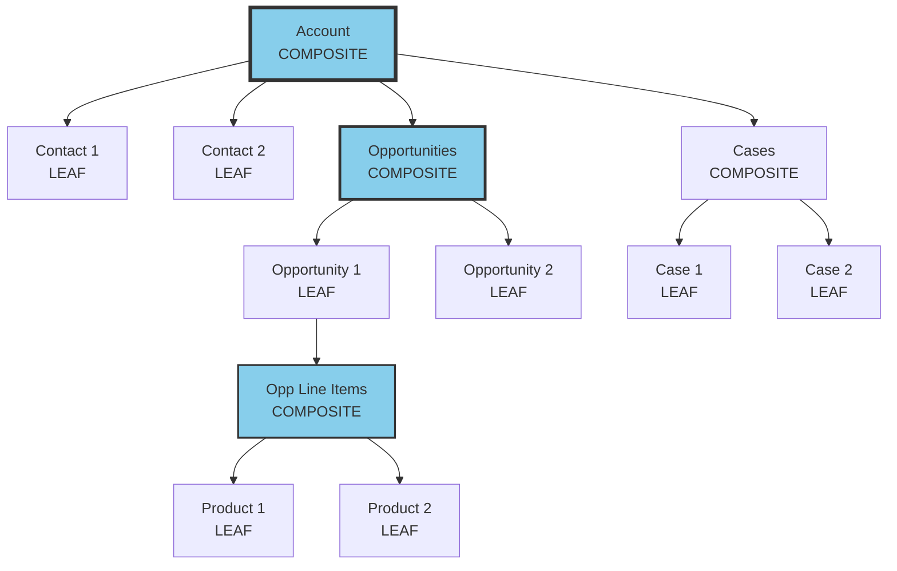

### Real Data Example

**Root: Account (Composite Node)**
```json
{
  "AccountId": "001XX001",
  "Name": "Acme Corporation",
  "Industry": "Manufacturing",
  "AnnualRevenue": 5000000,
  "Employees": 250,
  "children": {
    "Contacts": [...],
    "Opportunities": [...],
    "Cases": [...]
  }
}
```

**Child Level 1: Contacts (Leaf Nodes)**
```json
{
  "Contacts": [
    {
      "ContactId": "003XX001",
      "Name": "Jane Austin",
      "Title": "CTO",
      "Email": "jane.austin@acme.com",
      "Phone": "+1-555-0123",
      "IsPrimary": true
    },
    {
      "ContactId": "003XX002",
      "Name": "John Doe",
      "Title": "VP of Sales",
      "Email": "john.doe@acme.com",
      "Phone": "+1-555-0124",
      "IsPrimary": false
    }
  ]
}
```

**Child Level 1: Opportunities (Composite Nodes)**
```json
{
  "Opportunities": [
    {
      "OpportunityId": "006XX001",
      "Name": "Enterprise License Renewal",
      "Amount": 150000,
      "CloseDate": "2025-11-30",
      "Stage": "Negotiation",
      "Probability": 75,
      "ContactId": "003XX001",
      "children": {
        "OpportunityLineItems": [...]
      }
    },
    {
      "OpportunityId": "006XX002",
      "Name": "Professional Services",
      "Amount": 50000,
      "CloseDate": "2025-12-15",
      "Stage": "Proposal",
      "Probability": 60,
      "ContactId": "003XX002",
      "children": {
        "OpportunityLineItems": [...]
      }
    }
  ]
}
```

**Child Level 2: Opportunity Line Items (Leaf Nodes)**
```json
{
  "OpportunityLineItems": [
    {
      "LineItemId": "00kXX001",
      "OpportunityId": "006XX001",
      "ProductId": "01tXX001",
      "ProductName": "Enterprise License (100 users)",
      "Quantity": 100,
      "UnitPrice": 1200,
      "TotalPrice": 120000
    },
    {
      "LineItemId": "00kXX002",
      "OpportunityId": "006XX001",
      "ProductId": "01tXX002",
      "ProductName": "Premium Support",
      "Quantity": 1,
      "UnitPrice": 30000,
      "TotalPrice": 30000
    }
  ]
}
```

**Child Level 1: Cases (Composite Nodes)**
```json
{
  "Cases": [
    {
      "CaseId": "500XX001",
      "Subject": "Cannot access dashboard",
      "Status": "Open",
      "Priority": "High",
      "CreatedDate": "2025-10-20",
      "ContactId": "003XX001",
      "children": {
        "CaseComments": [...]
      }
    },
    {
      "CaseId": "500XX002",
      "Subject": "Feature request: API rate limit increase",
      "Status": "In Progress",
      "Priority": "Medium",
      "CreatedDate": "2025-10-15",
      "ContactId": "003XX002",
      "children": {
        "CaseComments": [...]
      }
    }
  ]
}
```

### Multi-Hop Graph Analytics (Traversing Composite Structure)

**Query: "Find all high-priority open cases for accounts with opportunities > $100K closing this quarter"**

```
Traversal Path:
1. Account (Acme Corporation)
   ↓
2. Opportunities (Filter: Amount > 100000, CloseDate in Q4 2025)
   Result: 006XX001 ($150K)
   ↓
3. Related Contact for Opportunity
   Result: 003XX001 (Jane Austin)
   ↓
4. Cases for that Contact (Filter: Priority = High, Status = Open)
   Result: 500XX001

Answer: Case 500XX001 - "Cannot access dashboard"
```

**Graph Traversal Result:**
```json
{
  "query": "High-priority cases for high-value opportunities",
  "traversalPath": [
    {
      "level": 0,
      "node": "Account",
      "id": "001XX001",
      "name": "Acme Corporation"
    },
    {
      "level": 1,
      "node": "Opportunity",
      "id": "006XX001",
      "name": "Enterprise License Renewal",
      "amount": 150000
    },
    {
      "level": 2,
      "node": "Contact",
      "id": "003XX001",
      "name": "Jane Austin",
      "title": "CTO"
    },
    {
      "level": 3,
      "node": "Case",
      "id": "500XX001",
      "subject": "Cannot access dashboard",
      "priority": "High",
      "status": "Open"
    }
  ],
  "insight": "CTO of high-value account has critical open case affecting dashboard access during renewal negotiation",
  "recommendation": "Prioritize case resolution to prevent opportunity risk"
}
```

### Ontology Composite Structure

**From Architecture: Neo4j Graph Database**

```
[Class: Organization] (Composite)
    ├── [Attribute: Name]
    ├── [Attribute: Industry]
    ├── [Relationship: employs] → [Class: Person] (Composite)
    │       ├── [Attribute: FirstName]
    │       ├── [Attribute: LastName]
    │       ├── [Attribute: Email]
    │       └── [Relationship: owns] → [Class: Account] (Composite)
    │               ├── [Attribute: AccountNumber]
    │               └── [Relationship: contains] → [Class: Opportunity]
    │
    └── [Relationship: purchases] → [Class: Product] (Composite)
            ├── [Attribute: ProductName]
            ├── [Attribute: Price]
            └── [Relationship: belongsTo] → [Class: ProductLine]
```

**Example Instance:**
```json
{
  "class": "Organization",
  "instance": {
    "name": "Acme Corporation",
    "industry": "Manufacturing",
    "relationships": {
      "employs": [
        {
          "class": "Person",
          "firstName": "Jane",
          "lastName": "Austin",
          "email": "jane.austin@acme.com",
          "relationships": {
            "owns": [
              {
                "class": "Account",
                "accountNumber": "ACC-001",
                "relationships": {
                  "contains": [
                    {
                      "class": "Opportunity",
                      "name": "Enterprise License Renewal",
                      "amount": 150000
                    }
                  ]
                }
              }
            ]
          }
        }
      ],
      "purchases": [
        {
          "class": "Product",
          "productName": "Enterprise License",
          "price": 1200,
          "relationships": {
            "belongsTo": {
              "class": "ProductLine",
              "name": "Software Licenses"
            }
          }
        }
      ]
    }
  }
}
```

---

## 8. SINGLETON PATTERN

### Real Implementation in Architecture
**Location:** Unified Profiles (Single Source of Truth per Individual/Account)

### The Problem: Duplicate Records

**Before Identity Resolution:**

**Sales Org Contact:**
```json
{
  "Id": "003XX001",
  "Source": "Sales Org",
  "Name": "Jane Austin",
  "Email": "jane.austin@acme.com",
  "Phone": "+1-555-0123",
  "Status": "Active"
}
```

**Service Org Contact:**
```json
{
  "Id": "003YY002",
  "Source": "Service Org",
  "Name": "Jan Austin",
  "Email": "j.austin@acme.com",
  "Phone": "555-0123",
  "Status": "Active"
}
```

**Marketing Cloud Subscriber:**
```json
{
  "Id": "SUB-789",
  "Source": "Marketing Cloud",
  "Name": "J Austin",
  "Email": "jane.austin@acme.com",
  "Phone": "(555) 010-0123",
  "Status": "Subscribed"
}
```

**Problem: Three instances of the same person!**

### Solution: Unified Profile (SINGLETON)

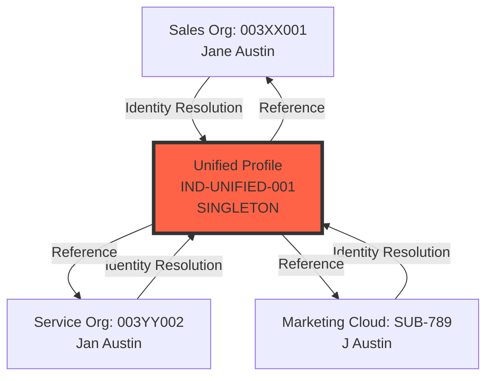

### Real Data Example

**After Identity Resolution (Singleton Created):**

```json
{
  "UnifiedIndividualId": "IND-UNIFIED-001",
  "type": "SINGLETON",
  "preferredData": {
    "FirstName": "Jane",
    "LastName": "Austin",
    "Email": "jane.austin@acme.com",
    "Phone": "+15550123",
    "Status": "Active"
  },
  "sourceRecords": [
    {
      "systemId": "003XX001",
      "systemName": "Sales Org",
      "systemType": "Salesforce CRM",
      "confidence": 1.0,
      "isPreferredSource": true,
      "fields": {
        "firstName": "Jane",
        "lastName": "Austin",
        "email": "jane.austin@acme.com",
        "phone": "+1-555-0123"
      }
    },
    {
      "systemId": "003YY002",
      "systemName": "Service Org",
      "systemType": "Salesforce CRM",
      "confidence": 0.95,
      "isPreferredSource": false,
      "fields": {
        "firstName": "Jan",
        "lastName": "Austin",
        "email": "j.austin@acme.com",
        "phone": "555-0123"
      }
    },
    {
      "systemId": "SUB-789",
      "systemName": "Marketing Cloud",
      "systemType": "Marketing Automation",
      "confidence": 0.92,
      "isPreferredSource": false,
      "fields": {
        "firstName": "J",
        "lastName": "Austin",
        "email": "jane.austin@acme.com",
        "phone": "(555) 010-0123"
      }
    }
  ],
  "dataLineage": {
    "createdDate": "2025-10-23T10:00:00Z",
    "lastModified": "2025-10-23T14:30:00Z",
    "preferredNameSource": "Sales Org (003XX001)",
    "preferredEmailSource": "Sales Org (003XX001)",
    "preferredPhoneSource": "Sales Org (003XX001)",
    "totalSources": 3,
    "resolutionMethod": "Exact Normalized Match",
    "resolutionConfidence": 0.95
  },
  "aggregatedMetrics": {
    "totalTransactions": 45,
    "lifetimeValue": 135000,
    "averageOrderValue": 3000,
    "lastPurchaseDate": "2025-10-23",
    "openCases": 1,
    "satisfactionScore": 4.5
  },
  "note": "Original records are preserved. No data is deleted or merged. This unified profile is a SINGLETON representation with references to all source records."
}
```

### Key Characteristics of Singleton Pattern

**1. Single Instance Per Entity:**
```
Individual "Jane Austin" → ONE Unified Profile (IND-UNIFIED-001)
Even if 10 systems have her data → Still ONE unified profile
```

**2. Global Access Point:**
```
Any system querying for Jane Austin → Gets IND-UNIFIED-001
Consistent view across all systems
```

**3. Data Lineage Preservation:**
```
Original records NOT deleted:
✓ Sales Org: 003XX001 (preserved)
✓ Service Org: 003YY002 (preserved)
✓ Marketing Cloud: SUB-789 (preserved)

Only creates new unified reference
```

### Account-Level Singleton Example

**Before: Multiple Account Records**

**Sales Org Account:**
```json
{
  "AccountId": "001XX001",
  "Source": "Sales Org",
  "Name": "Acme Corporation",
  "Website": "www.acme.com",
  "Industry": "Manufacturing",
  "AnnualRevenue": 5000000
}
```

**Other Org Account:**
```json
{
  "AccountId": "001ZZ999",
  "Source": "Other Org",
  "Name": "ACME Corp",
  "Website": "acme.com",
  "Industry": "Manufacturing",
  "AnnualRevenue": 5200000
}
```

**After: Unified Account Profile (SINGLETON)**

```json
{
  "UnifiedAccountId": "ACC-UNIFIED-5001",
  "type": "SINGLETON",
  "preferredData": {
    "Name": "Acme Corporation",
    "Website": "www.acme.com",
    "Industry": "Manufacturing",
    "AnnualRevenue": 5200000,
    "Employees": 250
  },
  "sourceRecords": [
    {
      "systemId": "001XX001",
      "systemName": "Sales Org",
      "confidence": 1.0,
      "isPreferredSource": true
    },
    {
      "systemId": "001ZZ999",
      "systemName": "Other Org",
      "confidence": 0.95,
      "isPreferredSource": false
    }
  ],
  "dataLineage": {
    "nameSource": "Sales Org",
    "revenueSource": "Other Org (more recent)",
    "lastReconciliation": "2025-10-23T10:00:00Z"
  }
}
```

### Master Data Management (MDM) as Singleton Enforcer

**From Architecture: Informatica MDM & Salesforce Data Cloud MDM**

```
MDM ensures:
1. ONE authoritative version per entity
2. Global unique identifier
3. Consistent access across systems
4. Governance and stewardship rules

Example:
Customer "Jane Austin" → Unified ID: IND-UNIFIED-001
All systems must use: IND-UNIFIED-001 for queries
Local IDs (003XX001, 003YY002, SUB-789) → Cross-referenced
```

---

## 9. FACTORY PATTERN

### Real Implementation in Architecture
**Location:** Data Streams Creation (Different Ingestion Types)

### Mermaid Diagram

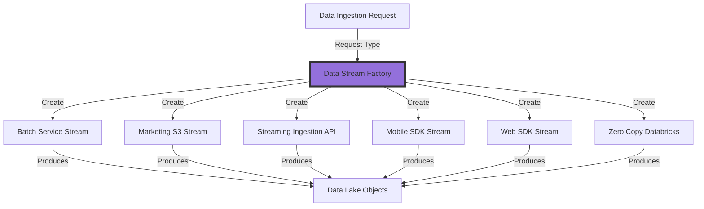

### Real Data Example

**Factory Input: Create Data Stream Request**

```json
{
  "requestId": "REQ-001",
  "sourceSystem": "Snowflake",
  "sourceType": "DataWarehouse",
  "dataType": "Transactions",
  "frequency": "Daily",
  "estimatedVolume": 50000,
  "priority": "High"
}
```

**Factory Decision Logic:**

```python
class DataStreamFactory:
    def create_stream(self, request):
        if request.sourceType == "DataWarehouse" and request.frequency == "Daily":
            return self.create_batch_service_stream(request)
        
        elif request.sourceType == "MarketingPlatform":
            return self.create_marketing_s3_stream(request)
        
        elif request.sourceType == "RealTimeEvents":
            return self.create_streaming_api_stream(request)
        
        elif request.sourceType == "MobileApp":
            return self.create_mobile_sdk_stream(request)
        
        elif request.sourceType == "Website":
            return self.create_web_sdk_stream(request)
        
        elif request.sourceType == "Databricks":
            return self.create_zero_copy_stream(request)
        
        else:
            raise ValueError(f"Unknown source type: {request.sourceType}")
```

### Product 1: Batch Service Stream

**Created Stream Configuration:**
```json
{
  "streamId": "STREAM-BATCH-001",
  "streamType": "BatchService",
  "name": "Snowflake Transactions Daily Import",
  "source": {
    "type": "Snowflake",
    "connection": "snowflake://acme.snowflakecomputing.com",
    "database": "PROD_DB",
    "schema": "TRANSACTIONS",
    "table": "DAILY_TRANSACTIONS"
  },
  "schedule": {
    "frequency": "Daily",
    "time": "02:00 AM UTC",
    "timezone": "UTC"
  },
  "transformation": {
    "fieldMapping": {
      "txn_id": "TransactionId",
      "cust_id": "IndividualId",
      "amount": "Amount",
      "txn_date": "TransactionDate"
    }
  },
  "destination": {
    "dataLakeObject": "Transaction__dmo",
    "dataModelObject": "Transaction"
  },
  "metadata": {
    "createdDate": "2025-10-23",
    "createdBy": "DataStreamFactory",
    "status": "Active"
  }
}
```

**Sample Data Flow:**
```
Snowflake Table → Batch Service → Data Lake Objects

Source Record:
{
  "txn_id": "TXN-98765",
  "cust_id": "CUST-12345",
  "amount": 50000.00,
  "txn_date": "2025-10-22"
}

After Transformation:
{
  "TransactionId": "TXN-98765",
  "IndividualId": "IND-UNIFIED-001",
  "Amount": 50000.00,
  "TransactionDate": "2025-10-22T00:00:00Z"
}
```

### Product 2: Streaming Ingestion API Stream

**Created Stream Configuration:**
```json
{
  "streamId": "STREAM-API-002",
  "streamType": "StreamingIngestionAPI",
  "name": "Real-time Product Views",
  "source": {
    "type": "HTTPS API",
    "endpoint": "https://api.datacloud.salesforce.com/v1/ingest",
    "authentication": "Bearer Token"
  },
  "frequency": "Real-time",
  "destination": {
    "dataLakeObject": "ProductView__dmo",
    "streamingInsight": "ProductViewMetrics"
  },
  "metadata": {
    "createdDate": "2025-10-23",
    "createdBy": "DataStreamFactory",
    "status": "Active"
  }
}
```

**Sample Data Flow:**
```
Website Event → Streaming API → Streaming Insights

Incoming Event:
POST https://api.datacloud.salesforce.com/v1/ingest
{
  "eventType": "ProductView",
  "timestamp": "2025-10-23T14:30:00.123Z",
  "userId": "USER-789",
  "productId": "PROD-456",
  "sessionId": "SESS-ABC123"
}

Processed in Real-time:
{
  "EventId": "EVT-55501",
  "EventType": "ProductView",
  "Timestamp": "2025-10-23T14:30:00.123Z",
  "IndividualId": "IND-UNIFIED-001",
  "ProductId": "PROD-456",
  "SessionId": "SESS-ABC123"
}

Streaming Insight Update:
{
  "metric": "Product Views Today",
  "productId": "PROD-456",
  "count": 1247,
  "lastUpdated": "2025-10-23T14:30:00.123Z"
}
```

### Product 3: Mobile SDK Stream

**Created Stream Configuration:**
```json
{
  "streamId": "STREAM-MOBILE-003",
  "streamType": "MobileSDK",
  "name": "Mobile App Activity",
  "source": {
    "type": "Mobile SDK",
    "platform": "iOS/Android",
    "sdkVersion": "3.2.1"
  },
  "eventTypes": [
    "AppLaunch",
    "ScreenView",
    "ButtonClick",
    "Purchase"
  ],
  "destination": {
    "dataLakeObject": "MobileEvent__dmo"
  }
}
```

**Sample Data Flow:**
```
Mobile App → Mobile SDK → Data Lake Objects

App Event:
{
  "eventType": "Purchase",
  "timestamp": "2025-10-23T14:45:00Z",
  "userId": "USER-789",
  "deviceId": "DEVICE-12345",
  "platform": "iOS",
  "appVersion": "2.1.0",
  "purchaseData": {
    "productId": "PROD-999",
    "amount": 99.99,
    "currency": "USD"
  }
}

Transformed:
{
  "EventId": "EVT-55502",
  "EventType": "Purchase",
  "Timestamp": "2025-10-23T14:45:00Z",
  "IndividualId": "IND-UNIFIED-001",
  "DeviceId": "DEVICE-12345",
  "Platform": "iOS",
  "ProductId": "PROD-999",
  "Amount": 99.99
}
```

### Product 4: Marketing S3 Stream

**Created Stream Configuration:**
```json
{
  "streamId": "STREAM-S3-004",
  "streamType": "MarketingS3",
  "name": "Marketing Cloud Campaign Data",
  "source": {
    "type": "Amazon S3",
    "bucket": "marketing-campaign-data",
    "prefix": "campaigns/2025/",
    "filePattern": "*.json"
  },
  "schedule": {
    "frequency": "Every 5 minutes",
    "pollInterval": 300
  },
  "destination": {
    "dataLakeObject": "CampaignEngagement__dmo"
  }
}
```

**Sample Data Flow:**
```
Marketing Cloud → S3 Bucket → Marketing S3 Stream → Data Lake

S3 File: campaigns/2025/engagement-2025-10-23-1430.json
{
  "subscriberId": "SUB-789",
  "campaignId": "CAMP-567",
  "eventType": "EmailOpen",
  "timestamp": "2025-10-23T14:30:00Z",
  "emailSubject": "Fall Sale - 30% Off"
}

Transformed:
{
  "EventId": "EVT-55503",
  "IndividualId": "IND-UNIFIED-001",
  "CampaignId": "CAMP-567",
  "EventType": "EmailOpen",
  "Timestamp": "2025-10-23T14:30:00Z",
  "Subject": "Fall Sale - 30% Off"
}
```

### Product 5: Zero Copy Databricks Stream

**Created Stream Configuration:**
```json
{
  "streamId": "STREAM-ZEROCOPY-005",
  "streamType": "ZeroCopyDatabricks",
  "name": "ML Model Features from Databricks",
  "source": {
    "type": "Databricks",
    "workspace": "acme-databricks.cloud.databricks.com",
    "catalog": "ml_features",
    "schema": "customer_features",
    "table": "churn_predictions"
  },
  "accessMethod": "Zero Copy (BYOL)",
  "destination": {
    "dataLakeObject": "ChurnPrediction__dmo"
  }
}
```

**Sample Data Flow:**
```
Databricks Table → Zero Copy → Data Cloud (No data movement!)

Databricks Table: churn_predictions
{
  "customer_id": "CUST-12345",
  "churn_probability": 0.78,
  "risk_factors": ["low_engagement", "high_support_cases"],
  "prediction_date": "2025-10-23"
}

Data Cloud Access (Virtual):
{
  "IndividualId": "IND-UNIFIED-001",
  "ChurnProbability": 0.78,
  "RiskFactors": ["low_engagement", "high_support_cases"],
  "PredictionDate": "2025-10-23"
}

Note: Data stays in Databricks, accessed virtually
```

### Factory Pattern Benefits

**1. Centralized Creation Logic:**
```
All stream types created through single factory
Consistent configuration and validation
```

**2. Easy Extension:**
```
Add new stream type:
- Implement new product class
- Add to factory method
- No changes to client code
```

**3. Encapsulation:**
```
Client doesn't need to know:
- How each stream type works
- Connection details
- Transformation logic
Just requests: "Create stream for X"
```

---

## 10. DECORATOR PATTERN

### Real Implementation in Architecture
**Location:** CRM Enrichment → Data Lake Objects

### Mermaid Diagram

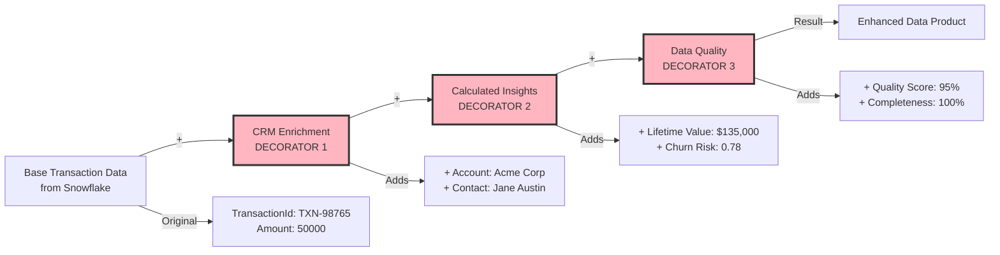

### Real Data Example

**Base Component: Raw Transaction from Snowflake**

```json
{
  "transactionId": "TXN-98765",
  "customerId": "CUST-12345",
  "amount": 50000.00,
  "date": "2025-10-23",
  "productCode": "ENT-LIC-100",
  "source": "Snowflake"
}
```

**Decorator 1: CRM Enrichment**

**What it adds:**
- Links to Salesforce CRM objects (Account, Contact, Opportunity)
- Adds business context

**After CRM Enrichment:**
```json
{
  "transactionId": "TXN-98765",
  "customerId": "CUST-12345",
  "amount": 50000.00,
  "date": "2025-10-23",
  "productCode": "ENT-LIC-100",
  "source": "Snowflake",
  
  "_crmEnrichment": {
    "enrichedDate": "2025-10-23T14:31:00Z",
    "unifiedIndividualId": "IND-UNIFIED-001",
    "individualName": "Jane Austin",
    "individualEmail": "jane.austin@acme.com",
    "unifiedAccountId": "ACC-UNIFIED-5001",
    "accountName": "Acme Corporation",
    "accountIndustry": "Manufacturing",
    "relatedOpportunityId": "006XX001",
    "opportunityName": "Enterprise License Renewal",
    "opportunityStage": "Closed Won",
    "accountOwnerId": "005XX001",
    "accountOwnerName": "John Doe"
  }
}
```

**Decorator 2: Calculated Insights**

**What it adds:**
- Lifetime Value calculation
- Churn probability from ML model
- Engagement metrics

**After Calculated Insights:**
```json
{
  "transactionId": "TXN-98765",
  "customerId": "CUST-12345",
  "amount": 50000.00,
  "date": "2025-10-23",
  "productCode": "ENT-LIC-100",
  "source": "Snowflake",
  
  "_crmEnrichment": {
    "enrichedDate": "2025-10-23T14:31:00Z",
    "unifiedIndividualId": "IND-UNIFIED-001",
    "individualName": "Jane Austin",
    "individualEmail": "jane.austin@acme.com",
    "unifiedAccountId": "ACC-UNIFIED-5001",
    "accountName": "Acme Corporation",
    "accountIndustry": "Manufacturing",
    "relatedOpportunityId": "006XX001",
    "opportunityName": "Enterprise License Renewal",
    "opportunityStage": "Closed Won",
    "accountOwnerId": "005XX001",
    "accountOwnerName": "John Doe"
  },
  
  "_calculatedInsights": {
    "calculatedDate": "2025-10-23T14:32:00Z",
    "lifetimeValue": {
      "total": 135000.00,
      "previousTotal": 85000.00,
      "change": 50000.00,
      "percentageChange": 58.82,
      "calculation": "SUM(all transactions for IND-UNIFIED-001)"
    },
    "churnProbability": {
      "score": 0.78,
      "risk": "High",
      "factors": [
        "Login frequency declined from 15 to 3/month",
        "2 unresolved high-priority cases",
        "Contract renewal in 45 days"
      ],
      "modelUsed": "ChurnPredictionModel_v2.3",
      "predictionDate": "2025-10-23"
    },
    "engagementScore": {
      "current": 42,
      "previous": 75,
      "trend": "Declining",
      "lastActivityDate": "2025-10-15"
    },
    "accountHealth": {
      "score": 65,
      "status": "At Risk",
      "reason": "High churn risk + declining engagement"
    }
  }
}
```

**Decorator 3: Data Quality Validation**

**What it adds:**
- Quality scores
- Completeness checks
- Lineage information

**Final Enhanced Record:**
```json
{
  "transactionId": "TXN-98765",
  "customerId": "CUST-12345",
  "amount": 50000.00,
  "date": "2025-10-23",
  "productCode": "ENT-LIC-100",
  "source": "Snowflake",
  
  "_crmEnrichment": {
    "enrichedDate": "2025-10-23T14:31:00Z",
    "unifiedIndividualId": "IND-UNIFIED-001",
    "individualName": "Jane Austin",
    "individualEmail": "jane.austin@acme.com",
    "unifiedAccountId": "ACC-UNIFIED-5001",
    "accountName": "Acme Corporation",
    "accountIndustry": "Manufacturing",
    "relatedOpportunityId": "006XX001",
    "opportunityName": "Enterprise License Renewal",
    "opportunityStage": "Closed Won",
    "accountOwnerId": "005XX001",
    "accountOwnerName": "John Doe"
  },
  
  "_calculatedInsights": {
    "calculatedDate": "2025-10-23T14:32:00Z",
    "lifetimeValue": {
      "total": 135000.00,
      "previousTotal": 85000.00,
      "change": 50000.00,
      "percentageChange": 58.82,
      "calculation": "SUM(all transactions for IND-UNIFIED-001)"
    },
    "churnProbability": {
      "score": 0.78,
      "risk": "High",
      "factors": [
        "Login frequency declined from 15 to 3/month",
        "2 unresolved high-priority cases",
        "Contract renewal in 45 days"
      ],
      "modelUsed": "ChurnPredictionModel_v2.3",
      "predictionDate": "2025-10-23"
    },
    "engagementScore": {
      "current": 42,
      "previous": 75,
      "trend": "Declining",
      "lastActivityDate": "2025-10-15"
    },
    "accountHealth": {
      "score": 65,
      "status": "At Risk",
      "reason": "High churn risk + declining engagement"
    }
  },
  
  "_dataQuality": {
    "validatedDate": "2025-10-23T14:33:00Z",
    "qualityScore": 95,
    "completenessScore": 100,
    "accuracyScore": 92,
    "validations": {
      "amountValid": true,
      "dateValid": true,
      "customerIdValid": true,
      "crmLinkValid": true,
      "calculationsValid": true
    },
    "issues": [
      {
        "field": "engagementScore",
        "issue": "Calculated value seems low",
        "severity": "Warning",
        "recommendation": "Verify recent activity logs"
      }
    ],
    "lineage": {
      "sourceSystem": "Snowflake",
      "ingestionMethod": "Batch Service",
      "enrichmentPipeline": [
        "CRM Enrichment (2025-10-23T14:31:00Z)",
        "Calculated Insights (2025-10-23T14:32:00Z)",
        "Data Quality Validation (2025-10-23T14:33:00Z)"
      ],
      "transformations": 12,
      "dataAge": "1 hour"
    }
  }
}
```

### Decorator Pattern Benefits

**1. Dynamic Enhancement:**
```
Can add/remove decorators without modifying base object
Each decorator is independent
```

**2. Single Responsibility:**
```
CRM Enrichment: Only adds CRM context
Calculated Insights: Only adds calculations
Data Quality: Only adds validation
```

**3. Flexible Composition:**
```
Can choose which decorators to apply:
- Basic: No decorators
- Standard: CRM Enrichment only
- Premium: CRM + Calculated Insights
- Enterprise: All decorators
```

### Another Example: Data Product Enhancement

**Base Data Product: Customer360**

```json
{
  "dataProductId": "DP-CUST360-001",
  "name": "Customer360 Basic",
  "unifiedIndividualId": "IND-UNIFIED-001",
  "basicInfo": {
    "name": "Jane Austin",
    "email": "jane.austin@acme.com",
    "phone": "+15550123"
  }
}
```

**+Decorator: Segmentation**

```json
{
  "dataProductId": "DP-CUST360-001",
  "name": "Customer360 with Segmentation",
  "unifiedIndividualId": "IND-UNIFIED-001",
  "basicInfo": {...},
  
  "_segmentation": {
    "segments": [
      {
        "segmentId": "SEG-HIGH-VALUE-001",
        "name": "High-Value Customers",
        "membershipDate": "2025-10-23",
        "criteria": "LTV > $100,000"
      },
      {
        "segmentId": "SEG-AT-RISK-002",
        "name": "At-Risk Customers",
        "membershipDate": "2025-10-23",
        "criteria": "Churn Probability > 0.7"
      }
    ]
  }
}
```

**+Decorator: ML Predictions**

```json
{
  "dataProductId": "DP-CUST360-001",
  "name": "Customer360 AI-Enhanced",
  "unifiedIndividualId": "IND-UNIFIED-001",
  "basicInfo": {...},
  "_segmentation": {...},
  
  "_mlPredictions": {
    "churnPrediction": {
      "probability": 0.78,
      "confidence": 0.89,
      "modelVersion": "v2.3"
    },
    "nextBestAction": {
      "action": "Executive Outreach",
      "priority": "High",
      "expectedImpact": "+15% retention probability"
    },
    "lifetimeValueForecast": {
      "next12Months": 45000,
      "confidence": 0.82
    }
  }
}
```

---

## 11. BRIDGE PATTERN

### Real Implementation in Architecture
**Location:** Semantic Layer (Abstraction) ↔ Data Storage (Implementation)

### Mermaid Diagram

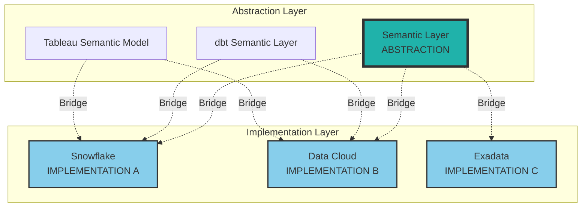

### Real Data Example

**Business User Query (Abstraction):**
```
"Show me Sales Velocity for the Technology industry"
```

**Semantic Layer Definition (Abstraction):**
```json
{
  "metricName": "Sales Velocity",
  "businessDefinition": "Average daily revenue from closed-won opportunities",
  "formula": "SUM(Opportunity.Amount) / AVG(Days_To_Close)",
  "dimensions": ["Industry", "Region", "Product"],
  "filters": {
    "Stage": "Closed Won",
    "CloseDate": "Last 90 days"
  }
}
```

**Implementation A: Snowflake Query**
```sql
-- When data is in Snowflake (Implementation A)
SELECT 
    a.industry,
    SUM(o.amount) / AVG(DATEDIFF('day', o.created_date, o.close_date)) as sales_velocity
FROM snowflake.prod.opportunities o
JOIN snowflake.prod.accounts a ON o.account_id = a.id
WHERE o.stage_name = 'Closed Won'
  AND o.close_date >= DATEADD('day', -90, CURRENT_DATE())
GROUP BY a.industry;
```

**Result from Snowflake:**
```json
{
  "query": "Sales Velocity",
  "source": "Snowflake",
  "data": [
    {
      "Industry": "Technology",
      "SalesVelocity": 125000.00,
      "OpportunitiesCount": 45,
      "AvgDaysToClose": 28
    }
  ],
  "executionTime": "1.2s"
}
```

**Implementation B: Data Cloud Query**
```sql
-- When data is in Data Cloud (Implementation B)
SELECT 
    account.Industry__c,
    SUM(opportunity.Amount) / AVG(DAYS_BETWEEN(opportunity.CreatedDate, opportunity.CloseDate)) as sales_velocity
FROM DataCloud.Opportunity__dmo opportunity
JOIN DataCloud.Account__dmo account ON opportunity.AccountId = account.Id
WHERE opportunity.StageName = 'Closed Won'
  AND opportunity.CloseDate >= DATEADD(DAY, -90, TODAY())
GROUP BY account.Industry__c;
```

**Result from Data Cloud:**
```json
{
  "query": "Sales Velocity",
  "source": "Data Cloud",
  "data": [
    {
      "Industry": "Technology",
      "SalesVelocity": 125000.00,
      "OpportunitiesCount": 45,
      "AvgDaysToClose": 28
    }
  ],
  "executionTime": "0.8s"
}
```

**Implementation C: Exadata Query**
```sql
-- When data is in Exadata (Implementation C)
SELECT 
    a.industry_name,
    SUM(o.opportunity_amount) / AVG(o.close_date - o.create_date) as sales_velocity
FROM exadata.opportunities o
INNER JOIN exadata.accounts a ON o.account_fk = a.account_pk
WHERE o.stage_code = 'CLOSED_WON'
  AND o.close_date >= ADD_MONTHS(SYSDATE, -3)
GROUP BY a.industry_name;
```

### Key Benefit: Implementation Independence

**Business User Experience (Same regardless of backend):**

```
User Query: "Show Sales Velocity for Technology"
        ↓
Semantic Layer (Abstraction)
        ↓
    [BRIDGE]
        ↓
Implementation selected based on:
- Data location
- Performance requirements
- Cost optimization
        ↓
Result: $125,000/day
```

**User doesn't know or care:**
- Where data is stored (Snowflake vs Data Cloud vs Exadata)
- What query language is used (SQL dialects differ)
- How joins are structured (different schemas)

### Real Migration Scenario (Bridge Pattern Value)

**FY2024: Data in Snowflake**
```
Semantic Layer → Snowflake
All queries go to Snowflake
```

**FY2027: Migration in Progress**
```
Semantic Layer → 70% Snowflake, 30% Data Cloud
Bridge pattern routes queries to appropriate platform
```

**FY2031: Fully on Data Cloud**
```
Semantic Layer → Data Cloud
All queries go to Data Cloud
```

**Critical Point:** 
```
Business reports/dashboards: NO CHANGES NEEDED
Only the implementation (backend) changed
Abstraction (Semantic Layer) remained stable
```

### Another Bridge Example: dbt Semantic Layer

**Abstraction: dbt Metric Definition**

```yaml
# dbt_project.yml
metrics:
  - name: customer_lifetime_value
    label: Customer Lifetime Value
    model: ref('transactions')
    description: "Total revenue from a customer"
    calculation_method: sum
    expression: amount
    timestamp: transaction_date
    time_grains: [day, week, month, quarter, year]
    dimensions:
      - industry
      - region
      - customer_segment
```

**Implementation A: Calculated from Snowflake**
```sql
-- Generated SQL for Snowflake
SELECT 
    customer_id,
    industry,
    region,
    SUM(amount) as customer_lifetime_value
FROM snowflake.analytics.transactions
GROUP BY customer_id, industry, region;
```

**Implementation B: Calculated from Data Cloud**
```sql
-- Generated SQL for Data Cloud
SELECT 
    IndividualId,
    Industry__c,
    Region__c,
    SUM(Amount) as customer_lifetime_value
FROM DataCloud.Transaction__dmo
GROUP BY IndividualId, Industry__c, Region__c;
```

**API Response (Same regardless of implementation):**
```json
{
  "metric": "customer_lifetime_value",
  "value": 135000.00,
  "dimensions": {
    "industry": "Technology",
    "region": "North America",
    "customer_segment": "Enterprise"
  },
  "period": "All Time",
  "last_updated": "2025-10-23T14:30:00Z"
}
```

---

## 12. TEMPLATE METHOD PATTERN

### Real Implementation in Architecture
**Location:** Data Ingestion Pipeline (ETL Workflow)

### Mermaid Diagram

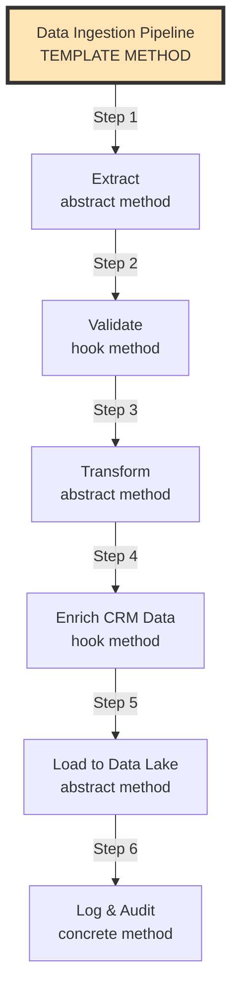

### Real Data Example

**Template: Standard Data Ingestion Process**

```python
# Abstract Template Class
class DataIngestionTemplate:
    def ingest_data(self):
        """Template Method - defines skeleton"""
        # Step 1: Extract (abstract - must implement)
        raw_data = self.extract()
        
        # Step 2: Validate (hook - can override)
        if self.should_validate():
            validated_data = self.validate(raw_data)
        else:
            validated_data = raw_data
        
        # Step 3: Transform (abstract - must implement)
        transformed_data = self.transform(validated_data)
        
        # Step 4: Enrich (hook - can override)
        if self.should_enrich():
            enriched_data = self.enrich_crm(transformed_data)
        else:
            enriched_data = transformed_data
        
        # Step 5: Load (abstract - must implement)
        result = self.load(enriched_data)
        
        # Step 6: Log (concrete - always executes)
        self.log_and_audit(result)
        
        return result
    
    # Abstract methods (must be implemented by subclass)
    def extract(self):
        raise NotImplementedError
    
    def transform(self, data):
        raise NotImplementedError
    
    def load(self, data):
        raise NotImplementedError
    
    # Hook methods (can be overridden)
    def should_validate(self):
        return True
    
    def validate(self, data):
        return data  # Default: no-op
    
    def should_enrich(self):
        return True
    
    def enrich_crm(self, data):
        return data  # Default: no-op
    
    # Concrete method (same for all)
    def log_and_audit(self, result):
        """Always logs to Splunk"""
        log_entry = {
            "timestamp": datetime.now(),
            "pipeline": self.__class__.__name__,
            "records_processed": len(result),
            "status": "Success"
        }
        send_to_splunk(log_entry)
```

### Concrete Implementation 1: Snowflake Transaction Ingestion

```python
class SnowflakeTransactionIngestion(DataIngestionTemplate):
    def extract(self):
        """Step 1: Extract from Snowflake"""
        query = """
        SELECT 
            txn_id,
            cust_id,
            amount,
            txn_date,
            product_code
        FROM snowflake.prod.transactions
        WHERE txn_date = CURRENT_DATE - 1
        """
        result = snowflake_connection.execute(query)
        
        return [
            {
                "txn_id": "TXN-98765",
                "cust_id": "CUST-12345",
                "amount": 50000.00,
                "txn_date": "2025-10-22",
                "product_code": "ENT-LIC-100"
            },
            {
                "txn_id": "TXN-98766",
                "cust_id": "CUST-67890",
                "amount": 25000.00,
                "txn_date": "2025-10-22",
                "product_code": "PRO-LIC-50"
            }
        ]
    
    def validate(self, data):
        """Step 2: Validate transaction data"""
        validated = []
        for record in data:
            if record["amount"] > 0 and record["cust_id"]:
                record["_validation_status"] = "Valid"
                validated.append(record)
            else:
                record["_validation_status"] = "Invalid"
                # Log but don't include
                log_invalid_record(record)
        return validated
    
    def transform(self, data):
        """Step 3: Transform to Data Cloud schema"""
        transformed = []
        for record in data:
            transformed.append({
                "TransactionId": record["txn_id"],
                "CustomerId": record["cust_id"],
                "Amount": record["amount"],
                "TransactionDate": f"{record['txn_date']}T00:00:00Z",
                "ProductCode": record["product_code"],
                "_sourceSystem": "Snowflake"
            })
        return transformed
    
    def enrich_crm(self, data):
        """Step 4: Enrich with CRM data"""
        enriched = []
        for record in data:
            # Look up customer in Data Cloud
            unified_profile = get_unified_profile(record["CustomerId"])
            
            record["IndividualId"] = unified_profile["UnifiedIndividualId"]
            record["AccountId"] = unified_profile["UnifiedAccountId"]
            record["AccountName"] = unified_profile["AccountName"]
            record["Industry"] = unified_profile["Industry"]
            enriched.append(record)
        
        return enriched
    
    def load(self, data):
        """Step 5: Load to Data Cloud"""
        result = []
        for record in data:
            inserted = data_cloud_api.insert(
                object="Transaction__dmo",
                data=record
            )
            result.append(inserted)
        return result
```

**Execution Flow:**

```json
{
  "pipeline": "SnowflakeTransactionIngestion",
  "execution": {
    "step1_extract": {
      "status": "Success",
      "records_extracted": 2,
      "source": "Snowflake",
      "query_time": "1.2s"
    },
    "step2_validate": {
      "status": "Success",
      "records_validated": 2,
      "records_invalid": 0
    },
    "step3_transform": {
      "status": "Success",
      "records_transformed": 2,
      "transformation_rules": 5
    },
    "step4_enrich": {
      "status": "Success",
      "records_enriched": 2,
      "crm_lookups": 2,
      "enrichment_fields_added": 4
    },
    "step5_load": {
      "status": "Success",
      "records_loaded": 2,
      "destination": "DataCloud.Transaction__dmo"
    },
    "step6_log": {
      "status": "Success",
      "logged_to": "Splunk Enterprise"
    }
  },
  "totalTime": "3.8s"
}
```

### Concrete Implementation 2: Web SDK Event Ingestion

```python
class WebSDKEventIngestion(DataIngestionTemplate):
    def extract(self):
        """Step 1: Extract from Web SDK stream"""
        events = web_sdk_stream.poll(batch_size=100)
        
        return [
            {
                "event_type": "ProductView",
                "timestamp": "2025-10-23T14:30:00.123Z",
                "user_id": "USER-789",
                "product_id": "PROD-456",
                "session_id": "SESS-ABC123"
            },
            {
                "event_type": "AddToCart",
                "timestamp": "2025-10-23T14:31:00.456Z",
                "user_id": "USER-789",
                "product_id": "PROD-456",
                "session_id": "SESS-ABC123",
                "quantity": 1
            }
        ]
    
    def should_validate(self):
        """Skip validation for real-time events"""
        return False
    
    def transform(self, data):
        """Step 3: Transform to Data Cloud schema"""
        transformed = []
        for event in data:
            transformed.append({
                "EventType": event["event_type"],
                "Timestamp": event["timestamp"],
                "UserId": event["user_id"],
                "ProductId": event.get("product_id"),
                "SessionId": event["session_id"],
                "Quantity": event.get("quantity"),
                "_sourceSystem": "Web SDK"
            })
        return transformed
    
    def should_enrich(self):
        """Skip CRM enrichment for real-time (do later)"""
        return False
    
    def load(self, data):
        """Step 5: Load to Data Cloud streaming"""
        result = []
        for event in data:
            inserted = data_cloud_streaming_api.insert(
                object="WebEvent__dmo",
                data=event
            )
            result.append(inserted)
        return result
```

**Execution Flow (Faster - skips some steps):**

```json
{
  "pipeline": "WebSDKEventIngestion",
  "execution": {
    "step1_extract": {
      "status": "Success",
      "events_extracted": 2,
      "source": "Web SDK Stream"
    },
    "step2_validate": {
      "status": "Skipped",
      "reason": "Real-time events"
    },
    "step3_transform": {
      "status": "Success",
      "events_transformed": 2
    },
    "step4_enrich": {
      "status": "Skipped",
      "reason": "Enrichment done async"
    },
    "step5_load": {
      "status": "Success",
      "events_loaded": 2,
      "destination": "DataCloud.WebEvent__dmo"
    },
    "step6_log": {
      "status": "Success",
      "logged_to": "Splunk Enterprise"
    }
  },
  "totalTime": "0.3s"
}
```

### Concrete Implementation 3: Marketing S3 Batch Ingestion

```python
class MarketingS3BatchIngestion(DataIngestionTemplate):
    def extract(self):
        """Step 1: Extract from S3"""
        s3_file = "s3://marketing-data/campaigns/2025-10-22/engagement.json"
        data = s3.get_object(Bucket="marketing-data", Key=s3_file)
        
        return json.loads(data["Body"].read())
    
    def validate(self, data):
        """Step 2: Validate campaign data"""
        validated = []
        for record in data:
            # Check required fields
            if all(k in record for k in ["subscriber_id", "campaign_id", "event_type"]):
                record["_validation_status"] = "Valid"
                validated.append(record)
        return validated
    
    def transform(self, data):
        """Step 3: Transform to Data Cloud schema"""
        transformed = []
        for record in data:
            transformed.append({
                "SubscriberId": record["subscriber_id"],
                "CampaignId": record["campaign_id"],
                "EventType": record["event_type"],
                "Timestamp": record["timestamp"],
                "EmailSubject": record.get("email_subject"),
                "_sourceSystem": "Marketing Cloud"
            })
        return transformed
    
    def enrich_crm(self, data):
        """Step 4: Match subscribers to unified profiles"""
        enriched = []
        for record in data:
            # Match subscriber to individual
            match = match_subscriber_to_individual(record["SubscriberId"])
            
            record["IndividualId"] = match["UnifiedIndividualId"]
            record["AccountId"] = match.get("UnifiedAccountId")
            enriched.append(record)
        
        return enriched
    
    def load(self, data):
        """Step 5: Bulk load to Data Cloud"""
        bulk_result = data_cloud_bulk_api.insert(
            object="CampaignEngagement__dmo",
            records=data
        )
        return bulk_result
```

### Template Method Benefits

**1. Consistent Process:**
```
All ingestion pipelines follow same steps
Ensures quality and auditability
```

**2. Flexibility:**
```
Each implementation can customize:
- How to extract (different sources)
- How to transform (different schemas)
- Whether to validate (based on speed needs)
- Whether to enrich (based on use case)
```

**3. Code Reuse:**
```
Logging (Step 6) is same for all
No need to reimplement in each pipeline
```

**4. Easy to Add New Pipelines:**
```
New source system?
- Extend DataIngestionTemplate
- Implement 3 abstract methods
- Override hooks if needed
- Done!
```

### Apache Airflow DAG (Template Method)

```python
# Airflow DAG using Template Method pattern
from airflow import DAG
from datetime import datetime

dag = DAG(
    'snowflake_transaction_ingestion',
    start_date=datetime(2025, 10, 1),
    schedule_interval='@daily'
)

# Each task is a step in the template
extract_task = PythonOperator(
    task_id='extract',
    python_callable=extract_from_snowflake,
    dag=dag
)

validate_task = PythonOperator(
    task_id='validate',
    python_callable=validate_data,
    dag=dag
)

transform_task = PythonOperator(
    task_id='transform',
    python_callable=transform_to_schema,
    dag=dag
)

enrich_task = PythonOperator(
    task_id='enrich_crm',
    python_callable=enrich_with_crm,
    dag=dag
)

load_task = PythonOperator(
    task_id='load',
    python_callable=load_to_datacloud,
    dag=dag
)

log_task = PythonOperator(
    task_id='log_audit',
    python_callable=log_to_splunk,
    dag=dag
)

# Define template flow
extract_task >> validate_task >> transform_task >> enrich_task >> load_task >> log_task
```

---

## 13. CHAIN OF RESPONSIBILITY PATTERN

### Real Implementation in Architecture
**Location:** Data Quality Pipeline (Ataccama → Monte Carlo → Lego Data Quality)

### Mermaid Diagram

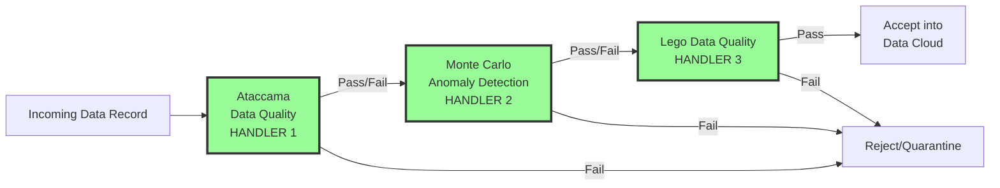

### Real Data Example

**Incoming Transaction Record:**

```json
{
  "transactionId": "TXN-98765",
  "customerId": "CUST-12345",
  "amount": 50000.00,
  "date": "2025-10-23",
  "productCode": "ENT-LIC-100",
  "source": "Snowflake",
  "_ingestionTimestamp": "2025-10-23T14:30:00Z"
}
```

### Handler 1: Ataccama Data Quality

**Responsibility: Field-level validation**

```python
class AtaccamaHandler:
    def handle(self, record):
        """Validate field-level quality"""
        issues = []
        
        # Check 1: Required fields present
        required_fields = ["transactionId", "customerId", "amount", "date"]
        for field in required_fields:
            if field not in record or record[field] is None:
                issues.append({
                    "handler": "Ataccama",
                    "check": "Required Field",
                    "field": field,
                    "severity": "Critical",
                    "status": "Fail"
                })
        
        # Check 2: Data type validation
        if not isinstance(record["amount"], (int, float)):
            issues.append({
                "handler": "Ataccama",
                "check": "Data Type",
                "field": "amount",
                "severity": "Critical",
                "status": "Fail"
            })
        
        # Check 3: Amount range validation
        if record["amount"] < 0:
            issues.append({
                "handler": "Ataccama",
                "check": "Business Rule",
                "field": "amount",
                "message": "Amount cannot be negative",
                "severity": "Critical",
                "status": "Fail"
            })
        
        # Check 4: Date format validation
        try:
            datetime.strptime(record["date"], "%Y-%m-%d")
        except:
            issues.append({
                "handler": "Ataccama",
                "check": "Date Format",
                "field": "date",
                "severity": "Critical",
                "status": "Fail"
            })
        
        # Decision
        if issues:
            record["_ataccamaQuality"] = {
                "status": "Fail",
                "issues": issues,
                "timestamp": "2025-10-23T14:30:01Z"
            }
            return "REJECT", record
        else:
            record["_ataccamaQuality"] = {
                "status": "Pass",
                "checks": 4,
                "timestamp": "2025-10-23T14:30:01Z"
            }
            return "PASS", record
```

**Result:**
```json
{
  "transactionId": "TXN-98765",
  "customerId": "CUST-12345",
  "amount": 50000.00,
  "date": "2025-10-23",
  "productCode": "ENT-LIC-100",
  "source": "Snowflake",
  "_ingestionTimestamp": "2025-10-23T14:30:00Z",
  
  "_ataccamaQuality": {
    "status": "Pass",
    "checks": 4,
    "timestamp": "2025-10-23T14:30:01Z"
  }
}
```

### Handler 2: Monte Carlo (Anomaly Detection)

**Responsibility: Statistical anomaly detection**

```python
class MonteCarloHandler:
    def handle(self, record):
        """Detect anomalies using statistical analysis"""
        issues = []
        
        # Check 1: Amount anomaly (compared to historical data)
        historical_avg = get_avg_transaction_amount(record["customerId"])
        # Historical avg: $3,000
        # Current transaction: $50,000
        
        if record["amount"] > historical_avg * 10:
            issues.append({
                "handler": "Monte Carlo",
                "check": "Statistical Anomaly",
                "field": "amount",
                "message": f"Amount ${record['amount']} is 16.7x the historical average ${historical_avg}",
                "severity": "Warning",
                "status": "Anomaly Detected"
            })
        
        # Check 2: Freshness check
        ingestion_time = datetime.fromisoformat(record["_ingestionTimestamp"])
        transaction_time = datetime.fromisoformat(record["date"])
        age_hours = (ingestion_time - transaction_time).total_seconds() / 3600
        
        if age_hours > 48:
            issues.append({
                "handler": "Monte Carlo",
                "check": "Data Freshness",
                "message": f"Data is {age_hours} hours old",
                "severity": "Warning",
                "status": "Stale Data"
            })
        
        # Check 3: Schema drift detection
        expected_fields = ["transactionId", "customerId", "amount", "date", "productCode"]
        actual_fields = [k for k in record.keys() if not k.startswith("_")]
        
        if set(actual_fields) != set(expected_fields):
            issues.append({
                "handler": "Monte Carlo",
                "check": "Schema Drift",
                "expected": expected_fields,
                "actual": actual_fields,
                "severity": "Warning"
            })
        
        # Decision (warnings don't block, but log)
        record["_monteCarloQuality"] = {
            "status": "Pass with Warnings" if issues else "Pass",
            "issues": issues if issues else [],
            "checks": 3,
            "timestamp": "2025-10-23T14:30:02Z"
        }
        
        return "PASS", record  # Pass to next handler even with warnings
```

**Result:**
```json
{
  "transactionId": "TXN-98765",
  "customerId": "CUST-12345",
  "amount": 50000.00,
  "date": "2025-10-23",
  "productCode": "ENT-LIC-100",
  "source": "Snowflake",
  "_ingestionTimestamp": "2025-10-23T14:30:00Z",
  
  "_ataccamaQuality": {
    "status": "Pass",
    "checks": 4,
    "timestamp": "2025-10-23T14:30:01Z"
  },
  
  "_monteCarloQuality": {
    "status": "Pass with Warnings",
    "issues": [
      {
        "handler": "Monte Carlo",
        "check": "Statistical Anomaly",
        "field": "amount",
        "message": "Amount $50000.0 is 16.7x the historical average $3000.0",
        "severity": "Warning",
        "status": "Anomaly Detected"
      }
    ],
    "checks": 3,
    "timestamp": "2025-10-23T14:30:02Z"
  }
}
```

### Handler 3: Lego Data Quality

**Responsibility: Business logic validation**

```python
class LegoDataQualityHandler:
    def handle(self, record):
        """Validate business rules"""
        issues = []
        
        # Check 1: Customer exists and is active
        customer = lookup_customer(record["customerId"])
        if not customer:
            issues.append({
                "handler": "Lego Data Quality",
                "check": "Customer Validation",
                "field": "customerId",
                "message": "Customer not found",
                "severity": "Critical",
                "status": "Fail"
            })
        elif customer["status"] != "Active":
            issues.append({
                "handler": "Lego Data Quality",
                "check": "Customer Status",
                "field": "customerId",
                "message": f"Customer status is {customer['status']}, not Active",
                "severity": "Warning"
            })
        
        # Check 2: Product code is valid
        product = lookup_product(record["productCode"])
        if not product:
            issues.append({
                "handler": "Lego Data Quality",
                "check": "Product Validation",
                "field": "productCode",
                "message": "Invalid product code",
                "severity": "Critical",
                "status": "Fail"
            })
        
        # Check 3: Amount matches product price range
        if product and not (product["minPrice"] <= record["amount"] <= product["maxPrice"]):
            issues.append({
                "handler": "Lego Data Quality",
                "check": "Price Range",
                "field": "amount",
                "message": f"Amount ${record['amount']} outside product range ${product['minPrice']}-${product['maxPrice']}",
                "severity": "Warning"
            })
        
        # Decision
        critical_issues = [i for i in issues if i.get("severity") == "Critical"]
        
        if critical_issues:
            record["_legoQuality"] = {
                "status": "Fail",
                "issues": issues,
                "timestamp": "2025-10-23T14:30:03Z"
            }
            return "REJECT", record
        else:
            record["_legoQuality"] = {
                "status": "Pass with Warnings" if issues else "Pass",
                "issues": issues if issues else [],
                "checks": 3,
                "timestamp": "2025-10-23T14:30:03Z"
            }
            return "PASS", record
```

**Result (All Handlers Passed):**
```json
{
  "transactionId": "TXN-98765",
  "customerId": "CUST-12345",
  "amount": 50000.00,
  "date": "2025-10-23",
  "productCode": "ENT-LIC-100",
  "source": "Snowflake",
  "_ingestionTimestamp": "2025-10-23T14:30:00Z",
  
  "_ataccamaQuality": {
    "status": "Pass",
    "checks": 4,
    "timestamp": "2025-10-23T14:30:01Z"
  },
  
  "_monteCarloQuality": {
    "status": "Pass with Warnings",
    "issues": [
      {
        "handler": "Monte Carlo",
        "check": "Statistical Anomaly",
        "field": "amount",
        "message": "Amount $50000.0 is 16.7x the historical average $3000.0",
        "severity": "Warning",
        "status": "Anomaly Detected"
      }
    ],
    "checks": 3,
    "timestamp": "2025-10-23T14:30:02Z"
  },
  
  "_legoQuality": {
    "status": "Pass",
    "checks": 3,
    "timestamp": "2025-10-23T14:30:03Z"
  },
  
  "_finalQualityStatus": {
    "overallStatus": "Accepted with Warnings",
    "totalChecks": 10,
    "criticalIssues": 0,
    "warnings": 1,
    "destination": "DataCloud.Transaction__dmo",
    "finalTimestamp": "2025-10-23T14:30:03Z"
  }
}
```

### Chain Execution Flow

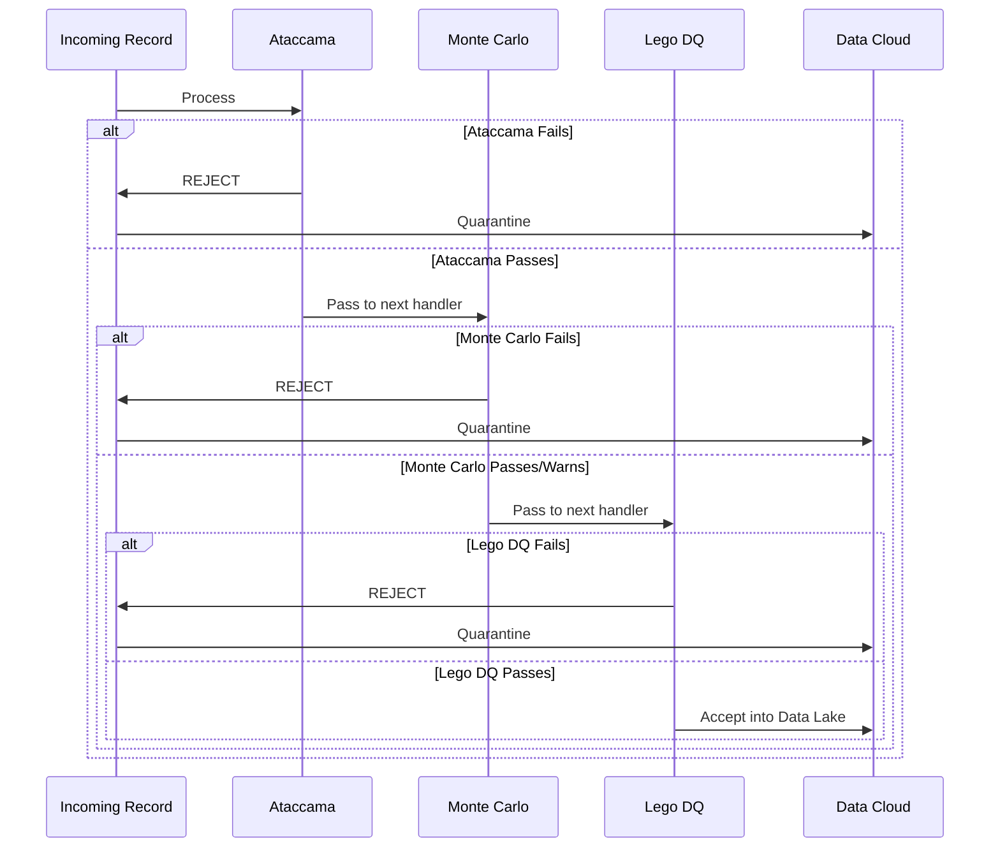

### Example: Record Rejected by Handler 2

**Incoming Record (Bad Data):**
```json
{
  "transactionId": "TXN-99999",
  "customerId": "CUST-99999",
  "amount": 9999999.00,
  "date": "2025-10-23",
  "productCode": "INVALID",
  "source": "Snowflake"
}
```

**Handler 1 (Ataccama): Pass**
```json
{
  "_ataccamaQuality": {
    "status": "Pass",
    "checks": 4
  }
}
```

**Handler 2 (Monte Carlo): REJECT**
```json
{
  "_monteCarloQuality": {
    "status": "Fail",
    "issues": [
      {
        "handler": "Monte Carlo",
        "check": "Statistical Anomaly",
        "field": "amount",
        "message": "Amount $9999999.0 is 3333x the historical average - likely data error",
        "severity": "Critical",
        "status": "Fail"
      }
    ]
  }
}
```

**Result: Record quarantined, never reaches Handler 3**

```json
{
  "transactionId": "TXN-99999",
  "status": "Quarantined",
  "reason": "Failed Monte Carlo anomaly detection",
  "failedAt": "Handler 2 of 3",
  "quarantineLocation": "DataCloud.DataQuality_Quarantine__c",
  "requiresManualReview": true
}
```

---

## 14. COMMAND PATTERN

### Real Implementation in Architecture
**Location:** Data Actions (Executable Commands triggered by conditions)

### Mermaid Diagram

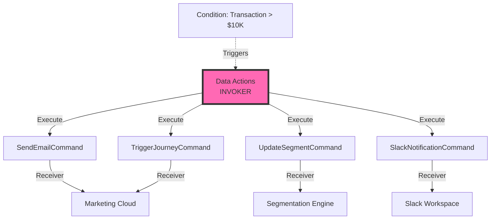

### Real Data Example

**Trigger Event: High-Value Transaction**

```json
{
  "eventType": "Transaction.Created",
  "transactionId": "TXN-98765",
  "amount": 50000.00,
  "customerId": "CUST-12345",
  "individualId": "IND-UNIFIED-001",
  "timestamp": "2025-10-23T14:30:00Z"
}
```

**Condition Check:**
```
IF Transaction.Amount > 10000 THEN
    Execute Data Actions
END IF

Result: TRUE (50000 > 10000)
```

### Command 1: SendEmailCommand

**Command Definition:**
```json
{
  "commandId": "CMD-EMAIL-001",
  "commandType": "SendEmail",
  "name": "High Value Transaction Alert",
  "condition": "Transaction.Amount > 10000",
  "receiver": "Marketing Cloud",
  "parameters": {
    "emailTemplateId": "VIP-PURCHASE-ALERT",
    "recipientType": "AccountOwner",
    "priority": "High"
  }
}
```

**Command Execution:**
```python
class SendEmailCommand:
    def __init__(self, transaction, email_params):
        self.transaction = transaction
        self.email_params = email_params
        self.receiver = MarketingCloudAPI()
    
    def execute(self):
        """Execute the email command"""
        # Get recipient details
        individual = get_unified_profile(self.transaction["individualId"])
        account_owner = get_account_owner(individual["accountId"])
        
        # Prepare email payload
        email_payload = {
            "templateId": self.email_params["emailTemplateId"],
            "to": account_owner["email"],
            "subject": "🎉 High-Value Transaction Alert",
            "variables": {
                "customerName": individual["name"],
                "transactionAmount": f"${self.transaction['amount']:,.2f}",
                "transactionDate": self.transaction["timestamp"],
                "accountName": individual["accountName"],
                "nextSteps": "Review upsell opportunities"
            },
            "priority": self.email_params["priority"]
        }
        
        # Send via Marketing Cloud
        result = self.receiver.send_email(email_payload)
        
        # Log execution
        log_entry = {
            "commandId": "CMD-EMAIL-001",
            "commandType": "SendEmail",
            "executedAt": datetime.now(),
            "transactionId": self.transaction["transactionId"],
            "recipient": account_owner["email"],
            "status": "Sent" if result.success else "Failed",
            "messageId": result.message_id
        }
        
        return log_entry
    
    def undo(self):
        """Undo not applicable for emails"""
        pass
```

**Command Result:**
```json
{
  "commandId": "CMD-EMAIL-001",
  "commandType": "SendEmail",
  "status": "Executed",
  "executedAt": "2025-10-23T14:30:05Z",
  "result": {
    "emailSent": true,
    "messageId": "MSG-ABCD1234",
    "recipient": "john.doe@company.com",
    "subject": "🎉 High-Value Transaction Alert",
    "templateUsed": "VIP-PURCHASE-ALERT"
  }
}
```

**Actual Email Content:**
```
To: john.doe@company.com
From: alerts@acme.com
Subject: 🎉 High-Value Transaction Alert

Hi John,

Great news! Your customer Jane Austin from Acme Corporation just completed a high-value transaction.

Transaction Details:
- Amount: $50,000.00
- Date: October 23, 2025 at 2:30 PM
- Customer: Jane Austin (CTO)
- Account: Acme Corporation

Recommended Actions:
✓ Review upsell opportunities
✓ Schedule executive check-in
✓ Ensure customer success engagement

View full details in Salesforce CRM.

Best regards,
Customer Success Team
```

### Command 2: TriggerJourneyCommand

**Command Definition:**
```json
{
  "commandId": "CMD-JOURNEY-002",
  "commandType": "TriggerJourney",
  "name": "Enroll in VIP Customer Journey",
  "condition": "Transaction.Amount > 10000",
  "receiver": "Marketing Cloud",
  "parameters": {
    "journeyId": "VIP-ONBOARDING-001",
    "action": "Enroll",
    "entrySource": "Data Cloud - High Value Purchase"
  }
}
```

**Command Execution:**
```python
class TriggerJourneyCommand:
    def __init__(self, transaction, journey_params):
        self.transaction = transaction
        self.journey_params = journey_params
        self.receiver = MarketingCloudAPI()
    
    def execute(self):
        """Enroll customer in journey"""
        # Get customer details
        individual = get_unified_profile(self.transaction["individualId"])
        
        # Prepare journey enrollment
        journey_payload = {
            "journeyId": self.journey_params["journeyId"],
            "action": self.journey_params["action"],
            "contactKey": individual["email"],
            "entrySource": self.journey_params["entrySource"],
            "attributes": {
                "firstName": individual["firstName"],
                "lastName": individual["lastName"],
                "email": individual["email"],
                "transactionAmount": self.transaction["amount"],
                "transactionDate": self.transaction["timestamp"],
                "accountName": individual["accountName"],
                "lifetimeValue": individual["lifetimeValue"]
            }
        }
        
        # Enroll in journey
        result = self.receiver.enroll_in_journey(journey_payload)
        
        # Log execution
        log_entry = {
            "commandId": "CMD-JOURNEY-002",
            "commandType": "TriggerJourney",
            "executedAt": datetime.now(),
            "transactionId": self.transaction["transactionId"],
            "journeyId": self.journey_params["journeyId"],
            "contactKey": individual["email"],
            "status": "Enrolled" if result.success else "Failed"
        }
        
        return log_entry
    
    def undo(self):
        """Remove from journey"""
        individual = get_unified_profile(self.transaction["individualId"])
        self.receiver.exit_journey(
            journeyId=self.journey_params["journeyId"],
            contactKey=individual["email"]
        )
```

**Command Result:**
```json
{
  "commandId": "CMD-JOURNEY-002",
  "commandType": "TriggerJourney",
  "status": "Executed",
  "executedAt": "2025-10-23T14:30:06Z",
  "result": {
    "journeyEnrolled": true,
    "journeyId": "VIP-ONBOARDING-001",
    "journeyName": "VIP Customer Onboarding",
    "contactKey": "jane.austin@acme.com",
    "entrySource": "Data Cloud - High Value Purchase",
    "estimatedFirstEmail": "2025-10-23T15:00:00Z"
  }
}
```

### Command 3: SlackNotificationCommand

**Command Definition:**
```json
{
  "commandId": "CMD-SLACK-003",
  "commandType": "SlackNotification",
  "name": "Notify Sales Team in Slack",
  "condition": "Transaction.Amount > 10000",
  "receiver": "Slack Workspace",
  "parameters": {
    "channel": "#high-value-sales",
    "messageTemplate": "high-value-transaction-alert",
    "mentionAccountOwner": true
  }
}
```

**Command Execution:**
```python
class SlackNotificationCommand:
    def __init__(self, transaction, slack_params):
        self.transaction = transaction
        self.slack_params = slack_params
        self.receiver = SlackAPI()
    
    def execute(self):
        """Send Slack notification"""
        # Get details
        individual = get_unified_profile(self.transaction["individualId"])
        account_owner = get_account_owner(individual["accountId"])
        
        # Build Slack message
        message = {
            "channel": self.slack_params["channel"],
            "blocks": [
                {
                    "type": "header",
                    "text": {
                        "type": "plain_text",
                        "text": "🎉 High-Value Transaction Alert!"
                    }
                },
                {
                    "type": "section",
                    "fields": [
                        {
                            "type": "mrkdwn",
                            "text": f"*Customer:*\n{individual['name']}"
                        },
                        {
                            "type": "mrkdwn",
                            "text": f"*Account:*\n{individual['accountName']}"
                        },
                        {
                            "type": "mrkdwn",
                            "text": f"*Amount:*\n${self.transaction['amount']:,.2f}"
                        },
                        {
                            "type": "mrkdwn",
                            "text": f"*Account Owner:*\n<@{account_owner['slackUserId']}>"
                        }
                    ]
                },
                {
                    "type": "section",
                    "text": {
                        "type": "mrkdwn",
                        "text": "*Recommended Actions:*\n✓ Review upsell opportunities\n✓ Schedule executive check-in"
                    }
                },
                {
                    "type": "actions",
                    "elements": [
                        {
                            "type": "button",
                            "text": {"type": "plain_text", "text": "View in Salesforce"},
                            "url": f"https://acme.salesforce.com/Account/{individual['accountId']}"
                        }
                    ]
                }
            ]
        }
        
        # Send to Slack
        result = self.receiver.post_message(message)
        
        return {
            "commandId": "CMD-SLACK-003",
            "commandType": "SlackNotification",
            "executedAt": datetime.now(),
            "status": "Sent" if result.success else "Failed",
            "channel": self.slack_params["channel"],
            "messageTimestamp": result.ts
        }
```

**Command Result:**
```json
{
  "commandId": "CMD-SLACK-003",
  "commandType": "SlackNotification",
  "status": "Executed",
  "executedAt": "2025-10-23T14:30:07Z",
  "result": {
    "messageSent": true,
    "channel": "#high-value-sales",
    "messageTimestamp": "1729694407.123456",
    "permalink": "https://acme.slack.com/archives/C123/p1729694407123456"
  }
}
```

### Command 4: UpdateSegmentCommand

**Command Definition:**
```json
{
  "commandId": "CMD-SEGMENT-004",
  "commandType": "UpdateSegment",
  "name": "Add to High-Value Customer Segment",
  "condition": "Transaction.Amount > 10000 AND LifetimeValue > 100000",
  "receiver": "Segmentation Engine",
  "parameters": {
    "segmentId": "SEG-HIGH-VALUE-001",
    "action": "Add"
  }
}
```

**Command Execution:**
```python
class UpdateSegmentCommand:
    def __init__(self, transaction, segment_params):
        self.transaction = transaction
        self.segment_params = segment_params
        self.receiver = SegmentationEngine()
    
    def execute(self):
        """Add individual to segment"""
        individual = get_unified_profile(self.transaction["individualId"])
        
        # Check condition
        if individual["lifetimeValue"] > 100000:
            result = self.receiver.add_to_segment(
                segmentId=self.segment_params["segmentId"],
                individualId=self.transaction["individualId"]
            )
            
            return {
                "commandId": "CMD-SEGMENT-004",
                "commandType": "UpdateSegment",
                "executedAt": datetime.now(),
                "status": "Added",
                "segmentId": self.segment_params["segmentId"],
                "individualId": self.transaction["individualId"],
                "lifetimeValue": individual["lifetimeValue"]
            }
        else:
            return {
                "commandId": "CMD-SEGMENT-004",
                "status": "Skipped",
                "reason": "Lifetime Value not met threshold"
            }
```

**Command Result:**
```json
{
  "commandId": "CMD-SEGMENT-004",
  "commandType": "UpdateSegment",
  "status": "Executed",
  "executedAt": "2025-10-23T14:30:08Z",
  "result": {
    "segmentUpdated": true,
    "segmentId": "SEG-HIGH-VALUE-001",
    "segmentName": "High-Value Customers",
    "individualId": "IND-UNIFIED-001",
    "action": "Add",
    "lifetimeValue": 135000.00,
    "memberCount": 247
  }
}
```

### Data Actions Invoker (Orchestrator)

```python
class DataActionsInvoker:
    def __init__(self):
        self.commands = []
        self.execution_log = []
    
    def register_command(self, command):
        """Register a command to be executed"""
        self.commands.append(command)
    
    def execute_all(self, transaction):
        """Execute all registered commands"""
        results = []
        
        for command in self.commands:
            try:
                result = command.execute()
                self.execution_log.append(result)
                results.append(result)
            except Exception as e:
                error_log = {
                    "commandId": command.commandId,
                    "status": "Failed",
                    "error": str(e),
                    "timestamp": datetime.now()
                }
                self.execution_log.append(error_log)
                results.append(error_log)
        
        return results
    
    def undo_last(self):
        """Undo last command (if supported)"""
        if self.commands:
            last_command = self.commands[-1]
            last_command.undo()

# Usage
invoker = DataActionsInvoker()
invoker.register_command(SendEmailCommand(transaction, email_params))
invoker.register_command(TriggerJourneyCommand(transaction, journey_params))
invoker.register_command(SlackNotificationCommand(transaction, slack_params))
invoker.register_command(UpdateSegmentCommand(transaction, segment_params))

results = invoker.execute_all(transaction)
```

### Complete Execution Log

```json
{
  "dataActionExecution": {
    "triggerId": "TXN-98765-ACTIONS",
    "triggerEvent": "Transaction.Created",
    "triggerCondition": "Transaction.Amount > 10000",
    "transactionId": "TXN-98765",
    "amount": 50000.00,
    "executionStarted": "2025-10-23T14:30:05Z",
    "executionCompleted": "2025-10-23T14:30:08Z",
    "totalCommands": 4,
    "successfulCommands": 4,
    "failedCommands": 0,
    "results": [
      {
        "commandId": "CMD-EMAIL-001",
        "commandType": "SendEmail",
        "status": "Success",
        "executedAt": "2025-10-23T14:30:05Z",
        "recipient": "john.doe@company.com"
      },
      {
        "commandId": "CMD-JOURNEY-002",
        "commandType": "TriggerJourney",
        "status": "Success",
        "executedAt": "2025-10-23T14:30:06Z",
        "journeyId": "VIP-ONBOARDING-001"
      },
      {
        "commandId": "CMD-SLACK-003",
        "commandType": "SlackNotification",
        "status": "Success",
        "executedAt": "2025-10-23T14:30:07Z",
        "channel": "#high-value-sales"
      },
      {
        "commandId": "CMD-SEGMENT-004",
        "commandType": "UpdateSegment",
        "status": "Success",
        "executedAt": "2025-10-23T14:30:08Z",
        "segmentId": "SEG-HIGH-VALUE-001"
      }
    ]
  }
}
```

---

## 15. REPOSITORY PATTERN

### Real Implementation in Architecture
**Location:** Data Lake Objects (Abstraction over storage)

### Mermaid Diagram

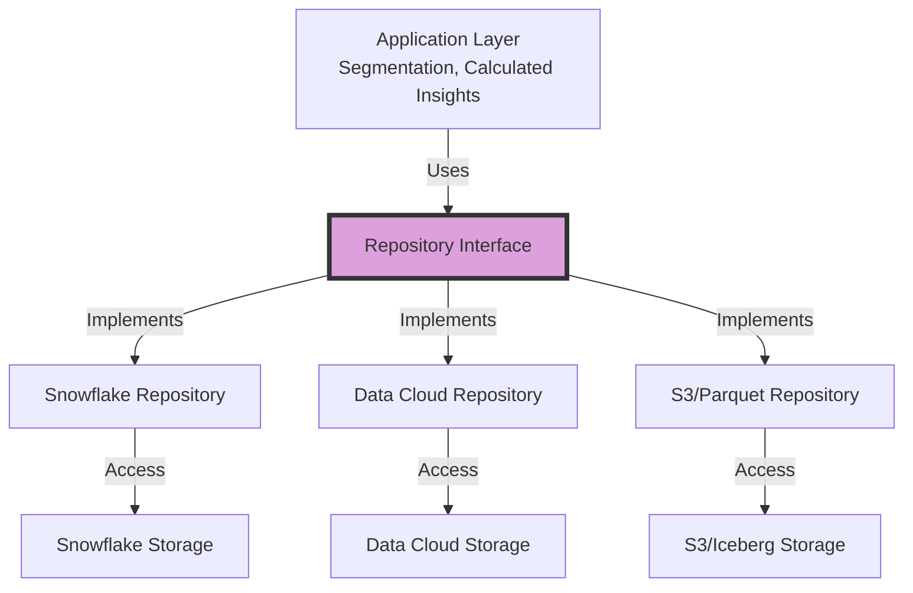

### Real Data Example

**Repository Interface Definition:**

```python
from abc import ABC, abstractmethod

class TransactionRepository(ABC):
    """Abstract repository for transactions"""
    
    @abstractmethod
    def get_by_id(self, transaction_id):
        """Get transaction by ID"""
        pass
    
    @abstractmethod
    def get_by_customer(self, customer_id, limit=100):
        """Get transactions for a customer"""
        pass
    
    @abstractmethod
    def get_high_value(self, min_amount, start_date, end_date):
        """Get high-value transactions in date range"""
        pass
    
    @abstractmethod
    def calculate_lifetime_value(self, customer_id):
        """Calculate customer lifetime value"""
        pass
    
    @abstractmethod
    def insert(self, transaction):
        """Insert new transaction"""
        pass
    
    @abstractmethod
    def update(self, transaction_id, updates):
        """Update transaction"""
        pass
```

### Implementation 1: Snowflake Repository

```python
class SnowflakeTransactionRepository(TransactionRepository):
    def __init__(self, connection):
        self.conn = connection
    
    def get_by_id(self, transaction_id):
        """Get transaction from Snowflake"""
        query = """
        SELECT 
            txn_id as transactionId,
            cust_id as customerId,
            amount,
            txn_date as transactionDate,
            product_code as productCode
        FROM snowflake.prod.transactions
        WHERE txn_id = %s
        """
        result = self.conn.execute(query, (transaction_id,))
        return result.fetchone()
    
    def get_by_customer(self, customer_id, limit=100):
        """Get transactions for customer from Snowflake"""
        query = """
        SELECT 
            txn_id as transactionId,
            cust_id as customerId,
            amount,
            txn_date as transactionDate,
            product_code as productCode
        FROM snowflake.prod.transactions
        WHERE cust_id = %s
        ORDER BY txn_date DESC
        LIMIT %s
        """
        result = self.conn.execute(query, (customer_id, limit))
        return result.fetchall()
    
    def get_high_value(self, min_amount, start_date, end_date):
        """Get high-value transactions from Snowflake"""
        query = """
        SELECT 
            txn_id as transactionId,
            cust_id as customerId,
            amount,
            txn_date as transactionDate,
            product_code as productCode
        FROM snowflake.prod.transactions
        WHERE amount >= %s
          AND txn_date BETWEEN %s AND %s
        ORDER BY amount DESC
        """
        result = self.conn.execute(query, (min_amount, start_date, end_date))
        return result.fetchall()
    
    def calculate_lifetime_value(self, customer_id):
        """Calculate LTV from Snowflake"""
        query = """
        SELECT 
            cust_id as customerId,
            SUM(amount) as lifetimeValue,
            COUNT(*) as transactionCount,
            AVG(amount) as averageOrderValue
        FROM snowflake.prod.transactions
        WHERE cust_id = %s
        GROUP BY cust_id
        """
        result = self.conn.execute(query, (customer_id,))
        return result.fetchone()
    
    def insert(self, transaction):
        """Insert transaction to Snowflake"""
        query = """
        INSERT INTO snowflake.prod.transactions
        (txn_id, cust_id, amount, txn_date, product_code)
        VALUES (%s, %s, %s, %s, %s)
        """
        self.conn.execute(query, (
            transaction["transactionId"],
            transaction["customerId"],
            transaction["amount"],
            transaction["transactionDate"],
            transaction["productCode"]
        ))
        self.conn.commit()
        return transaction
```

### Implementation 2: Data Cloud Repository

```python
class DataCloudTransactionRepository(TransactionRepository):
    def __init__(self, api_client):
        self.client = api_client
    
    def get_by_id(self, transaction_id):
        """Get transaction from Data Cloud"""
        query = f"""
        SELECT 
            TransactionId,
            IndividualId,
            Amount,
            TransactionDate,
            ProductCode
        FROM Transaction__dmo
        WHERE TransactionId = '{transaction_id}'
        """
        result = self.client.query(query)
        return result[0] if result else None
    
    def get_by_customer(self, customer_id, limit=100):
        """Get transactions for customer from Data Cloud"""
        # First, resolve customer ID to unified individual ID
        individual_id = self.resolve_to_individual(customer_id)
        
        query = f"""
        SELECT 
            TransactionId,
            IndividualId,
            Amount,
            TransactionDate,
            ProductCode
        FROM Transaction__dmo
        WHERE IndividualId = '{individual_id}'
        ORDER BY TransactionDate DESC
        LIMIT {limit}
        """
        result = self.client.query(query)
        return result
    
    def get_high_value(self, min_amount, start_date, end_date):
        """Get high-value transactions from Data Cloud"""
        query = f"""
        SELECT 
            TransactionId,
            IndividualId,
            Amount,
            TransactionDate,
            ProductCode
        FROM Transaction__dmo
        WHERE Amount >= {min_amount}
          AND TransactionDate BETWEEN '{start_date}' AND '{end_date}'
        ORDER BY Amount DESC
        """
        result = self.client.query(query)
        return result
    
    def calculate_lifetime_value(self, customer_id):
        """Calculate LTV from Data Cloud (using Calculated Insight)"""
        individual_id = self.resolve_to_individual(customer_id)
        
        # Option 1: Query pre-calculated metric
        calculated_insight = self.client.get_calculated_insight(
            metric="LifetimeValue",
            individualId=individual_id
        )
        
        return {
            "customerId": customer_id,
            "lifetimeValue": calculated_insight["value"],
            "transactionCount": calculated_insight["metadata"]["transactionCount"],
            "averageOrderValue": calculated_insight["metadata"]["avgOrderValue"]
        }
    
    def insert(self, transaction):
        """Insert transaction to Data Cloud"""
        # Use Ingestion API
        result = self.client.ingest(
            object="Transaction__dmo",
            data=[transaction]
        )
        return result[0]
    
    def resolve_to_individual(self, customer_id):
        """Resolve customer ID to unified individual ID"""
        profile = self.client.query(f"""
        SELECT UnifiedIndividualId
        FROM UnifiedProfile
        WHERE SourceRecords CONTAINS '{customer_id}'
        """)
        return profile[0]["UnifiedIndividualId"] if profile else None
```

### Implementation 3: S3/Parquet Repository

```python
class S3ParquetTransactionRepository(TransactionRepository):
    def __init__(self, s3_client, bucket):
        self.s3 = s3_client
        self.bucket = bucket
    
    def get_by_id(self, transaction_id):
        """Get transaction from S3/Parquet"""
        # Use AWS Athena or Trino to query Parquet
        query = f"""
        SELECT 
            transaction_id as transactionId,
            customer_id as customerId,
            amount,
            transaction_date as transactionDate,
            product_code as productCode
        FROM s3_transactions
        WHERE transaction_id = '{transaction_id}'
        """
        result = self.execute_athena_query(query)
        return result[0] if result else None
    
    def get_by_customer(self, customer_id, limit=100):
        """Get transactions for customer from S3"""
        query = f"""
        SELECT 
            transaction_id as transactionId,
            customer_id as customerId,
            amount,
            transaction_date as transactionDate,
            product_code as productCode
        FROM s3_transactions
        WHERE customer_id = '{customer_id}'
        ORDER BY transaction_date DESC
        LIMIT {limit}
        """
        result = self.execute_athena_query(query)
        return result
    
    def get_high_value(self, min_amount, start_date, end_date):
        """Get high-value transactions from S3"""
        # Leverage partition pruning on date
        query = f"""
        SELECT 
            transaction_id as transactionId,
            customer_id as customerId,
            amount,
            transaction_date as transactionDate,
            product_code as productCode
        FROM s3_transactions
        WHERE amount >= {min_amount}
          AND transaction_date BETWEEN '{start_date}' AND '{end_date}'
        ORDER BY amount DESC
        """
        result = self.execute_athena_query(query)
        return result
    
    def calculate_lifetime_value(self, customer_id):
        """Calculate LTV from S3"""
        query = f"""
        SELECT 
            customer_id as customerId,
            SUM(amount) as lifetimeValue,
            COUNT(*) as transactionCount,
            AVG(amount) as averageOrderValue
        FROM s3_transactions
        WHERE customer_id = '{customer_id}'
        GROUP BY customer_id
        """
        result = self.execute_athena_query(query)
        return result[0] if result else None
    
    def insert(self, transaction):
        """Insert transaction to S3 (append to Parquet)"""
        # Write to Parquet file
        key = f"transactions/{transaction['transactionDate'][:7]}/{transaction['transactionId']}.parquet"
        
        df = pd.DataFrame([transaction])
        parquet_buffer = BytesIO()
        df.to_parquet(parquet_buffer)
        
        self.s3.put_object(
            Bucket=self.bucket,
            Key=key,
            Body=parquet_buffer.getvalue()
        )
        
        return transaction
    
    def execute_athena_query(self, query):
        """Execute query via Athena"""
        # Implementation details...
        pass
```

### Application Code (Repository Pattern Usage)

**Key Benefit: Application doesn't know which storage is used**

```python
# Application code for Calculated Insights
class LifetimeValueCalculator:
    def __init__(self, transaction_repo: TransactionRepository):
        # Depends on interface, not implementation
        self.repo = transaction_repo
    
    def calculate_for_customer(self, customer_id):
        """Calculate LTV - works with any repository"""
        result = self.repo.calculate_lifetime_value(customer_id)
        
        return {
            "customerId": customer_id,
            "lifetimeValue": result["lifetimeValue"],
            "transactionCount": result["transactionCount"],
            "averageOrderValue": result["averageOrderValue"],
            "calculatedAt": datetime.now()
        }

# Usage with Snowflake
snowflake_repo = SnowflakeTransactionRepository(snowflake_conn)
calculator = LifetimeValueCalculator(snowflake_repo)
ltv = calculator.calculate_for_customer("CUST-12345")

# Usage with Data Cloud (same calculator code!)
datacloud_repo = DataCloudTransactionRepository(datacloud_client)
calculator = LifetimeValueCalculator(datacloud_repo)
ltv = calculator.calculate_for_customer("CUST-12345")

# Result is the same regardless of backend:
{
  "customerId": "CUST-12345",
  "lifetimeValue": 135000.00,
  "transactionCount": 45,
  "averageOrderValue": 3000.00,
  "calculatedAt": "2025-10-23T14:30:00Z"
}
```

### Repository Pattern Benefits

**1. Abstraction:**
```
Application doesn't know:
- Where data is stored (Snowflake vs Data Cloud vs S3)
- What query language to use
- How to connect to storage
```

**2. Testability:**
```python
# Easy to create mock repository for testing
class MockTransactionRepository(TransactionRepository):
    def __init__(self):
        self.data = [
            {"transactionId": "TXN-1", "amount": 100},
            {"transactionId": "TXN-2", "amount": 200}
        ]
    
    def get_by_id(self, transaction_id):
        return next((t for t in self.data if t["transactionId"] == transaction_id), None)
    
    # ... implement other methods with mock data

# Test with mock
mock_repo = MockTransactionRepository()
calculator = LifetimeValueCalculator(mock_repo)
# Tests run fast without database!
```

**3. Migration Support:**
```
FY2024: Use SnowflakeTransactionRepository
FY2027: Switch to DataCloudTransactionRepository
FY2031: Fully on DataCloudTransactionRepository

Application code: NO CHANGES NEEDED
Only swap repository implementation
```

---

## 16. MEMENTO PATTERN

### Real Implementation in Architecture
**Location:** Data Lineage (Manta, Spline) & Data Archival

### Mermaid Diagram

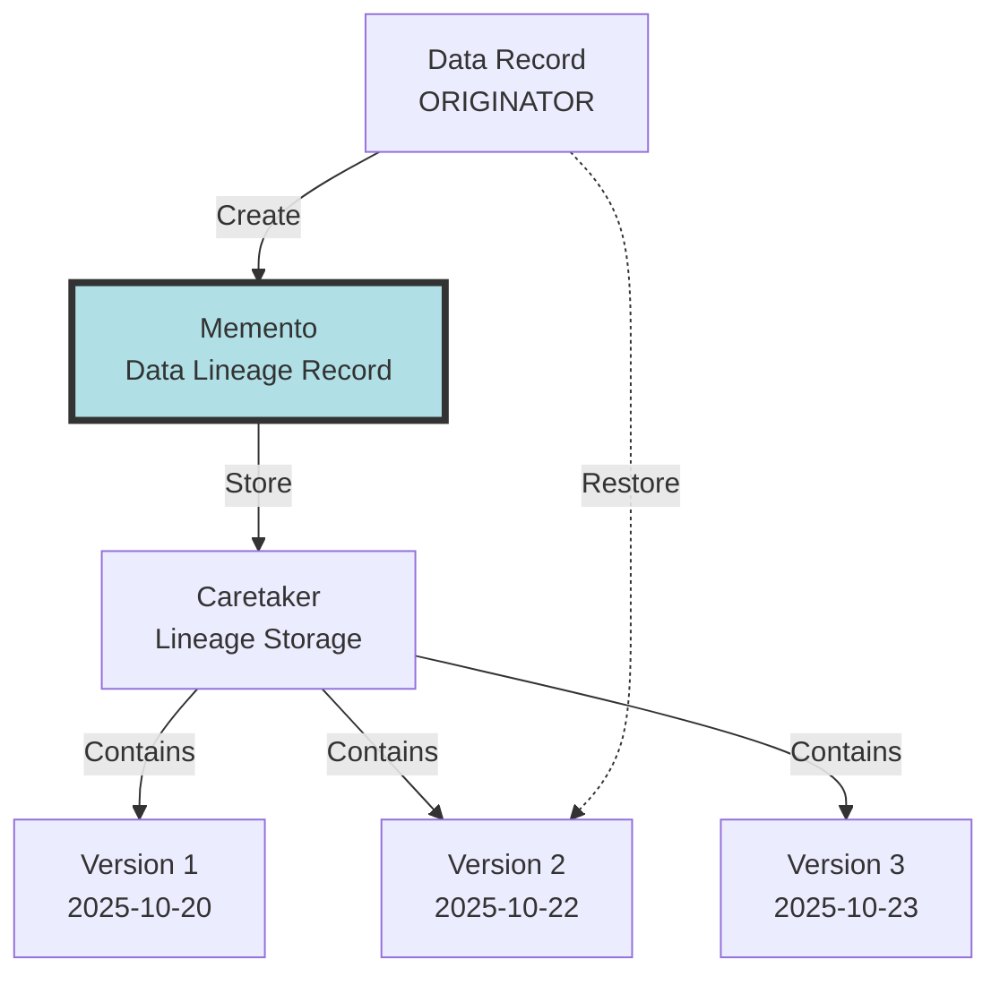

### Real Data Example

**Scenario: Customer Record Evolution**

**Version 1 (Original State - Oct 20, 2025):**
```json
{
  "individualId": "IND-UNIFIED-001",
  "firstName": "Jane",
  "lastName": "Austin",
  "email": "jane.austin@acme.com",
  "phone": "+15550123",
  "lifetimeValue": 85000.00,
  "engagementScore": 75,
  "churnProbability": 0.25,
  "lastModified": "2025-10-20T10:00:00Z",
  "version": 1
}
```

**Memento 1 Created (Lineage Tracking):**
```json
{
  "mementoId": "MEM-001",
  "recordType": "UnifiedIndividual",
  "recordId": "IND-UNIFIED-001",
  "version": 1,
  "timestamp": "2025-10-20T10:00:00Z",
  "snapshot": {
    "individualId": "IND-UNIFIED-001",
    "firstName": "Jane",
    "lastName": "Austin",
    "email": "jane.austin@acme.com",
    "phone": "+15550123",
    "lifetimeValue": 85000.00,
    "engagementScore": 75,
    "churnProbability": 0.25
  },
  "lineage": {
    "sources": [
      {"system": "Sales Org", "id": "003XX001", "lastSync": "2025-10-20T09:00:00Z"},
      {"system": "Service Org", "id": "003YY002", "lastSync": "2025-10-20T09:30:00Z"}
    ],
    "transformations": [
      "Identity Resolution",
      "CRM Enrichment",
      "Calculated Insights"
    ]
  },
  "storedIn": "Manta Lineage System"
}
```

**Version 2 (After Transaction - Oct 22, 2025):**
```json
{
  "individualId": "IND-UNIFIED-001",
  "firstName": "Jane",
  "lastName": "Austin",
  "email": "jane.austin@acme.com",
  "phone": "+15550123",
  "lifetimeValue": 135000.00,
  "engagementScore": 42,
  "churnProbability": 0.78,
  "lastModified": "2025-10-22T14:30:00Z",
  "version": 2,
  "changeReason": "High-value transaction TXN-98765 increased LTV"
}
```

**Memento 2 Created:**
```json
{
  "mementoId": "MEM-002",
  "recordType": "UnifiedIndividual",
  "recordId": "IND-UNIFIED-001",
  "version": 2,
  "timestamp": "2025-10-22T14:30:00Z",
  "snapshot": {
    "individualId": "IND-UNIFIED-001",
    "firstName": "Jane",
    "lastName": "Austin",
    "email": "jane.austin@acme.com",
    "phone": "+15550123",
    "lifetimeValue": 135000.00,
    "engagementScore": 42,
    "churnProbability": 0.78
  },
  "changes": [
    {
      "field": "lifetimeValue",
      "oldValue": 85000.00,
      "newValue": 135000.00,
      "changeType": "Update",
      "reason": "Transaction TXN-98765 added"
    },
    {
      "field": "engagementScore",
      "oldValue": 75,
      "newValue": 42,
      "changeType": "Update",
      "reason": "Recalculated based on activity decline"
    },
    {
      "field": "churnProbability",
      "oldValue": 0.25,
      "newValue": 0.78,
      "changeType": "Update",
      "reason": "ML model prediction updated"
    }
  ],
  "lineage": {
    "sources": [
      {"system": "Sales Org", "id": "003XX001", "lastSync": "2025-10-22T09:00:00Z"},
      {"system": "Service Org", "id": "003YY002", "lastSync": "2025-10-22T09:30:00Z"},
      {"system": "Snowflake", "id": "TXN-98765", "lastSync": "2025-10-22T14:30:00Z"}
    ],
    "transformations": [
      "Identity Resolution",
      "CRM Enrichment",
      "Transaction Aggregation",
      "ML Prediction Update",
      "Calculated Insights"
    ]
  },
  "storedIn": "Spline Lineage System"
}
```

**Version 3 (After Email Update - Oct 23, 2025):**
```json
{
  "individualId": "IND-UNIFIED-001",
  "firstName": "Jane",
  "lastName": "Austin",
  "email": "jane.austin@newcompany.com",
  "phone": "+15550123",
  "lifetimeValue": 135000.00,
  "engagementScore": 42,
  "churnProbability": 0.78,
  "lastModified": "2025-10-23T11:00:00Z",
  "version": 3,
  "changeReason": "Email updated in Marketing Cloud"
}
```

**Memento 3 Created:**
```json
{
  "mementoId": "MEM-003",
  "recordType": "UnifiedIndividual",
  "recordId": "IND-UNIFIED-001",
  "version": 3,
  "timestamp": "2025-10-23T11:00:00Z",
  "snapshot": {
    "individualId": "IND-UNIFIED-001",
    "firstName": "Jane",
    "lastName": "Austin",
    "email": "jane.austin@newcompany.com",
    "phone": "+15550123",
    "lifetimeValue": 135000.00,
    "engagementScore": 42,
    "churnProbability": 0.78
  },
  "changes": [
    {
      "field": "email",
      "oldValue": "jane.austin@acme.com",
      "newValue": "jane.austin@newcompany.com",
      "changeType": "Update",
      "reason": "Email updated in Marketing Cloud",
      "updatedBy": "Marketing Cloud Sync"
    }
  ],
  "lineage": {
    "sources": [
      {"system": "Sales Org", "id": "003XX001", "lastSync": "2025-10-23T09:00:00Z"},
      {"system": "Service Org", "id": "003YY002", "lastSync": "2025-10-23T09:30:00Z"},
      {"system": "Marketing Cloud", "id": "SUB-789", "lastSync": "2025-10-23T11:00:00Z", "emailUpdated": true}
    ],
    "transformations": [
      "Identity Resolution (re-run)",
      "CRM Enrichment"
    ]
  },
  "storedIn": "Spline Lineage System"
}
```

### Restoration Example

**Scenario: Need to restore to Version 2 (before email change)**

```python
class UnifiedProfileCaretaker:
    def __init__(self):
        self.mementos = {}
    
    def save(self, memento):
        """Save memento (lineage record)"""
        if memento.recordId not in self.mementos:
            self.mementos[memento.recordId] = []
        self.mementos[memento.recordId].append(memento)
    
    def get_version(self, record_id, version):
        """Get specific version"""
        mementos = self.mementos.get(record_id, [])
        for memento in mementos:
            if memento.version == version:
                return memento
        return None
    
    def get_latest(self, record_id):
        """Get latest version"""
        mementos = self.mementos.get(record_id, [])
        return mementos[-1] if mementos else None
    
    def get_history(self, record_id):
        """Get all versions"""
        return self.mementos.get(record_id, [])

# Restore to Version 2
caretaker = UnifiedProfileCaretaker()
memento_v2 = caretaker.get_version("IND-UNIFIED-001", version=2)

restored_state = memento_v2.snapshot
print(restored_state)
```

**Restored State:**
```json
{
  "individualId": "IND-UNIFIED-001",
  "firstName": "Jane",
  "lastName": "Austin",
  "email": "jane.austin@acme.com",
  "phone": "+15550123",
  "lifetimeValue": 135000.00,
  "engagementScore": 42,
  "churnProbability": 0.78,
  "restoredFrom": "Version 2",
  "originalTimestamp": "2025-10-22T14:30:00Z",
  "restoredAt": "2025-10-23T15:00:00Z"
}
```

### Data Lineage Visualization

**Manta/Spline Lineage Tracking:**

```json
{
  "lineageId": "LIN-IND-001",
  "entityId": "IND-UNIFIED-001",
  "entityType": "UnifiedIndividual",
  "versionHistory": [
    {
      "version": 1,
      "timestamp": "2025-10-20T10:00:00Z",
      "mementoId": "MEM-001",
      "fields": {
        "lifetimeValue": 85000.00,
        "engagementScore": 75,
        "churnProbability": 0.25
      }
    },
    {
      "version": 2,
      "timestamp": "2025-10-22T14:30:00Z",
      "mementoId": "MEM-002",
      "fields": {
        "lifetimeValue": 135000.00,
        "engagementScore": 42,
        "churnProbability": 0.78
      },
      "triggerEvent": "Transaction TXN-98765"
    },
    {
      "version": 3,
      "timestamp": "2025-10-23T11:00:00Z",
      "mementoId": "MEM-003",
      "fields": {
        "email": "jane.austin@newcompany.com"
      },
      "triggerEvent": "Marketing Cloud email update"
    }
  ],
  "upstreamDependencies": [
    {
      "system": "Sales Org",
      "object": "Contact",
      "id": "003XX001",
      "fields": ["FirstName", "LastName", "Email", "Phone"]
    },
    {
      "system": "Service Org",
      "object": "Contact",
      "id": "003YY002",
      "fields": ["FirstName", "LastName", "Phone"]
    },
    {
      "system": "Marketing Cloud",
      "object": "Subscriber",
      "id": "SUB-789",
      "fields": ["Email"]
    },
    {
      "system": "Snowflake",
      "object": "Transactions",
      "aggregation": "SUM(amount)",
      "calculatedField": "lifetimeValue"
    },
    {
      "system": "Databricks",
      "object": "ChurnPredictions",
      "model": "ChurnModel_v2.3",
      "calculatedField": "churnProbability"
    }
  ],
  "downstreamImpacts": [
    {
      "system": "Marketing Cloud",
      "object": "Journey",
      "id": "VIP-ONBOARDING-001",
      "dependsOn": ["lifetimeValue", "churnProbability"]
    },
    {
      "system": "Tableau",
      "dashboard": "Customer Health Dashboard",
      "dependsOn": ["engagementScore", "churnProbability"]
    },
    {
      "system": "Slack",
      "notification": "High-Value Customer Alert",
      "dependsOn": ["lifetimeValue"]
    }
  ]
}
```

### Data Archival (Memento for Compliance)

**Archival Policy:**
```json
{
  "archivalPolicy": {
    "name": "Transaction Data Retention",
    "retentionPeriod": "7 years",
    "archivalFrequency": "Monthly",
    "destination": "S3 Glacier",
    "compressionFormat": "Parquet with Snappy",
    "encryptionEnabled": true
  },
  "archivedVersions": [
    {
      "archiveId": "ARCH-2025-10",
      "archiveDate": "2025-10-31",
      "recordCount": 1500000,
      "dataSize": "12.5 GB",
      "location": "s3://acme-archives/transactions/2025/10/",
      "restorationTime": "12-24 hours"
    }
  ]
}
```

**Archived Transaction Memento:**
```json
{
  "archiveRecord": {
    "transactionId": "TXN-98765",
    "archivedAt": "2025-10-31T00:00:00Z",
    "originalData": {
      "transactionId": "TXN-98765",
      "customerId": "CUST-12345",
      "amount": 50000.00,
      "date": "2025-10-23",
      "productCode": "ENT-LIC-100"
    },
    "metadata": {
      "dataLineage": {
        "source": "Snowflake",
        "ingestionDate": "2025-10-23T14:30:00Z",
        "transformations": ["CRM Enrichment", "Data Quality"],
        "enrichedFields": ["IndividualId", "AccountId", "AccountName"]
      },
      "complianceInfo": {
        "retentionRequiredUntil": "2032-10-31",
        "regulatoryReason": "Financial records retention (7 years)",
        "jurisdiction": "United States",
        "dataClassification": "Financial"
      }
    },
    "restorationKey": "s3://acme-archives/transactions/2025/10/TXN-98765.parquet"
  }
}
```

### Memento Pattern Benefits

**1. Point-in-Time Recovery:**
```
"Show me what this customer record looked like on Oct 20"
→ Restore from Memento 1
```

**2. Audit Trail:**
```
"Who changed the email and when?"
→ Check Memento 3 changes
→ updatedBy: "Marketing Cloud Sync"
→ timestamp: "2025-10-23T11:00:00Z"
```

**3. Impact Analysis:**
```
"If I change lifetimeValue, what systems are affected?"
→ Check downstreamImpacts in lineage
→ Marketing Journey, Tableau Dashboard, Slack alerts
```

**4. Compliance:**
```
"Retain all financial transactions for 7 years"
→ Create mementos in S3 Glacier
→ Encrypted, compressed, retrievable
```

---

## Summary Table: All 16 Patterns with Real Examples

| # | Pattern | Implementation | Real Data Example |
|---|---------|----------------|-------------------|
| 1 | Adapter | Data Streams | Snowflake `customer_id` → Data Cloud `IndividualId` |
| 2 | Facade | Semantic Layer | Complex joins hidden behind "Sales Velocity" metric |
| 3 | Proxy | Einstein Trust Layer | AI requests proxied through LLM Gateway with audit |
| 4 | Mediator | Data Cloud Core | Multiple orgs sync through central Data Cloud hub |
| 5 | Observer | Platform Events | Transaction triggers Slack, Marketing Cloud, S3, Segmentation |
| 6 | Strategy | Identity Resolution | Exact Match vs Fuzzy Match vs Exact Normalized |
| 7 | Composite | Data Graphs | Account → Contacts → Opportunities → Line Items tree |
| 8 | Singleton | Unified Profiles | Jane Austin, Jan Austin, J Austin → ONE profile IND-UNIFIED-001 |
| 9 | Factory | Data Streams | Creates Batch Service, Streaming API, Mobile SDK streams |
| 10 | Decorator | CRM Enrichment | Base transaction + CRM + Calculations + Quality = Enhanced |
| 11 | Bridge | Semantic Layer | Business queries work on Snowflake, Data Cloud, or Exadata |
| 12 | Template Method | ETL Pipeline | Extract → Validate → Transform → Enrich → Load → Log |
| 13 | Chain of Responsibility | Data Quality | Ataccama → Monte Carlo → Lego DQ sequential validation |
| 14 | Command | Data Actions | SendEmail, TriggerJourney, SlackNotify, UpdateSegment commands |
| 15 | Repository | Data Lake Objects | Same query interface for Snowflake, Data Cloud, S3 |
| 16 | Memento | Data Lineage | Customer record versions stored with full change history |

---

**Document Version:** 2.0 (With Real Examples)  
**Created:** October 23, 2025  
**Based On:** Salesforce Data Cloud Architecture Documents