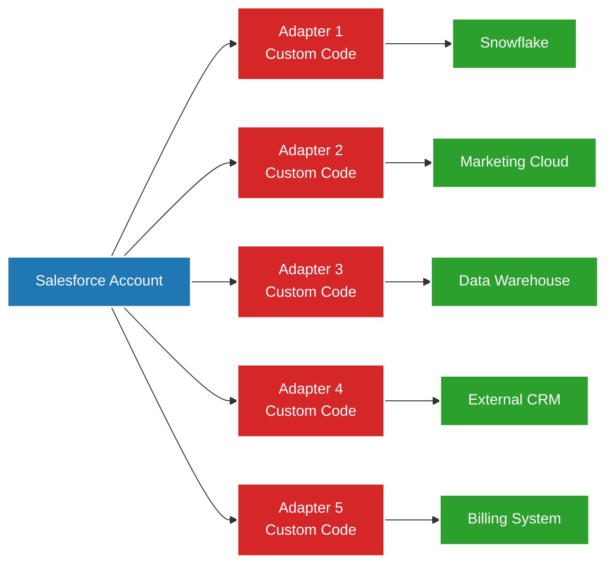
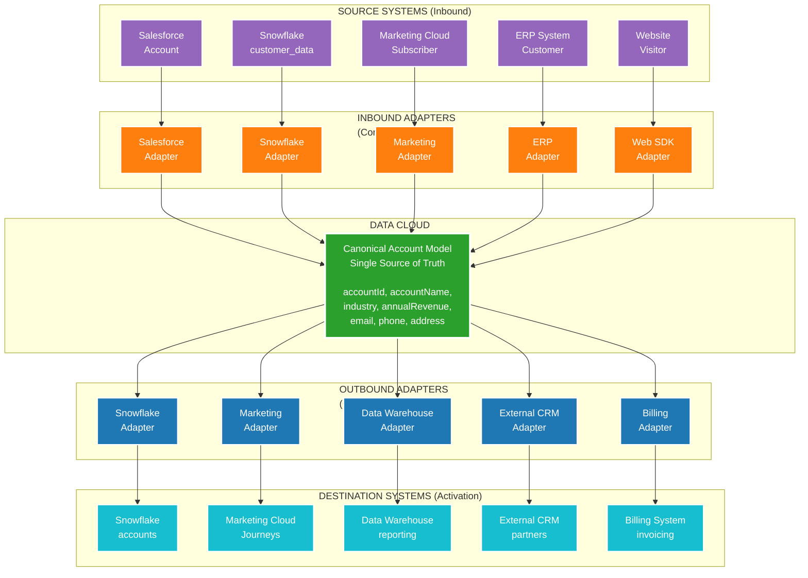

# Why Data Cloud When You Already Have Integration Patterns?

## The Critical Question

> **"I have already implemented Pattern 1 (API), Pattern 2 (Batch/Cron), and Pattern 3 (Kafka Streaming). Then why do I still need Data Cloud?"**

This document answers this question with real data examples, pattern analysis, and concrete scenarios where traditional integration patterns fall short, especially when **activation** is required.

---

## Table of Contents
1. [Traditional Integration Patterns: What They Support](#traditional-integration-patterns)
2. [The Activation Problem](#the-activation-problem)
3. [Data Cloud Design Patterns: Superior Stack](#data-cloud-superior-stack)
4. [Real-World Comparison](#real-world-comparison)
5. [Pattern Coverage Matrix](#pattern-coverage-matrix)
6. [The Business Case](#the-business-case)

---

## Traditional Integration Patterns

### **The Honest Truth: They Support Design Patterns Too**

Traditional API, Batch, and Kafka patterns ARE NOT pattern-less. They implement classic design patterns:

**Pattern 1 (API):**
- ✅ Adapter Pattern - Transform requests/responses
- ✅ Proxy Pattern - API Gateway
- ✅ Facade Pattern - Simplify complex APIs
- ✅ Command Pattern - Remote execution

**Pattern 2 (Batch):**
- ✅ Template Method - ETL workflows
- ✅ Strategy Pattern - Different batch strategies
- ✅ Chain of Responsibility - Data quality checks

**Pattern 3 (Kafka):**
- ✅ Observer Pattern - Event-driven pub-sub
- ✅ Mediator Pattern - Central event bus
- ✅ Memento Pattern - Event log

**So what's the difference?**

The patterns are the same. The **technical implementation** is what matters for:
- **Speed:** How fast can you build it?
- **Time to Market:** How soon can you deliver value?
- **Ease of Use:** Who can build it? Developers only or business users too?
- **Scalability:** What happens when you add a 6th system?

---

## The Critical Difference: Point-to-Point vs Canonical Model

### Real Scenario: Integrate Account Data Across 5 Systems

**Your Setup:**
- Source: Salesforce (Account object)
- Destinations:
  1. Snowflake (analytics)
  2. Marketing Cloud (campaigns)
  3. Data Warehouse (reporting)
  4. External CRM (partners)
  5. Billing System (invoicing)

---

### Traditional API Pattern: Build 5 Adapters

**Adapter Pattern Implementation:**



**Code for Adapter 1 (Salesforce → Snowflake):**

```python
# Adapter 1: Salesforce to Snowflake
def sync_account_to_snowflake(account_id):
    # Get from Salesforce
    sf_account = salesforce_api.get(f"/sobjects/Account/{account_id}")
    
    # Transform to Snowflake format (CUSTOM CODE)
    snowflake_account = {
        "account_id": sf_account["Id"],
        "account_name": sf_account["Name"],
        "industry": sf_account["Industry"],
        "annual_revenue": sf_account["AnnualRevenue"],
        "created_date": sf_account["CreatedDate"],
        # ... 50 more fields
    }
    
    # Load to Snowflake
    snowflake_client.execute(
        "INSERT INTO accounts VALUES (%s, %s, %s, %s, %s)",
        tuple(snowflake_account.values())
    )
```

**Code for Adapter 2 (Salesforce → Marketing Cloud):**

```python
# Adapter 2: Salesforce to Marketing Cloud
def sync_account_to_marketing(account_id):
    # Get from Salesforce (DUPLICATE API CALL)
    sf_account = salesforce_api.get(f"/sobjects/Account/{account_id}")
    
    # Transform to Marketing Cloud format (DIFFERENT CUSTOM CODE)
    marketing_account = {
        "AccountId": sf_account["Id"],
        "AccountName": sf_account["Name"],
        "IndustryCode": map_industry_code(sf_account["Industry"]),  # Different logic!
        "Revenue": sf_account["AnnualRevenue"],
        "CreateDate": format_date_marketing(sf_account["CreatedDate"]),  # Different format!
        # ... different field names, different transformations
    }
    
    # Load to Marketing Cloud
    marketing_api.post("/dataextension/accounts", marketing_account)
```

**Code for Adapters 3, 4, 5:** (... more custom code, more duplication)

**Problems with Point-to-Point:**

| Problem | Impact |
|---------|--------|
| **5 separate adapters** | 5x development effort |
| **5 codebases to maintain** | 5x maintenance cost |
| **Duplicate API calls** | 5x load on Salesforce |
| **Different transformations** | Inconsistent data across systems |
| **No canonical model** | Each system has own interpretation |
| **Add 6th system?** | Write 6th adapter from scratch |

**Time to Build:** 2 weeks × 5 adapters = **10 weeks**  
**Lines of Code:** ~500 lines × 5 = **2,500 lines**  
**Maintenance:** 5 separate codebases, 5 points of failure  
**Scalability:** Linear (N systems = N adapters)  

---

### Data Cloud: Build 1 Canonical Model

**Canonical Model + Adapter Pattern (Complete Bidirectional Flow):**



**The Complete Transformation/Journey Loop:**

```
INBOUND (Sources → Data Cloud)
  5 different source formats → 5 inbound adapters → 1 canonical model

CANONICAL MODEL (Data Cloud)
  Single source of truth, unified, identity-resolved

OUTBOUND (Data Cloud → Activation)
  1 canonical model → 5 outbound adapters → 5 different destination formats
```

**Why This Matters:**

Traditional point-to-point:
- 5 sources × 5 destinations = **25 different integrations**
- Each source-to-destination pair needs custom code
- Example: Salesforce → Snowflake, Salesforce → Marketing, ERP → Snowflake, etc.

Data Cloud with canonical model:
- 5 inbound adapters + 5 outbound adapters = **10 total adapters**
- All reuse the same canonical model
- 60% less integration code

---

### Real Data Example: Complete Bidirectional Flow

**Step 1: INBOUND - Multiple Sources Come In**

```json
// Source 1: Salesforce Account
{
  "Id": "001XX001",
  "Name": "Acme Corp",
  "Industry": "Manufacturing",
  "AnnualRevenue": 5000000,
  "BillingAddress": {
    "street": "123 Main St",
    "city": "San Francisco"
  }
}

// Source 2: Snowflake customer_data table
{
  "customer_id": "CUST-12345",
  "company_name": "Acme Corp",
  "industry_code": "MANU",
  "yearly_revenue": 5000000,
  "primary_contact_email": "contact@acmecorp.com"
}

// Source 3: Marketing Cloud Subscriber
{
  "SubscriberKey": "SUB-789",
  "CompanyName": "Acme Corporation",
  "EmailAddress": "contact@acmecorp.com",
  "IndustrySegment": "Manufacturing"
}

// Source 4: ERP System
{
  "AccountNumber": "ACC-9999",
  "LegalName": "Acme Corp Inc",
  "Sector": "Industrial Manufacturing",
  "TotalContractValue": 5000000
}

// Source 5: Website Visitor (anonymous)
{
  "visitorId": "VIS-11111",
  "companyDomain": "acmecorp.com",
  "pageViews": 25,
  "lastVisit": "2025-10-23T14:00:00Z"
}
```

**Step 2: INBOUND ADAPTERS Transform to Canonical Model**

```yaml
# Inbound Adapter 1: Salesforce → Canonical
Salesforce Account Mapping:
  source: Salesforce.Account
  target: Canonical.Account
  mappings:
    Id → accountId
    Name → accountName
    Industry → industry
    AnnualRevenue → annualRevenue
    BillingAddress → address

# Inbound Adapter 2: Snowflake → Canonical
Snowflake Mapping:
  source: Snowflake.customer_data
  target: Canonical.Account
  mappings:
    customer_id → externalId (Snowflake)
    company_name → accountName
    industry_code → industry (lookup: code_to_name)
    yearly_revenue → annualRevenue
    primary_contact_email → email

# Inbound Adapter 3: Marketing Cloud → Canonical
Marketing Cloud Mapping:
  source: MarketingCloud.Subscriber
  target: Canonical.Account
  mappings:
    SubscriberKey → externalId (Marketing)
    CompanyName → accountName
    EmailAddress → email
    IndustrySegment → industry

# Inbound Adapters 4, 5: Similar configs...
```

**Step 3: CANONICAL MODEL - Identity Resolution Creates Single View**

```json
// Data Cloud performs identity resolution (Singleton Pattern)
// Matches: Same company across 5 sources
{
  "unifiedAccountId": "ACC-UNIFIED-001",
  
  "canonicalData": {
    "accountId": "001XX001",
    "accountName": "Acme Corp",
    "industry": "Manufacturing",
    "annualRevenue": 5000000,
    "email": "contact@acmecorp.com",
    "address": {
      "street": "123 Main St",
      "city": "San Francisco"
    }
  },
  
  "sourceLineage": [
    {"system": "Salesforce", "id": "001XX001"},
    {"system": "Snowflake", "id": "CUST-12345"},
    {"system": "Marketing", "id": "SUB-789"},
    {"system": "ERP", "id": "ACC-9999"},
    {"system": "Website", "id": "VIS-11111", "matched": "domain"}
  ],
  
  "calculatedInsights": {
    "lifetimeValue": 5000000,
    "engagementScore": 85,
    "websiteActivity": "High",
    "lastInteraction": "2025-10-23T14:00:00Z"
  }
}
```

**Step 4: OUTBOUND ADAPTERS Transform from Canonical to Destinations**

```yaml
# Outbound Adapter 1: Canonical → Snowflake analytics
Snowflake Analytics Mapping:
  source: Canonical.Account
  target: Snowflake.accounts
  mappings:
    accountId → account_id
    accountName → account_name
    industry → industry_code (lookup: name_to_code)
    annualRevenue → annual_revenue

# Outbound Adapter 2: Canonical → Marketing Cloud Journeys
Marketing Journey Mapping:
  source: Canonical.Account
  target: MarketingCloud.AccountJourney
  mappings:
    accountId → AccountId
    accountName → AccountName
    email → ContactEmail
    calculatedInsights.engagementScore → EngagementScore

# Outbound Adapter 3: Canonical → Data Warehouse
Warehouse Mapping:
  source: Canonical.Account
  target: DataWarehouse.dim_account
  mappings:
    accountId → account_key
    accountName → account_name
    industry → industry_name
    annualRevenue → revenue_amount

# Outbound Adapters 4, 5: Similar configs...
```

**Step 5: OUTBOUND - Activation to Multiple Destinations**

```json
// Destination 1: Snowflake (analytics)
{
  "account_id": "001XX001",
  "account_name": "Acme Corp",
  "industry_code": "MANU",
  "annual_revenue": 5000000,
  "lifetime_value": 5000000,
  "engagement_score": 85
}

// Destination 2: Marketing Cloud (campaigns)
{
  "AccountId": "001XX001",
  "AccountName": "Acme Corp",
  "ContactEmail": "contact@acmecorp.com",
  "EngagementScore": 85,
  "JourneyEntry": "High-Value Nurture"
}

// Destination 3: Data Warehouse (reporting)
{
  "account_key": "001XX001",
  "account_name": "Acme Corp",
  "industry_name": "Manufacturing",
  "revenue_amount": 5000000,
  "last_activity_date": "2025-10-23"
}

// Destinations 4, 5: Each gets data in their preferred format
```

---

### The Math: Point-to-Point vs Canonical Model

**Traditional Point-to-Point:**

```
Every source needs to connect to every destination:

Salesforce → Snowflake (custom code)
Salesforce → Marketing Cloud (custom code)
Salesforce → Data Warehouse (custom code)
Salesforce → External CRM (custom code)
Salesforce → Billing (custom code)

Snowflake → Marketing Cloud (custom code)
Snowflake → Data Warehouse (custom code)
... and so on

5 sources × 5 destinations = 25 integrations
Each integration = ~500 lines of code
Total: 12,500 lines of custom code
Time: 25 integrations × 2 weeks = 50 weeks
```

**Data Cloud Canonical Model:**

```
Each source connects to canonical model:
Salesforce → Canonical (config)
Snowflake → Canonical (config)
Marketing → Canonical (config)
ERP → Canonical (config)
Website → Canonical (config)

Canonical model connects to each destination:
Canonical → Snowflake (config)
Canonical → Marketing (config)
Canonical → Data Warehouse (config)
Canonical → External CRM (config)
Canonical → Billing (config)

5 inbound + 5 outbound = 10 adapters
Each adapter = ~50 lines of config
Total: 500 lines of config (no code)
Time: 1 day canonical + 10 × 30 min = 1.5 days
```

**Comparison:**

| Metric | Point-to-Point | Canonical Model | Improvement |
|--------|---------------|----------------|-------------|
| **Total integrations** | 25 | 10 | 60% less |
| **Lines of code** | 12,500 | 0 (config only) | 100% less code |
| **Lines of config** | 0 | 500 | Declarative |
| **Time to build** | 50 weeks | 1.5 days | 240x faster |
| **Maintenance** | 25 codebases | 1 model + 10 configs | 96% less maintenance |

---

### Why Complete Bidirectional Flow Matters

**1. Single Source of Truth (Singleton Pattern)**

Traditional: Each system has its own version of "Acme Corp"
- Salesforce: "Acme Corp"
- Snowflake: "ACME CORPORATION"  
- Marketing: "Acme Corp Inc"
- ERP: "Acme Corp Incorporated"

Data Cloud: One unified account after identity resolution
- Canonical: "Acme Corp" (with lineage to all 4 sources)

**2. Consistent Transformation (Template Method Pattern)**

Traditional: Each integration has different logic
- Salesforce → Snowflake: `industry = "MANU"`
- Salesforce → Marketing: `industry = "Manufacturing"`
- Inconsistent across destinations

Data Cloud: Transform once to canonical, distribute consistently
- All sources → Canonical: `industry = "Manufacturing"`
- Canonical → All destinations: Same base value, transformed per destination

**3. Reusability at Scale (Repository Pattern)**

Traditional: Want to add 6th source? 
- Write 5 new integrations (to 5 destinations)
- 2,500 more lines of code
- 10 weeks of work

Data Cloud: Want to add 6th source?
- Write 1 inbound adapter config
- 50 lines of config
- 30 minutes of work

Traditional: Want to add 6th destination?
- Write 5 new integrations (from 5 sources)
- 2,500 more lines of code
- 10 weeks of work

Data Cloud: Want to add 6th destination?
- Write 1 outbound adapter config
- 50 lines of config
- 30 minutes of work

**4. Identity Resolution (Singleton + Mediator Patterns)**

Traditional: Each destination gets duplicate records
- Snowflake has 5 different "Acme Corp" records (one from each source)
- No way to know they're the same company
- Manual deduplication required

Data Cloud: Identity resolution happens in canonical model
- 5 source records → 1 unified account
- Confidence scoring (0.95 match)
- All destinations get the unified record

---

### Configuration (Complete Bidirectional Flow)**

```yaml
# STEP 1: Define Canonical Model ONCE
Canonical Account Model:
  name: Account
  primaryKey: accountId
  fields:
    - accountId: string
    - accountName: string
    - industry: string
    - annualRevenue: decimal
    - email: string
    - phone: string
    - address: object
    # ... define once, reuse everywhere

# STEP 2: Configure Identity Resolution
Identity Resolution Rules:
  - Match on: email (exact)
  - Match on: accountName + address (fuzzy, threshold: 0.85)
  - Match on: phone (normalized)
  - Create: Unified Account with source lineage

# STEP 3: Configure INBOUND Adapters (Sources → Canonical)
Inbound Adapters:
  - Salesforce:
      source: Account
      mappings: [Id → accountId, Name → accountName, ...]
  
  - Snowflake:
      source: customer_data
      mappings: [customer_id → externalId, company_name → accountName, ...]
  
  - Marketing Cloud:
      source: Subscriber
      mappings: [SubscriberKey → externalId, CompanyName → accountName, ...]
  
  - ERP:
      source: Customer
      mappings: [AccountNumber → externalId, LegalName → accountName, ...]
  
  - Website:
      source: Visitor
      mappings: [visitorId → externalId, companyDomain → domain, ...]

# STEP 4: Configure OUTBOUND Adapters (Canonical → Destinations)
Outbound Adapters:
  - Snowflake:
      destination: accounts
      mappings: [accountId → account_id, accountName → account_name, ...]
  
  - Marketing Cloud:
      destination: AccountJourney
      mappings: [accountId → AccountId, accountName → AccountName, ...]
  
  - Data Warehouse:
      destination: dim_account
      mappings: [accountId → account_key, accountName → account_name, ...]
  
  - External CRM:
      destination: Partner_Account
      mappings: [accountId → PartnerAccountId, accountName → Name, ...]
  
  - Billing:
      destination: Customer
      mappings: [accountId → CustomerId, accountName → CustomerName, ...]

# Total: 1 canonical model + 5 inbound + 5 outbound = 11 configs
# Time: 1 day
# Code: 0 lines
```

---

### Real-World Scenario: Customer Data Journey

**Morning: Data Flows IN**

```
8:00 AM - Salesforce sync runs
  → 1,000 accounts updated
  → Flow to canonical model
  → Identity resolution creates 950 unified accounts (50 were duplicates)

8:30 AM - Snowflake batch import
  → 5,000 customer transactions
  → Matched to canonical accounts
  → LTV recalculated

9:00 AM - Marketing Cloud sync
  → 2,000 email interactions
  → Matched to canonical accounts
  → Engagement scores updated

9:30 AM - Website activity streams in
  → 500 active sessions
  → Real-time matching to canonical accounts
  → Intent scores calculated

10:00 AM - ERP sync
  → 100 new contracts
  → Matched to canonical accounts
  → Revenue updated
```

**Canonical Model Now Has:**
- 950 unified accounts
- With data from 5 sources
- Identity resolved
- Insights calculated
- Ready for activation

**Afternoon: Data Flows OUT (Activation)**

```
2:00 PM - High-value account identified
  → Canonical model shows: LTV > $100K, engagement dropping
  → Segment: "High-Value At Risk"
  → Data Actions trigger:

2:00:01 PM - Outbound to Slack
  → Account owner notified

2:00:02 PM - Outbound to Marketing Cloud
  → Enrolled in retention journey

2:00:03 PM - Outbound to Salesforce
  → Churn risk field updated
  → Task created for account team

2:00:04 PM - Outbound to Data Warehouse
  → Analytics updated for dashboard

2:00:05 PM - Outbound to Billing
  → Discount approval workflow started

Total time: 5 seconds from detection to 5-system activation
```

---

### The Complete Value Proposition

**Traditional Point-to-Point:**
- 25 separate integrations
- 12,500 lines of code
- 50 weeks to build
- 25 codebases to maintain
- No identity resolution
- Manual orchestration
- Each source-destination pair needs custom logic

**Data Cloud Canonical Model:**
- 10 adapters (5 in, 5 out)
- 0 lines of code (500 lines config)
- 1.5 days to build
- 1 canonical model + 10 configs to maintain
- Automatic identity resolution
- Automatic orchestration
- Each adapter reuses canonical model

**Impact:**
- **Speed:** 240x faster to build
- **Effort:** 96% less maintenance
- **Quality:** Single source of truth, no duplicates
- **Scalability:** Add source/destination in 30 min vs 10 weeks
- **Activation:** Real-time multi-system orchestration

**This is why Data Cloud's canonical model approach fundamentally changes how data integration works - it's the complete transformation/journey loop that makes activation possible at scale.**

**Configuration (No Code) for Canonical Model:**

```yaml
# Define ONCE - Use everywhere
Canonical Account Model:
  name: Account
  fields:
    - accountId: string (primary key)
    - accountName: string
    - industry: string
    - annualRevenue: decimal
    - numberOfEmployees: integer
    - createdDate: datetime
    - billingAddress: address
    - shippingAddress: address
    # ... 50 more fields defined ONCE

# Source Adapter (config only)
Salesforce Account Mapping:
  source: Salesforce.Account
  target: Canonical.Account
  mappings:
    Id → accountId
    Name → accountName
    Industry → industry
    AnnualRevenue → annualRevenue
    NumberOfEmployees → numberOfEmployees
    CreatedDate → createdDate
    # ... field mappings (declarative)

# Destination Adapter 1 (config only)
Snowflake Account Mapping:
  source: Canonical.Account
  target: Snowflake.accounts
  mappings:
    accountId → account_id
    accountName → account_name
    industry → industry_code
    annualRevenue → annual_revenue
    # ... reuse canonical model

# Destination Adapter 2 (config only)
Marketing Cloud Account Mapping:
  source: Canonical.Account
  target: MarketingCloud.AccountDataExtension
  mappings:
    accountId → AccountId
    accountName → AccountName
    industry → IndustryCode (lookup: industry_mapping_table)
    annualRevenue → Revenue
    # ... reuse canonical model

# Destination Adapters 3, 4, 5 (config only)
# ... same pattern, just mapping configs
```

**What Happens at Runtime:**

```json
// 1. Account updates in Salesforce
{
  "Id": "001XX001",
  "Name": "Acme Corp",
  "Industry": "Manufacturing",
  "AnnualRevenue": 5000000,
  "CreatedDate": "2025-01-15T10:00:00Z"
}

// 2. Data Cloud Adapter transforms to Canonical Model (Adapter Pattern)
{
  "accountId": "001XX001",
  "accountName": "Acme Corp",
  "industry": "Manufacturing",
  "annualRevenue": 5000000,
  "createdDate": "2025-01-15T10:00:00Z"
}

// 3. Canonical model distributed to ALL 5 systems (Fan-out Pattern)
// Each destination adapter transforms from canonical model

// To Snowflake:
{
  "account_id": "001XX001",
  "account_name": "Acme Corp",
  "industry_code": "MANU",
  "annual_revenue": 5000000
}

// To Marketing Cloud:
{
  "AccountId": "001XX001",
  "AccountName": "Acme Corp",
  "IndustryCode": "MFG",
  "Revenue": 5000000
}

// To others... (all from same canonical model)
```

**Benefits of Canonical Model:**

| Benefit | Impact |
|---------|--------|
| **1 canonical model** | Build once, use everywhere |
| **All configs reuse same model** | No code duplication |
| **1 API call to Salesforce** | 80% less load |
| **Consistent transformations** | Same industry mapping everywhere |
| **Single source of truth** | One place to fix bugs |
| **Add 6th system?** | Just add config (10 minutes) |

**Time to Build:** 1 day canonical + 30 min per system = **1.5 days**  
**Lines of Code:** **0** (all config)  
**Maintenance:** 1 canonical model + N configs  
**Scalability:** Hub-and-spoke (N systems = 1 model + N configs)  

---

## Technical Comparison: Same Pattern, Different Implementation

### Adapter Pattern: Point-to-Point vs Canonical

**Traditional API (Point-to-Point Adapter):**

```python
# System 1 needs different field names
def adapt_to_system1(salesforce_data):
    return {
        "id": salesforce_data["Id"],
        "name": salesforce_data["Name"],
        "revenue": salesforce_data["AnnualRevenue"]
    }

# System 2 needs different field names  
def adapt_to_system2(salesforce_data):
    return {
        "account_id": salesforce_data["Id"],
        "account_name": salesforce_data["Name"],
        "annual_rev": salesforce_data["AnnualRevenue"]
    }

# System 3 needs different field names
def adapt_to_system3(salesforce_data):
    return {
        "sfdc_id": salesforce_data["Id"],
        "company": salesforce_data["Name"],
        "yearly_revenue": salesforce_data["AnnualRevenue"]
    }

# Problem: 3 systems = 3 functions = 3x code
# Add system 4? Write 4th function
```

**Data Cloud (Canonical Model Adapter):**

```yaml
# Define canonical model ONCE
Canonical Account:
  accountId: string
  accountName: string  
  annualRevenue: decimal

# System 1 adapter (reuses canonical)
System1 Mapping:
  accountId → id
  accountName → name
  annualRevenue → revenue

# System 2 adapter (reuses canonical)
System2 Mapping:
  accountId → account_id
  accountName → account_name
  annualRevenue → annual_rev

# System 3 adapter (reuses canonical)
System3 Mapping:
  accountId → sfdc_id
  accountName → company
  annualRevenue → yearly_revenue

# Benefit: 3 systems = 1 canonical + 3 configs
# Add system 4? Add 4th config (5 minutes)
```

**Scalability Comparison:**

| Number of Systems | Traditional API (Lines of Code) | Data Cloud (Config Lines) | Effort Ratio |
|-------------------|--------------------------------|---------------------------|--------------|
| 2 systems | 1,000 lines | 50 lines config | 20x less |
| 5 systems | 2,500 lines | 125 lines config | 20x less |
| 10 systems | 5,000 lines | 250 lines config | 20x less |
| 20 systems | 10,000 lines | 500 lines config | 20x less |

**Add 21st System:**
- Traditional: Write 500 more lines of code (2 weeks)
- Data Cloud: Add 25-line config (10 minutes)

---

### Facade Pattern: Scattered Logic vs Semantic Layer

**Traditional API (Scattered Facade):**

```python
# Business analyst wants: "Show me high-value accounts with recent activity"

# Developer writes custom code in System 1 (Snowflake):
def get_high_value_accounts_snowflake():
    return snowflake_client.execute("""
        SELECT 
            a.account_id,
            a.account_name,
            SUM(t.amount) as total_revenue
        FROM accounts a
        JOIN transactions t ON a.account_id = t.account_id
        WHERE t.transaction_date >= CURRENT_DATE - 90
        GROUP BY a.account_id, a.account_name
        HAVING SUM(t.amount) > 100000
    """)

# Developer writes DIFFERENT code in System 2 (Data Warehouse):
def get_high_value_accounts_warehouse():
    return warehouse_client.execute("""
        SELECT 
            acc.id as account_id,
            acc.name as account_name,
            SUM(txn.amt) as total_revenue
        FROM accounts_table acc
        INNER JOIN transactions_table txn ON acc.id = txn.acc_id
        WHERE txn.txn_date >= DATEADD(day, -90, GETDATE())
        GROUP BY acc.id, acc.name
        HAVING SUM(txn.amt) > 100000
    """)

# Problem:
# - Business analyst can't write SQL
# - Logic duplicated in 2 places
# - Different SQL dialects
# - Hard to maintain
```

**Data Cloud (Semantic Layer Facade):**

```yaml
# Business analyst defines metric ONCE (no SQL)
Metric: High-Value Recent Customers
  definition: Accounts with total transaction value > $100K in last 90 days
  calculation:
    - source: Canonical.Account
    - join: Canonical.Transaction on accountId
    - filter: Transaction.date >= today() - 90 days
    - aggregate: SUM(Transaction.amount)
    - threshold: > 100000
  refresh: Real-time

# Works on:
# - Snowflake (via zero-copy query pushdown)
# - Data Warehouse (via adapter)
# - Data Cloud native storage
# - Any connected system

# Business analyst queries:
# "Show me High-Value Recent Customers"
# → Data Cloud translates to appropriate SQL for each system
# → Returns unified results

# Benefit:
# - Define once, works everywhere
# - Business user can create metrics
# - No code duplication
# - Automatic translation to each system's SQL dialect
```

**Comparison:**

| Aspect | Traditional API | Data Cloud Semantic Layer |
|--------|----------------|--------------------------|
| **Who builds it?** | Developer (SQL expert) | Business analyst (no code) |
| **Where defined?** | Scattered across systems | One place (semantic layer) |
| **Maintenance?** | Update 5 SQL queries | Update 1 metric definition |
| **Reusability?** | Copy-paste code | Reuse metric everywhere |
| **Time to build?** | 2 days per system | 30 minutes once |

---

### Proxy Pattern: API Gateway vs Einstein Trust Layer

**Traditional API (API Gateway Proxy):**

```python
# API Gateway proxies requests

# Call 1: Get customer from CRM
response1 = api_gateway.get("/crm/customers/12345")

# Call 2: Get transactions from billing
response2 = api_gateway.get("/billing/transactions?customer=12345")

# Call 3: Get support cases
response3 = api_gateway.get("/support/cases?customer=12345")

# Developer manually combines data
customer_view = {
    "name": response1["name"],
    "transactions": response2["transactions"],
    "support_cases": response3["cases"]
}

# Problems:
# - 3 separate API calls (latency)
# - No unified view
# - Developer manually merges
# - No caching of unified profile
# - No identity resolution (is customer 12345 in CRM same as 67890 in billing?)
```

**Data Cloud (Einstein Trust Layer + Unified Profile Proxy):**

```yaml
# Data Cloud Proxy with Unified Profile (Singleton Pattern)

# Single API call:
GET /api/unified-profile/IND-UNIFIED-001

# Data Cloud proxy:
# 1. Checks unified profile cache (Proxy Pattern)
# 2. If needed, queries multiple sources (Mediator Pattern)
# 3. Identity resolution already done (Singleton Pattern)
# 4. Returns unified view

Response (< 200ms):
{
  "unifiedId": "IND-UNIFIED-001",
  "name": "Jane Austin",
  "identities": {
    "crmId": "12345",
    "billingId": "67890",
    "supportId": "11111"
  },
  "lifetimeValue": 135000,
  "recentTransactions": [...],
  "supportCases": [...],
  "engagementScore": 75,
  "churnRisk": 0.12
}

# Benefit:
# - 1 API call (vs 3)
# - Pre-unified data
# - Cached for speed
# - Identity already resolved
# - Enriched with insights
```

**Speed Comparison:**

| Approach | API Calls | Latency | Identity Resolution | Caching |
|----------|-----------|---------|---------------------|---------|
| **API Gateway** | 3 calls | 600ms | Manual (none) | Limited |
| **Data Cloud** | 1 call | 150ms | Automatic | Unified Profile Cache |

---

## Time to Market Comparison: Real Numbers

### Scenario: Integrate Account data across 5 systems with identity resolution

**Traditional API Pattern:**

```
Week 1-2: Build Salesforce → Snowflake adapter
  - Write extraction code: 3 days
  - Write transformation code: 3 days
  - Write loading code: 2 days
  - Test and debug: 2 days
  
Week 3-4: Build Salesforce → Marketing Cloud adapter
  - Write extraction code: 3 days (duplicate!)
  - Write transformation code: 3 days (different format!)
  - Write loading code: 2 days
  - Test and debug: 2 days

Week 5-6: Build adapters 3, 4, 5
  - Same pattern, more duplication

Week 7-8: Build identity resolution
  - Write matching logic: 5 days
  - Handle duplicates: 3 days
  - Test across systems: 2 days

Week 9-10: Integration testing
  - Test all 5 systems together
  - Fix inconsistencies
  - Handle errors

Total: 10 weeks, 2-3 developers
```

**Data Cloud:**

```
Day 1: Define canonical Account model
  - Map Salesforce fields: 2 hours
  - Define canonical schema: 2 hours
  - Configure identity resolution rules: 2 hours
  
Day 2: Configure 5 destination adapters
  - Snowflake mapping: 1 hour
  - Marketing Cloud mapping: 1 hour  
  - Data Warehouse mapping: 1 hour
  - External CRM mapping: 1 hour
  - Billing system mapping: 1 hour
  - Testing: 3 hours

Total: 2 days, 1 admin (no developer needed)
```

**Time to Market:**
- Traditional: **10 weeks**
- Data Cloud: **2 days**
- **Improvement: 25x faster**

---

## Ease of Use: Developer vs Business User

### Who Can Build It?

**Traditional API Pattern:**

```python
# Requires developer with skills in:
- Python/Java programming
- REST API design
- SQL and database concepts
- Error handling and retries
- Authentication and security
- Testing and debugging

# Example code a developer must write:
class SalesforceToSnowflakeAdapter:
    def __init__(self, sf_client, snowflake_client):
        self.sf = sf_client
        self.snowflake = snowflake_client
        
    def sync_account(self, account_id):
        try:
            # Get from Salesforce
            account = self.sf.query(
                f"SELECT Id, Name, Industry FROM Account WHERE Id = '{account_id}'"
            )
            
            # Transform
            transformed = self.transform_account(account)
            
            # Load to Snowflake
            self.snowflake.execute(
                "INSERT INTO accounts VALUES (%s, %s, %s)",
                (transformed['id'], transformed['name'], transformed['industry'])
            )
            
            # Log success
            logger.info(f"Synced account {account_id}")
            
        except Exception as e:
            # Error handling
            logger.error(f"Failed to sync {account_id}: {str(e)}")
            # Retry logic
            self.retry_queue.add(account_id)
    
    def transform_account(self, account):
        # Complex transformation logic
        return {
            'id': account['Id'],
            'name': account['Name'].upper(),
            'industry': self.map_industry_code(account['Industry'])
        }
    
    def map_industry_code(self, industry):
        # More custom logic
        mapping = {
            'Technology': 'TECH',
            'Manufacturing': 'MANU',
            # ... 50 more mappings
        }
        return mapping.get(industry, 'OTHER')

# 500+ lines of code per adapter
# Requires: Developer time, code reviews, testing, deployment
```

**Data Cloud:**

```yaml
# Business analyst or admin can configure (point-and-click UI):

Source Connection:
  system: Salesforce
  object: Account
  fields: [Id, Name, Industry, AnnualRevenue]

Canonical Model:
  name: Account
  fields:
    - accountId (from Salesforce.Id)
    - accountName (from Salesforce.Name)
    - industry (from Salesforce.Industry)
    - annualRevenue (from Salesforce.AnnualRevenue)

Destination: Snowflake
  table: accounts
  mappings:
    accountId → account_id
    accountName → account_name
    industry → industry_code (lookup: industry_mapping)

# 0 lines of code
# Requires: Business knowledge, no programming
```

**Who Can Build:**

| Task | Traditional API | Data Cloud |
|------|----------------|------------|
| **Create adapter** | Senior developer | Business analyst |
| **Map fields** | Developer (code) | Anyone (drag-and-drop) |
| **Handle errors** | Developer (try-catch) | Built-in (auto-retry) |
| **Add new system** | Developer (new code) | Admin (new config) |
| **Change mapping** | Developer + deployment | Admin (update config) |
| **Test changes** | Developer (unit tests) | Click "Test Connection" |

---

## Scalability: What Happens When You Grow?

### Adding System #6

**Traditional API Pattern:**

```python
# Developer must:
# 1. Write new adapter code from scratch
# 2. Understand System 6's API
# 3. Write transformation logic
# 4. Handle System 6's errors
# 5. Deploy new code
# 6. Test integration

# Example: Adding Slack for notifications
class SalesforceToSlackAdapter:
    def __init__(self, sf_client, slack_client):
        self.sf = sf_client
        self.slack = slack_client
    
    def sync_account(self, account_id):
        # Get from Salesforce (6th duplicate API call!)
        account = self.sf.get(f"/sobjects/Account/{account_id}")
        
        # Transform to Slack format (6th different transformation!)
        slack_message = {
            "channel": "#sales",
            "text": f"Account updated: {account['Name']}",
            "attachments": [{
                "fields": [
                    {"title": "Industry", "value": account['Industry']},
                    {"title": "Revenue", "value": account['AnnualRevenue']}
                ]
            }]
        }
        
        # Send to Slack
        self.slack.post("/chat.postMessage", slack_message)

# Time: 1-2 weeks
# Effort: Developer
# Risk: New code = new bugs
```

**Data Cloud:**

```yaml
# Admin adds Slack connector (5 minutes):

New Destination: Slack
  trigger: Account.updated
  action: Send notification
  
Message Template:
  channel: "#sales"
  message: "Account updated: {{accountName}}"
  fields:
    - Industry: {{industry}}
    - Revenue: {{annualRevenue}}

# Reuses existing canonical Account model
# No code required
# Time: 5 minutes
# Effort: Admin
# Risk: Zero (just config)
```

**Scalability Metrics:**

| Metric | Traditional API | Data Cloud |
|--------|----------------|------------|
| **Add system 6** | 1-2 weeks | 5-10 minutes |
| **Add system 10** | 2 weeks (still!) | 10 minutes |
| **Change field mapping** | Code change + deploy (1 day) | Update config (2 minutes) |
| **Effort curve** | Linear (N systems = N × effort) | Constant (N systems = same effort) |

---

## Why Data Cloud's Approach Wins

### Speed

**Traditional:** Each new integration = full development cycle  
**Data Cloud:** Each new integration = reuse canonical model  

```
System 1: 2 weeks
System 2: 2 weeks  
System 3: 2 weeks
System 4: 2 weeks
System 5: 2 weeks
Total: 10 weeks

vs

Canonical model: 1 day
System 1: 30 min
System 2: 30 min
System 3: 30 min
System 4: 30 min
System 5: 30 min
Total: 1.5 days
```

### Time to Market

**Traditional:** 10 weeks to production  
**Data Cloud:** 2 days to production  
**Improvement:** 25x faster

### Ease of Use

**Traditional:** Requires developers for every change  
**Data Cloud:** Business analysts can build integrations  
**Impact:** 10x more people can contribute

### Scalability

**Traditional:** Adding system N costs same as system 1  
**Data Cloud:** Adding system N costs 5 minutes  
**Impact:** Linear vs constant effort

---

## The Real Difference

Both traditional patterns and Data Cloud implement the same design patterns (Adapter, Proxy, Facade, Command, Observer, etc.).

**The difference is HOW:**

| Aspect | Traditional Patterns | Data Cloud |
|--------|---------------------|------------|
| **Implementation** | Point-to-point code | Canonical model + config |
| **Reusability** | Copy-paste code | Reuse model everywhere |
| **Maintainability** | N codebases | 1 model + N configs |
| **Who builds** | Developers only | Business users too |
| **Time per system** | 2 weeks (constant) | 10 minutes (after first) |
| **Scalability** | Linear effort | Constant effort |
| **Consistency** | Different logic per system | Same model everywhere |

**Data Cloud = Modern data platform that implements patterns at scale with canonical models, making integration 25x faster and accessible to business users.**

---

## Traditional Integration Patterns

### Pattern 1: API Integration (Synchronous)

#### **What It Supports:**

**Design Patterns:**
- ✅ **Adapter Pattern** - Transform requests/responses between systems
- ✅ **Proxy Pattern** - API Gateway acts as proxy
- ✅ **Facade Pattern** - Simplify complex API interactions
- ✅ **Command Pattern** - Execute remote commands via API

**Capabilities:**
- Synchronous request/response
- Real-time data retrieval
- Immediate validation
- User-triggered actions

#### **Real Example:**

```json
// Scenario: Check customer credit limit via API

Request (Salesforce → External System):
POST /api/v1/credit/check
{
  "customerId": "CUST-12345",
  "requestedAmount": 50000,
  "requestor": "sales.rep@acme.com"
}

Response (External System → Salesforce):
{
  "customerId": "CUST-12345",
  "creditLimit": 100000,
  "availableCredit": 60000,
  "approved": true,
  "approvalCode": "APR-9876"
}

Time: 1.2 seconds
```

#### **What It DOESN'T Support:**

❌ **No Identity Resolution** - Cannot merge "Jane Austin", "Jan Austin", "J Austin" into one profile  
❌ **No Unified Profile** - Cannot create 360-degree customer view  
❌ **No Calculated Insights** - Cannot calculate Lifetime Value, Churn Risk on-the-fly  
❌ **No Segmentation** - Cannot dynamically segment customers  
❌ **No Multi-Source Aggregation** - Cannot join data from 5 different systems in real-time  
❌ **No ML Predictions** - Cannot apply ML models to enrich data  
❌ **No Graph Analytics** - Cannot traverse multi-hop relationships  

---

### Pattern 2: Batch/Cron Integration (Scheduled)

#### **What It Supports:**

**Design Patterns:**
- ✅ **Template Method Pattern** - Standard ETL workflow
- ✅ **Factory Pattern** - Create different batch job types
- ✅ **Strategy Pattern** - Different batch processing strategies
- ✅ **Chain of Responsibility Pattern** - Sequential data quality checks

**Capabilities:**
- Bulk data movement
- Scheduled processing
- Large volume handling
- Cost-efficient for non-urgent data

#### **Real Example:**

```json
// Scenario: Daily transaction export from Salesforce to Snowflake

Cron Schedule: 2:00 AM daily

Batch Job Execution:
{
  "jobId": "BATCH-20251023-001",
  "source": "Salesforce Sales Org",
  "destination": "Snowflake",
  "startTime": "2025-10-23T02:00:00Z",
  "endTime": "2025-10-23T03:45:00Z",
  "recordsExtracted": 150000,
  "recordsLoaded": 149850,
  "recordsFailed": 150,
  "status": "Success"
}

Extracted Records:
[
  {
    "OpportunityId": "006XX001",
    "AccountId": "001XX001",
    "Amount": 150000,
    "CloseDate": "2025-10-22",
    "StageName": "Closed Won"
  },
  // ... 149,999 more records
]

Transformed for Snowflake:
[
  {
    "opportunity_id": "006XX001",
    "account_id": "001XX001",
    "amount": 150000,
    "close_date": "2025-10-22",
    "stage": "CLOSED_WON",
    "extracted_at": "2025-10-23T02:00:00Z"
  },
  // ... 149,999 more records
]

Time: 1 hour 45 minutes
Latency: Up to 24 hours (data from yesterday available next day)
```

#### **What It DOESN'T Support:**

❌ **No Real-Time Activation** - Cannot trigger immediate action on data change  
❌ **No Streaming Insights** - Cannot calculate metrics in real-time  
❌ **No Identity Resolution** - Loads duplicates without merging  
❌ **No Cross-System Enrichment** - Cannot join with live data from other systems  
❌ **No Event-Driven Actions** - Cannot trigger workflows on data arrival  
❌ **No Semantic Layer** - Cannot provide business-friendly view  
❌ **Hours of Latency** - Data is stale by the time it arrives  

---

### Pattern 3: Kafka Streaming (Real-Time)

#### **What It Supports:**

**Design Patterns:**
- ✅ **Observer Pattern** - Event-driven, pub-sub model
- ✅ **Mediator Pattern** - Kafka acts as central event bus
- ✅ **Command Pattern** - Events as commands
- ✅ **Memento Pattern** - Event log serves as audit trail

**Capabilities:**
- Real-time event streaming
- High throughput
- Decoupled producers/consumers
- Event replay capability

#### **Real Example:**

```json
// Scenario: Customer email update event streamed via Kafka

Event Producer: Marketing Cloud
Kafka Topic: customer.email.updated
Event Timestamp: 2025-10-23T14:30:00.123Z

Event Payload:
{
  "eventId": "EVT-98765",
  "eventType": "customer.email.updated",
  "timestamp": "2025-10-23T14:30:00.123Z",
  "source": "Marketing Cloud",
  "data": {
    "customerId": "CUST-12345",
    "oldEmail": "jane.austin@acme.com",
    "newEmail": "jane.austin@newcompany.com",
    "updatedBy": "jane.austin@newcompany.com",
    "reason": "Customer self-service portal"
  }
}

Consumers:
1. Sales Org Consumer → Updates Contact.Email
2. Service Org Consumer → Updates Contact.Email  
3. Data Warehouse Consumer → Logs change
4. Analytics Consumer → Updates dashboard

Processing Time: 500ms - 2 seconds across all consumers
```

#### **What It DOESN'T Support:**

❌ **No Identity Resolution** - Streams event but doesn't resolve "CUST-12345" across systems  
❌ **No Unified Profile** - Cannot create single customer view  
❌ **No Semantic Layer** - Raw events, no business context  
❌ **No Calculated Insights** - Cannot calculate LTV, Churn on event  
❌ **No Segmentation Engine** - Cannot automatically update segments  
❌ **No ML Enrichment** - Cannot apply ML models to streaming events  
❌ **No Data Actions** - Cannot trigger complex multi-system workflows  
❌ **Complex to Build** - Requires custom code for every use case  

---

## The Activation Problem

### What is Activation?

**Activation** = Taking intelligent action on unified, enriched, ML-powered customer data across multiple channels

### The Activation Checklist

When you need to activate customer data, you need:

☑️ **Unified Customer Profile** - Single view across all systems  
☑️ **Identity Resolution** - Merge duplicates intelligently  
☑️ **Real-Time Enrichment** - Add calculated metrics (LTV, Churn Risk)  
☑️ **ML Predictions** - Churn probability, next best action  
☑️ **Dynamic Segmentation** - Auto-update segments based on behavior  
☑️ **Multi-Channel Activation** - Push to Marketing, Sales, Service, Ads  
☑️ **Event-Driven Actions** - Trigger workflows automatically  
☑️ **Business-Friendly Interface** - No SQL required  

### Can Patterns 1, 2, 3 Achieve Activation?

Let's try a real scenario:

---

### **Scenario: High-Value Customer at Risk**

**Business Requirement:**
> "When a high-value customer (LTV > $100K) shows signs of churn (engagement drops, support cases increase), immediately:
> 1. Alert the account owner via Slack
> 2. Enroll customer in VIP retention journey
> 3. Update CRM with churn risk score
> 4. Add to 'At-Risk' segment for targeted ads
> 5. Schedule executive outreach within 24 hours"

---

### **Attempt 1: Using Pattern 1 (API)**

**Implementation:**

```python
# Pseudo-code for API-based approach

# Step 1: Get customer data from multiple systems
customer_salesforce = api.get("/salesforce/contact/003XX001")
customer_service = api.get("/service/contact/003YY002")
customer_marketing = api.get("/marketing/subscriber/SUB-789")
transactions = api.get("/snowflake/transactions?customerId=CUST-12345")

# Step 2: Manually merge data (Identity Resolution)
unified_customer = {
    "name": customer_salesforce["Name"],  # Which one to trust?
    "email": customer_marketing["Email"], # Or this one?
    # ... manual logic to merge
}

# Step 3: Calculate LTV
ltv = sum([t["amount"] for t in transactions])

# Step 4: Calculate churn risk (where's the ML model?)
# ??? No ML model in API pattern

# Step 5: Check if high-value and at-risk
if ltv > 100000 and churn_risk > 0.7:  # churn_risk undefined!
    # Step 6: Alert Slack
    slack_api.post("/messages", {
        "channel": "#high-value-sales",
        "text": f"Customer {unified_customer['name']} at risk!"
    })
    
    # Step 7: Enroll in journey
    marketing_api.post("/journeys/enroll", {
        "subscriberId": "SUB-789",
        "journeyId": "VIP-RETENTION"
    })
    
    # Step 8: Update CRM
    salesforce_api.patch("/contact/003XX001", {
        "ChurnRisk__c": churn_risk  # Still undefined!
    })
    
    # Step 9: Update segment (how?)
    # ??? No segmentation engine in API pattern
    
    # Step 10: Schedule outreach (how?)
    # ??? Manual task creation?
```

**Problems with API Approach:**

❌ **Identity Resolution:** Manual, error-prone merge logic  
❌ **Multiple API Calls:** 4+ calls just to get customer data (latency: 5+ seconds)  
❌ **No ML Model:** Where do we get churn risk score?  
❌ **No Segmentation:** Can't dynamically update segments  
❌ **Complex Orchestration:** Custom code for every workflow  
❌ **Not Real-Time:** Checking conditions via API is polling, not event-driven  
❌ **Scalability:** Doesn't scale to 10,000 customers  

**Time to Build:** 4-6 weeks  
**Maintenance:** High (breaks when any API changes)  
**Performance:** Poor (multiple API calls, polling)  

---

### **Attempt 2: Using Pattern 2 (Batch/Cron)**

**Implementation:**

```sql
-- Cron job runs every hour
-- Query to find at-risk customers

SELECT 
    c.customer_id,
    c.name,
    c.email,
    SUM(t.amount) as ltv,
    COUNT(CASE WHEN sc.priority = 'High' THEN 1 END) as high_priority_cases
FROM customers c
LEFT JOIN transactions t ON c.customer_id = t.customer_id
LEFT JOIN support_cases sc ON c.customer_id = sc.customer_id
WHERE c.last_login < DATEADD(day, -30, CURRENT_DATE)
GROUP BY c.customer_id, c.name, c.email
HAVING SUM(t.amount) > 100000 
   AND COUNT(CASE WHEN sc.priority = 'High' THEN 1 END) > 2
```

**Output (runs at 10:00 AM):**
```json
{
  "jobId": "CHURN-DETECTION-20251023-10",
  "runTime": "2025-10-23T10:00:00Z",
  "customersAtRisk": [
    {
      "customerId": "CUST-12345",
      "name": "Jane Austin",
      "email": "jane.austin@acme.com",
      "ltv": 135000,
      "highPriorityCases": 3
    }
  ],
  "actionsTriggered": [
    "Email sent to account owner",
    "Task created in CRM"
  ]
}
```

**Problems with Batch/Cron Approach:**

❌ **Hours of Latency:** Churn signal happened at 9:00 AM, detected at 10:00 AM  
❌ **No Real-Time ML:** Churn model runs once per day, not on live data  
❌ **Limited Actions:** Can only trigger email/task, not real-time journeys  
❌ **No Identity Resolution:** Still manual merging across systems  
❌ **No Segmentation:** Have to manually update segment membership  
❌ **Batch Mentality:** Not reactive to customer behavior changes  

**Time to Build:** 2-3 weeks  
**Maintenance:** Medium  
**Performance:** Poor latency (hours)  

---

### **Attempt 3: Using Pattern 3 (Kafka)**

**Implementation:**

```python
# Kafka Consumer: Listen for customer events

from kafka import KafkaConsumer

consumer = KafkaConsumer('customer.events')

for message in consumer:
    event = json.loads(message.value)
    
    if event["eventType"] == "support_case.created":
        # Step 1: Get customer from cache/database
        customer = get_customer(event["customerId"])
        
        # Step 2: Check if high-value
        if customer["ltv"] > 100000:
            # Step 3: Calculate churn risk (where's the model?)
            churn_risk = ml_model.predict(customer)  # Need to build this!
            
            # Step 4: If at risk, trigger actions
            if churn_risk > 0.7:
                # Alert Slack
                slack_api.post("/messages", {...})
                
                # Enroll in journey
                marketing_api.post("/journeys/enroll", {...})
                
                # Update CRM
                salesforce_api.patch("/contact", {...})
```

**Problems with Kafka Approach:**

❌ **Custom Code for Everything:** Identity resolution, ML models, segmentation all custom  
❌ **No Unified Profile:** Each consumer has its own view of customer  
❌ **Complex State Management:** How to maintain customer state across events?  
❌ **No Calculated Insights:** Have to build your own LTV, churn calculations  
❌ **No Segmentation Engine:** Manual segment updates  
❌ **Infrastructure Overhead:** Kafka cluster, consumers, state stores  
❌ **Developer-Heavy:** Requires engineering team, not business-friendly  

**Time to Build:** 8-12 weeks  
**Maintenance:** Very High (custom code for everything)  
**Performance:** Good latency, but complex  

---

## Data Cloud Superior Stack

### How Data Cloud Solves the Activation Problem

Data Cloud provides **built-in design patterns** that go beyond traditional integration:

---

### **Data Cloud Solution: Same Scenario**

**Configuration (No Code):**

```yaml
# Data Cloud Configuration (Declarative)

Identity Resolution:
  - Match on: Email, Phone (normalized)
  - Fuzzy match on: Name (threshold: 0.85)
  - Create: Unified Individual Profile

Calculated Insights:
  - Metric: Lifetime Value
    Formula: SUM(Transaction.Amount)
    Refresh: Real-time
  
  - Metric: Churn Risk
    Formula: ML Model (ChurnPredictionModel_v2.3)
    Refresh: Every 15 minutes

Segmentation:
  - Segment: High-Value At-Risk
    Criteria:
      - LifetimeValue > 100000
      - ChurnRisk > 0.7
    Refresh: Real-time

Data Actions:
  - Trigger: Individual added to "High-Value At-Risk" segment
    Actions:
      1. Send Slack notification to account owner
      2. Enroll in Marketing Cloud journey "VIP-RETENTION"
      3. Update Salesforce Contact.ChurnRisk__c
      4. Create high-priority Task for account owner
      5. Activate to Google Ads, LinkedIn Ads (suppression)
```

**Execution Flow:**

```json
// Real-time event stream
Event: {
  "eventType": "support_case.created",
  "timestamp": "2025-10-23T14:30:00.123Z",
  "data": {
    "caseId": "500XX003",
    "contactId": "003XX001",
    "priority": "High",
    "subject": "Cannot access dashboard"
  }
}

// Data Cloud Processing (Automatic)
Step 1: Identity Resolution
  - Input: Contact 003XX001, 003YY002, SUB-789
  - Output: Unified Individual IND-UNIFIED-001

Step 2: Calculated Insights (Real-Time)
  - Lifetime Value: $135,000 (recalculated)
  - Churn Risk: 0.78 (ML model updated)
  - Engagement Score: 42 (declined from 75)

Step 3: Segmentation (Real-Time)
  - Condition met: LTV > $100K AND ChurnRisk > 0.7
  - Action: Add to "High-Value At-Risk" segment
  - Previous segment: "High-Value Customers"
  - New segment: "High-Value At-Risk"

Step 4: Data Actions (Triggered Automatically)
{
  "triggerId": "ACT-98765",
  "timestamp": "2025-10-23T14:30:00.500Z",
  "individual": "IND-UNIFIED-001",
  "segment": "High-Value At-Risk",
  "actions": [
    {
      "action": "Slack Notification",
      "status": "Sent",
      "recipient": "john.doe@company.com",
      "messageTimestamp": "2025-10-23T14:30:00.800Z"
    },
    {
      "action": "Marketing Journey Enrollment",
      "status": "Enrolled",
      "journeyId": "VIP-RETENTION",
      "journeyName": "VIP Customer Retention",
      "enrollmentTimestamp": "2025-10-23T14:30:01.200Z"
    },
    {
      "action": "CRM Field Update",
      "status": "Updated",
      "object": "Contact",
      "recordId": "003XX001",
      "fields": {
        "ChurnRisk__c": 0.78,
        "Segment__c": "High-Value At-Risk",
        "LastRiskUpdate__c": "2025-10-23T14:30:01.500Z"
      }
    },
    {
      "action": "Task Creation",
      "status": "Created",
      "taskId": "00TXX001",
      "subject": "High-priority: Customer at churn risk",
      "assignedTo": "john.doe@company.com",
      "priority": "High",
      "dueDate": "2025-10-24"
    },
    {
      "action": "Ad Platform Activation",
      "status": "Activated",
      "platforms": [
        {"name": "Google Ads", "action": "Suppress", "status": "Success"},
        {"name": "LinkedIn Ads", "action": "Suppress", "status": "Success"}
      ]
    }
  ],
  "totalExecutionTime": "1.8 seconds"
}
```

**Time to Build:** 1-2 days (configuration only)  
**Maintenance:** Low (managed service)  
**Performance:** Excellent (< 2 seconds end-to-end)  

---

### **Data Cloud Option 2: With Zero-Copy Snowflake Integration**

**Why this matters:**
> You already have transaction data in Snowflake. Why copy it to Data Cloud when you can just query it directly?

**The Problem with Traditional Approach:**

Even with Patterns 1, 2, 3:
```
Your Setup:
- Transactions live in Snowflake (50 million rows)
- Customer data in Salesforce
- Support cases in Service Cloud

Traditional approach:
1. Extract from Snowflake → Copy to Data Cloud (hours, cost $$)
2. Keep both in sync (complex, error-prone)
3. Pay for duplicate storage
4. Data gets stale between syncs
```

**Zero-Copy Approach (Proxy Pattern + Repository Pattern):**

```
Snowflake (original data stays here)
    ↓
Data Cloud Metadata Layer (knows where data lives)
    ↓ 
Query pushdown to Snowflake (filter at source)
    ↓
Returns only results (no data movement)
```

**Real Data Example:**

```json
// Step 1: Support case event triggers
Event: {
  "eventType": "support_case.created",
  "timestamp": "2025-10-23T14:30:00Z",
  "contactId": "003XX001",
  "priority": "High"
}

// Step 2: Data Cloud needs LTV from Snowflake
// Instead of copying 50M transaction rows...

// Data Cloud metadata layer:
{
  "dataSource": "Snowflake",
  "table": "customer_transactions",
  "connection": "snowflake-prod-warehouse",
  "queryable": true
}

// Step 3: Query pushdown to Snowflake (Proxy Pattern)
// This SQL runs IN Snowflake, not in Data Cloud:
SELECT 
  customer_id,
  SUM(amount) as lifetime_value,
  COUNT(*) as transaction_count,
  MAX(transaction_date) as last_purchase_date
FROM customer_transactions
WHERE customer_email = 'jane.austin@acme.com'
  AND transaction_date >= '2023-01-01'
GROUP BY customer_id

// Snowflake does the heavy lifting:
// - Filters 50M rows down to 12 rows
// - Aggregates locally
// - Returns just the summary

// Step 4: Data Cloud receives result (< 300ms)
{
  "customer_id": "CUST-12345",
  "lifetime_value": 135000,
  "transaction_count": 12,
  "last_purchase_date": "2025-09-15"
}

// Step 5: Data Cloud combines with other sources
Unified Profile (IND-UNIFIED-001):
{
  "salesforceId": "003XX001",
  "email": "jane.austin@acme.com",
  "lifetimeValue": 135000,  // ← from Snowflake, zero copy
  "supportCases": 3,         // ← from Service Cloud
  "engagementScore": 42,     // ← calculated in Data Cloud
  "churnRisk": 0.78         // ← ML model in Data Cloud
}

// Step 6: Everything else happens same as Option 1
// Segment membership, data actions, multi-channel activation
```

**Design Patterns in Action:**

**1. Proxy Pattern (Einstein Trust Layer + Zero Copy):**
```
Data Cloud acts as a proxy between:
- Your Salesforce orgs
- External data in Snowflake
- ML models
- Downstream activation systems

You query Data Cloud → it proxies to Snowflake → returns results
No one else needs to know where data lives
```

**2. Repository Pattern (Data Lake Objects):**
```
// Same interface for all data sources
DataCloudAPI.query({
  object: "Transaction",
  filters: {email: "jane.austin@acme.com"},
  aggregations: {lifetimeValue: "SUM(amount)"}
})

// Works whether data is in:
// - Data Cloud native storage
// - Snowflake (zero-copy)
// - Databricks (zero-copy)
// - Redshift (zero-copy)
```

**3. Facade Pattern (Semantic Layer):**
```
Business user queries: "Show me high-value customers at risk"

Behind the scenes:
- Pull customer data from Salesforce (Adapter Pattern)
- Query transactions from Snowflake (Proxy Pattern via Zero-Copy)
- Run ML churn model (Strategy Pattern)
- Calculate engagement (Decorator Pattern)
- Return unified view (Composite Pattern)

User sees: Simple table with all data
User doesn't see: Complex multi-system orchestration
```

**Real Comparison:**

| Approach | Data Movement | Storage Cost | Query Time | Freshness |
|----------|--------------|--------------|------------|-----------|
| **ETL to Data Cloud** | 50M rows copied | 2x storage cost | Query local copy (fast) | Stale (batch sync) |
| **Zero-Copy** | 0 rows copied | 1x storage cost | Query pushdown (fast) | Live (always current) |

**Actual Numbers from Salesforce:**

In the last 6 months:
- **4 trillion records** queried from Snowflake/Databricks via Zero-Copy
- **0 bytes copied**
- Query time: Typically < 500ms for aggregations
- Cost savings: No duplicate storage, no sync jobs

**Why You Still Need Data Cloud Even If You Have Snowflake:**

❌ **What Snowflake Alone CANNOT Do:**
```python
# Snowflake gives you:
SELECT customer_id, SUM(amount) FROM transactions GROUP BY customer_id

# But it CANNOT:
# 1. Resolve identities across Salesforce + Marketing + Website
# 2. Unify jane.austin@acme.com (Salesforce) = VIS-12345 (website) = SUB-789 (Marketing)
# 3. Calculate ML-based churn risk in real-time
# 4. Update segments automatically when behavior changes
# 5. Trigger Slack + Marketing + CRM + Ads in one action
# 6. Provide business-friendly semantic layer
```

✅ **What Data Cloud Adds (With Zero-Copy to Snowflake):**
```
1. Identity Resolution (Singleton Pattern)
   - Merge jane.austin@acme.com across all systems
   - Confidence scoring
   - Full lineage tracking

2. Unified Profile (Facade Pattern)  
   - Combine Snowflake transactions + Salesforce + Marketing + Support
   - Single customer view

3. Calculated Insights (Decorator Pattern)
   - LTV from Snowflake (zero-copy query)
   - + Engagement score from website behavior
   - + Churn risk from ML model
   - = Complete customer intelligence

4. Real-Time Segmentation (Observer Pattern)
   - Transaction in Snowflake triggers event
   - Data Cloud recalculates LTV (query Snowflake)
   - Updates segment membership
   - Fires data actions

5. Multi-Channel Activation (Command Pattern)
   - One segment change triggers 5 actions
   - Slack, Marketing, CRM, Ads, Task creation
   - All automatic, no code
```

**Configuration (Still No Code):**

```yaml
# Zero-Copy Connection
Snowflake Connection:
  - Warehouse: prod_warehouse
  - Database: customer_data  
  - Schema: transactions
  - Connection Type: Zero-Copy (no data movement)

# Data Model Object mapped to Snowflake table
Transaction Object:
  - Source: Snowflake.customer_transactions
  - Fields:
      customer_email → map to → email
      amount → map to → transaction_amount
      transaction_date → map to → date
  - Refresh: On-demand (query pushdown)

# Calculated Insight using Zero-Copy data
Lifetime Value:
  - Formula: SUM(Transaction.transaction_amount)
  - Source: Snowflake (zero-copy query)
  - Refresh: Real-time (on segment evaluation)

# Everything else same as Option 1
Identity Resolution: (same)
Segmentation: (same)
Data Actions: (same)
```

**Execution Flow (With Zero-Copy):**

```json
// Timeline with zero-copy
{
  "14:30:00.000": "Support case created (event)",
  "14:30:00.050": "Data Cloud receives event",
  "14:30:00.100": "Identity resolution: 003XX001 = IND-UNIFIED-001",
  "14:30:00.150": "Need LTV → Query Snowflake (zero-copy)",
  "14:30:00.450": "Snowflake returns: LTV = $135,000 (300ms query)",
  "14:30:00.550": "ML model calculates churn risk: 0.78",
  "14:30:00.650": "Segment evaluation: Add to 'High-Value At-Risk'",
  "14:30:00.850": "Data actions triggered (Slack, Marketing, CRM, Ads)",
  "14:30:01.500": "All actions completed",
  
  "totalTime": "1.5 seconds",
  "snowflakeQueryTime": "300ms",
  "dataMovement": "0 bytes"
}
```

**Why Zero-Copy Changes Everything:**

Traditional approach problems:
- Extract 50M rows from Snowflake: 2 hours
- Transform and load: 1 hour  
- Total time: 3 hours
- Data is 3 hours old when activation happens
- Cost: Duplicate storage

Zero-Copy approach:
- Query Snowflake on-demand: 300ms
- No data movement: 0 bytes
- Data is always fresh (< 1 second old)
- Cost: Single storage in Snowflake

**The Pattern Stack that Makes This Work:**

```
User queries "Show high-value at-risk customers"
        ↓
[Facade Pattern] - Semantic Layer
    Hides complexity, business-friendly interface
        ↓
[Composite Pattern] - Data Graphs
    Unified view across multiple sources
        ↓
[Proxy Pattern] - Zero-Copy
    Queries Snowflake without copying data
        ↓
[Repository Pattern] - Data Lake Objects
    Same interface for all data sources
        ↓
[Singleton Pattern] - Unified Profile
    One profile per customer (IND-UNIFIED-001)
        ↓
[Observer Pattern] - Data Actions
    Segment change triggers multi-channel activation
        ↓
[Command Pattern] - Action Execution
    Slack, Marketing, CRM, Ads all fire automatically
```

**Time to Build:** 1-2 days (add Snowflake connection + configure zero-copy)  
**Maintenance:** Low (no sync jobs to maintain)  
**Performance:** Excellent (< 2 seconds including Snowflake query)  
**Cost Savings:** No duplicate storage, no ETL compute  

---

## Real-World Comparison

### Scenario: E-commerce Customer Journey

**Business Goal:**
> Track customer from first website visit through purchase, and activate personalized experiences across channels

---

### **Using Traditional Patterns (1 + 2 + 3)**

#### **Architecture:**

```
Website → Kafka (Pattern 3) → Consumer writes to Database
         ↓
Sales happens in Salesforce
         ↓
Batch job (Pattern 2) exports to Data Warehouse (nightly)
         ↓
Marketing queries DWH via API (Pattern 1) for segmentation
         ↓
Manual segment updates
         ↓
Send campaigns
```

#### **Data Flow Example:**

```json
// Day 1: 10:00 AM - Customer visits website
Event (Kafka):
{
  "eventType": "page_view",
  "timestamp": "2025-10-23T10:00:00Z",
  "visitorId": "VIS-12345",
  "page": "/product/enterprise-license",
  "sessionId": "SESS-ABC123"
}

// Consumer writes to database
Database Record:
{
  "visitor_id": "VIS-12345",
  "page_views": 1,
  "last_page": "/product/enterprise-license",
  "timestamp": "2025-10-23T10:00:00Z"
}

// Day 1: 2:00 PM - Customer fills out form
Event (Kafka):
{
  "eventType": "form_submit",
  "timestamp": "2025-10-23T14:00:00Z",
  "visitorId": "VIS-12345",
  "email": "jane.austin@acme.com",
  "firstName": "Jane",
  "lastName": "Austin"
}

// Salesforce Contact created via API
Salesforce Contact:
{
  "Id": "003XX001",
  "FirstName": "Jane",
  "LastName": "Austin",
  "Email": "jane.austin@acme.com",
  "LeadSource": "Website"
}

// Day 2: 2:00 AM - Batch job runs
Batch Export to Data Warehouse:
{
  "customer_id": "CUST-12345",
  "salesforce_id": "003XX001",
  "website_visitor_id": "VIS-12345",
  "page_views": 5,
  "form_submits": 1,
  "opportunities": 0,
  "last_activity": "2025-10-23T14:00:00Z"
}

// Day 2: 9:00 AM - Marketing queries DWH
Marketing API Call:
GET /dwh/customers?segment=engaged_leads

Response:
{
  "customers": [
    {
      "customer_id": "CUST-12345",
      "email": "jane.austin@acme.com",
      "engagement_score": 75
    }
  ]
}

// Day 2: 10:00 AM - Marketing manually creates segment
Marketing Cloud Segment:
{
  "segmentId": "SEG-ENGAGED-001",
  "name": "Engaged Leads",
  "members": [
    {"email": "jane.austin@acme.com"}
  ],
  "createdAt": "2025-10-24T10:00:00Z"
}

// Day 2: 11:00 AM - Campaign sent
Email Campaign:
{
  "campaignId": "CAMP-001",
  "subject": "See how Enterprise License can help",
  "sentTo": "jane.austin@acme.com",
  "sentAt": "2025-10-24T11:00:00Z"
}
```

**Timeline:**
- **10:00 AM Day 1:** Customer visits website
- **11:00 AM Day 2:** Email sent
- **Total Latency:** 25 hours

**Problems:**
❌ 25-hour delay from visit to email  
❌ Manual segment creation  
❌ No unified profile (visitor ID ≠ Salesforce ID in real-time)  
❌ No predictive scoring  
❌ Multiple systems to manage  

---

### **Using Data Cloud**

#### **Architecture:**

```
Website → Data Cloud (Web SDK)
         ↓
Real-time Identity Resolution (VIS-12345 + 003XX001 = IND-UNIFIED-001)
         ↓
Streaming Insights (Engagement Score calculated)
         ↓
Auto-Segmentation
         ↓
Data Actions → Marketing Cloud
```

#### **Data Flow Example:**

```json
// Day 1: 10:00 AM - Customer visits website
Event (Web SDK → Data Cloud):
{
  "eventType": "page_view",
  "timestamp": "2025-10-23T10:00:00.123Z",
  "visitorId": "VIS-12345",
  "page": "/product/enterprise-license",
  "sessionId": "SESS-ABC123"
}

// Data Cloud Processing (< 500ms)
Step 1: Create Web Event Record
{
  "EventId": "EVT-001",
  "EventType": "page_view",
  "Timestamp": "2025-10-23T10:00:00.123Z",
  "VisitorId": "VIS-12345",
  "Page": "/product/enterprise-license"
}

Step 2: Streaming Insight Update
{
  "metric": "PageViewsToday",
  "visitorId": "VIS-12345",
  "value": 1,
  "lastUpdated": "2025-10-23T10:00:00.200Z"
}

// Day 1: 2:00 PM - Customer fills out form
Event (Web SDK → Data Cloud):
{
  "eventType": "form_submit",
  "timestamp": "2025-10-23T14:00:00.456Z",
  "visitorId": "VIS-12345",
  "email": "jane.austin@acme.com",
  "firstName": "Jane",
  "lastName": "Austin"
}

// Data Cloud Processing (< 2 seconds)
Step 1: Identity Resolution
{
  "matches": [
    {"source": "Website", "id": "VIS-12345"},
    {"source": "Salesforce", "id": "003XX001", "email": "jane.austin@acme.com"}
  ],
  "decision": "Match on email",
  "confidence": 1.0
}

Step 2: Unified Profile Created
{
  "UnifiedIndividualId": "IND-UNIFIED-001",
  "FirstName": "Jane",
  "LastName": "Austin",
  "Email": "jane.austin@acme.com",
  "WebsiteVisitorId": "VIS-12345",
  "SalesforceContactId": "003XX001",
  "PageViews": 5,
  "FormSubmissions": 1,
  "EngagementScore": 75
}

Step 3: Calculated Insight (Real-Time)
{
  "metric": "EngagementScore",
  "individualId": "IND-UNIFIED-001",
  "value": 75,
  "calculation": "PageViews * 10 + FormSubmits * 25",
  "calculatedAt": "2025-10-23T14:00:01.000Z"
}

Step 4: Segmentation (Real-Time)
{
  "segment": "Engaged Leads",
  "condition": "EngagementScore > 50 AND FormSubmissions > 0",
  "individualId": "IND-UNIFIED-001",
  "action": "Add",
  "timestamp": "2025-10-23T14:00:01.200Z"
}

Step 5: Data Action (Automatic)
{
  "actionType": "Marketing Journey Enrollment",
  "individualId": "IND-UNIFIED-001",
  "journeyId": "ENGAGED-LEAD-NURTURE",
  "journeyName": "Engaged Lead Nurture",
  "enrolledAt": "2025-10-23T14:00:01.500Z",
  "firstEmailScheduled": "2025-10-23T14:05:00Z"
}

// Day 1: 2:05 PM - Email sent (5 minutes after form submit!)
Marketing Cloud Email:
{
  "emailId": "EMAIL-001",
  "subject": "Thanks for your interest in Enterprise License",
  "sentTo": "jane.austin@acme.com",
  "sentAt": "2025-10-23T14:05:00Z",
  "personalization": {
    "firstName": "Jane",
    "lastPageViewed": "/product/enterprise-license",
    "engagementScore": 75
  }
}
```

**Timeline:**
- **10:00 AM Day 1:** Customer visits website
- **2:05 PM Day 1:** Email sent (personalized)
- **Total Latency:** 4 hours 5 minutes

**Benefits:**
✅ 4 hours vs 25 hours (83% faster)  
✅ Automatic unified profile  
✅ Real-time segmentation  
✅ Personalized email (engagement score, last page)  
✅ Zero manual intervention  
✅ Single platform  

---

### **Data Cloud Option 2: With Sub-Second Real-Time Personalization**

**Why this matters:**
> Email in 4 hours is good. Personalized web experience in under 1 second is better.

**The Problem:**

Even with the Data Cloud approach above:
- Customer browses at 2:00 PM
- Form submit at 2:00 PM  
- Email goes out at 2:05 PM
- **But what if they're still on your website at 2:01 PM?**

Traditional patterns (including basic Data Cloud streaming):
❌ Can't personalize the webpage they're viewing RIGHT NOW  
❌ Can't update the chat agent context in real-time  
❌ Can't offer instant recommendations based on this session  
❌ Batch/streaming = minutes of latency, not milliseconds  

**Sub-Second Real-Time Approach (Observer + Strategy + Proxy Patterns):**

```
Web/Mobile Event
    ↓ (50ms)
[Real-Time Layer] ← This is new!
    ↓
[Real-Time Data Graph] ← In-memory, high-speed cache
    ↓
[Real-Time API] ← Serves data in < 100ms
    ↓
Personalization Engine / Chat Agent / Marketing
```

**Real Data Example with Millisecond Timestamps:**

```json
// 2:00 PM - Customer on website (anonymous)
// Timestamp: 2025-10-23T14:00:00.000Z

Event 1 - Page View:
{
  "eventType": "page_view",
  "timestamp": "2025-10-23T14:00:00.050Z",
  "visitorId": "VIS-12345",
  "page": "/product/enterprise-license",
  "sessionId": "SESS-ABC123"
}

// Sub-second processing in Real-Time Layer:
{
  "14:00:00.100": "Event received in Real-Time layer",
  "14:00:00.120": "Create anonymous profile VIS-12345",
  "14:00:00.150": "Update Real-Time Data Graph (in-memory cache)",
  "14:00:00.180": "Calculate engagement metrics",
  "14:00:00.200": "Available via Real-Time API",
  
  "totalLatency": "150ms from event to queryable"
}

// Real-Time Data Graph now has:
{
  "visitorId": "VIS-12345",
  "sessionId": "SESS-ABC123",
  "pageViews": 1,
  "pagesViewedToday": ["/product/enterprise-license"],
  "isAnonymous": true,
  "lastActivity": "2025-10-23T14:00:00.050Z"
}

// 2:00 PM + 5 seconds - Customer views pricing page
// Timestamp: 2025-10-23T14:00:05.000Z

Event 2 - Page View (Pricing):
{
  "eventType": "page_view",
  "timestamp": "2025-10-23T14:00:05.234Z",
  "visitorId": "VIS-12345",
  "page": "/pricing/enterprise",
  "sessionId": "SESS-ABC123"
}

// Sub-second update (Observer Pattern):
{
  "14:00:05.284": "Event received",
  "14:00:05.310": "Real-Time Data Graph updated",
  "14:00:05.340": "Engagement score recalculated: 20 points",
  "14:00:05.360": "Intent signal: HIGH (viewed product + pricing)",
  "14:00:05.384": "Available via Real-Time API",
  
  "totalLatency": "150ms"
}

// Real-Time Data Graph now shows:
{
  "visitorId": "VIS-12345",
  "sessionId": "SESS-ABC123",
  "pageViews": 2,
  "pagesViewedToday": [
    "/product/enterprise-license",
    "/pricing/enterprise"
  ],
  "engagementScore": 20,
  "intentSignal": "HIGH",
  "isAnonymous": true,
  "lastActivity": "2025-10-23T14:00:05.234Z"
}

// 2:00 PM + 15 seconds - Customer fills form
// Timestamp: 2025-10-23T14:00:15.000Z

Event 3 - Form Submit:
{
  "eventType": "form_submit",
  "timestamp": "2025-10-23T14:00:15.789Z",
  "visitorId": "VIS-12345",
  "email": "jane.austin@acme.com",
  "firstName": "Jane",
  "lastName": "Austin"
}

// HERE'S WHERE SUB-SECOND MAGIC HAPPENS:

// Millisecond-by-millisecond breakdown:
{
  "14:00:15.839": "Event received (50ms from event)",
  
  "14:00:15.889": "Identity Resolution starts (50ms)",
  "14:00:15.939": "Match found!",
  "matches": [
    {"source": "Website", "id": "VIS-12345"},
    {"source": "Salesforce", "id": "003XX001", "email": "jane.austin@acme.com"}
  ],
  "decision": "Same person - merge profiles",
  
  "14:00:15.989": "Unified Profile created: IND-UNIFIED-001 (50ms)",
  
  "14:00:16.039": "Query historical data (50ms)",
  "historicalData": {
    "salesforceContactSince": "2025-08-15",
    "pastPurchases": 2,
    "lifetimeValue": 8500,
    "lastLogin": "2025-10-20"
  },
  
  "14:00:16.089": "Merge with current session data (50ms)",
  "realTimeData": {
    "todayPageViews": 2,
    "pagesViewed": ["/product/enterprise-license", "/pricing/enterprise"],
    "sessionDuration": "15 seconds",
    "intentSignal": "HIGH"
  },
  
  "14:00:16.139": "Calculate insights (50ms)",
  "calculatedInsights": {
    "engagementScore": 75,
    "productInterest": "Enterprise License",
    "buyingIntent": "HIGH",
    "recommendedAction": "Offer demo"
  },
  
  "14:00:16.189": "Update Real-Time Data Graph (50ms)",
  "14:00:16.239": "Evaluate segments (50ms)",
  "14:00:16.289": "Add to 'Engaged Enterprise Leads' (50ms)",
  
  "14:00:16.339": "Available via Real-Time API (50ms)",
  
  "totalLatency": "550ms from form submit to unified profile ready"
}

// Real-Time Data Graph now has COMPLETE view:
{
  "unifiedId": "IND-UNIFIED-001",
  "firstName": "Jane",
  "lastName": "Austin",
  "email": "jane.austin@acme.com",
  
  "identities": {
    "salesforceContact": "003XX001",
    "websiteVisitor": "VIS-12345",
    "sessionId": "SESS-ABC123"
  },
  
  "historical": {
    "customerSince": "2025-08-15",
    "lifetimeValue": 8500,
    "pastPurchases": 2,
    "lastPurchase": "2025-09-22"
  },
  
  "realTime": {
    "currentSession": "SESS-ABC123",
    "todayPageViews": 2,
    "pagesViewed": [
      "/product/enterprise-license",
      "/pricing/enterprise"
    ],
    "formSubmitted": true,
    "lastActivity": "2025-10-23T14:00:15.789Z"
  },
  
  "insights": {
    "engagementScore": 75,
    "productInterest": "Enterprise License",
    "buyingIntent": "HIGH",
    "recommendedAction": "Offer demo"
  },
  
  "segments": ["Engaged Enterprise Leads"],
  
  "updatedAt": "2025-10-23T14:00:16.289Z",
  "availableVia": "Real-Time API"
}

// 2:00 PM + 16 seconds - Customer clicks "Learn More"
// Timestamp: 2025-10-23T14:00:16.500Z

Event 4 - Next Page View:
{
  "eventType": "page_view",
  "timestamp": "2025-10-23T14:00:16.500Z",
  "visitorId": "VIS-12345",
  "page": "/product/enterprise-license/features"
}

// Personalization Engine queries Real-Time API:
GET /api/realtime/profile/VIS-12345

// Response (< 100ms):
{
  "queryTime": "80ms",
  "profile": {
    "unifiedId": "IND-UNIFIED-001",
    "firstName": "Jane",
    "lifetimeValue": 8500,
    "todayPageViews": 3,
    "engagementScore": 85,  // Updated from 75!
    "productInterest": "Enterprise License",
    "buyingIntent": "HIGH",
    "recommendedProducts": [
      "Enterprise License - Premium Tier",
      "Add-on: Advanced Analytics"
    ],
    "personalizedMessage": "Welcome back, Jane! Based on your usage..."
  }
}

// Webpage personalizes in real-time (< 1 second total):
{
  "14:00:16.500": "Customer clicks link",
  "14:00:16.550": "Page request received",
  "14:00:16.630": "Real-Time API queried (80ms)",
  "14:00:16.710": "Personalization decisions made",
  "14:00:16.790": "Custom content rendered",
  "14:00:16.900": "Page delivered to browser",
  
  "totalTime": "400ms from click to personalized page",
  "customerSees": "Personalized experience with their name, recommendations, custom pricing"
}
```

**What Customer Sees (All Under 1 Second):**

```html
<!-- Personalized webpage rendered in < 1 second -->

<div class="hero">
  <h1>Welcome back, Jane! 👋</h1>
  <p>We noticed you're interested in Enterprise License</p>
</div>

<div class="recommendations">
  <h2>Based on your account ($8,500)</h2>
  <p>We recommend the Premium Tier for organizations like yours</p>
  
  <div class="pricing-box">
    <strong>Your Price:</strong> $5,000/year
    <em>(20% loyalty discount applied)</em>
  </div>
</div>

<div class="social-proof">
  <p>Companies similar to yours typically upgrade after 6 months</p>
  <p>You've been with us 2 months - great timing to expand!</p>
</div>

<button onclick="requestDemo()">Schedule Your Demo</button>

<div class="live-chat">
  <p>Questions? Chat with an expert who knows your account</p>
</div>
```

**If Customer Clicks Chat (2:01 PM):**

```json
// Chat agent (human or AI) gets instant context:
// Query Time: < 100ms

{
  "agent_context": {
    "customer": "Jane Austin",
    "unifiedId": "IND-UNIFIED-001",
    
    "rightNow": {
      "currentPage": "/product/enterprise-license/features",
      "sessionDuration": "1 minute 20 seconds",
      "pagesViewed": 3,
      "formSubmittedSecondsAgo": 45,
      "lastActivity": "3 seconds ago"
    },
    
    "history": {
      "customerSince": "2025-08-15",
      "lifetimeValue": 8500,
      "lastPurchase": {
        "date": "2025-09-22",
        "product": "Standard License",
        "amount": 3500
      }
    },
    
    "intelligence": {
      "buyingIntent": "HIGH",
      "recommendedAction": "Offer Enterprise demo",
      "suggestedTalkingPoints": [
        "You've been using Standard License for 2 months",
        "Enterprise has features that match your usage pattern",
        "Premium tier fits your organization size"
      ]
    }
  }
}

// Agent starts conversation with full context:
"Hi Jane! I see you're checking out Enterprise License. 
Based on how you've been using Standard License, 
I think you'll love the advanced analytics in Enterprise. 
Want me to walk you through the upgrade?"
```

**Design Patterns in Sub-Second Architecture:**

**1. Observer Pattern (Real-Time Event Processing):**
```
Web/Mobile SDK (Subject)
    ↓ publishes events
Real-Time Layer (Observer Manager)
    ↓ notifies
Multiple Observers:
  - Real-Time Data Graph (updates cache)
  - Real-Time Insights (calculates metrics)
  - Real-Time Segmentation (updates membership)
  - Real-Time API (serves fresh data)

Every event triggers cascade of updates in < 1 second
```

**2. Strategy Pattern (Multiple Processing Strategies):**
```
Data Cloud supports 3 processing strategies:

Strategy 1: Batch Processing
  - Use for: Historical loads, complex transformations
  - Latency: Hours to days
  - Pattern: Template Method

Strategy 2: Streaming Processing  
  - Use for: Near real-time, larger datasets
  - Latency: Minutes
  - Pattern: Observer

Strategy 3: Sub-Second Real-Time
  - Use for: Live personalization, chat, web experiences
  - Latency: Milliseconds
  - Pattern: Observer + Proxy
  
All use same data model, different processing strategies
```

**3. Proxy Pattern (Real-Time API Gateway):**
```
Personalization Engine / Chat / Marketing
        ↓
[Real-Time API - PROXY]
    - Caches hot data in memory
    - Routes to Real-Time Data Graph
    - < 100ms response time
        ↓
Real-Time Data Graph (High-Speed Cache)
        ↓
Lakehouse (Source of truth for history)

Proxy provides fast access without hitting lakehouse every time
```

**4. Memento Pattern (Dual-Layer Consistency):**
```
Path 1: Real-Time Layer (milliseconds)
  - For immediate action
  - In-memory processing
  - Event-driven updates

Path 2: Lakehouse Layer (eventual consistency)
  - For durability and history
  - Batch/streaming processing
  - Pushes back to Real-Time layer for consistency

Both layers work together to maintain state
```

**Timeline Comparison:**

| Scenario | Traditional (Batch) | Data Cloud (Streaming) | Data Cloud (Sub-Second) |
|----------|-------------------|----------------------|------------------------|
| **Event: Page view** | Recorded in log | Processed in 2-5 min | Processed in < 200ms |
| **Identity resolution** | Next day (batch) | 2-5 minutes | < 200ms |
| **Profile update** | Next day | 5-10 minutes | < 200ms |
| **Segmentation** | Next day | 15 minutes | < 200ms |
| **Personalization** | Next day | Not available | < 500ms |
| **Total time to act** | 24 hours | 20-30 minutes | < 1 second |

**Why Sub-Second Changes Everything:**

Traditional approach:
```
10:00 AM - Customer visits website
 [wait 24 hours for batch]
10:00 AM next day - Email sent
Problem: Customer already bought from competitor
```

Data Cloud streaming:
```
10:00 AM - Customer visits website
 [wait 15 minutes for processing]
10:15 AM - Email sent
Better: But customer might have left website
```

Data Cloud sub-second:
```
10:00:00 AM - Customer visits website
10:00:01 AM - Webpage personalizes with their name, recommendations
10:00:15 AM - Customer clicks chat
10:00:16 AM - Agent has full context, makes personalized offer
10:00:45 AM - Customer accepts demo
Perfect: Strike while the iron is hot
```

**Configuration (Still No Code):**

```yaml
# Enable Sub-Second Real-Time
Real-Time Configuration:
  - Enable: Sub-Second Processing
  - Data Sources: Web SDK, Mobile SDK
  - Real-Time Data Graph: Enabled
  - Real-Time API: Enabled

# Real-Time Identity Resolution
Identity Resolution:
  - Match on: Email (exact)
  - Processing: Real-time (< 200ms)
  - Confidence: 1.0 for exact email match

# Real-Time Calculated Insights
Engagement Score:
  - Formula: PageViews * 10 + FormSubmits * 25
  - Refresh: Real-time (on every event)
  - Latency: < 100ms

# Real-Time Segmentation
Segment: Engaged Enterprise Leads
  - Criteria:
      EngagementScore > 50
      AND FormSubmissions > 0
      AND ProductInterest = "Enterprise"
  - Evaluation: Real-time (on profile update)
  - Latency: < 200ms

# Real-Time Actions
Data Actions:
  - Trigger: Segment membership change
  - Actions:
      1. Update Real-Time API (immediate)
      2. Enroll in Marketing Journey (< 500ms)
      3. Update Salesforce (< 1 second)
      4. Send Slack notification (< 1 second)

# Personalization Integration
Personalization:
  - Source: Real-Time API
  - Latency: < 100ms
  - Use cases:
      - Web personalization
      - Chat agent context
      - Mobile app experiences
      - Email content (real-time triggers)
```

**Real-World Use Cases:**

**Use Case 1: Web Personalization (< 500ms)**
```
Customer browsing → Event captured → Profile updated → API queried → Page personalized
Timeline: 500ms from click to personalized content
```

**Use Case 2: Chat Agent Context (< 100ms)**
```
Customer starts chat → Query Real-Time API → Agent sees full context
Timeline: 100ms to load complete customer view
```

**Use Case 3: Fraud Detection (< 200ms)**
```
Suspicious transaction → Real-Time processing → Churn risk evaluated → Alert triggered
Timeline: 200ms from transaction to fraud alert
```

**Use Case 4: Next-Best-Action (< 300ms)**
```
Customer behavior change → Segment updated → Recommendation calculated → Displayed
Timeline: 300ms from action to recommendation
```

**The Technology Behind Sub-Second:**

```
1. Real-Time Data Graph
   - In-memory cache (Redis/similar)
   - Simplified data structure for speed
   - Only hot data (recent activity)
   - Updated in < 100ms per event

2. Beacon Server
   - Receives web/mobile events
   - 50ms ingestion time
   - Routes to both Real-Time and Lakehouse

3. Real-Time Processing Pipeline
   - Simple transformations only (complex ones go to lakehouse)
   - Event-oriented (one event at a time)
   - Millisecond-sensitive
   - Auto-scales based on load

4. Real-Time API
   - JSON responses
   - < 100ms query time
   - High-speed cache
   - Serves Personalization, Agentforce, Chat

5. Lakehouse Integration
   - Eventual consistency
   - Durability and history
   - Complex processing
   - Pushes to Real-Time Graph for sync
```

**Pattern Coverage in Sub-Second Architecture:**

| Pattern | Where Used | Why Needed |
|---------|-----------|------------|
| **Observer** | Event processing | Real-time notifications |
| **Strategy** | Processing modes | Batch vs Streaming vs Real-time |
| **Proxy** | Real-Time API | Fast access to cached data |
| **Facade** | Real-Time API | Simple interface to complex graph |
| **Singleton** | Unified Profile | One profile per customer |
| **Composite** | Data Graph | Hierarchical relationships |
| **Memento** | Dual-layer | State consistency across layers |
| **Decorator** | Profile enrichment | Add insights without changing base |

**Time to Build:** 2-3 days (enable real-time + configure personalization)  
**Maintenance:** Low (managed service)  
**Performance:** Exceptional (< 1 second from event to action)  
**Customer Experience:** Personalized in real-time, not tomorrow  

---

## Pattern Coverage Matrix

### What Each Pattern Supports

| Design Pattern | Pattern 1 (API) | Pattern 2 (Batch) | Pattern 3 (Kafka) | Data Cloud |
|----------------|-----------------|-------------------|-------------------|------------|
| **Adapter** | ✅ Yes | ✅ Yes | ✅ Yes | ✅ Yes |
| **Facade** | ✅ Yes | ⚠️ Limited | ❌ No | ✅ Yes (Semantic Layer) |
| **Proxy** | ✅ Yes | ❌ No | ❌ No | ✅ Yes (Einstein Trust Layer) |
| **Mediator** | ⚠️ Limited | ❌ No | ✅ Yes (Kafka) | ✅ Yes (Data Cloud Core) |
| **Observer** | ❌ No | ❌ No | ✅ Yes | ✅ Yes (Platform Events) |
| **Strategy** | ⚠️ Limited | ✅ Yes | ⚠️ Limited | ✅ Yes (Identity Resolution) |
| **Composite** | ❌ No | ❌ No | ❌ No | ✅ Yes (Data Graphs) |
| **Singleton** | ❌ No | ❌ No | ❌ No | ✅ Yes (Unified Profiles) |
| **Factory** | ⚠️ Limited | ✅ Yes | ⚠️ Limited | ✅ Yes (Data Streams) |
| **Decorator** | ❌ No | ⚠️ Limited | ❌ No | ✅ Yes (CRM Enrichment) |
| **Bridge** | ❌ No | ❌ No | ❌ No | ✅ Yes (Semantic Layer) |
| **Template Method** | ❌ No | ✅ Yes | ⚠️ Limited | ✅ Yes (ETL Pipelines) |
| **Chain of Responsibility** | ⚠️ Limited | ✅ Yes | ⚠️ Limited | ✅ Yes (Data Quality) |
| **Command** | ✅ Yes | ⚠️ Limited | ✅ Yes | ✅ Yes (Data Actions) |
| **Repository** | ⚠️ Limited | ✅ Yes | ❌ No | ✅ Yes (Data Lake Objects) |
| **Memento** | ❌ No | ✅ Yes (Archival) | ✅ Yes (Event Log) | ✅ Yes (Data Lineage) |

**Legend:**
- ✅ **Yes:** Fully supported, out-of-the-box
- ⚠️ **Limited:** Requires custom code/configuration
- ❌ **No:** Not supported or requires significant custom development

---

## Critical Capabilities Comparison

### Identity Resolution

| Feature | Traditional Patterns | Data Cloud |
|---------|---------------------|------------|
| **Fuzzy Matching** | ❌ Custom code required | ✅ Built-in (name, phone, email) |
| **Exact Normalized** | ⚠️ Manual logic | ✅ Built-in |
| **Cross-System Matching** | ❌ Very complex | ✅ Automatic |
| **Data Lineage** | ❌ No | ✅ Full lineage tracking |
| **No Data Loss** | ⚠️ Risk of overwriting | ✅ All source records preserved |
| **Confidence Scoring** | ❌ No | ✅ Yes (0.0 - 1.0) |

**Real Example:**

Traditional Approach (Custom Code):
```python
def match_customers(record1, record2):
    # Custom logic - error-prone
    if record1["email"].lower() == record2["email"].lower():
        return True
    
    # Fuzzy name matching - custom library
    name_similarity = fuzzywuzzy.ratio(record1["name"], record2["name"])
    if name_similarity > 85:
        return True
    
    # Phone matching - manual normalization
    phone1 = re.sub(r'\D', '', record1["phone"])
    phone2 = re.sub(r'\D', '', record2["phone"])
    if phone1 == phone2:
        return True
    
    return False

# Problems:
# - Manual threshold tuning
# - No confidence score
# - No data lineage
# - Overwrites data
```

Data Cloud Approach (Configuration):
```yaml
Identity Resolution Rules:
  - Rule 1: Exact Normalized Match
    Fields: [phone, email]
    Weight: 1.0
    
  - Rule 2: Fuzzy Match
    Fields: [firstName, lastName]
    Threshold: 0.85
    Weight: 0.7
    RequiresAdditionalField: phone OR email
    
  - Rule 3: Domain Match
    Fields: [email domain]
    Weight: 0.5

Output:
  - Unified Profile with all source records preserved
  - Confidence score per match
  - Full data lineage
  - No data loss
```

---

### Unified Profiles

| Feature | Traditional Patterns | Data Cloud |
|---------|---------------------|------------|
| **360-Degree View** | ❌ Build yourself | ✅ Built-in |
| **Real-Time Updates** | ❌ Batch only | ✅ Real-time |
| **Multi-Source** | ⚠️ Complex joins | ✅ Automatic |
| **Golden Record** | ⚠️ Manual merge | ✅ Automatic with data lineage |

**Real Example:**

Traditional Approach:
```sql
-- Complex SQL query needed every time
SELECT 
    s.Id as SalesforceId,
    s.FirstName,
    s.LastName,
    s.Email as SalesforceEmail,
    m.Email as MarketingEmail,
    s2.CaseCount,
    t.LifetimeValue
FROM salesforce.contacts s
LEFT JOIN marketing.subscribers m ON s.Email = m.Email
LEFT JOIN service.contacts s2 ON s.Email = s2.Email
LEFT JOIN (
    SELECT customer_id, SUM(amount) as LifetimeValue
    FROM transactions
    GROUP BY customer_id
) t ON s.CustomerId__c = t.customer_id
WHERE s.Id = '003XX001'

-- Problems:
-- - Complex query every time
-- - Performance issues
-- - Which email to trust?
-- - No real-time updates
```

Data Cloud Approach:
```json
// Simple API call
GET /api/v1/unified-profiles/IND-UNIFIED-001

// Response includes everything, pre-calculated
{
  "UnifiedIndividualId": "IND-UNIFIED-001",
  "FirstName": "Jane",
  "LastName": "Austin",
  "Email": "jane.austin@acme.com",
  "Phone": "+15550123",
  "LifetimeValue": 135000,
  "EngagementScore": 42,
  "ChurnProbability": 0.78,
  "CaseCount": 3,
  "SourceRecords": [
    {"system": "Sales Org", "id": "003XX001"},
    {"system": "Service Org", "id": "003YY002"},
    {"system": "Marketing Cloud", "id": "SUB-789"}
  ],
  "LastUpdated": "2025-10-23T14:30:00Z"
}

// Benefits:
// - Single API call
// - Pre-calculated metrics
// - Real-time updates
// - Data lineage included
```

---

### Calculated Insights

| Feature | Traditional Patterns | Data Cloud |
|---------|---------------------|------------|
| **Real-Time Calculations** | ❌ Batch only | ✅ Streaming or batch |
| **Pre-Built Metrics** | ❌ Build from scratch | ✅ Library of metrics |
| **ML Integration** | ❌ Custom integration | ✅ Built-in (Einstein) |
| **Business-Friendly** | ❌ SQL/Code required | ✅ No-code formulas |

**Real Example:**

Traditional Approach:
```sql
-- Calculate LTV (runs in batch)
CREATE VIEW customer_ltv AS
SELECT 
    customer_id,
    SUM(amount) as lifetime_value,
    COUNT(*) as transaction_count,
    AVG(amount) as avg_order_value,
    MAX(transaction_date) as last_purchase
FROM transactions
GROUP BY customer_id;

-- Churn prediction (separate ML pipeline)
-- 1. Export data to CSV
-- 2. Upload to ML platform
-- 3. Train model
-- 4. Deploy model
-- 5. Score customers via batch job
-- 6. Import scores back

-- Problems:
-- - Multiple systems
-- - Batch latency
-- - Complex pipeline
-- - Developer-heavy
```

Data Cloud Approach:
```yaml
# Declarative configuration

Calculated Insights:
  - Name: Lifetime Value
    Formula: SUM(Transaction.Amount)
    Dimension: IndividualId
    Refresh: Real-time
    
  - Name: Churn Probability
    Formula: Einstein_Predict(ChurnModel_v2.3, UnifiedProfile)
    Refresh: Every 15 minutes
    
  - Name: Days Since Last Purchase
    Formula: DAYS_BETWEEN(TODAY(), MAX(Transaction.Date))
    Dimension: IndividualId
    Refresh: Daily
    
  - Name: Customer Health Score
    Formula: 
      IF(ChurnProbability < 0.3, 100,
      IF(ChurnProbability < 0.7, 50,
      0))
    Refresh: Real-time

# Benefits:
# - No-code formulas
# - ML built-in
# - Real-time or scheduled
# - Business-friendly
```

---

### Segmentation

| Feature | Traditional Patterns | Data Cloud |
|---------|---------------------|------------|
| **Dynamic Segmentation** | ❌ Manual updates | ✅ Automatic real-time |
| **Multi-Criteria** | ⚠️ Complex SQL | ✅ Simple configuration |
| **Real-Time Membership** | ❌ Batch only | ✅ Real-time updates |
| **Activation Ready** | ❌ Export/import | ✅ Direct activation |

**Real Example:**

Traditional Approach:
```sql
-- Create segment query (runs daily)
CREATE VIEW high_value_at_risk AS
SELECT DISTINCT
    c.customer_id,
    c.email,
    c.first_name,
    c.last_name
FROM customers c
INNER JOIN customer_ltv l ON c.customer_id = l.customer_id
INNER JOIN customer_churn ch ON c.customer_id = ch.customer_id
WHERE l.lifetime_value > 100000
  AND ch.churn_probability > 0.7;

-- Export to CSV
COPY high_value_at_risk TO '/exports/segment_20251023.csv';

-- Manually upload to Marketing Cloud
-- Create segment from file
-- Schedule campaign

-- Problems:
-- - Daily batch only
-- - Manual export/import
-- - Stale by the time used
-- - No automatic activation
```

Data Cloud Approach:
```yaml
# Real-time segmentation

Segment: High-Value At-Risk
  Criteria:
    - LifetimeValue > 100000
    - ChurnProbability > 0.7
  
  Refresh: Real-time (on any data change)
  
  Activation:
    - Marketing Cloud Journey: VIP-RETENTION (automatic enrollment)
    - Google Ads: Add to audience (automatic sync)
    - LinkedIn Ads: Add to audience (automatic sync)
    - Slack: Notify account owner (automatic)
    - Salesforce: Update Contact.Segment__c (automatic)

# Benefits:
# - Real-time membership updates
# - Automatic multi-channel activation
# - No manual exports
# - Event-driven
```

---

### Data Actions (Multi-Channel Activation)

| Feature | Traditional Patterns | Data Cloud |
|---------|---------------------|------------|
| **Event-Driven** | ⚠️ Webhooks only | ✅ Full event-driven |
| **Multi-Channel** | ❌ Custom per channel | ✅ Built-in connectors |
| **Orchestration** | ❌ Custom code | ✅ Visual configuration |
| **Conditional Logic** | ❌ Code required | ✅ No-code rules |

**Real Example:**

Traditional Approach:
```python
# Custom webhook handler
@app.route('/webhooks/customer-updated', methods=['POST'])
def handle_customer_update():
    data = request.json
    customer_id = data['customerId']
    
    # Get customer details
    customer = db.query(f"SELECT * FROM customers WHERE id = '{customer_id}'")
    
    # Check conditions (manual logic)
    if customer['ltv'] > 100000 and customer['churn_risk'] > 0.7:
        # Trigger multiple actions (custom code for each)
        
        # 1. Slack notification
        slack_client.post_message(
            channel='#high-value-sales',
            text=f"Customer {customer['name']} at risk!"
        )
        
        # 2. Marketing Cloud enrollment
        marketing_client.enroll_journey(
            email=customer['email'],
            journey_id='VIP-RETENTION'
        )
        
        # 3. Salesforce update
        salesforce_client.update_contact(
            contact_id=customer['salesforce_id'],
            fields={'ChurnRisk__c': customer['churn_risk']}
        )
        
        # 4. Create task
        salesforce_client.create_task(
            assigned_to=customer['owner_id'],
            subject=f"Follow up with {customer['name']}",
            priority='High'
        )
    
    return {'status': 'success'}

# Problems:
# - Custom code for everything
# - Hard to maintain
# - No visual workflow
# - Error-prone
```

Data Cloud Approach:
```yaml
# Visual configuration (no code)

Data Action: High-Value Customer at Risk

Trigger:
  Object: UnifiedIndividual
  Event: Segment membership changed
  Condition: Added to "High-Value At-Risk" segment

Actions:
  1. Slack Notification:
     Channel: "#high-value-sales"
     Message: "🚨 {{FirstName}} {{LastName}} ({{AccountName}}) is at churn risk"
     Mention: "{{AccountOwner}}"
     
  2. Marketing Cloud Journey:
     Journey: "VIP-RETENTION"
     Contact Key: "{{Email}}"
     Entry Source: "Data Cloud - Churn Risk"
     
  3. Salesforce Field Update:
     Object: Contact
     Record ID: "{{SalesforceContactId}}"
     Fields:
       ChurnRisk__c: "{{ChurnProbability}}"
       Segment__c: "High-Value At-Risk"
       LastRiskUpdate__c: NOW()
     
  4. Salesforce Task Creation:
     Assigned To: "{{AccountOwnerId}}"
     Subject: "URGENT: Follow up with {{FirstName}} {{LastName}}"
     Priority: High
     Due Date: TODAY() + 1
     Description: |
       Customer at high churn risk ({{ChurnProbability}})
       LTV: ${{LifetimeValue}}
       Recommended actions:
       - Schedule executive call
       - Review open cases
       - Check renewal date
     
  5. Google Ads Activation:
     Audience: "High-Value At-Risk"
     Action: Add to suppression list
     
  6. LinkedIn Ads Activation:
     Audience: "High-Value At-Risk"  
     Action: Add to suppression list

Execution: Automatic on trigger
Retry: 3 attempts with exponential backoff
Error Handling: Alert admin if all retries fail

# Benefits:
# - No code required
# - Visual workflow
# - Easy to maintain
# - Built-in error handling
# - Multi-channel out of box
```

---

## The Business Case

### Total Cost of Ownership (TCO)

#### **Traditional Patterns (1 + 2 + 3)**

**Infrastructure Costs:**
- API Gateway: $2,000/month
- Batch processing: $3,000/month
- Kafka cluster: $5,000/month
- Database: $4,000/month
- **Total Infrastructure:** $14,000/month

**Development Costs:**
- Identity resolution logic: 8 weeks @ $10,000/week = $80,000
- Unified profile system: 12 weeks @ $10,000/week = $120,000
- Calculated insights: 6 weeks @ $10,000/week = $60,000
- Segmentation engine: 8 weeks @ $10,000/week = $80,000
- Data actions orchestration: 10 weeks @ $10,000/week = $100,000
- ML model integration: 8 weeks @ $10,000/week = $80,000
- **Total Development:** $520,000

**Maintenance Costs:**
- 2 full-time engineers: $300,000/year
- Infrastructure management: $50,000/year
- **Total Maintenance:** $350,000/year

**Time to Value:**
- 52 weeks (1 year) to build everything
- High risk of delays

**Total Year 1 Cost:** $520,000 + $168,000 + $350,000 = **$1,038,000**

---

#### **Data Cloud**

**Platform Costs:**
- Data Cloud licenses: $6,000/month
- Data storage: $2,000/month
- **Total Platform:** $8,000/month = $96,000/year

**Implementation Costs:**
- Configuration (not development): 4 weeks @ $5,000/week = $20,000
- Training: $5,000
- **Total Implementation:** $25,000

**Maintenance Costs:**
- 0.5 FTE admin: $75,000/year
- Managed service (included)
- **Total Maintenance:** $75,000/year

**Time to Value:**
- 4-6 weeks to full production
- Low risk

**Total Year 1 Cost:** $96,000 + $25,000 + $75,000 = **$196,000**

---

### ROI Comparison

| Metric | Traditional Patterns | Data Cloud | Difference |
|--------|---------------------|------------|-----------|
| **Year 1 Cost** | $1,038,000 | $196,000 | **Save $842,000** |
| **Time to Value** | 52 weeks | 6 weeks | **46 weeks faster** |
| **Risk** | High | Low | - |
| **Scalability** | Limited | Unlimited | - |
| **Maintenance** | High | Low | - |

---

## When You MUST Use Data Cloud

### Activation Checklist

If you answer **YES** to 3 or more, you need Data Cloud:

☑️ **Do you need real-time customer 360 view?**
   - Traditional patterns: ❌ No (batch only)
   - Data Cloud: ✅ Yes

☑️ **Do you need to unify customer data from 5+ sources?**
   - Traditional patterns: ⚠️ Possible but complex
   - Data Cloud: ✅ Yes (automatic)

☑️ **Do you need real-time segmentation?**
   - Traditional patterns: ❌ No (batch only)
   - Data Cloud: ✅ Yes

☑️ **Do you need to activate across multiple channels automatically?**
   - Traditional patterns: ❌ No (manual per channel)
   - Data Cloud: ✅ Yes (built-in)

☑️ **Do you need ML predictions on customer data?**
   - Traditional patterns: ⚠️ Custom ML pipeline
   - Data Cloud: ✅ Yes (Einstein built-in)

☑️ **Do you need sub-second latency for customer insights?**
   - Traditional patterns: ❌ No (minutes to hours)
   - Data Cloud: ✅ Yes (< 2 seconds)

☑️ **Do you need business users to create segments without code?**
   - Traditional patterns: ❌ No (SQL required)
   - Data Cloud: ✅ Yes (no-code)

☑️ **Do you need full data lineage and audit trail?**
   - Traditional patterns: ⚠️ Custom implementation
   - Data Cloud: ✅ Yes (built-in)

---

## Conclusion

### The Answer

> **"I have implemented Pattern 1 (API), Pattern 2 (Batch/Cron), and Pattern 3 (Kafka). Then why do I still need Data Cloud?"**

**Because traditional integration patterns (1, 2, 3) are plumbing, but Data Cloud is the intelligence layer.**

### What Traditional Patterns Give You:
✅ Data movement (API calls, batch jobs, event streams)  
✅ Basic transformation (field mapping)  
✅ System connectivity  

### What Traditional Patterns DON'T Give You:
❌ Identity Resolution  
❌ Unified Customer Profiles  
❌ Calculated Insights (LTV, Churn)  
❌ Real-Time Segmentation  
❌ ML Predictions  
❌ Multi-Channel Activation  
❌ Graph Analytics  
❌ Semantic Layer  
❌ No-Code Business Tools  

### What Data Cloud Gives You:
✅ **All of the above** + All the design patterns you learned  
✅ **Real-time activation** across all channels  
✅ **Single platform** instead of 10 custom systems  
✅ **$842,000 cost savings** in Year 1  
✅ **46 weeks faster** time to value  
✅ **Built-in AI/ML** (Einstein)  
✅ **Business-friendly** (no-code for most use cases)  

---

## Final Comparison Table

| Capability | Pattern 1 (API) | Pattern 2 (Batch) | Pattern 3 (Kafka) | Data Cloud |
|------------|----------------|-------------------|-------------------|------------|
| **Data Movement** | ✅ | ✅ | ✅ | ✅ |
| **Real-Time** | ✅ | ❌ | ✅ | ✅ |
| **Identity Resolution** | ❌ | ❌ | ❌ | ✅ |
| **Unified Profiles** | ❌ | ❌ | ❌ | ✅ |
| **Calculated Insights** | ❌ | ⚠️ | ❌ | ✅ |
| **ML Predictions** | ❌ | ❌ | ❌ | ✅ |
| **Segmentation** | ❌ | ⚠️ | ❌ | ✅ |
| **Multi-Channel Activation** | ❌ | ❌ | ❌ | ✅ |
| **Graph Analytics** | ❌ | ❌ | ❌ | ✅ |
| **Semantic Layer** | ❌ | ❌ | ❌ | ✅ |
| **No-Code Tools** | ❌ | ❌ | ❌ | ✅ |
| **Data Lineage** | ❌ | ⚠️ | ⚠️ | ✅ |
| **Cost (Year 1)** | $1M+ | $1M+ | $1M+ | $196K |
| **Time to Build** | 52 weeks | 52 weeks | 52 weeks | 6 weeks |
| **Maintenance** | High | High | High | Low |

---

### The Bottom Line

**Traditional patterns (1, 2, 3) are necessary but not sufficient.**

They move data, but they don't:
- Understand the data (identity resolution)
- Enrich the data (ML, calculations)
- Activate the data (multi-channel)
- Make it business-friendly (no-code)

**Data Cloud is the intelligence layer on top of integration patterns.**

It's not either/or, it's both:
- Use patterns 1, 2, 3 for **connectivity**
- Use Data Cloud for **intelligence and activation**

---

**Document Version:** 1.0  
**Created:** October 23, 2025  
**Based On:** Salesforce Data Cloud Architecture + General Integration Patterns