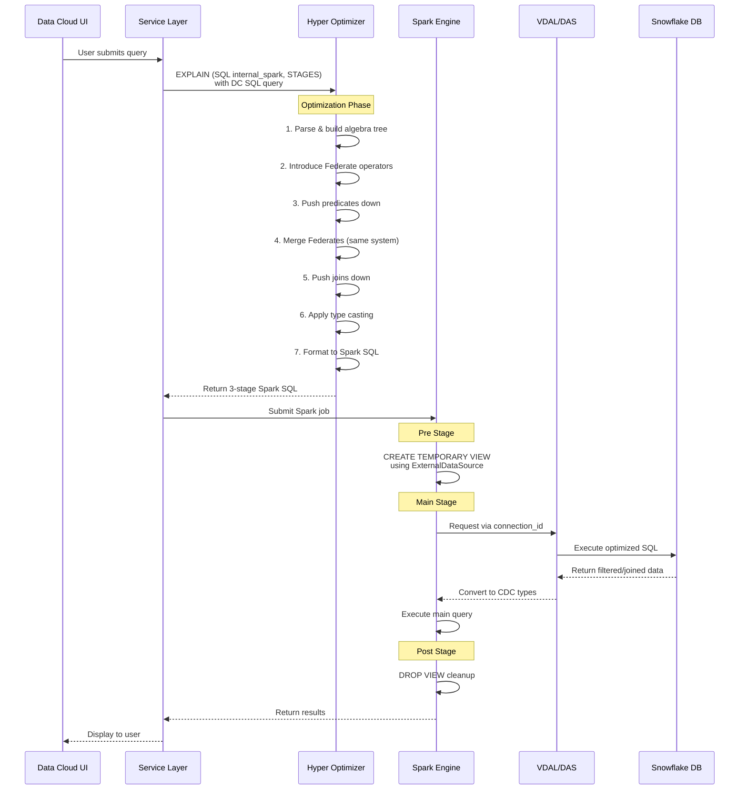
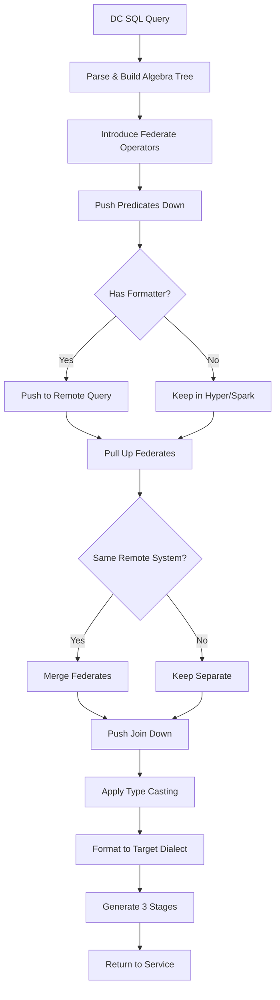
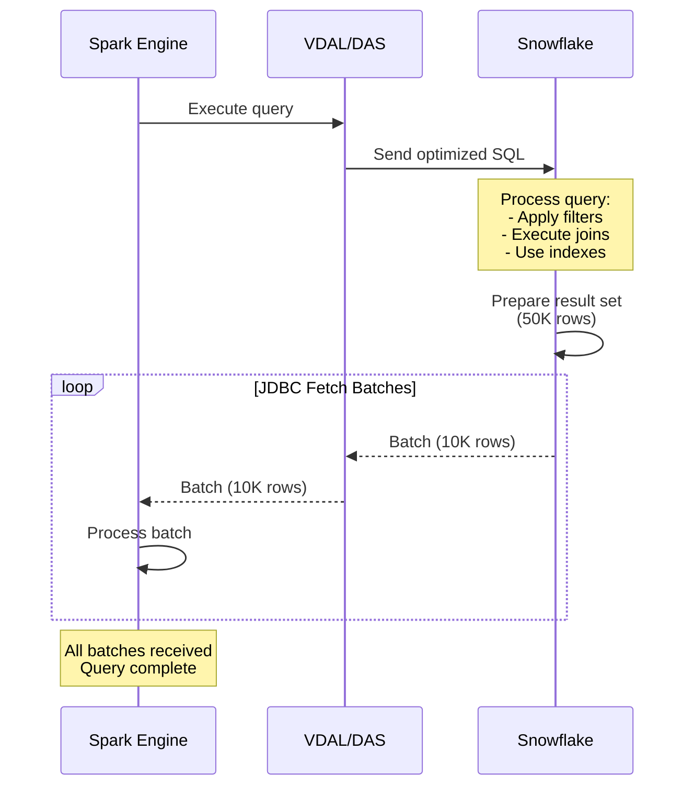

# Query Federation and Pushdown in Salesforce Data Cloud

## Overview

This document explains how Salesforce Data Cloud executes queries efficiently across multiple cloud data lakes using advanced query federation and pushdown capabilities. The core principle is simple: **move as little data as possible between lakes**.

## Table of Contents

- [Architecture Overview](#architecture-overview)
- [Key Concepts](#key-concepts)
- [Query Flow](#query-flow)
- [Optimization Process](#optimization-process)
- [Implementation Tiers](#implementation-tiers)
- [Technical Deep Dive](#technical-deep-dive)
- [Examples](#examples)

## Architecture Overview

The system uses **Hyper Optimizer as a Service** to centralize query optimization logic. Instead of implementing pushdown in multiple engines, Hyper optimizes queries once and shares optimizations with Trino, Spark, and other engines.

```
┌─────────────────┐
│  Data Cloud UI  │
└────────┬────────┘
         │
         ▼
┌─────────────────┐
│ Service Layer   │  (Segmentation, CI, etc.)
└────────┬────────┘
         │ DC SQL
         ▼
┌─────────────────┐
│ Hyper Optimizer │  Query optimization & pushdown logic
└────────┬────────┘
         │ Spark SQL (3 stages)
         ▼
┌─────────────────┐
│  Spark Engine   │  Execution orchestration
└────────┬────────┘
         │
         ▼
┌─────────────────┐
│  VDAL/DAS       │  Data Access Layer
└────────┬────────┘
         │
         ▼
┌─────────────────┐
│ Remote Database │  (Snowflake, Databricks, BigQuery, etc.)
└─────────────────┘
```

## Key Concepts

### Federate Operators

Special algebra operators that mark boundaries between:
- Operations executed locally (in Hyper/Spark)
- Operations pushed to remote systems (Snowflake, etc.)

During optimization, Hyper:
1. Introduces Federate operators above foreign table scans
2. Pushes predicates through Federate operators when possible
3. Pulls up and merges Federates for the same remote system
4. Pushes joins down when tables are on the same system

### Three-Stage Execution Model

Hyper returns queries in three stages:

- **Pre Stage**: Setup temporary views connecting to remote systems
- **Main Stage**: Execute the actual query referencing those views
- **Post Stage**: Cleanup temporary views

### ExternalDataSource

Spark connector that bridges to remote systems with these options:

- `connection_id` + `tenant_id`: Authentication credentials
- `query`: The optimized SQL for the remote system
- `referenced_table_descriptors`: Schema metadata
- `result_columns`: Expected output schema

## Key Terms Explained

Before diving into the query flow, let's clarify essential concepts:

### Service Layer

The **Service Layer** refers to the application services in Salesforce Data Cloud that initiate queries:

- **Segmentation Service**: Creates audience segments based on criteria
- **Activation Service**: Pushes segments to external destinations
- **Calculated Insights (CI)**: Computes metrics and KPIs
- **Query Service**: Handles direct SQL queries from users

These services sit between the UI and the query execution engines (Hyper, Spark, Trino).

### Algebra Tree

An **Algebra Tree** (or query plan) is an internal representation of a SQL query as a tree structure where:

- **Leaf nodes** = Table scans (reading data from tables)
- **Internal nodes** = Operations (filters, joins, aggregations, projections)
- **Root node** = Final result

**Example Query:**
```sql
SELECT name, salary 
FROM employees 
WHERE department = 'Engineering' 
  AND salary > 100000
```

**Algebra Tree:**
```
        Project(name, salary)
                |
           Filter(salary > 100000)
                |
           Filter(department = 'Engineering')
                |
           Scan(employees)
```

The optimizer transforms this tree to find the most efficient execution plan.

### Push Predicates Down

**"Pushing predicates down"** means moving filter conditions (WHERE clauses) as close to the data source as possible, ideally into the remote database query itself.

**Before pushdown:**
```
1. Read ALL rows from Snowflake → 1 million rows transferred
2. Transfer to Spark
3. Apply filter in Spark → 1,000 rows remain
4. Return result
```

**After pushdown:**
```
1. Send filter to Snowflake
2. Snowflake filters internally → 1,000 rows
3. Transfer only 1,000 rows to Spark
4. Return result
```

**Benefit**: Transfer 1,000 rows instead of 1 million rows (99.9% reduction!)

### Merge Federates (Same System)

A **Federate** is a marker in the algebra tree that says "everything below this point runs on remote system X."

**"Same system"** means the same physical database instance:
- ✓ Two tables both in **Snowflake account ABC** = same system
- ✗ One table in **Snowflake**, another in **Databricks** = different systems

**Merging Federates** combines multiple operations into a single remote query:

**Before merge (2 separate queries to Snowflake):**
```
Federate(Snowflake) → Scan(customers)
Federate(Snowflake) → Scan(orders)
Join in Spark
```
Requires: Transfer customers + orders to Spark, join locally

**After merge (1 query to Snowflake):**
```
Federate(Snowflake) 
  → Join(customers, orders)
```
Requires: Join happens in Snowflake, transfer only result

### Push Joins Down

**"Pushing joins down"** means executing the join operation inside the remote database instead of in Spark/Hyper.

**Without join pushdown:**
```
1. Query Snowflake: SELECT * FROM customers → 100K rows transferred
2. Query Snowflake: SELECT * FROM orders → 500K rows transferred
3. Join in Spark: customers ⋈ orders → 50K results
Total transfer: 600K rows
```

**With join pushdown:**
```
1. Query Snowflake: 
   SELECT * FROM customers c 
   JOIN orders o ON c.id = o.customer_id
   → 50K rows transferred
Total transfer: 50K rows
```

**Benefit**: Transfer 50K instead of 600K rows (92% reduction!)

### System Boundaries

**Different systems** that cannot have operations pushed down together:
- Snowflake ↔ Databricks
- BigQuery ↔ Redshift
- Snowflake account A ↔ Snowflake account B
- Remote table ↔ Data Cloud native table

**Same system** where operations CAN be pushed down together:
- Table1 in Snowflake ↔ Table2 in Snowflake (same account/connection)
- Table1 in Databricks ↔ Table2 in Databricks (same workspace)

## Query Flow



## Optimization Process

### 1. Predicate Pushdown

Filters are pushed through Federate operators into the remote query:

**Before:**
```sql
SELECT * FROM remote_table WHERE category = 'A'
```

**After (pushed to Snowflake):**
```sql
SELECT * FROM "table" WHERE "category" = 'A'
```

### 2. Join Pushdown

Joins between tables on the same remote system are pushed down:

**Before:**
```sql
SELECT t1.col, t2.col
FROM snowflake_1 t1
JOIN snowflake_2 t2 ON t1.id = t2.id
WHERE t1.category = 'A' AND t2.category = 'B'
```

**After (pushed to Snowflake):**
```sql
SELECT "t1"."col", "t2"."col"
FROM (
  SELECT "id", "col" FROM "table1" 
  WHERE "category" = 'A'
) AS "t1"
INNER JOIN (
  SELECT "id", "col" FROM "table2"
  WHERE "category" = 'B'
) AS "t2"
ON "t1"."id" = "t2"."id"
```

### 3. Type Casting

To ensure semantic consistency, columns are cast to match CDP types:

```sql
-- Remote system has INTEGER, but CDP uses DECIMAL(38,18)
SELECT CAST(int_col AS NUMBER(38,18)) / 2
FROM remote_table
WHERE CAST(int_col AS NUMBER(38,18)) < 1000
```

## Implementation Tiers

### Gold Tier (Current: 252/254)

Service writes DC SQL explicitly and sends to Hyper.

```
Service → DC SQL → Hyper EXPLAIN → Spark SQL → Spark Job
```

**Use case**: Segmentation Materialization & Activation

### Silver Tier (Planned: 254+)

Library translates source dialect to DC SQL.

```
Service → Library (Spark SQL → DC SQL) → Hyper EXPLAIN → Spark SQL → Spark Job
```

**Use case**: Calculated Insights

### Bronze Tier (Future: 256+)

Transparent integration via Spark Catalyst Extension.

```
Service → Spark SQL → Catalyst Extension → Hyper EXPLAIN → Modified Spark Plan
```

**Use case**: Existing Spark jobs without code changes

## Technical Deep Dive

### Optimization Flow Diagram



### Supported Operations (252/254)

| SQL Construct | DBX | Redshift | GBQ | Snowflake | Spark |
|--------------|-----|----------|-----|-----------|-------|
| WHERE, HAVING | ✓ | ✓ | ✓ | ✓ | ✓ |
| INNER JOIN | ✓ | ✓ | ✓ | ✓ | ✓ |
| OUTER JOINS | ✓ | ✓ | ✓ | ✓ | ✓ |
| LIMIT/OFFSET | ✓ | ✓ | ✓ | ✓ | ✓ |
| GROUP BY | 254 | 254 | 254 | 254 | ✓ |
| DISTINCT | 254 | 254 | 254 | 254 | ✓ |
| UNION/INTERSECT | 254 | 254 | 254 | 254 | ✓ |

### Supported Expressions

| Expression | Status |
|-----------|--------|
| =, !=, >, >=, <, <= | ✓ |
| AND, OR, NOT | ✓ |
| IS NULL, IS NOT NULL | ✓ |
| IN, BETWEEN | ✓ |
| LIKE, ILIKE | ✓ |
| CASE WHEN | ✓ |
| UPPER, LOWER, SUBSTRING | ✓ |
| COUNT, MIN, MAX | ✓ |
| SUM, AVG | Planned 252/254 |
| CAST | Planned 252/254 |

## Examples

### Example 1: Simple Filter Pushdown

**Input Query:**
```sql
SELECT id, latitude
FROM demo_databricks_1
WHERE latitude >= 0
```

**Generated Spark SQL (Pre Stage):**
```sql
CREATE TEMPORARY VIEW temp_view_1
USING com.salesforce.cdp.datasource.external.reader.ExternalDataSource
OPTIONS (
  connection_id 'xxx-xxx-xxx',
  tenant_id 'a360/tenant/id',
  query 'SELECT `id`, `latitude` 
         FROM `database`.`schema`.`table`
         WHERE (`latitude` >= 0) AND (`latitude` IS NOT NULL)',
  referenced_table_descriptors '{"referenced_table_descriptors":[...]}',
  result_columns '{"result_columns":[...]}'
)
```

**Generated Spark SQL (Main Stage):**
```sql
SELECT `id`, `latitude`
FROM temp_view_1
```

**Generated Spark SQL (Post Stage):**
```sql
DROP VIEW IF EXISTS temp_view_1
```

### Example 2: Join Pushdown

**Input Query:**
```sql
SELECT t1.cost, t2.cost
FROM snowflake_1 t1
JOIN snowflake_2 t2 ON t1.id = t2.id
WHERE t1.category = 'A' AND t2.category = 'B'
```

**Pushed to Snowflake:**
```sql
SELECT "t1"."cost", "t1"."id", "t2"."cost"
FROM (
  SELECT "cost", "id" FROM "table1" WHERE "category" = 'A'
) AS "t1"
INNER JOIN (
  SELECT "cost", "id" FROM "table2" WHERE "category" = 'B'
) AS "t2"
ON "t1"."id" = "t2"."id"
```

**Result**: Both filters and the join execute in Snowflake, minimizing data transfer.

## Configuration & Settings

### Pushdown Mode

Controls what gets pushed down to remote systems:

- `no_pushdown` (strict): Nothing pushed down - debug only
- `filter_only_pushdown` (strict): Only simple filters - debug only
- `strict` (default): All stable, strict pushdowns (current GA)
- `full_pushdown`: Includes non-strict operations (Segmentation use case)

### Feature Flags

- `join_federation`: Enable/disable join pushdown (safety setting)
- `federation_aware_reordering`: Group joins on same system during optimization

## Performance Impact

### TPC-DS 1GB Benchmark (Snowflake)

**Before optimization**: 10 seconds (geomean)  
**After optimization**: 3.6 seconds (geomean)

**~64% improvement** from pushdown capabilities

## Code Repositories

| Repository | Purpose | Team Contact |
|-----------|---------|--------------|
| `a360/cdp-spark-core` | ExternalDataSource implementation | Dharam Sahoo, Pradeep Panchumarthi |
| `a360/segmentation-engine` | DC SQL generation & Hyper integration | Deepak Pushpakar, Sameer Pandit |
| `a360/cdp-segmentation-spark-job` | Spark job execution | Deepak Pushpakar, Sameer Pandit |

## Roadmap

### 252 (Current)
- ✓ Gold Tier for Segmentation Materialization
- ✓ Filter and Join pushdown
- ✓ Support for Snowflake, Databricks, BigQuery, Redshift

### 254 (In Progress)
- Aggregation pushdown (SUM, AVG, GROUP BY)
- Silver Tier implementation
- Calculated Insights support
- Additional expressions (CAST, date functions, arithmetic)
- Table statistics for better join optimization

### 256+ (Future)
- Bronze Tier (transparent Catalyst integration)
- Window functions
- Regex functions
- Push local data to remote systems as temp tables

## Monitoring & Debugging

### Current Monitoring

- GRPC errors from DAS to Hyper
- FIT test results (30 tests covering major use cases)
- Manual Splunk checks for warnings/errors
- Query tags for BYOL-related queries

### Planned (254+)

- P95 latency metrics for all BYOL queries
- DAS throughput dashboard
- Dedicated error codes for formatting errors
- Usage lake queries for pushdown inhibitors

## Testing Strategy

Five test targets cover different aspects:

- **Target A**: EXPLAIN contract with Hyper
- **Target B**: Fine-grained optimization verification
- **Target C**: End-to-end Spark job execution
- **Target D**: Spark SQL statement execution
- **Target E**: VDAL connectivity


## What Happens When a Large Dataset Is Returned?

### Understanding Data Transfer in Query Federation

The federation architecture optimizes queries **before** data movement occurs, not during retrieval. The primary goal is to reduce the volume of data that needs to be transferred across the network.

### Scenario: 20 Million Rows Selected

#### Without Optimization (Pre-252 Behavior)

**Query:**
```sql
SELECT customer_id, order_total
FROM snowflake_orders
WHERE order_date >= '2024-01-01' 
  AND status = 'COMPLETED'
  AND order_total > 1000
```

**Execution Flow:**
```
1. Spark → Snowflake: "SELECT * FROM orders"
2. Snowflake returns: ALL 20 million rows
3. Network transfer: 20M rows from Snowflake to Spark
4. Spark applies filters in memory
5. Final result: 50,000 rows after filtering
```

**Impact:**
- **Data transferred:** 20 million rows
- **Network bottleneck:** Severe
- **Processing time:** High (dominated by data transfer)
- **Resource usage:** Excessive memory in Spark

#### With Pushdown Optimization (252+ Behavior)

**Same Query, Optimized:**

**Execution Flow:**
```
1. Service sends DC SQL to Hyper
2. Hyper optimizes: pushes filters down
3. Hyper generates Spark SQL with embedded Snowflake query
4. Spark → Snowflake via VDAL:
   SELECT customer_id, order_total
   FROM orders
   WHERE order_date >= '2024-01-01'
     AND status = 'COMPLETED'
     AND order_total > 1000
5. Snowflake executes filters internally:
   - Uses indexes
   - Leverages partitioning
   - Applies predicate evaluation
6. Snowflake returns: 50,000 pre-filtered rows
7. Network transfer: Only 50K rows
```

**Impact:**
- **Data transferred:** 50,000 rows (400× reduction)
- **Network bottleneck:** Minimized
- **Processing time:** Much faster
- **Resource usage:** Efficient

### Data Retrieval Mechanisms

#### JDBC/ODBC Batching

When results must be transferred, standard database connectivity mechanisms handle the streaming:



**Key Points:**
- VDAL uses JDBC/ODBC connectors to remote databases
- Results are fetched in batches (typically 10,000-100,000 rows per batch)
- This is connection-level batching, not query-level optimization
- Batching helps with memory management but doesn't reduce total transfer

#### No Lazy Evaluation at Query Level

The document does not describe lazy evaluation or streaming query execution. The optimization approach is:

1. **Optimize first** - Determine what data is truly needed
2. **Execute once** - Send the complete optimized query to the remote system
3. **Transfer results** - Retrieve filtered/joined/aggregated results in JDBC batches

### Optimization Impact on Data Volume

| Optimization Level | Input Rows | Operations | Output Rows | Data Transferred |
|-------------------|-----------|------------|-------------|------------------|
| None | 20M | None | 20M → 50K | 20M rows |
| Filter pushdown | 20M | Filter remote | 50K | 50K rows |
| Filter + Join pushdown | 20M + 20M (2 tables) | Filter + Join remote | 50K | 50K rows |
| Full pushdown + Aggregation | 20M + 20M | Filter + Join + Aggregate | 100 rows | 100 rows |

### When Pushdown Cannot Help

Some queries genuinely require transferring large datasets:

#### Case 1: Machine Learning Data Export
```sql
-- Need all rows for model training
SELECT * FROM customer_events
WHERE event_date >= '2024-01-01'
-- Result: 20M rows needed for ML pipeline
```

#### Case 2: Full Table Migration
```sql
-- Moving data between systems
SELECT * FROM legacy_system_table
-- Result: All 20M rows must be transferred
```

#### Case 3: Complex Aggregations Not Supported
```sql
-- Advanced analytics requiring custom UDFs
SELECT customer_id, custom_aggregation_function(events)
FROM events
GROUP BY customer_id
-- Result: Cannot push down custom UDF, may need raw data
```

**In these scenarios:**
1. JDBC batching manages memory (10K-100K rows per fetch)
2. Spark's distributed processing handles the volume across workers
3. Network transfer time remains unavoidable
4. Consider alternative strategies:
   - Pre-materialization in the remote system
   - Incremental processing (partition by date)
   - Sampling for exploratory analysis
   - Using remote compute (e.g., Snowflake UDFs) when possible

### Performance Benchmarks

From the document's TPC-DS 1GB benchmark on Snowflake:

**Before Pushdown Optimization:**
- Geomean execution time: 10 seconds
- Full table scans transferred to Hyper

**After Pushdown Optimization:**
- Geomean execution time: 3.6 seconds
- Filters and joins executed in Snowflake
- **Performance improvement: 64%**

This improvement stems primarily from reduced data transfer volume, not from streaming mechanisms.

### Best Practices for Large Datasets

1. **Leverage Filters Early**
   - Apply date ranges, status filters, and categorical filters
   - These typically reduce data volume by 90%+

2. **Use Aggregations When Possible**
   ```sql
   -- Instead of: SELECT * FROM orders (20M rows)
   -- Use: SELECT date, SUM(amount) FROM orders GROUP BY date (365 rows)
   ```

3. **Project Only Needed Columns**
   ```sql
   -- Instead of: SELECT * (50 columns)
   -- Use: SELECT customer_id, order_total (2 columns)
   ```

4. **Partition Large Queries**
   ```sql
   -- Process by month instead of all at once
   SELECT * FROM orders 
   WHERE order_date BETWEEN '2024-01-01' AND '2024-01-31'
   ```

5. **Monitor Pushdown Success**
   - Check Hyper query logs for "pushdown-inhibitors"
   - Verify filters and joins are pushed to remote systems
   - Use EXPLAIN to see optimization results

### Memory and Resource Considerations

**Spark Memory Management:**
- Spark distributes data across worker nodes
- Each worker processes batches independently
- Spills to disk if memory exceeded
- Configured via `spark.executor.memory` and `spark.driver.memory`

**VDAL Connection Pooling:**
- Maintains connection pools to remote systems
- Reuses connections for multiple queries
- Handles connection failures and retries
- Configured per connection in Data Cloud settings

**Network Bandwidth:**
- Primary bottleneck for large transfers
- Typically 1-10 Gbps between cloud regions
- Cross-cloud transfers (AWS → Azure) are slower
- Same-region transfers are optimal


## References

- [252] Query Pushdown for Federated Queries in Spark
- [250++] Live SQL Federation in Hyper
- [254] BYOL 2.0 - Application Integrations
- [254] DC Morpho: New operators & functions

---

**Document Version**: Based on July 2024 specification  
**Authors**: Jonas Kammerer, André Kohn