# Query Federation and Pushdown in Salesforce Data Cloud

## Overview

This document explains how Salesforce Data Cloud executes queries efficiently across multiple cloud data lakes using advanced query federation and pushdown capabilities. The core principle is simple: **move as little data as possible between lakes**.

## Table of Contents

- [Architecture Overview](#architecture-overview)
- [Key Concepts](#key-concepts)
- [Query Flow](#query-flow)
- [Optimization Process](#optimization-process)
- [Implementation Tiers](#implementation-tiers)
- [Technical Deep Dive](#technical-deep-dive)
- [Examples](#examples)

## Architecture Overview

The system uses **Hyper Optimizer as a Service** to centralize query optimization logic. Instead of implementing pushdown in multiple engines, Hyper optimizes queries once and shares optimizations with Trino, Spark, and other engines.

```
┌─────────────────┐
│  Data Cloud UI  │
└────────┬────────┘
         │
         ▼
┌─────────────────┐
│ Service Layer   │  (Segmentation, CI, etc.)
└────────┬────────┘
         │ DC SQL
         ▼
┌─────────────────┐
│ Hyper Optimizer │  Query optimization & pushdown logic
└────────┬────────┘
         │ Spark SQL (3 stages)
         ▼
┌─────────────────┐
│  Spark Engine   │  Execution orchestration
└────────┬────────┘
         │
         ▼
┌─────────────────┐
│  VDAL/DAS       │  Data Access Layer
└────────┬────────┘
         │
         ▼
┌─────────────────┐
│ Remote Database │  (Snowflake, Databricks, BigQuery, etc.)
└─────────────────┘
```

## Key Concepts

### Federate Operators

Special algebra operators that mark boundaries between:
- Operations executed locally (in Hyper/Spark)
- Operations pushed to remote systems (Snowflake, etc.)

During optimization, Hyper:
1. Introduces Federate operators above foreign table scans
2. Pushes predicates through Federate operators when possible
3. Pulls up and merges Federates for the same remote system
4. Pushes joins down when tables are on the same system

### Three-Stage Execution Model

Hyper returns queries in three stages:

- **Pre Stage**: Setup temporary views connecting to remote systems
- **Main Stage**: Execute the actual query referencing those views
- **Post Stage**: Cleanup temporary views

### ExternalDataSource

Spark connector that bridges to remote systems with these options:

- `connection_id` + `tenant_id`: Authentication credentials
- `query`: The optimized SQL for the remote system
- `referenced_table_descriptors`: Schema metadata
- `result_columns`: Expected output schema

## Query Flow


## Optimization Process

### 1. Predicate Pushdown

Filters are pushed through Federate operators into the remote query:

**Before:**
```sql
SELECT * FROM remote_table WHERE category = 'A'
```

**After (pushed to Snowflake):**
```sql
SELECT * FROM "table" WHERE "category" = 'A'
```

### 2. Join Pushdown

Joins between tables on the same remote system are pushed down:

**Before:**
```sql
SELECT t1.col, t2.col
FROM snowflake_1 t1
JOIN snowflake_2 t2 ON t1.id = t2.id
WHERE t1.category = 'A' AND t2.category = 'B'
```

**After (pushed to Snowflake):**
```sql
SELECT "t1"."col", "t2"."col"
FROM (
  SELECT "id", "col" FROM "table1" 
  WHERE "category" = 'A'
) AS "t1"
INNER JOIN (
  SELECT "id", "col" FROM "table2"
  WHERE "category" = 'B'
) AS "t2"
ON "t1"."id" = "t2"."id"
```

### 3. Type Casting

To ensure semantic consistency, columns are cast to match CDP types:

```sql
-- Remote system has INTEGER, but CDP uses DECIMAL(38,18)
SELECT CAST(int_col AS NUMBER(38,18)) / 2
FROM remote_table
WHERE CAST(int_col AS NUMBER(38,18)) < 1000
```

## Implementation Tiers

### Gold Tier (Current: 252/254)

Service writes DC SQL explicitly and sends to Hyper.

```
Service → DC SQL → Hyper EXPLAIN → Spark SQL → Spark Job
```

**Use case**: Segmentation Materialization & Activation

### Silver Tier (Planned: 254+)

Library translates source dialect to DC SQL.

```
Service → Library (Spark SQL → DC SQL) → Hyper EXPLAIN → Spark SQL → Spark Job
```

**Use case**: Calculated Insights

### Bronze Tier (Future: 256+)

Transparent integration via Spark Catalyst Extension.

```
Service → Spark SQL → Catalyst Extension → Hyper EXPLAIN → Modified Spark Plan
```

**Use case**: Existing Spark jobs without code changes

## Technical Deep Dive

### Optimization Flow Diagram

```mermaid
graph TD
    A[🔍 DC SQL Query] --> B[📝 Parse & Build Algebra Tree]
    B --> C[🔌 Introduce Federate Operators]
    C --> D[⬇️ Push Predicates Down]
    D --> E{🔍 Has Formatter?}
    E -->|Yes| F[🌐 Push to Remote Query]
    E -->|No| G[🏠 Keep in Hyper/Spark]
    F --> H[⬆️ Pull Up Federates]
    G --> H
    H --> I{🔗 Same Remote System?}
    I -->|Yes| J[🔄 Merge Federates]
    I -->|No| K[↔️ Keep Separate]
    J --> L[🤝 Push Join Down]
    K --> L
    L --> M[🔄 Apply Type Casting]
    M --> N[📋 Format to Target Dialect]
    N --> O[🎯 Generate 3 Stages]
    O --> P[📤 Return to Service]

    %% Color coding by operation type
    classDef input fill:#e3f2fd,stroke:#1976d2,stroke-width:2px
    classDef parsing fill:#fff3e0,stroke:#f57c00,stroke-width:2px
    classDef federation fill:#f3e5f5,stroke:#7b1fa2,stroke-width:2px
    classDef optimization fill:#e8f5e8,stroke:#388e3c,stroke-width:2px
    classDef decision fill:#fff8e1,stroke:#fbc02d,stroke-width:2px
    classDef output fill:#ffebee,stroke:#d32f2f,stroke-width:2px

    class A input
    class B,M,N parsing
    class C,F,G,H,J,K federation
    class D,L optimization
    class E,I decision
    class O,P output
```



#### Optimization Flow Color Legend

| Color | Type | Description |
|-------|------|-------------|
| 🔵 Blue | Input | Initial query and user inputs |
| 🟠 Orange | Parsing | SQL parsing, type casting, and formatting operations |
| 🟣 Purple | Federation | Federation-related operations (introduce, merge, pull up) |
| 🟢 Green | Optimization | Core optimization operations (predicate and join pushdown) |
| 🟡 Yellow | Decision | Decision points in the optimization flow |
| 🔴 Red | Output | Final output generation and service communication |

### Supported Operations (252/254)

| SQL Construct | DBX | Redshift | GBQ | Snowflake | Spark |
|--------------|-----|----------|-----|-----------|-------|
| WHERE, HAVING | ✓ | ✓ | ✓ | ✓ | ✓ |
| INNER JOIN | ✓ | ✓ | ✓ | ✓ | ✓ |
| OUTER JOINS | ✓ | ✓ | ✓ | ✓ | ✓ |
| LIMIT/OFFSET | ✓ | ✓ | ✓ | ✓ | ✓ |
| GROUP BY | 254 | 254 | 254 | 254 | ✓ |
| DISTINCT | 254 | 254 | 254 | 254 | ✓ |
| UNION/INTERSECT | 254 | 254 | 254 | 254 | ✓ |

### Supported Expressions

| Expression | Status |
|-----------|--------|
| =, !=, >, >=, <, <= | ✓ |
| AND, OR, NOT | ✓ |
| IS NULL, IS NOT NULL | ✓ |
| IN, BETWEEN | ✓ |
| LIKE, ILIKE | ✓ |
| CASE WHEN | ✓ |
| UPPER, LOWER, SUBSTRING | ✓ |
| COUNT, MIN, MAX | ✓ |
| SUM, AVG | Planned 252/254 |
| CAST | Planned 252/254 |

## Examples

### Example 1: Simple Filter Pushdown

**Input Query:**
```sql
SELECT id, latitude
FROM demo_databricks_1
WHERE latitude >= 0
```

**Generated Spark SQL (Pre Stage):**
```sql
CREATE TEMPORARY VIEW temp_view_1
USING com.salesforce.cdp.datasource.external.reader.ExternalDataSource
OPTIONS (
  connection_id 'xxx-xxx-xxx',
  tenant_id 'a360/tenant/id',
  query 'SELECT `id`, `latitude` 
         FROM `database`.`schema`.`table`
         WHERE (`latitude` >= 0) AND (`latitude` IS NOT NULL)',
  referenced_table_descriptors '{"referenced_table_descriptors":[...]}',
  result_columns '{"result_columns":[...]}'
)
```

**Generated Spark SQL (Main Stage):**
```sql
SELECT `id`, `latitude`
FROM temp_view_1
```

**Generated Spark SQL (Post Stage):**
```sql
DROP VIEW IF EXISTS temp_view_1
```

### Example 2: Join Pushdown

**Input Query:**
```sql
SELECT t1.cost, t2.cost
FROM snowflake_1 t1
JOIN snowflake_2 t2 ON t1.id = t2.id
WHERE t1.category = 'A' AND t2.category = 'B'
```

**Pushed to Snowflake:**
```sql
SELECT "t1"."cost", "t1"."id", "t2"."cost"
FROM (
  SELECT "cost", "id" FROM "table1" WHERE "category" = 'A'
) AS "t1"
INNER JOIN (
  SELECT "cost", "id" FROM "table2" WHERE "category" = 'B'
) AS "t2"
ON "t1"."id" = "t2"."id"
```

**Result**: Both filters and the join execute in Snowflake, minimizing data transfer.

## Configuration & Settings

### Pushdown Mode

Controls what gets pushed down to remote systems:

- `no_pushdown` (strict): Nothing pushed down - debug only
- `filter_only_pushdown` (strict): Only simple filters - debug only
- `strict` (default): All stable, strict pushdowns (current GA)
- `full_pushdown`: Includes non-strict operations (Segmentation use case)

### Feature Flags

- `join_federation`: Enable/disable join pushdown (safety setting)
- `federation_aware_reordering`: Group joins on same system during optimization

## Performance Impact

### TPC-DS 1GB Benchmark (Snowflake)

**Before optimization**: 10 seconds (geomean)  
**After optimization**: 3.6 seconds (geomean)

**~64% improvement** from pushdown capabilities

## Code Repositories

| Repository | Purpose | Team Contact |
|-----------|---------|--------------|
| `a360/cdp-spark-core` | ExternalDataSource implementation | Dharam Sahoo, Pradeep Panchumarthi |
| `a360/segmentation-engine` | DC SQL generation & Hyper integration | Deepak Pushpakar, Sameer Pandit |
| `a360/cdp-segmentation-spark-job` | Spark job execution | Deepak Pushpakar, Sameer Pandit |

## Roadmap

### 252 (Current)
- ✓ Gold Tier for Segmentation Materialization
- ✓ Filter and Join pushdown
- ✓ Support for Snowflake, Databricks, BigQuery, Redshift

### 254 (In Progress)
- Aggregation pushdown (SUM, AVG, GROUP BY)
- Silver Tier implementation
- Calculated Insights support
- Additional expressions (CAST, date functions, arithmetic)
- Table statistics for better join optimization

### 256+ (Future)
- Bronze Tier (transparent Catalyst integration)
- Window functions
- Regex functions
- Push local data to remote systems as temp tables

## Monitoring & Debugging

### Current Monitoring

- GRPC errors from DAS to Hyper
- FIT test results (30 tests covering major use cases)
- Manual Splunk checks for warnings/errors
- Query tags for BYOL-related queries

### Planned (254+)

- P95 latency metrics for all BYOL queries
- DAS throughput dashboard
- Dedicated error codes for formatting errors
- Usage lake queries for pushdown inhibitors

## Testing Strategy

Five test targets cover different aspects:

- **Target A**: EXPLAIN contract with Hyper
- **Target B**: Fine-grained optimization verification
- **Target C**: End-to-end Spark job execution
- **Target D**: Spark SQL statement execution
- **Target E**: VDAL connectivity

## References

- [252] Query Pushdown for Federated Queries in Spark
- [250++] Live SQL Federation in Hyper
- [254] BYOL 2.0 - Application Integrations
- [254] DC Morpho: New operators & functions

---

**Document Version**: Based on July 2024 specification  
**Authors**: Jonas Kammerer, Andr