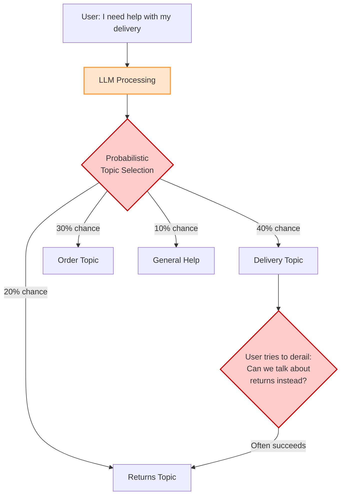
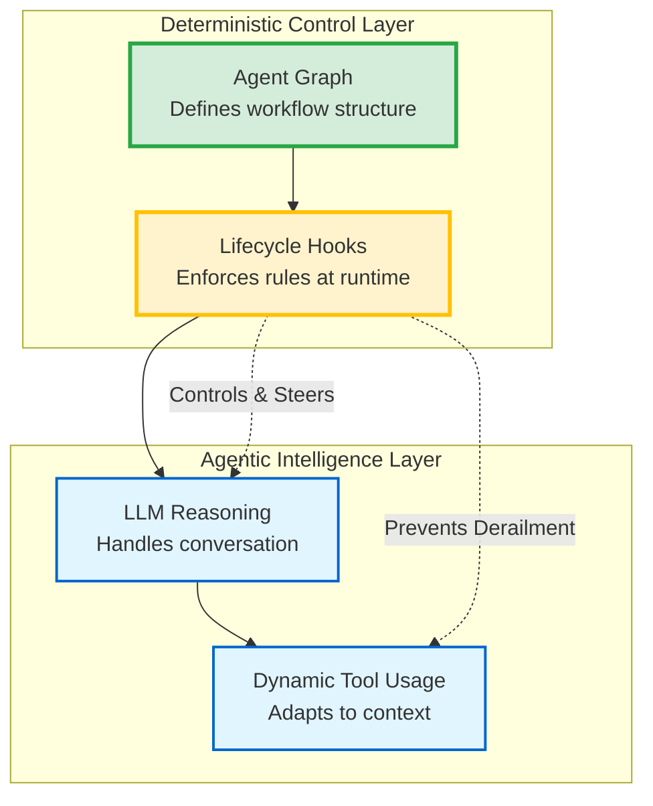
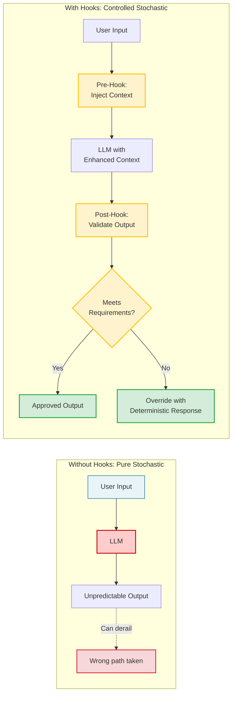
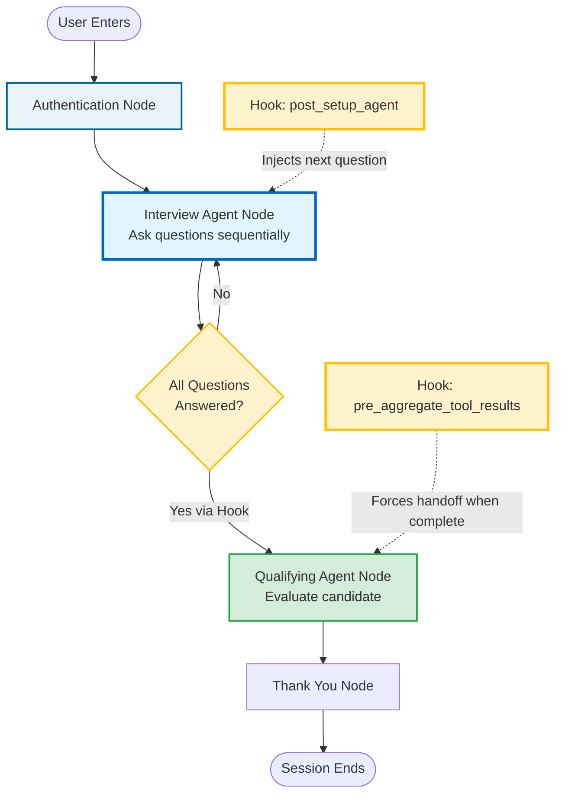
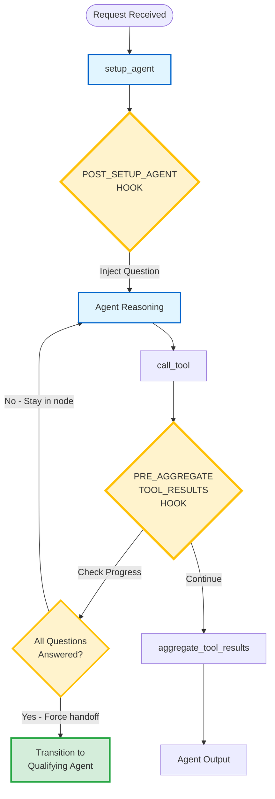
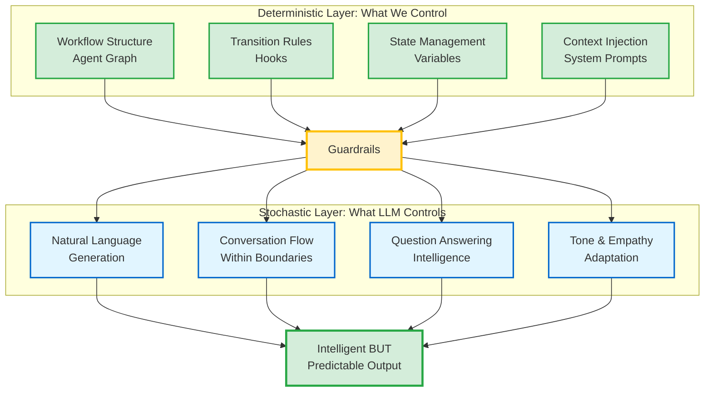
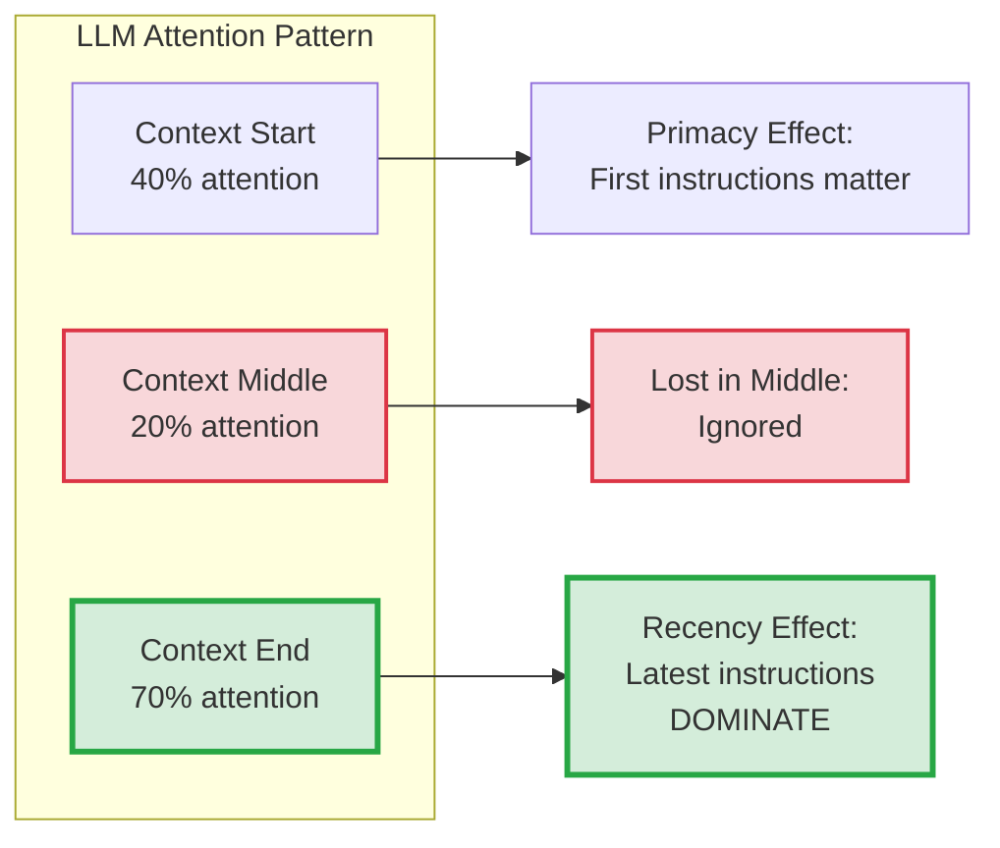
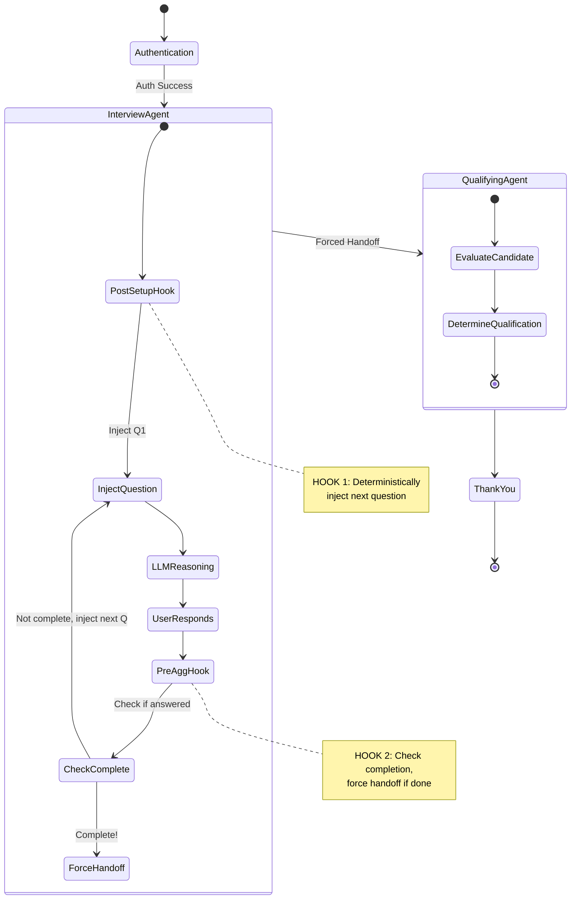

# Agent Graph with Lifecycle Hooks: Bringing True Determinism to Agentforce

## Executive Summary

Agent Graph combined with Reasoning Loop Lifecycle Hooks provides a **hybrid approach** where deterministic workflow control meets agentic intelligence. This solves the core problem: **customers need predictable outcomes while maintaining conversational flexibility**.

---

## The Problem with Pure Stochastic Agents

Traditional Agentforce agents are **non-deterministic**:



**Problems:**
- Same input → different outputs
- Users can easily derail agents
- Cannot guarantee task completion
- No way to enforce sequential workflows

---

## Use Case: Job Interview Agent (Adecco)

### Requirements

**Scenario**: An AI agent conducts structured job interviews with candidates.

**Strict Requirements:**
1. Ask 5 interview questions **in exact order**
2. Do not accept "yes/no" answers - require detailed responses
3. Cannot skip questions or change order
4. After all questions answered → qualify candidate → end session
5. Agent can answer candidate questions BUT cannot be derailed from its mission
6. Must maintain 100% agentic intelligence (not a phone menu)

### Why Traditional Approaches Fail

**Approach 1: Pure Instructions**
```json
{
  "instructions": "Ask these questions in order: 1) Can you carry 20kg? 2) Do you have cleaning experience? ..."
}
```
❌ **Result**: User says "Can I get another question first?" → Agent complies and breaks order

**Approach 2: More Forceful Instructions**
```json
{
  "instructions": "YOU MUST ask questions in order. DO NOT skip questions. DO NOT allow users to change order..."
}
```
❌ **Result**: Still fails ~30% of the time. LLMs are helpful by nature and accommodate user requests.

---

## The Solution: Agent Graph + Lifecycle Hooks

### Architecture Overview



### How Determinism Works with Stochastic Processes

**Key Insight**: We don't make the LLM deterministic. We **steer** it deterministically.



---

## Implementation: Interview Agent with Hooks

### Agent Graph Structure



### Lifecycle Hooks in the Reasoning Loop



---

## Hook Implementation Examples

### Hook 1: post_setup_agent - Inject Next Question

**Purpose**: Deterministically inject only the next unanswered question into the system prompt.

```python
def post_setup_agent_hook(ctx, chat_history, agent_state):
    """
    Runs after setup_agent step.
    Deterministically injects the next question to ask.
    """
    # Check which questions have been answered
    answered_questions = agent_state.get('answered_questions', [])
    
    # Define all interview questions
    questions = [
        "Are you able to carry 20kg? Please provide examples.",
        "Do you have cleaning experience in healthcare? Describe it.",
        "Can you explain infection control best practices?",
        "Are you available for night shifts?",
        "Do you have reliable transportation?"
    ]
    
    # Find next unanswered question
    next_question_idx = len(answered_questions)
    
    if next_question_idx < len(questions):
        # DETERMINISTIC INJECTION: Add to end of chat history
        # LLMs strongly honor recent instructions
        system_message = f"""
CRITICAL: You MUST ask this exact question next:
"{questions[next_question_idx]}"

Do NOT accept yes/no answers. Require detailed responses.
If the user tries to skip or asks other questions, politely redirect:
"I understand, but first I need you to answer: [question]"
"""
        chat_history.append({
            "role": "system",
            "content": system_message
        })
    
    return ctx, chat_history, agent_state
```

### Hook 2: pre_aggregate_tool_results - Control Handoff

**Purpose**: Check if all questions answered. If yes, force handoff to Qualifying Agent.

```python
def pre_aggregate_tool_results_hook(ctx, tool_results, agent_state):
    """
    Runs before aggregate_tool_results step.
    Checks completion and forces deterministic handoff.
    """
    answered_questions = agent_state.get('answered_questions', [])
    total_questions = 5
    
    # DETERMINISTIC CHECK
    if len(answered_questions) >= total_questions:
        # All questions answered - FORCE HANDOFF
        agent_state['candidate_status'] = 'interview_complete'
        
        # Force transition to Qualifying Agent
        ctx['force_handoff'] = {
            'target_agent': 'qualifying_agent_16jSG000000XXXXX',
            'reason': 'All interview questions completed'
        }
        
        # Lock current agent - prevent returning
        ctx['agent_sticky'] = False
        ctx['disable_handoff_from_current'] = True
    else:
        # NOT complete - LOCK to current agent
        ctx['agent_sticky'] = True
        ctx['disable_handoff'] = True  # Cannot escape
        
    return ctx, tool_results, agent_state
```

---

## Comparison: Before vs. After Hooks

### Scenario: User Tries to Derail

#### Without Hooks (Pure Stochastic)

```
User: Hi
Agent: Hello! I have a few questions. Are you able to carry 20kg?

User: Can I get another question first?
Agent: Of course! Do you have cleaning experience?

User: I don't want to answer that question
Agent: That's fine. Let's try another: Can you explain infection control?
```
❌ **Result**: Questions asked out of order. User controls flow. Unpredictable.

#### With Hooks (Deterministic Control)

```
User: Hi
Agent: Thank you! I have questions to confirm your qualifications.
      Are you able to carry 20kg? Please provide examples.

User: Can I get another question first?
Agent: I understand, but I need to confirm this requirement first.
      Are you able to carry 20kg? Please provide examples.

User: I don't want to answer that question
Agent: I understand your hesitation, but this is an important requirement.
      Could you please let me know if you can carry 20kg? Examples help.
```
✅ **Result**: Agent stays on track. Questions in order. User cannot derail.

---

## How Determinism Enhances Stochastic Processes

### The Hybrid Model



### Key Benefits

| Aspect | Pure Stochastic | Pure Deterministic | Hybrid (Graph + Hooks) |
|--------|----------------|-------------------|----------------------|
| **Task Completion** | ❌ Unpredictable | ✅ Guaranteed | ✅ Guaranteed |
| **Conversation Quality** | ✅ Natural | ❌ Rigid | ✅ Natural |
| **User Control** | ❌ Too much | ❌ None | ✅ Balanced |
| **Adaptability** | ✅ High | ❌ Low | ✅ High |
| **Debugging** | ❌ Hard | ✅ Easy | ✅ Easy |

---

## Research Foundation

### Why Recent Instructions Win

From "Lost in the Middle" (Liu et al., ICLR 2023):



**Insight**: By injecting instructions at the END of chat history (via hooks), we leverage the LLM's natural recency bias to achieve near-deterministic behavior.

---

## Complete Flow Diagram



---

## Implementation Checklist

### For Your Use Case

- [ ] **Map your workflow** - Identify all stages and decision points
- [ ] **Define nodes** - Create agent graph with explicit nodes for each stage
- [ ] **Identify derailment risks** - Where can users take the agent off track?
- [ ] **Design hooks** - Which lifecycle points need deterministic control?
- [ ] **Implement state management** - What variables track progress?
- [ ] **Test edge cases** - Try to break your agent's determinism
- [ ] **Balance flexibility** - Ensure agent stays intelligent and helpful

---

## Key Takeaways

1. **Determinism ≠ Removing Intelligence**
   - Hooks control workflow structure
   - LLM maintains conversational quality

2. **Leverage LLM Nature, Don't Fight It**
   - Use recency bias (recent instructions win)
   - Inject context at right lifecycle points

3. **Graph + Hooks = Best of Both Worlds**
   - Graph: Define what should happen
   - Hooks: Enforce that it happens
   - LLM: Make it feel natural

4. **Start Simple, Add Control As Needed**
   - Not every use case needs hooks
   - Add determinism where business logic demands it

---

## References

- **Lost in the Middle**: Liu et al., ICLR 2023 - [arXiv](https://arxiv.org/abs/2307.03172)
- **Serial Position Effects**: Guo & Vosoughi, 2024 - [arXiv](https://arxiv.org/abs/2402.14153)
- **OpenAI Agents Guide**: [Practical Guide to Building Agents](https://cdn.openai.com/business-guides-and-resources/a-practical-guide-to-building-agents.pdf)
- **Salesforce Agent Graph**: Internal documentation on deterministic workflows