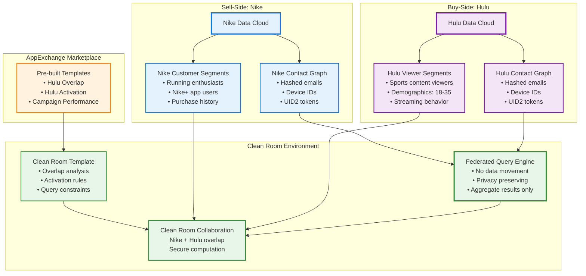
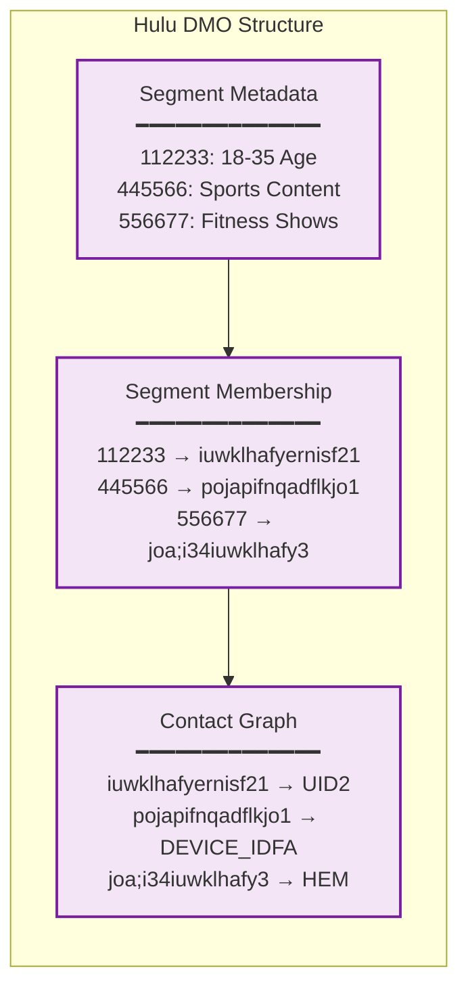
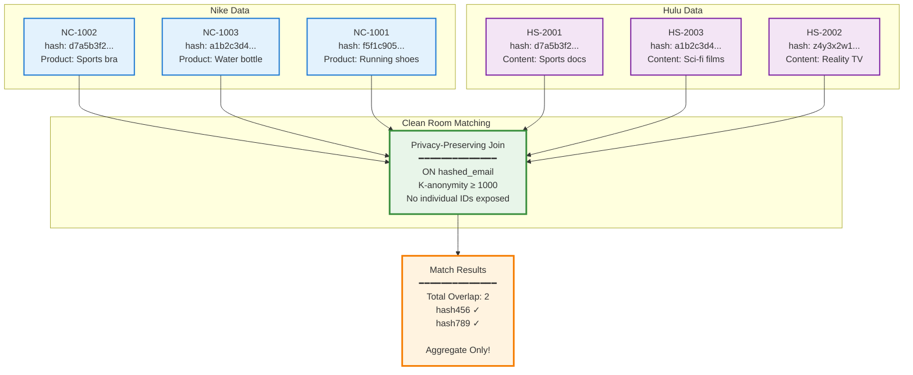
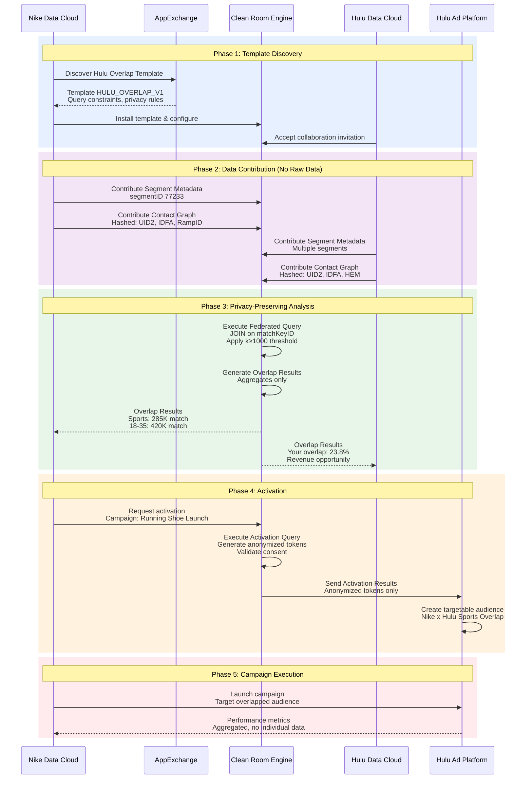
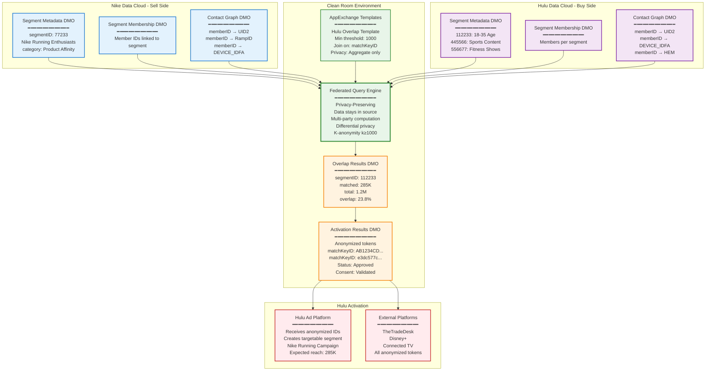
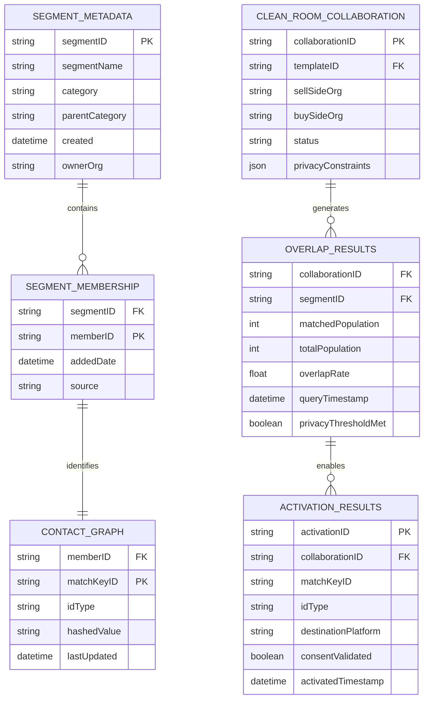
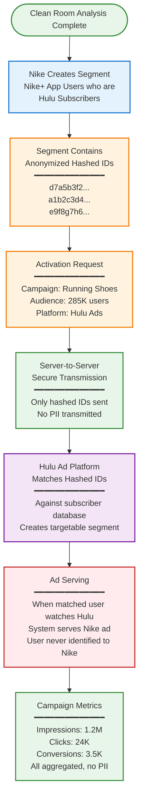
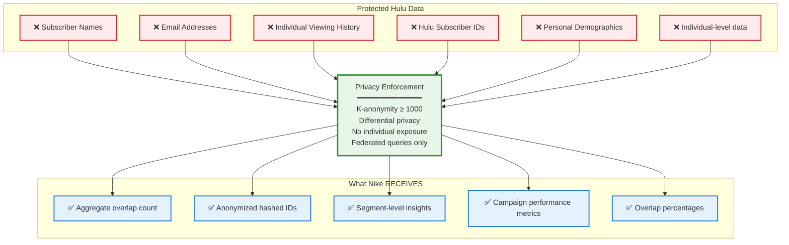

# Salesforce Data Cloud Clean Rooms: Technical Architecture Guide

## Executive Summary

Data Clean Rooms enable **privacy-preserving collaboration** between companies (like Nike and Hulu) to analyze audience overlap and activate shared customer segments **without sharing raw customer data**. All analysis happens in a secure, federated environment where only **aggregated, anonymized insights** are returned.

---

## Core Architecture Overview



---

## Key Principles

### 1. No Raw Data Movement
- Data **stays in source Data Cloud**
- Only hashed, anonymized identifiers are used
- Federated queries run across both environments

### 2. Privacy-First Design
- **K-anonymity** enforced (minimum 1,000 matches)
- **Differential privacy** applied
- Only **aggregate results** returned

### 3. Use Case: Nike × Hulu Collaboration

**Nike's Goal**: Target Hulu subscribers who match Nike's running enthusiast profile

**Hulu's Goal**: Monetize their audience data while protecting subscriber privacy

**Solution**: Clean Room analyzes overlap without exposing individual user data

---

## Data Structure

### Sell-Side: Nike Data
```mermaid
graph LR
    Provider["Data Provider Hulu<br/>Owns: Audience segments<br/>Provides: Targeting capability"]
    Consumer["Data Consumer Nike<br/>Wants: Audience reach<br/>Consumes: Targeting data"]
    
    Provider -->|Clean Room| Consumer
    
    style Provider fill:#f3e5f5,stroke:#7b1fa2,stroke-width:3px
    style Consumer fill:#e3f2fd,stroke:#1976d2,stroke-width:3px

```mermaid
graph LR

    subgraph "Nike DMO Structure"
        SEG_META["Segment Metadata<br/>━━━━━━━━━━━━━━<br/>segmentID: 77233<br/>segmentName: Nike Running<br/>category: Product Affinity"]
        
        SEG_MEMBER["Segment Membership<br/>━━━━━━━━━━━━━━<br/>77233 → hafyernisf21iuwkl<br/>77233 → 4iuwklhafy3joa;i3<br/>77233 → ifnqadflkjo1pojap"]
        
        CONTACT["Contact Graph<br/>━━━━━━━━━━━━━━<br/>hafyernisf21iuwkl → UID2<br/>4iuwklhafy3joa;i3 → RampID<br/>ifnqadflkjo1pojap → DEVICE_IDFA"]
    end
    
    SEG_META --> SEG_MEMBER
    SEG_MEMBER --> CONTACT
    
    style SEG_META fill:#e3f2fd,stroke:#1976d2,stroke-width:2px
    style SEG_MEMBER fill:#e3f2fd,stroke:#1976d2,stroke-width:2px
    style CONTACT fill:#e3f2fd,stroke:#1976d2,stroke-width:2px
```

**Sample Nike Data:**

| Nike Customer ID | Hashed Email | Purchase History |
|-----------------|--------------|------------------|
| NC-1001 | f5f1c905... | Running shoes, Nike+ App |
| NC-1002 | d7a5b3f2... | Sports bra, Leggings |
| NC-1003 | a1b2c3d4... | Water bottle |
| NC-1004 | e9f8g7h6... | Training gear |
| NC-1005 | e8e7c6d5... | Running shoes |

### Buy-Side: Hulu Data



**Sample Hulu Data:**

| Hulu Subscriber ID | Hashed Email | Content Watched |
|-------------------|--------------|-----------------|
| HS-2001 | d7a5b3f2... | Sports documentaries |
| HS-2002 | z4y3x2w1... | Reality TV shows |
| HS-2003 | a1b2c3d4... | Sci-fi films |
| HS-2004 | p1o2i3u4... | Sitcoms |

---

## Matching Process: How It Works

### The Secret: Hashed Email Matching



**What Nike Receives:**
- ✅ Total overlap count: **2 matches**
- ✅ Matched hashed IDs: `d7a5b3f2...`, `a1b2c3d4...`
- ✅ Aggregate insights: "Sports documentaries" + "Sci-fi films" viewers
- ❌ **NO** Hulu Subscriber IDs
- ❌ **NO** Individual viewing history
- ❌ **NO** Raw data

---

## Complete Clean Room Process

### End-to-End Sequence Flow



---

## Federated Query Example

### SQL Query in Clean Room

```sql
-- This runs in the secure clean room environment
-- Data NEVER leaves source systems

SELECT
    buyer.segmentID,
    buyer.segmentName,
    buyer.category,
    COUNT(DISTINCT seller.matchKeyID) as matched_population,
    COUNT(DISTINCT buyer.matchKeyID) as total_population
FROM buyer_segments buyer
JOIN seller_segments seller
    ON buyer.matchKeyID = seller.matchKeyID
WHERE 
    buyer.segmentID IN (112233, 445566)  -- Hulu segments
    AND seller.segmentID = 77233          -- Nike segment
GROUP BY 
    buyer.segmentID, 
    buyer.segmentName, 
    buyer.category
HAVING 
    COUNT(DISTINCT seller.matchKeyID) >= 1000  -- Privacy threshold
```

### Query Results (Aggregate Only)

```json
{
  "query_results": {
    "112233": {
      "segment_name": "Sports Content Viewers",
      "category": "Content Affinity",
      "matched_population": 285000,
      "total_population": 1200000,
      "overlap_rate": "23.8%"
    },
    "445566": {
      "segment_name": "18-35 Demographics",
      "category": "Demographics",
      "matched_population": 420000,
      "total_population": 2100000,
      "overlap_rate": "20.0%"
    }
  }
}
```

---

## Complete Technical Architecture



---

## Data Model: DMO Relationships



---

## Activation Process: From Overlap to Campaign

### How Anonymized Segments are Activated



---

## Privacy Guarantees

### What Nike NEVER Sees



---

## Key Takeaways

### How Clean Rooms Solve the Privacy-Utility Paradox

1. **Privacy Protection**
   - Data never leaves source systems
   - Only hashed identifiers used for matching
   - K-anonymity threshold (≥1000) enforced
   - Individual-level data never exposed

2. **Business Value**
   - Accurate audience overlap measurement
   - Precise targeting without PII exposure
   - Campaign performance tracking
   - Revenue opportunities for data owners

3. **Technical Implementation**
   - Federated queries run across environments
   - DMO (Data Model Object) structure maintains consistency
   - AppExchange templates enable rapid deployment
   - Server-to-server activation maintains security

4. **Real-World Impact**
   - Nike: Target qualified audience efficiently
   - Hulu: Monetize data while protecting subscribers
   - Users: Privacy preserved throughout process
   - Advertisers: Better ROI through precise targeting

---

## Use Cases Beyond Nike × Hulu

### Clean Room Applications

- **Retail × Financial Services**: Target high-value customers
- **Automotive × Insurance**: Identify qualified buyers
- **Healthcare × Pharma**: Patient cohort analysis (HIPAA compliant)
- **Travel × Credit Cards**: Premium travel audience targeting
- **CPG × Retailers**: In-store and online purchase correlation
- **Media × Brands**: Content affinity and product interest overlap

---

## Conclusion

Salesforce Data Cloud Clean Rooms enable **privacy-preserving collaboration** at enterprise scale. Through federated queries, hashed identifiers, and strict privacy thresholds, companies can unlock valuable audience insights and activation opportunities **without compromising individual privacy**.

The Nike × Hulu example demonstrates how two companies can collaborate to create mutual value—Nike gets precise targeting, Hulu monetizes their data, and subscribers' privacy is fully protected throughout the process.