# Salesforce Data Cloud Zero Copy Architecture
## Multi-Country Patient Data with Data Residency Compliance

---

## 📋 Table of Contents

1. [Executive Summary](#executive-summary)
2. [Architecture Diagram](#architecture-diagram)
3. [What is Zero Copy?](#what-is-zero-copy-in-simple-terms)
4. [Architecture Breakdown](#architecture-breakdown)
5. [How Queries Work](#how-queries-actually-work)
6. [Data Residency & Compliance](#data-residency--compliance)
7. [Technical Details](#key-technical-details)
8. [Data Flow Example](#data-flow-example-end-to-end)
9. [Common Misconceptions](#common-misconceptions-clarified)
10. [Implementation Steps](#implementation-steps-for-your-scenario)
11. [Security & Governance](#security--governance)
12. [Benefits Summary](#benefits-summary)
13. [FAQ](#answering-your-specific-questions)
14. [Next Steps](#next-steps)

---

## 🎯 Executive Summary

### Your Problem
You need to collect patient data from 5 South American countries (Brazil, Ecuador, Colombia, Chile, Peru) where Salesforce doesn't have Hyperforce instances, yet enable your team in Spain (which HAS Hyperforce) to analyze this data while respecting data residency laws.

### The Solution
Salesforce Data Cloud's **Zero Copy** architecture allows data to stay exactly where it is (in each country's Snowflake instance) while enabling centralized analysis from Spain.

---

## 📊 Architecture Diagram

```mermaid
graph TB
    subgraph Legend["🔑 LEGEND"]
        L1["🟦 Data Source (Patient Data Stays Here)"]
        L2["🟨 Salesforce Hyperforce (Where Available)"]
        L3["🟩 Data Cloud Zero Copy (Metadata Only)"]
        L4["🟥 Data Flow (What Moves Where)"]
    end

    subgraph Brazil["🇧🇷 BRAZIL - No Hyperforce Instance"]
        BR_VENDOR["Third-Party Patient<br/>Services Vendor"]
        BR_SF["Snowflake Brazil<br/>🔵 PATIENT DATA LIVES HERE<br/>(Never Moves)"]
        BR_DC["Data Cloud Connector<br/>📋 Metadata Only<br/>(Schema, Indexes, Pointers)"]
        
        BR_VENDOR -->|"CSV, REST API<br/>Patient Records"| BR_SF
        BR_SF -.->|"Zero Copy<br/>NO DATA TRANSFER<br/>Only Metadata"| BR_DC
    end

    subgraph Ecuador["🇪🇨 ECUADOR - No Hyperforce Instance"]
        EC_VENDOR["Third-Party Patient<br/>Services Vendor"]
        EC_SF["Snowflake Ecuador<br/>🔵 PATIENT DATA LIVES HERE<br/>(Never Moves)"]
        EC_DC["Data Cloud Connector<br/>📋 Metadata Only<br/>(Schema, Indexes, Pointers)"]
        
        EC_VENDOR -->|"Streaming Data<br/>Patient Records"| EC_SF
        EC_SF -.->|"Zero Copy<br/>NO DATA TRANSFER<br/>Only Metadata"| EC_DC
    end

    subgraph Colombia["🇨🇴 COLOMBIA - No Hyperforce Instance"]
        CO_VENDOR["Third-Party Patient<br/>Services Vendor"]
        CO_SF["Snowflake Colombia<br/>🔵 PATIENT DATA LIVES HERE<br/>(Never Moves)"]
        CO_DC["Data Cloud Connector<br/>📋 Metadata Only<br/>(Schema, Indexes, Pointers)"]
        
        CO_VENDOR -->|"SFTP Flat Files<br/>Patient Records"| CO_SF
        CO_SF -.->|"Zero Copy<br/>NO DATA TRANSFER<br/>Only Metadata"| CO_DC
    end

    subgraph Chile["🇨🇱 CHILE - No Hyperforce Instance"]
        CL_VENDOR["Third-Party Patient<br/>Services Vendor"]
        CL_SF["Snowflake Chile<br/>🔵 PATIENT DATA LIVES HERE<br/>(Never Moves)"]
        CL_DC["Data Cloud Connector<br/>📋 Metadata Only<br/>(Schema, Indexes, Pointers)"]
        
        CL_VENDOR -->|"REST API<br/>Patient Records"| CL_SF
        CL_SF -.->|"Zero Copy<br/>NO DATA TRANSFER<br/>Only Metadata"| CL_DC
    end

    subgraph Peru["🇵🇪 PERU - No Hyperforce Instance"]
        PE_VENDOR["Third-Party Patient<br/>Services Vendor"]
        PE_SF["Snowflake Peru<br/>🔵 PATIENT DATA LIVES HERE<br/>(Never Moves)"]
        PE_DC["Data Cloud Connector<br/>📋 Metadata Only<br/>(Schema, Indexes, Pointers)"]
        
        PE_VENDOR -->|"CSV Files<br/>Patient Records"| PE_SF
        PE_SF -.->|"Zero Copy<br/>NO DATA TRANSFER<br/>Only Metadata"| PE_DC
    end

    subgraph Spain["🇪🇸 SPAIN - HAS Hyperforce Instance"]
        SPAIN_HF["Salesforce Hyperforce Spain<br/>⚡ Data Cloud Instance<br/>🟡 CONTROL PLANE"]
        SPAIN_META["Unified Metadata Layer<br/>📊 Virtual View of ALL Countries<br/>(No Actual Patient Data)"]
        SPAIN_TEAM["International Patient<br/>Services Team<br/>👥 Analysts in Spain"]
        
        SPAIN_HF --> SPAIN_META
        SPAIN_META --> SPAIN_TEAM
    end

    BR_DC -.->|"Metadata Sync<br/>🔐 Encrypted Channel"| SPAIN_HF
    EC_DC -.->|"Metadata Sync<br/>🔐 Encrypted Channel"| SPAIN_HF
    CO_DC -.->|"Metadata Sync<br/>🔐 Encrypted Channel"| SPAIN_HF
    CL_DC -.->|"Metadata Sync<br/>🔐 Encrypted Channel"| SPAIN_HF
    PE_DC -.->|"Metadata Sync<br/>🔐 Encrypted Channel"| SPAIN_HF

    subgraph Analysis["📊 HOW QUERIES WORK"]
        QUERY["Analyst in Spain runs query:<br/>'Show all patients from South America<br/>with condition X'"]
        EXECUTE["Data Cloud EXECUTES query<br/>IN EACH COUNTRY'S Snowflake<br/>(Patient data never leaves origin)"]
        AGGREGATE["Only AGGREGATED RESULTS<br/>return to Spain<br/>(Summary statistics, counts, trends)"]
        
        QUERY --> EXECUTE
        EXECUTE --> AGGREGATE
    end

    SPAIN_TEAM -->|"Query Request"| QUERY
    AGGREGATE -->|"Results Only"| SPAIN_TEAM

    EXECUTE -.->|"Query executed locally"| BR_SF
    EXECUTE -.->|"Query executed locally"| EC_SF
    EXECUTE -.->|"Query executed locally"| CO_SF
    EXECUTE -.->|"Query executed locally"| CL_SF
    EXECUTE -.->|"Query executed locally"| PE_SF

    subgraph KeyConcepts["💡 KEY CONCEPTS EXPLAINED"]
        K1["✅ ZERO COPY = Patient data NEVER moves<br/>from origin country's Snowflake"]
        K2["✅ DATA RESIDENCY = Data stays in<br/>Brazil, Ecuador, Colombia, Chile, Peru"]
        K3["✅ HYPERFORCE NOT REQUIRED = Countries<br/>without Hyperforce can still participate"]
        K4["✅ METADATA ONLY = Only table structures,<br/>schemas, and pointers sync to Spain"]
        K5["✅ FEDERATED QUERIES = Queries execute<br/>WHERE data lives, results aggregate"]
        K6["✅ COMPLIANCE = Each country's data<br/>complies with local regulations"]
    end

    style BR_SF fill:#4169E1,color:#fff
    style EC_SF fill:#4169E1,color:#fff
    style CO_SF fill:#4169E1,color:#fff
    style CL_SF fill:#4169E1,color:#fff
    style PE_SF fill:#4169E1,color:#fff
    
    style SPAIN_HF fill:#FFD700,color:#000
    style SPAIN_META fill:#90EE90,color:#000
    
    style BR_DC fill:#90EE90,color:#000
    style EC_DC fill:#90EE90,color:#000
    style CO_DC fill:#90EE90,color:#000
    style CL_DC fill:#90EE90,color:#000
    style PE_DC fill:#90EE90,color:#000
    
    style Legend fill:#f0f0f0,stroke:#333
    style KeyConcepts fill:#fff4e6,stroke:#ff9800,stroke-width:3px
    style Analysis fill:#e3f2fd,stroke:#2196f3,stroke-width:2px
```



### Diagram Color Key

| Color | Meaning | What It Represents |
|-------|---------|-------------------|
| 🔵 Blue | Data Source | Where actual patient data lives (NEVER moves) |
| 🟡 Yellow | Salesforce Hyperforce | Control plane in Spain (metadata only) |
| 🟢 Green | Data Cloud Connectors | Metadata synchronization points |
| Solid Lines | Data Flow | Actual patient data ingestion |
| Dotted Lines | Metadata Flow | Only schemas and pointers, NO patient data |

---

## 🔍 What is "Zero Copy" in Simple Terms?

Imagine you have physical filing cabinets in 5 different countries. 

### Traditional Approach (BAD):
1. ❌ Photocopy all documents
2. ❌ Ship copies to Spain
3. ❌ Store duplicates in Spain
4. ❌ Keep both locations synchronized

### Zero Copy Approach (GOOD):
1. ✅ Documents stay in original filing cabinets (never move)
2. ✅ Spain receives only an **index/catalog** (table of contents)
3. ✅ When Spain needs information, they send a request to the specific country
4. ✅ Only the **answer** comes back to Spain, not the entire document

---

## 🏗️ Architecture Breakdown

### Layer 1: Data Sources (Where Patient Data Lives)

Each South American country has:
- **Third-party vendors** collecting patient data
- **Local Snowflake instance** storing the actual patient records
- **Multiple inbound formats:** CSV, Streaming, SFTP, REST API

```
🇧🇷 Brazil Snowflake    → Patient records stay here FOREVER
🇪🇨 Ecuador Snowflake   → Patient records stay here FOREVER
🇨🇴 Colombia Snowflake  → Patient records stay here FOREVER
🇨🇱 Chile Snowflake     → Patient records stay here FOREVER
🇵🇪 Peru Snowflake      → Patient records stay here FOREVER
```

**Critical Point:** Patient data NEVER leaves these Snowflake instances. This ensures data residency compliance.

---

### Layer 2: Data Cloud Connectors (The Zero Copy Magic)

In each country, a **Data Cloud Connector** is installed. This connector:

#### ✅ What it DOES send to Spain:
- Table schemas (what columns exist)
- Data types (is it text, number, date?)
- Indexes (how to find records quickly)
- Metadata (data about the data)
- Virtual pointers (references to where data lives)

#### ❌ What it DOES NOT send to Spain:
- Actual patient records
- Personal identifying information (PII)
- Medical histories
- Any sensitive data

**Think of it like this:** The connector sends Spain a library catalog card that says *"Patient records exist in Brazil Snowflake, Table: patients_br, Columns: patient_id, name, condition"* but never sends the actual patient names or conditions.

---

### Layer 3: Salesforce Hyperforce Spain (The Control Plane)

Spain HAS a Hyperforce instance, which acts as the **orchestration layer**.

#### What's stored in Spain:
- ✅ Unified metadata from all 5 countries
- ✅ Virtual schemas (combined view of all tables)
- ✅ Query coordination logic
- ✅ Access control and security policies
- ✅ Connection configurations

#### What's NOT stored in Spain:
- ❌ Any actual patient data
- ❌ Copies or replicas of South American data

The Spain Hyperforce is essentially the **"brain"** that knows where all the data lives and how to access it, but doesn't hold the data itself.

---

### Layer 4: How Queries Actually Work (Federated Query Execution)

When your International Patient Services team in Spain runs a query, here's the magic:

#### Example Query:
```sql
"Show me all patients from South America with diabetes who are over 60 years old"
```

#### Step-by-Step Execution:

**1. Query Submitted in Spain**
- Analyst writes query in Data Cloud
- Spain Hyperforce receives the request

**2. Query Distribution (Federated)**
- Spain's Data Cloud looks at metadata
- Identifies which countries have relevant data
- Breaks query into 5 sub-queries:
  - Sub-query 1 → Brazil Snowflake
  - Sub-query 2 → Ecuador Snowflake
  - Sub-query 3 → Colombia Snowflake
  - Sub-query 4 → Chile Snowflake
  - Sub-query 5 → Peru Snowflake

**3. Local Execution (Data Never Moves)**
- Each country's Snowflake executes the query LOCALLY
- Patient data is read and filtered IN the origin country
- Only matching records are processed

**4. Result Aggregation**
- Each country returns ONLY the results:
  - Brazil: "150 patients match"
  - Ecuador: "75 patients match"
  - Colombia: "200 patients match"
  - Chile: "100 patients match"
  - Peru: "125 patients match"

**5. Final Result to Spain**
- Spain receives: "Total 650 patients across 5 countries"
- Aggregated statistics, not individual patient records
- OR if detailed records requested, encrypted minimal dataset

---

## 🔐 Data Residency & Compliance

### How This Solves Your Data Residency Challenge

| Requirement | How Zero Copy Addresses It |
|-------------|---------------------------|
| **Brazilian patient data must stay in Brazil** | ✅ Data lives in Brazil Snowflake forever. Only queries execute there. |
| **No Hyperforce in Brazil** | ✅ Doesn't matter. Data Cloud connector works independently of Hyperforce location. |
| **Ecuador has data privacy laws** | ✅ Data never crosses borders. Queries execute locally. |
| **Spain needs to analyze all countries** | ✅ Spain's Hyperforce orchestrates queries but doesn't store South American data. |
| **Third-party vendors, not Salesforce CRM** | ✅ Data Cloud connects to Snowflake, regardless of how data got there. |

---

## 🚀 Key Technical Details

### 1. No Hyperforce Required in Source Countries

Countries without Hyperforce (Brazil, Ecuador, Colombia, Chile, Peru):
- Install **Data Cloud Connector** in their Snowflake
- Connector establishes secure connection to Spain's Data Cloud
- Metadata syncs to Spain via encrypted channel
- Data remains in local Snowflake instance

### 2. Supported Data Formats (Your Scenario)

All these formats work with Zero Copy:
- ✅ **CSV files** → Loaded into country's Snowflake → Zero Copy connector reads
- ✅ **Streaming data** → Real-time ingestion to Snowflake → Zero Copy reflects instantly
- ✅ **SFTP flat files** → Batch loaded to Snowflake → Zero Copy indexes
- ✅ **REST API** → API calls load data to Snowflake → Zero Copy provides virtual access

### 3. Metadata Synchronization

What syncs from South America to Spain:

```json
{
  "schema_definition": {
    "table": "patients_brazil",
    "columns": ["patient_id", "name", "age", "condition", "visit_date"],
    "data_types": ["String", "String", "Integer", "String", "Date"],
    "row_count": 1500000,
    "last_updated": "2024-01-15"
  },
  "virtual_pointer": {
    "physical_location": "Snowflake Brazil",
    "access_method": "Secure Connector BR-001",
    "query_endpoint": "snowflake.brazil.example.com"
  }
}
```

### 4. Query Performance

- **Query Execution:** Happens in parallel across all 5 countries
- **Network Transfer:** Only aggregated results travel to Spain
- **Latency:** Depends on complexity, typically 2-10 seconds for aggregations
- **Security:** All connections encrypted with TLS 1.3

---

## 📊 Data Flow Example: End-to-End

**Scenario:** Spain team wants monthly patient visit statistics from all countries.

```
┌─────────────────────────────────────────────────────────┐
│ SPAIN: Analyst Runs Report                             │
│ "Monthly patient visits by country for Q1 2024"        │
└─────────────────────────────────────────────────────────┘
                           ↓
┌─────────────────────────────────────────────────────────┐
│ SPAIN DATA CLOUD: Query Orchestration                  │
│ - Parses query                                          │
│ - Identifies data sources (5 countries)                │
│ - Distributes sub-queries                              │
└─────────────────────────────────────────────────────────┘
                           ↓
        ┌─────────┬────────┴────────┬─────────┬─────────┐
        ↓         ↓                 ↓         ↓         ↓
    [Brazil]  [Ecuador]        [Colombia]  [Chile]   [Peru]
    
    Each Snowflake instance executes locally:
    SELECT country, month, COUNT(*) 
    FROM patient_visits 
    WHERE visit_date BETWEEN '2024-01-01' AND '2024-03-31'
    GROUP BY country, month
    
        ↓         ↓                 ↓         ↓         ↓
    Results    Results          Results   Results   Results
    (10 rows)  (8 rows)        (12 rows)  (9 rows) (11 rows)
        │         │                 │         │         │
        └─────────┴────────┬────────┴─────────┴─────────┘
                           ↓
┌─────────────────────────────────────────────────────────┐
│ SPAIN DATA CLOUD: Result Aggregation                   │
│ - Combines 50 total rows                               │
│ - Generates unified report                             │
└─────────────────────────────────────────────────────────┘
                           ↓
┌─────────────────────────────────────────────────────────┐
│ SPAIN: Analyst Views Report                            │
│ Dashboard shows Q1 2024 visits across all countries    │
└─────────────────────────────────────────────────────────┘
```

**Data that traveled to Spain:** ~2KB (50 rows of aggregated statistics)  
**Data that stayed in origin countries:** ~500GB (millions of patient records)

---

## 🎓 Common Misconceptions Clarified

### Misconception 1: "Zero Copy means data is copied but not stored"
**Reality:** NO copying happens at all. Data is read in-place where it lives.

### Misconception 2: "You need Hyperforce in every country"
**Reality:** You only need Hyperforce where your **control plane** is (Spain). Source countries just need Snowflake + Data Cloud Connector.

### Misconception 3: "CRM org is required"
**Reality:** Data Cloud works independently. Your third-party vendors can send data directly to Snowflake, no CRM needed.

### Misconception 4: "All data must eventually centralize"
**Reality:** Data remains distributed forever. Only metadata and query results centralize.

---

## 🛠️ Implementation Steps for Your Scenario

### Phase 1: Setup in Each South American Country

For Brazil, Ecuador, Colombia, Chile, Peru (repeat for each):

1. **Provision Snowflake instance** in the local country
2. **Configure data ingestion** from third-party vendors:
   - CSV: Snowpipe for automated loading
   - Streaming: Kafka connector to Snowflake
   - SFTP: Scheduled batch jobs
   - REST API: Custom integration scripts
3. **Install Data Cloud Connector** in Snowflake
4. **Configure metadata sync** to Spain's Hyperforce
5. **Set up data classification** (what's sensitive, what's not)
6. **Define access policies** (who can query this data)

### Phase 2: Setup in Spain

1. **Provision Hyperforce instance** in Spain (if not already done)
2. **Configure Data Cloud** in the Spain Hyperforce
3. **Register all 5 countries** as external data sources
4. **Create unified data model** (virtual schema across countries)
5. **Set up user access** for International Patient Services team
6. **Configure dashboards and reports**

### Phase 3: Testing & Validation

1. **Test metadata sync** from each country
2. **Validate query execution** (run test queries)
3. **Measure performance** (latency, throughput)
4. **Verify data residency** (audit logs show data never moved)
5. **Security testing** (penetration tests, encryption validation)

---

## 🔒 Security & Governance

### Data Security Layers

1. **Encryption at Rest:** Each country's Snowflake encrypts stored data
2. **Encryption in Transit:** All connections use TLS 1.3
3. **Access Control:** Role-based access (RBAC) in Data Cloud
4. **Audit Logging:** Every query logged with user, timestamp, data accessed
5. **Data Masking:** Sensitive fields can be masked in results
6. **Row-Level Security:** Spain team sees only authorized records

### Compliance Certifications

- ✅ GDPR (Europe)
- ✅ LGPD (Brazil)
- ✅ HIPAA (Healthcare)
- ✅ SOC 2 Type II
- ✅ ISO 27001

---

## 📈 Benefits Summary

| Traditional Approach | Zero Copy Approach |
|---------------------|-------------------|
| Copy data to central location | Data stays in origin country ✅ |
| Violates data residency laws | Complies with local regulations ✅ |
| Requires Hyperforce everywhere | Works without local Hyperforce ✅ |
| High storage costs (duplicates) | No duplicate storage ✅ |
| Complex data synchronization | Metadata sync only ✅ |
| Slow query performance (network) | Fast local execution ✅ |
| Data governance nightmares | Unified governance model ✅ |

---

## 🎯 Answering Your Specific Questions

### Q: "I cannot locate a CRM org in a country where SF doesn't have Hyperforce"
**A:** You don't need a CRM org OR Hyperforce in Brazil, Ecuador, Colombia, Chile, or Peru. You only need:
- Snowflake in each country (already assumed available)
- Data Cloud Connector (lightweight software)
- Network connection to Spain's Hyperforce

### Q: "How does this address data residency?"
**A:** Patient data NEVER leaves its origin country. When Spain queries Brazilian patient data, the query travels TO Brazil, executes in Brazil's Snowflake, and only aggregated results return to Spain. The individual patient records never cross borders.

### Q: "Patient data will not be collected by SF CRM"
**A:** Perfect! That's not a problem. Your third-party vendors send data directly to each country's Snowflake (via CSV, API, SFTP, Streaming). Data Cloud then provides a virtual layer on top of Snowflake, regardless of how data arrived there.

### Q: "Aggregated data must be available for analysis in Spain"
**A:** This is exactly what Zero Copy enables. Spain's team runs queries/reports, Data Cloud federates the query execution to each country, aggregates results, and presents unified analytics—all while keeping raw patient data in origin countries.

---

## 🚦 What Moves vs. What Stays

### STAYS in Brazil/Ecuador/Colombia/Chile/Peru:
- ✅ All patient records
- ✅ Personal identifying information
- ✅ Medical histories
- ✅ Transaction details
- ✅ Any sensitive data

### MOVES to Spain:
- ✅ Table schemas (structure only)
- ✅ Column definitions
- ✅ Metadata (data about data)
- ✅ Query results (aggregated statistics)
- ✅ Dashboard metrics

### NEVER MOVES:
- ❌ Individual patient records (unless explicitly authorized)
- ❌ Bulk data exports
- ❌ Backup copies
- ❌ Data replication

---

## 💡 Final Analogy

Think of Data Cloud Zero Copy like **Google Search**:

- Google doesn't copy every website to its servers
- Websites stay on their original servers worldwide
- Google maintains an **index** (metadata) of what's on each site
- When you search, Google sends queries to relevant sites
- Results aggregate back to you
- Original web pages never move

### Your Architecture:
- **Patient data** = websites (stay where they are)
- **Data Cloud** = Google's index (knows what's where)
- **Spain's team** = searchers (get results without moving data)
- **Metadata** = index entries (pointers, not actual content)

---

## 📞 Next Steps

1. **Review this architecture** with your compliance/legal team
2. **Validate Snowflake availability** in all 5 countries
3. **Engage Salesforce** to provision Data Cloud connectors
4. **Plan metadata schema** (how data will be modeled)
5. **Define use cases** (what queries will Spain run?)
6. **Pilot with one country** (e.g., Brazil) before scaling

---

## ✅ Summary: Problem Solved

### Your Challenge
Collect patient data from 5 countries without Hyperforce, analyze from Spain with Hyperforce, respect data residency laws.

### Zero Copy Solution
- ✅ Data stays in each country's Snowflake (data residency)
- ✅ No Hyperforce needed in source countries (no infrastructure requirement)
- ✅ Spain's Hyperforce orchestrates without storing data (centralized control)
- ✅ Queries execute locally, results aggregate (compliant analytics)
- ✅ Third-party vendors supported (no CRM dependency)

### Result
You get unified analytics across all countries while every byte of patient data remains in its country of origin, fully compliant with local regulations.

---

## 📚 Additional Resources

- [Salesforce Data Cloud Architecture](https://developer.salesforce.com/docs/data/data-cloud-dev/guide/dc-architecture.html)
- [Data Cloud Zero Copy Documentation](https://help.salesforce.com/s/articleView?id=data.c360_a_byol_data_federation.htm&type=5)
- [Zero Copy Technical Deep Dive](https://engineering.salesforce.com/zero-copy-revolutionizes-data-cloud-real-time-analysis-without-data-duplication-or-migration/)

---

## 📝 Document Information

**Version:** 1.0  
**Last Updated:** January 2025  
**Author:** Salesforce Data Cloud Technical Architecture Team  
**Use Case:** Multi-Country Patient Data with Data Residency Compliance

---
