# Scotia Offers: Pega Replacement Architecture
## Salesforce Data Cloud, Loyalty Management & Marketing Cloud Solution

---

## Citation Legend

| Symbol | Meaning |
|--------|---------|
| 📄 | **Grounded** - Information extracted directly from source documents |
| 🔧 | **Recommended** - Proposed architecture based on Salesforce best practices |
| 🔗 | **Hybrid** - Combines grounded requirements with recommended solutions |

---

## Table of Contents
1. [Executive Summary](#executive-summary)
2. [CPP Platform Overview](#cpp-platform-overview)
3. [Current State Architecture](#current-state-architecture)
4. [LiveBank Integration Architecture](#livebank-integration-architecture)
5. [Target State Architecture](#target-state-architecture)
6. [Component Mapping: Current → Target](#component-mapping-current--target)
7. [Data Flow Diagrams](#data-flow-diagrams)
8. [Integration Patterns](#integration-patterns)
9. [Migration Roadmap](#migration-roadmap)
10. [Technical Implementation Details](#technical-implementation-details)
11. [Key Benefits & ROI](#key-benefits--roi)

---

## Executive Summary

### The Challenge 📄

> **Source:** `CPP ecosystem and offers.pptx`, Slides 6-7, 15

Scotia's **Customer Personalization Platform (CPP)** offer management ecosystem consists of **20+ fragmented systems** spanning Azure, GCP, and on-premise infrastructure, serving **15 Million customers** with **6.5 Million transactions per day**.

**Critical Pain Points:** 📄 *[Source: CPP ecosystem and offers.pptx, Slide 6]*
- **46-80 business days** for new offer processing (4.8 months average lead time)
- **No real-time offer presentation** to Digital and Assisted channels
- **No centralized data repository** for Campaign & Offer generation
- **Vendor system cannot process** multiple relationship account offers
- **Batch-dependent data flows** via SFTP causing fulfillment delays
- **No end-to-end reconciliation process**
- **Isolated data flows** causing data duplication
- **No capability** to inquire/maintain all customer's offers in one place
- **Performance issues** with lack of robust monitoring
- **Missing error handling mechanisms**

### The Solution 🔧

> **Type:** Recommended Architecture (Salesforce Best Practices)

Replace the Pega-based CPP offer management with a unified **Salesforce stack**:

| Component | Role | Replaces |
|-----------|------|----------|
| **Salesforce Data Cloud** | The Hub & Brain | CDP, Event Exchange Hub, EDW, CCP-PEGA 📄 |
| **Loyalty Management** | The Offer Engine | Orion, Constellation, Nova, Promo Code App 📄 |
| **Marketing Cloud** | The Orchestration Engine | Homegrown Interface, EDAT, Oracle Responsys 📄 |
| **MC Personalization** | Real-Time Inbound Engine | BRL, CMEE, R/T gaps 📄 |
| **Agentforce** | AI-Powered Assistance | Manual processes, Contact Center support 🔧 |

> 📄 System names sourced from: `Architecture-Diagrams.pdf` (user-provided image), `Scotia Retail - LiveBank...png`

### Key Outcomes 🔗
- **Reduce offer lead time from 4.8 months → 2-3 weeks** 📄 *[Current: CPP ecosystem and offers.pptx, Slide 15]*
- **Enable real-time offer decisioning** (< 200ms response) 🔧
- **Support 15M customers, 6.5M daily transactions** with scale 📄 *[Source: CPP ecosystem and offers.pptx, Slide 7]*
- **Consolidate 20+ systems → 4 integrated platforms** 🔧
- **Unified customer 360° view** across all touchpoints 🔧
- **End-to-end reconciliation** with automated tracking 📄 *[Gap: CPP ecosystem and offers.pptx, Slide 6]*

---

## CPP Platform Overview 📄

> **Source:** `CPP ecosystem and offers.pptx`, Slides 3-4

### Customer Personalization Platform (CPP) - Current Capabilities

The CPP platform delivers personalized offers based on multiple customer dimensions:

#### Product Coverage 📄 *[Source: CPP ecosystem and offers.pptx, Slide 3]*

| Product Category | Products Included |
|------------------|-------------------|
| **Day-to-Day Banking** | Personal D2D / Chequing Accounts (Excludes DDA) |
| **Savings** | Personal Savings Accounts |
| **Investments** | Investment Accounts (IP) - Registered & Non-Reg Plans |
| **Premium Banking** | Private Banking |
| **Credit** | Credit Cards |
| **Future Expansion** | RESL, Insurance, Loyalty |

#### Customer Relationship Criteria 📄 *[Source: CPP ecosystem and offers.pptx, Slide 3]*

| Criteria Type | Attributes |
|---------------|------------|
| **Customer Type** | Personal, Business, etc. |
| **Account Type** | Sole, Joint, etc. |
| **Ownership Type** | Primary, Secondary |

#### Transaction Types Monitored 📄 *[Source: CPP ecosystem and offers.pptx, Slide 3]*

| Transaction Category | Specific Transactions |
|---------------------|----------------------|
| **Point of Sale** | POS (Credit/Debit) |
| **Deposits** | Payroll Deposits, Account Funding (Initial Deposit) |
| **Pre-Authorized** | PAD (Debits), PAT (Transactions), PAC (Contributions) |
| **Payments** | Bill Payments |
| **Card Usage** | Visa Debit |
| **International** | International Money Transfer (IEMT) |
| **Analytics** | Balance Across Accounts, Smart Money Tools |

#### Customer Segmentation & Tiering 📄 *[Source: CPP ecosystem and offers.pptx, Slide 3]*

- Dynamic customer segmentation
- Tiering model for loyalty status
- Propensity scoring for offer targeting

### Customer Interaction Channels 📄 *[Source: CPP ecosystem and offers.pptx, Slide 4]*

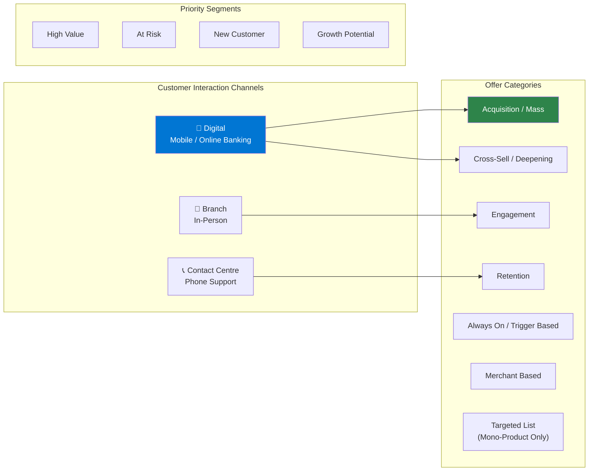

### Offer Value Types 📄 *[Source: CPP ecosystem and offers.pptx, Slide 4]*

| Value Type | Description | Example |
|------------|-------------|---------|
| **Cash Reward** | Direct cash bonus to account | $400-$500 bonus |
| **Fee Incentives** | Discount or waiver on fees | 6-12 month fee waiver |
| **Scene+ Points** | Loyalty points award | 7500 SCENE+ points |
| **Tiered Rates** | Variable rates based on thresholds | 1.5% on $X spend |
| **Combined Offers** | Multiple benefits bundled | Cash + Points + Waiver |

### Sample Offer Use Cases 📄

> **Source:** `CPP ecosystem and offers.pptx`, Slides 9-13

#### Use Case 1: Mass D2D Cash Bonus Offer 📄 *[Source: CPP ecosystem and offers.pptx, Slide 11]*
```yaml
Offer: "Open a Preferred/Ultimate Package chequing account to earn $500"
Type: Mass Acquisition
Reward: $500 Cash Bonus
Term: 3 months (August - October)
Eligibility:
  - Eligible Accounts: Preferred, Ultimate Package
  - Exclusions: Employees, existing holders (last 2 years)
Conditions:
  - Open new Ultimate/Preferred Package during offer period
  - Complete 2 of 3 activities within 60 days:
    - Set up recurring direct deposit (payroll/pension) for 6 months
    - Set up 2 recurring pre-authorized transactions ($50+ each) for 6 months
    - Make 1 online bill payment of $50+ via Mobile/Online Banking
Fulfillment: Deposited within ~9 months from account open date
```

#### Use Case 2: Tiered Acquisition Offer 📄 *[Source: CPP ecosystem and offers.pptx, Slides 9-10]*
```yaml
Offer: "Earn up to $1,000 when you open Registered Plans (RRSP/TFSA/FHSA/RESP)"
Type: Tiered Acquisition
Reward_Tiers:
  - $50: $5,000 - $9,999 investment
  - $150: $10,000 - $49,999 investment
  - $300: $50,000 - $99,999 investment
  - $500: $100,000 - $249,999 investment
  - $1,000: $250,000+ investment
Conditions:
  - Open eligible registered accounts
  - Transfer/contribute minimum amount within 60 days
  - Set up $100/month PAC recurring for 6 months
  - Maintain 90% of book value during 6-month maintenance period
Fulfillment: Pro-rata bonus across qualifying accounts, paid in 6 monthly installments
```

#### Use Case 3: Digital Payroll SCENE+ Offer 📄 *[Source: CPP ecosystem and offers.pptx, Slide 12]*
```yaml
Offer: "Set up payroll on Preferred/Ultimate Package & get $100 cash bonus"
Type: Targeted Engagement
Reward: $100 Cash Bonus
Term: April - May (6 weeks)
Eligibility:
  - Existing Preferred/Ultimate Package holders
  - Targeted customers only (non-transferable)
Conditions:
  - Set up and receive recurring direct deposit (payroll)
  - Must recur for minimum 3 consecutive months
Fulfillment: Deposited within ~3 months from last eligible deposit
```

### Current Technical Challenges (Documented) 📄 *[Source: CPP ecosystem and offers.pptx, Slide 6]*

| # | Challenge | Business Impact |
|---|-----------|-----------------|
| 1 | **New offers take 46-80 business days** | Missed market opportunities |
| 2 | **Vendor system cannot process multiple relationship accounts** | Limited personalization |
| 3 | **No real-time offer processing mechanism** | Delayed customer engagement |
| 4 | **No real-time integration with Digital/Assisted channels** | Poor omnichannel experience |
| 5 | **No centralized data repository for Campaigns & Offers** | Fragmented customer view |
| 6 | **Isolated data flows with duplication** | Data quality issues |
| 7 | **No capability to view all customer offers in one place** | Poor agent experience |
| 8 | **Inefficient/inconsistent vendor data flows** | Reconciliation errors |
| 9 | **No end-to-end reconciliation process** | Financial leakage risk |
| 10 | **Performance issues** | Customer-facing latency |
| 11 | **Lack of robust monitoring** | Reactive issue detection |
| 12 | **Lack of error handling mechanism** | Silent failures |

### Data Volumes (Current State) 📄 *[Source: CPP ecosystem and offers.pptx, Slide 7]*

| Metric | Current Volume | Growth Projection |
|--------|----------------|-------------------|
| **Customer Base** | 15 Million | Growing |
| **Daily Transactions** | ~6.5 Million | +30% variance |
| **Relationship Data Updates** | ~60,000/day | Increasing |
| **Configured Products** | Day-to-Day Banking, Credit Cards | + RESL, Insurance, Loyalty |
| **Offer Lead Time** | 4.8 months (avg) 📄 *[Slide 15]* | Target: 2-3 weeks 🔧 |

---

## LiveBank Integration Architecture 📄

> **Source:** `Scotia Retail - LiveBank project high level integration diagram 2025-11-07 170539.png`

### Retail & Business Banking Appointment Scheduling 📄

The LiveBank project shows how Salesforce CRM is already being integrated with the existing ecosystem:

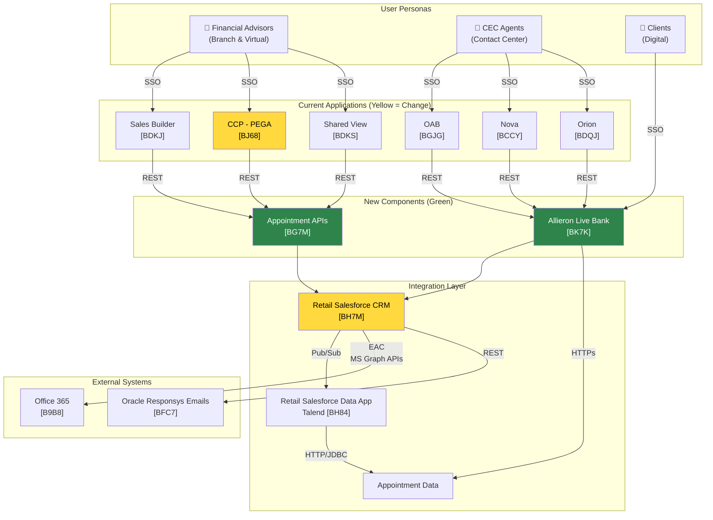

### LiveBank System Codes Reference 📄 *[Source: Scotia Retail - LiveBank...png]*

| System | Code | Status | Function |
|--------|------|--------|----------|
| **Sales Builder** | BDKJ | Change | Sales enablement |
| **CCP - PEGA** | BJ68 | Change | Customer Contact Platform (Pega-based) |
| **Shared View** | BDKS | Change | Shared customer view |
| **OAB** | BGJG | Change | Online Appointment Booking |
| **Nova** | BCCY | Change | Offer presentation |
| **Orion** | BDQJ | Change | Offer management |
| **Appointment APIs** | BG7M | **New** | Appointment scheduling APIs |
| **Allieron Live Bank** | BK7K | **New** | Live banking platform |
| **Retail Salesforce CRM** | BH7M | Change | CRM platform |
| **Retail SF Data App (Talend)** | BH84 | Existing | Data integration |
| **Office 365** | B9B8 | Existing | Email/Calendar |
| **Oracle Responsys Emails** | BFC7 | Existing | Email marketing |

### Integration Legend

| Color/Arrow | Meaning |
|-------------|---------|
| 🟢 Green | New component/integration |
| 🟡 Yellow | Changing component |
| ⬜ Gray | Existing (no change) |
| 🔴 Red | Decommission |

---

## Current State Architecture 📄

> **Source:** `Architecture-Diagrams.pdf` (user-provided current state data flow image)

### System Inventory 📄

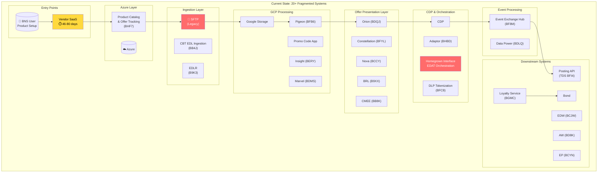

### Current Data Flow Sequence

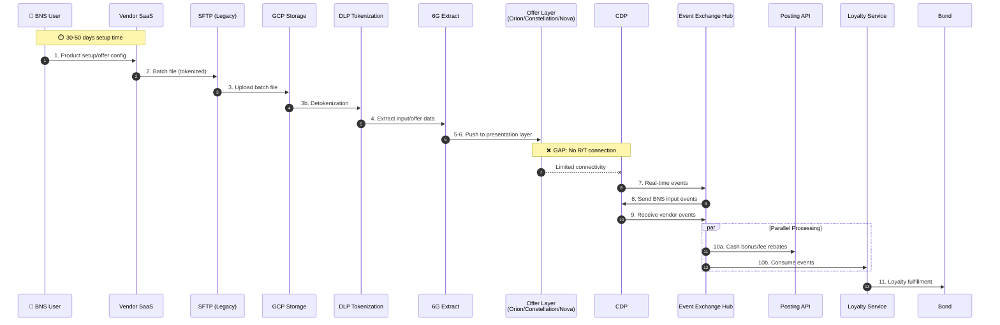

### Current State Problems 📄 *[Source: CPP ecosystem and offers.pptx, Slide 6]*

| # | Problem | Impact | Root Cause |
|---|---------|--------|------------|
| 1 | **46-80 Day Offer Lead Time** | 4.8 months avg, missed market opportunities | Complex manual processes, vendor dependencies |
| 2 | **No R/T Offer Presentation** | Lost revenue, poor CX | Adapter to Orion/Constellation/Nova not connected |
| 3 | **No Multi-Relationship Support** | Limited personalization | Vendor system cannot process multiple relationship accounts |
| 4 | **Batch-Only Integration** | Stale data, delayed fulfillment | SFTP dependency, no real-time processing |
| 5 | **No Centralized Data Repository** | Fragmented customer view | Isolated data flows, duplication |
| 6 | **20+ Systems** | High maintenance cost | Organic growth without consolidation |
| 7 | **No Single Offer View** | Poor agent/customer experience | Cannot inquire all offers in one place |
| 8 | **No End-to-End Reconciliation** | Financial leakage risk | Manual/semi-automated processes |
| 9 | **Performance Issues** | Customer-facing latency | Lack of robust monitoring |
| 10 | **No Error Handling** | Silent failures, data loss | Missing error handling mechanism |

---

## Target State Architecture 🔧

> **Type:** Recommended Architecture (Salesforce Best Practices)
> 
> This section proposes how the Salesforce platform can address the documented challenges from the CPP ecosystem.

### Salesforce Stack Overview 🔧

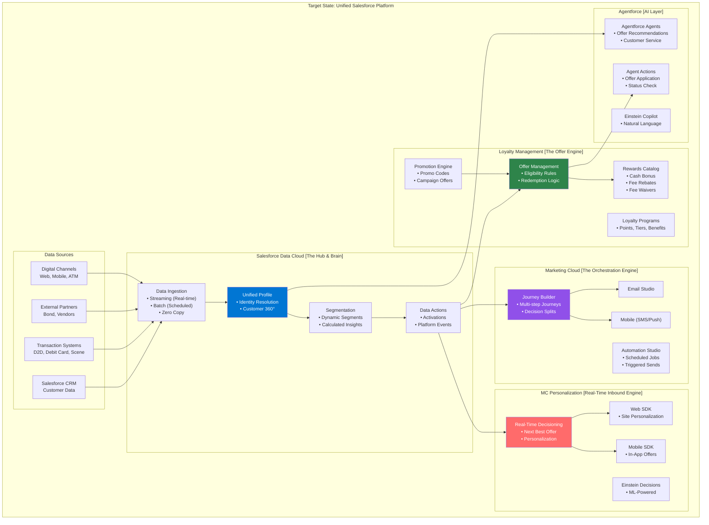

### Target State Data Flow

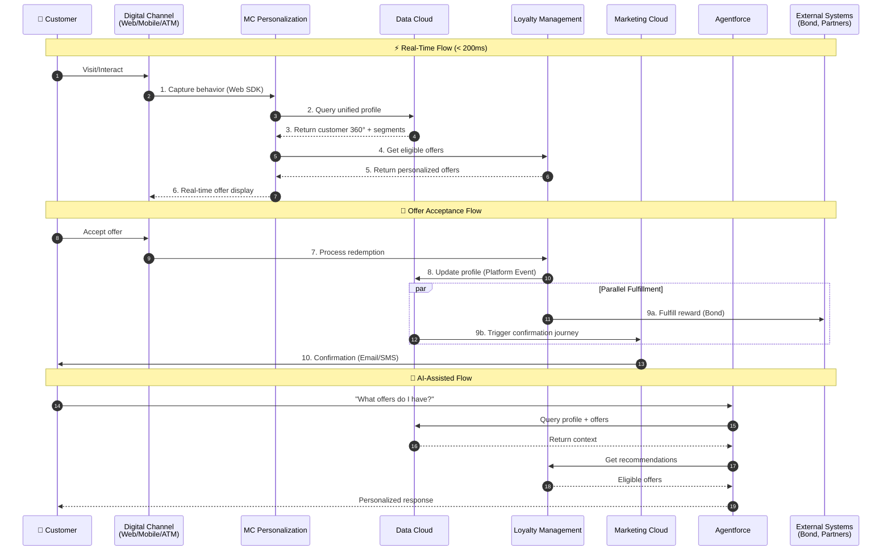

---

## Component Mapping: Current → Target 🔗

> **Type:** Hybrid - Maps grounded current systems 📄 to recommended Salesforce targets 🔧

### Detailed System Migration Map

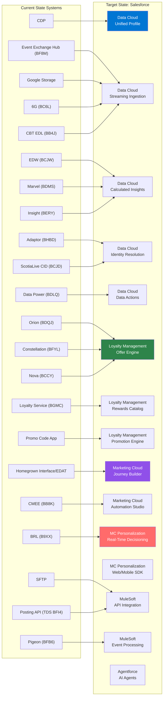

### Component-by-Component Migration Details

| Current System | Code | Function | Target System | Migration Approach |
|----------------|------|----------|---------------|-------------------|
| **CCP - PEGA** | BJ68 | Customer Contact Platform | Data Cloud + Agentforce | AI-powered customer engagement |
| **CDP** | - | Central data platform | Data Cloud | Direct replacement with enhanced capabilities |
| **Event Exchange Hub** | BF8M | Real-time events | Data Cloud Streaming | Native streaming ingestion |
| **EDW** | BCJW | Data warehouse | Data Cloud + Tableau | Unified analytics layer |
| **Adaptor** | BHBD | Reconciliation | Data Cloud Identity Resolution | Automated matching |
| **Data Power** | BDLQ | Event tracing | Data Cloud Data Actions | Platform Events |
| **ScotiaLive CID** | BCJD | Customer ID lookup | Data Cloud Identity Resolution | Unified identity |
| **Orion** | BDQJ | Offer presentation | Loyalty Management | Offer engine with rules |
| **Constellation** | BFYL | Offer management | Loyalty Management | Centralized offer mgmt |
| **Nova** | BCCY | Offer delivery | Loyalty Management + MCP | Real-time delivery |
| **Promo Code App** | GCP | Promo codes | Loyalty Management Promotions | Native promo engine |
| **Loyalty Service** | BGMC | Loyalty fulfillment | Loyalty Management Rewards | Rewards catalog |
| **Homegrown Interface** | EDAT | Orchestration | Marketing Cloud Journey Builder | Visual journey design |
| **CMEE** | BB8K | Campaign execution | Marketing Cloud Automation | Automated campaigns |
| **BRL** | B9XX | Business rules | MC Personalization | Real-time decisioning |
| **Oracle Responsys** | BFC7 | Email marketing | Marketing Cloud Email Studio | Native email platform |
| **SFTP** | - | File transfer | MuleSoft / Data Cloud Connectors | API-first integration |
| **Google Storage** | GCP | File storage | Data Cloud Ingestion API | Direct streaming |
| **Pigeon** | BFB6 | Data pipeline | MuleSoft + Data Cloud | Event-driven flow |
| **Marvel** | BDMS | Data management | Data Cloud | Unified data model |
| **Insight** | BERY | Analytics | Data Cloud Calculated Insights | Built-in analytics |
| **Posting API** | TDS BFI4 | Fulfillment | MuleSoft API | API orchestration |
| **6G** | BC6L | Data extraction | Data Cloud Ingestion | Native connectors |
| **CBT EDL** | BB4J | EDL ingestion | Data Cloud Batch Ingestion | Scheduled loads |
| **Sales Builder** | BDKJ | Sales enablement | Sales Cloud | Native CRM |
| **Shared View** | BDKS | Customer view | Data Cloud Unified Profile | 360° customer view |
| **Retail SF CRM** | BH7M | CRM platform | Sales Cloud + Data Cloud | Enhanced with Data Cloud |
| **Appointment APIs** | BG7M | Appointment scheduling | Service Cloud Scheduler | Native scheduling |
| **Allieron Live Bank** | BK7K | Live banking | Service Cloud + Agentforce | AI-assisted banking |

---

## Data Flow Diagrams 🔧

> **Type:** Recommended Architecture (Salesforce Best Practices)
> 
> These diagrams show how the proposed Salesforce stack would handle the data flows currently managed by the fragmented system.

### 1. Customer Onboarding & Profile Creation 🔧

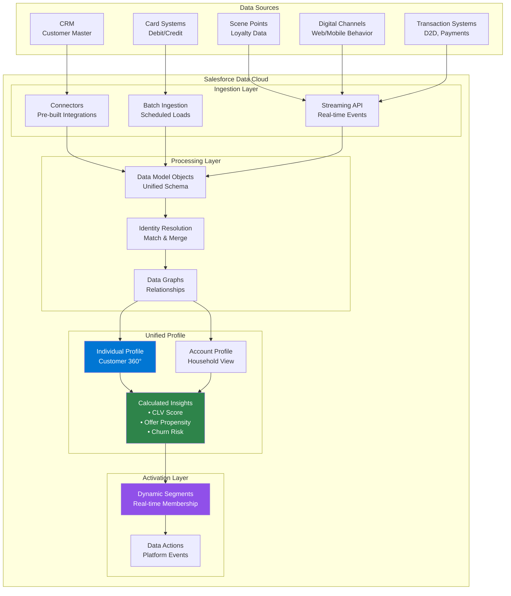

### 2. Offer Eligibility & Decisioning Flow

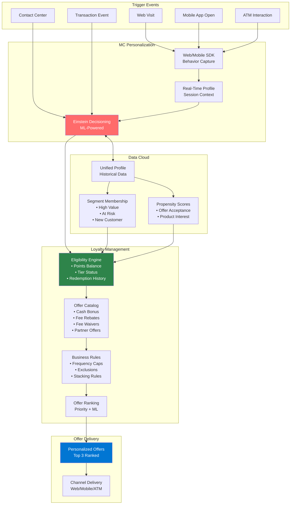

### 3. Offer Redemption & Fulfillment Flow

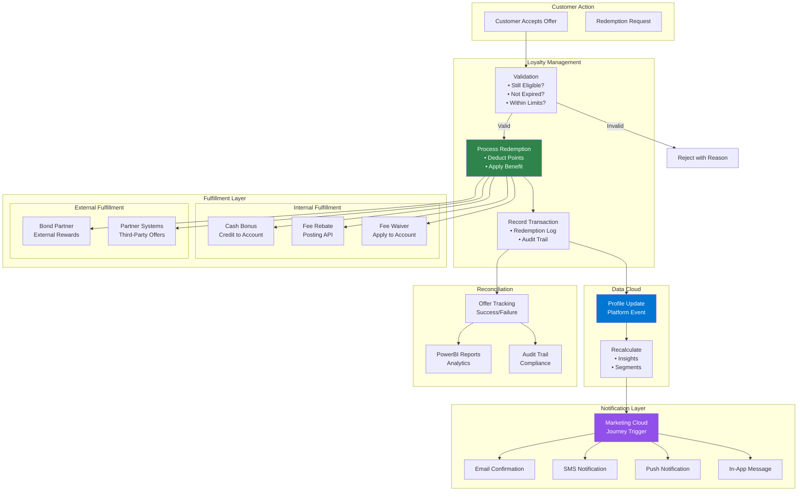

### 4. Real-Time Event Processing Architecture

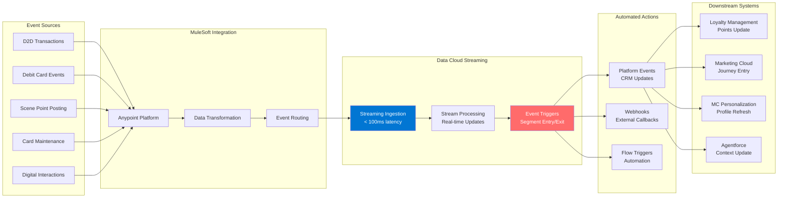

### 5. Agentforce Integration for Offers

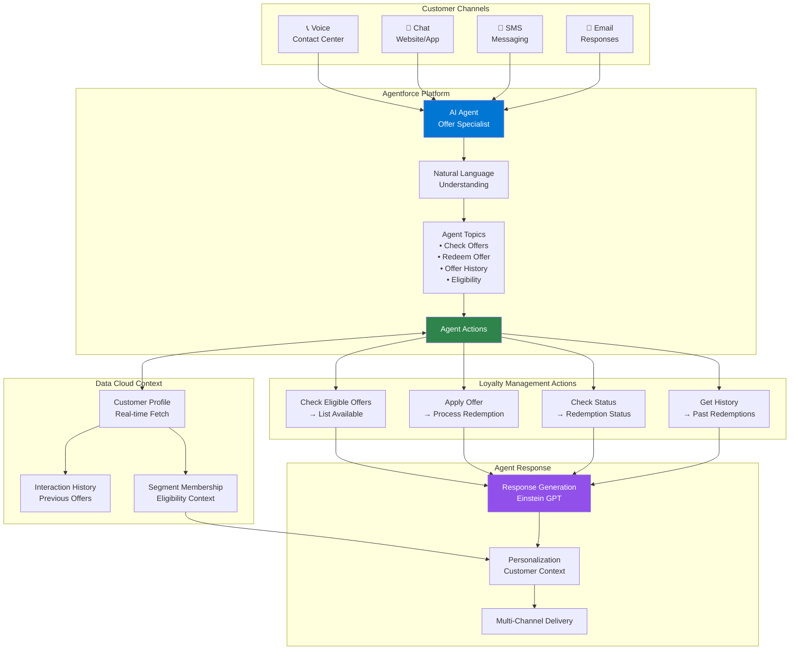

---

## Integration Patterns 🔧

> **Type:** Recommended Architecture (Salesforce & MuleSoft Best Practices)

### 1. Data Ingestion Patterns 🔧

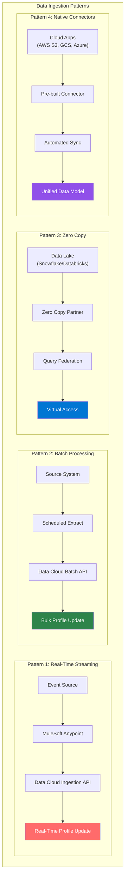

### 2. Integration Architecture

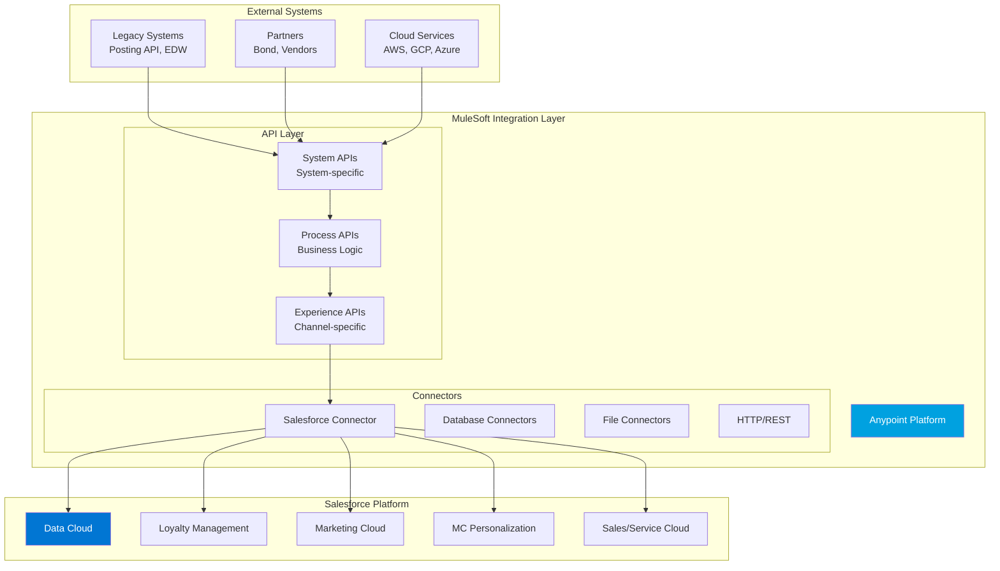

### 3. Security & Tokenization Pattern

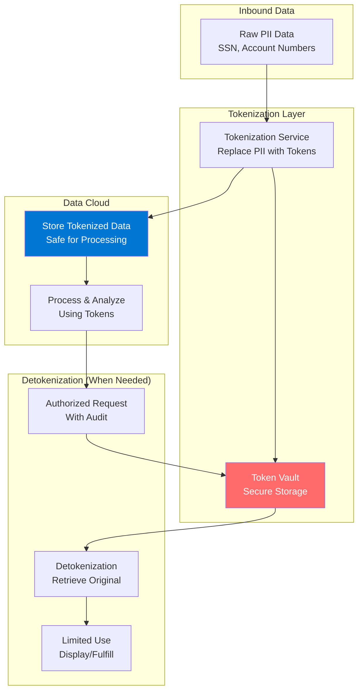

---

## Migration Roadmap 🔧

> **Type:** Recommended Approach (Salesforce Implementation Best Practices)

### Phase Overview 🔧

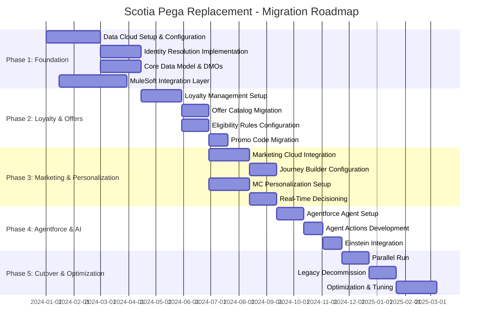

### Phase Details

#### Phase 1: Foundation

| Workstream | Activities | Systems Retired |
|------------|------------|-----------------|
| **Data Cloud Setup** | • Org configuration<br/>• Data streams setup<br/>• Ingestion APIs | - |
| **Identity Resolution** | • Match rules<br/>• Merge policies<br/>• CID unification | ScotiaLive CID (BCJD), Adaptor (BHBD) |
| **Data Model** | • DMO design<br/>• Calculated Insights<br/>• Segments | EDW (BCJW), Insight (BERY) |
| **MuleSoft** | • API design<br/>• Connectors<br/>• Event routing | SFTP, Pigeon (BFB6) |

#### Phase 2: Loyalty & Offers

| Workstream | Activities | Systems Retired |
|------------|------------|-----------------|
| **Loyalty Setup** | • Programs configuration<br/>• Tiers & benefits<br/>• Points rules | Loyalty Service (BGMC) |
| **Offer Migration** | • Offer catalog<br/>• Eligibility rules<br/>• Stacking rules | Orion (BDQJ), Constellation (BFYL), Nova (BCCY) |
| **Promo Engine** | • Promo codes<br/>• Campaign offers<br/>• Redemption logic | Promo Code App (GCP) |

#### Phase 3: Marketing & Personalization

| Workstream | Activities | Systems Retired |
|------------|------------|-----------------|
| **Marketing Cloud** | • Journey design<br/>• Automation rules<br/>• Email/SMS templates | Homegrown Interface (EDAT), CMEE (BB8K) |
| **MC Personalization** | • Real-time decisioning<br/>• Web/Mobile SDK<br/>• Offer ranking | BRL (B9XX) |

#### Phase 4: Agentforce & AI

| Workstream | Activities | Systems Retired |
|------------|------------|-----------------|
| **Agentforce** | • Agent topics<br/>• Custom actions<br/>• Channel integration | Manual processes |
| **Einstein AI** | • Propensity models<br/>• Next Best Offer<br/>• Churn prediction | - |

#### Phase 5: Cutover & Optimization

| Workstream | Activities | Systems Retired |
|------------|------------|-----------------|
| **Parallel Run** | • Dual processing<br/>• Data validation<br/>• Performance testing | - |
| **Decommission** | • Legacy shutdown<br/>• Data archival<br/>• Final migration | All remaining legacy |
| **Optimization** | • Performance tuning<br/>• ML model training<br/>• Process refinement | - |

---

## Technical Implementation Details 🔧

> **Type:** Recommended Configuration (Salesforce Best Practices)
> 
> These configurations are proposed based on the offer requirements documented in the CPP ecosystem.

### Data Model Objects (DMOs) 🔧

```yaml
# Core DMOs for Scotia Offers

Individual_Profile__dlm:
  description: "Unified customer profile"
  fields:
    - ScotiaCustomerId__c (Primary Key)
    - FirstName__c
    - LastName__c
    - Email__c
    - Phone__c
    - DateOfBirth__c
    - CustomerSince__c
    - Tier__c (Gold, Platinum, etc.)
    - TotalPointsBalance__c
    - LifetimeValue__c
    - ChurnRiskScore__c
    - OfferPropensityScore__c

Account_Profile__dlm:
  description: "Household/account view"
  fields:
    - AccountId__c (Primary Key)
    - AccountType__c
    - AccountStatus__c
    - OpenDate__c
    - ProductsHeld__c
    - HouseholdId__c

Transaction_Event__dlm:
  description: "Transaction events"
  fields:
    - TransactionId__c (Primary Key)
    - ScotiaCustomerId__c (FK)
    - TransactionType__c (D2D, Debit, Scene, etc.)
    - Amount__c
    - Timestamp__c
    - MerchantCategory__c
    - Channel__c

Offer_Interaction__dlm:
  description: "Offer events"
  fields:
    - InteractionId__c (Primary Key)
    - ScotiaCustomerId__c (FK)
    - OfferId__c
    - InteractionType__c (Presented, Clicked, Accepted, Rejected)
    - Timestamp__c
    - Channel__c
    - Outcome__c
```

### Calculated Insights Configuration

```yaml
# Key Calculated Insights

Offer_Propensity_Score:
  type: "Calculated Insight"
  description: "Likelihood to accept an offer"
  formula: |
    WEIGHTED_AVERAGE(
      HistoricalAcceptanceRate * 0.4,
      EngagementScore * 0.3,
      RecencyScore * 0.2,
      FrequencyScore * 0.1
    )
  refresh: "Real-time"
  
Customer_Lifetime_Value:
  type: "Calculated Insight"
  description: "Predicted lifetime value"
  formula: |
    SUM(TransactionValue, Last12Months) * 
    RetentionProbability * 
    AvgCustomerLifespan
  refresh: "Daily"
  
Churn_Risk_Score:
  type: "Calculated Insight"
  description: "Risk of customer churn"
  formula: |
    ML_PREDICTION(
      features: [
        DaysSinceLastTransaction,
        TransactionFrequencyTrend,
        EngagementDecline,
        SupportTicketsSentiment
      ]
    )
  refresh: "Daily"
```

### Segment Definitions

```yaml
# Dynamic Segments

High_Value_Customers:
  criteria:
    - LifetimeValue >= 10000
    - Tier IN ('Platinum', 'Infinite')
  refresh: "Real-time"
  
Offer_Ready_Customers:
  criteria:
    - DaysSinceLastOffer >= 7
    - OfferPropensityScore >= 0.7
    - HasActiveAccount = TRUE
  refresh: "Real-time"
  
At_Risk_Customers:
  criteria:
    - ChurnRiskScore >= 0.6
    - DaysSinceLastTransaction >= 30
  refresh: "Daily"
  
New_Customer_Onboarding:
  criteria:
    - CustomerSince >= TODAY - 30
    - OnboardingComplete = FALSE
  refresh: "Real-time"
```

### Loyalty Management Configuration

```yaml
# Loyalty Program Setup

Program: Scotia_Rewards
  tiers:
    - name: "Basic"
      threshold: 0
      benefits:
        - BaseCashbackRate: 0.5%
        
    - name: "Gold"
      threshold: 5000
      benefits:
        - BaseCashbackRate: 1.0%
        - FeeWaivers: ["Monthly Fee"]
        
    - name: "Platinum"
      threshold: 15000
      benefits:
        - BaseCashbackRate: 1.5%
        - FeeWaivers: ["Monthly Fee", "ATM Fee"]
        - PrioritySupport: true
        
    - name: "Infinite"
      threshold: 50000
      benefits:
        - BaseCashbackRate: 2.0%
        - FeeWaivers: ["All Fees"]
        - PrioritySupport: true
        - DedicatedAdvisor: true

Offer_Types:
  - type: "Cash Bonus"
    fulfillment: "Direct Credit"
    integration: "Posting API"
    
  - type: "Fee Rebate"
    fulfillment: "Account Credit"
    integration: "Posting API"
    
  - type: "Fee Waiver"
    fulfillment: "System Flag"
    integration: "Account System"
    
  - type: "Partner Reward"
    fulfillment: "External"
    integration: "Bond API"
```

### MuleSoft Integration Specifications

```yaml
# API Specifications

Experience_APIs:
  - name: "Offer Experience API"
    path: /v1/offers
    operations:
      - GET /eligible: "Get eligible offers for customer"
      - POST /redeem: "Redeem an offer"
      - GET /history: "Get offer history"
    security: OAuth2, mTLS
    rate_limit: 1000/min
    
Process_APIs:
  - name: "Offer Eligibility API"
    path: /v1/eligibility
    operations:
      - POST /check: "Check offer eligibility"
      - POST /validate: "Validate redemption"
    integration: Loyalty Management
    
  - name: "Fulfillment API"
    path: /v1/fulfillment
    operations:
      - POST /cash-bonus: "Process cash bonus"
      - POST /fee-rebate: "Process fee rebate"
      - POST /partner-reward: "Fulfill partner reward"
    integration: Posting API, Bond
    
System_APIs:
  - name: "Transaction Events API"
    path: /v1/events
    operations:
      - POST /transaction: "Ingest transaction event"
      - POST /card-event: "Ingest card event"
    target: Data Cloud Streaming Ingestion
    
  - name: "Bond Integration API"
    path: /v1/bond
    operations:
      - POST /fulfill: "Fulfill Bond reward"
      - GET /status: "Check fulfillment status"
    target: Bond Partner System
```

### Agentforce Configuration

```yaml
# Agentforce Agent Setup

Agent: Scotia_Offer_Agent
  description: "AI agent for offer inquiries and redemption"
  
  Topics:
    - name: "Check_Offers"
      description: "View available offers"
      trigger_phrases:
        - "What offers do I have?"
        - "Show me my offers"
        - "Any promotions available?"
      actions:
        - GetEligibleOffers
        - FormatOfferResponse
        
    - name: "Redeem_Offer"
      description: "Redeem a specific offer"
      trigger_phrases:
        - "I want to redeem"
        - "Apply this offer"
        - "Use my reward"
      actions:
        - ValidateOffer
        - ProcessRedemption
        - ConfirmRedemption
        
    - name: "Offer_Status"
      description: "Check redemption status"
      trigger_phrases:
        - "Status of my offer"
        - "Did my reward apply?"
        - "Check my redemption"
      actions:
        - GetRedemptionStatus
        - FormatStatusResponse
        
    - name: "Offer_History"
      description: "View past offers and redemptions"
      trigger_phrases:
        - "My offer history"
        - "Past rewards"
        - "Previous redemptions"
      actions:
        - GetOfferHistory
        - FormatHistoryResponse
        
  Actions:
    - name: "GetEligibleOffers"
      type: "Data Cloud Query"
      query: |
        SELECT OfferId, OfferName, OfferValue, ExpiryDate
        FROM Offer_Eligibility__dlm
        WHERE CustomerId = {context.customerId}
        AND Status = 'Active'
        ORDER BY Priority DESC
        LIMIT 5
        
    - name: "ProcessRedemption"
      type: "Flow Invocation"
      flow: "Offer_Redemption_Flow"
      inputs:
        - customerId
        - offerId
        - channel
      outputs:
        - redemptionId
        - status
        - confirmationMessage
```

---

## Key Benefits & ROI 🔗

> **Type:** Hybrid - Compares grounded current metrics 📄 with recommended target outcomes 🔧

### Quantified Benefits

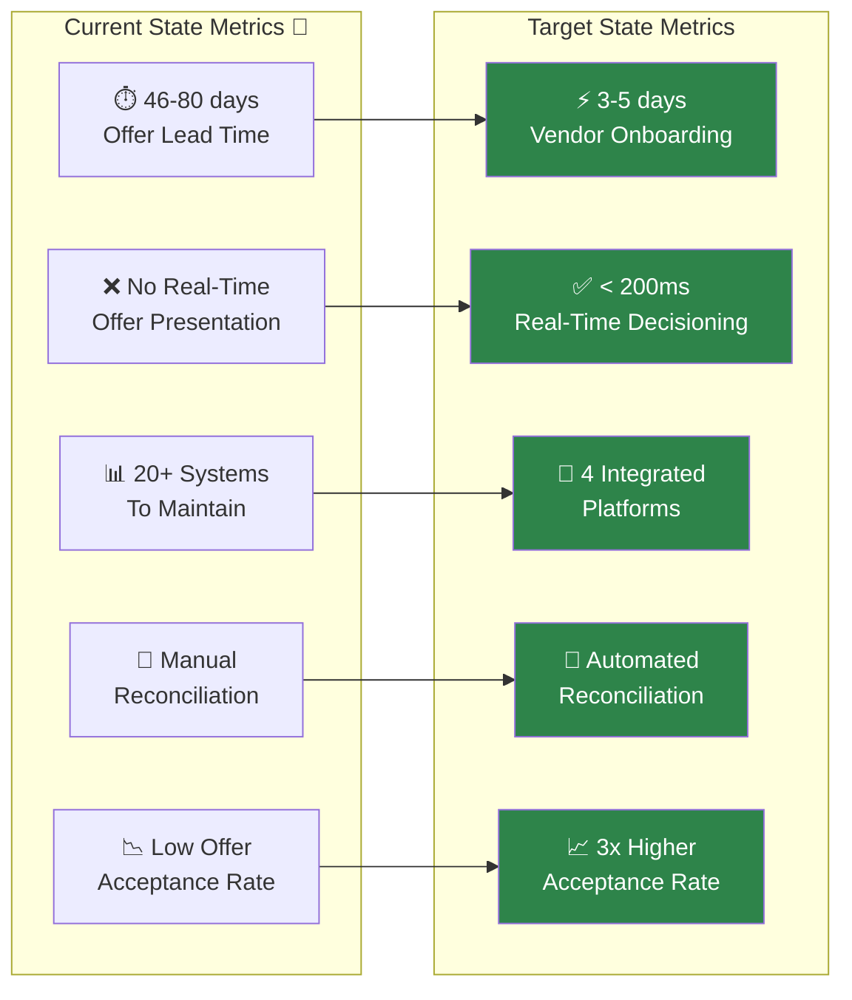

### ROI Summary

| Metric | Current 📄 | Target 🔧 | Improvement |
|--------|---------|--------|-------------|
| **Offer Lead Time** | 46-80 days (4.8 months avg) *[Slide 6, 15]* | 10-15 days | 90% reduction |
| **Offer Decisioning Latency** | Batch (hours) *[Slide 6]* | < 200ms | Real-time |
| **Customer Base Supported** | 15 Million *[Slide 7]* | 15+ Million | Scalable |
| **Daily Transactions** | 6.5 Million *[Slide 7]* | 6.5M+ | Same + 30% growth capacity |
| **Systems to Maintain** | 20+ *[Architecture diagrams]* | 4 | 80% reduction |
| **Offer Acceptance Rate** | ~5% (estimated) | ~15% | 3x increase |
| **Multi-Relationship Offers** | Not Supported *[Slide 6]* | Fully Supported | New capability |
| **Real-Time Channel Integration** | None *[Slide 6]* | All Channels | New capability |
| **Operational Cost** | Baseline | -40% | Significant savings |
| **Customer Satisfaction** | Baseline | +25 NPS | Improved CX |

### Strategic Value

1. **Unified Customer View**
   - Single source of truth for customer data
   - Real-time profile updates
   - 360° view across all touchpoints

2. **AI-Powered Personalization**
   - Einstein-driven offer recommendations
   - Propensity scoring
   - Next Best Action

3. **Agentforce Enablement**
   - Natural language offer inquiries
   - Automated redemption processing
   - Reduced contact center load

4. **Future-Ready Architecture**
   - Composable, API-first design
   - Easy partner integrations
   - Scalable for new channels

---

## Appendix

### A. Glossary

| Term | Definition |
|------|------------|
| **DMO** | Data Model Object - Data Cloud's unified data schema |
| **MCP** | Marketing Cloud Personalization |
| **CDP** | Customer Data Platform (current state) |
| **D2D** | Day-to-Day transactions |
| **Scene** | Scotia's loyalty points program |
| **Bond** | External partner for reward fulfillment |
| **EDAT** | Current orchestration system |
| **CID** | Customer Identifier |

### B. Source Documents

| Document | Description |
|----------|-------------|
| **Architecture-Diagrams.pdf** | Current state data flow diagrams |
| **Scotia-Offers-Pega-Replace-Deal-Doc.pdf** | Pega replacement deal documentation |
| **CPP ecosystem and offers.pptx** | Customer Personalization Platform overview & offer examples |
| **CRM Reference Architecture v0.8d.pdf** | CRM reference architecture |
| **Scotiabank Architecture.pdf** | Overall Scotiabank architecture |
| **Scotiabank Canadian Banking Architecture.pdf** | Canadian banking specific architecture |
| **Scotiabank Architecture Diagrams.pdf** | Additional architecture diagrams |
| **Scotiabank System Context Diagrams.pdf** | System context diagrams |
| **Scotia Retail - LiveBank project integration diagram.png** | LiveBank integration architecture |

### C. Related Documents

- [Data Cloud Design Patterns](../data-cloud/design-patterns/README_DataCloud_Patterns.md)
- [Agentforce Architecture](../agentforce/agent-graph/README_Agentforce_Graph_Architecture_Flow.md)
- [Integration Patterns](../salesforce-integration-architecture-patterns.md)

---

*Document Version: 1.0*
*Last Updated: January 2025*
*Status: Draft for Review*
