# Scotia Offers: Pega Replacement Architecture
## Salesforce Data Cloud, Loyalty Management & Marketing Cloud Solution

---

## Table of Contents
1. [Executive Summary](#executive-summary)
2. [Current State Architecture](#current-state-architecture)
3. [Target State Architecture](#target-state-architecture)
4. [Component Mapping: Current → Target](#component-mapping-current--target)
5. [Data Flow Diagrams](#data-flow-diagrams)
6. [Integration Patterns](#integration-patterns)
7. [Migration Roadmap](#migration-roadmap)
8. [Technical Implementation Details](#technical-implementation-details)
9. [Key Benefits & ROI](#key-benefits--roi)

---

## Executive Summary

### The Challenge
Scotia's current offer management ecosystem consists of **20+ fragmented systems** spanning Azure, GCP, and on-premise infrastructure. The architecture suffers from:
- **30-50 day vendor onboarding cycles**
- **No real-time offer presentation** (critical gap)
- **Batch-dependent data flows** via SFTP
- **Complex reconciliation processes**
- **Vendor dependency challenges**

### The Solution
Replace the Pega-based offer management with a unified **Salesforce stack**:

| Component | Role | Replaces |
|-----------|------|----------|
| **Salesforce Data Cloud** | The Hub & Brain | CDP, Event Exchange Hub, EDW |
| **Loyalty Management** | The Offer Engine | Orion, Constellation, Nova, Promo Code App |
| **Marketing Cloud** | The Orchestration Engine | Homegrown Interface, EDAT |
| **MC Personalization** | Real-Time Inbound Engine | BRL, CMEE, R/T gaps |

### Key Outcomes
- **Reduce vendor onboarding from 30-50 days → 3-5 days**
- **Enable real-time offer decisioning** (closing the R/T gap)
- **Consolidate 20+ systems → 4 integrated platforms**
- **Unified customer 360° view** across all touchpoints

---

## Current State Architecture

### System Inventory

```mermaid
graph TB
    subgraph "Current State: 20+ Fragmented Systems"
        subgraph "Entry Points"
            BNS[("👤 BNS User<br/>Product Setup")]
            VENDOR["Vendor SaaS<br/>⏱️ 30-50 days"]
        end
        
        subgraph "Azure Layer"
            AZURE[("☁️ Azure")]
            BHF7["Product Catalog<br/>& Offer Tracking<br/>(BHF7)"]
        end
        
        subgraph "Ingestion Layer"
            SFTP["📁 SFTP<br/>(Legacy)"]
            BB4J["CBT EDL Ingestion<br/>(BB4J)"]
            B9K3["EDLR<br/>(B9K3)"]
        end
        
        subgraph "GCP Processing"
            GCS["Google Storage"]
            PROMO["Promo Code App"]
            BFB6["Pigeon (BFB6)"]
            BERY["Insight (BERY)"]
            BDMS["Marvel (BDMS)"]
        end
        
        subgraph "Offer Presentation Layer"
            BDQJ["Orion (BDQJ)"]
            BFYL["Constellation (BFYL)"]
            BCCY["Nova (BCCY)"]
            B9XX["BRL (B9XX)"]
            BB8K["CMEE (BB8K)"]
        end
        
        subgraph "CDP & Orchestration"
            CDP["CDP"]
            BHBD["Adaptor (BHBD)"]
            HOMEGROWN["Homegrown Interface<br/>EDAT Orchestration"]
            BFC8["DLP Tokenization<br/>(BFC8)"]
        end
        
        subgraph "Event Processing"
            BF8M["Event Exchange Hub<br/>(BF8M)"]
            BDLQ["Data Power (BDLQ)"]
        end
        
        subgraph "Downstream Systems"
            POSTING["Posting API<br/>(TDS BFI4)"]
            BCJW["EDW (BCJW)"]
            BD8K["AW (BD8K)"]
            BCYN["EP (BCYN)"]
            BGMC["Loyalty Service<br/>(BGMC)"]
            BOND["Bond"]
        end
    end
    
    BNS --> VENDOR
    VENDOR --> BHF7
    BHF7 --> SFTP
    SFTP --> GCS
    GCS --> BFB6
    BFB6 --> BDQJ
    BDQJ --> CDP
    CDP --> BF8M
    BF8M --> POSTING
    BGMC --> BOND
    
    style SFTP fill:#ff6b6b,color:#fff
    style HOMEGROWN fill:#ff6b6b,color:#fff
    style VENDOR fill:#ffd93d,color:#000
```



### Current Data Flow Sequence

```mermaid
sequenceDiagram
    autonumber
    participant BNS as 👤 BNS User
    participant Vendor as Vendor SaaS
    participant SFTP as SFTP (Legacy)
    participant GCP as GCP Storage
    participant Token as DLP Tokenization
    participant Extract as 6G Extract
    participant Offer as Offer Layer<br/>(Orion/Constellation/Nova)
    participant CDP as CDP
    participant EventHub as Event Exchange Hub
    participant Posting as Posting API
    participant Loyalty as Loyalty Service
    participant Bond as Bond
    
    Note over BNS,Vendor: ⏱️ 30-50 days setup time
    BNS->>Vendor: 1. Product setup/offer config
    Vendor->>SFTP: 2. Batch file (tokenized)
    SFTP->>GCP: 3. Upload batch file
    GCP->>Token: 3b. Detokenization
    Token->>Extract: 4. Extract input/offer data
    Extract->>Offer: 5-6. Push to presentation layer
    
    Note over Offer,CDP: ❌ GAP: No R/T connection
    Offer--xCDP: Limited connectivity
    
    CDP->>EventHub: 7. Real-time events
    EventHub->>CDP: 8. Send BNS input events
    CDP->>EventHub: 9. Receive vendor events
    
    par Parallel Processing
        EventHub->>Posting: 10a. Cash bonus/fee rebates
        EventHub->>Loyalty: 10b. Consume events
    end
    
    Loyalty->>Bond: 11. Loyalty fulfillment
```



### Current State Problems

| # | Problem | Impact | Root Cause |
|---|---------|--------|------------|
| 1 | **No R/T Offer Presentation** | Lost revenue, poor CX | Adapter to Orion/Constellation/Nova not connected |
| 2 | **30-50 Day Vendor Onboarding** | Slow time-to-market | Complex manual processes |
| 3 | **Batch-Only Integration** | Stale data, delayed offers | SFTP dependency |
| 4 | **20+ Systems** | High maintenance cost | Organic growth without consolidation |
| 5 | **Manual Reconciliation** | Errors, delays | No unified data model |
| 6 | **No Testing Framework** | Quality issues | Missing testing management process |

---

## Target State Architecture

### Salesforce Stack Overview

```mermaid
graph TB
    subgraph "Target State: Unified Salesforce Platform"
        subgraph "Data Sources"
            CRM["Salesforce CRM<br/>Customer Data"]
            TRANS["Transaction Systems<br/>D2D, Debit Card, Scene"]
            EXTERNAL["External Partners<br/>Bond, Vendors"]
            WEB["Digital Channels<br/>Web, Mobile, ATM"]
        end
        
        subgraph "Salesforce Data Cloud [The Hub & Brain]"
            INGEST["Data Ingestion<br/>• Streaming (Real-time)<br/>• Batch (Scheduled)<br/>• Zero Copy"]
            PROFILE["Unified Profile<br/>• Identity Resolution<br/>• Customer 360°"]
            SEGMENT["Segmentation<br/>• Dynamic Segments<br/>• Calculated Insights"]
            ACTIVATE["Data Actions<br/>• Activations<br/>• Platform Events"]
        end
        
        subgraph "Loyalty Management [The Offer Engine]"
            PROGRAMS["Loyalty Programs<br/>• Points, Tiers, Benefits"]
            OFFERS["Offer Management<br/>• Eligibility Rules<br/>• Redemption Logic"]
            REWARDS["Rewards Catalog<br/>• Cash Bonus<br/>• Fee Rebates<br/>• Fee Waivers"]
            PROMO2["Promotion Engine<br/>• Promo Codes<br/>• Campaign Offers"]
        end
        
        subgraph "Marketing Cloud [The Orchestration Engine]"
            JOURNEY["Journey Builder<br/>• Multi-step Journeys<br/>• Decision Splits"]
            EMAIL["Email Studio"]
            SMS2["Mobile (SMS/Push)"]
            AUTOMATION["Automation Studio<br/>• Scheduled Jobs<br/>• Triggered Sends"]
        end
        
        subgraph "MC Personalization [Real-Time Inbound Engine]"
            DECISION["Real-Time Decisioning<br/>• Next Best Offer<br/>• Personalization"]
            WEB_SDK["Web SDK<br/>• Site Personalization"]
            MOBILE_SDK["Mobile SDK<br/>• In-App Offers"]
            EINSTEIN_DEC["Einstein Decisions<br/>• ML-Powered"]
        end
        
        subgraph "Agentforce [AI Layer]"
            AGENT["Agentforce Agents<br/>• Offer Recommendations<br/>• Customer Service"]
            COPILOT["Einstein Copilot<br/>• Natural Language"]
            ACTIONS["Agent Actions<br/>• Offer Application<br/>• Status Check"]
        end
    end
    
    CRM --> INGEST
    TRANS --> INGEST
    EXTERNAL --> INGEST
    WEB --> INGEST
    
    INGEST --> PROFILE
    PROFILE --> SEGMENT
    SEGMENT --> ACTIVATE
    
    ACTIVATE --> OFFERS
    ACTIVATE --> JOURNEY
    ACTIVATE --> DECISION
    
    OFFERS --> REWARDS
    PROMO2 --> OFFERS
    
    JOURNEY --> EMAIL
    JOURNEY --> SMS2
    
    DECISION --> WEB_SDK
    DECISION --> MOBILE_SDK
    
    PROFILE --> AGENT
    OFFERS --> ACTIONS
    
    style PROFILE fill:#0176d3,color:#fff
    style DECISION fill:#ff6b6b,color:#fff
    style OFFERS fill:#2e844a,color:#fff
    style JOURNEY fill:#9050e9,color:#fff
```



### Target State Data Flow


---

## Component Mapping: Current → Target

### Detailed System Migration Map


### Component-by-Component Migration Details

| Current System | Code | Function | Target System | Migration Approach |
|----------------|------|----------|---------------|-------------------|
| **CDP** | - | Central data platform | Data Cloud | Direct replacement with enhanced capabilities |
| **Event Exchange Hub** | BF8M | Real-time events | Data Cloud Streaming | Native streaming ingestion |
| **EDW** | BCJW | Data warehouse | Data Cloud + Tableau | Unified analytics layer |
| **Adaptor** | BHBD | Reconciliation | Data Cloud Identity Resolution | Automated matching |
| **Data Power** | BDLQ | Event tracing | Data Cloud Data Actions | Platform Events |
| **ScotiaLive CID** | BCJD | Customer ID lookup | Data Cloud Identity Resolution | Unified identity |
| **Orion** | BDQJ | Offer presentation | Loyalty Management | Offer engine with rules |
| **Constellation** | BFYL | Offer management | Loyalty Management | Centralized offer mgmt |
| **Nova** | BCCY | Offer delivery | Loyalty Management + MCP | Real-time delivery |
| **Promo Code App** | GCP | Promo codes | Loyalty Management Promotions | Native promo engine |
| **Loyalty Service** | BGMC | Loyalty fulfillment | Loyalty Management Rewards | Rewards catalog |
| **Homegrown Interface** | EDAT | Orchestration | Marketing Cloud Journey Builder | Visual journey design |
| **CMEE** | BB8K | Campaign execution | Marketing Cloud Automation | Automated campaigns |
| **BRL** | B9XX | Business rules | MC Personalization | Real-time decisioning |
| **SFTP** | - | File transfer | MuleSoft / Data Cloud Connectors | API-first integration |
| **Google Storage** | GCP | File storage | Data Cloud Ingestion API | Direct streaming |
| **Pigeon** | BFB6 | Data pipeline | MuleSoft + Data Cloud | Event-driven flow |
| **Marvel** | BDMS | Data management | Data Cloud | Unified data model |
| **Insight** | BERY | Analytics | Data Cloud Calculated Insights | Built-in analytics |
| **Posting API** | TDS BFI4 | Fulfillment | MuleSoft API | API orchestration |
| **6G** | BC6L | Data extraction | Data Cloud Ingestion | Native connectors |
| **CBT EDL** | BB4J | EDL ingestion | Data Cloud Batch Ingestion | Scheduled loads |

---

## Data Flow Diagrams

### 1. Customer Onboarding & Profile Creation


### 2. Offer Eligibility & Decisioning Flow


### 3. Offer Redemption & Fulfillment Flow


### 4. Real-Time Event Processing Architecture


### 5. Agentforce Integration for Offers


---

## Integration Patterns

### 1. Data Ingestion Patterns


### 2. Integration Architecture


### 3. Security & Tokenization Pattern


---

## Migration Roadmap

### Phase Overview


### Phase Details

#### Phase 1: Foundation (Months 1-4)

| Workstream | Activities | Systems Retired |
|------------|------------|-----------------|
| **Data Cloud Setup** | • Org configuration<br/>• Data streams setup<br/>• Ingestion APIs | - |
| **Identity Resolution** | • Match rules<br/>• Merge policies<br/>• CID unification | ScotiaLive CID (BCJD), Adaptor (BHBD) |
| **Data Model** | • DMO design<br/>• Calculated Insights<br/>• Segments | EDW (BCJW), Insight (BERY) |
| **MuleSoft** | • API design<br/>• Connectors<br/>• Event routing | SFTP, Pigeon (BFB6) |

#### Phase 2: Loyalty & Offers (Months 4-7)

| Workstream | Activities | Systems Retired |
|------------|------------|-----------------|
| **Loyalty Setup** | • Programs configuration<br/>• Tiers & benefits<br/>• Points rules | Loyalty Service (BGMC) |
| **Offer Migration** | • Offer catalog<br/>• Eligibility rules<br/>• Stacking rules | Orion (BDQJ), Constellation (BFYL), Nova (BCCY) |
| **Promo Engine** | • Promo codes<br/>• Campaign offers<br/>• Redemption logic | Promo Code App (GCP) |

#### Phase 3: Marketing & Personalization (Months 6-9)

| Workstream | Activities | Systems Retired |
|------------|------------|-----------------|
| **Marketing Cloud** | • Journey design<br/>• Automation rules<br/>• Email/SMS templates | Homegrown Interface (EDAT), CMEE (BB8K) |
| **MC Personalization** | • Real-time decisioning<br/>• Web/Mobile SDK<br/>• Offer ranking | BRL (B9XX) |

#### Phase 4: Agentforce & AI (Months 9-11)

| Workstream | Activities | Systems Retired |
|------------|------------|-----------------|
| **Agentforce** | • Agent topics<br/>• Custom actions<br/>• Channel integration | Manual processes |
| **Einstein AI** | • Propensity models<br/>• Next Best Offer<br/>• Churn prediction | - |

#### Phase 5: Cutover & Optimization (Months 11-14)

| Workstream | Activities | Systems Retired |
|------------|------------|-----------------|
| **Parallel Run** | • Dual processing<br/>• Data validation<br/>• Performance testing | - |
| **Decommission** | • Legacy shutdown<br/>• Data archival<br/>• Final migration | All remaining legacy |
| **Optimization** | • Performance tuning<br/>• ML model training<br/>• Process refinement | - |

---

## Technical Implementation Details

### Data Model Objects (DMOs)

```yaml
# Core DMOs for Scotia Offers

Individual_Profile__dlm:
  description: "Unified customer profile"
  fields:
    - ScotiaCustomerId__c (Primary Key)
    - FirstName__c
    - LastName__c
    - Email__c
    - Phone__c
    - DateOfBirth__c
    - CustomerSince__c
    - Tier__c (Gold, Platinum, etc.)
    - TotalPointsBalance__c
    - LifetimeValue__c
    - ChurnRiskScore__c
    - OfferPropensityScore__c

Account_Profile__dlm:
  description: "Household/account view"
  fields:
    - AccountId__c (Primary Key)
    - AccountType__c
    - AccountStatus__c
    - OpenDate__c
    - ProductsHeld__c
    - HouseholdId__c

Transaction_Event__dlm:
  description: "Transaction events"
  fields:
    - TransactionId__c (Primary Key)
    - ScotiaCustomerId__c (FK)
    - TransactionType__c (D2D, Debit, Scene, etc.)
    - Amount__c
    - Timestamp__c
    - MerchantCategory__c
    - Channel__c

Offer_Interaction__dlm:
  description: "Offer events"
  fields:
    - InteractionId__c (Primary Key)
    - ScotiaCustomerId__c (FK)
    - OfferId__c
    - InteractionType__c (Presented, Clicked, Accepted, Rejected)
    - Timestamp__c
    - Channel__c
    - Outcome__c
```

### Calculated Insights Configuration

```yaml
# Key Calculated Insights

Offer_Propensity_Score:
  type: "Calculated Insight"
  description: "Likelihood to accept an offer"
  formula: |
    WEIGHTED_AVERAGE(
      HistoricalAcceptanceRate * 0.4,
      EngagementScore * 0.3,
      RecencyScore * 0.2,
      FrequencyScore * 0.1
    )
  refresh: "Real-time"
  
Customer_Lifetime_Value:
  type: "Calculated Insight"
  description: "Predicted lifetime value"
  formula: |
    SUM(TransactionValue, Last12Months) * 
    RetentionProbability * 
    AvgCustomerLifespan
  refresh: "Daily"
  
Churn_Risk_Score:
  type: "Calculated Insight"
  description: "Risk of customer churn"
  formula: |
    ML_PREDICTION(
      features: [
        DaysSinceLastTransaction,
        TransactionFrequencyTrend,
        EngagementDecline,
        SupportTicketsSentiment
      ]
    )
  refresh: "Daily"
```

### Segment Definitions

```yaml
# Dynamic Segments

High_Value_Customers:
  criteria:
    - LifetimeValue >= 10000
    - Tier IN ('Platinum', 'Infinite')
  refresh: "Real-time"
  
Offer_Ready_Customers:
  criteria:
    - DaysSinceLastOffer >= 7
    - OfferPropensityScore >= 0.7
    - HasActiveAccount = TRUE
  refresh: "Real-time"
  
At_Risk_Customers:
  criteria:
    - ChurnRiskScore >= 0.6
    - DaysSinceLastTransaction >= 30
  refresh: "Daily"
  
New_Customer_Onboarding:
  criteria:
    - CustomerSince >= TODAY - 30
    - OnboardingComplete = FALSE
  refresh: "Real-time"
```

### Loyalty Management Configuration

```yaml
# Loyalty Program Setup

Program: Scotia_Rewards
  tiers:
    - name: "Basic"
      threshold: 0
      benefits:
        - BaseCashbackRate: 0.5%
        
    - name: "Gold"
      threshold: 5000
      benefits:
        - BaseCashbackRate: 1.0%
        - FeeWaivers: ["Monthly Fee"]
        
    - name: "Platinum"
      threshold: 15000
      benefits:
        - BaseCashbackRate: 1.5%
        - FeeWaivers: ["Monthly Fee", "ATM Fee"]
        - PrioritySupport: true
        
    - name: "Infinite"
      threshold: 50000
      benefits:
        - BaseCashbackRate: 2.0%
        - FeeWaivers: ["All Fees"]
        - PrioritySupport: true
        - DedicatedAdvisor: true

Offer_Types:
  - type: "Cash Bonus"
    fulfillment: "Direct Credit"
    integration: "Posting API"
    
  - type: "Fee Rebate"
    fulfillment: "Account Credit"
    integration: "Posting API"
    
  - type: "Fee Waiver"
    fulfillment: "System Flag"
    integration: "Account System"
    
  - type: "Partner Reward"
    fulfillment: "External"
    integration: "Bond API"
```

### MuleSoft Integration Specifications

```yaml
# API Specifications

Experience_APIs:
  - name: "Offer Experience API"
    path: /v1/offers
    operations:
      - GET /eligible: "Get eligible offers for customer"
      - POST /redeem: "Redeem an offer"
      - GET /history: "Get offer history"
    security: OAuth2, mTLS
    rate_limit: 1000/min
    
Process_APIs:
  - name: "Offer Eligibility API"
    path: /v1/eligibility
    operations:
      - POST /check: "Check offer eligibility"
      - POST /validate: "Validate redemption"
    integration: Loyalty Management
    
  - name: "Fulfillment API"
    path: /v1/fulfillment
    operations:
      - POST /cash-bonus: "Process cash bonus"
      - POST /fee-rebate: "Process fee rebate"
      - POST /partner-reward: "Fulfill partner reward"
    integration: Posting API, Bond
    
System_APIs:
  - name: "Transaction Events API"
    path: /v1/events
    operations:
      - POST /transaction: "Ingest transaction event"
      - POST /card-event: "Ingest card event"
    target: Data Cloud Streaming Ingestion
    
  - name: "Bond Integration API"
    path: /v1/bond
    operations:
      - POST /fulfill: "Fulfill Bond reward"
      - GET /status: "Check fulfillment status"
    target: Bond Partner System
```

### Agentforce Configuration

```yaml
# Agentforce Agent Setup

Agent: Scotia_Offer_Agent
  description: "AI agent for offer inquiries and redemption"
  
  Topics:
    - name: "Check_Offers"
      description: "View available offers"
      trigger_phrases:
        - "What offers do I have?"
        - "Show me my offers"
        - "Any promotions available?"
      actions:
        - GetEligibleOffers
        - FormatOfferResponse
        
    - name: "Redeem_Offer"
      description: "Redeem a specific offer"
      trigger_phrases:
        - "I want to redeem"
        - "Apply this offer"
        - "Use my reward"
      actions:
        - ValidateOffer
        - ProcessRedemption
        - ConfirmRedemption
        
    - name: "Offer_Status"
      description: "Check redemption status"
      trigger_phrases:
        - "Status of my offer"
        - "Did my reward apply?"
        - "Check my redemption"
      actions:
        - GetRedemptionStatus
        - FormatStatusResponse
        
    - name: "Offer_History"
      description: "View past offers and redemptions"
      trigger_phrases:
        - "My offer history"
        - "Past rewards"
        - "Previous redemptions"
      actions:
        - GetOfferHistory
        - FormatHistoryResponse
        
  Actions:
    - name: "GetEligibleOffers"
      type: "Data Cloud Query"
      query: |
        SELECT OfferId, OfferName, OfferValue, ExpiryDate
        FROM Offer_Eligibility__dlm
        WHERE CustomerId = {context.customerId}
        AND Status = 'Active'
        ORDER BY Priority DESC
        LIMIT 5
        
    - name: "ProcessRedemption"
      type: "Flow Invocation"
      flow: "Offer_Redemption_Flow"
      inputs:
        - customerId
        - offerId
        - channel
      outputs:
        - redemptionId
        - status
        - confirmationMessage
```

---

## Key Benefits & ROI

### Quantified Benefits

```mermaid
graph LR
    subgraph Before["Current State Metrics"]
        B1["⏱️ 30-50 days<br/>Vendor Onboarding"]
        B2["❌ No Real-Time<br/>Offer Presentation"]
        B3["📊 20+ Systems<br/>To Maintain"]
        B4["🔄 Manual<br/>Reconciliation"]
        B5["📉 Low Offer<br/>Acceptance Rate"]
    end
    
    subgraph After["Target State Metrics"]
        A1["⚡ 3-5 days<br/>Vendor Onboarding"]
        A2["✅ < 200ms<br/>Real-Time Decisioning"]
        A3["🎯 4 Integrated<br/>Platforms"]
        A4["🤖 Automated<br/>Reconciliation"]
        A5["📈 3x Higher<br/>Acceptance Rate"]
    end
    
    B1 --> A1
    B2 --> A2
    B3 --> A3
    B4 --> A4
    B5 --> A5
    
    style A1 fill:#2e844a,color:#fff
    style A2 fill:#2e844a,color:#fff
    style A3 fill:#2e844a,color:#fff
    style A4 fill:#2e844a,color:#fff
    style A5 fill:#2e844a,color:#fff
```



### ROI Summary

| Metric | Current | Target | Improvement |
|--------|---------|--------|-------------|
| **Vendor Onboarding Time** | 30-50 days | 3-5 days | 90% reduction |
| **Offer Decisioning Latency** | Batch (hours) | < 200ms | Real-time |
| **Systems to Maintain** | 20+ | 4 | 80% reduction |
| **Offer Acceptance Rate** | ~5% | ~15% | 3x increase |
| **Operational Cost** | Baseline | -40% | Significant savings |
| **Time to Market (New Offers)** | Weeks | Days | 5x faster |
| **Customer Satisfaction** | Baseline | +25 NPS | Improved CX |

### Strategic Value

1. **Unified Customer View**
   - Single source of truth for customer data
   - Real-time profile updates
   - 360° view across all touchpoints

2. **AI-Powered Personalization**
   - Einstein-driven offer recommendations
   - Propensity scoring
   - Next Best Action

3. **Agentforce Enablement**
   - Natural language offer inquiries
   - Automated redemption processing
   - Reduced contact center load

4. **Future-Ready Architecture**
   - Composable, API-first design
   - Easy partner integrations
   - Scalable for new channels

---

## Appendix

### A. Glossary

| Term | Definition |
|------|------------|
| **DMO** | Data Model Object - Data Cloud's unified data schema |
| **MCP** | Marketing Cloud Personalization |
| **CDP** | Customer Data Platform (current state) |
| **D2D** | Day-to-Day transactions |
| **Scene** | Scotia's loyalty points program |
| **Bond** | External partner for reward fulfillment |
| **EDAT** | Current orchestration system |
| **CID** | Customer Identifier |

### B. Related Documents

- [Data Cloud Design Patterns](../data-cloud/design-patterns/README_DataCloud_Patterns.md)
- [Agentforce Architecture](../agentforce/agent-graph/README_Agentforce_Graph_Architecture_Flow.md)
- [Integration Patterns](../salesforce-integration-architecture-patterns.md)

### C. Contact

For questions about this architecture:
- **Solution Architect**: [Your Name]
- **Technical Lead**: [Technical Lead]
- **Project Manager**: [PM Name]

---

*Document Version: 1.0*
*Last Updated: January 2025*
*Status: Draft for Review*
