# Servus Connect First: Agentforce MVP

## 🎯 Vision
**An intelligent agent that creates cases correctly and routes them to the right team automatically by learning from policy documents.**

---

## ⚡ The MVP Overview

**Problem**: Cases are created incorrectly and routed to wrong teams, causing delays.

**Solution**: Agentforce agent that:
1. 📖 Reads policy PDFs to understand routing rules
2. 💬 Asks customers the right questions
3. ✅ Creates cases with correct data
4. 🎯 Routes to the right team automatically

---

## 🏗️ Three-Part Architecture


---

## 📋 What Each Technology Does

### 🤖 **AGENTFORCE - The Intelligent Assistant**

**Role**: Talk to customer, understand their issue, make smart decisions

**What it does**:
- Reads policy PDF: "Technical issues → Tier 2 Support Queue"
- Asks: "Is this technical or billing?"
- Validates answers: "Please provide account number"
- Decides: "This needs Tier 2"

**Technology**:
- **Foundation Model** (GPT-4): Understands natural language, context, intent
- **Probabilistic Model** (Einstein): Predicts best routing based on past cases

---

### ☁️ **DATA CLOUD - The Knowledge Hub**

**Role**: Store everything the agent needs to know

**What it stores**:

| Data Type | Example | How Used |
|-----------|---------|----------|
| 📄 **Unstructured** | Policy PDF: "Billing issues go to Finance team" | Agent reads to learn rules |
| 📊 **Structured** | Customer account: Name, tier, history | Agent populates case fields |
| 📈 **Behavioral** | Past cases: 85% resolved by Tier 2 | Model learns patterns |

---

### ⚙️ **SALESFORCE PLATFORM - The Action Taker**

**Role**: Execute what the agent decides

**What it does**:
- **Flow**: Checks agent's decision → Assigns case → Notifies team
- **Record Types**: "Technical Case" vs "Billing Case"
- **Queues**: Routes to correct team inbox

---

## 🔄 Complete User Journey

```mermaid
sequenceDiagram
    participant C as 👤 Customer
    participant A as 🤖 Agent
    participant DC as ☁️ Data Cloud
    participant SF as ⚙️ Platform
    
    C->>A: "I can't access my dashboard"
    A->>DC: Read policy PDF
    DC-->>A: "Dashboard issues = Technical = Tier 2"
    A->>DC: Get customer account info
    DC-->>A: "Premium customer, Account #12345"
    A->>C: "I see you're a premium customer. What error message?"
    C->>A: "Error 404"
    A->>SF: Create Technical Case + Route to Tier 2
    SF-->>A: Case #00012345 created
    A->>C: "Case created! Tier 2 team will help you shortly"
```



---

## 🎓 How the Agent Learns

### From Policy PDF

```
PDF Says:
"Technical Issues:
- Dashboard errors → Tier 2 Support
- Login problems → Tier 1 Support
- Data sync issues → Engineering Team"

Agent Learns:
IF issue = "dashboard error" THEN route_to = "Tier 2"
```

### From Foundation Model (GPT-4)

```
Customer: "The thing won't work"
Agent understands: 
- "thing" probably = dashboard/system
- "won't work" = error/issue
Agent asks: "Which feature isn't working?"
```

### From Probabilistic Model (Einstein)

```
Historical Pattern:
- "Dashboard" + "Premium" + "Error 404" 
- → High success with Tier 2
- → Fast resolution

Agent confidence: "Route to Tier 2" ✅
```

---

## 🛠️ MVP Components

### Agent Skills

| Skill | Purpose | Technology |
|-------|---------|------------|
| 🔍 **PDF Knowledge Retrieval** | Read policy rules | Data Cloud grounding + GPT-4 |
| 💬 **Conversational Q&A** | Ask right questions | GPT-4 natural language |
| ✅ **Case Creation** | Auto-populate & route | Flow + Einstein prediction |

### Agent Actions

| Action | What It Does | Built With |
|--------|-------------|------------|
| 🎯 **Route Case** | Select correct queue/record type | Salesforce Flow |
| 📝 **Populate Fields** | Fill case with customer data | Natural language to fields |

---

## 📦 MVP Deliverables

### Day-Of Requirements

**From Customer** ✅:
- [ ] Policy PDF - routing rules document
- [ ] Sample case scenarios
- [ ] Team list with queue names
- [ ] Data Cloud instance access

**We Build** 🛠️:
- [ ] Agentforce agent configuration
- [ ] Skills (PDF read, Q&A, case creation)
- [ ] Flows (routing logic, field population)
- [ ] PDF upload to Data Cloud
- [ ] Comprehensive testing

---

## ⚠️ Key Decision: PDF Strategy

### Option 1: PDF as Knowledge Base (Recommended)
```
PDF → Data Cloud → Agent grounds answers from it
✅ Easy to update (just upload new PDF)
✅ Agent "reads" like a human
⚠️ PDF must meet size requirements
⚠️ Requires indexing time
```

### Option 2: PDF Converted to Instructions
```
PDF rules → Manual instructions in agent config
✅ Faster processing
❌ Hard to update (change agent config each time)
❌ Not scalable
```

**MVP Choice**: Option 1 for scalability and easy updates

---

## 📊 Success Metrics

| Metric | Target | How Measured |
|--------|--------|--------------|
| **Case Creation Time** | Significantly reduced | Agent completion time |
| **Routing Accuracy** | High accuracy | Correct queue on first try |
| **Customer Satisfaction** | Positive feedback | Post-interaction survey |
| **Agent Accuracy** | Minimal reassignments | Cases not reassigned |

---

## 🚀 Implementation Flow

```mermaid
flowchart LR
    Setup[1️⃣ Setup] --> Build[2️⃣ Build]
    Build --> Test[3️⃣ Test]
    Test --> Deploy[4️⃣ Deploy]
    
    Setup -.->|Upload PDF<br/>Create queues| DC[Data Cloud]
    Build -.->|Create skills<br/>Build flows| AF[Agentforce]
    Test -.->|10 scenarios<br/>Validate routing| QA[Quality Check]
    Deploy -.->|Activate agent<br/>Monitor| Live[Go Live]
    
    style Setup fill:#166534,color:#ffffff
    style Build fill:#1e40af,color:#ffffff
    style Test fill:#92400e,color:#ffffff
    style Deploy fill:#166534,color:#ffffff
```



---

## 🎯 Why This Architecture Works

### 🤖 Agentforce = The Smart Brain
- Understands messy human language
- Makes intelligent decisions
- Learns from patterns

### ☁️ Data Cloud = The Memory
- Stores policy rules (PDF)
- Remembers customer context
- Tracks what works

### ⚙️ Platform = The Executor
- Takes action (create case)
- Routes correctly (queue assignment)
- Tracks outcome (case records)

**Together**: Customer gets help quickly with high accuracy 🎉

---

## 📝 Pre-Launch Checklist

**Customer Provides**:
- [ ] Policy PDF (routing rules)
- [ ] Queue names and ownership
- [ ] Sample conversations
- [ ] Data Cloud access

**Technical Setup**:
- [ ] Agent created in Agentforce
- [ ] PDF indexed in Data Cloud
- [ ] Flows built and tested
- [ ] Queues configured
- [ ] Record types ready

**Testing Complete**:
- [ ] Test scenarios passed
- [ ] Routing validated as accurate
- [ ] Agent responses make sense
- [ ] Case fields populated correctly

---

## 📧 Advanced Use Case: Intelligent Document Processing

### Scenario: Email with Questionnaire Attachment

**Pre-Computed Setup** (One-Time Process):
1. Customer uploads all relevant documents to Salesforce Knowledge
2. Documents are indexed in Salesforce Data Cloud
3. Vector database is built with embeddings for RAG (Retrieval-Augmented Generation)
4. All organizational intelligence is pre-stored and ready

**Workflow** (When Email Arrives):

```mermaid
sequenceDiagram
    participant Email as 📧 Email Service
    participant Platform as ⚙️ Platform (Flow/Apex)
    participant DC as ☁️ Data Cloud + Vector DB
    participant Agent as 🤖 Agentforce + RAG
    participant Case as 📋 Salesforce Case
    
    Email->>Platform: Email with PDF attachment (questionnaire)
    Platform->>Platform: Extract PDF content
    Note over Platform: Identify questions in PDF
    
    Platform->>DC: Query pre-stored knowledge
    DC-->>Platform: Relevant documents & context
    
    Platform->>Agent: Process questions with RAG
    Agent->>DC: Retrieve relevant answers from vector DB
    DC-->>Agent: Matched knowledge articles
    Agent->>Agent: Generate contextual answers
    
    Agent->>Case: a) Create case automatically
    Agent->>Case: b) Populate all questions with answers
    
    Case-->>Platform: Case created with completed questionnaire
    Platform->>Email: Confirmation with case number
```



**Technology Stack**:

| Component | Technology | Purpose |
|-----------|------------|----------|
| **Email Ingestion** | Salesforce Email-to-Case | Receive and parse incoming emails |
| **PDF Processing** | Apex + Flow | Extract questionnaire content |
| **Pre-Stored Intelligence** | Data Cloud + Salesforce Knowledge | Repository of organizational knowledge |
| **Vector Database** | Data Cloud Vector Store | Enable semantic search via RAG |
| **Answer Generation** | Agentforce + GPT-4 + RAG | Generate contextual answers from knowledge base |
| **Automation** | Prompt Templates + Flow | Orchestrate end-to-end process |

**Example Workflow**:

```
Incoming Email:
- Subject: "New Partner Onboarding - Company XYZ"
- Attachment: "Partner_Questionnaire.pdf" (250 questions)

Questions in PDF:
1. What are the standard payment terms?
2. What is the commission structure?
3. What training is available for partners?
...
250. What is the escalation process for issues?

Agentforce Process:
1️⃣ Extract all 250 questions from PDF
2️⃣ For each question:
   - Query vector database (pre-stored knowledge)
   - Retrieve relevant policy documents
   - Use RAG to generate accurate answer
   - Validate answer against knowledge base
3️⃣ Create case with:
   - All 250 questions listed
   - All 250 answers populated
   - Source references for each answer
   - Confidence scores where applicable

Result:
✅ Case created automatically
✅ All questions answered from existing knowledge
✅ Fully populated and ready for review
✅ No manual data entry required
```

**Key Capabilities**:

- **Pre-Computation**: All knowledge indexed and vectorized beforehand
- **RAG Integration**: Semantic search retrieves most relevant information
- **Bulk Processing**: Handle large questionnaires efficiently
- **Accuracy**: Answers grounded in actual organizational documents
- **Traceability**: Each answer linked to source knowledge article
- **Automation**: Zero manual intervention for standard questions

**Benefits**:

✅ **Speed**: Process large questionnaires instantly
✅ **Consistency**: Same knowledge base ensures consistent answers
✅ **Scalability**: Handle multiple emails simultaneously
✅ **Accuracy**: Answers derived from approved documentation
✅ **Audit Trail**: Full traceability of answer sources

---

## 💡 Key Insight

**Traditional Approach**: 
```
Customer → Form → Submit → Manual review → Route → Resolve
⏱️ Time: Extended duration
```

**Agentforce MVP**: 
```
Customer → Chat → Agent creates & routes → Resolve
⏱️ Time: Significantly faster
```

**Result**: Dramatically faster case creation and resolution 🚀

---

**Document Version**: 1.0  
**Created**: November 10, 2025  
**Purpose**: MVP Implementation Guide  
**Audience**: Technical team + Customer stakeholders

