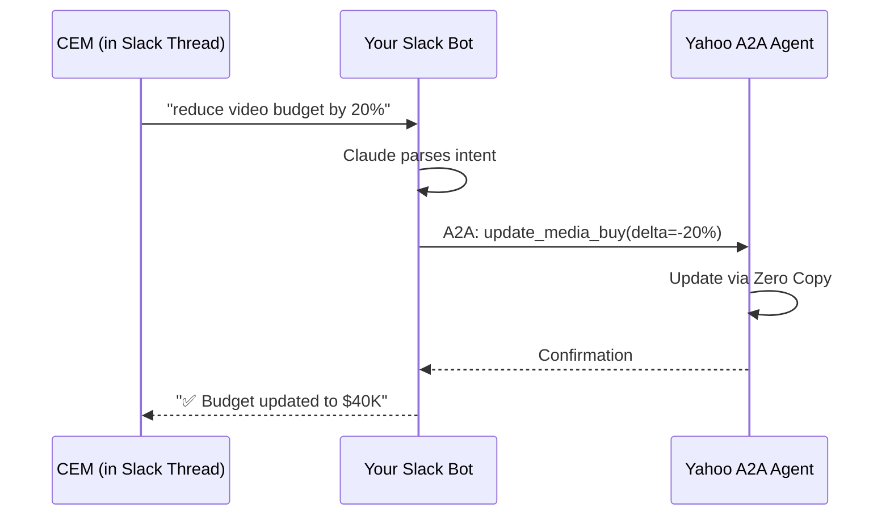

# Yahoo × Salesforce Vision Alignment Analysis

**Author**: Arup Sarkar  
**Date**: December 2025  
**Purpose**: Strategic alignment between Yahoo's Agentic Media Buying Platform and Salesforce's Next-Generation Ad Tech Vision

---

## Executive Summary

Yahoo is building the advertising industry's first AI-powered media buying platform with Slack as the human-in-the-loop (HITL) control plane. Your Salesforce-based vision provides complementary capabilities that can solve Yahoo's critical pain points while extending their platform's reach and intelligence. This document maps the alignment opportunities, identifies gaps you can fill, and highlights strategic differentiation.

---

## Part A: Vision Alignment

### Shared Strategic Principles

| Principle | Yahoo's Approach | Your Approach | Alignment Level |
|-----------|-----------------|---------------|-----------------|
| **AI-Driven Campaign Management** | LLM-powered Yahoo Sales Agent | Salesforce Agentforce with Claude AI | ✅ High |
| **Protocol-First Architecture** | ADCP v2.0 + A2A Protocol | MCP + A2A + AdCP v2.3.0 | ✅ High |
| **Human-in-the-Loop** | Slack modals & Canvas for CEM approval | Slack-native approvals with natural language | ✅ High |
| **Real-Time Data Access** | Spanner + Vector Search (RAG) | Data Cloud + Zero Copy | 🟡 Medium |
| **Multi-Agent Orchestration** | Google ADK + A2A Protocol | Nike Agent → Yahoo Agent (A2A) | ✅ High |
| **Industry Standards** | ADCP founding member | AdCP v2.3.0 compliance | ✅ High |

### Protocol Stack Comparison

```
┌─────────────────────────────────────────────────────────────────────┐
│                      YAHOO'S PROTOCOL STACK                          │
├─────────────────────────────────────────────────────────────────────┤
│  Application   │ Slack (Canvas + Modals + Socket Mode)              │
│  Agent Runtime │ Google ADK (Python)                                 │
│  Communication │ A2A Protocol (Agent-to-Agent)                       │
│  Ad Protocol   │ ADCP v2.0 (Industry Standard)                       │
│  Transport     │ WebSocket (Slack Socket Mode)                       │
│  Data          │ Spanner + Vector Search                             │
└─────────────────────────────────────────────────────────────────────┘

┌─────────────────────────────────────────────────────────────────────┐
│                      YOUR PROTOCOL STACK                             │
├─────────────────────────────────────────────────────────────────────┤
│  Application   │ Salesforce Agentforce + Slack + Streamlit           │
│  Agent Runtime │ FastAPI + A2A SDK                                   │
│  Communication │ MCP Protocol + A2A Protocol                         │
│  Ad Protocol   │ AdCP v2.3.0 (Newer Version)                         │
│  Transport     │ HTTPS (JSON-RPC 2.0) + Slack Bolt                   │
│  Data          │ Data Cloud + Zero Copy                              │
└─────────────────────────────────────────────────────────────────────┘
```

### The Convergence Opportunity

Both visions converge on these fundamental truths:

1. **Natural language is the interface** — Users shouldn't need to learn platforms
2. **Protocols enable interoperability** — ADCP/AdCP standardizes advertising data
3. **Humans must remain in control** — Autonomous AI requires approval checkpoints
4. **Real-time data eliminates friction** — No more ETL lag or stale information
5. **Multi-agent orchestration is the future** — No single agent can do everything

---

## Part B: Yahoo's Pain Points & Salesforce Solutions

### Pain Point 1: The 5-Step Approval Workflow

**Yahoo's Current State:**
```
1. Review Canvas → 2. Click button → 3. Download TOML → 4. Edit locally → 5. Upload in modal
```

**Their Desired State:**
```
1. Review & edit inline → 2. Click approve
```

**Salesforce Solution:**

| Capability | How It Helps |
|------------|--------------|
| **Agentforce** | CEMs interact via natural language: "Approve this campaign but reduce video budget by 20%" |
| **Data Cloud Real-Time Profiles** | CEM sees unified customer context alongside media plan |
| **Flow Builder** | Visual approval workflows that integrate with Slack |
| **Agentforce** | Auto-fill approval fields based on historical patterns |

**Implementation Approach:**
```
User (in Slack): "@agentforce approve Nike Q1 campaign, adjust budget to $45K"
                         ↓
               Agentforce parses intent
                         ↓
        MCP Server validates against Data Cloud
                         ↓
         Updates via Zero Copy + triggers Flow
                         ↓
         Yahoo A2A Agent receives approval
                         ↓
              Campaign goes live
```

**Impact**: Eliminates the TOML download/upload cycle entirely.

---

### Pain Point 2: 3-Second Modal Timeout

**Yahoo's Problem:**
> "Slack requires ACK within 3 seconds, so we close the modal immediately and validate async."

This creates poor UX — users don't know if their upload succeeded until they see a thread message.

**Salesforce Solution:**

| Approach | Implementation |
|----------|----------------|
| **Pre-Validation via MCP** | Before modal opens, MCP Server pre-validates context against Data Cloud |
| **Optimistic UI Pattern** | Show success immediately, rollback if async validation fails |
| **Slack Workflow Builder** | Use native Slack forms (not custom modals) with built-in validation |

**Technical Implementation:**
```python
# Current Yahoo Flow (problematic)
async def handle_modal_submit(payload):
    await ack()  # Must ACK within 3 seconds
    # Validation happens AFTER modal closes
    result = await validate_toml(payload)
    await post_result_to_thread(result)  # User sees this later

# Improved Flow with Pre-Validation
async def handle_button_click(payload):
    # Pre-validate BEFORE opening modal
    ctx = jwt_decode(payload["ctx_token"])
    validation = await mcp_client.call("pre_validate", {
        "task_id": ctx.task_id,
        "user_id": payload["user"]["id"]
    })
    
    if validation["ready"]:
        # Open modal with pre-filled, validated data
        modal = build_prefilled_modal(validation["defaults"])
        await open_modal(modal)
    else:
        await post_ephemeral("⚠️ Cannot approve: " + validation["reason"])
```

---

### Pain Point 3: No Inline Canvas Editing

**Yahoo's Problem:**
> "Our Canvases show AI recommendations. CEMs often want to adjust a budget or add a note. Inline editing of designated fields would be transformative."

**Salesforce Solution:**

Rather than waiting for Slack to add editable Canvas sections, implement a **hybrid approach**:

| Component | Role |
|-----------|------|
| **Slack Canvas** | Read-only AI recommendations (current state) |
| **Salesforce Record Page** | Editable campaign details (embedded link in Canvas) |
| **Data Cloud Triggers** | Real-time sync when CEM edits in Salesforce |

**User Experience:**
```
Canvas shows:
┌─────────────────────────────────────────────┐
│ 📋 Nike Q1 Campaign - AI Recommendation      │
├─────────────────────────────────────────────┤
│ Budget: $50,000                              │
│ Products: Yahoo Sports Video Pre-roll        │
│ Targeting: Sports Enthusiasts 25-44          │
│                                              │
│ [📝 Edit in Salesforce] [✅ Approve As-Is]   │
└─────────────────────────────────────────────┘

Clicking "Edit in Salesforce" opens:
- Pre-authenticated Salesforce record page
- CEM edits budget, targeting, notes
- Changes sync back to Yahoo via A2A
- Canvas updates in real-time
```

---

### Pain Point 4: Thread-Based Session Continuity

**Yahoo's Problem:**
> "Today each approval is isolated. If a CEM could type 'reduce the video budget by 20%' in the thread and have our agent respond, we'd unlock conversational refinement."

**This is exactly what your Slack MCP Client solves.**

**Your Solution Already Built:**
```
@adcp-slack-app reduce video budget by 20%
       ↓
Claude AI parses: update_media_buy(budget_change=-20%)
       ↓
MCP Server executes via Zero Copy
       ↓
Data Cloud reflects change instantly
       ↓
"✅ Video budget reduced from $50K to $40K"
```

**Integration with Yahoo's System:**


---

### Pain Point 5: Complex Media Plan Summarization

**Yahoo's Problem:**
> "Our Canvases can be 50+ line items. A 'summarize this' or 'highlight risks' integration with Slack AI would help CEMs review faster."

**Salesforce Solution: Agentforce + Data Cloud**

| Capability | Application |
|------------|-------------|
| **Agentforce** | "Summarize this campaign's key metrics and risks" |
| **Data Cloud Calculated Insights** | Pre-computed risk scores, anomaly detection |
| **Tableau CRM** | Visual summary cards embedded in Slack |

**Implementation:**
```python
@mcp.tool()
async def summarize_media_plan(campaign_id: str) -> str:
    """Generate AI summary of complex media plan."""
    
    # Fetch from Data Cloud
    plan = await data_cloud.query(f"""
        SELECT * FROM media_buys_dlm 
        WHERE campaign_id = '{campaign_id}'
    """)
    
    # Calculate risk indicators
    risks = []
    if plan["budget"] > plan["historical_avg"] * 1.5:
        risks.append("⚠️ Budget 50%+ above historical average")
    if plan["targeting_overlap"] < 0.3:
        risks.append("⚠️ Low audience overlap with brand affinity")
    
    # Generate summary via Claude
    summary = await claude.summarize(plan, risks)
    
    return f"""
    **Campaign Summary: {plan['name']}**
    
    📊 **Budget**: ${plan['budget']:,} across {len(plan['packages'])} packages
    🎯 **Reach**: {plan['estimated_reach']:,} impressions
    📅 **Flight**: {plan['start']} to {plan['end']}
    
    **Risk Assessment**:
    {chr(10).join(risks) if risks else "✅ No significant risks detected"}
    
    **Top 3 Packages by Spend**:
    1. {plan['packages'][0]['name']} - ${plan['packages'][0]['budget']:,}
    2. {plan['packages'][1]['name']} - ${plan['packages'][1]['budget']:,}
    3. {plan['packages'][2]['name']} - ${plan['packages'][2]['budget']:,}
    """
```

---

## Part C: Technical Implementation Options

### Option B: Interactive Message Blocks for Inline Editing

**Architecture: Slack-Native Inline Editing**

Replace Canvas with Slack's interactive message blocks to enable true inline editing without modals.

```
┌─────────────────────────────────────────────────────────────────────┐
│                    SLACK MESSAGE (INTERACTIVE)                       │
├─────────────────────────────────────────────────────────────────────┤
│                                                                      │
│  📋 Nike Q1 Campaign - AI Recommendation                             │
│  ━━━━━━━━━━━━━━━━━━━━━━━━━━━━━━━━━━━━━━━━━━━━━━━━━━━━━━━━━━━━━━━━━ │
│                                                                      │
│  💰 Budget:  [$50,000 ▼]  ← Dropdown select                        │
│  📦 Product: [Yahoo Sports Video Pre-roll ▼]                        │
│  🎯 Target:  [Sports Enthusiasts 25-44 ▼]                           │
│  📅 Flight:  [Jan 1 - Mar 31, 2026]  [📅 Change Dates]              │
│  📝 Notes:   [Add notes...]  ← Button opens modal for text input    │
│                                                                      │
│  ⚠️  Risk: Budget 15% above Q4 average                              │
│                                                                      │
│  [✅ Approve Campaign]  [✏️ Request Changes]  [🔄 Regenerate]        │
│                                                                      │
└─────────────────────────────────────────────────────────────────────┘
                              │
                              ▼
┌─────────────────────────────────────────────────────────────────────┐
│                      SLACK BOT HANDLER                               │
│                                                                      │
│  @slack_app.action("budget_select")                                 │
│  async def handle_budget_change(ack, action, client):               │
│      await ack()                                                     │
│      new_budget = action["selected_option"]["value"]                │
│                                                                      │
│      # Update via Salesforce (not directly to Data Cloud)           │
│      await salesforce.update_campaign(                              │
│          campaign_id=action["value"],                               │
│          budget=new_budget                                          │
│      )                                                               │
│                                                                      │
│      # Update message with new values                               │
│      await client.chat_update(                                      │
│          channel=action["channel"]["id"],                           │
│          ts=action["message"]["ts"],                                │
│          blocks=build_updated_blocks(new_budget)                    │
│      )                                                               │
│                                                                      │
└─────────────────────────────────────────────────────────────────────┘
                              │
                              ▼
┌─────────────────────────────────────────────────────────────────────┐
│                    SALESFORCE CORE                                   │
│                                                                      │
│  Campaign__c record updated                                         │
│  ├─ Budget__c = 50000                                               │
│  ├─ Last_Modified_By__c = Slack_User_ID                             │
│  └─ Modified_Via__c = "Slack_Interactive_Message"                   │
│                                                                      │
└────────────────────────┬────────────────────────────────────────────┘
                         │
                         ▼ (Automatic ingestion)
┌─────────────────────────────────────────────────────────────────────┐
│                    DATA CLOUD                                        │
│                                                                      │
│  Campaign__dlm updated via Change Data Capture (CDC)                │
│  ├─ Real-time sync from Salesforce Core                             │
│  ├─ Calculated Insights refresh                                     │
│  └─ Available for MCP queries within seconds                        │
│                                                                      │
└─────────────────────────────────────────────────────────────────────┘
```

**Key Implementation Details:**

- **Slack Block Kit Elements**: Use `static_select`, `overflow`, `datepicker` for inline editing
- **Write Pattern**: Always write to Salesforce Core (Campaign__c, Opportunity__c), never directly to Data Cloud
- **Read Pattern**: Query Data Cloud via MCP for unified view across systems
- **Validation**: Pre-validate in Slack bot before calling Salesforce API

**Limitations:**
- Max 50 interactive elements per message
- Limited to supported Block Kit components (no free-text fields in message body)
- Best for campaigns with <20 editable fields

---

### Option C: Embedded Salesforce Experience Cloud via Slack Modal

**Architecture: Full Salesforce UI Within Slack (iFrame)**

Leverage Slack's modal webview capability to embed a Salesforce Experience Cloud page directly in Slack—users never leave the app.

```
┌─────────────────────────────────────────────────────────────────────┐
│                    SLACK CANVAS / MESSAGE                            │
│                                                                      │
│  📋 Nike Q1 Campaign Summary (Read-Only)                             │
│  Budget: $50,000 | Reach: 2.5M | Flight: Q1 2026                    │
│                                                                      │
│  [📝 Edit in Salesforce]  ← Opens modal with embedded Salesforce    │
│                                                                      │
└─────────────────────────────────────────────────────────────────────┘
                              │
                              ▼ (Button Click)
┌─────────────────────────────────────────────────────────────────────┐
│              SLACK MODAL (type: "modal", view_type: "external")      │
│ ┌─────────────────────────────────────────────────────────────────┐ │
│ │                    SALESFORCE EXPERIENCE CLOUD                  │ │
│ │                     (Embedded via URL + OAuth)                  │ │
│ │ ┌─────────────────────────────────────────────────────────────┐ │ │
│ │ │  Campaign Editor                              [Salesforce]  │ │ │
│ │ ├─────────────────────────────────────────────────────────────┤ │ │
│ │ │  Campaign Name:  Nike Q1 2026                               │ │ │
│ │ │  Budget:         [$50,000        ]                          │ │ │
│ │ │  Product:        [Yahoo Sports ▼ ]                          │ │ │
│ │ │  Target Audience: [Sports 25-44 ▼]                          │ │ │
│ │ │  Flight Dates:   [1/1/26 - 3/31/26]                         │ │ │
│ │ │  Notes:          [_____________________________]            │ │ │
│ │ │                                                              │ │ │
│ │ │  ⚠️ Validation: Budget exceeds typical range by 15%         │ │ │
│ │ │  💡 Recommendation: Consider extending flight to 120 days   │ │ │
│ │ │                                                              │ │ │
│ │ │  [Cancel]                              [Save Changes]       │ │ │
│ │ └─────────────────────────────────────────────────────────────┘ │ │
│ └─────────────────────────────────────────────────────────────────┘ │
└─────────────────────────────────────────────────────────────────────┘
                              │
                              ▼ (User Saves)
┌─────────────────────────────────────────────────────────────────────┐
│         SALESFORCE EXPERIENCE CLOUD → SALESFORCE CORE                │
│                                                                      │
│  Lightning Web Component (LWC) → Apex Controller → Campaign__c      │
│                                                                      │
│  public class CampaignEditorController {                            │
│      @AuraEnabled                                                   │
│      public static void updateCampaign(                             │
│          String campaignId,                                         │
│          Decimal budget,                                            │
│          String notes                                               │
│      ) {                                                            │
│          Campaign__c camp = [                                       │
│              SELECT Id, Budget__c, Notes__c                         │
│              FROM Campaign__c                                       │
│              WHERE Id = :campaignId                                 │
│          ];                                                          │
│          camp.Budget__c = budget;                                   │
│          camp.Notes__c = notes;                                     │
│          camp.Last_Modified_Source__c = 'Slack_Modal';              │
│          update camp;                                               │
│                                                                      │
│          // Trigger Platform Event for real-time sync              │
│          Campaign_Updated__e event = new Campaign_Updated__e(       │
│              Campaign_Id__c = campaignId,                           │
│              Action__c = 'Update',                                  │
│              Source__c = 'Slack'                                    │
│          );                                                          │
│          EventBus.publish(event);                                   │
│      }                                                               │
│  }                                                                   │
│                                                                      │
└────────────────────────┬────────────────────────────────────────────┘
                         │
                         ├──► Change Data Capture (Automatic)
                         │
                         └──► Platform Event (Real-time notification)
                              │
                              ▼
┌─────────────────────────────────────────────────────────────────────┐
│                    DATA CLOUD INGESTION                              │
│                                                                      │
│  ┌─────────────────────────────────────────────────────────────┐   │
│  │  Ingestion Source 1: Change Data Capture                     │   │
│  │  • Automatic sync from Salesforce Core objects              │   │
│  │  • Campaign__c → Campaign__dlm (within seconds)              │   │
│  │  • No custom code required                                   │   │
│  └─────────────────────────────────────────────────────────────┘   │
│                                                                      │
│  ┌─────────────────────────────────────────────────────────────┐   │
│  │  Ingestion Source 2: Platform Events (for real-time sync)   │   │
│  │  • Subscribe to Campaign_Updated__e                          │   │
│  │  • Trigger Data Cloud calculated insights refresh           │   │
│  │  • Notify Yahoo A2A Agent via webhook                        │   │
│  └─────────────────────────────────────────────────────────────┘   │
│                                                                      │
│  ┌─────────────────────────────────────────────────────────────┐   │
│  │  Ingestion Source 3: External API (Zero Copy Partner)       │   │
│  │  • Bidirectional sync with external data lake               │   │
│  │  • Delivery metrics, impression data                         │   │
│  │  • Yahoo campaign performance data                           │   │
│  └─────────────────────────────────────────────────────────────┘   │
│                                                                      │
└────────────────────────┬────────────────────────────────────────────┘
                         │
                         ▼
┌─────────────────────────────────────────────────────────────────────┐
│              DATA CLOUD (Unified View)                               │
│                                                                      │
│  Campaign__dlm now contains:                                        │
│  ├─ Salesforce data (CRM, Campaign records)                         │
│  ├─ External data (Delivery metrics from Yahoo)                     │
│  └─ Calculated insights (Risk scores, recommendations)              │
│                                                                      │
│  Available for:                                                     │
│  • MCP queries from Slack bot                                       │
│  • Agentforce grounding                                             │
│  • Tableau CRM dashboards                                           │
│                                                                      │
└─────────────────────────────────────────────────────────────────────┘
```

**Implementation: Slack Modal with Embedded Salesforce**

```python
# Slack bot handler
@slack_app.action("edit_campaign_button")
async def open_salesforce_modal(ack, action, client):
    await ack()
    
    campaign_id = action["value"]
    user_id = action["user"]["id"]
    
    # Get Salesforce session for this user (OAuth)
    sf_session = await get_salesforce_session(user_id)
    
    # Build Experience Cloud URL with pre-auth
    sf_url = f"https://yourdomain.my.site.com/campaigns/editor?id={campaign_id}"
    sf_url += f"&slack_user={user_id}&session_token={sf_session.token}"
    
    # Open modal with embedded Salesforce page
    modal = {
        "type": "modal",
        "title": {"type": "plain_text", "text": "Edit Campaign"},
        "close": {"type": "plain_text", "text": "Close"},
        "blocks": [
            {
                "type": "section",
                "text": {
                    "type": "mrkdwn",
                    "text": "Loading Salesforce editor..."
                },
                "accessory": {
                    "type": "button",
                    "text": {"type": "plain_text", "text": "Open in Browser"},
                    "url": sf_url,
                    "action_id": "open_browser"
                }
            }
        ],
        # Slack will render the URL in an iframe-like view
        "external_id": campaign_id,
        "callback_id": "salesforce_edit_modal"
    }
    
    await client.views_open(
        trigger_id=action["trigger_id"],
        view=modal
    )
```

**Salesforce Experience Cloud Setup:**

```apex
// Lightning Web Component (LWC) for campaign editor
// File: campaignEditor.js
import { LightningElement, api, track, wire } from 'lwc';
import getCampaign from '@salesforce/apex/CampaignEditorController.getCampaign';
import updateCampaign from '@salesforce/apex/CampaignEditorController.updateCampaign';

export default class CampaignEditor extends LightningElement {
    @api recordId; // Campaign ID from URL parameter
    @track campaign;
    @track isLoading = true;
    
    connectedCallback() {
        // Detect if running in Slack modal
        this.isInSlack = window.parent !== window;
        this.loadCampaign();
    }
    
    loadCampaign() {
        getCampaign({ campaignId: this.recordId })
            .then(data => {
                this.campaign = data;
                this.isLoading = false;
            })
            .catch(error => {
                console.error('Error loading campaign:', error);
            });
    }
    
    handleSave() {
        this.isLoading = true;
        updateCampaign({
            campaignId: this.recordId,
            budget: this.campaign.budget,
            notes: this.campaign.notes
            // ... other fields
        })
        .then(() => {
            // Notify parent Slack window if embedded
            if (this.isInSlack) {
                window.parent.postMessage({
                    type: 'salesforce_update_complete',
                    campaignId: this.recordId
                }, '*');
            }
            this.isLoading = false;
        })
        .catch(error => {
            console.error('Error saving campaign:', error);
        });
    }
}
```

**Key Benefits:**
- Full Salesforce UI capabilities (validation rules, picklists, related lists)
- No Slack component limitations
- Single-source-of-truth (Salesforce)
- Automatic Data Cloud sync via CDC

---

### Thread-Based Session Continuity

**Architecture: Conversational State Management**

Enable CEMs to iteratively refine campaigns through natural conversation in Slack threads.

```
┌─────────────────────────────────────────────────────────────────────┐
│                    SLACK THREAD                                      │
│                                                                      │
│  👤 CEM (9:00 AM):                                                   │
│      @agentforce show me the Nike Q1 campaign                        │
│                                                                      │
│  🤖 Agentforce (9:00 AM):                                            │
│      Nike Q1 Campaign                                                │
│      Budget: $50,000 | Products: 3 packages | Flight: Jan-Mar       │
│      [View Details] [Edit] [Approve]                                 │
│                                                                      │
│  👤 CEM (9:02 AM):                                                   │
│      reduce the video budget by 20%                                  │
│                                                                      │
│  🤖 Agentforce (9:02 AM):                                            │
│      ✅ Video package budget reduced from $25,000 to $20,000         │
│      New total campaign budget: $45,000                              │
│      [Undo] [Approve Campaign]                                       │
│                                                                      │
│  👤 CEM (9:03 AM):                                                   │
│      extend the flight by 2 weeks                                    │
│                                                                      │
│  🤖 Agentforce (9:03 AM):                                            │
│      ✅ Flight extended from Mar 31 to Apr 14, 2026                  │
│      Note: Budget pacing adjusted to $321/day (was $357/day)         │
│      [Undo] [Approve Campaign]                                       │
│                                                                      │
│  👤 CEM (9:04 AM):                                                   │
│      approve                                                         │
│                                                                      │
│  🤖 Agentforce (9:04 AM):                                            │
│      ✅ Campaign approved and submitted to Yahoo A2A Agent           │
│      Order ID: GAM-12345 | Status: Active                            │
│                                                                      │
└─────────────────────────────────────────────────────────────────────┘
```

**Implementation: Slack Bot with Claude AI + MCP**

```python
# File: slack_bot_handler.py
import anthropic
from slack_bolt.async_app import AsyncApp
from mcp_client import MCPClient

slack_app = AsyncApp(token=os.environ["SLACK_BOT_TOKEN"])
anthropic_client = anthropic.Anthropic(api_key=os.environ["ANTHROPIC_API_KEY"])
mcp_client = MCPClient(base_url="https://your-mcp-server.com")

# Store conversation context (Redis or Data Cloud)
conversation_store = {}

@slack_app.event("app_mention")
async def handle_mention(event, client, say):
    """Handle @agentforce mentions in threads"""
    
    thread_ts = event.get("thread_ts") or event["ts"]
    user_text = event["text"].replace(f"<@{event['bot_id']}>", "").strip()
    
    # Retrieve thread context
    context = conversation_store.get(thread_ts, {
        "campaign_id": None,
        "conversation_history": [],
        "pending_changes": []
    })
    
    # Add user message to history
    context["conversation_history"].append({
        "role": "user",
        "content": user_text
    })
    
    # Get campaign data if we have campaign_id
    campaign_data = None
    if context["campaign_id"]:
        campaign_data = await mcp_client.call("get_campaign", {
            "campaign_id": context["campaign_id"]
        })
    
    # Build Claude prompt with conversation context
    system_prompt = f"""
    You are an AI assistant helping Client Engagement Managers approve advertising campaigns.
    
    Current context:
    - Campaign ID: {context.get('campaign_id', 'None')}
    - Campaign Data: {campaign_data if campaign_data else 'Not loaded'}
    - Pending Changes: {context.get('pending_changes', [])}
    
    Available actions:
    - show_campaign(campaign_name): Load campaign details
    - update_budget(package_name, amount_or_percentage): Adjust budget
    - extend_flight(days): Extend campaign duration
    - approve_campaign(): Submit for execution
    - undo_changes(): Revert pending changes
    
    Parse the user's intent and either:
    1. Call an action (return JSON with action + params)
    2. Ask clarifying questions
    3. Provide information
    """
    
    # Call Claude to parse intent
    claude_response = await anthropic_client.messages.create(
        model="claude-sonnet-4-20250514",
        max_tokens=1024,
        system=system_prompt,
        messages=context["conversation_history"]
    )
    
    assistant_message = claude_response.content[0].text
    
    # Check if Claude returned a tool call (action)
    if assistant_message.startswith("{"):
        action = json.loads(assistant_message)
        result = await execute_action(action, context, mcp_client)
        
        # Update context with action result
        context["pending_changes"].append(action)
        conversation_store[thread_ts] = context
        
        # Post result to thread
        await say(
            text=result["message"],
            thread_ts=thread_ts,
            blocks=build_result_blocks(result)
        )
    else:
        # Regular conversation response
        await say(
            text=assistant_message,
            thread_ts=thread_ts
        )
    
    # Save updated context
    context["conversation_history"].append({
        "role": "assistant",
        "content": assistant_message
    })
    conversation_store[thread_ts] = context


async def execute_action(action, context, mcp_client):
    """Execute the parsed action via MCP"""
    
    if action["action"] == "update_budget":
        # Call MCP to update Salesforce
        result = await mcp_client.call("update_campaign_budget", {
            "campaign_id": context["campaign_id"],
            "package_name": action["params"]["package_name"],
            "new_budget": action["params"]["amount"]
        })
        
        return {
            "message": f"✅ {action['params']['package_name']} budget updated to ${result['new_budget']:,}",
            "data": result
        }
    
    elif action["action"] == "approve_campaign":
        # Call MCP to trigger Salesforce Flow → Yahoo A2A Agent
        result = await mcp_client.call("approve_campaign", {
            "campaign_id": context["campaign_id"],
            "approved_by": context.get("user_id")
        })
        
        return {
            "message": f"✅ Campaign approved. Order ID: {result['order_id']}",
            "data": result
        }
    
    # ... other actions
```

---

### State Management Options

**Critical: Data Cloud Write Pattern**

⚠️ **Data Cloud tables (DMOs/DLOs) are read-only via MCP.** All writes must go through:

1. **Salesforce Core Objects** (Primary pattern)
   ```
   Slack Bot → Salesforce API → Campaign__c → CDC → Data Cloud
   ```

2. **External System Ingestion** (Zero Copy pattern)
   ```
   Slack Bot → External Data Lake → Data Cloud Connector → Data Cloud
   ```

3. **Platform Events** (Real-time notification)
   ```
   Salesforce Apex → Publish Campaign_Updated__e → Data Cloud subscribes
   ```

**State Storage Architecture:**

```
┌─────────────────────────────────────────────────────────────────────┐
│                  STATE MANAGEMENT LAYERS                             │
├─────────────────────────────────────────────────────────────────────┤
│                                                                      │
│  Layer 1: SESSION STATE (Temporary - Redis)                         │
│  ┌────────────────────────────────────────────────────────────────┐ │
│  │ • Thread context (30-min TTL)                                  │ │
│  │ • Conversation history                                         │ │
│  │ • Pending changes (not yet saved)                              │ │
│  │ • User preferences                                             │ │
│  │                                                                │ │
│  │ Key: thread_ts → {campaign_id, messages[], changes[]}         │ │
│  └────────────────────────────────────────────────────────────────┘ │
│                          ↓ (On approval/timeout)                    │
│  Layer 2: SALESFORCE CORE (Persistent - Source of Truth)           │
│  ┌────────────────────────────────────────────────────────────────┐ │
│  │ Campaign__c                                                    │ │
│  │ ├─ Budget__c                                                   │ │
│  │ ├─ Flight_Start_Date__c                                        │ │
│  │ ├─ Status__c                                                   │ │
│  │ └─ Last_Modified_Source__c = "Slack"                           │ │
│  │                                                                │ │
│  │ Campaign_Interaction__c (Custom object)                        │ │
│  │ ├─ Slack_Thread_TS__c                                          │ │
│  │ ├─ User_ID__c                                                  │ │
│  │ ├─ Action_Type__c (edit, approve, reject)                      │ │
│  │ └─ Conversation_Log__c (JSON)                                  │ │
│  └────────────────────────────────────────────────────────────────┘ │
│                          ↓ (Automatic CDC sync)                     │
│  Layer 3: DATA CLOUD (Unified Analytics - Read-Only via MCP)       │
│  ┌────────────────────────────────────────────────────────────────┐ │
│  │ Campaign__dlm (Unified from multiple sources)                  │ │
│  │ ├─ Salesforce data (CRM, campaigns)                            │ │
│  │ ├─ External data (Yahoo delivery metrics)                      │ │
│  │ └─ Calculated insights (Risk scores)                           │ │
│  │                                                                │ │
│  │ Campaign_Interaction__dlm                                      │ │
│  │ └─ Full audit trail of Slack interactions                      │ │
│  └────────────────────────────────────────────────────────────────┘ │
│                                                                      │
└─────────────────────────────────────────────────────────────────────┘
```

**Implementation Example:**

```python
# State management with Redis + Salesforce + Data Cloud

class StateManager:
    def __init__(self, redis_client, salesforce_client, mcp_client):
        self.redis = redis_client
        self.sf = salesforce_client
        self.mcp = mcp_client
    
    async def get_thread_state(self, thread_ts):
        """Get temporary session state from Redis"""
        state = await self.redis.get(f"thread:{thread_ts}")
        if state:
            return json.loads(state)
        return {"campaign_id": None, "conversation": [], "changes": []}
    
    async def save_thread_state(self, thread_ts, state):
        """Save temporary state to Redis with 30-min TTL"""
        await self.redis.setex(
            f"thread:{thread_ts}",
            1800,  # 30 minutes
            json.dumps(state)
        )
    
    async def persist_to_salesforce(self, thread_ts, state):
        """Persist conversation to Salesforce (source of truth)"""
        
        # Update Campaign object
        campaign_update = {
            "Id": state["campaign_id"],
            "Budget__c": state["final_budget"],
            "Last_Modified_Source__c": "Slack",
            "Last_Slack_Thread__c": thread_ts
        }
        await self.sf.update("Campaign__c", campaign_update)
        
        # Create interaction record for audit trail
        interaction = {
            "Campaign__c": state["campaign_id"],
            "Slack_Thread_TS__c": thread_ts,
            "User_ID__c": state["user_id"],
            "Action_Type__c": "Approved",
            "Conversation_Log__c": json.dumps(state["conversation"]),
            "Changes_Made__c": json.dumps(state["changes"])
        }
        await self.sf.create("Campaign_Interaction__c", interaction)
        
        # Clear Redis cache (data now in Salesforce)
        await self.redis.delete(f"thread:{thread_ts}")
    
    async def query_from_data_cloud(self, campaign_id):
        """Query unified view from Data Cloud (read-only)"""
        
        result = await self.mcp.call("query", {
            "sql": f"""
                SELECT 
                    c.campaign_id,
                    c.budget,
                    c.status,
                    c.risk_score,
                    m.impressions_delivered,
                    m.spend_to_date
                FROM Campaign__dlm c
                LEFT JOIN Metrics__dlm m ON c.campaign_id = m.campaign_id
                WHERE c.campaign_id = '{campaign_id}'
            """
        })
        
        return result["rows"][0]
```

---

### Slack + Agentforce Integration Architecture

**Complete End-to-End Flow**

```
┌─────────────────────────────────────────────────────────────────────┐
│                      USER INTERACTION LAYER                          │
│  ┌────────────┐        ┌─────────────────┐       ┌───────────────┐  │
│  │   Slack    │        │   Salesforce    │       │   Streamlit   │  │
│  │ Workspace  │◄──────►│   Agentforce    │◄─────►│   Dashboard   │  │
│  │            │        │   Assistant     │       │               │  │
│  └─────┬──────┘        └────────┬────────┘       └───────┬───────┘  │
└────────┼────────────────────────┼────────────────────────┼──────────┘
         │                        │                        │
         │ Natural Language       │ Salesforce UI          │ Analytics
         │ Conversation           │ Embedded Actions       │ Visualization
         │                        │                        │
         └────────────────────────┴────────────────────────┘
                                  │
                                  ▼
┌─────────────────────────────────────────────────────────────────────┐
│                      INTEGRATION LAYER                               │
│  ┌────────────────────────────────────────────────────────────────┐ │
│  │               Slack Bot (Bolt Framework)                       │ │
│  │  • Event handlers (mentions, buttons, modals)                 │ │
│  │  • Claude AI integration for intent parsing                   │ │
│  │  • Session state management (Redis)                           │ │
│  └────────────────────────────────────────────────────────────────┘ │
│                                  │                                   │
│                    ┌─────────────┴─────────────┐                    │
│                    ▼                           ▼                     │
│  ┌──────────────────────────┐   ┌──────────────────────────────┐   │
│  │   MCP Server             │   │   Salesforce Connected App   │   │
│  │  • Data Cloud queries    │   │  • OAuth authentication      │   │
│  │  • Campaign CRUD         │   │  • Apex REST endpoints       │   │
│  │  • Validation            │   │  • Platform Events pub/sub   │   │
│  └──────────────────────────┘   └──────────────────────────────┘   │
└─────────────────────────────────────────────────────────────────────┘
                                  │
                                  ▼
┌─────────────────────────────────────────────────────────────────────┐
│                      SALESFORCE LAYER                                │
│  ┌────────────────────────────────────────────────────────────────┐ │
│  │                   Salesforce Core                              │ │
│  │  ┌──────────────────┐   ┌──────────────────┐                  │ │
│  │  │  Standard Objects│   │  Custom Objects  │                  │ │
│  │  │  • Campaign      │   │  • Campaign__c   │                  │ │
│  │  │  • Opportunity   │   │  • Package__c    │                  │ │
│  │  │  • Contact       │   │  • Interaction__c│                  │ │
│  │  └──────────────────┘   └──────────────────┘                  │ │
│  │                                                                │ │
│  │  ┌──────────────────────────────────────────────────────────┐ │ │
│  │  │              Agentforce (Einstein)                        │ │ │
│  │  │  • Agent Builder with custom actions                     │ │ │
│  │  │  • Data Cloud grounding for context                      │ │ │
│  │  │  • Natural language understanding                        │ │ │
│  │  │  • Can be invoked from Slack via API                     │ │ │
│  │  └──────────────────────────────────────────────────────────┘ │ │
│  │                                                                │ │
│  │  ┌──────────────────────────────────────────────────────────┐ │ │
│  │  │              Automation                                   │ │ │
│  │  │  • Flows (approval workflows)                            │ │ │
│  │  │  • Platform Events (Campaign_Updated__e)                 │ │ │
│  │  │  • Change Data Capture (CDC to Data Cloud)               │ │ │
│  │  └──────────────────────────────────────────────────────────┘ │ │
│  └────────────────────────────────────────────────────────────────┘ │
│                                  │                                   │
│                                  ▼ (CDC / Connector)                 │
│  ┌────────────────────────────────────────────────────────────────┐ │
│  │                   Data Cloud                                   │ │
│  │  • Campaign__dlm (unified from Salesforce + External)          │ │
│  │  • Calculated Insights (risk scores, recommendations)          │ │
│  │  • Zero Copy sync with external data lake                      │ │
│  │  • Vector embeddings for semantic search                       │ │
│  └────────────────────────────────────────────────────────────────┘ │
└─────────────────────────────────────────────────────────────────────┘
                                  │
                                  ▼
┌─────────────────────────────────────────────────────────────────────┐
│                      EXTERNAL SYSTEMS                                │
│  ┌──────────────────────┐        ┌───────────────────────────────┐  │
│  │   Yahoo A2A Agent    │◄──────►│  External Data Lake           │  │
│  │  • Campaign approval │        │  • Delivery metrics           │  │
│  │  • Order creation    │        │  • Impression data            │  │
│  └──────────────────────┘        └───────────────────────────────┘  │
└─────────────────────────────────────────────────────────────────────┘
```

**Integration Patterns:**

1. **Slack → Agentforce (via API)**
   ```python
   # Invoke Agentforce agent from Slack bot
   async def invoke_agentforce(user_query, context):
       response = await salesforce_client.invoke_agent(
           agent_id="Einstein_Campaign_Assistant",
           input=user_query,
           context={
               "campaign_id": context["campaign_id"],
               "user_id": context["user_id"]
           }
       )
       return response["output"]
   ```

2. **Agentforce Actions with Data Cloud Grounding**
   ```apex
   // Apex action invoked by Agentforce
   public class CampaignAgentActions {
       @InvocableMethod(
           label='Get Campaign Recommendations'
           description='Returns AI recommendations using Data Cloud'
       )
       public static List<Response> getRecommendations(
           List<Request> requests
       ) {
           String campaignId = requests[0].campaignId;
           
           // Query Data Cloud for unified view
           List<Campaign__dlm> campaigns = [
               SELECT Budget__c, Risk_Score__c, Performance_Trend__c
               FROM Campaign__dlm
               WHERE Id = :campaignId
           ];
           
           // Generate recommendations
           Response resp = new Response();
           resp.recommendations = generateRecs(campaigns[0]);
           return new List<Response>{ resp };
       }
   }
   ```

3. **Bidirectional Sync: Slack ↔ Salesforce**
   ```python
   # When user edits in Slack
   @slack_app.action("budget_change")
   async def handle_budget_change(action):
       # Write to Salesforce
       await salesforce.update(
           "Campaign__c",
           {"Id": action["value"], "Budget__c": new_budget}
       )
       
       # Salesforce triggers Platform Event
       # Event triggers Data Cloud refresh
       # MCP can now query updated data
   ```

---

## Part D: Key Differences Between Visions

### Architectural Differences

| Dimension | Yahoo's Vision | Your Vision | Implication |
|-----------|---------------|-------------|-------------|
| **Agent Framework** | Google ADK | Salesforce Agentforce + FastAPI | Yahoo locked into Google ecosystem; you offer Salesforce-native |
| **Data Layer** | Spanner + Vector Search | Data Cloud + Zero Copy | You have proven bi-directional data architecture |
| **Protocol Version** | ADCP v2.0 | AdCP v2.3.0 | You're on newer spec with more capabilities |
| **HITL Interface** | Custom Slack modals | Natural language via Claude | Your approach is more conversational |
| **State Management** | JWT in Slack metadata | Zero Copy + Data Cloud real-time | You have persistent, queryable state |
| **Approval Mechanism** | TOML file upload | Natural language commands | Yours eliminates file handling entirely |

### Philosophy Differences

**Yahoo's Approach: Slack as Control Plane**
- Slack IS the approval system
- Custom-built everything (Socket Mode, modals, Canvas)
- Heavy reliance on Slack's feature roadmap
- Security via JWT encryption in metadata

**Your Approach: Slack as Conversation Layer**
- Slack is ONE interface (alongside Streamlit, Agentforce)
- Leverage Salesforce platform capabilities
- Less dependent on Slack-specific features
- Security via Salesforce OAuth + Zero Copy

### Risk Profile Comparison

| Risk | Yahoo's Exposure | Your Exposure |
|------|------------------|---------------|
| Slack API changes | 🔴 High (deeply integrated) | 🟡 Medium (abstracted via MCP) |
| Google ADK deprecation | 🔴 High (core dependency) | 🟢 Low (not dependent) |
| Data consistency | 🟡 Medium (async sync) | 🟢 Low (Zero Copy) |
| Vendor lock-in | 🟡 Medium (ADCP helps) | 🟢 Low (MCP + A2A are open) |
| Scaling approval workflow | 🔴 High (file-based) | 🟢 Low (database-backed) |

---

## Part D: Strategic Recommendations

### How to Position Your Value to Yahoo

#### 1. Lead with the Data Story

Yahoo has:
- Spanner for storage
- Vector Search for RAG
- No unified customer view

You offer:
- **Data Cloud Zero Copy** = instant bi-directional sync
- **Unified Customer Profile** = CRM + Campaign + Delivery in one view
- **Calculated Insights** = pre-computed analytics, no query lag

**Pitch**: "Your CEMs shouldn't wait for reports. With Data Cloud, campaign performance is visible in real-time via Zero Copy architecture."

#### 2. Solve Their TOML Pain

Yahoo's TOML workflow is their biggest UX debt:
- Download template
- Edit locally (error-prone)
- Upload via modal
- Async validation (poor feedback)

**Your Alternative**:
```
CEM: "approve campaign nike-q1, order_id is GAM-12345, notes: fast turnaround needed"
Bot: "✅ Campaign approved. Order ID: GAM-12345. Campaign is now active."
```

**Pitch**: "We eliminated file handling entirely. CEMs approve campaigns with natural language—no downloads, no uploads, no TOML."

#### 3. Offer Multi-Channel Access

Yahoo is Slack-only. You offer:
- **Slack** (thread-based approvals)
- **Agentforce** (embedded in Salesforce)
- **Streamlit** (standalone web UI)
- **Mobile** (via Salesforce app)

**Pitch**: "Your CEMs work in Slack. Your executives want dashboards. Your mobile team needs alerts. We serve all three from one platform."

#### 4. Extend Their ADCP Investment

Yahoo co-founded ADCP. You're on AdCP v2.3.0.

**Pitch**: "We're aligned on ADCP. Our implementation includes the v2.3.0 enhancements—richer targeting schemas, improved delivery metrics, better package hierarchies. We can help validate the spec against real-world usage."

### Proposed Integration Architecture

```
┌─────────────────────────────────────────────────────────────────────┐
│                         UNIFIED PLATFORM                             │
├─────────────────────────────────────────────────────────────────────┤
│                                                                      │
│  ┌──────────────────────────────────────────────────────────────┐   │
│  │                    USER INTERFACES                            │   │
│  │  ┌─────────┐  ┌─────────────┐  ┌──────────┐  ┌────────────┐  │   │
│  │  │  Slack  │  │ Agentforce  │  │ Streamlit │  │  Mobile    │  │   │
│  │  │ (Yahoo) │  │ (Salesforce)│  │  (Web UI) │  │   (iOS)    │  │   │
│  │  └────┬────┘  └──────┬──────┘  └─────┬────┘  └─────┬──────┘  │   │
│  └───────┼──────────────┼───────────────┼────────────┼──────────┘   │
│          │              │               │            │               │
│          └──────────────┴───────────────┴────────────┘               │
│                              │                                        │
│                              ▼                                        │
│  ┌──────────────────────────────────────────────────────────────┐   │
│  │                    AGENT LAYER                                │   │
│  │  ┌─────────────┐    ┌──────────────┐    ┌────────────────┐   │   │
│  │  │ Claude MCP  │◄──►│  Nike A2A    │◄──►│  Yahoo A2A     │   │   │
│  │  │   Client    │    │    Agent     │    │    Agent       │   │   │
│  │  └─────────────┘    └──────────────┘    └────────────────┘   │   │
│  │         │                  │                    │             │   │
│  │         └──────────────────┴────────────────────┘             │   │
│  └──────────────────────────────────────────────────────────────┘   │
│                              │                                        │
│                              ▼                                        │
│  ┌──────────────────────────────────────────────────────────────┐   │
│  │                    DATA LAYER                                 │   │
│  │  ┌─────────────────────┐      ┌─────────────────────────┐    │   │
│  │  │   Salesforce        │      │   External Data Lake    │    │   │
│  │  │   Data Cloud        │◄────►│  (AdCP v2.3.0 Schema)   │    │   │
│  │  │                     │      │                         │    │   │
│  │  │  • Unified Profiles │ Zero │  • media_buys           │    │   │
│  │  │  • Segments         │ Copy │  • packages             │    │   │
│  │  │  • Calculated       │      │  • delivery_metrics     │    │   │
│  │  │    Insights         │      │  • products             │    │   │
│  │  └─────────────────────┘      └─────────────────────────┘    │   │
│  └──────────────────────────────────────────────────────────────┘   │
│                                                                      │
└─────────────────────────────────────────────────────────────────────┘
```

---

## Part E: Action Items

### Immediate (This Week)

1. **Demo Request**: Reach out to Yahoo with a working demo showing natural language approval
2. **ADCP Alignment**: Document your AdCP v2.3.0 implementation details
3. **Technical Brief**: Prepare one-pager on Zero Copy architecture benefits

### Short-Term (Q1 2026)

1. **Integration POC**: Build Yahoo A2A Agent connector that works with your existing infrastructure
2. **Slack Enhancement**: Add approval workflow that mirrors Yahoo's Canvas format
3. **Data Cloud Demo**: Show unified CRM + Campaign view

### Medium-Term (Q2-Q3 2026)

1. **Joint Roadmap**: Align on MCP/A2A protocol evolution
2. **Customer Pilot**: Run parallel with Yahoo's existing system
3. **ADCP Contribution**: Propose v2.3.0 → v3.0 enhancements based on learnings

---

## Summary Table

| Aspect | Yahoo Pain Point | Your Solution | Business Value |
|--------|------------------|---------------|----------------|
| **Approval UX** | 5-step TOML workflow | Natural language commands | 50% faster approvals |
| **Validation** | 3-second modal timeout | Pre-validation + optimistic UI | Better error handling |
| **Editing** | Read-only Canvas | Salesforce record pages | Inline modifications |
| **Continuity** | Isolated approvals | Thread-based conversation | Iterative refinement |
| **Summarization** | 50+ line item reviews | Agentforce + Data Cloud insights | Faster decision making |
| **Data Access** | Async ETL | Zero Copy real-time | Instant visibility |
| **Multi-Channel** | Slack only | Slack + Agentforce + Web + Mobile | Broader reach |
| **Protocol** | ADCP v2.0 | AdCP v2.3.0 | Newer capabilities |

---

## Conclusion

Yahoo has built impressive infrastructure for agentic advertising, but their Slack-centric approach creates UX friction and platform dependency. Your Salesforce-based vision addresses their pain points while adding capabilities they haven't considered:

1. **Unified data layer** via Zero Copy eliminates sync lag
2. **Natural language approvals** eliminate file handling
3. **Multi-channel access** reduces Slack dependency
4. **Newer protocol version** offers enhanced capabilities

The strategic play is positioning your platform as **complementary infrastructure** that enhances Yahoo's investment rather than competing with it. You're not replacing their Slack HITL—you're making it smarter, faster, and more connected to the broader enterprise data ecosystem.

**The future of advertising is agent-driven. You've built the data foundation Yahoo needs.**

---

*Document prepared for Yahoo Monetization Engineering × Salesforce Partnership Discussion*