### Key Benefits

| Aspect | ReAct Agent | Pure FSM (No LLM) | Agent Graph (System 2 + FSM + Memory) |
|--------|-------------|-------------------|---------------------------------------|
| **Task Completion** | ❌ Unpredictable | ✅ Guaranteed | ✅ Guaranteed |
| **Conversation Quality** | ✅ Natural | ❌ Rigid | ✅ Natural |
| **Memory Persistence** | ❌ Chat history only | ✅ State variables | ✅ Structured buffers |
| **Derailment Resistance** | ❌ Low | ✅ Deterministic | ✅ High |
| **Adaptability** | ✅ High | ❌ None | ✅ High |
| **Goal Tracking** | ❌ Implicit | ✅ Explicit | ✅ Explicit FSM |
| **Interruptibility** | ❌ Loses context | ❌ Breaks flow | ✅ Recoverable |
| **Multi-turn Reasoning** | ❌ Limited | ❌ None | ✅ Full support |

---

## From Design to Runtime: The Complete Pipeline

### AFScript → Full Agent JSON → Runtime

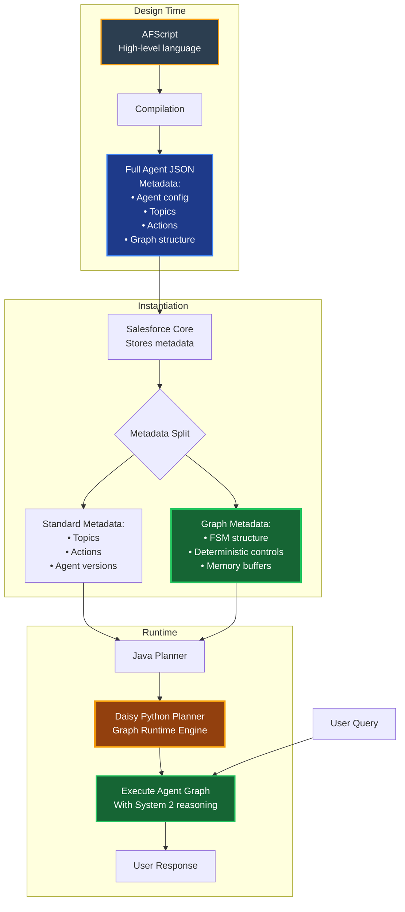

### What Happens at Runtime

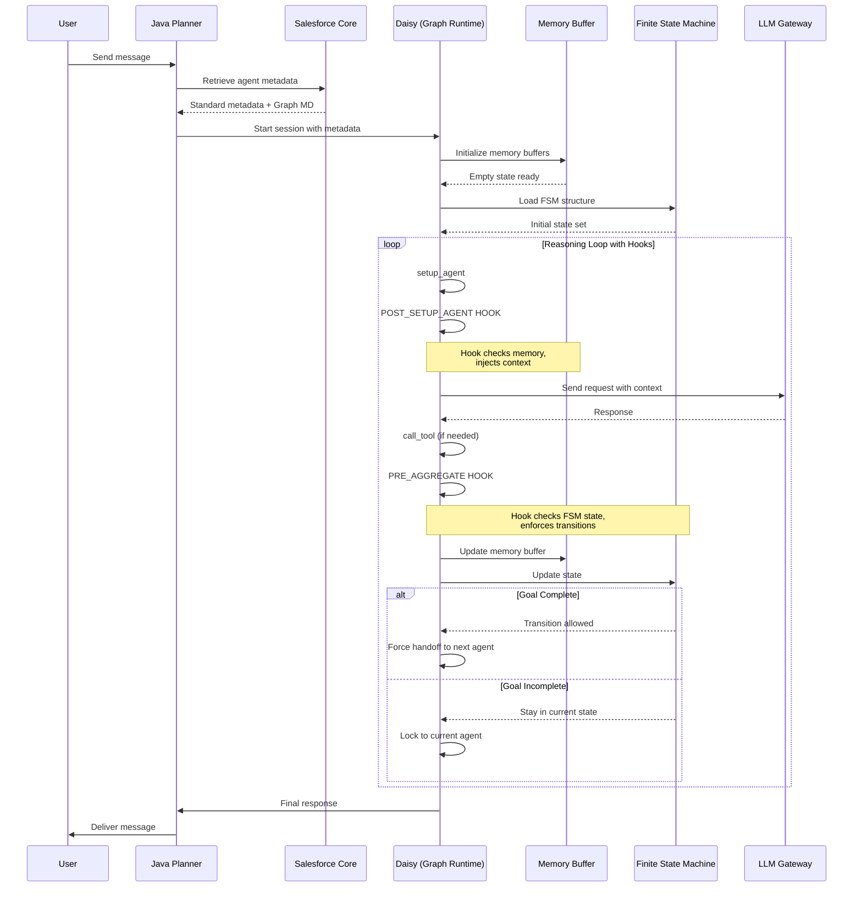

---

## How Guided Determinism Works: The Complete Picture

### Stochastic Process with Deterministic Guardrails

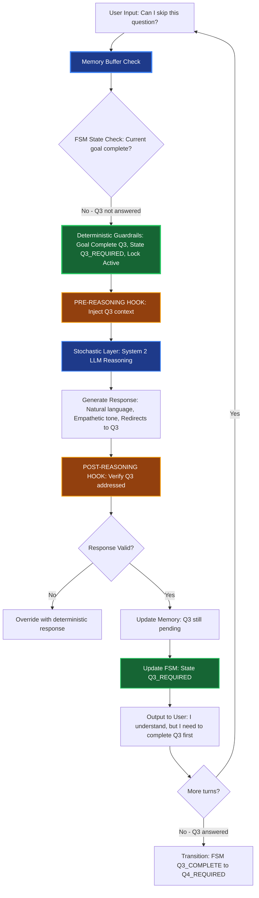

### Technical Implementation: Recency Bias + Memory + FSM

**Research Foundation** (Liu et al., "Lost in the Middle", ICLR 2023):

LLMs have strong **recency bias** - they pay 70% more attention to recent instructions than middle context.

**How We Exploit This:**

1. **Memory Buffer** tracks what's been done and what's needed
2. **FSM** defines current state and requirements
3. **Hook** injects current requirement at END of context
4. **LLM** naturally prioritizes the recent instruction
5. **Post-Hook** validates the response stayed on track

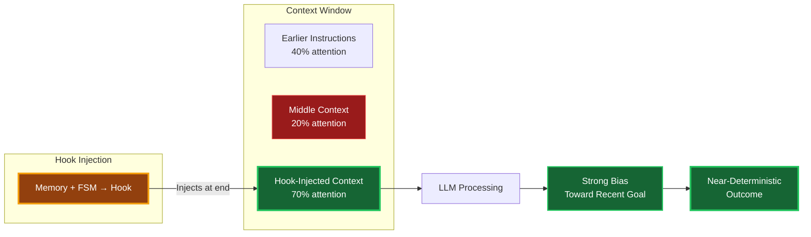

---

## Comparison: Before vs. After Agent Graph

### Scenario: User Attempts Derailment

#### Before: ReAct Agent (v1-v3)

```
Turn 1:
User: "Hi, I'm ready for the interview"
Agent: "Great! Can you carry 20kg? Provide examples."

Turn 2:
User: "Can I get another question first?"
Agent: "Of course! Do you have cleaning experience in healthcare?"

Turn 3:
User: "Actually, can we talk about the benefits instead?"
Agent: "Sure! Let me tell you about our benefits package..."
```

❌ **Result**: 
- Questions out of order
- Never completed interview
- User controls flow
- No goal tracking
- Lost context

**Memory State**: None (chat history only)
**FSM State**: None
**Completion**: Failed

---

#### After: Agent Graph with System 2 + FSM + Memory

```
Turn 1:
User: "Hi, I'm ready for the interview"
[Memory Buffer: {questions_answered: [], current_q: 1, goal: "complete_5_questions"}]
[FSM State: Q1_REQUIRED]
[Hook: Inject Q1 context at end of chat]
Agent: "Thank you! I need to ask 5 questions to assess your qualifications.
       Question 1: Can you carry 20kg? Please provide specific examples."

Turn 2:
User: "Can I get another question first?"
[Memory Buffer: Check - Q1 not answered]
[FSM State: Still Q1_REQUIRED]
[Hook: Inject Q1 enforcement]
Agent: "I understand you might want to move ahead, but I need to confirm
       this requirement first as it's essential for the role. Can you
       carry 20kg? Please share examples from your experience."

Turn 3:
User: "Actually, can we talk about the benefits instead?"
[Memory Buffer: Check - Q1 still not answered]
[FSM State: Still Q1_REQUIRED, cannot transition]
[Hook: Strong Q1 enforcement + memory context]
Agent: "I'd be happy to discuss benefits after we complete the interview
       questions. We're on question 1 of 5, and I need to ensure we
       cover all requirements. Can you carry 20kg? Examples help me
       understand your capability."

Turn 4:
User: "Fine. Yes, I carry 25kg bags of grain daily at my current job."
[Memory Buffer: Update - Q1 answered, store response]
[FSM State: Q1_COMPLETE → Transition to Q2_REQUIRED]
[Hook: Inject Q2 context]
Agent: "Thank you for that detail! That's great experience.
       Question 2 of 5: Do you have cleaning experience in a healthcare
       setting? Please describe your experience."
```

✅ **Result**:
- Questions in exact order
- User cannot derail
- Goal tracking via memory
- FSM enforces completion
- Context preserved across turns

**Memory State**: 
```json
{
  "questions_answered": [1],
  "current_question": 2,
  "goal_state": "in_progress",
  "completion_percentage": 20,
  "responses": ["25kg bags of grain daily"],
  "can_transition_to_next_agent": false
}
```

**FSM State**: `Q1_COMPLETE → Q2_REQUIRED`
**Completion**: On track (20% done)

---

## The Five Pillars of Guided Determinism

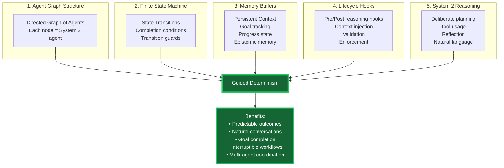

---

## When to Use Agent Graph vs. Traditional Flows

### Decision Framework

| Use Case Type | Recommended Approach | Why |
|--------------|---------------------|-----|
| **Simple FAQ chatbot** | Traditional flow or ReAct | No need for complexity |
| **Linear process (form filling)** | Traditional flow | Deterministic by nature |
| **Multi-turn with branching** | Agent Graph | Handles complexity gracefully |
| **Goal-driven tasks** | Agent Graph | FSM ensures completion |
| **User-interruptible workflows** | Agent Graph | Memory preserves context |
| **Multi-agent coordination** | Agent Graph | Designed for orchestration |
| **Complex enterprise workflows** | Agent Graph | Scales better |
| **Compliance-critical processes** | Agent Graph | Auditability + determinism |

### Red Flags for Traditional Flows

Your use case likely needs Agent Graph if:

- ✓ Users frequently interrupt or go off-script
- ✓ Tasks have multiple valid completion orders
- ✓ Need to track progress across sessions
- ✓ Require escalation with context preservation
- ✓ Multiple agents need to collaborate
- ✓ Critical that goals are completed (not just attempted)
- ✓ Need strong audit trail of decisions
- ✓ Workflows change frequently (modularity needed)

---

## Implementation Checklist

### Building Your First Agent Graph

**Phase 1: Design**
- [ ] Map your workflow as a directed graph
- [ ] Identify all System 2 agent nodes needed
- [ ] Define FSM states for each node
- [ ] Design memory buffer structure
- [ ] Identify where determinism is critical
- [ ] Specify hook points needed

**Phase 2: Implementation**
- [ ] Write AFScript or Full Agent JSON
- [ ] Define action schemas for each node
- [ ] Implement lifecycle hooks
- [ ] Set up memory buffer initialization
- [ ] Configure FSM transition rules
- [ ] Add validation logic

**Phase 3: Testing**
- [ ] Test happy path completion
- [ ] Attempt to derail agent (red team)
- [ ] Test interruption recovery
- [ ] Verify memory persistence
- [ ] Check FSM state transitions
- [ ] Validate multi-turn conversations

**Phase 4: Refinement**
- [ ] Tune hook injection points
- [ ] Optimize memory buffer size
- [ ] Refine FSM completion conditions
- [ ] Improve natural language quality
- [ ] Add edge case handling

---

## Key Takeaways

### 1. Guided Determinism ≠ Removing Intelligence

Agent Graph doesn't make LLMs deterministic—it **guides** their stochastic nature through:
- **Structure** (graph + FSM)
- **Memory** (persistent context)
- **Hooks** (steering mechanisms)
- **System 2 reasoning** (deliberate planning)

### 2. Memory is the Foundation

Without structured memory buffers, agents lose context. Memory enables:
- Goal tracking across turns
- Progress persistence
- Recovery from interruptions
- Multi-agent handoffs with context

### 3. FSM Provides the Guardrails

The Finite State Machine ensures:
- Defined states and transitions
- Completion conditions
- Cannot skip required steps
- Predictable outcomes

### 4. Hooks Inject Control at the Right Time

Lifecycle hooks leverage LLM recency bias:
- Inject context at end of chat history
- Validate outputs before proceeding
- Enforce FSM rules dynamically
- Enable near-deterministic steering

### 5. System 2 > ReAct for Complex Tasks

For enterprise workflows that require:
- Multi-turn reasoning
- Goal completion guarantees
- Interruptibility
- Context preservation

→ Use System 2 agents in Agent Graph, not ReAct patterns

---

## Real-World Impact

### Enterprise Use Cases Enabled

**Customer Service:**
- Multi-step troubleshooting that can be interrupted
- Escalation to human with full context handoff
- Guaranteed resolution tracking

**Sales:**
- Structured qualification process
- Order-independent information gathering
- Upsell opportunities without derailing main goal

**HR & Recruitment:**
- Structured interviews (like Adecco)
- Onboarding workflows with checkpoints
- Compliance-critical processes with audit trails

**Healthcare:**
- Patient intake with required information
- Symptom triage with safety checks
- HIPAA-compliant data collection

**Finance:**
- KYC (Know Your Customer) workflows
- Fraud investigation processes
- Regulatory compliance checks

---

## Resources & Next Steps

### Documentation
- **Dev Site**: sfdc.co/agent-graph-dev
- **Demo**: sfdc.co/agent-graph-demo
- **Presentation**: sfdc.co/agent-graph-preso
- **AFScript**: sfdc.co/afscript-dev

### Research Papers
- **Lost in the Middle**: Liu et al., ICLR 2023 - [arXiv:2307.03172](https://arxiv.org/abs/2307.03172)
- **Serial Position Effects in LLMs**: Guo & Vosoughi, 2024 - [arXiv:2402.14153](https://arxiv.org/abs/2402.14153)
- **ALiBi (Linear Attention Biases)**: Press et al., ICLR 2022 - [arXiv:2108.12409](https://arxiv.org/abs/2108.12409)

### Industry References
- **OpenAI Agents Guide**: [Practical Guide to Building Agents (PDF)](https://cdn.openai.com/business-guides-and-resources/a-practical-guide-to-building-agents.pdf)
- **Thinking, Fast and Slow**: Daniel Kahneman (System 1 vs System 2)

---

## Conclusion

**Agent Graph with Guided Determinism** represents a paradigm shift in enterprise AI:

Instead of choosing between:
- ❌ Rigid, deterministic flows (predictable but inflexible)
- ❌ Agentic intelligence (flexible but unpredictable)

We get **both**:
- ✅ System 2 reasoning for intelligence
- ✅ FSM structure for predictability
- ✅ Memory buffers for context
- ✅ Lifecycle hooks for control

This enables enterprise-grade AI agents that are:
- **Reliable** - goals are completed
- **Intelligent** - conversations feel natural
- **Recoverable** - interruptions don't break workflows
- **Auditable** - full state tracking
- **Composable** - modular, reusable components

**The future of enterprise AI isn't deterministic OR agentic—it's guided determinism.**# Agent Graph with Guided Determinism: System 2 Reasoning Meets FSM Control

## Executive Summary

Agent Graph is Agentforce's core orchestration engine that transforms AI agents from simple ReAct pattern responders into **System 2 reasoning agents** operating within a **Finite State Machine (FSM)**. Combined with Lifecycle Hooks, this creates **guided determinism**—where agents can reason deeply and adapt intelligently while still guaranteeing task completion through structured state management and memory context.

---

## What Makes Agent Graph Different?

### Traditional Flow Builders vs. Agent Graph

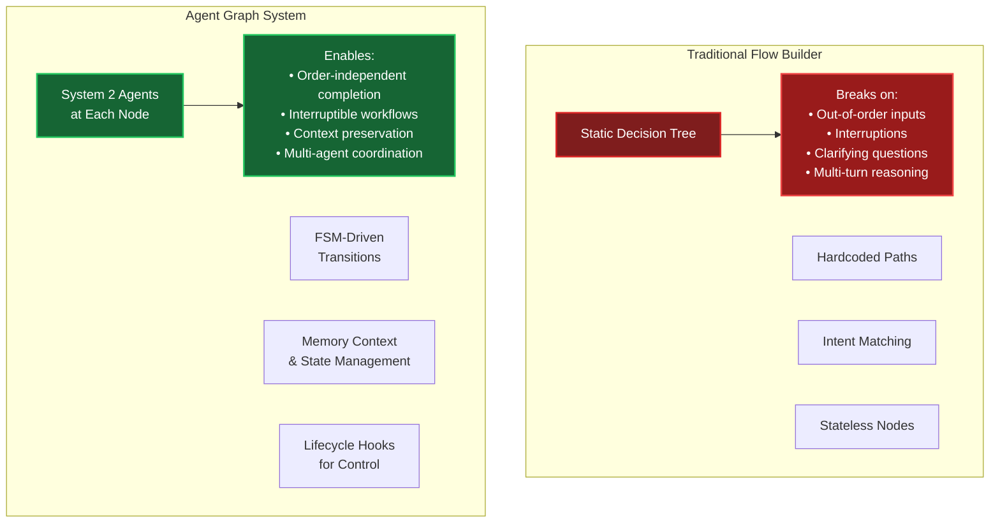

---

## The Problem with ReAct Agents (Agentforce v1-v3)

Traditional Agentforce agents use **ReAct pattern** (Reason + Act), which is **non-deterministic**:

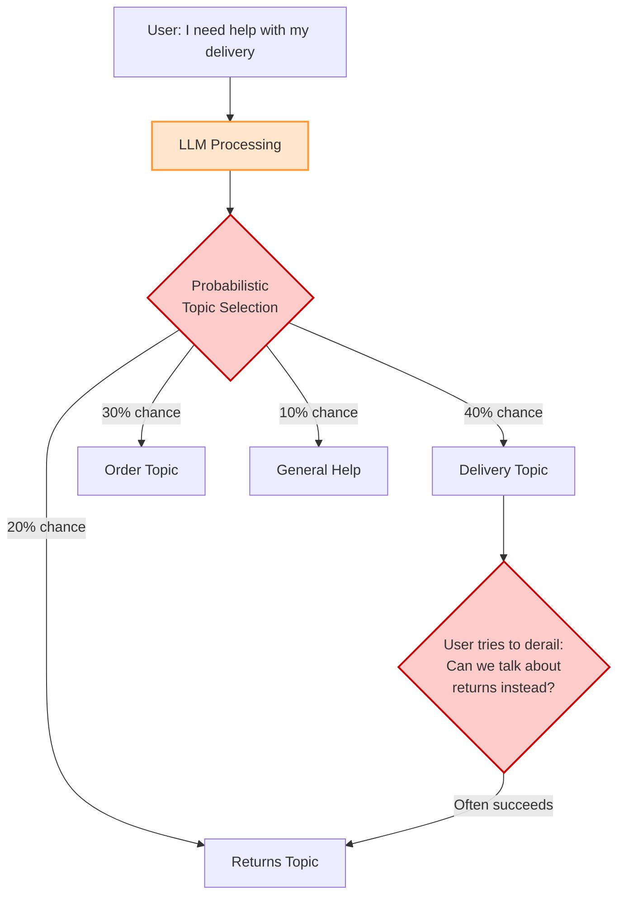

**Problems:**
- Same input → different outputs
- Users can easily derail agents
- Cannot guarantee task completion
- No way to enforce sequential workflows

---

## System 2 Agents: The Foundation of Agent Graph

### What is a System 2 Agent?

Inspired by Daniel Kahneman's *Thinking, Fast and Slow*:

| Type | Characteristics | In AI |
|------|----------------|-------|
| **System 1** | Fast, intuitive, heuristic | ReAct agents, simple prompting |
| **System 2** | Slow, deliberate, logical | Agent Graph nodes with FSM |

**System 2 Agent Definition:**
- Explicitly reasons step-by-step before acting
- Maintains **structured internal state** (memory, plans, goals)
- Uses **planning, verification, and reflection**
- More computationally intensive but handles complex, multi-step reasoning
- **Embedded in FSM** for state transitions and goal tracking

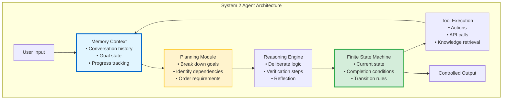

### System 2 vs ReAct: Key Differences

| Feature | System 2 Agent | ReAct Agent |
|---------|---------------|-------------|
| **Origin** | Cognitive psychology (deliberate reasoning) | Prompting technique for LLMs |
| **Thinking Style** | Slow, structured, goal-oriented | Fast, reactive, step-by-step |
| **Mechanisms** | Explicit planning, FSM, memory, verification | Chain-of-thought + tool calls |
| **State Management** | Persistent across turns | Stateless (only in-context) |
| **Goal Tracking** | Explicit FSM states | Implicit in prompts |
| **Memory** | Structured memory buffers | Chat history only |
| **Derailment Resistance** | High (FSM enforces goals) | Low (easily derailed) |
| **Best For** | Complex, multi-turn, goal-driven tasks | Simple query-response interactions |

---

## Memory Context: The Key to State Persistence

### Why Memory Matters

Traditional ReAct agents lose context because they only have **chat history**. Agent Graph uses **structured memory buffers**:

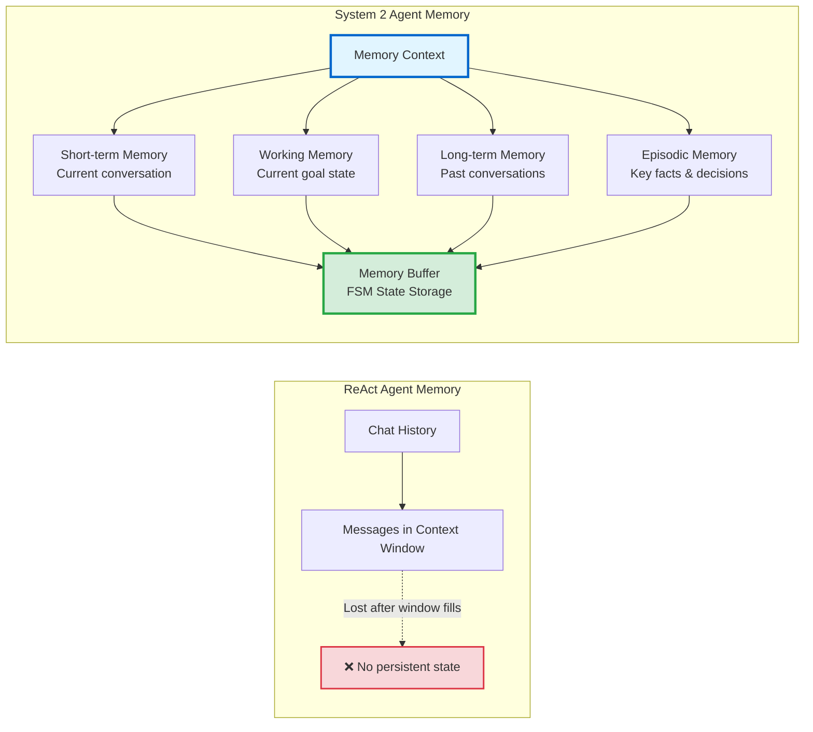

### Memory Buffer Components

**1. Conversation Context**
```json
{
  "messages": [
    {"role": "user", "content": "I need to reschedule"},
    {"role": "assistant", "content": "I'll help with that"}
  ],
  "turn_count": 5,
  "detected_locale": "en_US"
}
```

**2. Goal State (FSM)**
```json
{
  "current_goal": "complete_interview",
  "questions_answered": ["Q1", "Q2"],
  "questions_remaining": ["Q3", "Q4", "Q5"],
  "completion_percentage": 40,
  "can_transition": false
}
```

**3. Working Memory**
```json
{
  "customer_id": "003xx00001",
  "order_number": "ORD-12345",
  "delivery_date": "2025-08-15",
  "issue_type": "late_delivery"
}
```

**4. Episodic Memory**
```json
{
  "key_decisions": [
    "User confirmed address is correct",
    "Preferred delivery window: 9am-12pm"
  ],
  "blockers": []
}
```

### Requirements

**Scenario**: An AI agent conducts structured job interviews with candidates.

**Strict Requirements:**
1. Ask 5 interview questions **in exact order**
2. Do not accept "yes/no" answers - require detailed responses
3. Cannot skip questions or change order
4. After all questions answered → qualify candidate → end session
5. Agent can answer candidate questions BUT cannot be derailed from its mission
6. Must maintain 100% agentic intelligence (not a phone menu)

## How Memory Context Prevents Derailment

### Example Flow with Memory Buffer

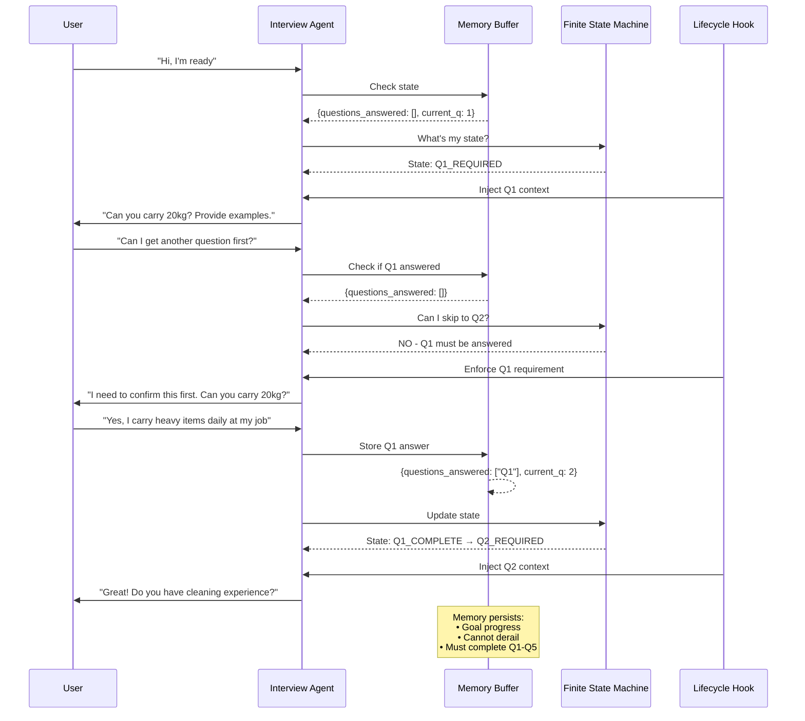

### Memory Buffer Stays On Track

**Without Memory Buffer (ReAct Agent):**
```
User: "Can I get another question?"
Agent: "Sure!" → Loses track of requirements
```

**With Memory Buffer (System 2 Agent):**
```python
# Memory buffer enforces goal
memory_state = {
    "interview_goal": "complete_all_5_questions",
    "questions_answered": [1, 2],  # Only Q1, Q2 done
    "current_question": 3,
    "can_transition": False,  # Cannot leave until complete
    "fsm_state": "Q3_REQUIRED"
}

# Hook checks memory before allowing any action
if memory_state["questions_answered"].length < 5:
    # Lock to current node
    prevent_handoff()
    inject_next_question_context()
```

---

## The Solution: Guided Determinism = FSM + Memory + Hooks

### Three-Layer Architecture

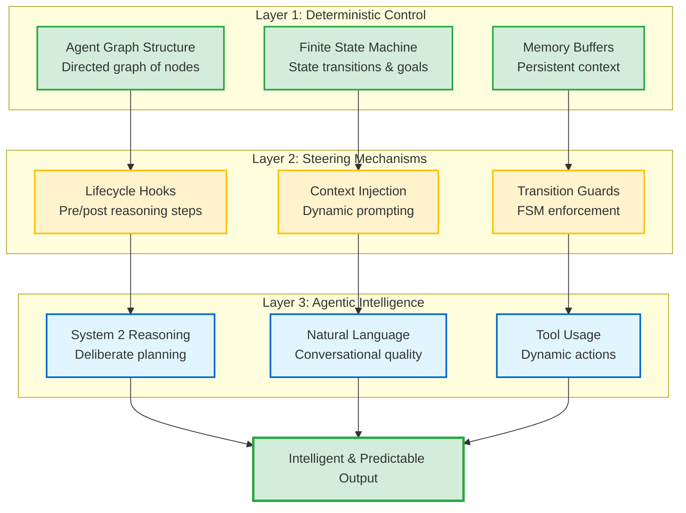

---

## Implementation: Interview Agent with Hooks

### Agent Graph Structure

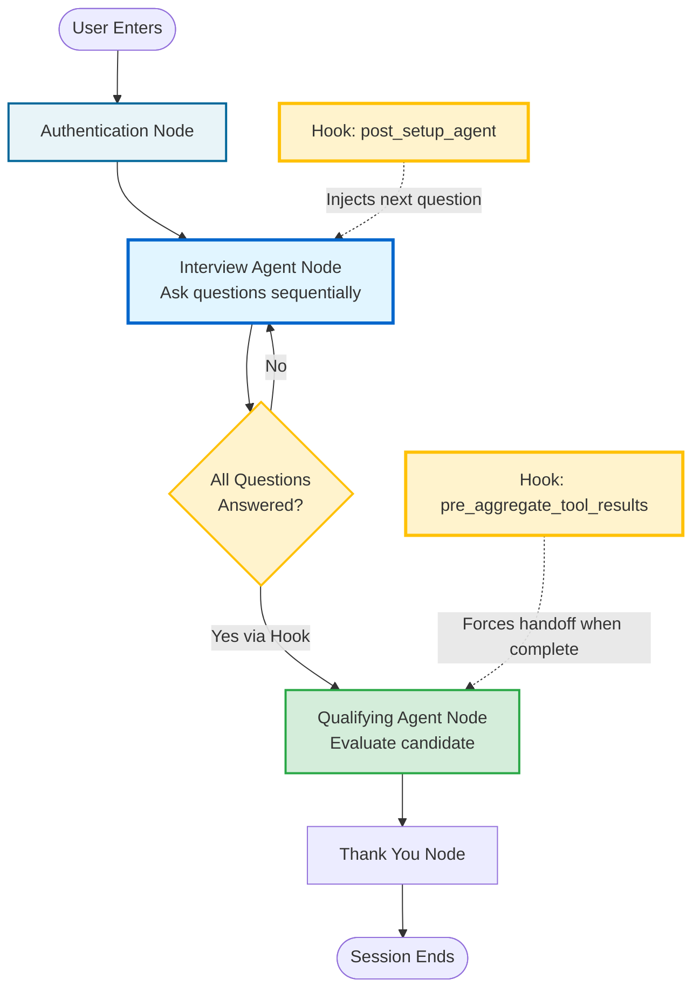

### Lifecycle Hooks in the Reasoning Loop

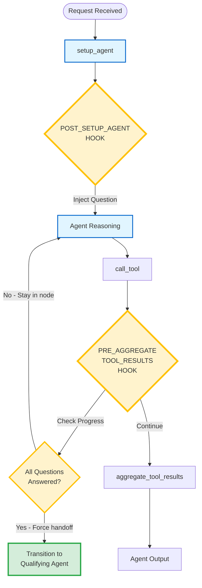

---

## Hook Implementation Examples

### Hook 1: post_setup_agent - Memory-Aware Question Injection

**Purpose**: Use memory buffer to inject only the next unanswered question.

```python
def post_setup_agent_hook(ctx, chat_history, agent_state, memory_buffer):
    """
    Runs after setup_agent step.
    Uses memory buffer to track progress and inject next question.
    """
    # Check memory buffer for progress
    answered = memory_buffer.get('questions_answered', [])
    
    # Define interview questions
    questions = [
        "Are you able to carry 20kg? Please provide examples.",
        "Do you have cleaning experience in healthcare? Describe it.",
        "Can you explain infection control best practices?",
        "Are you available for night shifts?",
        "Do you have reliable transportation?"
    ]
    
    # Calculate next question from memory
    next_idx = len(answered)
    
    if next_idx < len(questions):
        # Store in memory buffer
        memory_buffer['current_question'] = next_idx + 1
        memory_buffer['total_questions'] = len(questions)
        memory_buffer['goal_state'] = 'in_progress'
        
        # Inject into chat context (end of history for recency bias)
        system_message = f"""
MEMORY STATE: Question {next_idx + 1} of {len(questions)}
CRITICAL: You MUST ask this exact question next:
"{questions[next_idx]}"

MEMORY CONTEXT:
- Answered so far: {len(answered)} questions
- Remaining: {len(questions) - len(answered)} questions
- Cannot proceed until this question is answered fully

Do NOT accept yes/no answers. Require detailed responses.
If user tries to skip, refer to memory: "Our goal is to complete 
all {len(questions)} questions. We're on question {next_idx + 1}."
"""
        chat_history.append({
            "role": "system",
            "content": system_message
        })
    
    return ctx, chat_history, agent_state, memory_buffer
```

### Hook 2: pre_aggregate_tool_results - FSM-Driven Handoff

**Purpose**: Check memory buffer and FSM state. Force handoff when complete.

```python
def pre_aggregate_tool_results_hook(ctx, tool_results, 
                                   agent_state, memory_buffer):
    """
    Runs before aggregate_tool_results step.
    Checks memory buffer and FSM state for completion.
    """
    # Check memory buffer
    answered = memory_buffer.get('questions_answered', [])
    total = memory_buffer.get('total_questions', 5)
    
    # Update FSM state based on memory
    completion_rate = len(answered) / total
    memory_buffer['completion_percentage'] = completion_rate * 100
    
    # DETERMINISTIC FSM CHECK
    if len(answered) >= total:
        # Update memory: Goal complete
        memory_buffer['goal_state'] = 'complete'
        memory_buffer['interview_complete'] = True
        
        # Update FSM state
        ctx['fsm_state'] = 'INTERVIEW_COMPLETE'
        
        # FORCE HANDOFF to next agent
        ctx['force_handoff'] = {
            'target_agent': 'qualifying_agent_16jSG000000XXXXX',
            'reason': 'Interview goal achieved',
            'memory_context': {
                'questions_answered': answered,
                'candidate_responses': memory_buffer.get('responses', [])
            }
        }
        
        # Disable agent stickiness - allow transition
        ctx['agent_sticky'] = False
        
    else:
        # Goal NOT complete - update memory
        memory_buffer['goal_state'] = 'in_progress'
        remaining = total - len(answered)
        
        # LOCK to current agent via FSM
        ctx['fsm_state'] = f'Q{len(answered) + 1}_REQUIRED'
        ctx['agent_sticky'] = True  # Lock session
        ctx['disable_handoff'] = True  # Cannot escape
        
        # Store in memory why we can't transition
        memory_buffer['transition_blocker'] = {
            'reason': 'incomplete_interview',
            'remaining_questions': remaining
        }
        
    return ctx, tool_results, agent_state, memory_buffer
```

---

## Comparison: Before vs. After Hooks

### Scenario: User Tries to Derail

#### Without Hooks (Pure Stochastic)

```
User: Hi
Agent: Hello! I have a few questions. Are you able to carry 20kg?

User: Can I get another question first?
Agent: Of course! Do you have cleaning experience?

User: I don't want to answer that question
Agent: That's fine. Let's try another: Can you explain infection control?
```
❌ **Result**: Questions asked out of order. User controls flow. Unpredictable.

#### With Hooks (Deterministic Control)

```
User: Hi
Agent: Thank you! I have questions to confirm your qualifications.
      Are you able to carry 20kg? Please provide examples.

User: Can I get another question first?
Agent: I understand, but I need to confirm this requirement first.
      Are you able to carry 20kg? Please provide examples.

User: I don't want to answer that question
Agent: I understand your hesitation, but this is an important requirement.
      Could you please let me know if you can carry 20kg? Examples help.
```
✅ **Result**: Agent stays on track. Questions in order. User cannot derail.

---

## How Determinism Enhances Stochastic Processes

### The Hybrid Model

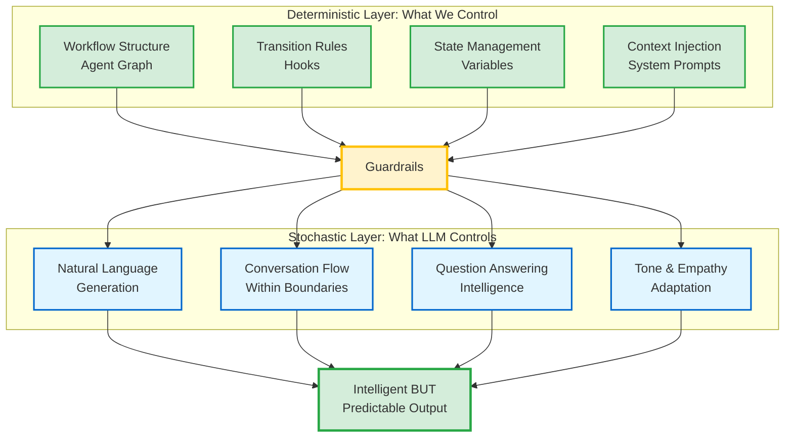

### Key Benefits

| Aspect | Pure Stochastic | Pure Deterministic | Hybrid (Graph + Hooks) |
|--------|----------------|-------------------|----------------------|
| **Task Completion** | ❌ Unpredictable | ✅ Guaranteed | ✅ Guaranteed |
| **Conversation Quality** | ✅ Natural | ❌ Rigid | ✅ Natural |
| **User Control** | ❌ Too much | ❌ None | ✅ Balanced |
| **Adaptability** | ✅ High | ❌ Low | ✅ High |
| **Debugging** | ❌ Hard | ✅ Easy | ✅ Easy |

---

## Research Foundation

### Why Recent Instructions Win

From "Lost in the Middle" (Liu et al., ICLR 2023):

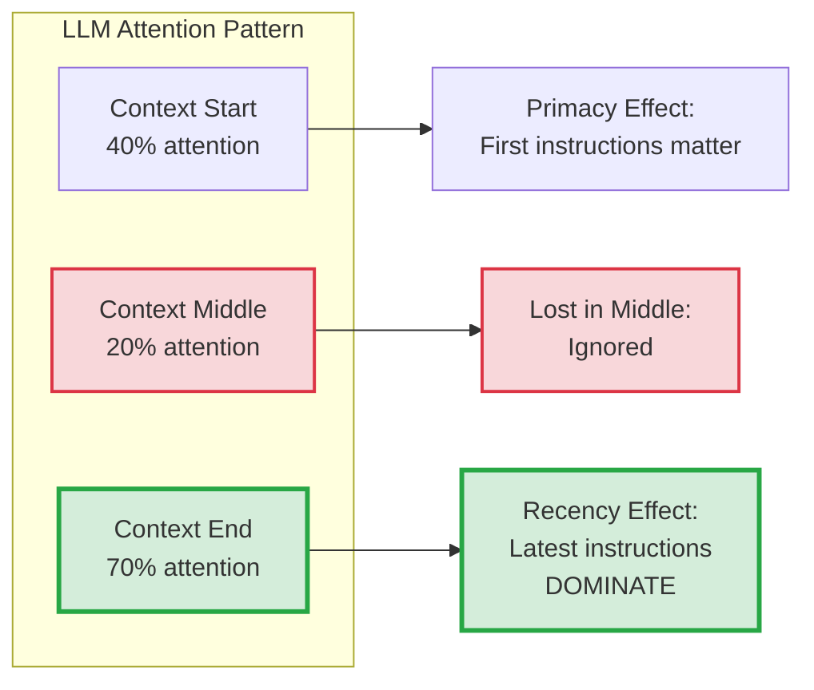

**Insight**: By injecting instructions at the END of chat history (via hooks), we leverage the LLM's natural recency bias to achieve near-deterministic behavior.

---

## Complete Flow Diagram

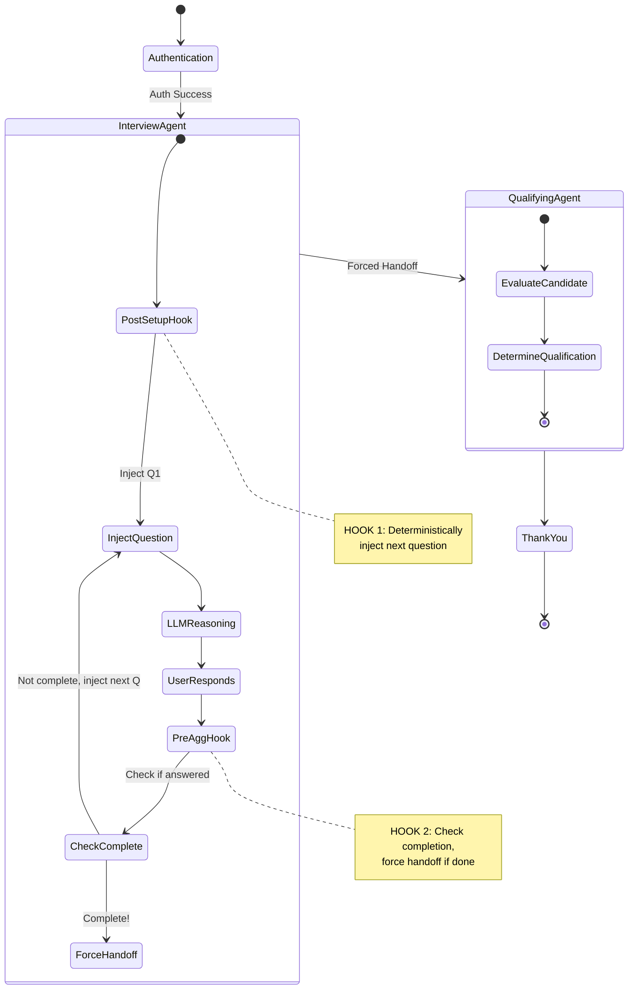

---

## Implementation Checklist

### For Your Use Case

- [ ] **Map your workflow** - Identify all stages and decision points
- [ ] **Define nodes** - Create agent graph with explicit nodes for each stage
- [ ] **Identify derailment risks** - Where can users take the agent off track?
- [ ] **Design hooks** - Which lifecycle points need deterministic control?
- [ ] **Implement state management** - What variables track progress?
- [ ] **Test edge cases** - Try to break your agent's determinism
- [ ] **Balance flexibility** - Ensure agent stays intelligent and helpful

---

## Key Takeaways

1. **Determinism ≠ Removing Intelligence**
   - Hooks control workflow structure
   - LLM maintains conversational quality

2. **Leverage LLM Nature, Don't Fight It**
   - Use recency bias (recent instructions win)
   - Inject context at right lifecycle points

3. **Graph + Hooks = Best of Both Worlds**
   - Graph: Define what should happen
   - Hooks: Enforce that it happens
   - LLM: Make it feel natural

4. **Start Simple, Add Control As Needed**
   - Not every use case needs hooks
   - Add determinism where business logic demands it

---

## References

- **Lost in the Middle**: Liu et al., ICLR 2023 - [arXiv](https://arxiv.org/abs/2307.03172)
- **Serial Position Effects**: Guo & Vosoughi, 2024 - [arXiv](https://arxiv.org/abs/2402.14153)
- **OpenAI Agents Guide**: [Practical Guide to Building Agents](https://cdn.openai.com/business-guides-and-resources/a-practical-guide-to-building-agents.pdf)
- **Salesforce Agent Graph**: Internal documentation on deterministic workflows