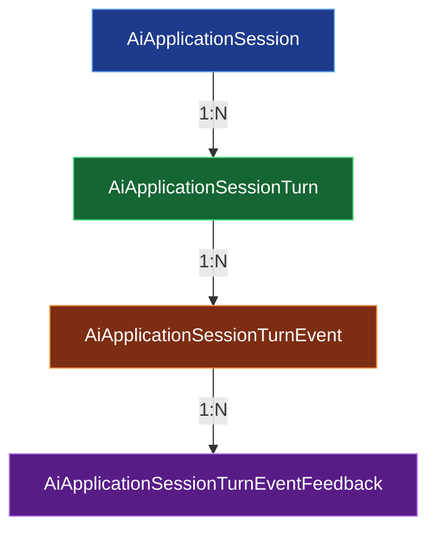
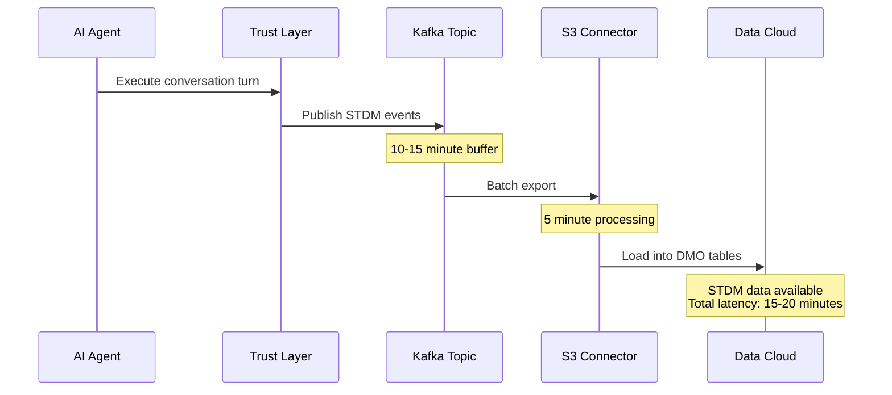
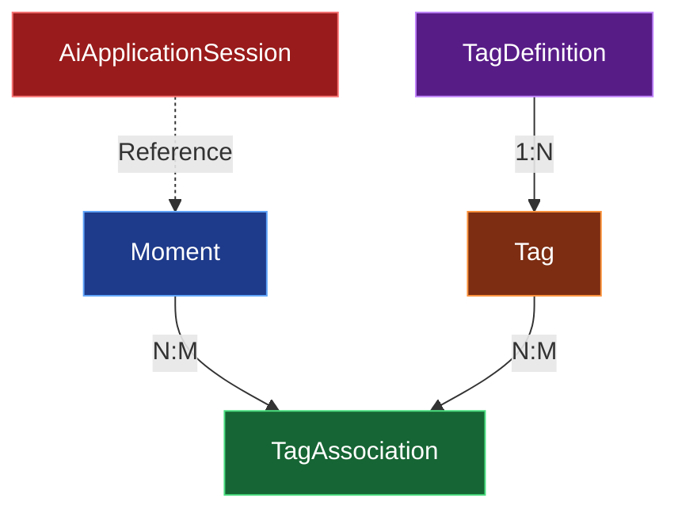
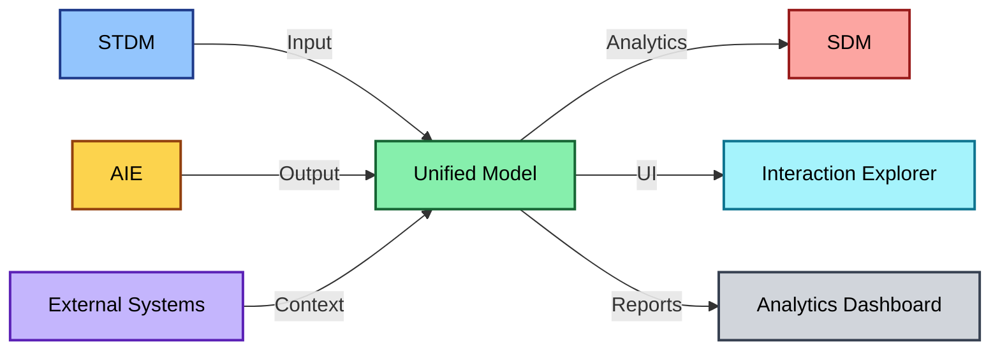
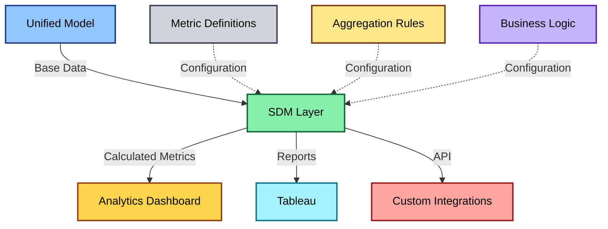
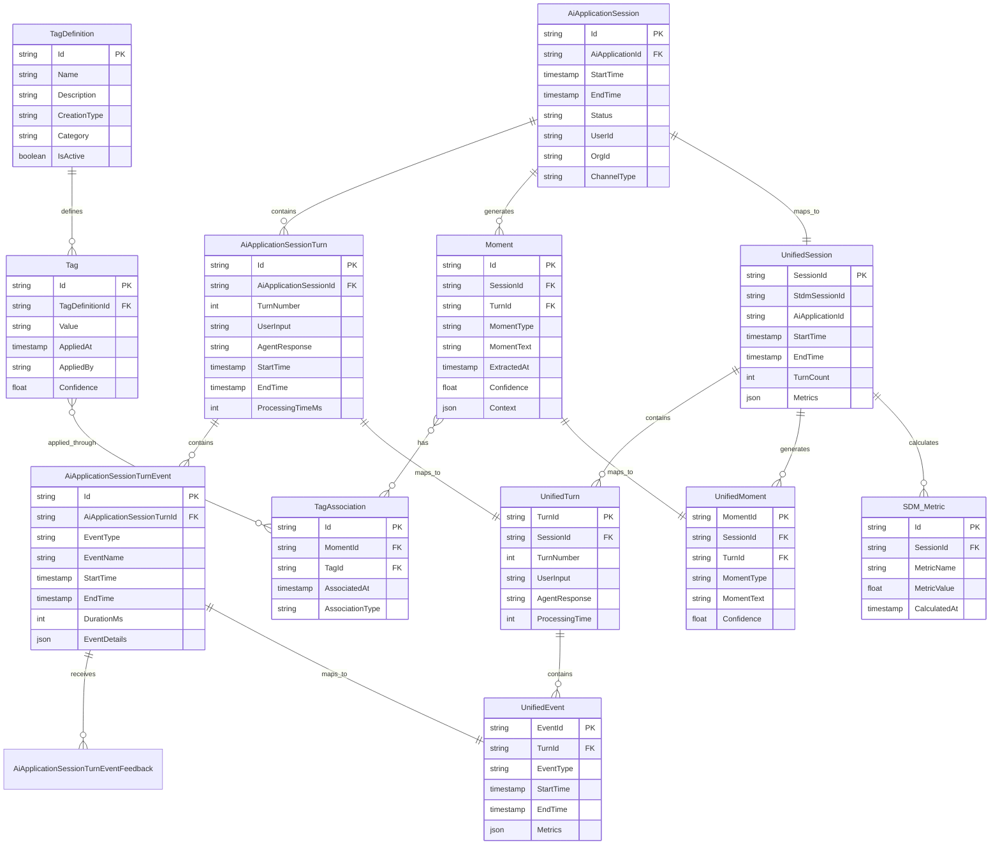

# Agentforce Observability Data Models

## Overview

The Agentforce Observability system operates on multiple interconnected data models that capture, process, and present AI agent conversation data. This document provides comprehensive technical documentation of all data models, their entities, relationships, and calculated metrics.

**Key Data Models:**
- **STDM (Session Tracing Data Model)**: Input data capturing raw agent conversations
- **AIE Data Model**: Output data containing processed moments, tags, and associations
- **Unified Data Model**: Central integration hub connecting all system components
- **SDM (Semantic Data Model)**: Metadata layer with calculated metrics for analytics

---

## Session Tracing Data Model (STDM)

### Overview

STDM serves as the foundational input data model for Agentforce Observability. It captures raw conversation data from AI agents running in Einstein GPT Trust Layer. STDM provisioning is a prerequisite for AIE provisioning.

### Entity Hierarchy



### Core Entities

#### AiApplicationSession

Root entity representing a complete conversation session between user and AI agent.

**Key Attributes:**
```
- Id: Unique session identifier
- AiApplicationId: Reference to the AI application/agent
- StartTime: Session initiation timestamp
- EndTime: Session completion timestamp
- Status: Session state (Active, Completed, Failed)
- ConversationIdentifier: External conversation reference
- ChannelType: Communication channel (Web, Mobile, API)
- UserId: User initiating the session
- OrgId: Organization identifier
```

**Relationships:**
- Has many `AiApplicationSessionTurn` (conversation turns)
- Belongs to `AiApplication` (agent configuration)

#### AiApplicationSessionTurn

Represents a single turn in the conversation (user message + agent response).

**Key Attributes:**
```
- Id: Unique turn identifier
- AiApplicationSessionId: Parent session reference
- TurnNumber: Sequential turn order (1, 2, 3...)
- UserInput: User's message/query
- AgentResponse: Agent's generated response
- StartTime: Turn processing start
- EndTime: Turn processing completion
- ProcessingTimeMs: Total turn latency
- Status: Turn outcome (Success, Failure, Timeout)
```

**Relationships:**
- Belongs to `AiApplicationSession`
- Has many `AiApplicationSessionTurnEvent` (processing events)

#### AiApplicationSessionTurnEvent

Captures individual events during turn processing (RAG retrieval, LLM generation, action execution).

**Key Attributes:**
```
- Id: Unique event identifier
- AiApplicationSessionTurnId: Parent turn reference
- EventType: Event category (RAG_RETRIEVAL, LLM_GENERATION, AGENT_ACTION)
- EventName: Specific event name
- StartTime: Event start timestamp
- EndTime: Event completion timestamp
- DurationMs: Event duration
- Status: Event outcome
- EventDetails: JSON payload with event-specific data
```

**Event Types:**
```
RAG_RETRIEVAL:
- Knowledge article search
- Vector similarity search
- Document retrieval

LLM_GENERATION:
- Prompt construction
- LLM API call
- Response generation

AGENT_ACTION:
- Tool invocation
- API integration
- System command execution
```

**Relationships:**
- Belongs to `AiApplicationSessionTurn`
- Has many `AiApplicationSessionTurnEventFeedback` (user feedback)

#### AiApplicationSessionTurnEventFeedback

Stores user-provided feedback on specific events (thumbs up/down, comments).

**Key Attributes:**
```
- Id: Unique feedback identifier
- AiApplicationSessionTurnEventId: Parent event reference
- FeedbackType: Type of feedback (RATING, COMMENT, FLAG)
- Rating: Numerical rating (1-5) or binary (thumbs up/down)
- Comment: Free-text feedback
- FeedbackTime: When feedback was provided
- UserId: User providing feedback
```

### Data Ingestion Flow



**Latency Breakdown:**
- Kafka buffering: 10-15 minutes
- S3 connector processing: 5 minutes
- **Total end-to-end latency: 15-20 minutes**

---

## AIE Data Model

### Overview

The AIE Data Model contains processed observability data including moments (extracted user intents), tags (categorizations), and their associations. This model is populated by the MomentGeneration and Clustering pipelines.

### Entity Architecture



### Core Entities

#### Moment

Represents a single extracted user intent or meaningful interaction from a conversation turn.

**Schema:**
```json
{
  "id": "string",
  "sessionId": "string",
  "turnId": "string",
  "momentType": "string",
  "momentText": "string",
  "extractedAt": "timestamp",
  "confidence": "float",
  "context": {
    "userInput": "string",
    "agentResponse": "string",
    "turnNumber": "integer"
  },
  "metadata": {
    "extractionMethod": "string",
    "llmModel": "string",
    "processingTime": "integer"
  }
}
```

**Key Attributes:**
- **id**: Unique moment identifier (UUID)
- **sessionId**: Reference to parent AiApplicationSession
- **turnId**: Reference to specific turn where moment occurred
- **momentType**: Classification of moment (QUESTION, COMPLAINT, PRAISE, REQUEST, etc.)
- **momentText**: Extracted intent in natural language
- **extractedAt**: Timestamp of moment extraction
- **confidence**: LLM confidence score (0.0 - 1.0)
- **context**: Original conversation context
- **metadata**: Processing details

**Moment Types:**
```
USER_QUESTION: User asking for information
USER_COMPLAINT: User expressing dissatisfaction
USER_PRAISE: User expressing satisfaction
USER_REQUEST: User requesting action
AGENT_FAILURE: Agent unable to fulfill request
AGENT_SUCCESS: Agent successfully completed task
ESCALATION: Conversation escalated to human
TOPIC_SWITCH: User changed conversation topic
```

#### TagDefinition

Defines a tag schema that can be applied to moments. Tags categorize moments for analytics and filtering.

**Schema:**
```json
{
  "id": "string",
  "name": "string",
  "description": "string",
  "creationType": "string",
  "category": "string",
  "isActive": "boolean",
  "createdBy": "string",
  "createdAt": "timestamp",
  "modifiedAt": "timestamp",
  "validationRules": {
    "allowedValues": ["array"],
    "valueType": "string",
    "required": "boolean"
  }
}
```

**Key Attributes:**
- **id**: Unique tag definition identifier
- **name**: Tag name (e.g., "Product Inquiry", "Technical Issue")
- **description**: Tag purpose and usage
- **creationType**: How tag is applied (MANUAL, USER_DEFINED_AUTO, SYSTEM_AUTO_GENERATED)
- **category**: Grouping category (TOPIC, SENTIMENT, OUTCOME, QUALITY)
- **isActive**: Whether tag is currently in use
- **validationRules**: Constraints for tag values

**Creation Types:**

1. **MANUAL**: User manually applies tag to moments through UI
   - Full control over tagging
   - Used for custom categorizations
   - Requires manual review effort

2. **USER_DEFINED_AUTO**: User creates tag definition with auto-application rules
   - User defines keywords, patterns, or conditions
   - System automatically applies when conditions met
   - Example: Tag "Billing Question" when moment contains "invoice", "charge", "payment"

3. **SYSTEM_AUTO_GENERATED**: System automatically generates tags via clustering
   - Clustering pipeline identifies common patterns
   - LLM generates category names
   - No user intervention required
   - Example: After clustering, system creates "Product Setup Issues" tag for cluster of similar moments

#### Tag

Represents a tag instance applied to a specific moment.

**Schema:**
```json
{
  "id": "string",
  "tagDefinitionId": "string",
  "value": "string",
  "appliedAt": "timestamp",
  "appliedBy": "string",
  "confidence": "float",
  "source": "string"
}
```

**Key Attributes:**
- **id**: Unique tag instance identifier
- **tagDefinitionId**: Reference to TagDefinition
- **value**: Actual tag value (may be from predefined list or free text)
- **appliedAt**: When tag was applied
- **appliedBy**: User or system that applied tag
- **confidence**: Confidence score for auto-generated tags
- **source**: Application source (UI, API, CLUSTERING_PIPELINE, RULE_ENGINE)

#### TagAssociation

Links tags to moments, enabling many-to-many relationships.

**Schema:**
```json
{
  "id": "string",
  "momentId": "string",
  "tagId": "string",
  "associatedAt": "timestamp",
  "associatedBy": "string",
  "associationType": "string"
}
```

**Key Attributes:**
- **id**: Unique association identifier
- **momentId**: Reference to Moment
- **tagId**: Reference to Tag
- **associatedAt**: Association timestamp
- **associatedBy**: User or system creating association
- **associationType**: Type of association (PRIMARY, SECONDARY, INFERRED)

**Association Types:**
- **PRIMARY**: Directly applied tag (manual or auto)
- **SECONDARY**: Related tag inferred from primary tags
- **INFERRED**: Tag inferred from context or patterns

### Out-of-the-Box (OOTB) Tags

#### Quality Score Tag

System-generated tag assessing conversation quality based on multiple factors.

**Calculation Factors:**
```python
def calculate_quality_score(session):
    factors = {
        'resolution_rate': 0.3,      # Did agent resolve user's request?
        'response_time': 0.2,         # Agent response latency
        'user_satisfaction': 0.2,     # Explicit user feedback
        'conversation_length': 0.15,  # Optimal turn count (not too short/long)
        'escalation_rate': 0.15       # Was escalation needed?
    }
    
    score = 0
    score += factors['resolution_rate'] * (1 if session.resolved else 0)
    score += factors['response_time'] * calculate_response_time_score(session)
    score += factors['user_satisfaction'] * session.average_feedback_rating / 5
    score += factors['conversation_length'] * calculate_length_score(session)
    score += factors['escalation_rate'] * (1 if not session.escalated else 0)
    
    return score * 100  # 0-100 scale
```

**Score Ranges:**
- 90-100: Excellent - High quality conversation, positive outcome
- 70-89: Good - Satisfactory conversation, user needs met
- 50-69: Fair - Acceptable but room for improvement
- 30-49: Poor - Suboptimal conversation, issues present
- 0-29: Critical - Significant problems, likely negative outcome

#### AIE Request Category Tag

System-generated tag categorizing the primary user intent across the entire session.

**Categories:**
```
INFORMATION_SEEKING:
- User looking for specific information
- Knowledge base queries
- How-to questions

PROBLEM_SOLVING:
- Technical issues
- Troubleshooting
- Error resolution

TRANSACTION:
- Purchase requests
- Account modifications
- Service activation

FEEDBACK:
- Complaints
- Suggestions
- Praise

GENERAL_INQUIRY:
- Broad questions
- Exploratory conversations
- Multiple topics
```

**Assignment Logic:**
```python
def assign_request_category(session):
    # Extract all moments from session
    moments = get_moments(session.id)
    
    # Count moment types
    type_counts = Counter([m.momentType for m in moments])
    
    # Determine dominant intent
    if type_counts['USER_QUESTION'] > len(moments) * 0.5:
        return 'INFORMATION_SEEKING'
    elif type_counts['USER_COMPLAINT'] + type_counts['AGENT_FAILURE'] > len(moments) * 0.3:
        return 'PROBLEM_SOLVING'
    elif 'purchase' in session.keywords or 'buy' in session.keywords:
        return 'TRANSACTION'
    elif type_counts['USER_COMPLAINT'] + type_counts['USER_PRAISE'] > len(moments) * 0.4:
        return 'FEEDBACK'
    else:
        return 'GENERAL_INQUIRY'
```

---

## Unified Data Model

### Overview

The Unified Data Model serves as the central integration hub connecting STDM, AIE, and external systems. It provides a consistent view of agent conversations across all data layers.

### Architecture



### Integration Points

#### STDM → Unified Model

**Mapping:**
```
AiApplicationSession → UnifiedSession
  - Session metadata
  - Start/end timestamps
  - User/agent identifiers
  - Channel information

AiApplicationSessionTurn → UnifiedTurn
  - Turn sequence
  - User input
  - Agent response
  - Processing metrics

AiApplicationSessionTurnEvent → UnifiedEvent
  - Event types
  - Event timing
  - Event outcomes
  - Event metadata
```

#### AIE → Unified Model

**Mapping:**
```
Moment → UnifiedMoment
  - Extracted intents
  - Moment types
  - Confidence scores
  - Context references

Tag → UnifiedTag
  - Tag definitions
  - Tag values
  - Application metadata

TagAssociation → UnifiedTagAssociation
  - Moment-tag links
  - Association types
  - Application source
```

### Unified Entity Schema

#### UnifiedSession

```json
{
  "sessionId": "string",
  "stdmSessionId": "string",
  "aiApplicationId": "string",
  "userId": "string",
  "orgId": "string",
  "startTime": "timestamp",
  "endTime": "timestamp",
  "duration": "integer",
  "turnCount": "integer",
  "channelType": "string",
  "status": "string",
  "moments": ["array<UnifiedMoment>"],
  "tags": ["array<UnifiedTag>"],
  "metrics": {
    "qualityScore": "float",
    "resolutionRate": "float",
    "averageResponseTime": "integer",
    "userSatisfaction": "float"
  }
}
```

#### UnifiedTurn

```json
{
  "turnId": "string",
  "sessionId": "string",
  "turnNumber": "integer",
  "userInput": "string",
  "agentResponse": "string",
  "startTime": "timestamp",
  "endTime": "timestamp",
  "processingTime": "integer",
  "events": ["array<UnifiedEvent>"],
  "moments": ["array<UnifiedMoment>"],
  "sentiment": "string",
  "outcome": "string"
}
```

#### UnifiedEvent

```json
{
  "eventId": "string",
  "turnId": "string",
  "eventType": "string",
  "eventName": "string",
  "startTime": "timestamp",
  "endTime": "timestamp",
  "duration": "integer",
  "status": "string",
  "details": "object",
  "metrics": {
    "retrievalCount": "integer",
    "retrievalRelevance": "float",
    "llmTokens": "integer",
    "actionSuccess": "boolean"
  }
}
```

#### UnifiedMoment

```json
{
  "momentId": "string",
  "sessionId": "string",
  "turnId": "string",
  "momentType": "string",
  "momentText": "string",
  "extractedAt": "timestamp",
  "confidence": "float",
  "context": "object",
  "tags": ["array<UnifiedTag>"],
  "relatedMoments": ["array<string>"]
}
```

---

## Semantic Data Model (SDM)

### Overview

SDM is a metadata layer built on top of the Unified Data Model that provides calculated metrics, aggregations, and business logic for analytics dashboards and Tableau integration.

### Architecture



### Calculated Metrics

#### 1. Session Resolution Rate

**Definition:** Percentage of sessions where user's request was successfully resolved.

**Formula:**
```python
def calculate_resolution_rate(sessions):
    resolved_count = 0
    total_count = len(sessions)
    
    for session in sessions:
        # Check if session ended with success
        if session.status == 'COMPLETED':
            # Check for success moments in final turns
            final_moments = get_moments(session.id, last_n_turns=2)
            if any(m.momentType == 'AGENT_SUCCESS' for m in final_moments):
                resolved_count += 1
            # Check for positive user feedback
            elif session.average_feedback_rating >= 4:
                resolved_count += 1
            # Check if no escalation occurred
            elif not session.escalated:
                resolved_count += 1
    
    return (resolved_count / total_count) * 100 if total_count > 0 else 0
```

**Usage in SDM:**
```sql
CREATE OR REPLACE VIEW sdm_session_resolution_rate AS
SELECT
    org_id,
    ai_application_id,
    DATE_TRUNC('day', start_time) as date,
    COUNT(*) as total_sessions,
    SUM(CASE 
        WHEN status = 'COMPLETED' 
        AND (has_success_moment OR avg_feedback >= 4 OR escalated = FALSE)
        THEN 1 ELSE 0 
    END) as resolved_sessions,
    (resolved_sessions / total_sessions) * 100 as resolution_rate_pct
FROM unified_session
GROUP BY org_id, ai_application_id, date;
```

#### 2. Average Response Time

**Definition:** Mean time taken by agent to respond to user inputs.

**Formula:**
```python
def calculate_avg_response_time(sessions):
    total_response_time = 0
    total_turns = 0
    
    for session in sessions:
        turns = get_turns(session.id)
        for turn in turns:
            # Calculate time from user input to agent response
            response_time = turn.agent_response_start - turn.user_input_end
            total_response_time += response_time.total_milliseconds()
            total_turns += 1
    
    return total_response_time / total_turns if total_turns > 0 else 0
```

**Usage in SDM:**
```sql
CREATE OR REPLACE VIEW sdm_avg_response_time AS
SELECT
    org_id,
    ai_application_id,
    DATE_TRUNC('hour', start_time) as hour,
    AVG(processing_time_ms) as avg_response_time_ms,
    PERCENTILE_CONT(0.5) WITHIN GROUP (ORDER BY processing_time_ms) as median_response_time_ms,
    PERCENTILE_CONT(0.95) WITHIN GROUP (ORDER BY processing_time_ms) as p95_response_time_ms
FROM unified_turn
GROUP BY org_id, ai_application_id, hour;
```

#### 3. User Satisfaction Score

**Definition:** Aggregate score based on explicit user feedback (ratings, thumbs up/down).

**Formula:**
```python
def calculate_user_satisfaction(sessions):
    total_score = 0
    feedback_count = 0
    
    for session in sessions:
        feedbacks = get_feedbacks(session.id)
        for feedback in feedbacks:
            if feedback.feedback_type == 'RATING':
                # Normalize to 0-1 scale
                normalized_score = feedback.rating / 5.0
                total_score += normalized_score
                feedback_count += 1
            elif feedback.feedback_type == 'THUMBS':
                # Thumbs up = 1, Thumbs down = 0
                total_score += 1 if feedback.value == 'UP' else 0
                feedback_count += 1
    
    return (total_score / feedback_count) * 100 if feedback_count > 0 else None
```

**Usage in SDM:**
```sql
CREATE OR REPLACE VIEW sdm_user_satisfaction AS
SELECT
    org_id,
    ai_application_id,
    DATE_TRUNC('day', feedback_time) as date,
    COUNT(*) as feedback_count,
    AVG(CASE 
        WHEN feedback_type = 'RATING' THEN rating / 5.0
        WHEN feedback_type = 'THUMBS' AND value = 'UP' THEN 1.0
        WHEN feedback_type = 'THUMBS' AND value = 'DOWN' THEN 0.0
    END) * 100 as satisfaction_score
FROM unified_feedback
GROUP BY org_id, ai_application_id, date;
```

#### 4. Conversation Length Distribution

**Definition:** Statistical distribution of conversation turn counts.

**Formula:**
```python
def calculate_conversation_length_distribution(sessions):
    turn_counts = [len(get_turns(s.id)) for s in sessions]
    
    return {
        'mean': np.mean(turn_counts),
        'median': np.median(turn_counts),
        'std_dev': np.std(turn_counts),
        'min': np.min(turn_counts),
        'max': np.max(turn_counts),
        'percentiles': {
            'p25': np.percentile(turn_counts, 25),
            'p50': np.percentile(turn_counts, 50),
            'p75': np.percentile(turn_counts, 75),
            'p90': np.percentile(turn_counts, 90),
            'p95': np.percentile(turn_counts, 95),
            'p99': np.percentile(turn_counts, 99)
        }
    }
```

**Usage in SDM:**
```sql
CREATE OR REPLACE VIEW sdm_conversation_length AS
SELECT
    org_id,
    ai_application_id,
    DATE_TRUNC('day', start_time) as date,
    AVG(turn_count) as avg_turns,
    PERCENTILE_CONT(0.5) WITHIN GROUP (ORDER BY turn_count) as median_turns,
    STDDEV(turn_count) as stddev_turns,
    MIN(turn_count) as min_turns,
    MAX(turn_count) as max_turns,
    PERCENTILE_CONT(0.95) WITHIN GROUP (ORDER BY turn_count) as p95_turns
FROM unified_session
GROUP BY org_id, ai_application_id, date;
```

#### 5. Top Failure Moments

**Definition:** Most common failure moments aggregated across sessions.

**Formula:**
```python
def calculate_top_failure_moments(sessions, limit=10):
    failure_moments = []
    
    for session in sessions:
        moments = get_moments(session.id)
        failure_moments.extend([
            m for m in moments 
            if m.momentType in ['AGENT_FAILURE', 'USER_COMPLAINT']
        ])
    
    # Group similar moments using embedding similarity
    moment_groups = cluster_by_similarity(failure_moments, threshold=0.85)
    
    # Count and rank
    ranked_groups = sorted(
        moment_groups, 
        key=lambda g: len(g.moments), 
        reverse=True
    )
    
    return [{
        'failure_type': group.representative_text,
        'occurrence_count': len(group.moments),
        'affected_sessions': len(set(m.sessionId for m in group.moments)),
        'example_moments': group.moments[:5]
    } for group in ranked_groups[:limit]]
```

**Usage in SDM:**
```sql
CREATE OR REPLACE VIEW sdm_top_failure_moments AS
WITH failure_moments AS (
    SELECT
        m.moment_type,
        m.moment_text,
        m.session_id,
        COUNT(*) OVER (PARTITION BY m.moment_text) as occurrence_count
    FROM unified_moment m
    WHERE m.moment_type IN ('AGENT_FAILURE', 'USER_COMPLAINT')
),
ranked_failures AS (
    SELECT
        moment_text,
        occurrence_count,
        COUNT(DISTINCT session_id) as affected_sessions,
        ROW_NUMBER() OVER (ORDER BY occurrence_count DESC) as rank
    FROM failure_moments
    GROUP BY moment_text, occurrence_count
)
SELECT * FROM ranked_failures WHERE rank <= 10;
```

#### 6. Escalation Rate

**Definition:** Percentage of sessions escalated to human agents.

**Formula:**
```python
def calculate_escalation_rate(sessions):
    escalated_count = 0
    total_count = len(sessions)
    
    for session in sessions:
        moments = get_moments(session.id)
        if any(m.momentType == 'ESCALATION' for m in moments):
            escalated_count += 1
        elif session.escalated:
            escalated_count += 1
    
    return (escalated_count / total_count) * 100 if total_count > 0 else 0
```

**Usage in SDM:**
```sql
CREATE OR REPLACE VIEW sdm_escalation_rate AS
SELECT
    org_id,
    ai_application_id,
    DATE_TRUNC('day', start_time) as date,
    COUNT(*) as total_sessions,
    SUM(CASE WHEN escalated = TRUE THEN 1 ELSE 0 END) as escalated_sessions,
    (escalated_sessions / total_sessions) * 100 as escalation_rate_pct
FROM unified_session
GROUP BY org_id, ai_application_id, date;
```

#### 7. RAG Retrieval Effectiveness

**Definition:** Percentage of RAG retrievals that contributed to successful responses.

**Formula:**
```python
def calculate_rag_effectiveness(sessions):
    effective_retrievals = 0
    total_retrievals = 0
    
    for session in sessions:
        turns = get_turns(session.id)
        for turn in turns:
            events = get_events(turn.id)
            rag_events = [e for e in events if e.eventType == 'RAG_RETRIEVAL']
            
            total_retrievals += len(rag_events)
            
            # Check if turn was successful
            if turn.outcome == 'SUCCESS':
                effective_retrievals += len(rag_events)
    
    return (effective_retrievals / total_retrievals) * 100 if total_retrievals > 0 else 0
```

**Usage in SDM:**
```sql
CREATE OR REPLACE VIEW sdm_rag_effectiveness AS
SELECT
    org_id,
    ai_application_id,
    DATE_TRUNC('day', start_time) as date,
    COUNT(CASE WHEN event_type = 'RAG_RETRIEVAL' THEN 1 END) as total_retrievals,
    COUNT(CASE 
        WHEN event_type = 'RAG_RETRIEVAL' 
        AND turn_outcome = 'SUCCESS' 
        THEN 1 
    END) as effective_retrievals,
    (effective_retrievals / total_retrievals) * 100 as effectiveness_pct
FROM unified_event e
JOIN unified_turn t ON e.turn_id = t.turn_id
GROUP BY org_id, ai_application_id, date;
```

#### 8. Agent Uptime & Availability

**Definition:** Percentage of time agent was operational and responding.

**Formula:**
```python
def calculate_agent_uptime(time_range):
    total_time = (time_range.end - time_range.start).total_seconds()
    downtime = 0
    
    # Query system health checks
    health_checks = get_health_checks(time_range)
    
    for check in health_checks:
        if check.status == 'UNHEALTHY':
            downtime += (check.end_time - check.start_time).total_seconds()
    
    uptime = total_time - downtime
    return (uptime / total_time) * 100 if total_time > 0 else 0
```

**Usage in SDM:**
```sql
CREATE OR REPLACE VIEW sdm_agent_uptime AS
SELECT
    ai_application_id,
    DATE_TRUNC('hour', check_time) as hour,
    COUNT(*) as total_checks,
    SUM(CASE WHEN status = 'HEALTHY' THEN 1 ELSE 0 END) as healthy_checks,
    (healthy_checks / total_checks) * 100 as uptime_pct
FROM agent_health_check
GROUP BY ai_application_id, hour;
```

#### 9. Most Common Topics

**Definition:** Top conversation topics based on moment clustering.

**Formula:**
```python
def calculate_top_topics(sessions, limit=10):
    all_moments = []
    
    for session in sessions:
        moments = get_moments(session.id)
        all_moments.extend(moments)
    
    # Get tag associations
    topic_counts = Counter()
    
    for moment in all_moments:
        tags = get_tags(moment.id, category='TOPIC')
        for tag in tags:
            topic_counts[tag.value] += 1
    
    return [{
        'topic': topic,
        'occurrence_count': count,
        'percentage': (count / len(all_moments)) * 100
    } for topic, count in topic_counts.most_common(limit)]
```

**Usage in SDM:**
```sql
CREATE OR REPLACE VIEW sdm_top_topics AS
WITH topic_tags AS (
    SELECT
        t.value as topic,
        COUNT(*) as occurrence_count,
        COUNT(DISTINCT ta.moment_id) as unique_moments,
        COUNT(DISTINCT m.session_id) as affected_sessions
    FROM unified_tag t
    JOIN unified_tag_association ta ON t.tag_id = ta.tag_id
    JOIN unified_moment m ON ta.moment_id = m.moment_id
    JOIN unified_tag_definition td ON t.tag_definition_id = td.id
    WHERE td.category = 'TOPIC'
    GROUP BY t.value
)
SELECT 
    topic,
    occurrence_count,
    unique_moments,
    affected_sessions,
    ROW_NUMBER() OVER (ORDER BY occurrence_count DESC) as rank
FROM topic_tags
ORDER BY occurrence_count DESC
LIMIT 10;
```

#### 10. Average Session Duration

**Definition:** Mean time users spend in conversation with agent.

**Formula:**
```python
def calculate_avg_session_duration(sessions):
    total_duration = 0
    valid_sessions = 0
    
    for session in sessions:
        if session.endTime and session.startTime:
            duration = (session.endTime - session.startTime).total_seconds()
            total_duration += duration
            valid_sessions += 1
    
    return total_duration / valid_sessions if valid_sessions > 0 else 0
```

**Usage in SDM:**
```sql
CREATE OR REPLACE VIEW sdm_avg_session_duration AS
SELECT
    org_id,
    ai_application_id,
    DATE_TRUNC('day', start_time) as date,
    AVG(duration_seconds) as avg_duration_seconds,
    PERCENTILE_CONT(0.5) WITHIN GROUP (ORDER BY duration_seconds) as median_duration_seconds,
    PERCENTILE_CONT(0.95) WITHIN GROUP (ORDER BY duration_seconds) as p95_duration_seconds
FROM unified_session
WHERE duration_seconds IS NOT NULL
GROUP BY org_id, ai_application_id, date;
```

#### 11. LLM Token Usage

**Definition:** Total tokens consumed by LLM API calls.

**Formula:**
```python
def calculate_llm_token_usage(sessions):
    total_tokens = 0
    total_cost = 0
    
    TOKEN_COST_PER_1K = 0.002  # Example pricing
    
    for session in sessions:
        turns = get_turns(session.id)
        for turn in turns:
            events = get_events(turn.id)
            llm_events = [e for e in events if e.eventType == 'LLM_GENERATION']
            
            for event in llm_events:
                tokens = event.metadata.get('tokens_used', 0)
                total_tokens += tokens
                total_cost += (tokens / 1000) * TOKEN_COST_PER_1K
    
    return {
        'total_tokens': total_tokens,
        'total_cost': total_cost,
        'avg_tokens_per_session': total_tokens / len(sessions)
    }
```

**Usage in SDM:**
```sql
CREATE OR REPLACE VIEW sdm_llm_token_usage AS
SELECT
    org_id,
    ai_application_id,
    DATE_TRUNC('day', start_time) as date,
    SUM(CAST(event_details->>'tokens_used' AS INTEGER)) as total_tokens,
    AVG(CAST(event_details->>'tokens_used' AS INTEGER)) as avg_tokens_per_request,
    COUNT(*) as llm_request_count
FROM unified_event
WHERE event_type = 'LLM_GENERATION'
GROUP BY org_id, ai_application_id, date;
```

#### 12. Knowledge Base Hit Rate

**Definition:** Percentage of RAG retrievals that returned relevant results.

**Formula:**
```python
def calculate_kb_hit_rate(sessions):
    total_retrievals = 0
    successful_retrievals = 0
    
    for session in sessions:
        turns = get_turns(session.id)
        for turn in turns:
            events = get_events(turn.id)
            rag_events = [e for e in events if e.eventType == 'RAG_RETRIEVAL']
            
            for event in rag_events:
                total_retrievals += 1
                retrieval_count = event.metadata.get('retrieval_count', 0)
                if retrieval_count > 0:
                    successful_retrievals += 1
    
    return (successful_retrievals / total_retrievals) * 100 if total_retrievals > 0 else 0
```

**Usage in SDM:**
```sql
CREATE OR REPLACE VIEW sdm_kb_hit_rate AS
SELECT
    org_id,
    ai_application_id,
    DATE_TRUNC('day', start_time) as date,
    COUNT(*) as total_retrievals,
    SUM(CASE 
        WHEN CAST(event_details->>'retrieval_count' AS INTEGER) > 0 
        THEN 1 ELSE 0 
    END) as successful_retrievals,
    (successful_retrievals / total_retrievals) * 100 as hit_rate_pct
FROM unified_event
WHERE event_type = 'RAG_RETRIEVAL'
GROUP BY org_id, ai_application_id, date;
```

#### 13. First Contact Resolution (FCR)

**Definition:** Percentage of sessions resolved in first interaction (no follow-ups needed).

**Formula:**
```python
def calculate_fcr(sessions):
    fcr_count = 0
    total_count = len(sessions)
    
    for session in sessions:
        turns = get_turns(session.id)
        
        # Single turn and successful
        if len(turns) <= 2 and session.status == 'COMPLETED':
            moments = get_moments(session.id)
            if any(m.momentType == 'AGENT_SUCCESS' for m in moments):
                fcr_count += 1
        
        # Check if user returned within timeframe (indicates unresolved)
        next_session = get_next_session(session.userId, session.endTime)
        if next_session and (next_session.startTime - session.endTime).total_hours() < 24:
            # Not FCR if user returned within 24 hours
            continue
        elif session.status == 'COMPLETED' and not session.escalated:
            fcr_count += 1
    
    return (fcr_count / total_count) * 100 if total_count > 0 else 0
```

**Usage in SDM:**
```sql
CREATE OR REPLACE VIEW sdm_first_contact_resolution AS
SELECT
    org_id,
    ai_application_id,
    DATE_TRUNC('day', start_time) as date,
    COUNT(*) as total_sessions,
    SUM(CASE 
        WHEN turn_count <= 2 
        AND status = 'COMPLETED' 
        AND escalated = FALSE
        AND has_success_moment = TRUE
        THEN 1 ELSE 0 
    END) as fcr_sessions,
    (fcr_sessions / total_sessions) * 100 as fcr_rate_pct
FROM unified_session
GROUP BY org_id, ai_application_id, date;
```

#### 14. Sentiment Trend

**Definition:** Aggregated user sentiment over time (positive, neutral, negative).

**Formula:**
```python
def calculate_sentiment_trend(sessions):
    sentiment_counts = {
        'POSITIVE': 0,
        'NEUTRAL': 0,
        'NEGATIVE': 0
    }
    
    for session in sessions:
        moments = get_moments(session.id)
        
        # Count sentiment moments
        positive = len([m for m in moments if m.momentType == 'USER_PRAISE'])
        negative = len([m for m in moments if m.momentType == 'USER_COMPLAINT'])
        
        # Determine overall session sentiment
        if positive > negative:
            sentiment_counts['POSITIVE'] += 1
        elif negative > positive:
            sentiment_counts['NEGATIVE'] += 1
        else:
            sentiment_counts['NEUTRAL'] += 1
    
    total = len(sessions)
    return {
        sentiment: (count / total) * 100 
        for sentiment, count in sentiment_counts.items()
    }
```

**Usage in SDM:**
```sql
CREATE OR REPLACE VIEW sdm_sentiment_trend AS
WITH session_sentiment AS (
    SELECT
        s.org_id,
        s.ai_application_id,
        s.session_id,
        DATE_TRUNC('day', s.start_time) as date,
        SUM(CASE WHEN m.moment_type = 'USER_PRAISE' THEN 1 ELSE 0 END) as positive_moments,
        SUM(CASE WHEN m.moment_type = 'USER_COMPLAINT' THEN 1 ELSE 0 END) as negative_moments,
        CASE
            WHEN positive_moments > negative_moments THEN 'POSITIVE'
            WHEN negative_moments > positive_moments THEN 'NEGATIVE'
            ELSE 'NEUTRAL'
        END as overall_sentiment
    FROM unified_session s
    JOIN unified_moment m ON s.session_id = m.session_id
    GROUP BY s.org_id, s.ai_application_id, s.session_id, date
)
SELECT
    org_id,
    ai_application_id,
    date,
    COUNT(*) as total_sessions,
    SUM(CASE WHEN overall_sentiment = 'POSITIVE' THEN 1 ELSE 0 END) as positive_sessions,
    SUM(CASE WHEN overall_sentiment = 'NEUTRAL' THEN 1 ELSE 0 END) as neutral_sessions,
    SUM(CASE WHEN overall_sentiment = 'NEGATIVE' THEN 1 ELSE 0 END) as negative_sessions,
    (positive_sessions / total_sessions) * 100 as positive_pct,
    (neutral_sessions / total_sessions) * 100 as neutral_pct,
    (negative_sessions / total_sessions) * 100 as negative_pct
FROM session_sentiment
GROUP BY org_id, ai_application_id, date;
```

---

## Entity Relationship Diagram

### Complete Data Model



---

## Data Model Access Patterns

### Input DMO Query Pattern

**Querying STDM data from Data Cloud:**

```sql
-- Get all sessions with their turns for a specific org
SELECT 
    s.Id as session_id,
    s.StartTime,
    s.EndTime,
    s.Status,
    s.UserId,
    t.Id as turn_id,
    t.TurnNumber,
    t.UserInput,
    t.AgentResponse,
    t.ProcessingTimeMs
FROM AiApplicationSession s
JOIN AiApplicationSessionTurn t ON s.Id = t.AiApplicationSessionId
WHERE s.OrgId = :org_id
  AND s.StartTime >= :start_date
  AND s.StartTime < :end_date
ORDER BY s.StartTime DESC, t.TurnNumber ASC;
```

### Output DLO Query Pattern

**Querying AIE processed data:**

```sql
-- Get moments with their tags for analysis
SELECT 
    m.Id as moment_id,
    m.SessionId,
    m.TurnId,
    m.MomentType,
    m.MomentText,
    m.Confidence,
    td.Name as tag_name,
    td.Category as tag_category,
    t.Value as tag_value,
    ta.AssociationType
FROM Moment m
LEFT JOIN TagAssociation ta ON m.Id = ta.MomentId
LEFT JOIN Tag t ON ta.TagId = t.Id
LEFT JOIN TagDefinition td ON t.TagDefinitionId = td.Id
WHERE m.SessionId IN (
    SELECT Id FROM AiApplicationSession 
    WHERE OrgId = :org_id 
      AND StartTime >= :start_date
)
ORDER BY m.ExtractedAt DESC;
```

### SDM Query Pattern

**Querying calculated metrics:**

```sql
-- Get comprehensive session analytics
SELECT 
    s.org_id,
    s.ai_application_id,
    DATE_TRUNC('day', s.start_time) as date,
    COUNT(*) as total_sessions,
    AVG(s.turn_count) as avg_turns,
    AVG(s.duration_seconds) as avg_duration,
    SUM(CASE WHEN s.status = 'COMPLETED' THEN 1 ELSE 0 END) as completed_sessions,
    SUM(CASE WHEN s.escalated = TRUE THEN 1 ELSE 0 END) as escalated_sessions,
    AVG(s.quality_score) as avg_quality_score,
    AVG(s.user_satisfaction) as avg_satisfaction
FROM unified_session s
WHERE s.org_id = :org_id
  AND s.start_time >= :start_date
  AND s.start_time < :end_date
GROUP BY s.org_id, s.ai_application_id, date
ORDER BY date DESC;
```

---

## DC1 Compatibility

### Namespace Prefix Handling

In DC1 multi-org architecture, entity names are prefixed with namespace to avoid collisions.

**Example:**
```
Normal org: AiApplicationSession
HomeOrg (DC1): HomeOrg__AiApplicationSession
LOBOrg (DC1): LOBOrg1__AiApplicationSession
```

**Query Adaptation:**

```python
def get_entity_name(entity_base_name, org_type, namespace=None):
    """
    Get the correct entity name based on org type and namespace.
    
    Args:
        entity_base_name: Base entity name (e.g., 'AiApplicationSession')
        org_type: 'NORMAL', 'HOME_ORG', 'LOB_ORG'
        namespace: Namespace prefix for DC1 orgs
    
    Returns:
        Fully qualified entity name
    """
    if org_type == 'NORMAL':
        return entity_base_name
    elif org_type in ['HOME_ORG', 'LOB_ORG']:
        if not namespace:
            raise ValueError(f"Namespace required for {org_type}")
        return f"{namespace}__{entity_base_name}"
    else:
        raise ValueError(f"Unknown org type: {org_type}")

# Example usage
session_entity = get_entity_name(
    'AiApplicationSession', 
    org_type='LOB_ORG', 
    namespace='LOBOrg1'
)
# Returns: 'LOBOrg1__AiApplicationSession'

# Build query dynamically
query = f"""
SELECT * FROM {session_entity}
WHERE OrgId = :org_id
  AND StartTime >= :start_date
"""
```

---

## Performance Optimization

### Indexing Strategy

**Recommended indexes for STDM:**

```sql
-- Session queries by org and time
CREATE INDEX idx_session_org_time 
ON AiApplicationSession(OrgId, StartTime DESC);

-- Turn queries by session
CREATE INDEX idx_turn_session 
ON AiApplicationSessionTurn(AiApplicationSessionId, TurnNumber);

-- Event queries by turn and type
CREATE INDEX idx_event_turn_type 
ON AiApplicationSessionTurnEvent(AiApplicationSessionTurnId, EventType);

-- Feedback queries
CREATE INDEX idx_feedback_event 
ON AiApplicationSessionTurnEventFeedback(AiApplicationSessionTurnEventId);
```

**Recommended indexes for AIE:**

```sql
-- Moment queries by session
CREATE INDEX idx_moment_session 
ON Moment(SessionId, ExtractedAt DESC);

-- Tag association queries
CREATE INDEX idx_tag_assoc_moment 
ON TagAssociation(MomentId);

CREATE INDEX idx_tag_assoc_tag 
ON TagAssociation(TagId);

-- Tag definition queries
CREATE INDEX idx_tag_def_type 
ON TagDefinition(CreationType, IsActive);
```

### Query Optimization

**Avoid full table scans:**

```sql
-- BAD: Full table scan
SELECT * FROM AiApplicationSession 
WHERE Status = 'COMPLETED';

-- GOOD: Use indexed columns
SELECT * FROM AiApplicationSession 
WHERE OrgId = :org_id 
  AND StartTime >= :start_date 
  AND Status = 'COMPLETED';
```

**Use appropriate JOINs:**

```sql
-- BAD: Nested subqueries
SELECT * FROM Moment 
WHERE SessionId IN (
    SELECT Id FROM AiApplicationSession 
    WHERE OrgId = :org_id
);

-- GOOD: Direct JOIN with indexed columns
SELECT m.* 
FROM Moment m
JOIN AiApplicationSession s ON m.SessionId = s.Id
WHERE s.OrgId = :org_id 
  AND s.StartTime >= :start_date;
```

---

## Citations

1. **Salesforce Einstein GPT Trust Layer Documentation**  
   https://developer.salesforce.com/docs/einstein/genai/guide/trust-layer.html

2. **Data Cloud Data Model Objects Reference**  
   https://help.salesforce.com/s/articleView?id=sf.c360_a_data_model_objects.htm

3. **Agentforce Observability Product Documentation**  
   https://help.salesforce.com/s/articleView?id=sf.agentforce_observability.htm

4. **Tableau CRM Semantic Layer Guide**  
   https://help.salesforce.com/s/articleView?id=sf.bi_semantic_layer.htm
