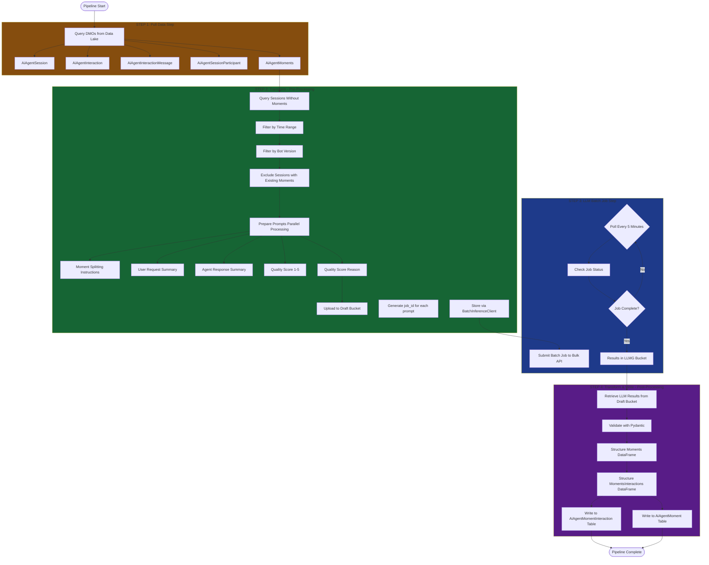
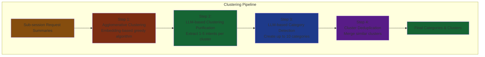

# Agentforce Observability - Pipeline Implementation

**Document Type:** Technical Implementation Guide  
**Last Updated:** November 13, 2025  
**Version:** Technical Reference

---

## Table of Contents

1. [MomentGeneration Pipeline Overview](#momentgeneration-pipeline-overview)
2. [Phase 1: Standard Processing Flow](#phase-1-standard-processing-flow)
3. [Phase 2: Retry Mechanism](#phase-2-retry-mechanism)
4. [Pipeline Steps Deep Dive](#pipeline-steps-deep-dive)
5. [Error Handling & Retry Strategy](#error-handling--retry-strategy)
6. [Performance & SLA](#performance--sla)
7. [Clustering Pipeline - Aggregation](#clustering-pipeline---aggregation)
8. [LLM Prompt Engineering](#llm-prompt-engineering)
9. [Code Examples & APIs](#code-examples--apis)
10. [DC1 Compatibility](#dc1-compatibility)

---

## MomentGeneration Pipeline Overview

### What is a Moment?

A **Moment** represents a single user intent within a conversation. The processing pipeline uses LLM (GPT-4o) to break sessions into meaningful moments.

**Example**:
```
┌─────────────────────────────────────────────────────────┐
│                Full Conversation                         │
├─────────────────────────────────────────────────────────┤
│  USER: Sub 8 digit pin code                            │
│  AGENT: I don't have capability to submit 8-digit...   │
│                                                          │
│  USER: Where is the 8 digit pin code on Sub?          │
│  AGENT: You can find the 8-digit PIN for your Sub...  │
│                                                          │
│  USER: Customer lost remote control volume control...  │
│  AGENT: When a customer creates a group, the remote... │
│                                                          │
│  USER: Line out level s1                               │
│  AGENT: To adjust the line-out level s1...            │
└─────────────────────────────────────────────────────────┘
```

**After Processing** → 3 Distinct Moments:

**Moment A**: PIN code inquiry
- Quality Score: 3
- Reason: Agent eventually answered but didn't understand at first

**Moment B**: Remote control issue
- Quality Score: 5
- Reason: Agent understood and provided clear explanation

**Moment C**: Line out level adjustment
- Quality Score: 5
- Reason: Agent provided clear instructions to resolve it

### Pipeline Architecture

**Trigger**: Every 3 hours  
**Execution Environment**: Hawking (Off-Core)  
**LLM Model**: GPT-4o  
**Storage**: Data Cloud DLOs

---

## Phase 1: Standard Processing Flow

### Color Coding Legend

- 🟨 **Data Input/Extraction** - `#854d0e` (amber-900)
- 🟩 **Data Transformation** - `#166534` (green-800)
- 🟦 **LLM Processing** - `#1e3a8a` (blue-900)
- 🟪 **Post-Processing** - `#581c87` (purple-900)
- 🟥 **Error Handling** - `#991b1b` (red-900)
- ⬜ **Decision Points** - `#374151` (gray-700)

### Phase 1 Flow Diagram

**Pipeline Trigger**: Every 3 hours  
**Max Runtime**: 30 hours  
**Retry Mechanism**: None (deferred to next run)



### Step-by-Step Breakdown

| Step | Phase | Description | Timeout |
|------|-------|-------------|---------|
| 1 | Pull Data | Fetch DMOs: AiAgentSession, AiAgentInteraction, AiAgentInteractionMessage, AiAgentSessionParticipant, AiAgentMoments | 30 min |
| 2 | Transform (Pre) | Query sessions without moments; filter by time range, bot version; generate prompts in parallel | 2 hours |
| 3 | LLM Batch | Submit prompts to Bulk API; poll every 5 min for completion | 25 hours |
| 4 | Post-Processing | Retrieve results, validate, structure DataFrames, write to output tables | 2 hours |

**Total Max Runtime**: 30 hours (includes 30-min buffer)

---

## Phase 2: Retry Mechanism

### Phase 2 Flow Diagram

**Pipeline Trigger**: Every 3 hours  
**Max Runtime**: 60 hours  
**Retry Mechanism**: Async (>1000 failures) or Sync (≤1000 failures)

```mermaid
graph TD
    START([Pipeline Start]) --> PHASE1[Execute Phase 1 Steps 1-4]
    
    PHASE1 --> CHECK{STEP 5:<br/>Failed Sessions<br/>> 1000?}
    
    CHECK -->|Yes| ASYNC[STEP 6a: ASYNC RETRY]
    CHECK -->|No| SYNC[STEP 6b: SYNC RETRY]
    
    subgraph AsyncRetry["Asynchronous Retry Path"]
        ASYNC --> A1[Pre-Processing for Retry]
        A1 --> A2[Include Original Error in Prompt]
        A2 --> A3[Upload Retry Prompts to Draft Bucket]
        A3 --> A4[Submit to Bulk API]
        A4 --> A5{Poll Every 5 Min}
        A5 --> A6[Check Status]
        A6 --> A7{Complete?}
        A7 -->|No| A5
        A7 -->|Yes| A8[Retrieve & Validate Results]
        A8 --> A9[Structure DataFrames]
        A9 --> A10[Write to Tables]
    end
    
    subgraph SyncRetry["Synchronous Retry Path"]
        SYNC --> S1[Prepare Retry Prompts]
        S1 --> S2[Include Original Error Context]
        S2 --> S3{For Each Failed Session}
        S3 --> S4[Synchronous LLM Call]
        S4 --> S5{Valid Result?}
        S5 -->|No & Retries < 3| S4
        S5 -->|Yes| S6[Add to Success DataFrame]
        S6 --> S7{More Sessions?}
        S7 -->|Yes| S3
        S7 -->|No| S8[Structure All Results]
        S8 --> S9[Write to Tables]
    end
    
    A10 --> ENDP2([Pipeline Complete])
    S9 --> ENDP2
    
    style CHECK fill:#374151
    style AsyncRetry fill:#991b1b
    style SyncRetry fill:#991b1b
```



### Enhanced Step-by-Step Breakdown

| Step | Phase | Description | Timeout |
|------|-------|-------------|---------|
| 1-4 | Phase 1 | Execute standard pipeline flow | 30 hours |
| 5 | Decision | Check if failed sessions > 1000 | Instant |
| 6a | Async Retry | Pre-process → Bulk API → Post-process (max 1 retry) | 28 hours |
| 6b | Sync Retry | Synchronous LLM calls with up to 3 retries per session | 3 hours |

**Total Max Runtime**: 60 hours (Phase 1 + Retry + 1.5 hour buffer)

---

## Pipeline Steps Deep Dive

### Step 1: Pull Data Step

**Purpose**: Fetch all necessary DMOs from the Data Lake for processing.

**Timeout**: 30 minutes (typical: 6 minutes)

**DMOs Retrieved**:
- `AiAgentSession` - Session-level metadata
- `AiAgentInteraction` - Individual interactions within sessions
- `AiAgentInteractionMessage` - Messages exchanged (user/agent)
- `AiAgentSessionParticipant` - Participant information (user, agent, bot version)
- `AiAgentMoments` - Existing moments (to avoid duplication)

**DC1 Compatibility**:
```python
# Namespace prefix handling
dc_prefix = pipeline_context.dc_namespace_prefix  # e.g., "ssot" for default
table_name = f"{dc_prefix}__AiAgentSession__dlm"

# Query with NO_SNAPSHOT option
df = spark.read.table(table_name, snapshot_option="NO_SNAPSHOT")
```

**Output**: Spark DataFrames (lazily evaluated, not loaded into memory)

---

### Step 2: Transform Step - Pre-Processing

**Purpose**: Prepare data for LLM processing by querying relevant sessions and generating prompts.

**Timeout**: 2 hours

#### Sub-Step 2.1: Query Sessions

**SQL Query Structure**:

```sql
SELECT 
    interaction_fields,
    message_fields,
    participant_fields
FROM AiAgentInteraction
JOIN AiAgentSession ON session_id match
JOIN AiAgentInteractionMessage ON interaction_id match
JOIN AiAgentSessionParticipant ON participant_id match
WHERE 
    -- Time range filter
    session.end_timestamp BETWEEN start_date AND end_date
    -- Bot version filter
    AND participant.agent_version = bot_name
    -- Exclude sessions with existing moments
    AND NOT EXISTS (
        SELECT * FROM AiAgentMoments 
        WHERE session_id = session.id
    )
ORDER BY interaction.start_timestamp ASC
```

**Resulting DataFrame Structure**:

| Field | Source | Notes |
|-------|--------|-------|
| Id | AiAgentInteraction | Interaction unique identifier |
| AiAgentSessionId | AiAgentInteraction | Session foreign key |
| StartTimestamp | AiAgentInteraction | |
| EndTimestamp | AiAgentInteraction | |
| OrgId | AiAgentInteraction | |
| TopicApiName | AiAgentInteraction | |
| UserMessage | AiAgentInteractionMessage | WHERE participantRole = "USER" |
| AgentMessage | AiAgentInteractionMessage | WHERE participantRole = "AGENT" |
| AgentVersionApiName | AiAgentInteractionParticipant | WHERE participantRole = "AGENT" |
| UserId | AiAgentInteractionParticipant | WHERE participantRole = "USER" |

#### Sub-Step 2.2: Prepare Prompts

**Parallelization Strategy**: Each session is independent → leverage Spark executors for parallel processing.

**Prompt Requirements**: Generate 5 outputs per session:

1. **Moment Splitting**
   - Divide session into distinct moments
   - Return interaction indices for each moment
   - Example: `[0, 1, 2], [3, 4], [5, 6, 7, 8]`

2. **User Request Summary**
   - Concise summary of user's intent per moment
   - Example: "User wants to reset password"

3. **Agent Response Summary**
   - Concise summary of agent's response per moment
   - Example: "Agent provided password reset link and instructions"

4. **Quality Score**
   - Integer between 1-5
   - 1 = Did not address request at all
   - 5 = Fully resolved the request

5. **Quality Score Reason**
   - Single sentence explaining the score
   - Example: "Agent provided direct solution with clear steps"

**Prompt AVRO Schema**:
```json
{
  "type": "record",
  "name": "MomentGenerationPrompt",
  "fields": [
    {"name": "job_id", "type": "string"},
    {"name": "session_id", "type": "string"},
    {"name": "prompt_text", "type": "string"},
    {"name": "parameters", "type": "map", "values": "string"}
  ]
}
```

#### Sub-Step 2.3: Upload to Draft Bucket

**API Client**: `BatchInferenceClient.process_job_outputs()`

```python
# Example usage
job_id_df = batch_inference_client.process_job_outputs(
    prompts_dataframe=prompts_df,
    operation="upload"
)
```

**Output**:
1. **job_id DataFrame**: Maps each prompt to a unique job identifier
2. **Sessions Metadata DataFrame**: Stored for post-processing join

---

### Step 3: LLM Batch Job Step

**Purpose**: Submit prompts to Bulk API and wait for LLM processing completion.

**Timeout**: 25 hours (24-hour SLA + 1-hour buffer)

**Process Flow**:

1. **Submit Batch Job**
```python
batch_job_response = bulk_api.submit_job(job_id_df)
```

2. **Polling Loop** (every 5 minutes)
```python
while not job_complete:
    time.sleep(300)  # 5 minutes
    status = bulk_api.check_status(batch_job_id)
    if status == "COMPLETED":
        job_complete = True
```

3. **Results Storage**
   - LLM processes all prompts asynchronously
   - Results stored in LLMG bucket
   - Bulk API returns completion confirmation

**Output**: job_id → status mapping DataFrame

---

### Step 4: Transform & Write Step - Post-Processing

**Purpose**: Retrieve LLM results, validate, structure, and write to target tables.

**Timeout**: 2 hours

#### Sub-Step 4.1: Retrieve LLM Results

**API Client**: `BatchInferenceClient.process_job_outputs()`

```python
# Example usage
results_df = batch_inference_client.process_job_outputs(
    job_ids=job_id_df,
    operation="retrieve"
)
```

**Results AVRO Schema**:
```json
{
  "type": "record",
  "name": "LLMGenerationResult",
  "fields": [
    {"name": "job_id", "type": "string"},
    {"name": "status", "type": "string"},
    {"name": "output", "type": "string"},
    {"name": "error_message", "type": ["null", "string"]}
  ]
}
```

#### Sub-Step 4.2: Validate Results

**Validation Framework**: Pydantic

```python
class MomentResult(BaseModel):
    moment_splits: List[List[int]]
    user_summaries: List[str]
    agent_summaries: List[str]
    quality_scores: List[int] = Field(ge=1, le=5)
    quality_reasons: List[str]

# Validate each result
valid_results = []
failed_sessions = []

for result in results_df:
    try:
        validated = MomentResult.parse_raw(result.output)
        valid_results.append(validated)
    except ValidationError as e:
        failed_sessions.append({
            "session_id": result.session_id,
            "error": str(e)
        })
```

**Failure Scenarios**:
- Malformed JSON response
- Invalid interaction indices (non-existent)
- Incomplete responses (cut off mid-sentence)
- Schema mismatches

#### Sub-Step 4.3: Structure DataFrames

**Join Operation**: Merge validated LLM results with session metadata from Step 2.

**AiAgentMoment DataFrame**:

| Field | Source | Description |
|-------|--------|-------------|
| Id | Generated | UUID for moment |
| SessionId | Session metadata | Foreign key to AiAgentSession |
| UserSummary | LLM output | User request summary |
| AgentSummary | LLM output | Agent response summary |
| QualityScore | LLM output | Score 1-5 |
| QualityReason | LLM output | Explanation of score |
| OrgId | Session metadata | Organization identifier |
| BotVersionId | Session metadata | Bot version used |
| CreatedDate | Generated | Timestamp of moment creation |

**AiAgentMomentInteraction DataFrame**:

| Field | Source | Description |
|-------|--------|-------------|
| Id | Generated | UUID for association |
| MomentId | AiAgentMoment | Foreign key to moment |
| InteractionId | LLM output (indices) | Foreign key to interaction |
| SequenceNumber | LLM output (index order) | Order within moment |

#### Sub-Step 4.4: Write to Tables

**Parallel Write Operation**:

```python
# Write both tables simultaneously
from concurrent.futures import ThreadPoolExecutor

with ThreadPoolExecutor(max_workers=2) as executor:
    future_moments = executor.submit(
        moments_df.write.mode("append").saveAsTable,
        "AiAgentMoment__dlm"
    )
    future_interactions = executor.submit(
        moments_interactions_df.write.mode("append").saveAsTable,
        "AiAgentMomentInteraction__dlm"
    )
    
    future_moments.result()
    future_interactions.result()
```

**Output**: Data written to DLO tables + failed sessions metadata (for Phase 2)

---

### Step 5: Check Failed Sessions (Phase 2 Only)

**Purpose**: Determine retry strategy based on failure volume.

**Decision Logic**:

```python
failed_session_count = len(failed_sessions_df)

if failed_session_count > 1000:
    retry_strategy = "ASYNC"  # Use Bulk API
else:
    retry_strategy = "SYNC"   # Use synchronous calls
```

**Threshold Rationale**:
- Average LLM call time: 1.7 seconds per session
- 1000 sessions × 1.7s × 2 retries avg = ~57 minutes
- 90% of failures resolve within 2 retries
- Async retry adds 24-hour SLA overhead → only use when necessary

---

### Step 6a: Asynchronous Retry (Phase 2)

**Condition**: Failed sessions > 1000

**Timeout**: 28 hours (25 hours LLM + 3 hours processing)

**Retry Limit**: 1 attempt (no further retries even if >1000 still fail)

#### Retry Prompt Enhancement

**Original Prompt Issue**: LLM returned malformed JSON or invalid indices.

**Enhanced Retry Prompt**:

```python
retry_prompt = f"""
{original_prompt}

IMPORTANT: The previous attempt failed with the following error:
{error_message}

Please ensure your response:
1. Is valid JSON format
2. Contains only interaction indices that exist in the session
3. Is complete and not cut off mid-sentence
4. Strictly follows the schema provided
"""
```

**Process Flow**: Same as Steps 2-4, but with enhanced prompts and separate job_ids.

---

### Step 6b: Synchronous Retry (Phase 2)

**Condition**: Failed sessions ≤ 1000

**Timeout**: 3 hours (avg: 1 hour)

**Retry Limit**: Up to 3 attempts per session

#### Retry Loop Logic

```python
for session in failed_sessions:
    retry_count = 0
    success = False
    
    while retry_count < 3 and not success:
        # Prepare retry prompt with error context
        retry_prompt = create_retry_prompt(
            session, 
            previous_errors=session.error_history
        )
        
        # Synchronous LLM call (no Bulk API)
        result = llm_service.generate_sync(retry_prompt)
        
        # Validate immediately
        try:
            validated = MomentResult.parse_raw(result)
            success_df.append(validated)
            success = True
        except ValidationError as e:
            retry_count += 1
            session.error_history.append(str(e))
    
    if not success:
        permanently_failed.append(session)

# Write all successful retries
success_df.write.mode("append").saveAsTable("AiAgentMoment__dlm")
```

**Why Synchronous?**:
- Faster feedback loop (seconds vs. 24 hours)
- Can immediately retry on failure
- Cost-effective for small volumes
- Completes within single pipeline run

---

## Error Handling & Retry Strategy

### Failure Scenarios

#### 1. LLM Response Failures

| Failure Type | Description | Example | Retry Strategy |
|--------------|-------------|---------|----------------|
| Malformed JSON | Invalid JSON syntax | `{"moments": [1, 2,` (truncated) | Phase 2 retry with error context |
| Invalid Indices | References non-existent interactions | `[0, 1, 99]` when only 10 interactions exist | Enhanced prompt: "Interaction count = 10" |
| Incomplete Response | Response cut off mid-generation | `"summary": "The agent help` | Retry with max_tokens increase |
| Schema Mismatch | Missing required fields | No `quality_score` field in output | Pydantic validation + retry with stricter prompt |

#### 2. System Failures

| Failure Type | Description | Recovery |
|--------------|-------------|----------|
| Bulk API Timeout | No response after 24 hours | Automatic retry on next pipeline run |
| Spark Executor Failure | Out of memory / executor crash | Task-level retry (Spark's built-in mechanism) |
| Data Lake Unavailable | DMO tables inaccessible | Pipeline fails; retry on next scheduled run |
| Write Failures | Unable to write to DLO tables | Transaction rollback; retry entire post-processing |

### Retry Decision Tree

```mermaid
graph TD
    START([Failed Session Detected]) --> CHECK{Session Count?}
    
    CHECK -->|> 1000 sessions| ASYNC[Asynchronous Retry]
    CHECK -->|≤ 1000 sessions| SYNC[Synchronous Retry]
    
    ASYNC --> ASYNC1[Single Bulk API Retry]
    ASYNC1 --> ASYNC2{Success?}
    ASYNC2 -->|Yes| WRITE[Write to Tables]
    ASYNC2 -->|No| DEFER[Defer to Next Pipeline Run]
    
    SYNC --> SYNC1[Retry Loop<br/>Max 3 Attempts]
    SYNC1 --> SYNC2{Attempt Count?}
    SYNC2 -->|< 3| SYNC3[LLM Call with Error Context]
    SYNC3 --> SYNC4{Valid Result?}
    SYNC4 -->|Yes| WRITE
    SYNC4 -->|No| SYNC2
    SYNC2 -->|= 3| DEFER
    
    WRITE --> END([Pipeline Complete])
    DEFER --> END
    
    style CHECK fill:#374151
    style ASYNC fill:#991b1b
    style SYNC fill:#1e3a8a
    style DEFER fill:#854d0e
```



### Error Context Enhancement

**Phase 1 (No Retry)**:
```python
# Original prompt only
prompt = f"""
Analyze this session and extract moments:
{session_data}

Return JSON with: moment_splits, user_summaries, agent_summaries, 
quality_scores, quality_reasons
"""
```

**Phase 2 (With Retry)**:
```python
# Enhanced prompt includes failure reason
retry_prompt = f"""
{original_prompt}

PREVIOUS ATTEMPT FAILED:
Error: {error_message}

CORRECTION INSTRUCTIONS:
- Ensure all interaction indices are within range [0, {max_interaction_index}]
- Verify JSON is properly closed (check all brackets and braces)
- Complete all fields before response length limit
- Validate against schema: {schema}
"""
```

---

## Performance & SLA

### Pipeline Execution Timings

#### Phase 1: One Generation Round

| Step | Component | Typical Duration | Timeout | Notes |
|------|-----------|------------------|---------|-------|
| 1 | Pull Data Step | 6 minutes | 30 min | Fetches 5 DMO tables |
| 2 | Pre-Processing | 45 minutes | 2 hours | Depends on session volume |
| 3 | LLM Batch Job | 8-12 hours | 25 hours | Bulk API SLA: 24 hours |
| 4 | Post-Processing | 30 minutes | 2 hours | Validation + writes |
| - | Buffer | - | 30 min | Overhead for step transitions |
| **Total** | **Phase 1** | **~10 hours** | **30 hours** | Worst-case scenario |

#### Phase 2: With Retry Mechanism

| Step | Component | Typical Duration | Timeout | Notes |
|------|-----------|------------------|---------|-------|
| 1-4 | Phase 1 Steps | ~10 hours | 30 hours | Standard flow |
| 5 | Decision Point | < 1 minute | - | Count failed sessions |
| 6a | Async Retry | 8-12 hours | 28 hours | If failures > 1000 |
| 6b | Sync Retry | 1 hour | 3 hours | If failures ≤ 1000 (avg 1.7s/session × 2 retries) |
| - | Buffer | - | 1.5 hours | Additional overhead |
| **Total** | **Phase 2** | **~12-22 hours** | **60 hours** | Worst-case with async retry |

### Triggering Strategy

**Schedule**: Every 3 hours

**Logic**:
```python
current_time = datetime.now()
last_run = get_last_pipeline_run()

if last_run.status == "IN_PROGRESS":
    # Wait for completion
    if current_time - last_run.start_time > timedelta(hours=30):  # Phase 1
        last_run.mark_as_failed()
        trigger_new_run()
    elif current_time - last_run.start_time > timedelta(hours=60):  # Phase 2
        last_run.mark_as_failed()
        trigger_new_run()
    else:
        wait(3 hours)
else:
    trigger_new_run()
```

**Benefits**:
- Prevents backlog accumulation
- Leverages fast Bulk API responses (often < 12 hours)
- No overlapping runs (avoids duplicate processing)

### Run Status Criteria

**Success Definition**:
```python
run_status = (
    (no_new_sessions_to_analyze OR at_least_30_percent_have_moments)
    AND no_system_level_failures
)

# Examples:
# ✅ 100 sessions queried, 50 moments generated, 0 system errors → SUCCESS
# ✅ 0 sessions queried (all already processed) → SUCCESS
# ❌ 100 sessions queried, 20 moments generated, 0 system errors → FAILURE (< 30%)
# ❌ 100 sessions queried, 80 moments generated, Spark crash → FAILURE (system error)
```

**Rationale**:
- 30% threshold allows for acceptable transient LLM failures
- System-level failures require investigation regardless of moment count
- Zero new sessions = no work to do = success

### Session Processing Statistics

| Metric | Value | Notes |
|--------|-------|-------|
| Avg session query time | 45 minutes | For 10,000 sessions |
| Avg prompt generation time | 1.2 seconds per session | Parallelized across Spark executors |
| Avg LLM response time | 1.7 seconds per prompt | Synchronous calls only |
| Bulk API typical completion | 8-12 hours | Despite 24-hour SLA |
| Validation time | 0.3 seconds per result | Pydantic overhead |
| Write time to DLOs | 15 minutes | For 10,000 moments |

### Retry Success Rates

| Attempt | Success Rate | Cumulative Success |
|---------|--------------|-------------------|
| Initial (no retry) | 85% | 85% |
| Retry 1 | 12% | 97% |
| Retry 2 | 2.5% | 99.5% |
| Retry 3 | 0.3% | 99.8% |
| Permanent failures | 0.2% | - |

**Insight**: 90% of failures resolve within 2 retries, justifying max 3 retry limit.

### Cost Analysis

| Operation | Cost per 1000 Sessions | Notes |
|-----------|------------------------|-------|
| Spark compute | $12 | Depends on cluster size |
| LLM API calls (initial) | $85 | Bulk API pricing |
| LLM API calls (retry) | $12 | Only failed sessions (~15%) |
| Storage (draft bucket) | $0.50 | Temporary prompt storage |
| Storage (DLO writes) | $1.20 | Permanent moment storage |
| **Total per 1000 sessions** | **$110.70** | Phase 1 only |

**Phase 2 Cost Impact**: Adds ~$12 retry cost for 15% failure rate.

---

## Clustering Pipeline - Aggregation

### Purpose

Cluster sub-sessions (moments) into meaningful categories to identify recurring user intents across all conversations.

### Visual Overview



### Step 1: Agglomerative Clustering

**Input**: Sub-session request summaries (text)

**Algorithm**: Embedding-based greedy clustering

**Process**:
1. Generate embeddings for all sub-session summaries
2. Calculate similarity between all pairs
3. Greedily merge most similar clusters
4. Continue until stopping criteria met

**Output**: Initial clusters of similar user requests

---

### Step 2: LLM-based Clustering Purification

**Input**: Initial clusters from Step 1

**Algorithm**: LLM prompt to extract intents

**Purify Prompt** (Partial):
```
You are an expert Data Analyst working on clustering and classifying user 
requests made to automatic chat system.

Clustering has just been performed on the user requests, but the result 
isn't perfect.

Your mission now is to identify the various intents in each cluster.

You must strictly follow the instructions in PROMPT_INSTRUCTIONS, 
FORMATTING_INSTRUCTIONS below.

PROMPT_INSTRUCTIONS:
- Iterate through the clusters one by one and analyze each cluster separately
- Return 1-5 intents, each containing up to 5 words.
- The intents should be slightly generalized, excluding specifics of people 
  and customer names.
- First output the intent of the first request in the cluster, with the 
  request ids that express the same intent
- Then ignore requests that have already been mapped to an intent, and 
  continue with the intent of the next request.
- Don't output intents that are too similar, and stop when there are no 
  more intents in the cluster.
- Remain strict to the content of each cluster and do not generate any 
  content that you don't have any data or basis on.

FORMATTING_INSTRUCTIONS:
You should output a JSON object in the format 
{CLUSTER_ID: {INTENT: REQUEST_ID_LIST}}. 
Note the cluster and request ids are all strings.

Make sure to output the JSON in this exact format or it will fail to process.
```

**Output**: Purified clusters with explicit intent names

**Example**:
```json
{
  "cluster_42": {
    "Password Reset": ["req_1", "req_5", "req_12"],
    "Account Lockout": ["req_3", "req_8"]
  }
}
```

---

### Step 3: LLM-based Category Detection & Classification

**Input**: Cluster names from Step 2

**Algorithm**: LLM prompt to create high-level categories

**Category Creation Prompt** (Partial):
```
You are a data analyst. Your mission is to look at a large number of 
sentences describing user requests to an AI agent and create main 
categories of requests. Each category represents a main group of requests.

For your mission you will get up to 1000 requests in order to create 
the categories. You must follow the next rules in your mission:

1. Create up to 10 categories. You can create less but no more!
2. Create a description of 3-4 sentences for each category.
3. Give 5-6 main examples of user requests for each category.
4. If the request is not in English, translate it first.
5. Do not repeat the same example in two different categories.

You should output a JSON list in the format 
[{"name": str, "description": str, "examples": list}]

Make sure to output the JSON in this exact format or it will fail to process.
```

**Output**: Up to 10 high-level categories with descriptions and examples

**Example Categories**:
1. **Technical Issues** - Problems with product functionality
2. **Account Management** - Password, login, profile updates
3. **Billing Questions** - Payment, invoices, charges

**Category Assignment Prompt** (Partial):
```
Your mission is to classify user inputs to a chat system based on GPT 
to one of the categories I will provide to you.

Each user input has a number as ID. The inputs are separated by newlines.

Input structure:
1: input
2: input
3: input

The output must be in JSON format and this format only and nothing else. 
The key is the input ID, the value is the category this input gets.
Return only the category name and not the category number!

Output example:
{
 "1": category_name,
 "2": category_name,
 "3": category_name
}


{{loop.index}}. {{category_definition.name}}
 Description: {{category_definition.description}}
 Examples: {{category_definition.examples}}


Make sure to classify similar inputs in the same class.
```

**Output**: Each cluster assigned to one category

---

### Step 4: Cluster Deduplication

**Input**: Categories and cluster assignments from Step 3

**Algorithm**: LLM identifies and merges similar clusters within same category

**Process**:
1. For each category, examine all clusters
2. Identify clusters with very similar intent names
3. Merge duplicate clusters
4. Update cluster assignments

**Output**: Final deduplicated categories and clusters

**Example Hierarchical Structure**:
```
Category 1: Technical Issues (100% coverage)
├── Cluster: Password Reset
│   ├── "Why can't I sign in?"
│   ├── "My password doesn't work"
│   └── "Problem logging in!"
├── Cluster: Cart Addition Errors
│   ├── "Adding an item got an error"
│   └── "Cart Addition Errors"

Category 2: Billing Questions (100% coverage)
├── Cluster: Invoice Questions
├── Cluster: Payment Issues

Category 3: Product Information (80% coverage)
├── Cluster: Feature Requests
├── Cluster: Specifications
```

---

## LLM Prompt Engineering

### Moment Generation Prompt Template

```python
MOMENT_GENERATION_PROMPT = """
You are an expert conversation analyst. Analyze the following customer-agent session 
and extract distinct "moments" - each representing a single user intent or request.

SESSION DATA:
Session ID: {session_id}
Total Interactions: {interaction_count}

INTERACTIONS:
{formatted_interactions}

YOUR TASK:
1. MOMENT SPLITTING: Divide the session into distinct moments. For each moment, 
   return the indices of interactions (0-indexed) that belong to it.
   
   Example: If interactions 0-2 are about password reset, and 3-5 are about 
   billing questions, return: [[0, 1, 2], [3, 4, 5]]

2. USER REQUEST SUMMARY: For each moment, provide a concise 1-2 sentence summary 
   of what the user is requesting.

3. AGENT RESPONSE SUMMARY: For each moment, provide a concise 1-2 sentence summary 
   of how the agent responded.

4. QUALITY SCORE: Rate the agent's response on a scale of 1-5:
   - 1: Did not address the user's request at all
   - 2: Partially addressed but missed key points
   - 3: Addressed the request but with gaps
   - 4: Addressed the request well
   - 5: Fully resolved the user's request

5. QUALITY SCORE REASON: Explain in one sentence why you gave this score.

CRITICAL REQUIREMENTS:
- Return ONLY valid JSON (no additional text)
- Ensure all interaction indices are within range [0, {max_index}]
- Complete all fields before reaching response length limit
- Follow this exact schema:

{{
  "moment_splits": [[int, int, ...], [int, ...], ...],
  "user_summaries": ["string", "string", ...],
  "agent_summaries": ["string", "string", ...],
  "quality_scores": [int, int, ...],
  "quality_reasons": ["string", "string", ...]
}}

All arrays must have the same length (number of moments).
"""
```

**Formatted Interactions Example**:
```
[0] USER (14:30:00): I can't log into my account
[0] AGENT (14:30:15): I can help you reset your password. Please click this link...
[1] USER (14:31:00): The link isn't working
[1] AGENT (14:31:20): Let me send you a verification code instead...
[2] USER (14:32:00): Got it, thanks!
[2] AGENT (14:32:10): You're welcome! Is there anything else I can help with?
```

### LLM Output for Each Moment

For each moment identified, the LLM generates:

| Field | Description | Example |
|-------|-------------|---------|
| **turn_ind_in_session** | Interaction indices | `[0, 1, 2]` |
| **request_summary** | User's intent | "User is trying to locate the 8 digit pin code on Sub" |
| **response_summary** | Agent's response | "The agent offered instructions on how to find the 8-digit PIN" |
| **quality_score** | Rating 1-5 | `3` |
| **score_reason** | Explanation | "The agent eventually answered the request, but didn't understand it at first" |

---

## Code Examples & APIs

### BatchInferenceClient Code Examples

#### Upload Prompts

```python
from batch_inference_client import BatchInferenceClient

# Initialize client
client = BatchInferenceClient(
    api_endpoint="https://llm-api.salesforce.com",
    credentials=get_service_account_token()
)

# Prepare prompts DataFrame (Spark)
prompts_df = spark.createDataFrame([
    ("prompt_001", session_1_prompt, {"temperature": 0.7}),
    ("prompt_002", session_2_prompt, {"temperature": 0.7}),
    # ... more prompts
], schema=["request_id", "prompt_text", "parameters"])

# Upload to draft bucket
job_mapping_df = client.process_job_outputs(
    dataframe=prompts_df,
    operation="upload",
    bucket="draft",
    format="avro"
)

# Result: DataFrame with request_id → job_id mapping
job_mapping_df.show()
# +------------+------------------+
# | request_id |           job_id |
# +------------+------------------+
# | prompt_001 | job_abc123...    |
# | prompt_002 | job_def456...    |
# +------------+------------------+
```

#### Retrieve Results

```python
# After LLM processing completes
results_df = client.process_job_outputs(
    job_ids=job_mapping_df.select("job_id"),
    operation="retrieve",
    bucket="llmg",
    format="avro"
)

# Result: DataFrame with job_id, status, output, error_message
results_df.show(truncate=False)
# +-------------+----------+------------------------------------------+-------------+
# | job_id      | status   | output                                   | error_msg   |
# +-------------+----------+------------------------------------------+-------------+
# | job_abc123  | SUCCESS  | {"moment_splits": [[0,1],[2]], ...}      | null        |
# | job_def456  | FAILED   | null                                     | Invalid JSON|
# +-------------+----------+------------------------------------------+-------------+
```

### Pydantic Validation Models

```python
from pydantic import BaseModel, Field, validator
from typing import List

class MomentResult(BaseModel):
    """Validation model for LLM-generated moment results"""
    
    moment_splits: List[List[int]] = Field(
        ..., 
        description="List of interaction index arrays, one per moment"
    )
    user_summaries: List[str] = Field(
        ...,
        description="User request summaries, one per moment"
    )
    agent_summaries: List[str] = Field(
        ...,
        description="Agent response summaries, one per moment"
    )
    quality_scores: List[int] = Field(
        ...,
        description="Quality scores 1-5, one per moment"
    )
    quality_reasons: List[str] = Field(
        ...,
        description="Quality score explanations, one per moment"
    )
    
    @validator('quality_scores')
    def validate_scores(cls, scores):
        """Ensure all scores are between 1 and 5"""
        for score in scores:
            if not 1 <= score <= 5:
                raise ValueError(f"Quality score {score} not in range [1, 5]")
        return scores
    
    @validator('moment_splits', 'user_summaries', 'agent_summaries', 
               'quality_scores', 'quality_reasons')
    def validate_equal_length(cls, v, values):
        """Ensure all arrays have the same length"""
        if 'moment_splits' in values:
            expected_length = len(values['moment_splits'])
            if len(v) != expected_length:
                raise ValueError(
                    f"Array length {len(v)} does not match "
                    f"moment_splits length {expected_length}"
                )
        return v
    
    @validator('moment_splits')
    def validate_indices(cls, splits, values):
        """Ensure interaction indices are valid"""
        # Note: max_index should be passed via context
        max_index = values.get('_max_interaction_index', 1000)
        for moment_indices in splits:
            for idx in moment_indices:
                if idx < 0 or idx > max_index:
                    raise ValueError(
                        f"Interaction index {idx} out of range [0, {max_index}]"
                    )
        return splits

# Usage example
def validate_llm_result(result_json: str, max_interaction_index: int):
    try:
        # Inject max index for validation
        result_dict = json.loads(result_json)
        result_dict['_max_interaction_index'] = max_interaction_index
        
        validated = MomentResult(**result_dict)
        return validated, None
    except Exception as e:
        return None, str(e)
```

### Complete SQL Query

```sql
SELECT
    `ssot__AiAgentInteraction__dlm`.`ssot__Id__c` AS INTERACTION_ID,
    `ssot__AiAgentInteraction__dlm`.`ssot__AiAgentSessionId__c` AS SESSION_ID,
    `ssot__AiAgentInteraction__dlm`.`ssot__StartTimestamp__c` AS START_TIMESTAMP,
    `ssot__AiAgentInteraction__dlm`.`ssot__EndTimestamp__c` AS END_TIMESTAMP,
    `ssot__AiAgentInteraction__dlm`.`ssot__InternalOrganizationId__c` AS ORG_ID,
    `ssot__AiAgentInteraction__dlm`.`ssot__TopicApiName__c` AS TOPIC_API_NAME,
    `ssot__AiAgentInteractionMessage__dlm`.`ssot__ContentText__c` AS CONTENT_TEXT,
    `ssot__AiAgentSessionParticipant__dlm`.`ssot__AgentVersionApiName__c` AS AGENT_VERSION_API_NAME,
    `ssot__AiAgentSessionParticipant__dlm`.`ssot__AiAgentSessionParticipantRole__c` AS PARTICIPANT_ROLE,
    `ssot__AiAgentSessionParticipant__dlm`.`ssot__Id__c` AS PARTICIPANT_ID
FROM
    `ssot__AiAgentInteraction__dlm`
JOIN
    `ssot__AiAgentSession__dlm`
    ON `ssot__AiAgentInteraction__dlm`.`ssot__AiAgentSessionId__c` = 
       `ssot__AiAgentSession__dlm`.`ssot__Id__c`
JOIN
    `ssot__AiAgentInteractionMessage__dlm`
    ON `ssot__AiAgentInteraction__dlm`.`ssot__Id__c` = 
       `ssot__AiAgentInteractionMessage__dlm`.`ssot__AiAgentInteractionId__c`
JOIN
    `ssot__AiAgentSessionParticipant__dlm`
    ON `ssot__AiAgentInteractionMessage__dlm`.`ssot__AiAgentSessionParticipantId__c` = 
       `ssot__AiAgentSessionParticipant__dlm`.`ssot__Id__c`
WHERE
    (
        -- Case 1: Session has ended within time range
        (`ssot__AiAgentSession__dlm`.`ssot__EndTimestamp__c` IS NOT NULL
         AND `ssot__AiAgentSession__dlm`.`ssot__EndTimestamp__c` >= 
             TIMESTAMP `{pipeline_context.start_date}`
         AND `ssot__AiAgentSession__dlm`.`ssot__EndTimestamp__c` <= 
             TIMESTAMP `{pipeline_context.end_date}`)
        OR
        -- Case 2: Session still active but last interaction > 24 hours ago
        (`ssot__AiAgentSession__dlm`.`ssot__EndTimestamp__c` IS NULL
         AND `ssot__AiAgentInteraction__dlm`.`ssot__EndTimestamp__c` < 
             (CURRENT_TIMESTAMP - INTERVAL '24 HOURS'))
    )
    -- Filter by bot version
    AND `ssot__AiAgentSessionParticipant__dlm`.`ssot__AgentVersionApiName__c` = 
        `{pipeline_context.agent_name}`
    -- Exclude sessions with existing moments
    AND NOT EXISTS (
        SELECT `Id__c`
        FROM `AiAgentMoment__dlm`
        WHERE `AiAgentMoment__dlm`.`SessionId__c` = 
              `ssot__AiAgentSession__dlm`.`ssot__Id__c`
    )
ORDER BY
    `ssot__AiAgentInteraction__dlm`.`ssot__StartTimestamp__c` ASC
```

**Query Explanation**:

1. **JOIN Operations**: Combines all relevant DMOs to get complete session data
2. **Time Range Filter**: Includes sessions ended within range OR active sessions with stale interactions (>24 hours)
3. **Bot Version Filter**: Ensures only specified bot version's data is processed
4. **Exclusion Filter**: Skips sessions that already have moments (prevents duplicates)
5. **ORDER BY**: Ensures chronological processing of interactions within sessions

---

## DC1 Compatibility

### Multi-Dataspace Support

**Challenge**: DC1 allows non-default dataspaces with custom namespace prefixes.

**Solution**: Dynamic table name construction.

### Namespace Prefix Handling

**Default Dataspace**:
```python
dc_prefix = "ssot"
table_name = f"{dc_prefix}__AiAgentSession__dlm"
# Result: "ssot__AiAgentSession__dlm"
```

**Custom Dataspace**:
```python
dc_prefix = "custom_namespace"
table_name = f"{dc_prefix}__AiAgentSession__dlm"
# Result: "custom_namespace__AiAgentSession__dlm"
```

### Field Prefix Application

**For default dataspace only**, prepend prefix to all fields:

```python
if dc_prefix == "ssot":
    query = f"""
    SELECT 
        `{dc_prefix}__AiAgentInteraction__dlm`.`{dc_prefix}__Id__c` AS INTERACTION_ID,
        `{dc_prefix}__AiAgentSession__dlm`.`{dc_prefix}__EndTimestamp__c` AS END_TIMESTAMP
    FROM `{dc_prefix}__AiAgentInteraction__dlm`
    """
else:
    # Custom dataspaces don't require field prefix
    query = f"""
    SELECT 
        `{dc_prefix}__AiAgentInteraction__dlm`.`Id__c` AS INTERACTION_ID,
        `{dc_prefix}__AiAgentSession__dlm`.`EndTimestamp__c` AS END_TIMESTAMP
    FROM `{dc_prefix}__AiAgentInteraction__dlm`
    """
```

### Pipeline Input Extension

**Original Inputs**:
- Time range
- Bot version ID
- Bot name
- Bot type
- Org ID

**DC1-Compatible Inputs**:
- Time range
- Bot version ID
- Bot name
- Bot type
- Org ID
- **DC namespace prefix** ← New parameter

### Implementation in Pull Data Step

```python
def pull_data_step(pipeline_context):
    dc_prefix = pipeline_context.dc_namespace_prefix
    
    tables_to_fetch = [
        "AiAgentSession",
        "AiAgentInteraction",
        "AiAgentInteractionMessage",
        "AiAgentSessionParticipant",
        "AiAgentMoments"
    ]
    
    dataframes = {}
    for table_base_name in tables_to_fetch:
        full_table_name = f"{dc_prefix}__{table_base_name}__dlm"
        dataframes[table_base_name] = spark.read.table(
            full_table_name,
            snapshot_option="NO_SNAPSHOT"
        )
    
    return dataframes
```

---

## References

### Related Documentation

- **Agentforce Observability System Architecture** - Infrastructure and provisioning
- **Agentforce Observability Data Models** - Complete data model reference
- **Agentforce Observability Master** - Navigation hub

### Citations

1. **Agentforce Observability Architecture**  
   https://docs.google.com/document/d/12t6hCmghYaC6_PGov3nzHL4o5B4eGBZD9tBJKpjFfA8/edit?tab=t.0#heading=h.mbsk3j467ntg

2. **Agentforce Technical Specification**  
   https://docs.google.com/document/d/16Z5AthijOIMm7otnjiM33RdCQHj9Zl56vAG1NOQF0W4/edit?tab=t.0#heading=h.4klttszfe2em

3. **Agentforce Implementation Guide**  
   https://salesforce.quip.com/sdLfAFbg8q6W

4. **Agentforce Observability Presentation**  
   https://docs.google.com/presentation/d/10Q70oiDzIbdgXCXvfyF3OGPFR7I1sEKEaqBdUXCejvU/edit

---

**Document Version:** 1.0  
**Last Updated:** November 13, 2025
