# Agentforce Observability - System Architecture

**Document Type:** System Architecture & Infrastructure  
**Last Updated:** November 13, 2025  
**Version:** Technical Reference

---

## Table of Contents

1. [Agent Refinement Cycle](#agent-refinement-cycle)
2. [Four Pillars of Observability](#four-pillars-of-observability)
3. [High-Level System Architecture](#high-level-system-architecture)
4. [Data Ingestion Flow](#data-ingestion-flow)
5. [AIE Backend Architecture](#aie-backend-architecture)
6. [AIE UI Architecture](#aie-ui-architecture)
7. [Provisioning & Licensing](#provisioning--licensing)
8. [DC1 Architecture Support](#dc1-architecture-support)
9. [Hawking App Infrastructure](#hawking-app-infrastructure)
10. [Permissions & Access Control](#permissions--access-control)

---

## Agent Refinement Cycle

### Continuous Agent Improvement Loop

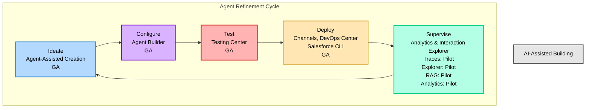

### Phase Breakdown

| Phase | Components | Status | Purpose |
|-------|-----------|--------|---------|
| **Ideate** | Agent-Assisted Creation | GA | Brainstorm and design agent capabilities |
| **Configure** | Agent Builder | GA | Build and configure agent logic, topics, and actions |
| **Test** | Testing Center | GA | Validate agent behavior with test scenarios |
| **Deploy** | Channels, DevOps Center, CLI | GA | Deploy agents to production channels |
| **Supervise** | Analytics & Interaction Explorer | Pilot | Monitor, analyze, and identify improvements |

---

## Four Pillars of Observability

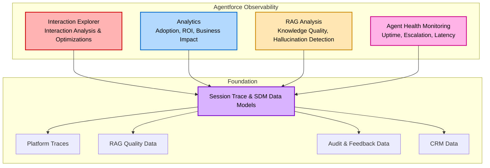

### 1. Interaction Explorer (AIE)

**Purpose**: Analyze individual conversations to identify patterns and optimization opportunities.

**Key Questions Answered**:
- What are unresolved conversations?
- Do I have a knowledge gap?
- Are customers asking things I didn't anticipate?

**Features**:
- Moment-by-moment conversation breakdown
- Quality scoring (1-5) for each interaction
- Tag-based categorization
- User request summaries
- Agent response summaries

---

### 2. Analytics

**Purpose**: Measure agent adoption, usage patterns, and business impact.

**Key Questions Answered**:
- How many users are engaging with agents?
- What is the ROI of our AI agents?
- What is the overall business impact?

**Features**:
- Adoption metrics (unique users, sessions, interactions)
- Performance metrics (latency, quality scores)
- Trend analysis over time
- Business KPI tracking

---

### 3. RAG Analysis

**Purpose**: Evaluate knowledge base quality and identify hallucination risks.

**Key Questions Answered**:
- What is the quality of my agent's responses?
- Is my agent hallucinating?
- Does my agent have knowledge gaps?

**Features**:
- Response quality scoring
- Source citation analysis
- Hallucination detection
- Knowledge gap identification

---

### 4. Agent Health Monitoring

**Purpose**: Real-time monitoring of agent availability and performance.

**Key Questions Answered**:
- Is my agent up and running?
- How frequently does it escalate to humans?
- Is latency under control?

**Features**:
- Error rate tracking
- Escalation rate monitoring
- Latency measurements
- Uptime/availability metrics

---

## High-Level System Architecture

### Complete System Diagram

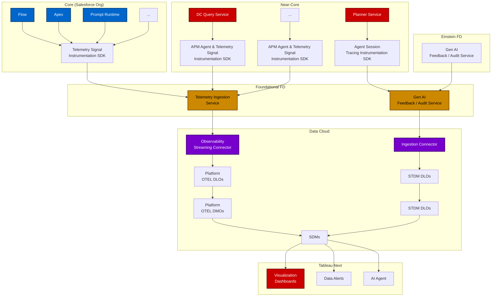

### Architecture Layers

#### 1. Core (Salesforce Org)

**Components**:
- Flow, Apex, Prompt Runtime
- Telemetry Signal Instrumentation SDK

**Purpose**: Emit telemetry for agent interactions

**Telemetry Types**:
- Trace/Span
- Metric
- Log
- Event

---

#### 2. Near-Core

**Components**:
- DC Query Service
- APM Agent & Telemetry SDKs
- Planner Service
- Agent Session Tracing SDK

**Purpose**: Execute agent logic and emit detailed session traces

**Key Services**:
- **Planner Service**: Orchestrates agent execution flow
- **APM Agent**: Application Performance Monitoring

---

#### 3. Foundational FD

**Components**:
- Telemetry Ingestion Service
- Gen AI Feedback / Audit Service

**Purpose**: Central ingestion point for all telemetry and session data

---

#### 4. Einstein FD

**Components**:
- Gen AI Feedback / Audit Service

**Purpose**: Einstein-specific feedback and audit processing

---

#### 5. Data Cloud

**Components**:
- Observability Streaming Connector (Platform OTEL data)
- Ingestion Connector (STDM data)
- DLOs → DMOs transformation
- SDMs (Semantic Data Models)

**Purpose**: Store, transform, and expose data for analytics

**Data Flow**:
```
Telemetry → DLO → DMO → SDM → Analytics
```

---

#### 6. Tableau Next

**Components**:
- Visualization Dashboards
- Data Alerts
- AI Agent (analytics assistant)

**Purpose**: Provide analytics and insights to end users

---

## Data Ingestion Flow

### End-to-End Pipeline

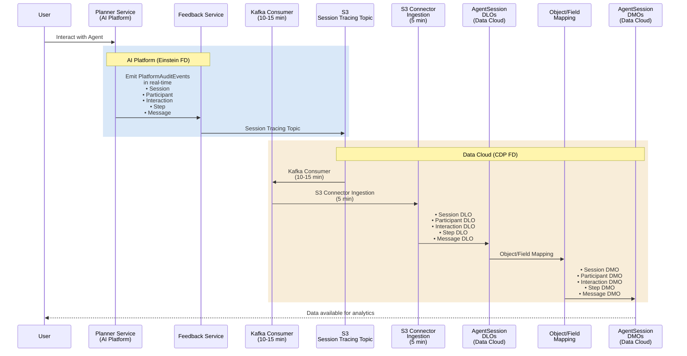

### Ingestion Timeline

**Total Latency**: Approximately 15-20 minutes from event to queryable data

| Stage | Duration | Description |
|-------|----------|-------------|
| **Event Emission** | Real-time | Planner emits events to Feedback Service |
| **Kafka Consumer** | 10-15 min | Batch processing from Kafka to S3 |
| **S3 Connector** | 5 min | S3 to Data Cloud DLO ingestion |
| **Mapping** | < 1 min | DLO to DMO transformation |

### Data Flow Components

#### AI Platform (Einstein FD)

**Planner Service**:
- Orchestrates agent execution
- Emits telemetry events for every interaction

**Feedback Service**:
- Receives events from Planner
- Publishes to Kafka topic: "Session Tracing Topic"

#### Data Cloud (CDP FD)

**AgentSession DLOs**:
- Session DLO
- Participant DLO
- Interaction DLO
- Step DLO
- Message DLO

**Object/Field Mapping**:
- Transforms DLO schema to DMO schema
- Maps fields between source and target

**AgentSession DMOs**:
- Session DMO (queryable via SOQL/SDM)
- Participant DMO
- Interaction DMO
- Step DMO
- Message DMO

---

## AIE Backend Architecture

### Component Overview

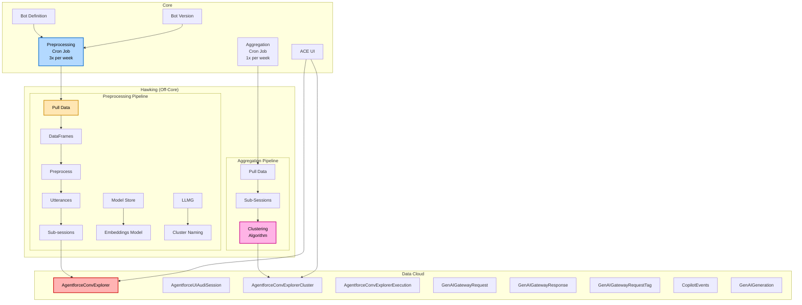

**Key Components**:

1. **Hawking (Off-Core Processing)**:
   - **Preprocessing Pipeline**: Runs 3x per week, processes raw sessions into moments
   - **Aggregation Pipeline**: Runs 1x per week, clusters moments into categories

2. **Data Cloud**: Stores all processed data in DLOs

3. **Core**: Triggers pipelines via cron jobs, provides UI access

### Data Flow

**Flow 1: Preprocessing (Once a Day)**
```
Core Cron Job
    ↓
Hawking: Pull Data
    ↓
Hawking: Preprocess (LLM moment creation)
    ↓
Hawking: Write Sub-sessions
    ↓
Data Cloud: AgentforceConvExplorer DLO
```

**Flow 2: Aggregation (Once a Week)**
```
Core Cron Job
    ↓
Hawking: Pull Sub-sessions
    ↓
Hawking: Clustering Algorithm
    ↓
Data Cloud: AgentforceConvExplorerCluster DLO
```

---

## AIE UI Architecture

### Component Diagram

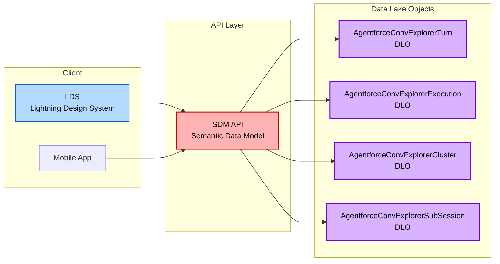

**Data Access Pattern**:

1. **User Interface** (LDS or Mobile) sends query to SDM API
2. **SDM API** translates query into optimized DLO queries
3. **DLOs** return data from Data Cloud
4. **SDM API** aggregates and returns formatted data to UI

**Benefits**:
- Consistent query interface across all clients
- Optimized performance via SDM
- Calculated fields and metrics available out-of-the-box

---

## Provisioning & Licensing

### System Requirements & Dependencies

#### 1. Agentforce Session Tracing Dependency

**Critical Requirement**: AIE requires that **Agentforce Session Tracing (STDM)** is enabled and provisioned in the org.

**Validation**: AIE provisioning will **not proceed** if STDM is disabled.

**STDM Dependencies**:
- Agentforce permissions in place
- Data Cloud provisioned
- Agentforce data space configured
- Feedback team provides bean containing all custom DC assets (DLOs, Mappings, Data Transforms)

#### 2. DC Data Kits

**Technology**: AIE uses **Data Kits APIs** to create DC assets, DLO mappings, and SDMs.

**Benefits**:
- DC1-compliant provisioning
- Versioned asset management
- Automated updates via cron
- Consistent deployment across orgs

### STDM Provisioning Flow

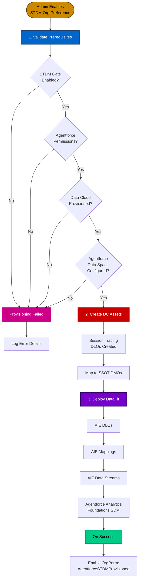

#### Provisioning Steps in Detail

**Step 1: Validate Prerequisites**

| Check | Requirement |
|-------|-------------|
| STDM Gate | Must be enabled |
| Agentforce Permissions | Must be in place |
| Data Cloud | Must be provisioned |
| Agentforce Data Space | Must be configured |

**Step 2: Data Cloud Asset Creation**

**Session Tracing DLOs Created**:
- AiAgentSession
- AiAgentInteraction
- AiAgentInteractionMessage
- AiAgentSessionParticipant

**Mapping**: DLOs mapped to corresponding SSOT DMOs using Data Cloud Connect APIs.

**Step 3: DataKit Deployment**

**Components Deployed**:

1. **AIE DLOs**:
   - AiAgentMoment
   - AiAgentMomentInteraction
   - AiAgentTagDefinition
   - AiAgentTag
   - AiAgentTagAssociation

2. **AIE Mappings**: DLO to SSOT DMO mappings

3. **AIE Data Streams**: For Core ingestion API

4. **Agentforce Analytics Foundations SDM**: Semantic Data Model with calculated fields

**On Success**: Enable `AgentforceSTDMProvisioned` Org Permission

### AIE Provisioning Flow

#### Prerequisites

**Two Conditions Must Be Met**:

1. **AIE Org Preference** = Enabled
2. **AgentforceSessionModel Org Permission** = Enabled (signals STDM provisioning complete)

#### Enablement Scenarios

**Scenario 1: AIE Enabled Before STDM Provisioning Completes**

```
Admin enables STDM Org Pref
    ↓
STDM async provisioning starts (takes time)
    ↓
Admin enables AIE Org Pref (while STDM still provisioning)
    ↓
AIE provisioning does NOT start yet
    ↓
Wait for STDMProvisioned Org Permission to be enabled
    ↓
AIE provisioning starts from STDM provisioned enablement hook
```

**Scenario 2: STDM Provisioned Before AIE Enabled**

```
Admin enables STDM Org Pref
    ↓
STDM async provisioning completes
    ↓
STDMProvisioned Org Permission enabled
    ↓
Admin enables AIE Org Pref
    ↓
AIE async provisioning flow triggered immediately
```

#### AIE Provisioning Flow Diagram

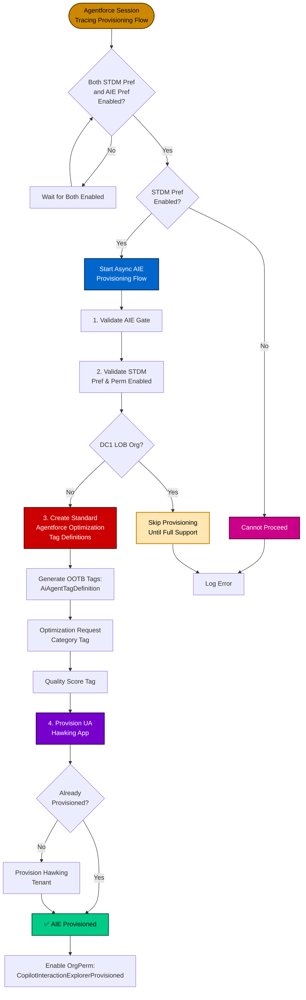

#### Provisioning Steps in Detail

**Step 1: Validations**

**a) Validate AIE Gate is Enabled**

Check: `Gater.com.salesforce.agentforce.interactionExplorerEnabled`

**b) Validate STDM Pref and Perm are Enabled**

Check: `OrgPref.AgentforceSTDMEnabled` AND `OrgPerm.AgentforceSTDMProvisioned`

**c) DC1 - Skip if LOB Org**

**Current Behavior**: Provisioning is currently **disabled for DC1 LOB orgs** until full support is in place.

**Future Behavior**: Once LOB orgs are supported, validate that `CopilotUtteranceNCP` is enabled in the Home org.

**Step 2: Create Standard Agentforce Optimization Tag Definitions**

**Action**: Generate all OOTB (Out-of-the-Box) tags metadata as `AiAgentTagDefinition` records.

**Tags Created**:

1. **Optimization Request Category Tag Definition**
   - SourceType: GENERATED
   - DataType: text
   - Purpose: Auto-generated categories from clustering

2. **Quality Score Tag Definition**
   - SourceType: PREDEFINED
   - DataType: integer
   - Values: 1, 2, 3, 4, 5

**Step 3: Provision UA Hawking App**

**Action**: Provision the AIE Hawking tenant if not already provisioned.

**Common Case**: Hawking tenant will already exist (provisioned during Einstein GPT enablement for DC1 support).

**Validation**: Check if `CopilotUtteranceAnalysisNCP` org permission is enabled.

### De-Provisioning Flows

#### STDM De-Provisioning Flow

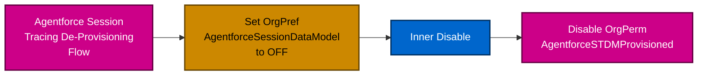

**Actions**:
1. Set `OrgPref.AgentforceSessionDataModel` to OFF
2. Disable `OrgPerm.AgentforceSTDMProvisioned`

**Data Cloud Assets**: Assets remain in place (not deleted).

#### AIE De-Provisioning Flow

**Trigger**: Admin disables the AIE Org Preference

**Actions**: No additional actions performed.

**Effect**: 
- AIE pipelines will no longer be executed
- UI access controlled by org preference state
- Data Cloud assets remain in place

---

## DC1 Architecture Support

### What is DC1?

**DC1 (Data Cloud 1)** is an architecture where **multiple Salesforce orgs share a single Data Cloud instance**.

**Components**:
- **Home Org**: Primary Data Cloud org
- **LOB (Line of Business) Org**: Connected Salesforce org(s) sharing the Data Cloud

### Cross-Region Data Transfer Challenge

**Problem**: LOB org may be in a different region than Home org.

**Example**:
```
Home Org: US West (Data Cloud instance)
LOB Org: EU Central

❌ Running AIE pipeline in LOB org → cross-region data transfer
✅ Running AIE pipeline in Home org → no cross-region transfer
```

### Solution Architecture

**Requirements**:
1. AIE Hawking tenant must be provisioned in **Home org**
2. Einstein GPT license must be active in **Home org**
3. Pipeline execution must be triggered from **Home org context**

### DC1 Supported Org Configurations

#### 1. Normal DC

**Description**: Standalone Data Cloud org with AIE enabled

```
┌─────────────────────┐
│     DC Org          │
│                     │
│  ✅ AIE Enabled     │
│  ✅ Hawking Tenant  │
│  ✅ Pipelines Run   │
└─────────────────────┘
```

#### 2. HomeOrgWithoutLOB

**Description**: Home org has AIE enabled; no LOB org configured

```
┌─────────────────────┐
│    Home Org         │
│                     │
│  ✅ AIE Enabled     │
│  ✅ Hawking Tenant  │
│  ✅ Pipelines Run   │
└─────────────────────┘
```

#### 3. HomeDisabledWithLOBEnabled

**Description**: Home org has AIE disabled; LOB org has AIE enabled

```
┌─────────────────────┐        ┌─────────────────────┐
│    Home Org         │◄───────│     LOB Org         │
│                     │        │                     │
│  ❌ AIE Disabled    │        │  ✅ AIE Enabled     │
│  ✅ Hawking Tenant  │        │  ❌ No Hawking      │
│  ✅ Pipelines Run   │        │  ❌ No Pipelines    │
│     (for LOB)       │        │                     │
└─────────────────────┘        └─────────────────────┘
                 ▲
                 │
          Pipeline Triggered
          from Home Org
```

**Key**: Hawking tenant provisioned in Home org even though AIE disabled there.

#### 4. HomeAndLOBEnabled

**Description**: Both Home and LOB orgs have AIE enabled

```
┌─────────────────────┐        ┌─────────────────────┐
│    Home Org         │◄───────│     LOB Org         │
│                     │        │                     │
│  ✅ AIE Enabled     │        │  ✅ AIE Enabled     │
│  ✅ Hawking Tenant  │        │  ❌ No Hawking      │
│  ✅ Pipelines Run   │        │  ❌ No Pipelines    │
│     (for both)      │        │                     │
└─────────────────────┘        └─────────────────────┘
                 ▲
                 │
          Pipelines for Both Orgs
          Run in Home Org
```

### DC1 Supported Org Configurations Table

| Configuration | Description | AIE Enabled In | Hawking Tenant In |
|---------------|-------------|----------------|-------------------|
| **Normal DC** | Standalone DC org | DC Org | DC Org |
| **HomeOrgWithoutLOB** | Home org only, no LOB | Home Org | Home Org |
| **HomeDisabledWithLOBEnabled** | Home disabled, LOB enabled | LOB Org | Home Org (provisioned) |
| **HomeAndLOBEnabled** | Both enabled | Both Orgs | Home Org |

**Key Principle**: Hawking tenant always provisioned in Home org for DC1 support.

### Pipeline Triggering in DC1

**Challenge**: Jobs triggered within LOB must initiate pipelines in Home Hawking tenant.

**Solution**: Core Cron job in LOB org triggers Hawking off-core pipelines in Home org.

**Validation Logic**:
1. Check feature access in LOB org
2. Verify Hawking tenant exists in Home org
3. Trigger pipeline in Home org context

**Implementation**: Similar to UA (Utterance Analysis) approach.

---

## Hawking App Infrastructure

### Strategy Overview

**Decision**: Reuse existing UA Hawking App for AIE GA.

**Alternative Approaches Evaluated**: See AIE Hawking Provisioning Alternatives for DC1

### Hawking Tenant Availability in Home Org

**Critical Requirement**: Hawking tenant must be set up in the DC Home org—**even if AIE Org Preference is disabled there**.

**Example Scenario**:
```
Home DC Org:
- Einstein GPT license: ✅ Provisioned
- Agentforce license: ❌ Not enabled
- AIE enabled: ❌ Disabled

LOB Org:
- Agentforce license: ✅ Provisioned
- AIE enabled: ✅ Enabled
```

**Solution**: AIE pipeline must run from Home org's region → Hawking tenant required in Home org.

**Provisioning Rule**: Provision Hawking tenant in any **non-LOB DC org** where `EinsteinGPTOrgPref` is enabled.

### Utterance Analysis Feature Reuse

**Existing Org Permission**: `OrgPermissions.copilotUtteranceAnalysis`

**Current Behavior**: Triggers Hawking provisioning for UA Hawking App.

**Required Updates**:

1. **Update orgAccess dependency**:
   - **Current**: Depends on Analytics & Feedback org preferences
   - **New**: Depend on `EinsteinGPTPref`

2. **Update license dependency**:
   - **Current**: Depends on `EinsteinGPTCopilot` license
   - **New**: Also depend on `EinsteinGPT` license (base license)
   - **Rationale**: Hawking must be provisioned in Home org, which may only have base Einstein GPT

**Deprovisioning Rule**: Hawking tenant deprovisioned only if **all Einstein GPT licenses** are removed.

**Compatibility**: No issues, since `EinsteinGPT` is always present when `EinsteinGPTCopilot` is enabled.

### Feature Permission Code

```java
@Override
public Set<BitVectorBit> getFeaturePerm() {
   return Set.of(
      // Provisioned Org Permission for EinsteinGPT license, required for AIE
      EinsteinGPTSettings.OrgPermissions.einsteinGenerativeService,
   );
}
```

### Handling UA-Specific Logic

**Issue**: `onEnablementComplete` method includes UA-specific logic (e.g., triggering EVF jobs).

**Solution**: Wrap UA logic with feature check:

```java
if (EVFFeature.isEnabled()) {
    // UA-specific logic
    triggerEVFJobs();
}
```

**Future**: Remove UA-specific logic entirely after UA deprecation.

### Over-Provisioning Approach

**Decision**: Simplify provisioning logic by **over-provisioning** Hawking tenant.

**Rationale**:
- Avoid complex conditional logic at app level
- Resource usage not a concern
- All access checks validated before triggering off-core pipelines

**Rule**: AIE Hawking tenant will **always** be provisioned on `EinsteinGPT` Org Pref enablement.

### Hawking Tenant Provisioning Flow

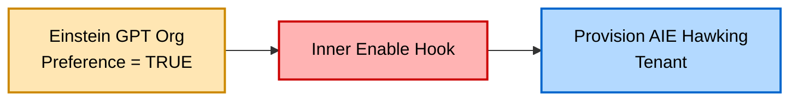

### Backfilling Existing Orgs

**Challenge**: Provision all existing orgs where `EinsteinGPT OrgPref` is already enabled.

**Solution**: Introduce **Cron Job in Core** for backfilling.

**Job Responsibilities**:
1. Identify all orgs with `EinsteinGPTOrgPref` enabled
2. Check if Hawking tenant already provisioned
3. Provision Hawking tenant if missing
4. Log results for monitoring

### Hawking Pipeline Triggering for DC1

**Challenge**: In LOB context, pipelines must run in Home org Hawking tenant.

**Solution**: Core Cron job triggers Hawking off-core pipelines (same as UA approach).

**Pipeline Interface**: Each pipeline implements `ServiceEinsteinAppHooks` interface.

**Examples in UA**:
- `CopilotUtteranceAnalysisAggregationCronJob`
- `CopilotUtteranceAnalysisProcessingCronJob`

**Validation Logic** (for over-provisioning approach):
1. Validate feature access checks
2. If in LOB context → verify Hawking tenant available in Home org
3. Trigger job in Home org context

---

## Permissions & Access Control

### Org Preferences

#### 1. AgntfrcInteractionExplorer

**Purpose**: Controls the AIE feature at the org level

**Access Control**:
- `orgAccess` = `AccessCheck.orgCanEnableAIE`
- `editAccess` = `AccessCheck.userCanEnableAIE`

#### 2. AgentforceSTDMEnabled

**Purpose**: Controls the STDM feature at the org level

**Access Control**:
- `orgAccess` = `GenerativeAIAgent.orgHasAnyCopilot`
- `editAccess` = `(GenerativeAIAgent.orgHasAnyCopilot) && (UserPermissions.CustomizeApplication || isDoingSysAdmin)`

### Org Permissions

#### 1. AgentforceSTDMProvisioned

**Purpose**: Indicates that STDM provisioning completed successfully

**Type**: System-managed (cannot be manually enabled)

**Usage**: Prerequisite check for AIE provisioning

#### 2. AIEDCAssetsProvisioned

**Purpose**: Indicates that AIE DC Assets were provisioned

**Type**: System-managed

**Usage**: Tracks provisioning state

#### 3. copilotUtteranceAnalysis

**Purpose**: Triggers provisioning of the UA Hawking App

**Updated orgAccess**: Now relies on Einstein GPT pref (in addition to existing dependencies)

**Rationale**: Support Home org provisioning in DC1 where only base Einstein GPT is enabled

#### 4. copilotUtteranceAnalysisNCP

**Purpose**: Indicates the UA Hawking App was provisioned successfully to AIP

**Type**: System-managed

**Usage**: Validation check before triggering pipelines

### User Permissions

#### InteractionExplorerViewer

**Purpose**: Grants visibility into the AIE UI

**Standard Permission Set**: `InteractionExplorerViewer`

**License Key**: `UserLicense.SFDC`

**Assignment**: Admins assign this permission set to users who need AIE access

### Access Checks

#### Can Enable STDM (Org and User Level)

**Org Level**:
```java
orgCanEnableSTDM = 
    (GenerativeAIAgent.orgHasAnyCopilot) && DCEnabled
```

**User Level**:
```java
userCanEnableSTDM = 
    UserPermissions.ViewSetup 
    || canUserDoCloudIntegration 
    || isSfdcAdmin 
    || Insights.userHasInsightsIntegration 
    || UserPermissions.ModifyMetadata
```

#### Can Enable AIE (Org and User Level)

**Org Level**:
```java
orgCanEnableAIE = 
    OrgPref.AgentforceSTDMEnabled 
    && Gater 
    && OrgPref.EinsteinGPTPlatformEnabled
```

**User Level**:
```java
userCanEnableAIE = 
    UserPermissions.ViewSetup 
    || canUserDoCloudIntegration 
    || isSfdcAdmin 
    || Insights.userHasInsightsIntegration 
    || UserPermissions.ModifyMetadata
```

#### AIE Enabled - Org Level Access Check

**Full Validation**:
```java
orgHasAIEEnabled = 
    OrgPref.AgntfrcInteractionExplorerEnabled 
    && OrgPref.AgentforceSTDMEnabled 
    && OrgPermissions.AgentforceSTDMProvisioned 
    && OrgPermissions.CopilotUtteranceAnalysis 
    && OrgPermissions.AgentforceSTDMProvisioned 
    && AIEGate
```

**Required Conditions**:
1. AIE Org Preference enabled
2. STDM Org Preference enabled
3. STDM provisioned successfully
4. Hawking App provisioned (CopilotUtteranceAnalysis)
5. AIE gate enabled

#### AIE Enabled - User Level Access Check

**Full Validation**:
```java
userHasAIEEnabled = 
    orgHasAIEEnabled 
    && UserPermissions.InteractionExplorerViewer
```

**Required Conditions**:
1. Org-level AIE enabled
2. User has InteractionExplorerViewer permission

### Permission Flow Summary

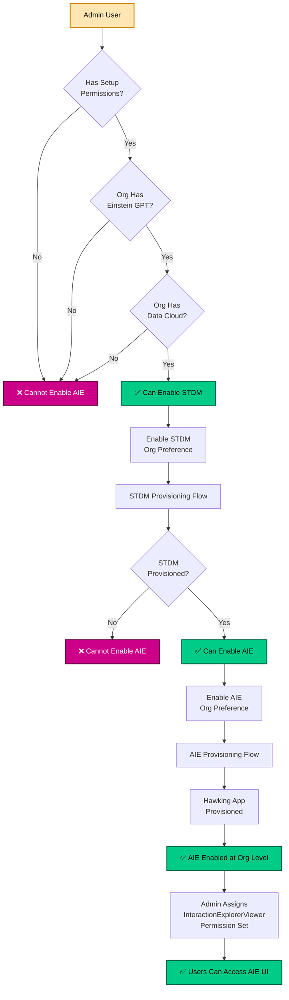

---

## References

### Related Documentation

- **AIE Data Model & Tags Design** - Detailed data model specifications
- **MomentGeneration Pipeline Technical Design** - Deep dive into pipeline architecture
- **Agentforce Session Tracing Data Model** - STDM entity definitions

### Citations

1. **Agentforce Observability Architecture**  
   https://docs.google.com/document/d/12t6hCmghYaC6_PGov3nzHL4o5B4eGBZD9tBJKpjFfA8/edit?tab=t.0#heading=h.mbsk3j467ntg

2. **Agentforce Technical Specification**  
   https://docs.google.com/document/d/16Z5AthijOIMm7otnjiM33RdCQHj9Zl56vAG1NOQF0W4/edit?tab=t.0#heading=h.4klttszfe2em

3. **Agentforce Implementation Guide**  
   https://salesforce.quip.com/sdLfAFbg8q6W

4. **Agentforce Observability Presentation**  
   https://docs.google.com/presentation/d/10Q70oiDzIbdgXCXvfyF3OGPFR7I1sEKEaqBdUXCejvU/edit

---

**Document Version:** 1.0  
**Last Updated:** November 13, 2025
