# 🌐 Salesforce Private Connect vs AWS Transit Gateway
## Comprehensive Architecture Guide & Comparative Analysis

> **A technical deep-dive into enterprise networking solutions for secure, scalable cloud connectivity**

---

## 📖 **Table of Contents**

1. [🎯 Executive Summary](#-executive-summary)
2. [🔐 Salesforce Private Connect Architecture](#-salesforce-private-connect-architecture)
3. [🌐 AWS Transit Gateway Architecture](#-aws-transit-gateway-architecture)
4. [⚖️ Comparative Analysis](#️-comparative-analysis)
5. [🛡️ Security Models Comparison](#️-security-models-comparison)
6. [🎯 Use Case Recommendations](#-use-case-recommendations)

---

## 🎯 **Executive Summary**

This document provides a comprehensive architectural comparison between **Salesforce Private Connect** and **AWS Transit Gateway**, two distinct networking solutions designed for different enterprise connectivity scenarios.

### Key Distinctions

| Aspect | Salesforce Private Connect | AWS Transit Gateway |
|--------|---------------------------|-------------------|
| **Purpose** | Secure Salesforce-to-external service connectivity | Multi-VPC hub-and-spoke networking |
| **Scope** | Private connectivity for various services (data warehouses are highest priority) | Infrastructure-wide networking hub |
| **Architecture** | Point-to-point private connections | Centralized routing hub |
| **Use Case** | Data integration & analytics | Enterprise network connectivity |

---

## 🔐 **Salesforce Private Connect Architecture**

### Overview
Salesforce Private Connect enables secure, private connectivity between Salesforce and external services through AWS PrivateLink infrastructure, eliminating exposure to the public internet. While data warehouse connectivity is currently the highest priority use case, Private Connect supports connectivity to many different types of services for various purposes.

### Architecture Diagram

```mermaid
flowchart TB
    subgraph "☁️ Salesforce Cloud Environment"
        direction TB
        DC[📊 Data Cloud<br/>Core Platform<br/>🔢 Step 1]
        PC[🔒 Private Connect Service<br/>Connectivity Engine<br/>🔢 Step 2]
        IDP[🆔 Salesforce Identity Provider<br/>Authentication Hub<br/>🔢 Step 3]
    end
    
    subgraph "🏗️ AWS Customer Infrastructure"
        direction TB
        VE[🌐 VPC Endpoint Service<br/>PrivateLink Pass-through<br/>🔢 Step 4]
        NLB[⚖️ Network Load Balancer<br/>Traffic Distribution<br/>🔢 Step 5]
        TG[🎯 Target Groups<br/>Health Management<br/>🔢 Step 6]
        SG[🛡️ Security Groups<br/>Access Control<br/>🔢 Step 7]
    end
    
    subgraph "🗄️ Data Warehouse Ecosystem"
        direction TB
        SF[❄️ Snowflake<br/>Cloud Data Platform<br/>🔢 Step 8]
        RS[📈 Amazon Redshift<br/>Data Warehouse<br/>🔢 Step 8]
        DB[🗃️ Databricks<br/>Analytics Platform<br/>🔢 Step 8]
    end
    
    subgraph "🔑 Authentication & Security Layer"
        direction TB
        TOKEN[⏱️ Short-lived Tokens<br/>Dynamic Credentials<br/>🔢 Step 3a]
        OIDC[🔐 OIDC Configuration<br/>Identity Federation<br/>🔢 Step 3b]
        SSL[🔒 TLS/SSL Encryption<br/>Data Protection<br/>🔢 Step 9]
    end
    
    %% Primary Data Flow
    DC -->|1️⃣ Query Request| PC
    PC -->|2️⃣ Private Channel| VE
    VE -->|3️⃣ Load Balanced| NLB
    NLB -->|4️⃣ Traffic Routing| TG
    TG -->|5️⃣ Health Check| SG
    SG -->|6️⃣ Filtered Access| SF
    SG -->|6️⃣ Filtered Access| RS
    SG -->|6️⃣ Filtered Access| DB
    
    %% Authentication Flow
    IDP -->|🔐 Generate| TOKEN
    TOKEN -->|🔐 Configure| OIDC
    OIDC -->|🔐 Secure Access| SF
    OIDC -->|🔐 Secure Access| RS
    OIDC -->|🔐 Secure Access| DB
    
    %% Security Layer
    PC -.->|🔒 Encrypted| SSL
    SSL -.->|🔒 Protected| SF
    
    %% Styling
    classDef salesforce fill:#00A1E0,stroke:#0073E6,stroke-width:3px,color:#fff,font-weight:bold
    classDef aws fill:#FF9900,stroke:#E47911,stroke-width:3px,color:#fff,font-weight:bold
    classDef datawarehouse fill:#4CAF50,stroke:#388E3C,stroke-width:3px,color:#fff,font-weight:bold
    classDef auth fill:#FF5722,stroke:#D84315,stroke-width:3px,color:#fff,font-weight:bold
    
    class DC,PC,IDP salesforce
    class VE,NLB,SG,TG aws
    class SF,RS,DB datawarehouse
    class TOKEN,OIDC,SSL auth
```



#### 🔍 **Step-by-Step Flow Analysis**

**📊 Primary Data Flow (Steps 1-8)**

| Step | Component | Description | Technical Details |
|------|-----------|-------------|-------------------|
| **1** | **Data Cloud** | Query initiation and request preparation | Data Cloud receives analytics request, prepares query execution plan, and validates user permissions |
| **2** | **Private Connect Service** | Secure connection establishment | Private Connect evaluates target data warehouse, establishes PrivateLink tunnel, and prepares authentication context |
| **3** | **Identity Provider** | Authentication token generation | Salesforce IDP generates short-lived OIDC tokens (typically 30-60 minutes), configures JWT claims, and prepares credential context |
| **3a** | **Token Generation** | Dynamic credential creation | System creates asymmetric key pairs, generates signed JWT tokens with specific audience claims for target data warehouse |
| **3b** | **OIDC Configuration** | Identity federation setup | OIDC provider configures trust relationships, validates audience claims, and establishes secure authentication flow |
| **4** | **VPC Endpoint Service** | Private network entry point | AWS PrivateLink endpoint service receives traffic and passes it through to the destination configured via the Network Load Balancer (does not terminate TLS) |
| **5** | **Network Load Balancer** | Traffic distribution and load balancing | NLB distributes incoming connections across multiple target instances, performs health checks, and maintains connection state |
| **6** | **Target Groups** | Health management and routing | Target groups monitor data warehouse instance health, manage traffic routing algorithms, and handle failover scenarios |
| **7** | **Security Groups** | Access control and filtering | Security groups apply stateful firewall rules, validate source IP ranges, and enforce port-level access controls |
| **8** | **Data Warehouse** | Query execution and result processing | Target data warehouse (Snowflake/Redshift/Databricks) executes query, processes results, and returns data through secured channel |
| **9** | **SSL/TLS Encryption** | End-to-end data protection | TLS 1.3 encryption protects data in transit, validates certificates, and ensures data integrity throughout the entire flow |

**🔐 Authentication Flow (Parallel Process)**
- **Step 3a → 3b**: Authentication tokens are generated in parallel with connection establishment
- **OIDC Integration**: Provides standards-based single sign-on with zero static credential management
- **Token Lifecycle**: Automatic token rotation ensures continuous security without manual intervention

### 🔍 **Key Components Deep Dive**

#### **1. Salesforce Data Cloud**
- **Function**: Central data processing and analytics platform
- **Capabilities**: Real-time data streaming, identity resolution, calculated insights
- **Security**: Enterprise-grade encryption, audit logging, compliance certifications

#### **2. Private Connect Service**
- **Function**: Secure connectivity orchestration engine
- **Technology**: AWS PrivateLink integration for private network paths
- **Benefits**: No public internet exposure, reduced latency, enhanced security

#### **3. Authentication Framework**
- **Identity Provider**: Salesforce-managed OIDC authentication
- **Token Management**: Short-lived, auto-rotating credentials
- **Zero Static Credentials**: Dynamic authentication without stored passwords

---

## 🌐 **AWS Transit Gateway Architecture**

### Overview
AWS Transit Gateway acts as a cloud router, enabling customers to connect their Amazon VPCs and on-premises networks through a single gateway, simplifying network architecture and routing.

### Hub-and-Spoke Architecture Diagram

```mermaid
flowchart TB
    subgraph "🎯 Transit Gateway Core Hub"
        direction TB
        TGW[🌐 Transit Gateway<br/>Central Routing Hub<br/>🔢 Step 1]
        RT1[📋 Production Route Table<br/>Prod Traffic Rules<br/>🔢 Step 2]
        RT2[🧪 Development Route Table<br/>Dev Traffic Rules<br/>🔢 Step 2]
        RT3[🤝 Shared Services Route Table<br/>Common Resources<br/>🔢 Step 2]
        RT4[🔒 Security Route Table<br/>Inspection Rules<br/>🔢 Step 2]
    end
    
    subgraph "🏭 Production Environment"
        direction TB
        VPCA[🏢 Production VPC A<br/>Web Tier Applications<br/>🔢 Step 3]
        VPCB[🏢 Production VPC B<br/>Database Tier<br/>🔢 Step 3]
        PROD_APP[🚀 Production Applications<br/>Live Workloads<br/>🔢 Step 5]
        PROD_DB[🗄️ Production Databases<br/>Critical Data<br/>🔢 Step 5]
    end
    
    subgraph "🧪 Development Environment"
        direction TB
        VPCD[🧪 Development VPC<br/>Dev Workloads<br/>🔢 Step 4]
        VPCE[🧪 Testing VPC<br/>QA Environment<br/>🔢 Step 4]
        DEV_APP[⚙️ Development Applications<br/>Testing Applications<br/>🔢 Step 6]
        STAGE[🎭 Staging Environment<br/>Pre-Production<br/>🔢 Step 6]
    end
    
    subgraph "🛠️ Shared Services Hub"
        direction TB
        VPCS[🤝 Shared Services VPC<br/>Common Infrastructure<br/>🔢 Step 7]
        DNS[🌐 DNS Services<br/>Route 53 Resolver<br/>🔢 Step 8]
        LOG[📊 Logging Services<br/>CloudWatch Logs<br/>🔢 Step 8]
        MON[📈 Monitoring Services<br/>CloudWatch Metrics<br/>🔢 Step 8]
        SEC[🛡️ Security Services<br/>GuardDuty, Config<br/>🔢 Step 8]
    end
    
    subgraph "🌉 Hybrid Connectivity"
        direction TB
        VPN[🔗 Site-to-Site VPN<br/>Encrypted Tunnels<br/>🔢 Step 9]
        DX[⚡ Direct Connect Gateway<br/>Dedicated Bandwidth<br/>🔢 Step 9]
        ONPREM[🏢 On-Premises Network<br/>Corporate Infrastructure<br/>🔢 Step 10]
        BRANCH[🏪 Branch Offices<br/>Remote Locations<br/>🔢 Step 11]
    end
    
    %% Route Table Associations
    TGW --> |1️⃣ Route Processing| RT1
    TGW --> |1️⃣ Route Processing| RT2
    TGW --> |1️⃣ Route Processing| RT3
    TGW --> |1️⃣ Route Processing| RT4
    
    %% Production Environment Routing
    RT1 --> |2️⃣ Prod Routing| VPCA
    RT1 --> |2️⃣ Prod Routing| VPCB
    RT1 --> |2️⃣ Shared Access| VPCS
    VPCA --> |3️⃣ App Deployment| PROD_APP
    VPCB --> |3️⃣ Data Storage| PROD_DB
    
    %% Development Environment Routing
    RT2 --> |4️⃣ Dev Routing| VPCD
    RT2 --> |4️⃣ Test Routing| VPCE
    RT2 --> |4️⃣ Shared Access| VPCS
    VPCD --> |5️⃣ Dev Deployment| DEV_APP
    VPCE --> |5️⃣ Staging Deployment| STAGE
    
    %% Shared Services Routing
    RT3 --> |6️⃣ Service Access| VPCS
    VPCS --> |7️⃣ Service Provision| DNS
    VPCS --> |7️⃣ Service Provision| LOG
    VPCS --> |7️⃣ Service Provision| MON
    VPCS --> |7️⃣ Service Provision| SEC
    
    %% Hybrid Connectivity
    RT4 --> |8️⃣ Hybrid Routing| VPN
    RT4 --> |8️⃣ Hybrid Routing| DX
    VPN --> |9️⃣ Encrypted Connection| ONPREM
    DX --> |9️⃣ Direct Connection| ONPREM
    ONPREM --> |🔟 Branch Connectivity| BRANCH
    
    %% Cross-environment access (controlled)
    RT1 -.->|⚠️ Controlled Access| RT2
    RT2 -.->|⚠️ Limited Access| RT1
    
    %% Styling
    classDef tgwcore fill:#8E24AA,stroke:#6A1B9A,stroke-width:4px,color:#fff,font-weight:bold
    classDef production fill:#4CAF50,stroke:#388E3C,stroke-width:3px,color:#fff,font-weight:bold
    classDef development fill:#FF9800,stroke:#F57C00,stroke-width:3px,color:#fff,font-weight:bold
    classDef shared fill:#2196F3,stroke:#1976D2,stroke-width:3px,color:#fff,font-weight:bold
    classDef hybrid fill:#F44336,stroke:#D32F2F,stroke-width:3px,color:#fff,font-weight:bold
    
    class TGW,RT1,RT2,RT3,RT4 tgwcore
    class VPCA,VPCB,PROD_APP,PROD_DB production
    class VPCD,VPCE,DEV_APP,STAGE development
    class VPCS,DNS,LOG,MON,SEC shared
    class VPN,DX,ONPREM,BRANCH hybrid
```



#### 🔍 **Step-by-Step Flow Analysis**

**🌐 Core Hub Processing (Steps 1-2)**

| Step | Component | Description | Technical Details |
|------|-----------|-------------|-------------------|
| **1** | **Transit Gateway Hub** | Central routing fabric initialization | TGW receives traffic from any attached VPC/VPN, evaluates source attachment ID, and determines appropriate route table for processing |
| **2** | **Route Table Processing** | Route evaluation and path determination | System checks route table associations, evaluates destination CIDR blocks, applies route propagation rules, and selects optimal next-hop attachment |

**🏭 Production Environment Flow (Steps 3-5)**

| Step | Component | Description | Technical Details |
|------|-----------|-------------|-------------------|
| **3** | **Production VPCs** | Isolated production network segments | Traffic enters production VPCs through dedicated route table (RT1), applies production-specific security policies, and maintains strict isolation from dev environments |
| **4** | **Production Routing** | Internal production traffic flow | Route table RT1 directs traffic between Prod VPC A (web tier) and Prod VPC B (database tier) while maintaining security boundaries and access controls |
| **5** | **Application/Database Tier** | Workload execution and data operations | Production applications in VPC A communicate with databases in VPC B through controlled routing, health monitoring, and automated failover mechanisms |

**🧪 Development Environment Flow (Steps 4-6)**

| Step | Component | Description | Technical Details |
|------|-----------|-------------|-------------------|
| **4** | **Development VPCs** | Isolated development and testing environments | Development route table (RT2) provides separate routing domain, enabling safe testing without impacting production systems |
| **5** | **Development Routing** | Internal development traffic management | RT2 facilitates communication between dev VPC and testing VPC while maintaining logical separation from production infrastructure |
| **6** | **Dev/Staging Workloads** | Application testing and validation | Development applications and staging environments operate independently, with controlled access to shared services for testing scenarios |

**🛠️ Shared Services Flow (Steps 7-8)**

| Step | Component | Description | Technical Details |
|------|-----------|-------------|-------------------|
| **7** | **Shared Services VPC** | Common infrastructure services hub | Shared services route table (RT3) provides centralized access to common infrastructure components used by both production and development environments |
| **8** | **Service Provisioning** | Infrastructure service delivery | DNS, logging, monitoring, and security services are centrally managed and accessible to authorized VPCs based on route table associations and security policies |

**🌉 Hybrid Connectivity Flow (Steps 9-11)**

| Step | Component | Description | Technical Details |
|------|-----------|-------------|-------------------|
| **9** | **Hybrid Gateways** | On-premises connectivity establishment | VPN and Direct Connect gateways provide secure, redundant connectivity options with different performance and cost characteristics |
| **10** | **On-Premises Integration** | Corporate network bridge | On-premises networks connect through either VPN (encrypted over internet) or Direct Connect (dedicated private connection) with route propagation to TGW |
| **11** | **Branch Office Connectivity** | Distributed location access | Branch offices connect through corporate network infrastructure, enabling direct access to cloud resources via established hybrid connectivity |

**⚠️ Cross-Environment Controls**
- **Controlled Access**: Limited, policy-based communication between production and development environments
- **Security Isolation**: Each environment maintains strict network segmentation with explicit allow rules only
- **Audit Trail**: All cross-environment traffic is logged and monitored for compliance and security analysis

### 🔍 **Key Components Deep Dive**

#### **1. Transit Gateway Hub**
- **Function**: Central routing and switching fabric
- **Capacity**: Up to 5,000 VPC attachments, 50 Gbps bandwidth per attachment
- **Routing**: Advanced route table management with propagation and association

#### **2. Route Table Segmentation**
- **Production Routes**: Isolated routing for production workloads
- **Development Routes**: Separate routing domain for dev/test environments
- **Shared Services Routes**: Common infrastructure access patterns
- **Security Routes**: Centralized traffic inspection and filtering

#### **3. Multi-Attachment Support**
- **VPC Attachments**: Connect multiple VPCs within same or different accounts
- **VPN Attachments**: Site-to-site VPN connectivity for hybrid scenarios
- **Direct Connect**: High-bandwidth, low-latency connections to on-premises

---

## ⚖️ **Comparative Analysis**

### Network Flow Comparison

```mermaid
flowchart LR
    subgraph "🔒 Salesforce Private Connect Flow"
        direction TB
        A1[📊 Salesforce Data Cloud<br/>Query Initiation<br/>🔢 Step 1] 
        A1 --> |1️⃣ Request| B1[🔒 Private Connect Service<br/>Connection Management<br/>🔢 Step 2]
        B1 --> |2️⃣ Tunnel| C1[🌐 AWS PrivateLink Endpoint<br/>Private Network Entry<br/>🔢 Step 3]
        C1 --> |3️⃣ Route| D1[🌐 VPC Endpoint Service<br/>Traffic Pass-through<br/>🔢 Step 4]
        D1 --> |4️⃣ Balance| E1[⚖️ Network Load Balancer<br/>Load Distribution<br/>🔢 Step 5]
        E1 --> |5️⃣ Execute| F1[🗄️ Target Data Warehouse<br/>Query Execution<br/>🔢 Step 6]
        
        G1[🆔 Identity Provider<br/>Authentication<br/>🔢 Step A] 
        G1 --> |🔐 Generate| H1[⏱️ Token Generation<br/>Dynamic Credentials<br/>🔢 Step B]
        H1 --> |🔐 Configure| I1[🔐 OIDC Authentication<br/>Secure Access<br/>🔢 Step C]
        I1 --> |🔐 Authenticate| F1
    end
    
    subgraph "🌐 AWS Transit Gateway Flow"
        direction TB
        A2[🏢 Source VPC<br/>Traffic Origin<br/>🔢 Step 1] 
        A2 --> |1️⃣ Attach| B2[🔗 Transit Gateway Attachment<br/>VPC Connection<br/>🔢 Step 2]
        B2 --> |2️⃣ Route| C2[🎯 Transit Gateway Hub<br/>Central Router<br/>🔢 Step 3]
        C2 --> |3️⃣ Process| D2[📋 Route Table Processing<br/>Path Determination<br/>🔢 Step 4]
        D2 --> |4️⃣ Select| E2[🎯 Target Attachment Selection<br/>Destination Resolution<br/>🔢 Step 5]
        E2 --> |5️⃣ Deliver| F2[🏢 Destination VPC/Network<br/>Traffic Delivery<br/>🔢 Step 6]
        
        G2[🏢 On-Premises Network<br/>External Networks<br/>🔢 Step 7] 
        G2 --> |🌉 Connect| H2[🔗 VPN/Direct Connect<br/>Hybrid Connectivity<br/>🔢 Step 8]
        H2 --> |🌉 Bridge| C2
        
        I2[🏢 Multiple VPCs<br/>Distributed Workloads<br/>🔢 Step 9] 
        I2 --> |🎯 Policy| J2[📋 Centralized Routing<br/>Policy Enforcement<br/>🔢 Step 10]
        J2 --> |🎯 Control| C2
    end
    
    subgraph "🔍 Key Architectural Differences"
        direction TB
        DIFF1[🎯 Private Connect<br/>📍 Service-Specific<br/>🔒 Data Integration Focus]
        DIFF2[🌐 Transit Gateway<br/>📍 Multi-Purpose Hub<br/>🏗️ Infrastructure Focus]
        DIFF3[🔗 Private Connect<br/>📍 Point-to-Point<br/>⚡ Optimized Paths]
        DIFF4[🌐 Transit Gateway<br/>📍 Hub-and-Spoke<br/>🎯 Centralized Control]
    end
    
    %% Styling
    classDef privateconnect fill:#00A1E0,stroke:#0073E6,stroke-width:3px,color:#fff,font-weight:bold
    classDef transitgateway fill:#8E24AA,stroke:#6A1B9A,stroke-width:3px,color:#fff,font-weight:bold
    classDef differences fill:#607D8B,stroke:#455A64,stroke-width:3px,color:#fff,font-weight:bold
    
    class A1,B1,C1,D1,E1,F1,G1,H1,I1 privateconnect
    class A2,B2,C2,D2,E2,F2,G2,H2,I2,J2 transitgateway
    class DIFF1,DIFF2,DIFF3,DIFF4 differences
```



#### 🔍 **Comparative Flow Analysis**

**🔒 Salesforce Private Connect Flow (Steps 1-6 + Authentication A-C)**

| Step | Component | Description | Technical Details |
|------|-----------|-------------|-------------------|
| **1** | **Data Cloud Query Initiation** | User or system triggers analytics request | Data Cloud receives query request, validates user permissions, and prepares execution context with required data source connections |
| **2** | **Private Connect Service** | Connection orchestration and management | Service evaluates target data warehouse, establishes secure PrivateLink tunnel, and configures authentication context for the specific data source |
| **3** | **AWS PrivateLink Endpoint** | Private network entry point | PrivateLink creates secure, private network path without internet exposure, maintaining enterprise-grade security and compliance |
| **4** | **VPC Endpoint Interface** | Traffic pass-through and routing | VPC endpoint service passes traffic through to the NLB destination without TLS termination, routing traffic to internal AWS infrastructure |
| **5** | **Network Load Balancer** | High-performance load distribution | NLB distributes traffic across multiple data warehouse instances, maintains connection persistence, and provides health monitoring |
| **6** | **Data Warehouse Execution** | Query processing and result delivery | Target warehouse (Snowflake/Redshift/Databricks) executes query and returns results through the secured Private Connect channel |
| **A** | **Identity Provider Authentication** | Salesforce-managed identity services | IDP validates user identity, applies role-based access controls, and initiates secure authentication flow |
| **B** | **Token Generation** | Dynamic credential creation | System generates short-lived JWT tokens with specific audience claims, eliminating static credential management |
| **C** | **OIDC Authentication** | Standards-based secure access | OIDC provider validates tokens, establishes trust relationships, and enables standards-based single sign-on |

**🌐 AWS Transit Gateway Flow (Steps 1-6 + Hybrid 7-10)**

| Step | Component | Description | Technical Details |
|------|-----------|-------------|-------------------|
| **1** | **Source VPC Traffic Origin** | Application or service initiates network request | Source VPC generates traffic destined for resources in other VPCs, on-premises networks, or external services |
| **2** | **Transit Gateway Attachment** | VPC connection to central hub | TGW attachment provides network interface between VPC and Transit Gateway, enabling centralized routing and policy enforcement |
| **3** | **Transit Gateway Hub Processing** | Central routing fabric evaluation | TGW receives traffic, evaluates source attachment, and determines appropriate route table based on attachment associations |
| **4** | **Route Table Processing** | Path determination and policy application | System evaluates destination CIDR blocks, applies route propagation rules, and selects optimal next-hop based on routing policies |
| **5** | **Target Attachment Selection** | Destination resolution and forwarding | TGW selects appropriate target attachment (VPC, VPN, or Direct Connect) based on routing table evaluation and policy rules |
| **6** | **Traffic Delivery** | Final destination and response handling | Traffic reaches destination VPC or network, application processes request, and response follows reverse path back to source |
| **7** | **On-Premises Network Integration** | Hybrid cloud connectivity | Corporate networks connect to AWS through VPN or Direct Connect, enabling integrated hybrid cloud operations |
| **8** | **Hybrid Connectivity Bridge** | Secure tunnel or dedicated connection | VPN provides encrypted connectivity over internet, while Direct Connect offers dedicated, high-bandwidth private connection |
| **9** | **Multi-VPC Coordination** | Distributed workload management | Multiple VPCs with different functions coordinate through TGW, enabling complex application architectures |
| **10** | **Centralized Policy Enforcement** | Routing policy and security controls | TGW applies centralized routing policies, security controls, and compliance requirements across entire network topology |

**🎯 Key Flow Differences**
- **Private Connect**: Optimized for specific data integration scenarios with built-in authentication
- **Transit Gateway**: Flexible infrastructure hub supporting diverse networking requirements
- **Security Models**: Private Connect uses service-specific security, TGW uses network-based controls
- **Complexity**: Private Connect simplifies specific use cases, TGW provides comprehensive but complex networking

### Feature Comparison Matrix

| Feature | Salesforce Private Connect | AWS Transit Gateway |
|---------|---------------------------|-------------------|
| **🎯 Primary Use Case** | Private connectivity to external services (data warehouses highest priority) | Multi-VPC enterprise networking |
| **🏗️ Architecture Pattern** | Service-specific, point-to-point | Hub-and-spoke, centralized routing |
| **🔒 Security Model** | Built-in OIDC, no static credentials | Route-based segmentation, security groups |
| **📈 Scalability** | Optimized for data workloads | Highly scalable (5,000 attachments) |
| **🌐 Network Scope** | Salesforce ↔ Data warehouses | Any-to-any VPC connectivity |
| **⚡ Performance** | Low latency, high throughput for data | Configurable bandwidth per attachment |
| **🛠️ Management Complexity** | Simplified, service-managed | Advanced routing configuration required |
| **💰 Cost Model** | Included with Data Cloud licensing | Pay per attachment + data processing |

---

## 🛡️ **Security Models Comparison**

### Security Architecture Overview

```mermaid
flowchart TB
    subgraph "🔒 Private Connect Security Framework"
        direction TB
        PC_SEC[🎯 Service-Specific Security<br/>Tailored Data Protection<br/>🔢 Step 1]
        PC_IDP[🆔 Identity Provider Integration<br/>Salesforce-Managed Auth<br/>🔢 Step 2]
        PC_COMP[📜 Compliance Certifications<br/>SOC 2, ISO 27001, GDPR<br/>🔢 Step 3]
        PC_CRED[🚫 No Static Credentials<br/>Dynamic Token Management<br/>🔢 Step 4]
        PC_PRIV[🔒 Private Network Only<br/>Zero Internet Exposure<br/>🔢 Step 5]
        PC_ENCRYPT[🔐 End-to-End Encryption<br/>TLS 1.3, AES-256<br/>🔢 Step 6]
    end
    
    subgraph "🌐 Transit Gateway Security Framework"
        direction TB
        TGW_RT[📋 Route Table Segmentation<br/>Traffic Isolation<br/>🔢 Step 1]
        TGW_SG[🛡️ Security Group Controls<br/>Stateful Firewall Rules<br/>🔢 Step 2]
        TGW_NACL[🚧 Network ACL Filtering<br/>Subnet-Level Protection<br/>🔢 Step 3]
        TGW_FW[🔥 Centralized Firewall<br/>Advanced Threat Protection<br/>🔢 Step 4]
        TGW_INSPECT[🔍 Traffic Inspection VPC<br/>Deep Packet Analysis<br/>🔢 Step 5]
        TGW_FLOW[📊 VPC Flow Logs<br/>Network Monitoring<br/>🔢 Step 6]
    end
    
    subgraph "🤝 Common Security Benefits"
        direction TB
        PRIVATE[🔒 Private Network Paths<br/>No Public Internet<br/>🔢 Shared Benefit 1]
        AUDIT[📋 Comprehensive Audit Logging<br/>CloudTrail Integration<br/>🔢 Shared Benefit 2]
        MONITOR[📈 Real-time Monitoring<br/>CloudWatch Metrics<br/>🔢 Shared Benefit 3]
        COMPLIANCE[📜 Regulatory Compliance<br/>Industry Standards<br/>🔢 Shared Benefit 4]
    end
    
    %% Private Connect Flow
    PC_SEC --> |1️⃣ Implement| PC_IDP
    PC_IDP --> |2️⃣ Validate| PC_COMP
    PC_COMP --> |3️⃣ Enforce| PC_CRED
    PC_CRED --> |4️⃣ Secure| PC_PRIV
    PC_PRIV --> |5️⃣ Encrypt| PC_ENCRYPT
    
    %% Transit Gateway Flow
    TGW_RT --> |1️⃣ Isolate| TGW_SG
    TGW_SG --> |2️⃣ Filter| TGW_NACL
    TGW_NACL --> |3️⃣ Protect| TGW_FW
    TGW_FW --> |4️⃣ Inspect| TGW_INSPECT
    TGW_INSPECT --> |5️⃣ Monitor| TGW_FLOW
    
    %% Common Benefits
    PC_ENCRYPT --> |🔒 Enable| PRIVATE
    TGW_FLOW --> |🔒 Enable| PRIVATE
    PRIVATE --> |📋 Generate| AUDIT
    AUDIT --> |📈 Provide| MONITOR
    MONITOR --> |📜 Ensure| COMPLIANCE
    
    %% Styling
    classDef pcsecurity fill:#FF9800,stroke:#F57C00,stroke-width:3px,color:#fff,font-weight:bold
    classDef tgwsecurity fill:#3F51B5,stroke:#303F9F,stroke-width:3px,color:#fff,font-weight:bold
    classDef common fill:#4CAF50,stroke:#388E3C,stroke-width:3px,color:#fff,font-weight:bold
    
    class PC_SEC,PC_IDP,PC_COMP,PC_CRED,PC_PRIV,PC_ENCRYPT pcsecurity
    class TGW_RT,TGW_SG,TGW_NACL,TGW_FW,TGW_INSPECT,TGW_FLOW tgwsecurity
    class PRIVATE,AUDIT,MONITOR,COMPLIANCE common
```



#### 🔍 **Security Flow Step-by-Step Analysis**

**🔒 Private Connect Security Framework (Steps 1-6)**

| Step | Component | Description | Technical Details |
|------|-----------|-------------|-------------------|
| **1** | **Service-Specific Security** | Tailored protection for data integration | Security controls specifically designed for Salesforce-to-warehouse data flows, with optimized policies for analytics workloads |
| **2** | **Identity Provider Integration** | Centralized authentication management | Salesforce IDP provides unified identity services with role-based access control, multi-factor authentication, and session management |
| **3** | **Compliance Certifications** | Regulatory framework adherence | Built-in compliance with SOC 2 Type II, ISO 27001, GDPR, HIPAA, and other industry standards without additional configuration |
| **4** | **Dynamic Token Management** | Zero static credential security | Short-lived JWT tokens with automatic rotation eliminate static passwords, API keys, and long-term credential exposure |
| **5** | **Private Network Isolation** | Complete internet traffic elimination | All traffic flows through AWS PrivateLink, ensuring zero exposure to public internet and preventing data exfiltration |
| **6** | **End-to-End Encryption** | Comprehensive data protection | TLS 1.3 encryption with AES-256 ciphers protects data in transit, with additional encryption at rest capabilities |

**🌐 Transit Gateway Security Framework (Steps 1-6)**

| Step | Component | Description | Technical Details |
|------|-----------|-------------|-------------------|
| **1** | **Route Table Segmentation** | Network traffic isolation | Separate route tables for production, development, and shared services prevent unauthorized cross-environment communication |
| **2** | **Security Group Controls** | Stateful firewall protection | Instance-level security groups provide granular port and protocol controls with automatic state tracking for return traffic |
| **3** | **Network ACL Filtering** | Subnet-level access control | Stateless network ACLs provide additional layer of protection at subnet boundaries with explicit allow/deny rules |
| **4** | **Centralized Firewall** | Advanced threat protection | AWS Network Firewall or third-party solutions provide deep packet inspection, intrusion detection, and advanced threat protection |
| **5** | **Traffic Inspection VPC** | Deep packet analysis | Dedicated inspection VPC enables comprehensive traffic analysis, malware detection, and compliance monitoring |
| **6** | **VPC Flow Logs** | Comprehensive network monitoring | Detailed logging of all network traffic enables security analysis, troubleshooting, and compliance reporting |

**🤝 Common Security Benefits (Shared Benefits 1-4)**

| Benefit | Component | Description | Technical Details |
|---------|-----------|-------------|-------------------|
| **1** | **Private Network Paths** | Internet traffic elimination | Both solutions eliminate public internet exposure through private network connectivity and dedicated routing |
| **2** | **Audit Logging** | CloudTrail integration | AWS CloudTrail can be configured to log API calls and configuration changes; note that this is not automatically enabled for Private Connect out of the box |
| **3** | **Monitoring** | CloudWatch metrics | Network performance, security events, and system health can be monitored through external tools; note that continuous monitoring with automated alerting is not a built-in feature of Private Connect |
| **4** | **Regulatory Compliance** | Industry standard adherence | Both solutions support compliance with major regulatory frameworks through built-in controls and audit capabilities |

**🛡️ Security Model Comparison**
- **Private Connect**: Network-layer security providing private connectivity paths
- **Transit Gateway**: Network-layer security with infrastructure-wide controls
- **Authentication**: Application-level authentication (such as OIDC/JWT) is handled separately by the connected services, not by Private Connect itself. TGW relies on AWS IAM and network controls
- **Complexity**: Private Connect simplifies security for specific use cases, TGW provides comprehensive but complex security framework

### 🔐 **Security Deep Dive**

#### **Private Connect Security Advantages**
- **🎯 Purpose-Built**: Security controls specifically designed for data integration
- **🆔 Identity-Centric**: Built-in OIDC integration with Salesforce Identity
- **🚫 Zero Credentials**: No static passwords or API keys to manage
- **📜 Compliance-Ready**: Pre-certified for major compliance frameworks

#### **Transit Gateway Security Advantages**
- **🛡️ Defense in Depth**: Multiple layers of security controls
- **🔍 Granular Control**: Fine-grained routing and access policies
- **🔥 Centralized Protection**: Hub-based security inspection and filtering
- **📊 Comprehensive Monitoring**: Detailed traffic flow analysis and logging

---


---

## 🎯 **Use Case Recommendations**

### When to Choose Salesforce Private Connect

#### ✅ **Ideal Scenarios**
- **📊 Data Cloud Integration**: Primary use case for Salesforce Data Cloud connectivity
- **🔒 High Security Requirements**: Need for zero internet exposure and dynamic authentication
- **⚡ Optimized Data Flows**: High-volume, low-latency data warehouse connections
- **🛠️ Simplified Management**: Prefer managed service over custom networking configuration

#### 🔧 **Implementation Example**
```
Scenario: Enterprise Customer 360 Platform
- Salesforce Data Cloud as central hub
- Snowflake for historical analytics
- Redshift for real-time reporting
- Databricks for ML/AI workloads

Solution: Private Connect with multi-warehouse targets
```

### When to Choose AWS Transit Gateway

#### ✅ **Ideal Scenarios**
- **🏗️ Multi-VPC Architecture**: Need to connect multiple VPCs across accounts/regions
- **🌉 Hybrid Connectivity**: Require direct on-premises to cloud networking
- **🛡️ Centralized Security**: Want hub-based security inspection and policy enforcement
- **📈 Complex Routing**: Need advanced routing policies and traffic segmentation

#### 🔧 **Implementation Example**
```
Scenario: Enterprise Multi-Account AWS Environment
- Production VPCs across multiple regions
- Development/testing environments
- Shared services (DNS, monitoring, security)
- On-premises connectivity via Direct Connect

Solution: Transit Gateway with route table segmentation
```

---

## 🏥 **J&J Architecture Validation**

### Enterprise Architecture Overview

The Johnson & Johnson (J&J) architecture demonstrates a implementation that combines **both** Salesforce Private Connect and AWS Transit Gateway in a complementary configuration, with Zscaler Zero Trust security.

```mermaid
flowchart TB
    subgraph "☁️ Zscaler Cloud"
        ZTE[🔐 Zscaler Zero Trust Exchange<br/>Cloud Security Broker]
    end
    
    subgraph "🌐 AWS Cloud"
        subgraph "🟠 Salesforce Environment"
            SFDC[📊 Salesforce Datacloud<br/>Data Platform]
        end
        
        subgraph "🔴 JNJ Environment"
            subgraph "Security Zones"
                TZS[🛡️ Transit Zscaler Zone<br/>Ingress Security]
                EPA[🔒 Zscaler EPA Zone<br/>Endpoint Protection]
            end
            
            TGW[🎯 Transit Gateway<br/>Central Router]
            
            subgraph "Application VPCs"
                VPC1[🏢 VPCx App Account 1]
                VPC2[🏢 VPCx App Account 2]
                VPC3[🏢 VPCx App Account 3]
                VPCN[🏢 VPCx App Account N]
            end
        end
    end
    
    subgraph "🏢 On-Premises"
        ENT[🏛️ JNJ Enterprise Network<br/>Corporate Infrastructure]
    end
    
    %% Connections
    SFDC -->|🔒 PrivateLink| TZS
    TZS <--> ZTE
    EPA <--> ZTE
    TZS --> TGW
    EPA --> TGW
    TGW --> VPC1
    TGW --> VPC2
    TGW --> VPC3
    TGW --> VPCN
    TGW --> ENT
    
    %% Styling
    classDef salesforce fill:#FF9900,stroke:#E47911,stroke-width:3px,color:#fff,font-weight:bold
    classDef jnj fill:#E91E63,stroke:#C2185B,stroke-width:3px,color:#fff,font-weight:bold
    classDef zscaler fill:#00BCD4,stroke:#0097A7,stroke-width:3px,color:#fff,font-weight:bold
    classDef vpc fill:#4CAF50,stroke:#388E3C,stroke-width:2px,color:#fff
    classDef onprem fill:#FF5722,stroke:#D84315,stroke-width:3px,color:#fff,font-weight:bold
    
    class SFDC salesforce
    class TZS,EPA,TGW jnj
    class ZTE zscaler
    class VPC1,VPC2,VPC3,VPCN vpc
    class ENT onprem
```



### ✅ **Why This Architecture Aligns with Our Stack**

#### 🔗 **1. Proper Use of Private Connect (PrivateLink)**
- **Salesforce Datacloud connects via PrivateLink** directly to the JNJ environment
- Traffic stays on AWS backbone—**no public internet exposure**
- Aligns with Private Connect's core purpose: secure Salesforce-to-external service connectivity
- VPC Endpoint Service passes traffic through to internal infrastructure (correctly not terminating TLS at the endpoint)

#### 🎯 **2. Transit Gateway for Multi-VPC Orchestration**
- **Centralized hub** connecting multiple VPCx App Accounts (1, 2, 3...N)
- Enables **scalable architecture** as new application accounts are added
- Provides **hybrid connectivity** to JNJ Enterprise Network (on-premises)
- Route table segmentation can isolate workloads while enabling controlled communication

#### 🛡️ **3. Zero Trust Security Integration (Zscaler)**
- **Transit Zscaler Zone**: Inspects ingress traffic from Salesforce before reaching internal resources
- **Zscaler EPA Zone**: Provides endpoint protection and policy enforcement
- **Zscaler Zero Trust Exchange**: Cloud-based security broker for centralized policy management
- Adds **defense-in-depth** layer that complements network-level Private Connect security

#### 🏗️ **4. Separation of Concerns**
| Component | Responsibility | Benefit |
|-----------|---------------|---------|
| **PrivateLink** | Secure Salesforce connectivity | Private data path, no internet exposure |
| **Zscaler Zones** | Security inspection & zero trust | Application-aware security, threat protection |
| **Transit Gateway** | Multi-VPC routing & hybrid connectivity | Scalability, centralized management |
| **Enterprise Network** | On-premises integration | Hybrid cloud operations |

#### ⚡ **5. Performance Optimization**
- **Direct PrivateLink path** from Salesforce minimizes latency for data operations
- **Transit Gateway** provides high-bandwidth connectivity (50 Gbps per attachment)
- **Regional deployment** keeps traffic within AWS backbone

#### 📈 **6. Scalability & Future-Proofing**
- **VPCx App Account N** pattern allows unlimited application scaling
- Adding new workloads requires only Transit Gateway attachment—no PrivateLink reconfiguration
- Zscaler policies can be centrally managed as the environment grows

#### 🔐 **7. Compliance & Governance**
- **Private network paths** satisfy data residency and compliance requirements
- **Zscaler logging** provides visibility into all traffic (addresses the limitation that Private Connect doesn't include audit logging out of the box)
- **Centralized monitoring** through Zscaler complements CloudWatch capabilities

### 🎯 **Key Validation Points**

| Requirement | J&J Implementation | Validation |
|-------------|-------------------|------------|
| Private Salesforce connectivity | PrivateLink from Datacloud | ✅ Correct use of Private Connect |
| Multi-VPC architecture | Transit Gateway hub-and-spoke | ✅ Scalable VPC connectivity |
| Zero Trust security | Zscaler Transit + EPA zones | ✅ Defense-in-depth approach |
| Hybrid connectivity | TGW to Enterprise Network | ✅ On-premises integration |
| Centralized security inspection | Zscaler Zero Trust Exchange | ✅ Cloud security broker |
| Network-level isolation | Separate security zones | ✅ Proper segmentation |

### 💡 **Architecture Best Practices Demonstrated**

1. **✅ PrivateLink for point-to-point Salesforce connectivity** — Not overloading Transit Gateway with Salesforce traffic
2. **✅ Transit Gateway for internal routing** — Proper hub-and-spoke for multi-account AWS environment
3. **✅ Security zones before Transit Gateway** — Traffic inspection before distribution to application VPCs
4. **✅ Zscaler for application-aware security** — Complements network-level controls with Zero Trust policies
5. **✅ Hybrid connectivity via Transit Gateway** — Single path for on-premises integration, not duplicated through PrivateLink

---
